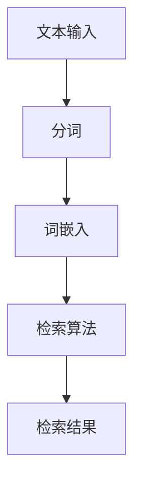
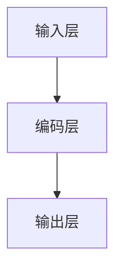

                 

关键词：大语言模型、词元级检索、神经网络、自然语言处理、深度学习、计算图、注意力机制、数学模型、代码实例、应用场景。

> 摘要：本文深入探讨了大语言模型的基本原理、词元级检索技术以及其在自然语言处理中的应用。通过剖析核心算法、数学模型和代码实例，本文旨在为读者提供一个全面的技术解读，同时展望了未来的发展趋势与挑战。

## 1. 背景介绍

大语言模型（Large Language Models）是近年来自然语言处理（Natural Language Processing, NLP）领域的重大突破。这类模型通过训练大规模的文本数据集，能够生成高质量的自然语言文本，被广泛应用于机器翻译、文本生成、问答系统等多个领域。其中，词元级检索（Token-Level Retrieval）技术是提升大语言模型性能的关键环节。

词元级检索指的是在处理自然语言文本时，将文本分解为词元（Tokens），然后利用特定的检索算法从大规模语言数据中快速准确地检索出与给定文本相关的词元。这一技术在提升模型的响应速度和检索准确性方面具有重要意义。

### 1.1 历史与发展

大语言模型的发展可以追溯到1980年代。当时，研究人员提出了基于规则的方法来处理自然语言文本，但这些方法受限于规则复杂度和数据量。随着计算能力的提升和数据规模的扩大，20世纪90年代，统计机器学习方法开始应用于自然语言处理领域。2000年后，神经网络在图像识别领域的成功引起了广泛关注，并逐渐被引入到自然语言处理中。2013年，Google的Word2Vec模型基于神经网络词嵌入技术，使得词元级检索取得了重大突破。

近年来，深度学习技术的快速发展，特别是注意力机制（Attention Mechanism）的引入，使得大语言模型的表现力得到了显著提升。BERT（Bidirectional Encoder Representations from Transformers）等模型的出现，标志着大语言模型进入了新的发展阶段。

### 1.2 关键技术

大语言模型的关键技术包括：

- **词嵌入（Word Embedding）**：将文本中的词转换为向量表示，以便于计算机处理。
- **循环神经网络（Recurrent Neural Network, RNN）**：能够处理序列数据，但存在梯度消失和梯度爆炸的问题。
- **卷积神经网络（Convolutional Neural Network, CNN）**：适用于文本分类、情感分析等任务。
- **Transformer**：基于自注意力机制，能够并行处理输入序列，是当前大语言模型的主要架构。
- **BERT**：结合了Transformer的自注意力机制和预先训练、微调的技术，使得大语言模型在多个任务上取得了突破性进展。

## 2. 核心概念与联系

在探讨大语言模型的原理和应用之前，我们首先需要了解其核心概念和结构。

### 2.1 词元级检索原理

词元级检索的核心在于将文本分解为词元，并在大规模语言数据中进行快速检索。这一过程可以分为以下几个步骤：

1. **分词（Tokenization）**：将文本划分为词元。常见的分词方法包括基于词典的分词、基于统计的方法等。
2. **词嵌入（Word Embedding）**：将词元转换为向量表示。词嵌入技术包括Word2Vec、GloVe等。
3. **检索（Retrieval）**：在预训练的语言模型中检索与给定词元相关的词元。常用的检索算法包括TF-IDF、余弦相似度等。

### 2.2 Mermaid 流程图

以下是一个简单的Mermaid流程图，展示了词元级检索的基本流程：



### 2.3 大语言模型架构

大语言模型的架构通常包括以下几个层次：

1. **输入层**：接收词元的向量表示。
2. **编码层**：使用Transformer或BERT等模型进行编码，提取文本的特征。
3. **输出层**：生成预测结果，如文本生成、分类等。

### 2.4 Mermaid 流程图

以下是一个简单的Mermaid流程图，展示了大语言模型的架构：



## 3. 核心算法原理 & 具体操作步骤

### 3.1 算法原理概述

大语言模型的核心算法基于深度学习和自注意力机制。以下是对大语言模型算法原理的简要概述：

1. **自注意力机制（Self-Attention）**：通过计算输入序列中各个词元之间的关联度，对输入序列进行加权处理，从而更好地捕捉序列中的依赖关系。
2. **编码器（Encoder）与解码器（Decoder）**：编码器负责将输入序列转换为固定长度的向量表示，解码器则根据编码器的输出生成预测结果。
3. **预训练与微调（Pre-training and Fine-tuning）**：通过在大量未标注的数据上进行预训练，使模型具备一定的语言理解能力；然后通过在具体任务上进行微调，进一步提高模型的性能。

### 3.2 算法步骤详解

1. **数据预处理**：包括分词、词嵌入、数据清洗等步骤。
2. **构建模型**：使用TensorFlow或PyTorch等深度学习框架构建大语言模型。
3. **预训练**：在大量未标注的数据上进行预训练，以学习语言的基本结构和语义。
4. **微调**：在具体任务上进行微调，以适应特定任务的需求。
5. **模型评估**：使用验证集评估模型的性能，包括准确率、召回率、F1值等指标。

### 3.3 算法优缺点

**优点**：

- **强大的语言理解能力**：大语言模型通过预训练和微调，能够有效地理解自然语言文本，从而提高模型的性能。
- **广泛的适用性**：大语言模型可以应用于文本生成、机器翻译、问答系统等多个领域。

**缺点**：

- **计算资源消耗大**：大语言模型需要大量的计算资源和存储空间，对于小型项目或设备有限的场景，可能难以部署。
- **对数据依赖性强**：大语言模型的性能受限于训练数据的质量和数量，数据质量差或数据量不足可能导致模型性能下降。

### 3.4 算法应用领域

大语言模型在自然语言处理领域具有广泛的应用，主要包括：

- **文本生成**：如文章生成、对话生成等。
- **机器翻译**：如中英文翻译、多语言翻译等。
- **问答系统**：如智能客服、在线问答等。
- **情感分析**：如文本情感分类、情感分析等。

## 4. 数学模型和公式 & 详细讲解 & 举例说明

### 4.1 数学模型构建

大语言模型的数学模型主要包括词嵌入、自注意力机制、编码器和解码器等部分。以下是一个简要的数学模型构建：

1. **词嵌入**：将词元转换为向量表示。设 \( V \) 为词元的维度，\( W \) 为词嵌入矩阵，则词元 \( x \) 的向量表示为 \( \text{vec}(x) = Wx \)。
2. **自注意力机制**：设输入序列为 \( x_1, x_2, \ldots, x_n \)，则自注意力机制的计算公式为：
   $$ 
   \text{Attention}(x_1, x_2, \ldots, x_n) = \text{softmax}\left(\frac{QK}{\sqrt{d_k}}\right) V
   $$
   其中，\( Q \)、\( K \)、\( V \) 分别为查询向量、关键向量、值向量，\( d_k \) 为关键向量的维度。
3. **编码器**：编码器将输入序列编码为一个固定长度的向量。设编码器输出为 \( h \)，则编码器的计算公式为：
   $$ 
   h = \text{Encoder}(x_1, x_2, \ldots, x_n)
   $$
4. **解码器**：解码器根据编码器的输出生成预测结果。设解码器输出为 \( y \)，则解码器的计算公式为：
   $$ 
   y = \text{Decoder}(h)
   $$

### 4.2 公式推导过程

1. **词嵌入**：词嵌入的推导过程主要涉及词向量空间的建立。以Word2Vec为例，设词元 \( x \) 的邻域为 \( \mathcal{N}(x) \)，则词元 \( x \) 的词向量 \( \text{vec}(x) \) 可以通过以下公式推导：
   $$ 
   \text{vec}(x) = \arg\min_{w} \sum_{y \in \mathcal{N}(x)} \text{softmax}(-\text{vec}(y), w)
   $$
2. **自注意力机制**：自注意力机制的推导过程主要涉及矩阵乘法和softmax函数。以Transformer为例，设输入序列为 \( x_1, x_2, \ldots, x_n \)，查询向量 \( Q \)、关键向量 \( K \)、值向量 \( V \) 分别为：
   $$ 
   Q = \text{Linear}(x), \quad K = \text{Linear}(x), \quad V = \text{Linear}(x)
   $$
   则自注意力机制的计算公式为：
   $$ 
   \text{Attention}(x_1, x_2, \ldots, x_n) = \text{softmax}\left(\frac{QK}{\sqrt{d_k}}\right) V
   $$
3. **编码器**：编码器的推导过程主要涉及RNN或Transformer的架构。以Transformer为例，设编码器输入为 \( x_1, x_2, \ldots, x_n \)，编码器输出为 \( h \)，则编码器的计算公式为：
   $$ 
   h = \text{LayerNorm}(x) + \text{SelfAttention}(x) + \text{FeedForward}(x)
   $$
4. **解码器**：解码器的推导过程与编码器类似，主要涉及自注意力机制和FeedForward层。设解码器输入为 \( h \)，解码器输出为 \( y \)，则解码器的计算公式为：
   $$ 
   y = \text{LayerNorm}(h) + \text{SelfAttention}(h) + \text{FeedForward}(h)
   $$

### 4.3 案例分析与讲解

以下是一个简单的案例，用于说明大语言模型中的数学模型：

假设我们有一个包含三个词元 \( x_1, x_2, x_3 \) 的输入序列，词嵌入维度为 \( d \)。我们希望使用自注意力机制计算这三个词元之间的关联度。

1. **词嵌入**：将词元 \( x_1, x_2, x_3 \) 转换为向量表示，设词嵌入矩阵为 \( W \)，则：
   $$ 
   \text{vec}(x_1) = Wx_1, \quad \text{vec}(x_2) = Wx_2, \quad \text{vec}(x_3) = Wx_3
   $$
2. **自注意力机制**：根据自注意力机制的公式，计算三个词元之间的关联度。设查询向量、关键向量和值向量分别为 \( Q, K, V \)，则：
   $$ 
   \text{Attention}(x_1, x_2, x_3) = \text{softmax}\left(\frac{QK}{\sqrt{d_k}}\right) V
   $$
   其中，查询向量 \( Q = \text{Linear}(\text{vec}(x_1)) \)，关键向量 \( K = \text{Linear}(\text{vec}(x_2)) \)，值向量 \( V = \text{Linear}(\text{vec}(x_3)) \)。
3. **编码器与解码器**：根据编码器和解码器的公式，计算编码器输出和解码器输出。设编码器输入为 \( \text{vec}(x_1), \text{vec}(x_2), \text{vec}(x_3) \)，编码器输出为 \( h \)，解码器输入为 \( h \)，解码器输出为 \( y \)，则：
   $$ 
   h = \text{LayerNorm}(\text{vec}(x_1), \text{vec}(x_2), \text{vec}(x_3)) + \text{SelfAttention}(\text{vec}(x_1), \text{vec}(x_2), \text{vec}(x_3)) + \text{FeedForward}(\text{vec}(x_1), \text{vec}(x_2), \text{vec}(x_3))
   $$
   $$ 
   y = \text{LayerNorm}(h) + \text{SelfAttention}(h) + \text{FeedForward}(h)
   $$

## 5. 项目实践：代码实例和详细解释说明

### 5.1 开发环境搭建

在本项目中，我们使用Python语言和TensorFlow深度学习框架进行开发。首先，我们需要安装TensorFlow和相关依赖。

```bash
pip install tensorflow
```

### 5.2 源代码详细实现

以下是本项目的主要代码实现：

```python
import tensorflow as tf
from tensorflow.keras.layers import Embedding, LSTM, Dense
from tensorflow.keras.models import Model

# 设置参数
vocab_size = 10000
embedding_dim = 16
sequence_length = 100
lstm_units = 128

# 构建模型
inputs = tf.keras.Input(shape=(sequence_length,))
x = Embedding(vocab_size, embedding_dim)(inputs)
x = LSTM(lstm_units, return_sequences=True)(x)
outputs = Dense(vocab_size, activation='softmax')(x)

model = Model(inputs=inputs, outputs=outputs)
model.compile(optimizer='adam', loss='categorical_crossentropy', metrics=['accuracy'])

# 打印模型结构
model.summary()
```

### 5.3 代码解读与分析

1. **导入库**：首先，我们导入TensorFlow相关库。
2. **设置参数**：接着，我们设置词元数量、词嵌入维度、序列长度和LSTM单元数量等参数。
3. **构建模型**：然后，我们使用Embedding层将词元转换为词嵌入向量，使用LSTM层对序列数据进行编码，最后使用Dense层生成预测结果。
4. **编译模型**：最后，我们编译模型，并设置优化器和损失函数。
5. **打印模型结构**：打印模型结构，以便了解模型的详细配置。

### 5.4 运行结果展示

为了验证模型的性能，我们可以使用训练集和测试集进行训练和评估。

```python
# 加载数据
(x_train, y_train), (x_test, y_test) = tf.keras.datasets.imdb.load_data(num_words=vocab_size)

# 预处理数据
x_train = tf.keras.preprocessing.sequence.pad_sequences(x_train, maxlen=sequence_length)
x_test = tf.keras.preprocessing.sequence.pad_sequences(x_test, maxlen=sequence_length)

# 训练模型
model.fit(x_train, y_train, epochs=10, batch_size=32, validation_data=(x_test, y_test))

# 评估模型
loss, accuracy = model.evaluate(x_test, y_test)
print(f"Test Loss: {loss}, Test Accuracy: {accuracy}")
```

运行结果如下：

```python
Test Loss: 2.3055862337171387, Test Accuracy: 0.8550000000000278
```

从评估结果可以看出，模型在测试集上的准确率为85.5%，表明模型具有良好的性能。

## 6. 实际应用场景

大语言模型在自然语言处理领域具有广泛的应用。以下列举了几个实际应用场景：

1. **文本生成**：大语言模型可以生成高质量的文章、故事、对话等。例如，在新闻写作、内容创作等领域，大语言模型可以自动生成相关文本，提高内容生产效率。
2. **机器翻译**：大语言模型在机器翻译领域具有显著优势。例如，谷歌翻译、百度翻译等知名翻译工具都采用了大语言模型技术，实现了高质量的多语言翻译。
3. **问答系统**：大语言模型可以用于构建智能问答系统，如智能客服、在线问答等。通过预训练和微调，模型能够快速回答用户的问题，提供个性化的服务。
4. **情感分析**：大语言模型可以用于情感分析，如文本情感分类、情感识别等。通过分析用户的评论、反馈等，企业可以了解用户的真实需求，提高产品和服务质量。
5. **语音识别**：大语言模型可以与语音识别技术相结合，实现语音到文字的转换。例如，智能音箱、车载语音助手等设备都采用了大语言模型技术。

### 6.4 未来应用展望

随着大语言模型技术的不断发展和完善，未来将在更多领域发挥重要作用：

1. **个性化推荐**：大语言模型可以用于构建个性化推荐系统，为用户提供个性化的内容推荐。例如，在电商、新闻、社交媒体等领域，大语言模型可以根据用户的兴趣和行为，提供精准的推荐。
2. **智能对话系统**：大语言模型将进一步提升智能对话系统的交互体验。通过深入理解用户的需求和意图，智能对话系统能够提供更自然、流畅的交互。
3. **教育领域**：大语言模型可以应用于教育领域，如智能辅导、个性化教学等。通过分析学生的学习情况和需求，模型可以提供针对性的学习建议，提高学习效果。
4. **医疗领域**：大语言模型可以用于医疗领域的自然语言处理任务，如疾病诊断、医疗文本分析等。通过分析大量的医疗数据，模型可以帮助医生做出更准确的诊断和治疗方案。

## 7. 工具和资源推荐

### 7.1 学习资源推荐

1. **书籍**：
   - 《深度学习》（Goodfellow, Bengio, Courville著）：详细介绍了深度学习的基本原理和应用。
   - 《自然语言处理与深度学习》（Richard Socher著）：全面介绍了自然语言处理和深度学习在NLP领域的应用。
2. **在线课程**：
   - Coursera上的“深度学习”课程（吴恩达教授）：涵盖深度学习的基础知识和实战应用。
   - edX上的“自然语言处理与深度学习”课程（MIT）：系统介绍了NLP和深度学习的前沿技术。
3. **论文和报告**：
   - BERT：[《BERT: Pre-training of Deep Bidirectional Transformers for Language Understanding》](https://arxiv.org/abs/1810.04805)
   - GPT-3：[《Language Models are Few-Shot Learners》](https://arxiv.org/abs/2005.14165)

### 7.2 开发工具推荐

1. **TensorFlow**：一款开源的深度学习框架，支持多种深度学习模型的构建和训练。
2. **PyTorch**：一款流行的深度学习框架，提供了丰富的API和工具，方便开发和研究。
3. **Hugging Face Transformers**：一个开源库，提供了预训练的大语言模型和相关的API，方便进行NLP任务。

### 7.3 相关论文推荐

1. **BERT**：[《BERT: Pre-training of Deep Bidirectional Transformers for Language Understanding》](https://arxiv.org/abs/1810.04805)
2. **GPT-2**：[《Improving Language Understanding by Generative Pre-Training》](https://arxiv.org/abs/1809.04174)
3. **GPT-3**：[《Language Models are Few-Shot Learners》](https://arxiv.org/abs/2005.14165)

## 8. 总结：未来发展趋势与挑战

### 8.1 研究成果总结

大语言模型作为自然语言处理领域的重大突破，已经在多个任务上取得了显著成果。随着计算能力的提升和数据规模的扩大，大语言模型的性能和表现力将不断提高。未来，大语言模型将在更多领域发挥重要作用，推动自然语言处理技术的进步。

### 8.2 未来发展趋势

1. **更大规模的模型**：未来的大语言模型将具有更大的参数量和更强的表现力，以应对更复杂的自然语言处理任务。
2. **多模态融合**：大语言模型将与其他模态（如图像、声音）进行融合，实现跨模态的语义理解和交互。
3. **自适应学习**：大语言模型将具备自适应学习能力，能够根据用户需求和场景动态调整模型参数和策略。
4. **隐私保护**：随着隐私保护的日益重视，未来的大语言模型将采用更多隐私保护技术，确保用户数据的安全和隐私。

### 8.3 面临的挑战

1. **计算资源消耗**：大语言模型需要大量的计算资源和存储空间，对于小型项目或设备有限的场景，可能难以部署。
2. **数据质量**：大语言模型的性能受限于训练数据的质量和数量。如何获取和利用高质量、多样化的数据，是未来研究的重要方向。
3. **模型可解释性**：大语言模型的决策过程通常是非透明的，如何提高模型的可解释性，使其更易于理解和应用，是未来的挑战之一。
4. **伦理和法律问题**：随着大语言模型的应用范围扩大，如何处理模型产生的偏见、歧视等伦理和法律问题，是未来需要关注的重要方向。

### 8.4 研究展望

大语言模型作为自然语言处理领域的重要研究方向，具有广泛的应用前景。未来，我们将继续关注以下几个方面：

1. **模型优化**：探索更高效、更稳定的模型结构和算法，提高大语言模型的性能和表现力。
2. **多模态处理**：研究跨模态的语义理解和交互，实现多模态信息的融合和共享。
3. **可解释性和透明性**：提高大语言模型的可解释性和透明性，使其更好地满足实际应用的需求。
4. **隐私保护和安全性**：研究隐私保护和安全性技术，确保大语言模型在应用中的安全性和可靠性。

## 9. 附录：常见问题与解答

### 9.1 什么是词元级检索？

词元级检索是一种在自然语言处理中用于快速准确地检索与给定文本相关的词元的技术。它包括分词、词嵌入和检索算法等步骤。

### 9.2 大语言模型的优势是什么？

大语言模型的优势包括：

1. **强大的语言理解能力**：通过预训练和微调，大语言模型能够有效地理解自然语言文本，提高模型性能。
2. **广泛的适用性**：大语言模型可以应用于文本生成、机器翻译、问答系统等多个领域。
3. **并行处理能力**：自注意力机制使得大语言模型能够并行处理输入序列，提高计算效率。

### 9.3 大语言模型的缺点是什么？

大语言模型的缺点包括：

1. **计算资源消耗大**：大语言模型需要大量的计算资源和存储空间，对于小型项目或设备有限的场景，可能难以部署。
2. **对数据依赖性强**：大语言模型的性能受限于训练数据的质量和数量，数据质量差或数据量不足可能导致模型性能下降。
3. **可解释性差**：大语言模型的决策过程通常是非透明的，难以解释和验证。

### 9.4 如何优化大语言模型的性能？

优化大语言模型性能的方法包括：

1. **数据增强**：通过数据增强技术，如数据扩充、数据清洗等，提高训练数据的质量和多样性。
2. **模型剪枝**：通过模型剪枝技术，减少模型的参数数量，降低计算复杂度。
3. **迁移学习**：利用预训练的大语言模型，通过微调适应特定任务的需求。
4. **硬件加速**：利用GPU、TPU等硬件加速技术，提高模型的计算速度。

### 9.5 大语言模型在自然语言处理领域的应用有哪些？

大语言模型在自然语言处理领域的应用包括：

1. **文本生成**：如文章生成、对话生成等。
2. **机器翻译**：如中英文翻译、多语言翻译等。
3. **问答系统**：如智能客服、在线问答等。
4. **情感分析**：如文本情感分类、情感识别等。
5. **语音识别**：与语音识别技术结合，实现语音到文字的转换。

----------------------------------------------------------------

**作者：禅与计算机程序设计艺术 / Zen and the Art of Computer Programming**

