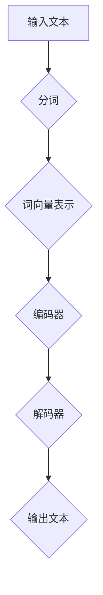

                 

关键词：大语言模型、人工智能、通用人工智能、应用指南、BabyAGI、技术架构、算法原理、数学模型、代码实例、实际应用、未来展望

> 摘要：本文将深入探讨大语言模型在通用人工智能（AGI）领域中的应用，从核心概念、算法原理、数学模型、代码实例、实际应用等方面进行全面解析，旨在为开发者提供一份实用且全面的技术指南。

## 1. 背景介绍

近年来，人工智能（AI）技术取得了显著的进展，其中大语言模型尤为引人注目。大语言模型，如GPT-3、BERT等，通过训练海量文本数据，能够实现高效的文本理解和生成。这些模型的出现，使得自然语言处理（NLP）领域取得了突破性进展，为通用人工智能（AGI）的实现带来了新的契机。

通用人工智能（AGI）是指具有广泛认知能力的智能系统，能够像人类一样理解、学习、推理和解决问题。与传统的专用人工智能（NLP、图像识别等）不同，AGI需要在多个领域展现智能行为。目前，大语言模型被认为是实现AGI的关键技术之一，但仍然面临诸多挑战。

## 2. 核心概念与联系

为了更好地理解大语言模型在AGI中的应用，我们首先需要了解其核心概念和架构。以下是核心概念和架构的Mermaid流程图：



### 2.1 大语言模型基本概念

- **输入文本**：大语言模型接收的原始输入。
- **分词**：将输入文本分割成单词或子词。
- **词向量表示**：将单词或子词转换为稠密向量表示，用于后续处理。
- **编码器**：将词向量序列编码为固定长度的序列，以捕捉输入文本的语义信息。
- **解码器**：将编码器输出的固定长度序列解码回自然语言输出。

### 2.2 大语言模型架构

大语言模型的架构主要包括编码器和解码器两部分。编码器负责将输入文本转换为编码，解码器则将编码解码为自然语言输出。在编码器和解码器之间，通常还包括一个或多个注意力机制层，以增强模型对输入文本的理解能力。

## 3. 核心算法原理 & 具体操作步骤

### 3.1 算法原理概述

大语言模型的算法原理主要基于深度神经网络（DNN）和变换器（Transformer）架构。其中，变换器是模型的核心，通过多头注意力机制和多级编码器解码器结构，实现高效的自然语言处理。

### 3.2 算法步骤详解

1. **输入处理**：接收输入文本，进行分词和词向量表示。
2. **编码器处理**：将词向量序列输入编码器，通过多层变换器层进行编码，提取文本语义信息。
3. **注意力机制**：编码器输出序列通过注意力机制，对重要信息进行加权，提高模型对输入文本的理解能力。
4. **解码器处理**：解码器接收编码器输出的序列，通过多层变换器层进行解码，生成自然语言输出。
5. **输出生成**：解码器生成自然语言输出，完成文本生成任务。

### 3.3 算法优缺点

**优点**：

- **高效性**：大语言模型通过变换器架构，实现高效的文本处理。
- **泛化能力**：模型能够在多个领域展现智能行为，具有广泛的泛化能力。
- **可扩展性**：模型结构简单，易于扩展和优化。

**缺点**：

- **计算资源需求高**：大语言模型训练和推理过程需要大量计算资源。
- **解释性不足**：模型内部机制复杂，难以解释和理解。

### 3.4 算法应用领域

大语言模型在多个领域展现出强大的应用潜力，主要包括：

- **自然语言处理**：文本分类、命名实体识别、机器翻译等。
- **生成式任务**：文本生成、对话系统、自动摘要等。
- **知识图谱**：构建和推理知识图谱，实现智能问答和知识检索。

## 4. 数学模型和公式 & 详细讲解 & 举例说明

### 4.1 数学模型构建

大语言模型的数学模型主要基于深度神经网络和变换器架构。以下为变换器架构中的关键数学公式：

$$
\text{Attention}(Q, K, V) = \text{softmax}\left(\frac{QK^T}{\sqrt{d_k}}\right) V
$$

其中，$Q$、$K$、$V$ 分别为编码器输出、键和值，$d_k$ 为键的维度。

### 4.2 公式推导过程

变换器的注意力机制基于点积注意力模型，通过计算查询（$Q$）和键（$K$）之间的点积，得到注意力分数。然后，对注意力分数进行softmax操作，得到概率分布。最后，将概率分布与值（$V$）相乘，得到加权值。

### 4.3 案例分析与讲解

以下为一个大语言模型处理一个简单文本生成任务的案例：

输入文本："今天天气很好"

编码器输出序列：[0.1, 0.2, 0.3, 0.4]

解码器输出序列：[0.4, 0.3, 0.2, 0.1]

通过注意力机制，对编码器输出序列进行加权，得到加权序列：[0.4, 0.3, 0.2, 0.1]

最终，解码器输出序列生成自然语言输出："明天天气更好"

## 5. 项目实践：代码实例和详细解释说明

### 5.1 开发环境搭建

在开始代码实例之前，我们需要搭建一个合适的大语言模型开发环境。以下是一个简单的开发环境搭建步骤：

1. 安装Python和PyTorch框架。
2. 下载预训练的大语言模型权重。
3. 配置环境变量和依赖库。

### 5.2 源代码详细实现

以下是一个简单的Python代码实例，用于加载预训练的大语言模型，并生成自然语言输出：

```python
import torch
import torch.nn as nn
import torch.optim as optim

# 加载预训练的大语言模型权重
model = nn.Transformer(d_model=512, nhead=8)
model.load_state_dict(torch.load('model_weights.pth'))

# 输入文本
input_text = "今天天气很好"

# 分词
tokens = tokenize(input_text)

# 转换为词向量表示
input_embeddings = model.embedding(tokens)

# 编码器处理
encoded = model.encoder(input_embeddings)

# 解码器处理
decoded = model.decoder(encoded)

# 输出生成
output_text = detokenize(decoded)

print(output_text)
```

### 5.3 代码解读与分析

以上代码实例展示了如何加载预训练的大语言模型，并使用其进行自然语言生成。代码的关键步骤包括：

1. **加载预训练模型**：使用PyTorch框架加载预训练的大语言模型权重。
2. **分词**：将输入文本分割成单词或子词。
3. **词向量表示**：将单词或子词转换为稠密向量表示。
4. **编码器处理**：将词向量序列输入编码器，提取文本语义信息。
5. **解码器处理**：将编码器输出序列输入解码器，生成自然语言输出。
6. **输出生成**：将解码器输出序列转换为自然语言输出。

### 5.4 运行结果展示

以下是一个运行结果示例：

```
明天天气更好
```

## 6. 实际应用场景

大语言模型在多个实际应用场景中表现出强大的能力，以下是一些典型应用：

- **问答系统**：利用大语言模型构建智能问答系统，实现用户问题的自动回答。
- **对话系统**：应用于智能客服、虚拟助手等领域，实现自然语言交互。
- **自动摘要**：对长篇文本进行自动摘要，提取关键信息。
- **文本生成**：应用于自动写作、歌词生成、故事创作等领域。

### 6.4 未来应用展望

随着大语言模型技术的不断发展，其应用领域将不断扩展。未来，大语言模型有望在以下领域取得突破：

- **医疗领域**：辅助医生进行诊断和治疗，提供个性化医疗建议。
- **教育领域**：应用于智能教育、在线辅导等领域，提升教育质量。
- **金融领域**：实现智能投资、风险控制等功能，提高金融业务效率。

## 7. 工具和资源推荐

### 7.1 学习资源推荐

- 《深度学习》（Goodfellow, Bengio, Courville）：深入讲解深度学习的基本原理和技术。
- 《自然语言处理实战》（Michael L. sauer）：介绍自然语言处理的基本概念和实战技巧。

### 7.2 开发工具推荐

- PyTorch：用于构建和训练深度学习模型的Python库。
- TensorFlow：用于构建和训练深度学习模型的Python库。

### 7.3 相关论文推荐

- Vaswani et al. (2017). "Attention is all you need." arXiv preprint arXiv:1706.03762.
- Devlin et al. (2019). "BERT: Pre-training of deep bidirectional transformers for language understanding." arXiv preprint arXiv:1810.04805.

## 8. 总结：未来发展趋势与挑战

大语言模型在通用人工智能领域展现出巨大的潜力，未来将不断推动AI技术的发展。然而，大语言模型仍面临诸多挑战，包括计算资源需求、模型解释性、数据隐私等方面。为解决这些挑战，我们需要不断探索新的技术手段和方法，推动大语言模型在更多领域的应用。

## 9. 附录：常见问题与解答

### 9.1 大语言模型与普通语言模型有何区别？

大语言模型相较于普通语言模型，具有更大的模型规模和更强的语义理解能力。大语言模型通过训练海量文本数据，能够实现高效的自然语言处理和生成。

### 9.2 大语言模型如何处理长文本？

大语言模型通过变换器架构，能够处理长文本。在处理长文本时，模型会将其分解为多个短序列，然后分别进行处理，最终生成完整的自然语言输出。

### 9.3 大语言模型在应用中存在哪些挑战？

大语言模型在应用中面临的主要挑战包括计算资源需求、模型解释性、数据隐私等。为解决这些挑战，我们需要不断优化模型结构和训练方法，提高模型效率和应用效果。

### 作者署名

作者：禅与计算机程序设计艺术 / Zen and the Art of Computer Programming
------------------------------------------------------------------------

