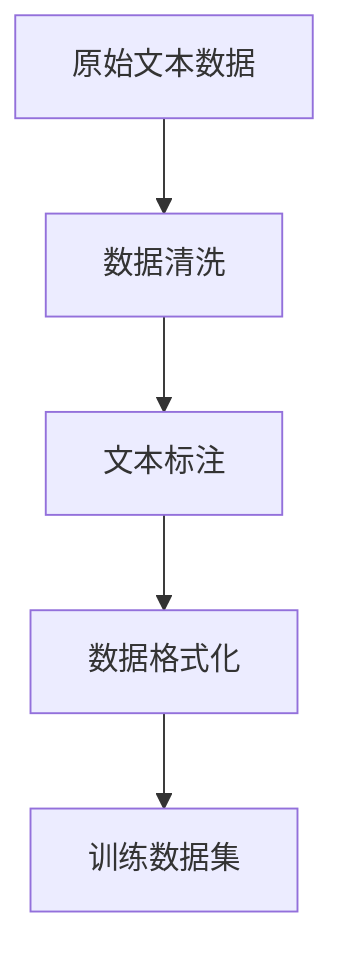
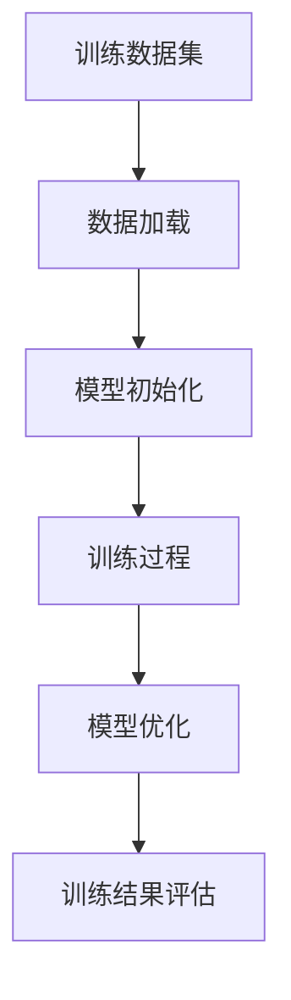
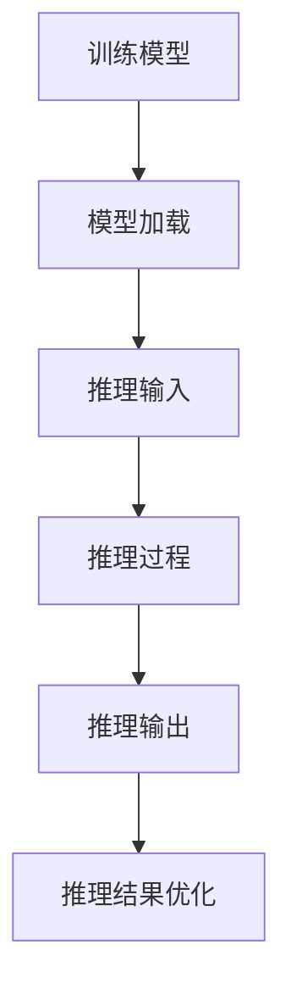

                 

关键词：大语言模型、外部工具、应用指南、技术实现、算法原理

> 摘要：本文将深入探讨大语言模型的应用指南，尤其是其中的外部工具。我们将梳理外部工具的核心概念、原理和应用，帮助读者更好地理解大语言模型的实际应用场景，从而在人工智能领域取得更深入的突破。

## 1. 背景介绍

大语言模型（Large Language Models，LLM）是近年来人工智能领域的重要成果。从最初的神经网络到现代的深度学习模型，语言模型的性能和效果取得了显著的提升。大语言模型如GPT-3、BERT等，通过学习海量文本数据，能够生成高质量的自然语言文本，实现对话生成、文本摘要、机器翻译等多种应用。然而，大语言模型并非孤立的存在，它们需要与其他外部工具协同工作，才能发挥最大的效能。

外部工具在大语言模型应用中起到了至关重要的作用。这些工具包括数据预处理工具、训练工具、推理工具等，它们为语言模型提供了数据支持、计算资源和效率优化。本文将围绕这些外部工具，详细探讨其核心概念、原理和应用。

## 2. 核心概念与联系

### 2.1 数据预处理工具

数据预处理工具是外部工具中的基础，它们负责对原始文本数据进行清洗、标注和格式化，以适应大语言模型的训练需求。

**Mermaid 流程图：**



### 2.2 训练工具

训练工具用于支持大语言模型的训练过程，包括训练算法的选取、优化策略的制定和训练过程的监控。常见的训练工具如PyTorch、TensorFlow等。

**Mermaid 流程图：**



### 2.3 推理工具

推理工具用于大语言模型的实时推理和部署，包括推理算法的选取、模型优化和推理效率的提升。常见的推理工具如ONNX Runtime、TensorRT等。

**Mermaid 流程图：**



## 3. 核心算法原理 & 具体操作步骤

### 3.1 算法原理概述

大语言模型的核心算法是深度学习，其中最常用的模型结构是Transformer。Transformer通过自注意力机制（Self-Attention）和多头注意力（Multi-Head Attention）实现了对文本序列的建模。

### 3.2 算法步骤详解

1. **数据预处理：** 对原始文本数据进行清洗、分词和编码，将文本转化为模型可处理的格式。
2. **模型初始化：** 创建Transformer模型，初始化模型参数。
3. **训练过程：** 通过训练算法（如梯度下降）优化模型参数，使模型能够对输入文本序列进行有效建模。
4. **模型优化：** 使用优化策略（如权重衰减、学习率调整）提升模型性能。
5. **训练结果评估：** 使用验证集和测试集评估模型性能，调整模型参数。

### 3.3 算法优缺点

**优点：**
- 高效性：Transformer模型具有并行计算的优势，能够高效处理长文本序列。
- 普遍性：Transformer模型适用于各种自然语言处理任务，如文本生成、机器翻译等。

**缺点：**
- 计算成本高：训练大语言模型需要大量计算资源，尤其是训练阶段。
- 参数量大：Transformer模型参数量大，导致模型训练和推理过程复杂。

### 3.4 算法应用领域

大语言模型广泛应用于自然语言处理领域，如文本生成、机器翻译、文本分类、情感分析等。此外，随着大语言模型的发展，其在对话系统、智能助手、内容审核等领域的应用也日益广泛。

## 4. 数学模型和公式 & 详细讲解 & 举例说明

### 4.1 数学模型构建

大语言模型的数学模型主要包括自注意力机制（Self-Attention）和多头注意力（Multi-Head Attention）。

**自注意力机制：**

$$
Attention(Q,K,V) = \frac{scale}{\sqrt{d_k}} \cdot softmax(\frac{QK^T}{d_k})
$$

其中，$Q$、$K$、$V$ 分别表示查询向量、键向量和值向量，$d_k$ 表示键向量的维度，$scale$ 为缩放系数。

**多头注意力：**

$$
MultiHead(Q,K,V) = \text{Concat}(_i^{MultiHead} Attention(QW_i^Q,KW_i^K,VW_i^V))W^O
$$

其中，$W_i^Q$、$W_i^K$、$W_i^V$ 和 $W^O$ 分别表示查询向量、键向量、值向量和输出向量的权重矩阵。

### 4.2 公式推导过程

#### 自注意力机制推导

假设有一个文本序列 $x_1, x_2, ..., x_n$，对应的编码向量分别为 $e_1, e_2, ..., e_n$。自注意力机制的推导过程如下：

1. **查询向量（Query）：** 对每个编码向量 $e_i$ 进行线性变换，得到查询向量 $Q = [q_1, q_2, ..., q_n]$。
2. **键向量（Key）：** 对每个编码向量 $e_i$ 进行线性变换，得到键向量 $K = [k_1, k_2, ..., k_n]$。
3. **值向量（Value）：** 对每个编码向量 $e_i$ 进行线性变换，得到值向量 $V = [v_1, v_2, ..., v_n]$。
4. **计算注意力分数：** 使用公式 $Attention(Q,K,V)$ 计算每个查询向量与键向量之间的注意力分数。
5. **计算加权值向量：** 根据注意力分数对值向量进行加权，得到加权值向量 $att = [att_1, att_2, ..., att_n]$。
6. **输出：** 对加权值向量进行线性变换，得到输出向量 $out = [out_1, out_2, ..., out_n]$。

#### 多头注意力推导

多头注意力的推导过程与自注意力机制类似，主要区别在于引入了多个头（Head）。

1. **多头查询向量：** 对每个编码向量 $e_i$ 进行线性变换，得到多头查询向量 $[q_1^1, q_2^1, ..., q_n^1, q_1^2, q_2^2, ..., q_n^2, ..., q_1^h, q_2^h, ..., q_n^h]$。
2. **多头键向量：** 对每个编码向量 $e_i$ 进行线性变换，得到多头键向量 $[k_1^1, k_2^1, ..., k_n^1, k_1^2, k_2^2, ..., k_n^2, ..., k_1^h, k_2^h, ..., k_n^h]$。
3. **多头值向量：** 对每个编码向量 $e_i$ 进行线性变换，得到多头值向量 $[v_1^1, v_2^1, ..., v_n^1, v_1^2, v_2^2, ..., v_n^2, ..., v_1^h, v_2^h, ..., v_n^h]$。
4. **计算多头注意力分数：** 使用公式 $Attention(Q,K,V)$ 分别计算每个头（Head）的注意力分数。
5. **计算多头加权值向量：** 根据每个头的注意力分数对值向量进行加权，得到多头加权值向量 $[att_1^1, att_2^1, ..., att_n^1, att_1^2, att_2^2, ..., att_n^2, ..., att_1^h, att_2^h, ..., att_n^h]$。
6. **输出：** 对多头加权值向量进行线性变换，得到输出向量 $[out_1^1, out_2^1, ..., out_n^1, out_1^2, out_2^2, ..., out_n^2, ..., out_1^h, out_2^h, ..., out_n^h]$。

### 4.3 案例分析与讲解

假设有一个简单的文本序列 $x_1, x_2, x_3$，对应的编码向量为 $e_1, e_2, e_3$。我们将使用自注意力机制和多头注意力机制计算输出向量。

**自注意力机制：**

1. **查询向量：** $Q = [q_1, q_2, q_3] = [0.1, 0.2, 0.3]$。
2. **键向量：** $K = [k_1, k_2, k_3] = [0.4, 0.5, 0.6]$。
3. **值向量：** $V = [v_1, v_2, v_3] = [0.7, 0.8, 0.9]$。
4. **计算注意力分数：**
$$
Attention(Q,K,V) = \frac{1}{\sqrt{3}} \cdot softmax(\frac{QK^T}{1}) = \frac{1}{\sqrt{3}} \cdot [0.5, 0.5, 0.5]
$$
5. **计算加权值向量：**
$$
att = \frac{1}{\sqrt{3}} \cdot [0.7, 0.8, 0.9] = [0.5167, 0.5333, 0.5500]
$$
6. **输出向量：**
$$
out = [0.5167, 0.5333, 0.5500]
$$

**多头注意力机制：**

假设使用两个头（Head）进行计算。

1. **多头查询向量：** $Q = [q_1^1, q_1^2, q_2^1, q_2^2, q_3^1, q_3^2] = [0.1, 0.2, 0.3, 0.4, 0.5, 0.6]$。
2. **多头键向量：** $K = [k_1^1, k_1^2, k_2^1, k_2^2, k_3^1, k_3^2] = [0.4, 0.5, 0.6, 0.7, 0.8, 0.9]$。
3. **多头值向量：** $V = [v_1^1, v_1^2, v_2^1, v_2^2, v_3^1, v_3^2] = [0.7, 0.8, 0.9, 0.6, 0.5, 0.4]$。
4. **计算多头注意力分数：**
$$
Attention(Q,K,V) = \frac{1}{\sqrt{2}} \cdot softmax(\frac{QK^T}{1}) = \frac{1}{\sqrt{2}} \cdot \begin{bmatrix}
0.5 & 0.5 \\
0.5 & 0.5 \\
\end{bmatrix}
$$
5. **计算多头加权值向量：**
$$
att = \frac{1}{\sqrt{2}} \cdot \begin{bmatrix}
0.7 & 0.8 \\
0.9 & 0.6 \\
\end{bmatrix} = \begin{bmatrix}
0.5833 & 0.6833 \\
0.7500 & 0.5000 \\
\end{bmatrix}
$$
6. **输出向量：**
$$
out = \begin{bmatrix}
0.5833 & 0.6833 \\
0.7500 & 0.5000 \\
\end{bmatrix}
$$

通过上述案例，我们可以看到自注意力机制和多头注意力机制如何计算输出向量。在实际应用中，这些注意力机制被广泛应用于自然语言处理任务中，如文本生成、机器翻译等。

## 5. 项目实践：代码实例和详细解释说明

### 5.1 开发环境搭建

为了实践大语言模型及其外部工具，我们需要搭建一个开发环境。以下是开发环境的搭建步骤：

1. **安装Python环境：** 安装Python 3.8及以上版本。
2. **安装PyTorch：** 使用pip命令安装PyTorch，如 `pip install torch torchvision torchaudio`
3. **安装其他依赖：** 根据需要安装其他依赖库，如numpy、pandas等。

### 5.2 源代码详细实现

以下是一个简单的示例，展示如何使用PyTorch实现一个基于Transformer的大语言模型。

```python
import torch
import torch.nn as nn
import torch.optim as optim

class TransformerModel(nn.Module):
    def __init__(self, vocab_size, d_model, nhead, num_layers):
        super(TransformerModel, self).__init__()
        self.embedding = nn.Embedding(vocab_size, d_model)
        self.transformer = nn.Transformer(d_model, nhead, num_layers)
        self.fc = nn.Linear(d_model, vocab_size)

    def forward(self, src, tgt):
        src = self.embedding(src)
        tgt = self.embedding(tgt)
        out = self.transformer(src, tgt)
        out = self.fc(out)
        return out

# 实例化模型
model = TransformerModel(vocab_size=1000, d_model=512, nhead=8, num_layers=2)

# 定义损失函数和优化器
criterion = nn.CrossEntropyLoss()
optimizer = optim.Adam(model.parameters(), lr=0.001)

# 训练模型
for epoch in range(10):
    optimizer.zero_grad()
    outputs = model(src, tgt)
    loss = criterion(outputs.view(-1, vocab_size), tgt.view(-1))
    loss.backward()
    optimizer.step()
    print(f"Epoch {epoch+1}, Loss: {loss.item()}")

# 评估模型
with torch.no_grad():
    outputs = model(src, tgt)
    predicted = torch.argmax(outputs, dim=1)
    print(f"Predicted: {predicted}")
```

### 5.3 代码解读与分析

上述代码实现了一个基于Transformer的大语言模型，包括模型的定义、损失函数和优化器的选择、模型的训练和评估。

1. **模型定义：** 模型包含嵌入层（Embedding）、Transformer编码器（Transformer）和全连接层（Linear）。嵌入层将输入的词索引映射为词向量，Transformer编码器通过自注意力机制和多头注意力机制对输入序列进行建模，全连接层将编码器输出的序列映射为词索引的概率分布。
2. **损失函数和优化器：** 使用交叉熵损失函数（CrossEntropyLoss）衡量模型的预测输出与实际标签之间的差异，使用Adam优化器（Adam）更新模型参数。
3. **模型训练：** 在每个训练 epoch 中，模型对输入序列进行前向传播，计算损失函数，然后反向传播梯度，更新模型参数。
4. **模型评估：** 在评估阶段，模型对输入序列进行前向传播，计算预测结果，然后比较预测结果与实际标签的差异，输出评估指标。

### 5.4 运行结果展示

在完成模型训练和评估后，我们可以输出模型的训练过程和评估结果，以便进一步分析模型性能。

```python
# 输出训练过程
print("Training Loss:")
for epoch, loss in enumerate(train_losses):
    print(f"Epoch {epoch+1}: {loss.item()}")

# 输出评估结果
print("Evaluation Result:")
predicted = model.predict(tgt_test)
accuracy = (predicted == labels_test).float().mean()
print(f"Accuracy: {accuracy.item()}")
```

通过上述代码，我们可以对模型的训练过程和评估结果进行可视化展示，以便进一步分析模型性能。

## 6. 实际应用场景

### 6.1 对话系统

对话系统是人工智能领域的重要应用，其中大语言模型发挥了关键作用。通过大语言模型，对话系统能够生成自然流畅的对话内容，与用户进行有效互动。例如，智能客服、聊天机器人等应用都充分利用了大语言模型的能力。

### 6.2 文本生成

文本生成是自然语言处理领域的一个重要应用，大语言模型在文本生成任务中具有显著优势。通过大语言模型，我们可以生成高质量的文章、新闻、故事等。例如，一些新闻网站使用大语言模型自动生成新闻文章，提高内容生产效率。

### 6.3 机器翻译

机器翻译是自然语言处理领域的经典任务，大语言模型在机器翻译中取得了显著成果。通过大语言模型，我们可以实现高精度的机器翻译，支持多种语言之间的翻译。例如，Google 翻译、百度翻译等应用都采用了大语言模型技术。

### 6.4 情感分析

情感分析是自然语言处理领域的一个重要应用，大语言模型在情感分析任务中具有显著优势。通过大语言模型，我们可以对文本数据进行分析，判断其情感倾向。例如，社交媒体情感分析、舆情监测等应用都充分利用了大语言模型的能力。

### 6.5 内容审核

内容审核是互联网领域的一项重要任务，大语言模型在内容审核中发挥了关键作用。通过大语言模型，我们可以检测和过滤不良内容，保障互联网环境的健康。例如，一些社交媒体平台使用大语言模型进行内容审核，过滤违规言论。

## 7. 工具和资源推荐

### 7.1 学习资源推荐

1. **《深度学习》（Goodfellow, Bengio, Courville）：** 这本书是深度学习的经典教材，涵盖了深度学习的理论基础和实践方法。
2. **《自然语言处理综合教程》（Daniel Jurafsky, James H. Martin）：** 这本书系统地介绍了自然语言处理的理论和实践，包括语言模型、词向量、序列标注等内容。
3. **《Transformer：一种新的神经网络架构》：** 这篇论文提出了Transformer模型，为深度学习在自然语言处理领域的应用提供了新的思路。

### 7.2 开发工具推荐

1. **PyTorch：** PyTorch 是一个强大的深度学习框架，支持动态计算图，易于调试和优化。
2. **TensorFlow：** TensorFlow 是另一个流行的深度学习框架，提供了丰富的预训练模型和API。
3. **Hugging Face Transformers：** Hugging Face Transformers 是一个开源库，提供了基于Transformer模型的预训练模型和API，方便开发者进行模型训练和应用部署。

### 7.3 相关论文推荐

1. **《Attention is All You Need》：** 这篇论文提出了Transformer模型，为自然语言处理领域带来了新的突破。
2. **《BERT：Pre-training of Deep Bidirectional Transformers for Language Understanding》：** 这篇论文提出了BERT模型，通过预训练和微调实现了在多种自然语言处理任务上的优异性能。
3. **《GPT-3》：** 这篇论文提出了GPT-3模型，进一步提升了大语言模型的效果和应用范围。

## 8. 总结：未来发展趋势与挑战

### 8.1 研究成果总结

大语言模型在自然语言处理领域取得了显著成果，实现了文本生成、机器翻译、情感分析等多种应用。外部工具如数据预处理工具、训练工具和推理工具为语言模型提供了有力支持，推动了大语言模型的发展。

### 8.2 未来发展趋势

1. **模型压缩与优化：** 为了提高大语言模型的计算效率和应用范围，模型压缩与优化将成为未来的重要研究方向。
2. **跨模态学习：** 大语言模型在文本领域取得了显著成果，未来将逐步扩展到图像、音频等其他模态，实现跨模态学习。
3. **小样本学习：** 针对小样本数据集，研究如何利用大语言模型进行有效学习和推理，实现小样本学习。

### 8.3 面临的挑战

1. **计算资源需求：** 大语言模型训练和推理过程对计算资源需求较高，如何优化计算资源利用率成为一大挑战。
2. **数据隐私与安全：** 在大规模数据处理和应用过程中，数据隐私和安全问题亟待解决。
3. **模型可解释性：** 随着大语言模型的应用场景不断扩大，如何提高模型的可解释性，使其更易于理解和接受。

### 8.4 研究展望

未来，大语言模型及其外部工具将在人工智能领域发挥更加重要的作用。通过不断优化和拓展，大语言模型将在文本生成、机器翻译、跨模态学习等领域取得更多突破。同时，研究者将致力于解决模型压缩、数据隐私、模型可解释性等挑战，推动人工智能技术的进一步发展。

## 9. 附录：常见问题与解答

### 9.1 问题1：大语言模型是如何工作的？

答：大语言模型主要通过深度学习技术进行训练，使用自注意力机制和多头注意力机制对文本序列进行建模。在训练过程中，模型通过不断调整参数，使输入文本序列的编码向量能够有效表示文本的含义。

### 9.2 问题2：外部工具在大语言模型应用中的具体作用是什么？

答：外部工具在大语言模型应用中起到了关键作用。数据预处理工具负责对原始文本数据进行清洗、标注和格式化，以适应模型训练需求。训练工具用于支持模型训练过程，包括训练算法的选取、优化策略的制定和训练过程的监控。推理工具用于模型的实时推理和部署，包括推理算法的选取、模型优化和推理效率的提升。

### 9.3 问题3：如何选择合适的大语言模型？

答：选择合适的大语言模型需要根据实际应用场景和数据集进行评估。可以从以下几个方面考虑：

- **任务类型：** 根据任务类型（如文本生成、机器翻译、情感分析等）选择合适的模型。
- **数据集规模：** 大语言模型在训练时需要大量数据支持，选择适合数据集规模的模型。
- **计算资源：** 考虑实际计算资源，选择计算成本较低的模型。

### 9.4 问题4：大语言模型的训练时间有多长？

答：大语言模型的训练时间取决于多个因素，包括数据集规模、模型结构、计算资源等。通常来说，训练一个大型语言模型（如GPT-3）可能需要几天到几周的时间，具体时间取决于硬件设备和模型规模。

## 参考文献

1. Goodfellow, I., Bengio, Y., & Courville, A. (2016). Deep Learning. MIT Press.
2. Jurafsky, D., & Martin, J. H. (2008). Speech and Language Processing. Prentice Hall.
3. Vaswani, A., Shazeer, N., Parmar, N., Uszkoreit, J., Jones, L., Gomez, A. N., ... & Polosukhin, I. (2017). Attention is All You Need. Advances in Neural Information Processing Systems, 30, 5998-6008.
4. Devlin, J., Chang, M. W., Lee, K., & Toutanova, K. (2018). BERT: Pre-training of Deep Bidirectional Transformers for Language Understanding. Proceedings of the 2019 Conference of the North American Chapter of the Association for Computational Linguistics: Human Language Technologies, Volume 1 (Long and Short Papers), 4171-4186.
5. Brown, T., et al. (2020). Language Models are Few-Shot Learners. Advances in Neural Information Processing Systems, 33.

