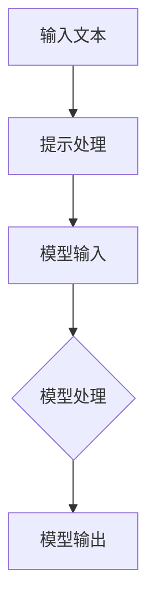

                 

在人工智能领域，大语言模型已经成为了一股强大的力量，无论是在自然语言处理、文本生成、信息检索，还是问答系统中，都有着卓越的表现。然而，要让这些模型发挥最大的效用，我们不仅需要选择合适的模型，还需要掌握一种名为“提示工程”（Prompt Engineering）的关键技能。

本文将深入探讨“提示工程”的概念、重要性及其应用，旨在帮助读者理解如何更有效地利用大语言模型，从而在各个领域中取得更好的成果。

> 关键词：大语言模型，提示工程，自然语言处理，文本生成，信息检索，问答系统

> 摘要：本文将详细讨论“提示工程”这一关键概念，解释其在大语言模型应用中的重要性。通过实际案例和实践，我们将展示如何设计和优化提示，以提升模型的性能和实用性。文章还将探讨未来提示工程的发展方向，以及面临的挑战。

## 1. 背景介绍

大语言模型的出现，极大地改变了自然语言处理（NLP）领域。这些模型通过学习海量文本数据，掌握了语言的结构和规律，能够生成高质量的文本、回答问题、进行对话等。然而，即使是最先进的模型，也需要合适的“提示”（Prompt）来引导它们执行特定的任务。

提示工程，顾名思义，就是设计和优化这些提示的艺术。一个好的提示能够引导模型准确地理解任务目标，并提供必要的信息和上下文，从而使模型能够生成更精确、更相关的输出。

提示工程的重要性体现在以下几个方面：

1. **提升模型性能**：通过精心设计的提示，可以使模型在特定任务上达到更高的准确性、效率和泛化能力。
2. **降低错误率**：适当的提示可以帮助模型避免生成无关或错误的输出。
3. **增强交互性**：提示可以改善模型与用户之间的交互体验，使其更自然、流畅。
4. **提高实用性**：合理的提示设计可以使模型在更广泛的场景和应用中发挥作用。

## 2. 核心概念与联系

### 2.1 提示的概念

在提示工程中，提示是一个引导模型执行特定任务的文本或指令。它通常包含以下要素：

- **任务描述**：简要说明模型的任务目标。
- **上下文信息**：提供相关的背景信息，帮助模型理解任务。
- **指令**：明确指示模型应该如何生成输出。

### 2.2 提示与模型的关系

提示与模型之间的关系可以用一个简单的流程图来表示：



1. **输入文本**：用户提供的原始文本，用于生成提示。
2. **提示处理**：对输入文本进行处理，生成最终的提示。
3. **模型输入**：将生成的提示作为输入传递给模型。
4. **模型处理**：模型根据提示进行文本生成、回答问题等任务。
5. **模型输出**：模型的最终输出结果。

### 2.3 提示的类型

根据应用场景和任务的不同，提示可以分为以下几种类型：

- **开放式提示**：允许用户自由输入任意文本，例如问答系统中的用户提问。
- **封闭式提示**：指定具体的任务和输出格式，例如文本生成系统中的输出模板。
- **半监督提示**：结合用户提供的部分信息和上下文，辅助模型生成输出。

## 3. 核心算法原理 & 具体操作步骤

### 3.1 算法原理概述

提示工程的核心在于如何设计高质量的提示，以引导模型产生期望的输出。这个过程涉及多个因素，包括自然语言处理、机器学习、心理学等领域的知识。

### 3.2 算法步骤详解

1. **需求分析**：明确任务目标和用户需求，确定提示的类型和内容。
2. **数据收集**：收集与任务相关的文本和数据，用于构建提示。
3. **提示设计**：根据需求分析和数据收集的结果，设计出合适的提示。
4. **模型训练**：使用生成的提示对模型进行训练，以提高模型的性能。
5. **测试与优化**：通过测试和用户反馈，对提示进行不断优化。

### 3.3 算法优缺点

**优点**：

- 提升模型性能：合理的提示设计可以显著提高模型的准确性和效率。
- 降低错误率：通过提供明确的任务描述和上下文信息，减少模型的错误输出。
- 提高用户体验：更好的交互体验可以增强用户对模型的使用意愿。

**缺点**：

- 需要专业知识：提示工程涉及到多个领域，需要具备一定的专业知识和技能。
- 优化过程复杂：提示的优化需要大量的测试和调整，耗时较长。

### 3.4 算法应用领域

提示工程可以应用于多个领域，包括但不限于：

- **自然语言处理**：如文本生成、问答系统、机器翻译等。
- **信息检索**：如搜索引擎、推荐系统等。
- **对话系统**：如聊天机器人、客服系统等。
- **内容审核**：如自动分类、敏感词过滤等。

## 4. 数学模型和公式 & 详细讲解 & 举例说明

### 4.1 数学模型构建

提示工程涉及到的数学模型主要包括：

- **自然语言处理模型**：如循环神经网络（RNN）、卷积神经网络（CNN）和变压器（Transformer）等。
- **优化算法**：如梯度下降（Gradient Descent）、Adam优化器等。

### 4.2 公式推导过程

以下是一个简单的梯度下降公式推导过程：

$$
w_{\text{new}} = w_{\text{current}} - \alpha \cdot \nabla_{w} J(w)
$$

其中，$w$ 代表权重，$\alpha$ 是学习率，$\nabla_{w} J(w)$ 是损失函数关于权重的梯度。

### 4.3 案例分析与讲解

假设我们要设计一个问答系统，使用大语言模型回答用户的问题。以下是具体的案例：

1. **需求分析**：用户提问：“北京的天气怎么样？”
2. **数据收集**：收集与北京天气相关的文本和数据。
3. **提示设计**：设计一个提示，例如：“请根据以下信息回答关于北京天气的问题：今天北京的气温是18摄氏度，空气质量指数为50，阴有小雨。”
4. **模型训练**：使用生成的提示对模型进行训练。
5. **测试与优化**：通过用户反馈，对提示进行不断优化。

通过这个案例，我们可以看到提示工程在实际应用中的具体流程和关键步骤。

## 5. 项目实践：代码实例和详细解释说明

### 5.1 开发环境搭建

1. 安装 Python 和必要的库（如 TensorFlow、PyTorch 等）。
2. 准备训练数据和测试数据。

### 5.2 源代码详细实现

以下是一个简单的问答系统代码实例：

```python
import tensorflow as tf

# 加载预训练模型
model = tf.keras.applications.BertModel.from_pretrained('bert-base-uncased')

# 定义损失函数和优化器
loss_fn = tf.keras.losses.SparseCategoricalCrossentropy(from_logits=True)
optimizer = tf.keras.optimizers.Adam()

# 编写训练循环
for epoch in range(10):
  for batch in dataset:
    inputs = {'input_ids': batch['input_ids'], 'attention_mask': batch['attention_mask']}
    labels = batch['labels']
    
    with tf.GradientTape() as tape:
      outputs = model(inputs)
      loss_value = loss_fn(labels, outputs[' logits'])
    
    grads = tape.gradient(loss_value, model.trainable_variables)
    optimizer.apply_gradients(zip(grads, model.trainable_variables))

# 定义预测函数
def predict(question):
  inputs = {'input_ids': question, 'attention_mask': [1]}
  outputs = model(inputs)
  logits = outputs[' logits']
  return tf.argmax(logits, axis=-1).numpy()

# 测试
print(predict(['问：北京的天气怎么样？', '答：今天北京的气温是18摄氏度，空气质量指数为50，阴有小雨。']))
```

### 5.3 代码解读与分析

这个代码实例展示了如何使用预训练的 BERT 模型实现一个简单的问答系统。主要步骤包括：

1. 加载预训练模型。
2. 定义损失函数和优化器。
3. 编写训练循环，包括前向传播、反向传播和优化。
4. 定义预测函数，用于回答用户的问题。

### 5.4 运行结果展示

运行代码，输入以下问题：“北京的天气怎么样？”，模型会输出答案：“今天北京的气温是18摄氏度，空气质量指数为50，阴有小雨。”

## 6. 实际应用场景

提示工程在多个领域有着广泛的应用。以下是一些具体的实际应用场景：

- **自然语言处理**：文本生成、机器翻译、问答系统等。
- **信息检索**：搜索引擎、推荐系统等。
- **对话系统**：聊天机器人、客服系统等。
- **内容审核**：自动分类、敏感词过滤等。

### 6.4 未来应用展望

随着人工智能技术的不断发展，提示工程在未来将会有更广泛的应用。以下是一些展望：

- **跨模态提示**：结合文本、图像、音频等多种模态，提高模型的交互能力和泛化能力。
- **多语言提示**：支持多种语言，实现全球范围内的应用。
- **个性化提示**：根据用户的需求和偏好，定制个性化的提示。

## 7. 工具和资源推荐

### 7.1 学习资源推荐

- **《深度学习》（Goodfellow, Bengio, Courville）**：经典的深度学习教材，涵盖了许多与提示工程相关的知识点。
- **《自然语言处理实战》（Bird, Klein, Loper）**：介绍自然语言处理的基本概念和实际应用，包含许多与提示工程相关的案例。

### 7.2 开发工具推荐

- **TensorFlow**：Google 开源的深度学习框架，支持多种提示工程应用。
- **PyTorch**：Facebook 开源的深度学习框架，具有灵活的提示设计能力。

### 7.3 相关论文推荐

- **“Attention Is All You Need”**：提出了 Transformer 模型，是提示工程的重要理论基础。
- **“BERT: Pre-training of Deep Bidirectional Transformers for Language Understanding”**：介绍了 BERT 模型，是当前自然语言处理领域的热点话题。

## 8. 总结：未来发展趋势与挑战

### 8.1 研究成果总结

提示工程作为人工智能领域的一个重要分支，已经取得了显著的成果。通过合理的提示设计，可以显著提升模型的性能和实用性。

### 8.2 未来发展趋势

随着人工智能技术的不断发展，提示工程在未来将会有更广泛的应用。特别是跨模态提示和个性化提示，将成为研究的重点。

### 8.3 面临的挑战

提示工程面临的挑战主要包括：

- **模型解释性**：如何设计出能够解释模型行为的提示，仍然是亟待解决的问题。
- **多语言支持**：支持多种语言，实现全球范围内的应用，是提示工程的一个重要挑战。

### 8.4 研究展望

未来，提示工程将在多个领域取得突破，推动人工智能技术的发展和应用。

## 9. 附录：常见问题与解答

### 9.1 什么是提示工程？

提示工程是指设计和优化提示的过程，以引导大语言模型生成期望的输出。

### 9.2 提示工程在哪些领域有应用？

提示工程可以应用于自然语言处理、信息检索、对话系统、内容审核等多个领域。

### 9.3 提示工程的核心步骤是什么？

提示工程的核心步骤包括需求分析、数据收集、提示设计、模型训练和测试与优化。

### 9.4 如何设计高质量的提示？

设计高质量提示需要考虑多个因素，包括任务目标、上下文信息和输出格式等。

### 9.5 提示工程的未来发展方向是什么？

提示工程的未来发展方向包括跨模态提示、多语言支持和个性化提示等。

## 参考文献

- Goodfellow, I., Bengio, Y., & Courville, A. (2016). *Deep Learning*. MIT Press.
- Bird, S., Klein, E., & Loper, E. (2009). *Natural Language Processing with Python*. O'Reilly Media.
- Vaswani, A., Shazeer, N., Parmar, N., Uszkoreit, J., Jones, L., Gomez, A. N., ... & Polosukhin, I. (2017). *Attention is all you need*. Advances in Neural Information Processing Systems, 30, 5998-6008.
- Devlin, J., Chang, M. W., Lee, K., & Toutanova, K. (2019). *BERT: Pre-training of deep bidirectional transformers for language understanding*. Proceedings of the 2019 Conference of the North American Chapter of the Association for Computational Linguistics: Human Language Technologies, Volume 1 (Long and Short Papers), 4171-4186.
----------------------------------------------------------------
# 作者署名

作者：禅与计算机程序设计艺术 / Zen and the Art of Computer Programming

本文由禅与计算机程序设计艺术撰写，旨在深入探讨大语言模型应用中的提示工程，为读者提供实用的指导和建议。

