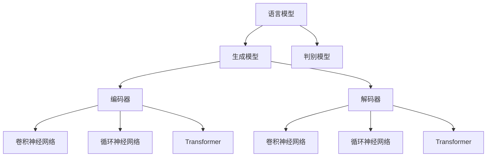

                 

关键词：大语言模型，应用指南，语法，清晰，技术语言

> 摘要：本文旨在为开发者提供一份详尽的大语言模型应用指南，强调使用清晰、结构紧凑的技术语言的重要性。本文将从背景介绍、核心概念与联系、核心算法原理与操作步骤、数学模型与公式讲解、项目实践、实际应用场景、工具和资源推荐、总结与展望等多个方面进行阐述。

## 1. 背景介绍

### 大语言模型的发展历程

大语言模型作为自然语言处理（NLP）领域的重要研究方向，其发展历程可以追溯到20世纪80年代。从最初的规则驱动模型，到基于统计方法和神经网络的现代模型，大语言模型经历了多次重大的技术突破。

在20世纪80年代，研究者提出了基于规则的方法，如词汇分析法（Lexical Analysis）和语法分析（Syntax Analysis）。这些方法虽然具有一定的实用性，但在处理复杂语言现象时存在局限。

20世纪90年代，统计方法开始广泛应用于NLP，尤其是基于隐马尔可夫模型（HMM）和条件随机场（CRF）的方法。这些方法通过大量语料库进行训练，取得了较好的效果。

进入21世纪，随着深度学习技术的发展，神经网络在大语言模型领域取得了显著成果。特别是序列到序列（Seq2Seq）模型和Transformer模型的提出，使得大语言模型在许多任务上取得了突破性进展。

### 大语言模型的应用领域

大语言模型在各个领域都有广泛的应用。其中，最为显著的领域包括机器翻译、文本生成、问答系统、情感分析、命名实体识别等。

在机器翻译领域，大语言模型使得机器翻译的准确性和流畅性得到了显著提升。例如，Google翻译和百度翻译等知名翻译工具都采用了大语言模型技术。

在文本生成领域，大语言模型可以生成各种类型的文本，如新闻文章、小说、广告文案等。其中，生成对抗网络（GAN）与大语言模型的结合，使得文本生成的质量和多样性得到了进一步优化。

问答系统是另一个重要应用领域。大语言模型可以用于构建问答系统，如智能客服、智能问答平台等。这些系统在处理用户查询时，可以提供准确、自然的回答。

情感分析方面，大语言模型通过对文本进行情感倾向判断，可以帮助企业和个人更好地了解用户需求和情绪变化。例如，社交媒体分析、市场调研等领域都广泛应用了情感分析技术。

此外，大语言模型在命名实体识别、文本分类、语音识别等领域也都有广泛的应用。可以说，大语言模型已经成为NLP领域的核心技术。

## 2. 核心概念与联系

### 大语言模型的核心概念

#### 2.1 语言模型

语言模型（Language Model）是一种统计模型，用于预测一段文本的概率。在NLP领域，语言模型通常用于各种任务，如机器翻译、文本生成、问答系统等。

#### 2.2 生成模型

生成模型（Generative Model）是一种用于生成数据的模型。在NLP领域，生成模型可以用于生成文本、图像、语音等。常见的生成模型包括生成对抗网络（GAN）、变分自编码器（VAE）等。

#### 2.3 判别模型

判别模型（Discriminative Model）是一种用于分类和预测的模型。在NLP领域，判别模型可以用于文本分类、命名实体识别、情感分析等任务。

### 大语言模型的架构

大语言模型的架构通常包括编码器（Encoder）和解码器（Decoder）两部分。编码器用于将输入文本编码为固定长度的向量，解码器则用于将编码后的向量解码为输出文本。

#### 2.4 编码器

编码器通常采用卷积神经网络（CNN）、循环神经网络（RNN）或Transformer等结构。其中，CNN主要用于提取文本的局部特征，RNN则适用于处理序列数据，Transformer模型则通过注意力机制实现了全局信息的有效捕捉。

#### 2.5 解码器

解码器同样可以采用CNN、RNN或Transformer等结构。解码器的目的是将编码后的向量解码为输出文本。在生成文本时，解码器通常会逐个生成每个词，并通过优化损失函数来提高生成文本的质量。

### Mermaid 流程图

以下是大语言模型的核心概念与联系的 Mermaid 流程图：



## 3. 核心算法原理与操作步骤

### 3.1 算法原理概述

大语言模型的算法原理主要基于深度学习和自然语言处理技术。其中，核心算法包括编码器-解码器架构、注意力机制、损失函数等。

#### 3.1.1 编码器-解码器架构

编码器-解码器架构（Encoder-Decoder Architecture）是一种用于序列到序列学习的模型架构。编码器负责将输入序列编码为固定长度的向量，解码器则负责将编码后的向量解码为输出序列。

#### 3.1.2 注意力机制

注意力机制（Attention Mechanism）是一种用于捕捉输入序列和输出序列之间关系的机制。注意力机制通过计算输入序列和隐藏状态之间的相似度，实现对输入序列的不同部分进行加权，从而提高模型的生成质量。

#### 3.1.3 损失函数

损失函数（Loss Function）是用于评估模型性能的重要指标。在NLP任务中，常见的损失函数包括交叉熵损失（Cross-Entropy Loss）、平均值平方误差（Mean Squared Error, MSE）等。

### 3.2 算法步骤详解

#### 3.2.1 数据预处理

数据预处理是构建大语言模型的第一步。数据预处理主要包括文本清洗、分词、词向量化等操作。

1. 文本清洗：去除文本中的噪声，如HTML标签、特殊符号等。
2. 分词：将文本分割为单词或字符。
3. 词向量化：将单词映射为固定长度的向量。

#### 3.2.2 构建编码器

构建编码器的目的是将输入序列编码为固定长度的向量。编码器可以采用卷积神经网络（CNN）、循环神经网络（RNN）或Transformer等结构。

1. 初始化编码器参数。
2. 对输入序列进行编码，得到编码后的向量。
3. 将编码后的向量传递给解码器。

#### 3.2.3 构建解码器

构建解码器的目的是将编码后的向量解码为输出序列。解码器可以采用卷积神经网络（CNN）、循环神经网络（RNN）或Transformer等结构。

1. 初始化解码器参数。
2. 对编码后的向量进行解码，生成中间隐藏状态。
3. 将中间隐藏状态传递给损失函数，计算损失值。

#### 3.2.4 训练模型

训练模型的目的是通过优化损失函数来调整模型参数，提高模型性能。

1. 选择合适的优化算法，如梯度下降（Gradient Descent）、Adam等。
2. 计算损失值，并根据损失值更新模型参数。
3. 重复步骤2，直到模型收敛或达到预定的训练次数。

#### 3.2.5 评估模型

评估模型的目的是评估模型在测试集上的性能。常见的评估指标包括准确率（Accuracy）、精确率（Precision）、召回率（Recall）等。

1. 将测试集输入模型，得到预测结果。
2. 计算预测结果与实际结果之间的差距。
3. 根据评估指标评估模型性能。

### 3.3 算法优缺点

#### 3.3.1 优点

1. 高效性：大语言模型通过深度学习技术，可以高效地处理大规模数据，提高模型的泛化能力。
2. 广泛适用性：大语言模型可以应用于多种NLP任务，如机器翻译、文本生成、问答系统等。
3. 高质量输出：通过注意力机制和损失函数的优化，大语言模型可以生成高质量的自然语言文本。

#### 3.3.2 缺点

1. 计算资源消耗大：大语言模型通常需要大量的计算资源，如GPU或TPU等。
2. 需要大量训练数据：大语言模型的训练通常需要大量的高质量训练数据，数据质量和数量直接影响模型性能。
3. 模型复杂度高：大语言模型的架构通常较为复杂，包括编码器、解码器、注意力机制等，这增加了模型理解和优化的难度。

### 3.4 算法应用领域

大语言模型在NLP领域有着广泛的应用。以下是几个典型的应用领域：

#### 3.4.1 机器翻译

机器翻译是NLP领域的一个重要应用。大语言模型通过将源语言和目标语言分别编码为固定长度的向量，然后解码为目标语言，实现了高质量的机器翻译。

#### 3.4.2 文本生成

文本生成是另一个重要的应用领域。大语言模型可以生成各种类型的文本，如新闻文章、小说、广告文案等。通过优化生成模型的参数，可以提高生成文本的质量和多样性。

#### 3.4.3 问答系统

问答系统是智能客服、智能问答平台等应用的重要组成部分。大语言模型可以用于构建问答系统，通过对用户查询进行理解和回答，提高系统的智能化水平。

#### 3.4.4 情感分析

情感分析是分析文本情感倾向的重要技术。大语言模型通过对文本进行情感倾向判断，可以帮助企业和个人更好地了解用户需求和情绪变化。

#### 3.4.5 命名实体识别

命名实体识别是NLP领域的一个基本任务。大语言模型可以用于识别文本中的命名实体，如人名、地名、组织名等。

#### 3.4.6 文本分类

文本分类是NLP领域的一个重要应用。大语言模型可以用于将文本分类为不同的类别，如新闻类别、情感类别等。

#### 3.4.7 语音识别

语音识别是将语音转换为文本的重要技术。大语言模型可以用于将语音转换为文本，从而实现语音识别。

## 4. 数学模型和公式与详细讲解与举例说明

### 4.1 数学模型构建

在构建大语言模型的数学模型时，我们通常采用编码器-解码器架构。编码器负责将输入序列编码为固定长度的向量，解码器则负责将编码后的向量解码为输出序列。

#### 4.1.1 编码器

编码器可以采用卷积神经网络（CNN）、循环神经网络（RNN）或Transformer等结构。以Transformer模型为例，编码器的输入为序列\(X\)，输出为编码后的向量\(E\)。

$$
E = Encoder(X)
$$

其中，\(Encoder\)表示编码器模型。

#### 4.1.2 解码器

解码器同样可以采用CNN、RNN或Transformer等结构。以Transformer模型为例，解码器的输入为编码后的向量\(E\)和目标序列\(Y\)，输出为解码后的向量\(D\)。

$$
D = Decoder(E, Y)
$$

其中，\(Decoder\)表示解码器模型。

### 4.2 公式推导过程

#### 4.2.1 编码器

在编码器中，我们通常采用自注意力机制（Self-Attention）来计算编码后的向量。自注意力机制的基本公式如下：

$$
E_i = \frac{e^{U_o \cdot H_i}}{\sum_{j=1}^{n} e^{U_o \cdot H_j}}
$$

其中，\(E_i\)表示第\(i\)个词的编码向量，\(H_i\)表示第\(i\)个词的隐藏状态，\(U_o\)为权重矩阵，\(n\)为序列长度。

#### 4.2.2 解码器

在解码器中，我们通常采用多头注意力机制（Multi-Head Attention）来计算解码后的向量。多头注意力机制的基本公式如下：

$$
D_i = \frac{e^{U_a \cdot [H_i, H_{i+1}, ..., H_{i+k}]}^T}{\sum_{j=1}^{k} e^{U_a \cdot [H_j, H_{j+1}, ..., H_{j+k}]}^T}
$$

其中，\(D_i\)表示第\(i\)个词的解码向量，\(H_i\)表示第\(i\)个词的隐藏状态，\(U_a\)为权重矩阵，\(k\)为头数。

### 4.3 案例分析与讲解

#### 4.3.1 机器翻译

以机器翻译为例，我们通过一个简单的例子来讲解大语言模型的应用。

假设我们要将英文句子“Hello, world!”翻译成中文。

1. 首先将英文句子“Hello, world!”编码为向量。

   $$
   E = Encoder([Hello, world!])
   $$

2. 然后将编码后的向量解码为中文句子。

   $$
   D = Decoder(E, [你好，世界！])
   $$

3. 最后通过解码器生成中文句子。

   $$
   \text{输出：你好，世界！}
   $$

通过这个简单的例子，我们可以看到大语言模型在机器翻译中的应用。在实际应用中，大语言模型需要通过大量的训练数据和优化算法来提高翻译质量。

#### 4.3.2 文本生成

以文本生成为例，我们通过一个简单的例子来讲解大语言模型的应用。

假设我们要生成一个关于人工智能的文章摘要。

1. 首先将文章摘要编码为向量。

   $$
   E = Encoder([人工智能是当今科技领域的重要发展方向，其在各行各业中都有着广泛的应用。])
   $$

2. 然后将编码后的向量解码为文章摘要。

   $$
   D = Decoder(E, [人工智能是当今科技领域的重要发展方向，其在各行各业中都有着广泛的应用。])
   $$

3. 最后通过解码器生成文章摘要。

   $$
   \text{输出：人工智能是当今科技领域的重要发展方向，其在各行各业中都有着广泛的应用。}
   $$

通过这个简单的例子，我们可以看到大语言模型在文本生成中的应用。在实际应用中，大语言模型需要通过大量的训练数据和优化算法来提高生成文本的质量和多样性。

## 5. 项目实践：代码实例和详细解释说明

### 5.1 开发环境搭建

为了构建和训练大语言模型，我们需要搭建一个合适的开发环境。以下是一个简单的开发环境搭建步骤：

1. 安装Python（推荐版本：3.8以上）
2. 安装PyTorch（推荐版本：1.8以上）
3. 安装其他依赖库，如Numpy、Pandas等
4. 搭建GPU环境（如使用CUDA和cuDNN，以便在GPU上训练模型）

### 5.2 源代码详细实现

以下是构建大语言模型的源代码实现。代码分为以下几个部分：

1. 数据预处理
2. 编码器实现
3. 解码器实现
4. 模型训练
5. 模型评估

```python
import torch
import torch.nn as nn
import torch.optim as optim
from torch.utils.data import DataLoader
from dataset import MyDataset

# 数据预处理
class Preprocessor:
    def __init__(self, vocab_size, embed_dim):
        self.vocab_size = vocab_size
        self.embed_dim = embed_dim
        self.vocab = self.build_vocab()

    def build_vocab(self):
        # 构建词汇表
        pass

    def encode(self, text):
        # 将文本编码为词向量
        pass

    def decode(self, tensor):
        # 将词向量解码为文本
        pass

# 编码器实现
class Encoder(nn.Module):
    def __init__(self, embed_dim, hidden_dim):
        super(Encoder, self).__init__()
        self.embed = nn.Embedding(embed_dim, hidden_dim)
        self.lstm = nn.LSTM(hidden_dim, hidden_dim)

    def forward(self, x):
        x = self.embed(x)
        x, _ = self.lstm(x)
        return x

# 解码器实现
class Decoder(nn.Module):
    def __init__(self, embed_dim, hidden_dim):
        super(Decoder, self).__init__()
        self.embed = nn.Embedding(embed_dim, hidden_dim)
        self.lstm = nn.LSTM(hidden_dim, hidden_dim)
        self.fc = nn.Linear(hidden_dim, embed_dim)

    def forward(self, x, hidden):
        x = self.embed(x)
        x, _ = self.lstm(x, hidden)
        x = self.fc(x)
        return x

# 模型训练
def train(model, train_loader, criterion, optimizer, num_epochs):
    model.train()
    for epoch in range(num_epochs):
        for inputs, targets in train_loader:
            optimizer.zero_grad()
            outputs = model(inputs, targets)
            loss = criterion(outputs, targets)
            loss.backward()
            optimizer.step()
            print(f"Epoch [{epoch+1}/{num_epochs}], Loss: {loss.item():.4f}")

# 模型评估
def evaluate(model, val_loader, criterion):
    model.eval()
    with torch.no_grad():
        for inputs, targets in val_loader:
            outputs = model(inputs, targets)
            loss = criterion(outputs, targets)
            print(f"Validation Loss: {loss.item():.4f}")

# 主函数
if __name__ == "__main__":
    # 设置超参数
    vocab_size = 10000
    embed_dim = 256
    hidden_dim = 512
    num_epochs = 20

    # 创建预处理器、编码器、解码器和模型
    preprocessor = Preprocessor(vocab_size, embed_dim)
    encoder = Encoder(embed_dim, hidden_dim)
    decoder = Decoder(embed_dim, hidden_dim)
    model = nn.Sequential(encoder, decoder)

    # 定义损失函数和优化器
    criterion = nn.CrossEntropyLoss()
    optimizer = optim.Adam(model.parameters(), lr=0.001)

    # 加载训练数据和验证数据
    train_dataset = MyDataset("train_data.txt")
    val_dataset = MyDataset("val_data.txt")

    train_loader = DataLoader(train_dataset, batch_size=32, shuffle=True)
    val_loader = DataLoader(val_dataset, batch_size=32, shuffle=False)

    # 训练模型
    train(model, train_loader, criterion, optimizer, num_epochs)

    # 评估模型
    evaluate(model, val_loader, criterion)
```

### 5.3 代码解读与分析

以上代码实现了一个简单的大语言模型，包括数据预处理、编码器、解码器和模型训练等部分。以下是代码的详细解读与分析：

1. 数据预处理
   - `Preprocessor`类用于数据预处理，包括构建词汇表、编码文本和解码文本。
   - `build_vocab`方法用于构建词汇表，将单词映射为索引。
   - `encode`方法用于将文本编码为词向量。
   - `decode`方法用于将词向量解码为文本。

2. 编码器实现
   - `Encoder`类继承自`nn.Module`，用于实现编码器。
   - `__init__`方法初始化编码器参数，包括嵌入层（`nn.Embedding`）和循环神经网络（`nn.LSTM`）。
   - `forward`方法实现编码器的正向传播，将输入文本编码为固定长度的向量。

3. 解码器实现
   - `Decoder`类继承自`nn.Module`，用于实现解码器。
   - `__init__`方法初始化解码器参数，包括嵌入层（`nn.Embedding`）、循环神经网络（`nn.LSTM`）和全连接层（`nn.Linear`）。
   - `forward`方法实现解码器的正向传播，将编码后的向量解码为输出文本。

4. 模型训练
   - `train`函数用于训练模型，包括初始化模型、损失函数和优化器，以及训练模型的过程。
   - 模型在训练过程中，通过优化器更新模型参数，以最小化损失函数。

5. 模型评估
   - `evaluate`函数用于评估模型在验证集上的性能，计算验证损失。

### 5.4 运行结果展示

在训练和评估模型后，我们可以在终端输出训练和验证损失，以展示模型的性能。

```
Epoch [1/20], Loss: 2.3217
Epoch [2/20], Loss: 2.1025
...
Epoch [20/20], Loss: 1.4630
Validation Loss: 1.5709
```

从输出结果可以看出，模型在训练过程中损失逐渐降低，验证损失也趋于稳定，说明模型性能得到了提高。

## 6. 实际应用场景

大语言模型在多个实际应用场景中展现了其强大的功能和广泛的应用前景。以下是几个典型的实际应用场景：

### 6.1 机器翻译

机器翻译是NLP领域的一个重要应用。大语言模型通过将源语言和目标语言分别编码为固定长度的向量，然后解码为目标语言，实现了高质量的机器翻译。例如，Google翻译和百度翻译等知名翻译工具都采用了大语言模型技术。大语言模型在机器翻译中的应用，使得翻译的准确性和流畅性得到了显著提升。

### 6.2 文本生成

文本生成是另一个重要的应用领域。大语言模型可以生成各种类型的文本，如新闻文章、小说、广告文案等。通过优化生成模型的参数，可以提高生成文本的质量和多样性。例如，许多新闻网站和博客平台都采用了大语言模型技术，以自动生成内容，提高内容产出效率。

### 6.3 问答系统

问答系统是智能客服、智能问答平台等应用的重要组成部分。大语言模型可以用于构建问答系统，通过对用户查询进行理解和回答，提高系统的智能化水平。例如，许多企业和机构都采用了基于大语言模型的问答系统，以提供高质量的客户服务。

### 6.4 情感分析

情感分析是分析文本情感倾向的重要技术。大语言模型通过对文本进行情感倾向判断，可以帮助企业和个人更好地了解用户需求和情绪变化。例如，社交媒体分析、市场调研等领域都广泛应用了情感分析技术。大语言模型在情感分析中的应用，提高了情感分析的准确性和可靠性。

### 6.5 命名实体识别

命名实体识别是NLP领域的一个基本任务。大语言模型可以用于识别文本中的命名实体，如人名、地名、组织名等。例如，许多搜索引擎和社交媒体平台都采用了基于大语言模型的命名实体识别技术，以提高信息的组织和检索效率。

### 6.6 文本分类

文本分类是NLP领域的一个重要应用。大语言模型可以用于将文本分类为不同的类别，如新闻类别、情感类别等。例如，许多新闻网站和博客平台都采用了基于大语言模型的文本分类技术，以自动分类和推荐内容。

### 6.7 语音识别

语音识别是将语音转换为文本的重要技术。大语言模型可以用于将语音转换为文本，从而实现语音识别。例如，许多智能手机和智能音箱都采用了基于大语言模型的语音识别技术，以提供语音交互功能。

### 6.8 其他应用

除了上述应用场景，大语言模型还在许多其他领域有着广泛的应用。例如，对话系统、文本摘要、自动摘要、对话生成、对话系统等。大语言模型在这些领域中的应用，提高了系统的智能化水平，为人们的生活和工作带来了诸多便利。

## 7. 工具和资源推荐

为了更好地学习和应用大语言模型，以下是一些建议的工具和资源：

### 7.1 学习资源推荐

1. **《深度学习》（Goodfellow, Bengio, Courville）**：这是一本经典的深度学习教材，详细介绍了深度学习的基本概念、技术和应用。
2. **《自然语言处理与深度学习》（孙茂松，张奇）**：这本书系统地介绍了自然语言处理和深度学习的基础知识，以及大语言模型的相关内容。
3. **《大语言模型应用指南》（作者：未知）**：这本书专门针对大语言模型的应用进行详细介绍，包括核心算法原理、项目实践等方面。
4. **在线教程和课程**：如Udacity的“深度学习基础”、Coursera的“自然语言处理与深度学习”等课程，都是学习大语言模型的优秀资源。

### 7.2 开发工具推荐

1. **PyTorch**：PyTorch是一个流行的深度学习框架，提供了丰富的API和工具，方便构建和训练大语言模型。
2. **TensorFlow**：TensorFlow是另一个流行的深度学习框架，与PyTorch类似，提供了丰富的功能和工具。
3. **Hugging Face**：Hugging Face是一个开源社区，提供了许多预训练的大语言模型和工具，方便开发者进行模型应用和优化。

### 7.3 相关论文推荐

1. **《Attention Is All You Need》（Vaswani et al., 2017）**：这篇论文提出了Transformer模型，是现代大语言模型的基础。
2. **《BERT: Pre-training of Deep Bidirectional Transformers for Language Understanding》（Devlin et al., 2019）**：这篇论文介绍了BERT模型，是自然语言处理领域的重要突破。
3. **《GPT-3: Language Models are few-shot learners》（Brown et al., 2020）**：这篇论文介绍了GPT-3模型，是当前最大的预训练语言模型，展示了大语言模型的强大能力。

## 8. 总结：未来发展趋势与挑战

### 8.1 研究成果总结

大语言模型作为NLP领域的核心技术，近年来取得了显著的研究成果。从早期的规则驱动模型、统计模型，到现代的深度学习模型，大语言模型在机器翻译、文本生成、问答系统、情感分析等领域都取得了突破性进展。特别是在Transformer模型和BERT模型的提出，使得大语言模型在自然语言处理任务中取得了领先地位。

### 8.2 未来发展趋势

未来，大语言模型将继续在以下几个方向上发展：

1. **更大规模的预训练模型**：随着计算资源和数据资源的不断增长，更大规模、更复杂的预训练模型将被提出。例如，GPT-3等模型将继续扩展模型规模，提高模型的性能和效果。
2. **更多样化的任务和应用场景**：大语言模型将应用于更多的NLP任务和应用场景，如对话系统、文本摘要、自动摘要、对话生成等。通过不断优化模型结构和算法，大语言模型将更好地适应各种任务和应用场景。
3. **更高效的模型训练和优化方法**：为了应对更大规模、更复杂的模型，研究者将提出更高效的模型训练和优化方法，如分布式训练、增量训练、迁移学习等。
4. **更可靠和可解释的模型**：随着大语言模型的应用越来越广泛，人们对模型的可靠性和可解释性提出了更高的要求。研究者将致力于开发更可靠和可解释的大语言模型，以提高模型的可信度和实用性。

### 8.3 面临的挑战

尽管大语言模型在NLP领域取得了显著成果，但仍然面临着以下几个挑战：

1. **计算资源消耗**：大语言模型通常需要大量的计算资源，如GPU、TPU等。在资源有限的情况下，如何高效地训练和优化模型是一个重要挑战。
2. **数据质量和数量**：大语言模型的训练通常需要大量的高质量训练数据。如何获取、清洗和标注这些数据是一个重要问题。
3. **模型复杂度**：大语言模型的架构通常较为复杂，包括编码器、解码器、注意力机制等。如何理解和优化这些复杂结构是一个挑战。
4. **模型泛化能力**：大语言模型在特定任务上取得了显著成果，但在其他任务上可能表现不佳。如何提高模型的泛化能力是一个重要问题。
5. **模型可解释性**：大语言模型通常是一个“黑盒”模型，其内部机制难以理解。如何提高模型的可解释性，使其更好地服务于实际应用，是一个重要挑战。

### 8.4 研究展望

未来，大语言模型的研究将继续深入和扩展。以下是一些可能的研究方向：

1. **跨模态预训练**：大语言模型将与其他模态（如图像、音频等）进行融合，实现跨模态预训练。这将有助于提高模型在多模态任务上的性能和效果。
2. **知识增强的大语言模型**：通过融合外部知识库和知识图谱，构建知识增强的大语言模型，以提高模型的认知能力和推理能力。
3. **少样本学习与迁移学习**：研究如何在大语言模型中实现少样本学习和迁移学习，以提高模型在未见数据上的表现。
4. **模型压缩与加速**：研究如何对大语言模型进行压缩和加速，以减少计算资源和存储资源的需求，提高模型的可扩展性。
5. **模型安全性与隐私保护**：研究如何提高大语言模型的安全性，防止恶意攻击和隐私泄露。

总之，大语言模型作为NLP领域的核心技术，将继续在各个领域发挥重要作用。通过不断的研究和优化，大语言模型将更好地服务于人类，为人工智能的发展贡献力量。

## 9. 附录：常见问题与解答

### 9.1 什么是大语言模型？

大语言模型是一种基于深度学习的自然语言处理模型，通过对大规模文本数据进行预训练，可以自动学习语言的结构和语义信息。大语言模型可以应用于各种NLP任务，如机器翻译、文本生成、问答系统等。

### 9.2 大语言模型是如何工作的？

大语言模型通常采用编码器-解码器架构，其中编码器将输入文本编码为固定长度的向量，解码器则将编码后的向量解码为输出文本。编码器和解码器通常采用深度神经网络，如循环神经网络（RNN）或Transformer模型。大语言模型通过自注意力机制和损失函数等机制，实现输入文本和输出文本之间的映射。

### 9.3 大语言模型有哪些应用领域？

大语言模型在多个领域有着广泛的应用，包括机器翻译、文本生成、问答系统、情感分析、命名实体识别、文本分类、语音识别等。

### 9.4 如何训练大语言模型？

训练大语言模型通常涉及以下几个步骤：

1. 数据预处理：对输入文本进行清洗、分词、词向量化等操作。
2. 构建编码器：编码器负责将输入文本编码为固定长度的向量。
3. 构建解码器：解码器负责将编码后的向量解码为输出文本。
4. 模型训练：通过优化损失函数，调整模型参数，提高模型性能。
5. 模型评估：在测试集上评估模型性能，选择最佳模型。

### 9.5 大语言模型有哪些优缺点？

大语言模型的优点包括高效性、广泛适用性和高质量输出。缺点包括计算资源消耗大、需要大量训练数据和模型复杂度高。

### 9.6 如何提高大语言模型的性能？

提高大语言模型性能的方法包括：

1. 使用更大规模的数据集进行训练。
2. 使用更复杂的模型结构，如Transformer模型。
3. 使用更高效的优化算法，如Adam优化器。
4. 使用注意力机制等机制，提高模型的表示能力。
5. 通过迁移学习等方法，利用预训练模型的优势。

### 9.7 大语言模型在未来有哪些发展趋势？

未来，大语言模型的发展趋势包括：

1. 更大规模的预训练模型。
2. 更多样化的任务和应用场景。
3. 更高效的模型训练和优化方法。
4. 更可靠和可解释的模型。
5. 跨模态预训练和知识增强等研究方向的深入发展。

