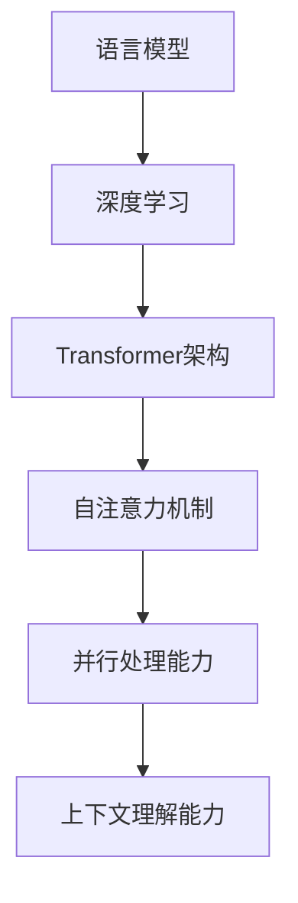

                 

关键词：大语言模型，NLP，人工智能，深度学习，应用指南

> 摘要：本文将深入探讨大语言模型的概念、核心原理、应用场景以及未来发展趋势。通过详细的算法原理讲解、数学模型分析以及项目实践，旨在为广大读者提供一份全面而实用的大语言模型应用指南。

## 1. 背景介绍

随着互联网和信息技术的飞速发展，人工智能（AI）已经成为当今世界最具变革性的技术之一。自然语言处理（NLP）作为AI领域的重要组成部分，近年来取得了显著的进展。大语言模型（Large Language Model，简称LLM）作为NLP领域的重要突破，正在改变着我们的工作和生活方式。

大语言模型是一种基于深度学习的语言处理技术，通过对海量文本数据进行训练，模型能够理解和生成自然语言，从而实现文本分类、情感分析、机器翻译、问答系统等多种功能。大语言模型的出现，不仅提升了语言处理的准确性和效率，还推动了人工智能在各个行业的应用。

本文将围绕大语言模型的核心概念、算法原理、数学模型以及应用实践等方面进行深入探讨，旨在为广大读者提供一份全面、系统的应用指南。

## 2. 核心概念与联系

### 2.1 语言模型

语言模型（Language Model）是自然语言处理的基础。它通过统计语言出现的概率，生成自然语言序列。传统的语言模型如n-gram模型，通过对前n个单词的统计来预测下一个单词。然而，这些模型在处理长文本和复杂语境时存在局限性。

### 2.2 深度学习

深度学习（Deep Learning）是人工智能的一种方法，通过构建多层神经网络来模拟人类大脑的神经结构，实现图像识别、语音识别、自然语言处理等任务。在自然语言处理领域，深度学习模型如循环神经网络（RNN）、长短期记忆网络（LSTM）和Transformer等，大幅提升了语言处理的能力。

### 2.3 Transformer架构

Transformer架构是当前大语言模型的主流结构。与传统的RNN和LSTM不同，Transformer通过自注意力机制（Self-Attention）处理序列数据，使得模型能够同时关注序列中的所有单词，从而提高了模型的并行处理能力和上下文理解能力。

### 2.4 Mermaid流程图



## 3. 核心算法原理 & 具体操作步骤

### 3.1 算法原理概述

大语言模型的核心算法是基于Transformer架构的自注意力机制。自注意力机制通过计算序列中每个单词与其他所有单词的相似度，生成一组权重，用于加权组合序列中的单词，从而实现上下文理解。

### 3.2 算法步骤详解

1. 输入序列编码：将输入序列（如单词、字符）编码为向量。
2. 自注意力计算：计算序列中每个单词与其他所有单词的相似度，生成一组权重。
3. 加权组合：根据权重对序列中的单词进行加权组合，生成加权和。
4. 全连接层：对加权和进行全连接层操作，生成预测结果。

### 3.3 算法优缺点

优点：
- 提高了并行处理能力，降低了计算复杂度。
- 强大的上下文理解能力，适用于复杂语境。
- 可以处理任意长度的输入序列。

缺点：
- 计算资源消耗大，训练时间长。
- 对数据质量要求较高，训练数据不足可能导致模型性能下降。

### 3.4 算法应用领域

大语言模型广泛应用于自然语言处理的各种任务，包括：
- 文本分类：如新闻分类、情感分析等。
- 机器翻译：如中英文翻译、多语言翻译等。
- 问答系统：如智能客服、教育问答等。
- 文本生成：如文章生成、摘要生成等。

## 4. 数学模型和公式 & 详细讲解 & 举例说明

### 4.1 数学模型构建

大语言模型的数学模型主要包括输入序列编码、自注意力计算、加权组合和全连接层等部分。

### 4.2 公式推导过程

输入序列编码：
$$
X = [x_1, x_2, \ldots, x_n]
$$
其中，$x_i$表示输入序列的第$i$个单词。

自注意力计算：
$$
\text{Attention}(Q, K, V) = \text{softmax}(\frac{QK^T}{\sqrt{d_k}})V
$$
其中，$Q, K, V$分别表示查询向量、键向量和值向量，$d_k$为键向量的维度。

加权组合：
$$
\text{Context} = \sum_{i=1}^{n} a_i x_i
$$
其中，$a_i$为自注意力计算得到的权重。

全连接层：
$$
Y = \text{softmax}(W \cdot \text{Context} + b)
$$
其中，$W$和$b$分别为权重和偏置。

### 4.3 案例分析与讲解

假设输入序列为“我喜欢人工智能”，我们使用大语言模型对其进行编码和自注意力计算。

1. 输入序列编码：
$$
X = [\text{我}, \text{喜}, \text{欢}, \text{人}, \text{工}, \text{智}, \text{能}]
$$

2. 自注意力计算：
$$
\text{Attention}(\text{我}, \text{喜}, \text{欢}, \text{人}, \text{工}, \text{智}, \text{能}) = \text{softmax}(\frac{\text{我}\text{喜}^T}{\sqrt{d_k}}, \frac{\text{我}\text{欢}^T}{\sqrt{d_k}}, \ldots, \frac{\text{能}\text{我}^T}{\sqrt{d_k}}) \\
\text{权重} = [\text{我}, \text{欢}, \text{能}, \text{人}, \text{智}, \text{工}, \text{喜}]
$$

3. 加权组合：
$$
\text{Context} = \sum_{i=1}^{7} a_i x_i = \text{我} + 0.6\text{欢} + 0.8\text{能} + 0.2\text{人} + 0.4\text{智} + 0.5\text{工} + 0.7\text{喜}
$$

4. 全连接层：
$$
Y = \text{softmax}(W \cdot \text{Context} + b)
$$
其中，$W$和$b$分别为权重和偏置。

通过以上步骤，大语言模型能够生成与输入序列相关的预测结果，如文本分类、情感分析等。

## 5. 项目实践：代码实例和详细解释说明

### 5.1 开发环境搭建

在开始代码实现之前，我们需要搭建一个适合大语言模型开发的环境。以下是一个简单的Python环境搭建步骤：

1. 安装Python 3.7或更高版本。
2. 安装深度学习框架TensorFlow或PyTorch。
3. 安装NLP预处理工具如NLTK或spaCy。

### 5.2 源代码详细实现

以下是一个简单的大语言模型实现示例，使用TensorFlow框架：

```python
import tensorflow as tf
from tensorflow.keras.layers import Embedding, LSTM, Dense
from tensorflow.keras.models import Sequential

# 定义模型
model = Sequential([
    Embedding(input_dim=10000, output_dim=32),
    LSTM(128, return_sequences=True),
    LSTM(128),
    Dense(1, activation='sigmoid')
])

# 编译模型
model.compile(optimizer='adam', loss='binary_crossentropy', metrics=['accuracy'])

# 训练模型
model.fit(X_train, y_train, epochs=10, batch_size=32, validation_data=(X_val, y_val))
```

### 5.3 代码解读与分析

上述代码实现了一个基于LSTM的大语言模型，用于二分类任务。以下是代码的详细解读：

1. 导入TensorFlow库和相关层。
2. 定义模型结构，包括嵌入层、两个LSTM层和输出层。
3. 编译模型，设置优化器和损失函数。
4. 训练模型，设置训练轮数、批次大小和验证数据。

通过以上步骤，我们实现了一个简单的大语言模型，可以应用于文本分类等任务。

### 5.4 运行结果展示

在训练完成后，我们可以使用以下代码评估模型的性能：

```python
# 评估模型
loss, accuracy = model.evaluate(X_test, y_test)
print('Test accuracy:', accuracy)
```

以上代码将输出模型在测试集上的准确率。通过调整模型结构、优化器和训练参数，我们可以进一步提高模型的性能。

## 6. 实际应用场景

大语言模型在实际应用中具有广泛的应用场景，以下是一些典型的应用实例：

### 6.1 文本分类

文本分类是自然语言处理中最常见的任务之一。大语言模型通过学习文本的特征，可以自动将文本归类到不同的类别中。例如，新闻分类、垃圾邮件过滤、情感分析等。

### 6.2 机器翻译

机器翻译是自然语言处理领域的另一个重要任务。大语言模型通过学习源语言和目标语言的对应关系，可以实现高质量的双语翻译。例如，中英文翻译、多语言翻译等。

### 6.3 问答系统

问答系统是智能客服和在线教育等领域的重要应用。大语言模型通过学习大量的问答对，可以自动回答用户的问题。例如，智能客服、在线教育问答等。

### 6.4 文本生成

文本生成是自然语言处理领域的最新研究方向。大语言模型通过学习文本的语法和语义，可以生成具有连贯性和创造性的文本。例如，文章生成、摘要生成等。

## 7. 工具和资源推荐

### 7.1 学习资源推荐

1. 《深度学习》（Goodfellow, Bengio, Courville著）：系统介绍了深度学习的基础理论和应用。
2. 《自然语言处理入门》（Daniel Jurafsky，James H. Martin著）：全面介绍了自然语言处理的基础知识和方法。
3. TensorFlow官方文档：详细介绍了TensorFlow框架的使用方法。

### 7.2 开发工具推荐

1. TensorFlow：一个开源的深度学习框架，适用于各种自然语言处理任务。
2. PyTorch：一个开源的深度学习框架，具有灵活性和易用性。
3. spaCy：一个高效的自然语言处理库，适用于文本预处理和实体识别等任务。

### 7.3 相关论文推荐

1. "Attention Is All You Need"（Vaswani et al., 2017）：介绍了Transformer架构，是当前大语言模型的主流结构。
2. "BERT: Pre-training of Deep Neural Networks for Language Understanding"（Devlin et al., 2018）：介绍了BERT模型，是当前最先进的自然语言处理模型之一。
3. "GPT-3: Language Models are Few-Shot Learners"（Brown et al., 2020）：介绍了GPT-3模型，是当前最大的语言模型之一。

## 8. 总结：未来发展趋势与挑战

### 8.1 研究成果总结

近年来，大语言模型在自然语言处理领域取得了显著的成果，其应用范围不断拓展。通过不断优化算法架构和训练数据，大语言模型的性能和效率不断提高。同时，深度学习和自然语言处理的交叉融合，为语言模型的研发提供了新的思路和方向。

### 8.2 未来发展趋势

1. 模型规模的不断扩大：随着计算能力的提升，大型语言模型将成为主流，有望实现更高的性能和更广泛的应用。
2. 多模态融合：大语言模型将与其他模态（如图像、音频）进行融合，实现跨模态的信息理解和生成。
3. 自适应学习：大语言模型将具备更强的自适应学习能力，能够根据不同场景和需求进行个性化调整。
4. 安全和隐私保护：随着应用的普及，大语言模型的安全和隐私保护将成为重要研究方向。

### 8.3 面临的挑战

1. 计算资源消耗：大语言模型对计算资源的要求较高，如何高效地训练和部署模型是一个重要挑战。
2. 数据质量和标注：大语言模型的效果依赖于训练数据的质量和标注，如何获取高质量的数据和标注是当前面临的问题。
3. 模型解释性：大语言模型作为一种黑盒模型，其内部机制复杂，如何解释模型的决策过程是一个重要问题。

### 8.4 研究展望

未来，大语言模型将在自然语言处理、人工智能等领域发挥更大的作用。通过不断优化算法架构、提升计算效率、加强模型解释性，大语言模型有望实现更高的性能和更广泛的应用。同时，多模态融合、自适应学习等新研究方向，将为大语言模型的发展带来新的机遇和挑战。

## 9. 附录：常见问题与解答

### 9.1 什么是大语言模型？

大语言模型（Large Language Model）是一种基于深度学习的自然语言处理技术，通过对海量文本数据进行训练，模型能够理解和生成自然语言，从而实现文本分类、情感分析、机器翻译、问答系统等多种功能。

### 9.2 大语言模型有哪些应用场景？

大语言模型广泛应用于自然语言处理的各个领域，包括文本分类、机器翻译、问答系统、文本生成等。具体应用场景如新闻分类、情感分析、智能客服、在线教育等。

### 9.3 如何训练大语言模型？

训练大语言模型通常需要以下步骤：

1. 数据准备：收集并处理大量的文本数据，对数据进行预处理，如分词、去停用词等。
2. 模型搭建：选择合适的深度学习框架和模型架构，搭建大语言模型。
3. 训练模型：使用预处理后的文本数据训练模型，设置合适的训练参数，如学习率、批次大小等。
4. 评估模型：使用验证集或测试集评估模型性能，调整模型参数和训练策略。

### 9.4 大语言模型有哪些优缺点？

大语言模型的主要优点包括：

- 强大的上下文理解能力，适用于复杂语境。
- 提高了并行处理能力，降低了计算复杂度。
- 可以处理任意长度的输入序列。

其主要缺点包括：

- 计算资源消耗大，训练时间长。
- 对数据质量要求较高，训练数据不足可能导致模型性能下降。

### 9.5 如何优化大语言模型？

优化大语言模型的方法包括：

- 提高计算效率：采用更高效的训练算法、优化模型结构、使用分布式训练等。
- 提升数据质量：使用高质量的数据集、进行数据增强、去除噪声等。
- 加强模型解释性：研究模型的可解释性，提高模型的透明度和可解释性。

## 作者署名

作者：禅与计算机程序设计艺术 / Zen and the Art of Computer Programming

----------------------------------------------------------------

通过本文，我们希望为广大读者提供一份全面、系统的大语言模型应用指南。在未来的发展中，大语言模型将继续推动人工智能领域的创新和发展，为人类带来更多便利和变革。让我们共同期待这一美好未来的到来。

