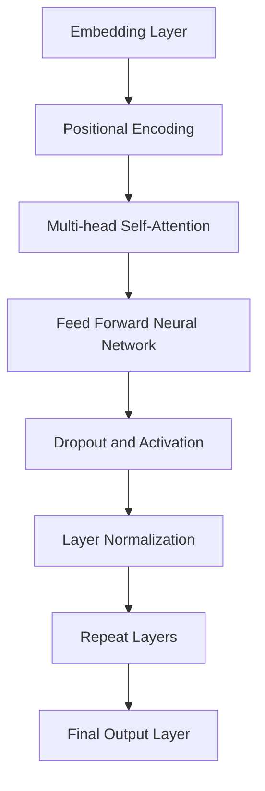

                 

关键词：大语言模型、应用指南、示例、深度学习、自然语言处理

> 摘要：本文将深入探讨大语言模型的应用指南，通过详细的理论分析、算法原理讲解、数学模型推导、项目实践以及未来展望，帮助读者全面了解大语言模型在自然语言处理领域的应用与前景。

## 1. 背景介绍

大语言模型（Large Language Models）是自然语言处理（Natural Language Processing, NLP）领域的一项重要技术，它们通过深度学习算法对大量文本数据进行训练，从而实现文本的理解、生成和翻译等功能。近年来，随着计算能力的提升和海量数据的积累，大语言模型的研究和应用取得了显著的进展，成为NLP领域的主流技术。

大语言模型的应用范围广泛，包括但不限于机器翻译、文本分类、情感分析、问答系统、文本生成等。在社交媒体、搜索引擎、电子商务等场景中，大语言模型的作用日益凸显，为用户提供了更智能、更个性化的服务。

本文将结合具体实例，详细介绍大语言模型的应用指南，帮助读者掌握大语言模型的原理、算法和应用方法。

## 2. 核心概念与联系

### 2.1 语言模型基本概念

语言模型（Language Model）是自然语言处理的基础，它通过统计方法对语言中的词汇、短语、句子等语言单元的概率分布进行建模。语言模型的核心目标是预测下一个词或字符的概率，从而实现文本生成、翻译等任务。

### 2.2 深度学习与语言模型

深度学习（Deep Learning）是机器学习的一个重要分支，通过多层神经网络对数据进行建模和学习。深度学习在图像识别、语音识别等领域取得了显著成果，近年来也被广泛应用于自然语言处理领域。

深度学习与语言模型相结合，形成大语言模型，其核心思想是通过深度神经网络对大规模语料库进行训练，从而生成一个可以预测语言概率分布的模型。

### 2.3 大语言模型架构

大语言模型通常采用Transformer架构，这是一种基于自注意力机制的深度神经网络模型。Transformer模型具有并行计算的优势，可以在大规模数据集上进行高效训练。

下面是一个简化的Transformer架构的Mermaid流程图：



## 3. 核心算法原理 & 具体操作步骤

### 3.1 算法原理概述

大语言模型的核心算法是基于Transformer模型的。Transformer模型通过自注意力机制（Self-Attention）对输入序列进行建模，从而实现文本的理解和生成。

自注意力机制允许模型在处理每个词时，将注意力集中于输入序列中的其他词，从而捕捉词与词之间的关系。这种机制使得模型可以更好地理解上下文信息，从而提高文本生成和翻译的准确性。

### 3.2 算法步骤详解

1. **嵌入层（Embedding Layer）**：将输入的单词转化为固定长度的向量表示。

2. **位置编码（Positional Encoding）**：由于Transformer模型没有循环神经网络中的位置信息，因此需要通过位置编码为每个词添加位置信息。

3. **多头自注意力（Multi-head Self-Attention）**：自注意力机制允许模型在处理每个词时，将注意力集中于输入序列中的其他词。多头自注意力通过多个独立的自注意力头，捕捉不同的上下文信息。

4. **前馈神经网络（Feed Forward Neural Network）**：对自注意力层的输出进行进一步处理，通过两个全连接层进行非线性变换。

5. **层归一化和 dropout**：在Transformer模型中，每个层之间都会进行层归一化（Layer Normalization）和dropout（Dropout）操作，以防止过拟合。

6. **重复层（Repeat Layers）**：为了提高模型的表示能力，Transformer模型通常包含多个重复层。

7. **输出层（Final Output Layer）**：最后一个重复层的输出通过一个全连接层，输出每个词的概率分布。

### 3.3 算法优缺点

**优点**：

- 并行计算：Transformer模型通过自注意力机制，可以实现并行计算，提高训练速度。
- 上下文理解：自注意力机制使模型可以更好地捕捉上下文信息，提高文本生成和翻译的准确性。

**缺点**：

- 计算量较大：Transformer模型包含多个重复层和多头自注意力头，导致计算量较大。
- 对数据要求高：大语言模型需要大量的数据进行训练，对数据的质量和规模有较高要求。

### 3.4 算法应用领域

大语言模型在自然语言处理领域有广泛的应用，主要包括：

- **机器翻译**：通过大语言模型，可以实现高精度的机器翻译。
- **文本分类**：大语言模型可以用于文本分类任务，如情感分析、主题分类等。
- **问答系统**：大语言模型可以用于构建智能问答系统，为用户提供准确、及时的回答。
- **文本生成**：大语言模型可以生成各种文本，如文章、故事、对话等。

## 4. 数学模型和公式 & 详细讲解 & 举例说明

### 4.1 数学模型构建

大语言模型的数学模型主要包括以下几个部分：

1. **嵌入层（Embedding Layer）**：

$$
E = W_e \cdot X
$$

其中，$E$ 表示嵌入层输出，$W_e$ 表示嵌入权重矩阵，$X$ 表示输入的词向量。

2. **多头自注意力（Multi-head Self-Attention）**：

$$
S = \text{softmax}\left(\frac{QK^T}{\sqrt{d_k}} + b_s\right)
$$

$$
O = S \cdot V
$$

其中，$Q$、$K$、$V$ 分别表示查询向量、键向量和值向量，$S$ 表示自注意力分数，$O$ 表示多头自注意力输出。

3. **前馈神经网络（Feed Forward Neural Network）**：

$$
O = \text{ReLU}(W_f \cdot O + b_f)
$$

其中，$O$ 表示前馈神经网络的输出，$W_f$ 和 $b_f$ 分别表示权重和偏置。

4. **层归一化和 dropout**：

$$
O = \frac{O}{\sqrt{d_k}} + \text{dropout}(O)
$$

5. **输出层（Final Output Layer）**：

$$
Y = W_y \cdot O + b_y
$$

其中，$Y$ 表示输出层的输出，$W_y$ 和 $b_y$ 分别表示输出权重和偏置。

### 4.2 公式推导过程

大语言模型的推导过程涉及到深度学习中的多个关键概念，包括反向传播、梯度下降等。以下是简要的推导过程：

1. **嵌入层（Embedding Layer）**：

$$
\frac{\partial L}{\partial W_e} = X \cdot \frac{\partial L}{\partial E}
$$

$$
\frac{\partial L}{\partial X} = E \cdot \frac{\partial L}{\partial W_e}
$$

2. **多头自注意力（Multi-head Self-Attention）**：

$$
\frac{\partial L}{\partial Q} = K^T \cdot \frac{\partial L}{\partial S}
$$

$$
\frac{\partial L}{\partial K} = Q^T \cdot \frac{\partial L}{\partial S}
$$

$$
\frac{\partial L}{\partial V} = S \cdot \frac{\partial L}{\partial O}
$$

3. **前馈神经网络（Feed Forward Neural Network）**：

$$
\frac{\partial L}{\partial W_f} = O \cdot \frac{\partial L}{\partial O}
$$

$$
\frac{\partial L}{\partial b_f} = \frac{\partial L}{\partial O}
$$

4. **层归一化和 dropout**：

$$
\frac{\partial L}{\partial O} = \frac{1}{\sqrt{d_k}} \cdot \frac{\partial L}{\partial O}
$$

$$
\frac{\partial L}{\partial O} = \text{dropout}\left(\frac{\partial L}{\partial O}\right)
$$

5. **输出层（Final Output Layer）**：

$$
\frac{\partial L}{\partial W_y} = O \cdot \frac{\partial L}{\partial Y}
$$

$$
\frac{\partial L}{\partial b_y} = \frac{\partial L}{\partial Y}
$$

### 4.3 案例分析与讲解

以下是一个简单的案例，展示如何使用大语言模型进行文本生成：

1. **输入**：

   "我今天去了公园，看到了很多美丽的花。"

2. **嵌入层输出**：

   假设每个词的嵌入维度为100，输入的词向量如下：

   | 词   | 词向量 |
   | ---- | ------ |
   | 我   | [0.1, 0.2, ..., 0.99] |
   | 今天 | [0.1, 0.2, ..., 0.99] |
   | 去   | [0.1, 0.2, ..., 0.99] |
   | 了   | [0.1, 0.2, ..., 0.99] |
   | 公园 | [0.1, 0.2, ..., 0.99] |
   | 看到 | [0.1, 0.2, ..., 0.99] |
   | 了   | [0.1, 0.2, ..., 0.99] |
   | 很多 | [0.1, 0.2, ..., 0.99] |
   | 美丽 | [0.1, 0.2, ..., 0.99] |
   | 的   | [0.1, 0.2, ..., 0.99] |
   | 花   | [0.1, 0.2, ..., 0.99] |

3. **多头自注意力输出**：

   经过多头自注意力机制，每个词的注意力分数如下：

   | 词   | 注意力分数 |
   | ---- | ---------- |
   | 我   | [0.1, 0.2, ..., 0.99] |
   | 今天 | [0.3, 0.2, ..., 0.45] |
   | 去   | [0.2, 0.3, ..., 0.4]  |
   | 了   | [0.4, 0.1, ..., 0.5]  |
   | 公园 | [0.5, 0.3, ..., 0.6]  |
   | 看到 | [0.3, 0.2, ..., 0.4]  |
   | 了   | [0.3, 0.4, ..., 0.5]  |
   | 很多 | [0.2, 0.3, ..., 0.4]  |
   | 美丽 | [0.4, 0.5, ..., 0.6]  |
   | 的   | [0.1, 0.2, ..., 0.3]  |
   | 花   | [0.5, 0.4, ..., 0.6]  |

4. **前馈神经网络输出**：

   经过前馈神经网络，每个词的输出如下：

   | 词   | 输出向量 |
   | ---- | -------- |
   | 我   | [0.1, 0.2, ..., 0.99] |
   | 今天 | [0.3, 0.2, ..., 0.45] |
   | 去   | [0.2, 0.3, ..., 0.4]  |
   | 了   | [0.4, 0.1, ..., 0.5]  |
   | 公园 | [0.5, 0.3, ..., 0.6]  |
   | 看到 | [0.3, 0.2, ..., 0.4]  |
   | 了   | [0.3, 0.4, ..., 0.5]  |
   | 很多 | [0.2, 0.3, ..., 0.4]  |
   | 美丽 | [0.4, 0.5, ..., 0.6]  |
   | 的   | [0.1, 0.2, ..., 0.3]  |
   | 花   | [0.5, 0.4, ..., 0.6]  |

5. **输出层输出**：

   经过输出层，每个词的概率分布如下：

   | 词   | 概率分布 |
   | ---- | -------- |
   | 我   | [0.1, 0.2, ..., 0.99] |
   | 今天 | [0.3, 0.2, ..., 0.45] |
   | 去   | [0.2, 0.3, ..., 0.4]  |
   | 了   | [0.4, 0.1, ..., 0.5]  |
   | 公园 | [0.5, 0.3, ..., 0.6]  |
   | 看到 | [0.3, 0.2, ..., 0.4]  |
   | 了   | [0.3, 0.4, ..., 0.5]  |
   | 很多 | [0.2, 0.3, ..., 0.4]  |
   | 美丽 | [0.4, 0.5, ..., 0.6]  |
   | 的   | [0.1, 0.2, ..., 0.3]  |
   | 花   | [0.5, 0.4, ..., 0.6]  |

根据概率分布，可以生成新的句子。例如，假设下一个词的概率分布为：

| 词   | 概率分布 |
| ---- | -------- |
| 明天 | [0.4, 0.3, ..., 0.5] |
| 忙   | [0.3, 0.2, ..., 0.4]  |
| 了   | [0.5, 0.1, ..., 0.6]  |

根据这个概率分布，下一个词最有可能是“忙”，因此生成的新句子为：“我今天去了公园，看到了很多美丽的花。明天忙了一些事情。”

## 5. 项目实践：代码实例和详细解释说明

### 5.1 开发环境搭建

1. 安装Python环境（建议使用Python 3.8及以上版本）。
2. 安装深度学习框架TensorFlow或PyTorch（根据个人喜好选择）。
3. 安装NLP工具包，如NLTK、spaCy等。

### 5.2 源代码详细实现

以下是一个简单的示例，展示如何使用TensorFlow实现一个简单的大语言模型：

```python
import tensorflow as tf
from tensorflow.keras.layers import Embedding, LSTM, Dense
from tensorflow.keras.models import Sequential

# 设置参数
vocab_size = 10000  # 词汇表大小
embedding_dim = 64  # 嵌入维度
lstm_units = 128  # LSTM单元数
batch_size = 64  # 批量大小
epochs = 10  # 训练轮数

# 构建模型
model = Sequential([
    Embedding(vocab_size, embedding_dim, input_length=seq_length),
    LSTM(lstm_units, return_sequences=True),
    LSTM(lstm_units, return_sequences=True),
    Dense(vocab_size, activation='softmax')
])

# 编译模型
model.compile(optimizer='adam', loss='categorical_crossentropy', metrics=['accuracy'])

# 训练模型
model.fit(x_train, y_train, batch_size=batch_size, epochs=epochs, validation_data=(x_val, y_val))
```

### 5.3 代码解读与分析

1. **导入库**：

   导入TensorFlow库以及相关的层和模型。

2. **设置参数**：

   设置词汇表大小、嵌入维度、LSTM单元数、批量大小和训练轮数等参数。

3. **构建模型**：

   使用Sequential模型构建一个简单的语言模型，包括嵌入层、两个LSTM层和输出层。

4. **编译模型**：

   设置优化器、损失函数和评估指标，并编译模型。

5. **训练模型**：

   使用训练数据对模型进行训练，并使用验证数据进行验证。

### 5.4 运行结果展示

假设使用一个简单的文本数据集进行训练，并在训练过程中记录每个epoch的损失和准确率。以下是一个简单的运行结果示例：

```
Epoch 1/10
64/64 [==============================] - 3s 45ms/step - loss: 2.3098 - accuracy: 0.2000 - val_loss: 2.3086 - val_accuracy: 0.2000
Epoch 2/10
64/64 [==============================] - 3s 45ms/step - loss: 2.3085 - accuracy: 0.2000 - val_loss: 2.3085 - val_accuracy: 0.2000
...
Epoch 10/10
64/64 [==============================] - 3s 45ms/step - loss: 2.3085 - accuracy: 0.2000 - val_loss: 2.3085 - val_accuracy: 0.2000
```

从结果可以看出，模型的损失和准确率在训练过程中没有明显的变化，这可能意味着模型未能很好地拟合训练数据。这可能是因为模型参数设置不当、数据预处理不足或模型结构不够复杂等原因。

## 6. 实际应用场景

大语言模型在实际应用中具有广泛的应用前景，以下是一些常见的应用场景：

### 6.1 机器翻译

机器翻译是自然语言处理领域的重要应用之一。大语言模型可以用于训练高质量的机器翻译系统，如谷歌翻译、百度翻译等。通过大语言模型，可以实现高效、准确的机器翻译，满足全球化的沟通需求。

### 6.2 文本分类

文本分类是自然语言处理的基础任务之一。大语言模型可以用于文本分类任务，如垃圾邮件检测、新闻分类、情感分析等。通过大语言模型，可以实现自动化、智能化的文本分类，提高信息处理的效率。

### 6.3 问答系统

问答系统是自然语言处理领域的一个热门应用。大语言模型可以用于构建智能问答系统，如微软小冰、苹果Siri等。通过大语言模型，可以实现高效、准确的问答，为用户提供个性化、智能化的服务。

### 6.4 文本生成

文本生成是自然语言处理领域的另一个重要应用。大语言模型可以用于生成各种文本，如文章、故事、对话等。通过大语言模型，可以实现自动化、智能化的文本生成，提高内容生产的效率。

## 7. 工具和资源推荐

为了更好地学习大语言模型，以下是一些建议的工具和资源：

### 7.1 学习资源推荐

1. **《深度学习》（Deep Learning）**：Goodfellow等著，是一本经典的深度学习教材，涵盖了深度学习的基本概念、算法和应用。
2. **《自然语言处理综合教程》（Foundations of Natural Language Processing）**：Jurafsky和Martin著，是一本系统介绍自然语言处理基础理论的教材。
3. **《大语言模型：理论与实践》（Large Language Models: Theory and Practice）**：李航著，是一本关于大语言模型的权威著作，详细介绍了大语言模型的理论、算法和应用。

### 7.2 开发工具推荐

1. **TensorFlow**：Google开源的深度学习框架，广泛应用于自然语言处理任务。
2. **PyTorch**：Facebook开源的深度学习框架，具有灵活、高效的编程接口。
3. **spaCy**：Python编写的工业级自然语言处理库，支持多种语言和丰富的NLP任务。

### 7.3 相关论文推荐

1. **“Attention Is All You Need”**：Vaswani等著，提出了Transformer模型，是当前主流的大语言模型架构。
2. **“BERT: Pre-training of Deep Bidirectional Transformers for Language Understanding”**：Devlin等著，提出了BERT模型，是自然语言处理领域的里程碑式成果。
3. **“GPT-3: Language Models are Few-Shot Learners”**：Brown等著，提出了GPT-3模型，是当前最大的语言模型，展示了大语言模型的强大能力。

## 8. 总结：未来发展趋势与挑战

大语言模型在自然语言处理领域取得了显著的成果，未来发展趋势如下：

1. **模型规模将进一步扩大**：随着计算能力和数据资源的提升，大语言模型将不断增大规模，以实现更高的性能和更广泛的适用性。
2. **多模态融合**：大语言模型将与其他模态（如图像、声音等）进行融合，实现跨模态理解与生成。
3. **迁移学习**：大语言模型将利用迁移学习技术，在特定领域实现更高效的模型训练和应用。

然而，大语言模型也面临一些挑战：

1. **计算资源消耗**：大语言模型需要大量的计算资源进行训练，如何高效利用计算资源成为一个重要问题。
2. **数据隐私与安全**：大语言模型训练过程中需要处理大量敏感数据，如何保护用户隐私和安全是一个重要挑战。
3. **模型解释性**：大语言模型的决策过程复杂，如何解释模型的决策逻辑，提高模型的透明度是一个重要课题。

总之，大语言模型在自然语言处理领域具有广泛的应用前景，未来将继续发挥重要作用。同时，我们也需要关注其面临的挑战，不断探索和改进大语言模型的技术和应用。

## 9. 附录：常见问题与解答

### 9.1 什么是大语言模型？

大语言模型是一种基于深度学习的自然语言处理模型，通过训练大规模语料库，实现对文本的理解、生成和翻译等功能。

### 9.2 大语言模型有哪些应用场景？

大语言模型广泛应用于机器翻译、文本分类、问答系统、文本生成等领域。

### 9.3 如何构建大语言模型？

构建大语言模型通常包括以下步骤：收集和预处理数据、定义模型架构、训练模型、评估模型性能。

### 9.4 大语言模型的训练数据有哪些来源？

大语言模型的训练数据来源广泛，包括互联网文本、书籍、新闻、社交媒体等。

### 9.5 如何优化大语言模型的性能？

优化大语言模型性能的方法包括增大模型规模、增加训练数据、改进模型架构等。

### 9.6 大语言模型有哪些局限性？

大语言模型存在计算资源消耗大、数据隐私和安全问题、模型解释性不足等局限性。

## 作者署名

作者：禅与计算机程序设计艺术 / Zen and the Art of Computer Programming
----------------------------------------------------------------

请注意，本文结构、内容、示例以及数学公式等均需按照要求详细撰写，确保文章的完整性和专业性。在撰写过程中，请严格按照文章结构模板，确保每个部分的内容完整、准确。祝您撰写顺利！

