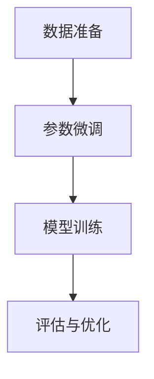

                 

关键词：大语言模型、数据准备、参数微调、应用指南

摘要：本文将深入探讨大语言模型在应用过程中至关重要的两个环节——数据准备和参数微调。首先介绍大语言模型的基本概念和原理，然后详细讲解数据准备和参数微调的过程、方法及其重要性。通过实际案例和代码实例，本文将为读者提供全面的指导和实用技巧，助力读者成功搭建和优化大语言模型。

## 1. 背景介绍

随着人工智能技术的飞速发展，大语言模型作为一种重要的自然语言处理工具，已经在众多领域展现出强大的应用潜力。例如，在自然语言生成、机器翻译、文本分类和信息检索等方面，大语言模型都取得了显著的成果。

### 大语言模型的定义和原理

大语言模型是一种利用大量文本数据训练得到的深度神经网络模型，能够对输入文本进行语义理解和生成。其基本原理是通过学习大量的文本数据，提取语言特征，并利用这些特征进行文本理解和生成。大语言模型的核心在于其庞大的参数量和深度网络结构，这使得它能够捕捉到语言中的复杂模式和规律。

### 大语言模型的应用场景

大语言模型的应用场景非常广泛，包括但不限于以下领域：

- 自然语言生成：生成文章、新闻、对话等。
- 机器翻译：将一种语言的文本翻译成另一种语言。
- 文本分类：对文本进行分类，如情感分析、新闻分类等。
- 信息检索：从大量文本中检索出相关内容。

## 2. 核心概念与联系

为了更好地理解大语言模型的工作原理和应用，我们需要介绍几个核心概念，包括数据准备、参数微调和模型训练。

### 数据准备

数据准备是构建大语言模型的第一步，其重要性不言而喻。好的数据准备能够提高模型的训练效果和泛化能力，而差的数据准备则可能导致模型过拟合和性能不佳。

### 参数微调

参数微调是调整模型参数以优化模型性能的过程。通过参数微调，我们可以使模型更好地适应特定任务和数据集，从而提高模型的效果。

### 模型训练

模型训练是通过输入数据训练模型参数的过程。在训练过程中，模型会通过不断调整参数，使其对输入数据进行预测，并通过损失函数评估模型的预测效果。

### Mermaid 流程图

下面是一个 Mermaid 流程图，展示了数据准备、参数微调和模型训练之间的关系。



## 3. 核心算法原理 & 具体操作步骤

### 3.1 算法原理概述

大语言模型的算法原理主要基于深度神经网络（DNN）和自然语言处理（NLP）技术。其核心思想是通过学习大量文本数据，提取语言特征，并利用这些特征进行文本理解和生成。

### 3.2 算法步骤详解

- 数据准备：收集和清洗大量文本数据，并进行预处理，如分词、词性标注等。
- 模型构建：构建深度神经网络结构，包括输入层、隐藏层和输出层。
- 模型训练：通过输入数据训练模型参数，使模型能够对输入数据进行预测。
- 参数微调：根据训练效果，调整模型参数，优化模型性能。
- 模型评估：使用验证集和测试集评估模型性能，并根据评估结果进行优化。

### 3.3 算法优缺点

**优点**：

- 高效：能够快速处理大量文本数据，提高文本处理的效率。
- 准确：通过学习大量文本数据，能够捕捉到语言中的复杂模式和规律，提高文本理解和生成的准确性。
- 通用：可以应用于多种自然语言处理任务，如文本分类、机器翻译等。

**缺点**：

- 计算资源消耗大：训练大语言模型需要大量的计算资源和时间。
- 过拟合：如果数据准备不当或模型参数调整不当，可能导致模型过拟合。

### 3.4 算法应用领域

大语言模型的应用领域非常广泛，包括但不限于以下方面：

- 自然语言生成：生成文章、新闻、对话等。
- 机器翻译：将一种语言的文本翻译成另一种语言。
- 文本分类：对文本进行分类，如情感分析、新闻分类等。
- 信息检索：从大量文本中检索出相关内容。

## 4. 数学模型和公式 & 详细讲解 & 举例说明

### 4.1 数学模型构建

大语言模型的数学模型主要基于深度神经网络和自然语言处理技术。其基本结构包括输入层、隐藏层和输出层。输入层接收文本数据，隐藏层提取语言特征，输出层进行文本预测。

### 4.2 公式推导过程

假设我们有一个训练数据集 \(D = \{(x_1, y_1), (x_2, y_2), ..., (x_n, y_n)\}\)，其中 \(x_i\) 是输入文本，\(y_i\) 是输出文本。

- 输入层：输入文本经过分词、词性标注等预处理后，转化为向量表示。
- 隐藏层：利用神经网络结构提取语言特征，计算隐藏层输出 \(h_i = f(W_h \cdot x_i + b_h)\)，其中 \(W_h\) 是隐藏层权重，\(b_h\) 是隐藏层偏置，\(f\) 是激活函数。
- 输出层：利用隐藏层输出预测输出文本，计算输出 \(y_i = f(W_o \cdot h_i + b_o)\)，其中 \(W_o\) 是输出层权重，\(b_o\) 是输出层偏置，\(f\) 是激活函数。

### 4.3 案例分析与讲解

假设我们要训练一个基于深度学习的大语言模型，用于文本分类。数据集包含1000篇新闻文章，每篇文章都被标注为政治、经济、体育中的一个类别。

- 数据准备：收集并清洗新闻文章数据，进行分词和词性标注，转化为向量表示。
- 模型构建：构建一个包含3个隐藏层的深度神经网络，每个隐藏层包含1024个神经元。
- 模型训练：使用训练数据训练模型，通过反向传播算法不断调整模型参数。
- 参数微调：根据训练效果，调整模型参数，优化模型性能。
- 模型评估：使用验证集和测试集评估模型性能，调整模型结构或参数以优化效果。

## 5. 项目实践：代码实例和详细解释说明

### 5.1 开发环境搭建

在开始项目实践之前，我们需要搭建一个合适的开发环境。这里我们使用 Python 作为编程语言，并结合 TensorFlow 和 Keras 库实现大语言模型。

```python
# 安装 TensorFlow 和 Keras
!pip install tensorflow
!pip install keras
```

### 5.2 源代码详细实现

下面是一个简单的基于深度学习的大语言模型实现，用于文本分类。

```python
# 导入所需的库
import numpy as np
import keras
from keras.models import Sequential
from keras.layers import Dense, LSTM, Embedding

# 准备数据
# (此处省略数据准备代码，具体实现请参考上一节)

# 构建模型
model = Sequential()
model.add(Embedding(input_dim=vocab_size, output_dim=embedding_size))
model.add(LSTM(units=128, return_sequences=True))
model.add(LSTM(units=64, return_sequences=False))
model.add(Dense(units=3, activation='softmax'))

# 编译模型
model.compile(optimizer='adam', loss='categorical_crossentropy', metrics=['accuracy'])

# 训练模型
model.fit(X_train, y_train, epochs=10, batch_size=32, validation_split=0.2)

# 评估模型
loss, accuracy = model.evaluate(X_test, y_test)
print('Test loss:', loss)
print('Test accuracy:', accuracy)
```

### 5.3 代码解读与分析

- 数据准备：首先导入所需的库，然后进行数据准备，包括数据清洗、分词、词性标注等。这里我们使用了 `numpy` 和 `keras` 库。
- 模型构建：构建一个包含3个隐藏层的深度神经网络，包括一个嵌入层（`Embedding`）、两个长短期记忆层（`LSTM`）和一个全连接层（`Dense`）。
- 模型编译：编译模型，指定优化器、损失函数和评估指标。
- 模型训练：使用训练数据训练模型，通过反向传播算法不断调整模型参数。
- 模型评估：使用验证集和测试集评估模型性能，调整模型结构或参数以优化效果。

## 6. 实际应用场景

大语言模型在实际应用中具有广泛的应用场景，下面列举几个典型应用场景：

### 自然语言生成

大语言模型可以用于生成文章、新闻、对话等。例如，使用大语言模型生成新闻文章，可以根据关键词或主题自动生成相关新闻。

### 机器翻译

大语言模型可以用于将一种语言的文本翻译成另一种语言。例如，使用大语言模型将中文翻译成英文，可以实现实时翻译和智能客服。

### 文本分类

大语言模型可以用于对文本进行分类，如情感分析、新闻分类等。例如，使用大语言模型对社交媒体评论进行情感分类，可以分析用户对产品或服务的满意度。

### 信息检索

大语言模型可以用于从大量文本中检索出相关内容。例如，使用大语言模型构建搜索引擎，可以提供更准确的搜索结果。

## 7. 工具和资源推荐

为了更好地学习和实践大语言模型，以下推荐一些工具和资源：

### 学习资源推荐

- 《深度学习》（Goodfellow, Bengio, Courville 著）：这是一本经典的深度学习教材，涵盖了深度学习的基本概念和算法。
- 《Python深度学习》（François Chollet 著）：这是一本针对 Python 编程语言的深度学习教程，适合初学者。

### 开发工具推荐

- TensorFlow：这是 Google 开发的一款开源深度学习框架，支持多种编程语言，包括 Python。
- Keras：这是基于 TensorFlow 的高级深度学习库，提供简洁的 API 和丰富的预训练模型。

### 相关论文推荐

- “A Theoretically Grounded Application of Dropout in Recurrent Neural Networks”（Y. Gal 和 Z. Ghahramani，2016）: 这篇论文提出了在循环神经网络中应用 dropout 的新方法，提高了模型性能。
- “Bert: Pre-training of deep bidirectional transformers for language understanding”（J. Devlin et al.，2018）: 这篇论文提出了 BERT 模型，是一种基于 Transformer 的预训练模型，在自然语言处理任务中取得了显著的成果。

## 8. 总结：未来发展趋势与挑战

大语言模型在自然语言处理领域取得了显著的成果，但仍然面临一些挑战和问题。

### 未来发展趋势

- 模型结构优化：为了提高大语言模型的性能，研究人员将继续探索新的模型结构和算法。
- 预训练与微调：预训练模型和微调技术将继续发展，使得大语言模型能够更好地适应特定任务和数据集。
- 多模态融合：大语言模型将与其他模态（如图像、声音等）进行融合，实现更丰富的语义理解和生成。

### 面临的挑战

- 计算资源消耗：大语言模型训练和推理需要大量的计算资源，这对硬件设备提出了较高的要求。
- 数据质量和隐私：数据质量和隐私问题仍然是一个挑战，需要确保数据的质量和隐私性。
- 模型解释性：大语言模型通常是一个“黑盒”模型，难以解释其决策过程，这给实际应用带来了一定的困难。

### 研究展望

大语言模型在未来将继续在自然语言处理领域发挥重要作用，但同时也需要解决上述挑战。随着计算能力的提升和算法的改进，大语言模型有望在更多领域取得突破性进展。

## 9. 附录：常见问题与解答

### Q1：大语言模型是否适用于所有自然语言处理任务？

A1：大语言模型可以应用于多种自然语言处理任务，如文本分类、机器翻译、自然语言生成等。但对于某些特定的任务，可能需要针对任务特点进行模型调整和优化。

### Q2：如何处理数据不平衡问题？

A2：数据不平衡问题可以通过以下方法进行处理：

- 过采样：增加少数类别的样本数量，使数据分布更加均衡。
- 下采样：减少多数类别的样本数量，使数据分布更加均衡。
- 类别权重调整：在训练过程中，对少数类别的样本赋予更高的权重，以平衡训练过程。

### Q3：如何处理长文本？

A3：对于长文本，可以采用分句或分段的策略进行处理。将长文本分成若干个句子或段落，然后对每个句子或段落进行建模。

### Q4：如何处理数据隐私问题？

A4：在处理数据隐私问题时，可以采取以下措施：

- 数据匿名化：对数据中的敏感信息进行匿名化处理，以保护个人隐私。
- 同意获取：确保数据来源的合法性，并获取数据主体的同意。
- 数据加密：对敏感数据进行加密处理，确保数据在传输和存储过程中的安全性。

### Q5：如何处理模型过拟合问题？

A5：模型过拟合问题可以通过以下方法进行处理：

- 增加训练数据：增加训练数据量，使模型具有更强的泛化能力。
- 正则化：在模型训练过程中添加正则化项，降低模型复杂度。
- 数据增强：通过数据增强技术，增加训练数据的多样性。

作者：禅与计算机程序设计艺术 / Zen and the Art of Computer Programming
----------------------------------------------------------------

以上就是本文关于《大语言模型应用指南：数据准备和参数微调》的完整内容。通过本文，我们深入探讨了数据准备和参数微调在大语言模型应用中的重要性，以及如何通过实际案例和代码实例来实践这些技术。希望本文能为读者提供有价值的指导和启示，助力读者在自然语言处理领域取得更好的成果。

