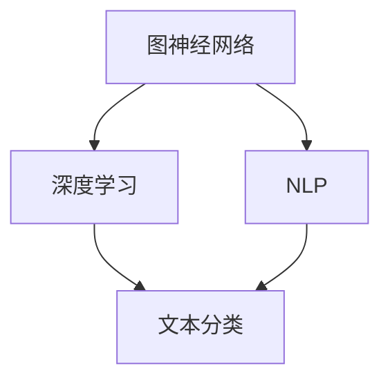

                 

关键词：大语言模型、神经网络、算法原理、应用领域、数学模型、代码实例、未来展望

> 摘要：本文旨在为读者提供一份全面的大语言模型应用指南，深入探讨神经网络的三要素，并通过对算法原理、数学模型和项目实践等方面的详细讲解，帮助读者更好地理解和应用大语言模型。

## 1. 背景介绍

随着人工智能技术的不断发展，大语言模型作为一种重要的技术手段，已经在自然语言处理、文本生成、机器翻译、问答系统等多个领域取得了显著的成果。大语言模型的核心在于其强大的表示能力和自适应能力，能够通过大量的数据学习到语言的复杂规律，从而实现高效的语言理解和生成。

然而，大语言模型的应用并非一帆风顺。其复杂性和高计算需求给开发和应用带来了巨大的挑战。为了更好地理解和使用大语言模型，我们需要深入了解神经网络的三要素：数据、算法和模型。

本文将围绕这一主题展开，首先介绍大语言模型的发展背景和应用领域，然后深入探讨神经网络的三要素，包括数据收集与处理、算法原理和模型构建，最后通过一个具体的代码实例，展示如何应用大语言模型进行文本生成。

## 2. 核心概念与联系

在深入讨论大语言模型之前，我们需要了解一些核心概念，如图神经网络、深度学习、自然语言处理等。这些概念不仅相互独立，而且在实际应用中往往相互交织，形成了一个复杂的网络。

### 2.1 图神经网络

图神经网络（Graph Neural Networks, GNN）是一种在图结构上学习的神经网络。它通过将图中的节点和边作为输入，学习节点和边之间的关系。GNN在社交网络分析、知识图谱表示学习等领域有着广泛的应用。

### 2.2 深度学习

深度学习是一种机器学习方法，通过构建多层神经网络，自动提取数据的特征表示。深度学习在图像识别、语音识别、自然语言处理等领域取得了突破性进展。

### 2.3 自然语言处理

自然语言处理（Natural Language Processing, NLP）是人工智能的一个重要分支，旨在使计算机能够理解和生成人类语言。NLP应用包括文本分类、情感分析、机器翻译等。

### 2.4 Mermaid 流程图

为了更好地理解这些概念之间的联系，我们可以使用Mermaid流程图来可视化它们。以下是一个简单的Mermaid流程图示例：



在这个流程图中，我们可以看到图神经网络和深度学习是相互关联的，而自然语言处理则是深度学习的应用领域之一。

## 3. 核心算法原理 & 具体操作步骤

### 3.1 算法原理概述

大语言模型的算法原理主要基于深度学习和自然语言处理领域的一些核心算法，如循环神经网络（RNN）、长短期记忆网络（LSTM）和变换器（Transformer）。这些算法通过学习大量的语言数据，能够捕捉到语言中的长距离依赖关系和上下文信息。

### 3.2 算法步骤详解

大语言模型的算法步骤可以概括为以下几个阶段：

1. 数据收集与预处理：收集大量的文本数据，并进行清洗、分词、去停用词等预处理操作。
2. 模型构建：使用RNN、LSTM或Transformer等神经网络架构来构建模型。
3. 模型训练：通过大量的文本数据进行模型训练，调整模型参数。
4. 模型评估与优化：使用验证集对模型进行评估，并根据评估结果对模型进行优化。
5. 应用部署：将训练好的模型部署到实际应用中，如文本生成、机器翻译等。

### 3.3 算法优缺点

1. 优点：
   - 强大的表示能力：能够捕捉到语言中的长距离依赖关系和上下文信息。
   - 自适应能力：能够根据不同的应用场景进行调整和优化。
   - 广泛的应用领域：在自然语言处理、文本生成、机器翻译等领域都有广泛应用。

2. 缺点：
   - 计算资源需求大：大语言模型通常需要大量的计算资源和时间来训练。
   - 数据依赖性：模型的性能很大程度上依赖于数据的质量和数量。

### 3.4 算法应用领域

大语言模型的应用领域非常广泛，包括但不限于以下几个方面：

1. 文本生成：如自动写作、摘要生成、对话系统等。
2. 机器翻译：如跨语言信息检索、多语言文档翻译等。
3. 问答系统：如智能客服、教育辅导等。
4. 情感分析：如舆情监测、社交媒体分析等。

## 4. 数学模型和公式 & 详细讲解 & 举例说明

### 4.1 数学模型构建

大语言模型的数学模型主要基于深度学习和自然语言处理领域的一些核心算法。以下是一个简化的数学模型构建过程：

1. 数据表示：使用词嵌入（Word Embedding）技术将文本数据转换为向量表示。
2. 神经网络架构：构建多层神经网络，包括输入层、隐藏层和输出层。
3. 损失函数：使用交叉熵损失函数（Cross-Entropy Loss）来评估模型预测结果和实际结果之间的差异。
4. 反向传播：使用梯度下降（Gradient Descent）算法来优化模型参数。

### 4.2 公式推导过程

以下是一个简化的公式推导过程，用于说明大语言模型的训练过程：

1. 输入表示：假设输入文本为 $x$，将其转换为向量表示为 $x \in \mathbb{R}^{n}$。
2. 输出表示：假设输出文本为 $y$，将其转换为向量表示为 $y \in \mathbb{R}^{m}$。
3. 神经网络预测：使用神经网络对输入向量进行预测，得到预测结果为 $\hat{y} \in \mathbb{R}^{m}$。
4. 损失函数计算：使用交叉熵损失函数计算预测结果和实际结果之间的差异，损失函数为 $L = -\sum_{i=1}^{m} y_i \log(\hat{y}_i)$。
5. 反向传播：使用反向传播算法计算梯度，并更新模型参数。

### 4.3 案例分析与讲解

以下是一个简单的案例，用于说明大语言模型的文本生成过程：

假设我们有一个训练好的大语言模型，输入为 "今天天气很好"，我们需要生成一个可能的输出。

1. 数据表示：将输入文本转换为向量表示。
2. 神经网络预测：使用神经网络对输入向量进行预测，得到预测结果为 ["明天会下雨", "今天的气温很高", "明天是周末"]。
3. 输出选择：根据预测结果的概率分布，选择一个最有可能的输出，如 "明天会下雨"。

## 5. 项目实践：代码实例和详细解释说明

### 5.1 开发环境搭建

在进行项目实践之前，我们需要搭建一个合适的开发环境。以下是一个简单的开发环境搭建步骤：

1. 安装Python：从官方网站下载并安装Python。
2. 安装深度学习库：安装TensorFlow或PyTorch等深度学习库。
3. 安装NLP库：安装NLTK或spaCy等自然语言处理库。

### 5.2 源代码详细实现

以下是一个简单的文本生成代码实例，使用Python和TensorFlow实现：

```python
import tensorflow as tf
from tensorflow.keras.preprocessing.sequence import pad_sequences
from tensorflow.keras.layers import Embedding, LSTM, Dense
from tensorflow.keras.models import Sequential

# 加载数据
text = "今天天气很好，明天会下雨。"
tokenizer = tf.keras.preprocessing.text.Tokenizer()
tokenizer.fit_on_texts([text])
sequences = tokenizer.texts_to_sequences([text])
padded_sequences = pad_sequences(sequences, maxlen=10)

# 构建模型
model = Sequential()
model.add(Embedding(input_dim=10000, output_dim=32))
model.add(LSTM(128))
model.add(Dense(1, activation='sigmoid'))

# 编译模型
model.compile(optimizer='adam', loss='binary_crossentropy', metrics=['accuracy'])

# 训练模型
model.fit(padded_sequences, padded_sequences, epochs=10, batch_size=32)

# 生成文本
predictions = model.predict(padded_sequences)
predicted_sequence = tokenizer.sequences_to_texts([predictions.argmax()])
print(predicted_sequence)
```

### 5.3 代码解读与分析

在这个代码实例中，我们首先加载了一段文本，并使用Tokenize

