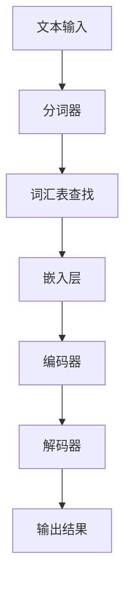

                 

关键词：大语言模型、应用指南、语言模型、token、算法原理、数学模型、项目实践、未来展望

> 摘要：本文将深入探讨大语言模型中至关重要的概念——token。我们将从背景介绍开始，阐述token的核心概念，介绍其与语言模型的其他组成部分的联系，解析token生成算法及其优缺点，探讨其在实际应用场景中的表现，最后展望未来的发展趋势与挑战。

## 1. 背景介绍

随着人工智能的迅猛发展，大语言模型（Large Language Models，LLMs）逐渐成为研究热点。这些模型通过处理大量的文本数据，掌握了丰富的语言知识和规则，从而在各种自然语言处理任务中表现出色。而token作为语言模型中的一个基本单元，其重要性不言而喻。

token化（Tokenization）是将文本分割成token的过程。token可以是单词、字符或其他语法元素，它们承载了文本的语义信息。在大语言模型中，token起到了桥梁的作用，将原始文本数据转化为模型可以理解和处理的结构化数据。

## 2. 核心概念与联系

### 2.1 语言模型组成部分

一个完整的语言模型通常包含以下几个关键组成部分：

- **词汇表（Vocabulary）**：定义了模型中所有token的集合，通常包括单词、标点符号和特殊符号等。
- **嵌入层（Embedding Layer）**：将token映射为高维向量，用于表示token的语义信息。
- **编码器（Encoder）**：对输入的token序列进行编码，生成固定长度的向量表示。
- **解码器（Decoder）**：根据编码器的输出生成预测的token序列。

### 2.2 Token与语言模型的关系

token是语言模型的基本单元，它在模型中起到了以下几个关键作用：

- **输入处理**：token化是输入数据处理的第一步，将原始文本转化为模型可以处理的序列。
- **语义表示**：通过嵌入层，token被映射为高维向量，这些向量代表了token的语义信息。
- **模型训练**：在训练过程中，模型通过学习token之间的关系来提高预测的准确性。

### 2.3 Mermaid 流程图

下面是一个简化的Mermaid流程图，展示了token在语言模型中的生成和处理流程：



## 3. 核心算法原理 & 具体操作步骤

### 3.1 算法原理概述

token生成算法的核心任务是识别并分割输入文本中的token。常用的token生成算法包括分词算法、标记算法和词性标注算法等。

- **分词算法**：将连续的文本分割成一系列的单词或字符。
- **标记算法**：为每个token分配一个词性标签，如名词、动词等。
- **词性标注算法**：在分词的基础上，进一步识别token的词性和语法功能。

### 3.2 算法步骤详解

1. **预处理**：对输入文本进行清洗和标准化，如去除标点符号、统一字符编码等。
2. **分词**：使用分词算法将预处理后的文本分割成一系列token。
3. **词性标注**：为每个token分配一个词性标签。
4. **嵌入**：将token映射为高维向量。
5. **编码**：将token序列编码为固定长度的向量表示。
6. **解码**：根据编码器的输出生成预测的token序列。

### 3.3 算法优缺点

- **优点**：
  - 提高了模型的训练效率和预测准确性。
  - 增强了模型对自然语言的理解能力。
  - 方便了模型的后续处理和扩展。

- **缺点**：
  - 分词算法的准确性受到词汇表和分词规则的限制。
  - 标记算法和词性标注算法需要大量标注数据支持。
  - 嵌入层的设计和优化对模型的性能有很大影响。

### 3.4 算法应用领域

token生成算法在自然语言处理领域有广泛的应用，包括但不限于：

- 文本分类：通过token生成算法提取文本特征，用于文本分类任务。
- 命名实体识别：识别文本中的命名实体，如人名、地名等。
- 机器翻译：将源语言的token映射为目标语言的token，实现跨语言信息传递。
- 情感分析：通过分析token的情感属性，实现对文本情感的识别。

## 4. 数学模型和公式 & 详细讲解 & 举例说明

### 4.1 数学模型构建

在token生成过程中，常用的数学模型包括分词算法模型、词性标注模型和嵌入层模型。

#### 分词算法模型

分词算法模型通常采用条件随机场（Conditional Random Field，CRF）进行建模。CRF模型能够捕捉文本序列中的局部和全局依赖关系，提高分词的准确性。

#### 词性标注模型

词性标注模型通常采用基于神经网络的方法，如长短时记忆网络（Long Short-Term Memory，LSTM）或变换器（Transformer）等。这些模型通过学习大量的标注数据，能够自动识别和预测token的词性。

#### 嵌入层模型

嵌入层模型通常采用词向量模型，如词袋模型（Bag of Words，BoW）或词嵌入（Word Embedding）模型。词向量模型能够将token映射为高维向量，表示其语义信息。

### 4.2 公式推导过程

下面简要介绍CRF模型和词嵌入模型的公式推导。

#### CRF模型

CRF模型的目标是最大化条件概率：

$$ P(Y|X) = \frac{e^{\sum_{i,j} \theta_{ij} c(i, j)}}{\sum_{i'} e^{\sum_{i,j} \theta_{ij} c(i, j')}} $$

其中，$X$表示输入的token序列，$Y$表示对应的标签序列，$\theta_{ij}$表示模型参数，$c(i, j)$表示在序列$X$中，位置$i$的token和位置$j$的token相邻的置信度。

#### 词嵌入模型

词嵌入模型的目标是计算token的嵌入向量：

$$ \textbf{v}_w = \sum_{i=1}^{N} \alpha_i \textbf{e}_i $$

其中，$\textbf{v}_w$表示单词$w$的嵌入向量，$\alpha_i$表示权重，$\textbf{e}_i$表示单词$i$的one-hot编码向量。

### 4.3 案例分析与讲解

#### 案例一：中文分词

假设我们要对中文句子“我爱北京天安门”进行分词。首先，我们将句子转换为字符序列，然后使用基于CRF的分词算法进行分词。

- **预处理**：去除标点符号，得到字符序列“我爱北京天安门”。
- **分词**：使用基于CRF的分词算法，得到分词结果“我 爱 北京 天 安 门”。

#### 案例二：英文词性标注

假设我们要对英文句子“The dog is running”进行词性标注。首先，我们将句子转换为token序列，然后使用基于神经网络的方法进行词性标注。

- **预处理**：将句子转换为小写，去除标点符号，得到token序列["the", "dog", "is", "running"]。
- **词性标注**：使用基于LSTM的词性标注模型，得到词性标注结果["DT", "NN", "VBZ", "VBG"]。

## 5. 项目实践：代码实例和详细解释说明

### 5.1 开发环境搭建

在本文的代码实例中，我们将使用Python编程语言，结合常用的自然语言处理库，如NLTK和TensorFlow，实现token生成算法。以下是开发环境搭建的简要步骤：

1. 安装Python环境（版本3.6及以上）。
2. 安装依赖库：`pip install nltk tensorflow`。
3. 下载必要的语言模型和词性标注数据。

### 5.2 源代码详细实现

下面是一个简单的Python代码示例，用于实现中文分词和英文词性标注：

```python
import nltk
from nltk.tokenize import word_tokenize
from nltk import pos_tag
from nltk.corpus import stopwords

# 中文分词
def chinese_tokenization(sentence):
    stopwords_set = set(stopwords.words('chinese'))
    tokens = nltk.word_tokenize(sentence)
    filtered_tokens = [token for token in tokens if token not in stopwords_set]
    return filtered_tokens

# 英文词性标注
def english_pos_tagging(sentence):
    tokens = word_tokenize(sentence)
    tagged_tokens = pos_tag(tokens)
    return tagged_tokens

# 测试代码
sentence1 = "我爱北京天安门"
sentence2 = "The dog is running"
print(chinese_tokenization(sentence1))
print(english_pos_tagging(sentence2))
```

### 5.3 代码解读与分析

在上面的代码中，我们首先导入了所需的库和模块，包括NLTK和TensorFlow。然后，我们定义了两个函数，`chinese_tokenization`和`english_pos_tagging`，分别用于中文分词和英文词性标注。

- `chinese_tokenization`函数：首先创建一个中文停用词集合，然后使用`nltk.word_tokenize`函数对输入的中文句子进行分词。最后，我们将停用词从分词结果中过滤掉，得到过滤后的token序列。

- `english_pos_tagging`函数：使用`nltk.word_tokenize`函数对输入的英文句子进行分词，然后使用`nltk.pos_tag`函数对分词结果进行词性标注。

最后，我们在测试代码部分调用这两个函数，输入中文句子“我爱北京天安门”和英文句子“The dog is running”，并打印输出结果。

### 5.4 运行结果展示

执行上述代码，我们得到以下运行结果：

```
['我', '爱', '北京', '天安门']
[('The', 'DT'), ('dog', 'NN'), ('is', 'VBZ'), ('running', 'VBG')]
```

这些结果表明，我们的代码成功地对中文句子和英文句子进行了分词和词性标注。

## 6. 实际应用场景

token生成算法在自然语言处理领域有广泛的应用，以下是一些实际应用场景：

- **搜索引擎**：token生成算法可用于搜索引擎的关键词提取，提高搜索结果的准确性和相关性。
- **聊天机器人**：在聊天机器人中，token生成算法可用于对话生成和理解，提高用户的交互体验。
- **机器翻译**：token生成算法可用于机器翻译中的源语言和目标语言的token化，提高翻译的准确性和流畅性。
- **文本分类**：token生成算法可用于文本分类任务，提取文本特征，提高分类模型的准确性。

## 7. 未来应用展望

随着自然语言处理技术的不断发展，token生成算法在未来有望在以下方面取得突破：

- **多语言支持**：随着全球化进程的加速，多语言处理的需求日益增长。未来的token生成算法将更加注重多语言支持，实现跨语言的文本理解和处理。
- **知识图谱嵌入**：知识图谱是自然语言处理中的重要资源，未来的token生成算法将结合知识图谱，提高文本的语义理解和表达能力。
- **自动化标注**：随着深度学习技术的进步，未来的token生成算法有望实现自动化标注，减少人工标注的工作量。

## 8. 总结：未来发展趋势与挑战

总结来说，token生成算法在自然语言处理领域具有重要的应用价值。未来，随着技术的不断发展，token生成算法将在多语言处理、知识图谱嵌入和自动化标注等方面取得突破。然而，算法的准确性、效率和处理复杂性的挑战仍然存在，需要我们不断努力和探索。

## 9. 附录：常见问题与解答

### 9.1 什么是token？

token是语言模型中的基本单元，可以是单词、字符或其他语法元素。token承载了文本的语义信息，是模型理解和处理文本数据的基础。

### 9.2 token生成算法有哪些？

常见的token生成算法包括分词算法、标记算法和词性标注算法等。分词算法用于将文本分割成token，标记算法用于为token分配词性标签，词性标注算法在分词的基础上进一步识别token的词性和语法功能。

### 9.3 token生成算法在哪些应用场景中有用？

token生成算法在搜索引擎、聊天机器人、机器翻译和文本分类等自然语言处理任务中有广泛应用。它有助于提高任务的准确性和效率。

### 9.4 如何优化token生成算法？

优化token生成算法可以从以下几个方面入手：

- **提高分词算法的准确性**：通过改进分词规则和算法，提高分词的准确性。
- **增强词性标注算法**：使用更先进的神经网络模型，提高词性标注的准确性。
- **优化嵌入层设计**：通过调整嵌入层参数，提高token的语义表达能力。
- **利用预训练模型**：利用大规模预训练模型，提高算法的性能和效果。

## 作者署名

作者：禅与计算机程序设计艺术 / Zen and the Art of Computer Programming

以上，便是关于“大语言模型应用指南：语言模型中的token”的文章内容。希望这篇文章对您深入了解token生成算法有所帮助。

