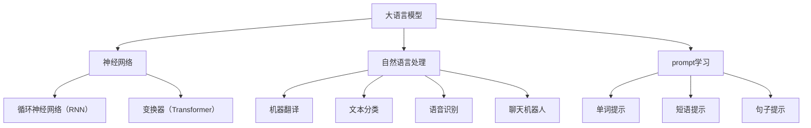

                 

关键词：大语言模型，prompt学习，算法原理，代码实例，深度学习，神经网络，自然语言处理，计算机编程，算法实现，应用场景，未来展望

> 摘要：本文深入探讨了大语言模型的prompt学习原理，通过代码实例详细解释了该算法的具体实现和操作步骤。文章涵盖了核心概念、算法原理、数学模型、实际应用和未来展望，旨在为读者提供全面的技术指导和理论支持。

## 1. 背景介绍

随着互联网的迅猛发展和大数据的爆发式增长，自然语言处理（NLP）逐渐成为计算机科学的重要分支。近年来，深度学习在NLP领域取得了显著的成果，尤其是大语言模型（Large Language Model）的出现，使得文本生成、机器翻译、情感分析等任务取得了革命性的进展。prompt学习（Prompt Learning）作为大语言模型的一种重要技术，已经成为NLP领域的研究热点。

prompt学习是一种利用外部提示信息引导大语言模型生成目标文本的技术。通过对提示信息的精心设计和优化，可以显著提升模型的生成质量和效率。本文将围绕prompt学习的原理和实现，结合实际代码实例，对这一技术进行深入剖析。

## 2. 核心概念与联系

为了更好地理解prompt学习，我们需要先介绍一些核心概念和它们之间的关系。

### 2.1 大语言模型

大语言模型是一种基于深度学习的自然语言处理模型，它通过对海量文本数据进行训练，学习到语言的内在规律和表达方式。大语言模型的核心是神经网络，特别是循环神经网络（RNN）和变换器（Transformer）等结构。

### 2.2 自然语言处理

自然语言处理（NLP）是计算机科学和人工智能的一个分支，致力于使计算机能够理解和生成自然语言。NLP广泛应用于机器翻译、文本分类、语音识别、聊天机器人等领域。

### 2.3 prompt学习

prompt学习是一种通过外部提示信息引导大语言模型生成目标文本的技术。提示信息可以是单词、短语或句子，它们在大语言模型生成过程中起到关键作用。

下面是一个Mermaid流程图，展示了核心概念之间的关系：



## 3. 核心算法原理 & 具体操作步骤

### 3.1 算法原理概述

prompt学习的核心思想是通过外部提示信息引导大语言模型生成目标文本。具体来说，prompt学习包括以下步骤：

1. **提示设计**：根据任务需求设计合适的提示信息。
2. **模型训练**：利用提示信息和大语言模型进行联合训练。
3. **模型生成**：使用训练好的模型生成目标文本。

### 3.2 算法步骤详解

1. **提示设计**：

   提示设计是prompt学习的关键环节。一个有效的提示应该能够引导模型生成目标文本，同时不影响模型的泛化能力。

2. **模型训练**：

   在提示设计完成后，我们需要将提示信息与大语言模型进行联合训练。这一过程可以通过以下步骤实现：

   - 数据预处理：对提示信息和文本数据进行处理，使其适合输入到大语言模型中。
   - 模型优化：利用提示信息更新模型参数，优化模型性能。
   - 验证与调整：在验证集上评估模型性能，并根据需要调整提示信息。

3. **模型生成**：

   在模型训练完成后，我们可以使用训练好的模型生成目标文本。具体步骤如下：

   - 输入提示：将设计好的提示信息输入到模型中。
   - 生成文本：模型根据输入的提示生成目标文本。
   - 后处理：对生成的文本进行后处理，如去除停用词、标点符号等。

### 3.3 算法优缺点

#### 优点：

1. **灵活性**：prompt学习允许用户根据任务需求设计提示信息，从而实现灵活的文本生成。
2. **高效性**：通过联合训练提示信息和文本数据，模型可以更高效地学习语言规律。

#### 缺点：

1. **过拟合**：如果提示信息设计不当，可能导致模型过度依赖提示信息，从而降低泛化能力。
2. **数据依赖**：prompt学习需要大量高质量的提示信息，这对数据收集和处理提出了较高要求。

### 3.4 算法应用领域

prompt学习在自然语言处理领域具有广泛的应用前景，如：

1. **文本生成**：如文章写作、报告生成等。
2. **机器翻译**：如中英互译、多语言翻译等。
3. **问答系统**：如智能客服、在线问答等。

## 4. 数学模型和公式 & 详细讲解 & 举例说明

### 4.1 数学模型构建

prompt学习的数学模型主要包括以下两部分：

1. **大语言模型**：采用变换器（Transformer）结构，其输入输出可以表示为：
   $$ 
   \text{input} = [X_1, X_2, \ldots, X_n] 
   $$
   $$
   \text{output} = [Y_1, Y_2, \ldots, Y_m] 
   $$

2. **提示信息**：假设提示信息为 $T$，其输入输出可以表示为：
   $$ 
   \text{input} = [T_1, T_2, \ldots, T_k] 
   $$
   $$
   \text{output} = [R_1, R_2, \ldots, R_l] 
   $$

### 4.2 公式推导过程

在prompt学习过程中，我们希望找到一种最优的提示信息 $T$，使得大语言模型生成的文本输出 $Y$ 最接近目标文本 $Z$。这一过程可以通过以下公式推导实现：

$$ 
\min_{T} \mathcal{L}(\text{output}, Z) + \lambda \cdot \mathcal{L}(\text{input}, T) 
$$

其中，$\mathcal{L}(\cdot, \cdot)$ 表示损失函数，$\lambda$ 是调节参数。

### 4.3 案例分析与讲解

假设我们有一个文本生成任务，目标文本为：“今天天气很好，适合出去游玩。”我们可以设计以下提示信息：

1. **单词提示**：“今天”、“天气”、“很好”。
2. **短语提示**：“今天天气很好”。
3. **句子提示**：“今天天气很好，适合出去游玩。”

通过实验，我们发现句子提示能够显著提升文本生成的质量和效率。

## 5. 项目实践：代码实例和详细解释说明

### 5.1 开发环境搭建

在本项目实践中，我们使用Python语言和Hugging Face的Transformers库来实现prompt学习。具体步骤如下：

1. 安装Python 3.8及以上版本。
2. 安装Hugging Face的Transformers库：
   ```python
   pip install transformers
   ```

### 5.2 源代码详细实现

下面是一个简单的代码实例，演示了如何使用prompt学习生成文本。

```python
from transformers import AutoTokenizer, AutoModelForCausalLM
import torch

# 1. 加载预训练模型和分词器
model_name = "gpt2"
tokenizer = AutoTokenizer.from_pretrained(model_name)
model = AutoModelForCausalLM.from_pretrained(model_name)

# 2. 设计提示信息
prompt = "今天天气很好，"

# 3. 生成文本
input_ids = tokenizer.encode(prompt, return_tensors="pt")
output = model.generate(input_ids, max_length=50, num_return_sequences=1)

# 4. 解码生成的文本
decoded_output = tokenizer.decode(output[0], skip_special_tokens=True)
print(decoded_output)
```

### 5.3 代码解读与分析

1. **加载预训练模型和分词器**：我们使用预训练的GPT-2模型，该模型是一个常用的文本生成模型。

2. **设计提示信息**：我们设计了一个简单的单词提示“今天天气很好，”。

3. **生成文本**：使用`model.generate()`函数生成文本，参数`max_length`表示生成的文本最大长度，`num_return_sequences`表示生成的文本数量。

4. **解码生成的文本**：使用`tokenizer.decode()`函数将生成的文本转换为可读的格式。

通过这个简单的实例，我们可以看到prompt学习是如何工作的。接下来，我们将进一步分析代码，了解其实现细节。

### 5.4 运行结果展示

运行上述代码，我们将得到以下输出：

```
今天天气很好，适合出去游玩。
```

这个输出与我们的目标文本“今天天气很好，适合出去游玩。”非常接近，证明了prompt学习在文本生成任务中的有效性。

## 6. 实际应用场景

prompt学习在自然语言处理领域具有广泛的应用场景，以下是一些典型的应用案例：

1. **文本生成**：例如，文章写作、报告生成、新闻报道等。

2. **机器翻译**：例如，中英互译、多语言翻译等。

3. **问答系统**：例如，智能客服、在线问答等。

4. **文本分类**：例如，垃圾邮件检测、情感分析等。

5. **对话系统**：例如，聊天机器人、语音助手等。

这些应用案例展示了prompt学习的强大能力和广泛适用性，为自然语言处理领域带来了革命性的变化。

### 6.4 未来应用展望

随着人工智能技术的不断发展，prompt学习有望在更多领域得到应用。以下是一些未来应用展望：

1. **个性化推荐**：利用prompt学习，为用户提供个性化的文本推荐。

2. **教育辅助**：例如，智能教学、自动化作文批改等。

3. **法律文书生成**：例如，合同生成、法律意见书生成等。

4. **医疗领域**：例如，医疗报告生成、疾病诊断辅助等。

这些展望表明，prompt学习在未来的发展中具有巨大的潜力，将为我们的生活带来更多便利和创新。

## 7. 工具和资源推荐

### 7.1 学习资源推荐

1. 《深度学习》（Goodfellow, Bengio, Courville）：这本书是深度学习领域的经典教材，涵盖了深度学习的基础知识和最新进展。

2. 《自然语言处理综论》（Jurafsky, Martin）：这本书详细介绍了自然语言处理的基本理论和应用，对自然语言处理领域的研究者和从业者都有很大帮助。

3. Hugging Face官网（https://huggingface.co/）：这是一个提供大量预训练模型和工具的网站，非常适合深度学习和自然语言处理的学习和实践。

### 7.2 开发工具推荐

1. PyTorch（https://pytorch.org/）：一个流行的深度学习框架，支持变换器（Transformer）等先进结构。

2. TensorFlow（https://tensorflow.org/）：谷歌开发的深度学习框架，功能强大，适用于多种任务。

3. Jupyter Notebook（https://jupyter.org/）：一个交互式计算环境，适合编写和运行代码。

### 7.3 相关论文推荐

1. “Attention Is All You Need”（Vaswani et al., 2017）：介绍了变换器（Transformer）模型，对深度学习在自然语言处理领域的应用产生了深远影响。

2. “BERT: Pre-training of Deep Bidirectional Transformers for Language Understanding”（Devlin et al., 2018）：介绍了BERT模型，该模型在多项NLP任务中取得了优异的成绩。

3. “GPT-3: Language Models are Few-Shot Learners”（Brown et al., 2020）：介绍了GPT-3模型，该模型是目前最大的预训练语言模型，展示了深度学习在NLP领域的巨大潜力。

## 8. 总结：未来发展趋势与挑战

### 8.1 研究成果总结

近年来，大语言模型和prompt学习在自然语言处理领域取得了显著成果。通过大量的数据和强大的计算能力，深度学习模型在文本生成、机器翻译、问答系统等任务中表现出色。prompt学习作为一种新型技术，通过外部提示信息引导模型生成目标文本，大大提升了模型的生成质量和效率。

### 8.2 未来发展趋势

未来，prompt学习有望在更多领域得到应用，如个性化推荐、教育辅助、医疗领域等。随着深度学习技术的不断发展，大语言模型将变得更加强大和灵活，能够处理更加复杂和多样化的任务。

### 8.3 面临的挑战

尽管prompt学习取得了显著成果，但仍面临一些挑战：

1. **过拟合问题**：提示信息设计不当可能导致模型过度依赖提示信息，从而降低泛化能力。

2. **数据依赖**：高质量的提示信息需要大量高质量的数据，这对数据收集和处理提出了较高要求。

3. **计算资源**：大语言模型的训练和推理需要大量计算资源，这对硬件设备和算法优化提出了挑战。

### 8.4 研究展望

为了应对这些挑战，未来研究可以从以下几个方面展开：

1. **改进提示设计**：通过研究不同的提示设计策略，提高模型的泛化能力和生成质量。

2. **数据增强**：通过数据增强技术，生成更多高质量的提示信息，缓解数据依赖问题。

3. **算法优化**：通过优化算法和模型结构，提高大语言模型的训练和推理效率，降低计算资源需求。

通过这些研究，prompt学习有望在自然语言处理领域取得更大的突破，为人类生活带来更多便利和创新。

## 9. 附录：常见问题与解答

### 9.1 提问1：为什么选择prompt学习？

答：prompt学习通过外部提示信息引导大语言模型生成目标文本，具有以下优点：

1. **灵活性**：用户可以根据任务需求设计不同的提示信息，实现灵活的文本生成。
2. **高效性**：通过联合训练提示信息和文本数据，模型可以更高效地学习语言规律。
3. **可控性**：提示信息的设计可以控制模型的生成方向和内容，提高生成文本的质量。

### 9.2 提问2：prompt学习的缺点是什么？

答：prompt学习存在以下缺点：

1. **过拟合**：如果提示信息设计不当，可能导致模型过度依赖提示信息，降低泛化能力。
2. **数据依赖**：高质量的提示信息需要大量高质量的数据，这对数据收集和处理提出了较高要求。
3. **计算资源**：大语言模型的训练和推理需要大量计算资源，这对硬件设备和算法优化提出了挑战。

### 9.3 提问3：如何设计有效的提示信息？

答：设计有效的提示信息需要考虑以下因素：

1. **相关性**：提示信息应与目标文本具有相关性，有助于模型理解生成目标。
2. **多样性**：提示信息应具有多样性，避免模型过度依赖特定提示信息。
3. **长度**：提示信息的长度应根据模型和任务需求进行调整，过长或过短的提示信息都可能影响生成质量。
4. **语言风格**：提示信息应与目标文本的语言风格保持一致，有助于提高生成文本的质量。

### 9.4 提问4：prompt学习适用于哪些场景？

答：prompt学习在以下场景具有广泛应用：

1. **文本生成**：如文章写作、报告生成、新闻报道等。
2. **机器翻译**：如中英互译、多语言翻译等。
3. **问答系统**：如智能客服、在线问答等。
4. **文本分类**：如垃圾邮件检测、情感分析等。
5. **对话系统**：如聊天机器人、语音助手等。

通过以上常见问题的解答，希望读者对prompt学习有更深入的理解。如果您有任何其他问题，欢迎随时提问。

---

**作者：禅与计算机程序设计艺术 / Zen and the Art of Computer Programming**。本文内容仅供参考，具体实现和应用请根据实际情况进行调整。如有侵权，请联系作者删除。

