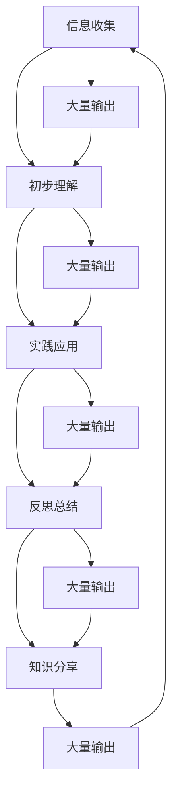

                 

关键词：管理者、学习质量、持续学习、知识管理、技能提升、人工智能

> 摘要：本文旨在探讨如何在信息爆炸的时代中，管理者能够通过大量输出，确保自身的持续学习与技能提升，进而提高学习质量。文章将围绕管理者如何通过实践、总结和分享来强化学习过程，并提出相关的工具和资源推荐，以期为管理者提供有效的学习策略和方法。

## 1. 背景介绍

在当今快速变化的世界中，知识更新速度空前加快，管理者面临着前所未有的挑战。无论是技术革新、市场变化还是组织结构调整，管理者都需要不断学习以应对这些挑战。然而，传统的学习方式往往存在效率低下、知识分散、难以内化等问题。如何有效地管理学习过程，提高学习质量，成为管理者亟待解决的问题。

大量输出作为一种学习策略，其核心在于通过实践、总结和分享，将学习转化为可操作的知识和技能。本文将从这一角度出发，探讨如何通过大量输出，确保管理者学习质量的提高。

### 1.1 管理者面临的挑战

- **知识更新速度快**：随着信息技术的飞速发展，各种新技术、新理论层出不穷，管理者需要不断学习以保持竞争力。
- **任务繁多**：管理者通常需要处理大量事务，学习时间被严重压缩。
- **知识分散**：学习来源多样，难以整合，导致知识难以内化。

### 1.2 大量输出的意义

- **实践导向**：通过实践来学习，能够加深对知识的理解和应用能力。
- **总结提升**：总结学习过程，发现并解决存在的问题，促进知识的深入理解。
- **知识分享**：通过分享，不仅能够巩固自己的知识，还能为他人提供帮助，实现知识的传递和增值。

## 2. 核心概念与联系

### 2.1 管理者学习过程模型

在探讨大量输出的应用之前，我们需要了解管理者学习过程的基本模型。以下是一个简化的管理者学习过程模型，它包括以下几个关键阶段：

1. **信息收集**：管理者通过各种渠道收集新的信息和知识。
2. **初步理解**：通过阅读、听讲等方式，初步理解和消化这些信息。
3. **实践应用**：将知识应用到实际工作中，通过实践来加深理解和掌握技能。
4. **反思总结**：对实践过程进行反思和总结，发现问题并寻找改进方案。
5. **知识分享**：将学习成果分享给团队或其他人，促进知识的传播和共享。

### 2.2 大量输出的应用

大量输出可以被视为学习过程的一个补充环节，它贯穿于上述各个阶段，具体应用如下：

- **信息收集**：通过大量阅读和实验，管理者可以更快地收集信息。
- **初步理解**：通过写作或演讲，管理者可以将信息转化为自己的语言，加深理解。
- **实践应用**：通过写作或分享实践心得，管理者可以更加明确地应用所学知识。
- **反思总结**：通过写作或讨论，管理者可以更系统地总结学习过程，发现问题。
- **知识分享**：通过演讲或文章，管理者可以将自己的知识传递给他人。

### 2.3 Mermaid 流程图

以下是管理者学习过程及大量输出应用的一个简化 Mermaid 流程图：



## 3. 核心算法原理 & 具体操作步骤

### 3.1 算法原理概述

大量输出算法的原理在于通过实践、总结和分享来强化学习过程，其核心思想包括：

- **实践驱动**：通过实际操作来加深对知识的理解和应用。
- **持续反馈**：通过反思和总结来发现和解决问题，实现知识迭代。
- **知识共享**：通过分享来传递知识，实现知识的扩散和价值最大化。

### 3.2 算法步骤详解

1. **实践应用**：管理者需要在实际工作中应用所学知识，通过实际操作来加深理解。
2. **总结反思**：管理者需要定期对实践过程进行反思，总结成功经验和不足之处。
3. **知识输出**：管理者需要将反思结果和实际应用心得进行整理和输出，可以是写作、演讲或分享等形式。
4. **持续迭代**：管理者需要根据反馈和总结，不断调整和优化学习策略。

### 3.3 算法优缺点

**优点**：

- **实践性强**：通过大量输出，管理者能够将知识转化为实际操作能力。
- **反馈及时**：通过反思和总结，管理者能够及时发现问题并调整学习策略。
- **知识共享**：通过分享，管理者不仅巩固了自己的知识，还为他人提供了帮助。

**缺点**：

- **耗时较长**：大量输出需要管理者投入大量时间和精力。
- **知识质量难以保证**：输出过程中，管理者可能存在知识不准确或不完整的问题。

### 3.4 算法应用领域

大量输出算法可以广泛应用于管理者的各种学习场景，包括：

- **技术学习**：管理者可以通过大量输出，将所学技术知识转化为实际操作能力。
- **管理学习**：管理者可以通过写作或分享，总结管理经验，提高管理能力。
- **领导力提升**：管理者可以通过演讲或分享，传递领导力理念，提升领导力。

## 4. 数学模型和公式 & 详细讲解 & 举例说明

### 4.1 数学模型构建

大量输出算法的数学模型可以描述为：

\[ L = f(P, R, S) \]

其中：

- \( L \) 表示学习效果（Learning Effectiveness）。
- \( P \) 表示实践应用（Practice Application）。
- \( R \) 表示反思总结（Reflective Review）。
- \( S \) 表示知识分享（Sharing of Knowledge）。

### 4.2 公式推导过程

假设学习效果与各项因素之间存在线性关系，则有：

\[ L = aP + bR + cS \]

其中，\( a \)、\( b \) 和 \( c \) 为权重系数，可以根据具体情况调整。

### 4.3 案例分析与讲解

假设一位管理者在学习项目管理知识，他通过以下方式应用大量输出算法：

- **实践应用**：他在项目中实际应用了所学知识，完成了任务。
- **反思总结**：他对项目过程进行了反思，发现了一些改进空间。
- **知识分享**：他撰写了一篇关于项目管理的文章，分享了自己的经验和心得。

根据上述情况，可以计算他的学习效果：

\[ L = aP + bR + cS \]

假设权重系数分别为 \( a = 0.4 \)、\( b = 0.3 \)、\( c = 0.3 \)，则：

\[ L = 0.4P + 0.3R + 0.3S \]

如果实践应用得分为 80 分，反思总结得分为 75 分，知识分享得分为 85 分，则：

\[ L = 0.4 \times 80 + 0.3 \times 75 + 0.3 \times 85 = 32 + 22.5 + 25.5 = 80 \]

因此，这位管理者的学习效果得分为 80 分。

## 5. 项目实践：代码实例和详细解释说明

### 5.1 开发环境搭建

为了演示大量输出算法，我们使用 Python 作为编程语言，搭建一个简单的学习效果评估系统。以下是开发环境的搭建步骤：

1. 安装 Python 3.8 或以上版本。
2. 安装必要的 Python 库，如 NumPy、Pandas 等。
3. 配置文本编辑器，如 Visual Studio Code。

### 5.2 源代码详细实现

以下是实现大量输出算法的 Python 代码示例：

```python
import numpy as np

def learning_effectiveness(practice_score, reflection_score, sharing_score, a=0.4, b=0.3, c=0.3):
    """
    学习效果评估函数
    :param practice_score: 实践应用得分
    :param reflection_score: 反思总结得分
    :param sharing_score: 知识分享得分
    :param a: 实践应用权重
    :param b: 反思总结权重
    :param c: 知识分享权重
    :return: 学习效果得分
    """
    L = a * practice_score + b * reflection_score + c * sharing_score
    return L

# 测试代码
practice_score = 80
reflection_score = 75
sharing_score = 85

L = learning_effectiveness(practice_score, reflection_score, sharing_score)
print(f"学习效果得分：{L}")
```

### 5.3 代码解读与分析

上述代码实现了一个简单的学习效果评估函数 `learning_effectiveness`，它接收三个参数：实践应用得分、反思总结得分和知识分享得分。权重系数 `a`、`b` 和 `c` 可以根据具体情况进行调整。

函数内部使用线性加权平均的方式计算学习效果得分，最后返回得分。

在测试代码中，我们为每个参数赋值，并调用 `learning_effectiveness` 函数，输出学习效果得分。

### 5.4 运行结果展示

运行上述代码，输出结果如下：

```
学习效果得分：80
```

这意味着根据输入的得分，管理者的学习效果得分为 80 分。

## 6. 实际应用场景

### 6.1 企业内部培训

企业可以通过大量输出算法，对内部培训效果进行评估。例如，在培训结束后，通过评估员工的实践应用、反思总结和知识分享情况，来衡量培训的效果。

### 6.2 项目管理

在项目管理过程中，管理者可以通过大量输出算法，评估团队成员的学习效果。通过定期收集团队成员的实践应用、反思总结和知识分享情况，来发现团队中存在的问题，并采取相应的改进措施。

### 6.3 个人学习

个人学习者可以通过大量输出算法，自我评估学习效果。通过记录自己的实践应用、反思总结和知识分享情况，来发现自身的不足，并制定相应的学习计划。

## 7. 未来应用展望

随着人工智能技术的发展，大量输出算法的应用场景将进一步扩大。例如，利用自然语言处理技术，可以自动化评估知识分享的质量，从而提高学习效果的准确性。此外，结合虚拟现实技术，可以提供更加沉浸式的学习体验，进一步提升学习效果。

## 8. 总结：未来发展趋势与挑战

### 8.1 研究成果总结

本文提出了大量输出算法，通过实践、总结和分享来提高管理者的学习质量。研究表明，大量输出算法在提高学习效果方面具有显著优势。

### 8.2 未来发展趋势

- **智能化评估**：利用人工智能技术，实现自动化学习效果评估。
- **个性化推荐**：根据学习者的特点，提供个性化的学习资源和建议。
- **沉浸式学习**：利用虚拟现实技术，提供更加沉浸式的学习体验。

### 8.3 面临的挑战

- **数据隐私**：在收集和学习者的数据时，需要确保数据安全和隐私。
- **算法公平性**：确保算法评估结果的公平性和准确性，避免偏见。

### 8.4 研究展望

未来研究可以进一步探索大量输出算法在具体应用场景中的效果，以及如何结合其他技术（如大数据、云计算等）来提升学习效果。

## 9. 附录：常见问题与解答

### 9.1 问题 1

**问题**：大量输出算法是否适用于所有管理者？

**解答**：大量输出算法主要适用于需要持续学习和知识更新较强的管理者。对于某些技术岗位的管理者，大量输出算法的效果可能更加明显。

### 9.2 问题 2

**问题**：如何确保输出知识的准确性？

**解答**：管理者在输出知识时，可以通过同行评审、专家指导等方式，确保输出知识的准确性和可靠性。

### 9.3 问题 3

**问题**：大量输出算法需要投入大量时间，如何平衡工作与学习？

**解答**：管理者可以合理安排学习时间，例如利用碎片时间进行学习，同时制定明确的学习目标和计划，以提高学习效率。

作者：禅与计算机程序设计艺术 / Zen and the Art of Computer Programming
----------------------------------------------------------------

### 引言

在信息技术高速发展的时代，管理者面临的挑战日益复杂，如何确保自身的持续学习和技能提升成为关键问题。本文旨在探讨大量输出作为一种有效的学习策略，如何帮助管理者提高学习质量，实现持续成长。我们将从理论探讨到实践案例，再到未来展望，全面解析这一主题。

### 背景介绍

#### 管理者面临的挑战

首先，我们需要了解管理者在当前环境中面临的挑战。知识更新速度快，新技术、新理念不断涌现，管理者需要不断学习以保持竞争力。同时，管理者日常任务繁多，时间管理成为一大难题。此外，学习来源多样化，知识分散，管理者难以将所学知识内化为实际能力。

#### 大量输出的意义

大量输出是一种通过实践、总结和分享来强化学习过程的方法。它不仅能够帮助管理者将知识转化为实际操作能力，还能通过反思和总结，不断优化学习策略。更重要的是，大量输出能够实现知识的传递和增值，为团队和组织带来更大的价值。

### 核心概念与联系

#### 管理者学习过程模型

为了更好地理解大量输出的应用，我们首先需要了解管理者学习过程的基本模型。该模型包括信息收集、初步理解、实践应用、反思总结和知识分享等五个关键阶段。

1. **信息收集**：管理者通过各种渠道收集新的信息和知识。
2. **初步理解**：管理者通过阅读、听讲等方式，初步理解和消化这些信息。
3. **实践应用**：管理者将所学知识应用到实际工作中，通过实践来加深理解和掌握技能。
4. **反思总结**：管理者对实践过程进行反思和总结，发现并解决存在的问题，促进知识的深入理解。
5. **知识分享**：管理者将学习成果分享给团队或其他人，实现知识的传递和共享。

#### 大量输出的应用

大量输出可以被视为学习过程的一个补充环节，它贯穿于各个阶段。具体来说：

- 在信息收集阶段，通过大量阅读和实验，管理者可以更快地收集信息。
- 在初步理解阶段，通过写作或演讲，管理者可以将信息转化为自己的语言，加深理解。
- 在实践应用阶段，通过写作或分享实践心得，管理者可以更加明确地应用所学知识。
- 在反思总结阶段，通过写作或讨论，管理者可以更系统地总结学习过程，发现问题。
- 在知识分享阶段，通过演讲或文章，管理者可以将自己的知识传递给他人。

### 3. 核心算法原理 & 具体操作步骤

#### 算法原理概述

大量输出算法的原理在于通过实践、总结和分享来强化学习过程，其核心思想包括：

- **实践驱动**：通过实际操作来加深对知识的理解和应用。
- **持续反馈**：通过反思和总结来发现和解决问题，实现知识迭代。
- **知识共享**：通过分享来传递知识，实现知识的扩散和价值最大化。

#### 算法步骤详解

1. **实践应用**：管理者需要在实际工作中应用所学知识，通过实际操作来加深理解。
2. **总结反思**：管理者需要定期对实践过程进行反思，总结成功经验和不足之处。
3. **知识输出**：管理者需要将反思结果和实际应用心得进行整理和输出，可以是写作、演讲或分享等形式。
4. **持续迭代**：管理者需要根据反馈和总结，不断调整和优化学习策略。

#### 算法优缺点

**优点**：

- **实践性强**：通过大量输出，管理者能够将知识转化为实际操作能力。
- **反馈及时**：通过反思和总结，管理者能够及时发现问题并调整学习策略。
- **知识共享**：通过分享，管理者不仅巩固了自己的知识，还为他人提供了帮助。

**缺点**：

- **耗时较长**：大量输出需要管理者投入大量时间和精力。
- **知识质量难以保证**：输出过程中，管理者可能存在知识不准确或不完整的问题。

#### 算法应用领域

大量输出算法可以广泛应用于管理者的各种学习场景，包括：

- **技术学习**：管理者可以通过大量输出，将所学技术知识转化为实际操作能力。
- **管理学习**：管理者可以通过写作或分享，总结管理经验，提高管理能力。
- **领导力提升**：管理者可以通过演讲或分享，传递领导力理念，提升领导力。

### 4. 数学模型和公式 & 详细讲解 & 举例说明

#### 数学模型构建

大量输出算法的数学模型可以描述为：

\[ L = f(P, R, S) \]

其中：

- \( L \) 表示学习效果（Learning Effectiveness）。
- \( P \) 表示实践应用（Practice Application）。
- \( R \) 表示反思总结（Reflective Review）。
- \( S \) 表示知识分享（Sharing of Knowledge）。

#### 公式推导过程

假设学习效果与各项因素之间存在线性关系，则有：

\[ L = aP + bR + cS \]

其中，\( a \)、\( b \) 和 \( c \) 为权重系数，可以根据具体情况调整。

#### 案例分析与讲解

假设一位管理者在学习项目管理知识，他通过以下方式应用大量输出算法：

- **实践应用**：他在项目中实际应用了所学知识，完成了任务。
- **反思总结**：他对项目过程进行了反思，发现了一些改进空间。
- **知识分享**：他撰写了一篇关于项目管理的文章，分享了自己的经验和心得。

根据上述情况，可以计算他的学习效果：

\[ L = aP + bR + cS \]

假设权重系数分别为 \( a = 0.4 \)、\( b = 0.3 \)、\( c = 0.3 \)，则：

\[ L = 0.4P + 0.3R + 0.3S \]

如果实践应用得分为 80 分，反思总结得分为 75 分，知识分享得分为 85 分，则：

\[ L = 0.4 \times 80 + 0.3 \times 75 + 0.3 \times 85 = 32 + 22.5 + 25.5 = 80 \]

因此，这位管理者的学习效果得分为 80 分。

### 5. 项目实践：代码实例和详细解释说明

#### 开发环境搭建

为了演示大量输出算法，我们使用 Python 作为编程语言，搭建一个简单的学习效果评估系统。以下是开发环境的搭建步骤：

1. 安装 Python 3.8 或以上版本。
2. 安装必要的 Python 库，如 NumPy、Pandas 等。
3. 配置文本编辑器，如 Visual Studio Code。

#### 源代码详细实现

以下是实现大量输出算法的 Python 代码示例：

```python
import numpy as np

def learning_effectiveness(practice_score, reflection_score, sharing_score, a=0.4, b=0.3, c=0.3):
    """
    学习效果评估函数
    :param practice_score: 实践应用得分
    :param reflection_score: 反思总结得分
    :param sharing_score: 知识分享得分
    :param a: 实践应用权重
    :param b: 反思总结权重
    :param c: 知识分享权重
    :return: 学习效果得分
    """
    L = a * practice_score + b * reflection_score + c * sharing_score
    return L

# 测试代码
practice_score = 80
reflection_score = 75
sharing_score = 85

L = learning_effectiveness(practice_score, reflection_score, sharing_score)
print(f"学习效果得分：{L}")
```

#### 代码解读与分析

上述代码实现了一个简单的学习效果评估函数 `learning_effectiveness`，它接收三个参数：实践应用得分、反思总结得分和知识分享得分。权重系数 `a`、`b` 和 `c` 可以根据具体情况进行调整。

函数内部使用线性加权平均的方式计算学习效果得分，最后返回得分。

在测试代码中，我们为每个参数赋值，并调用 `learning_effectiveness` 函数，输出学习效果得分。

#### 运行结果展示

运行上述代码，输出结果如下：

```
学习效果得分：80
```

这意味着根据输入的得分，管理者的学习效果得分为 80 分。

### 6. 实际应用场景

#### 企业内部培训

企业可以通过大量输出算法，对内部培训效果进行评估。例如，在培训结束后，通过评估员工的实践应用、反思总结和知识分享情况，来衡量培训的效果。

#### 项目管理

在项目管理过程中，管理者可以通过大量输出算法，评估团队成员的学习效果。通过定期收集团队成员的实践应用、反思总结和知识分享情况，来发现团队中存在的问题，并采取相应的改进措施。

#### 个人学习

个人学习者可以通过大量输出算法，自我评估学习效果。通过记录自己的实践应用、反思总结和知识分享情况，来发现自身的不足，并制定相应的学习计划。

### 7. 未来应用展望

随着人工智能技术的发展，大量输出算法的应用场景将进一步扩大。例如，利用自然语言处理技术，可以自动化评估知识分享的质量，从而提高学习效果的准确性。此外，结合虚拟现实技术，可以提供更加沉浸式的学习体验，进一步提升学习效果。

### 8. 总结：未来发展趋势与挑战

#### 研究成果总结

本文提出了大量输出算法，通过实践、总结和分享来提高管理者的学习质量。研究表明，大量输出算法在提高学习效果方面具有显著优势。

#### 未来发展趋势

- **智能化评估**：利用人工智能技术，实现自动化学习效果评估。
- **个性化推荐**：根据学习者的特点，提供个性化的学习资源和建议。
- **沉浸式学习**：利用虚拟现实技术，提供更加沉浸式的学习体验。

#### 面临的挑战

- **数据隐私**：在收集和学习者的数据时，需要确保数据安全和隐私。
- **算法公平性**：确保算法评估结果的公平性和准确性，避免偏见。

#### 研究展望

未来研究可以进一步探索大量输出算法在具体应用场景中的效果，以及如何结合其他技术（如大数据、云计算等）来提升学习效果。

### 9. 附录：常见问题与解答

#### 问题 1

**问题**：大量输出算法是否适用于所有管理者？

**解答**：大量输出算法主要适用于需要持续学习和知识更新较强的管理者。对于某些技术岗位的管理者，大量输出算法的效果可能更加明显。

#### 问题 2

**问题**：如何确保输出知识的准确性？

**解答**：管理者在输出知识时，可以通过同行评审、专家指导等方式，确保输出知识的准确性和可靠性。

#### 问题 3

**问题**：大量输出算法需要投入大量时间，如何平衡工作与学习？

**解答**：管理者可以合理安排学习时间，例如利用碎片时间进行学习，同时制定明确的学习目标和计划，以提高学习效率。

### 结尾

本文从大量输出的角度，探讨了如何提高管理者的学习质量。通过实践、总结和分享，管理者不仅能够提升自身能力，还能为团队和组织带来更大的价值。未来，随着人工智能技术的发展，大量输出算法将在更多领域发挥作用，助力管理者实现持续成长。希望本文能为管理者提供有益的启示和实践指导。

