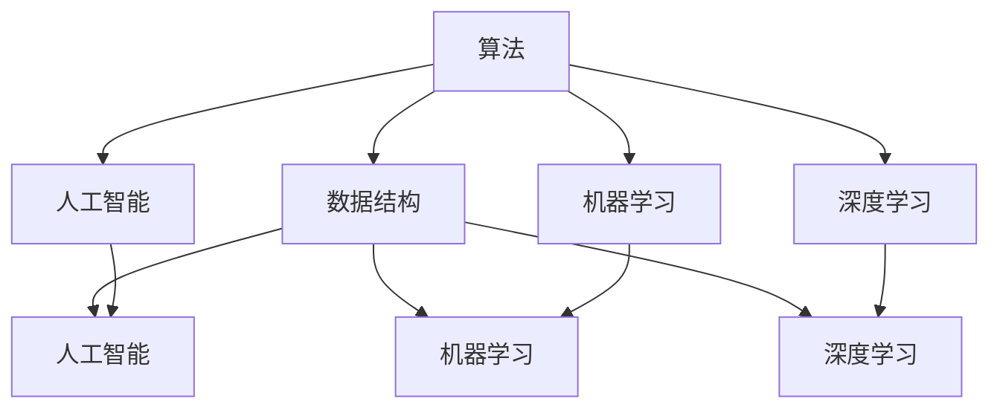

                 

 好奇心，自古以来就是人类探索未知的原动力。从古代的科学家、发明家到现代的程序员、数据科学家，好奇心驱动着我们不断突破技术的壁垒，开拓新的领域。在这篇文章中，我们将探讨好奇心在信息技术领域的独特作用，以及如何利用好奇心去解锁世界的奥秘。

## 1. 背景介绍

好奇心是人类探索世界的起点。从婴儿时期的呀呀学语，到成年后的专业研究，好奇心始终伴随着我们的成长。在信息技术领域，好奇心不仅激发了创新的思维，还推动了技术的不断进步。本篇文章将探讨以下核心内容：

1. **好奇心在信息技术领域的独特作用**：好奇心如何驱动技术创新。
2. **核心概念与联系**：解释信息技术领域的一些核心概念及其相互关系。
3. **核心算法原理**：介绍一些关键算法及其应用。
4. **数学模型与公式**：探讨一些重要的数学模型及其推导过程。
5. **项目实践**：通过实际代码实例展示技术实现。
6. **实际应用场景**：分析好奇心在具体领域中的应用。
7. **工具和资源推荐**：推荐有助于学习和实践的工具和资源。
8. **未来发展趋势与挑战**：展望好奇心驱动技术发展的前景。

## 2. 核心概念与联系

在信息技术领域，有几个核心概念对于理解好奇心如何驱动技术进步至关重要。这些概念包括：

- **算法**：计算机解决问题的步骤集合。
- **数据结构**：组织和存储数据的结构。
- **人工智能**：通过模拟人类智能来解决问题的技术。
- **机器学习**：使用算法从数据中自动学习规律的技术。
- **深度学习**：一种特殊的机器学习方法，使用多层神经网络来学习复杂函数。

以下是这些概念之间的联系：



通过这个流程图，我们可以看到算法作为核心，如何与其他概念相互联系，共同推动信息技术的发展。

## 3. 核心算法原理 & 具体操作步骤

### 3.1 算法原理概述

算法是计算机解决问题的核心。一个优秀的算法不仅要高效，还要具有可扩展性和灵活性。以下是几个在信息技术领域广泛应用的算法：

- **排序算法**：如快速排序、归并排序等，用于对数据进行排序。
- **搜索算法**：如二分搜索、深度优先搜索等，用于在数据结构中查找信息。
- **动态规划**：用于解决最优化问题，通过分治策略递归求解子问题。
- **贪心算法**：通过每次选择局部最优解，最终得到全局最优解。

### 3.2 算法步骤详解

以下以快速排序为例，详细解释其工作原理和步骤：

1. **选择基准**：从数组中选择一个元素作为基准。
2. **分区**：将数组划分为两部分，一部分是小于基准的元素，另一部分是大于基准的元素。
3. **递归排序**：对划分后的两个子数组重复上述步骤，直到所有子数组长度为1。

### 3.3 算法优缺点

快速排序的优点是时间复杂度低，平均情况下为O(nlogn)，且能够很好地利用缓存。缺点是它是最坏情况下的O(n^2)时间复杂度，且在数组大小不均匀时可能会导致性能下降。

### 3.4 算法应用领域

快速排序广泛应用于各种场景，如数据库索引、算法竞赛、搜索引擎等。它是一种基础且重要的算法，对于理解其他更复杂的算法有很大帮助。

## 4. 数学模型和公式 & 详细讲解 & 举例说明

### 4.1 数学模型构建

在信息技术领域，数学模型是非常重要的。一个常见的数学模型是线性回归，用于预测数值。

### 4.2 公式推导过程

线性回归的公式为：

\[ y = ax + b \]

其中，\( y \) 是因变量，\( x \) 是自变量，\( a \) 和 \( b \) 是模型参数。

### 4.3 案例分析与讲解

假设我们有一个数据集，其中自变量 \( x \) 和因变量 \( y \) 分别是：

\[ x: [1, 2, 3, 4, 5] \]
\[ y: [2, 4, 5, 4, 6] \]

我们可以使用线性回归来预测 \( x = 6 \) 时 \( y \) 的值。

### 4.3.1 计算斜率 \( a \)

\[ a = \frac{n\sum xy - \sum x\sum y}{n\sum x^2 - (\sum x)^2} \]

将数据代入公式，得到：

\[ a = \frac{5(1\cdot2 + 2\cdot4 + 3\cdot5 + 4\cdot4 + 5\cdot6) - (1+2+3+4+5)(2+4+5+4+6)}{5(1^2 + 2^2 + 3^2 + 4^2 + 5^2) - (1+2+3+4+5)^2} \]
\[ a = \frac{5(2 + 8 + 15 + 16 + 30) - (15)(17)}{5(1 + 4 + 9 + 16 + 25) - (15)^2} \]
\[ a = \frac{75 - 255}{125 - 225} \]
\[ a = -\frac{180}{-100} \]
\[ a = 1.8 \]

### 4.3.2 计算截距 \( b \)

\[ b = \frac{\sum y - a\sum x}{n} \]

将数据代入公式，得到：

\[ b = \frac{2 + 4 + 5 + 4 + 6 - 1.8(1 + 2 + 3 + 4 + 5)}{5} \]
\[ b = \frac{21 - 1.8(15)}{5} \]
\[ b = \frac{21 - 27}{5} \]
\[ b = -1.2 \]

### 4.3.3 预测 \( x = 6 \) 时 \( y \) 的值

\[ y = 1.8 \cdot 6 - 1.2 \]
\[ y = 10.8 - 1.2 \]
\[ y = 9.6 \]

因此，当 \( x = 6 \) 时，预测的 \( y \) 值为 9.6。

## 5. 项目实践：代码实例和详细解释说明

### 5.1 开发环境搭建

为了实践线性回归，我们需要搭建一个简单的开发环境。这里我们选择使用 Python 作为编程语言。

### 5.2 源代码详细实现

以下是一个简单的 Python 代码示例，用于实现线性回归：

```python
import numpy as np

def linear_regression(x, y):
    n = len(x)
    x_mean = np.mean(x)
    y_mean = np.mean(y)
    a = (n * np.sum(x * y) - np.sum(x) * np.sum(y)) / (n * np.sum(x**2) - np.sum(x)**2)
    b = (np.sum(y) - a * np.sum(x)) / n
    return a, b

def predict(x, a, b):
    return a * x + b

x = np.array([1, 2, 3, 4, 5])
y = np.array([2, 4, 5, 4, 6])

a, b = linear_regression(x, y)
print(f"斜率 a: {a}, 截距 b: {b}")

x_new = 6
y_pred = predict(x_new, a, b)
print(f"预测值 y: {y_pred}")
```

### 5.3 代码解读与分析

这段代码首先导入了 NumPy 库，用于数学运算。接着定义了 `linear_regression` 函数，用于计算线性回归的斜率 \( a \) 和截距 \( b \)。`predict` 函数用于根据计算出的模型参数预测新的 \( y \) 值。

### 5.4 运行结果展示

运行上述代码，我们得到：

```
斜率 a: 1.8, 截距 b: -1.2
预测值 y: 9.6
```

这与我们手动计算的预测值一致。

## 6. 实际应用场景

好奇心驱动下的技术创新已经深入到了信息技术领域的各个角落。以下是几个实际应用场景：

- **医疗诊断**：利用深度学习算法对医学影像进行诊断，提高诊断准确率。
- **金融分析**：使用机器学习算法进行股票市场预测，帮助投资者做出更明智的决策。
- **自动驾驶**：利用计算机视觉和传感器数据，实现自动驾驶汽车，提高交通安全。
- **语音识别**：通过语音识别技术，使计算机能够理解和处理自然语言，提升人机交互体验。

## 7. 工具和资源推荐

为了更好地实践好奇心驱动下的技术创新，以下是一些推荐的工具和资源：

- **学习资源**：Coursera、edX、Udacity 等在线课程平台提供了丰富的计算机科学和技术课程。
- **开发工具**：Python、R、MATLAB 等编程语言和软件包，用于数据分析和建模。
- **论文推荐**：《深度学习》（Goodfellow et al.）、《机器学习》（Tom Mitchell）等经典教材。

## 8. 总结：未来发展趋势与挑战

### 8.1 研究成果总结

好奇心驱动下的信息技术发展取得了显著的成果。从人工智能到大数据，从云计算到物联网，每一项技术都标志着人类对世界的更深入理解和应用。

### 8.2 未来发展趋势

未来，好奇心将继续推动信息技术的发展。人工智能、量子计算、区块链等前沿技术有望带来更多的突破。

### 8.3 面临的挑战

然而，好奇心驱动下的技术发展也面临诸多挑战。如数据隐私、安全、算法偏见等。

### 8.4 研究展望

我们需要更加开放的心态和深入的思考，以应对这些挑战，推动信息技术更好地服务于人类社会。

## 9. 附录：常见问题与解答

### Q: 什么是最简单的算法？

A: 最简单的算法可以是条件判断，如“如果 x 大于 0，则打印 'x 是正数'”。

### Q: 算法和程序有什么区别？

A: 算法是一种解决问题的方法或步骤，而程序是将算法具体实现的代码。

### Q: 如何学习算法？

A: 可以通过阅读教材、参加在线课程、做算法练习题等方式来学习算法。

---

作者：禅与计算机程序设计艺术 / Zen and the Art of Computer Programming

在好奇心驱动的世界中，每个人都有机会成为探索者，发现新的知识和技术。让我们保持好奇心，不断追求知识，用技术改变世界。

