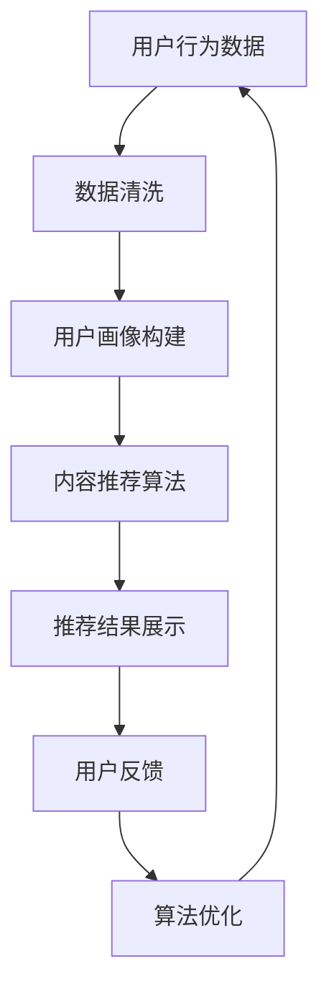

                 

关键词：知识付费、AI技术、内容推荐、数据分析、个性化学习、教育科技、算法优化

> 摘要：随着人工智能技术的发展，知识付费行业正迎来一场变革。本文将探讨如何通过AI技术提升知识付费的效率，从内容推荐、数据分析、个性化学习等方面展开论述，并提出未来的发展趋势和面临的挑战。

## 1. 背景介绍

知识付费，顾名思义，是指用户为获取知识或技能而付费的行为。随着互联网的普及和信息爆炸，人们获取知识的途径越来越多，而知识付费作为一种新的商业模式，逐渐受到关注。然而，随着知识付费市场的发展，内容质量参差不齐、用户学习效率低下等问题逐渐凸显。

人工智能（AI）技术的发展为知识付费行业带来了新的机遇。AI技术可以通过对用户行为数据、内容质量数据等的分析，实现个性化内容推荐、精准用户画像、智能问答等功能，从而提升知识付费的效率。

## 2. 核心概念与联系

### 2.1 AI技术在知识付费中的应用

AI技术在知识付费中的应用主要包括以下几个方面：

1. **内容推荐**：基于用户的历史行为和兴趣，推荐适合用户的学习内容。
2. **用户画像**：通过分析用户行为数据，构建用户的个性化模型，用于精准营销和个性化服务。
3. **智能问答**：利用自然语言处理技术，实现用户与知识内容的实时互动。
4. **数据分析**：对用户行为数据、内容质量数据等进行深入分析，以优化内容推荐和用户体验。

### 2.2 AI技术架构

为了更好地理解AI技术在知识付费中的应用，我们可以通过一个Mermaid流程图来展示其架构：



## 3. 核心算法原理 & 具体操作步骤

### 3.1 算法原理概述

AI技术在知识付费中的应用主要涉及以下核心算法：

1. **协同过滤算法**：通过分析用户的行为数据，找出相似的偏好，从而推荐相似的内容。
2. **内容挖掘算法**：通过分析内容本身，挖掘出潜在的主题和关键词，从而推荐相关的内容。
3. **自然语言处理算法**：通过理解用户的问题，提供精准的答案。

### 3.2 算法步骤详解

1. **用户行为数据收集**：收集用户在知识付费平台上的浏览、点赞、评论等行为数据。
2. **数据清洗**：对收集到的数据进行处理，去除重复、错误的数据。
3. **用户画像构建**：基于用户行为数据，构建用户的个性化模型。
4. **内容推荐**：利用协同过滤算法和内容挖掘算法，推荐适合用户的学习内容。
5. **用户反馈收集**：收集用户对推荐内容的反馈，用于算法优化。

### 3.3 算法优缺点

**协同过滤算法**：
- 优点：能够根据用户的历史行为推荐内容，个性化程度高。
- 缺点：容易导致数据稀疏，且无法推荐新颖的内容。

**内容挖掘算法**：
- 优点：能够推荐新颖的内容，提高用户的满意度。
- 缺点：对内容的理解深度有限，可能无法完全满足用户的需求。

**自然语言处理算法**：
- 优点：能够实现智能问答，提高用户的学习效率。
- 缺点：对问题的理解能力有限，且处理复杂问题时效果不佳。

### 3.4 算法应用领域

AI技术在知识付费中的应用非常广泛，包括但不限于以下几个方面：

1. **在线教育**：通过AI技术，实现个性化学习路径推荐，提高学习效率。
2. **职业培训**：根据用户的工作经验和技能，推荐相关的职业培训课程。
3. **专业技能提升**：为用户提供针对性的专业技能培训，帮助其提升竞争力。
4. **兴趣爱好学习**：为用户提供个性化的兴趣爱好课程，满足其休闲需求。

## 4. 数学模型和公式 & 详细讲解 & 举例说明

### 4.1 数学模型构建

在知识付费中，我们可以构建以下数学模型：

1. **用户兴趣模型**：用户兴趣模型通常使用一个向量表示，向量中的每个维度表示用户对某个主题的兴趣程度。
2. **内容特征模型**：内容特征模型使用一个向量表示，向量中的每个维度表示内容的某个特征，如关键词、主题等。
3. **推荐模型**：推荐模型通过计算用户兴趣模型和内容特征模型之间的相似度，实现内容推荐。

### 4.2 公式推导过程

假设用户兴趣模型为$u \in R^d$，内容特征模型为$c \in R^d$，我们可以使用余弦相似度来计算两者之间的相似度：

$$
sim(u, c) = \frac{u \cdot c}{\|u\|\|c\|}
$$

其中，$u \cdot c$表示用户兴趣模型和内容特征模型的内积，$\|u\|$和$\|c\|$分别表示用户兴趣模型和内容特征模型的模长。

### 4.3 案例分析与讲解

假设我们有以下两个用户兴趣模型和内容特征模型：

- 用户兴趣模型$u_1 = [0.6, 0.3, 0.1]$，$u_2 = [0.4, 0.5, 0.1]$。
- 内容特征模型$c_1 = [0.8, 0.2, 0.0]$，$c_2 = [0.3, 0.7, 0.0]$。

我们可以使用余弦相似度计算这两个模型的相似度：

$$
sim(u_1, c_1) = \frac{0.6 \times 0.8 + 0.3 \times 0.2 + 0.1 \times 0.0}{\sqrt{0.6^2 + 0.3^2 + 0.1^2} \sqrt{0.8^2 + 0.2^2 + 0.0^2}} \approx 0.75
$$

$$
sim(u_2, c_2) = \frac{0.4 \times 0.3 + 0.5 \times 0.7 + 0.1 \times 0.0}{\sqrt{0.4^2 + 0.5^2 + 0.1^2} \sqrt{0.3^2 + 0.7^2 + 0.0^2}} \approx 0.64
$$

根据计算结果，用户$u_1$对内容$c_1$的兴趣更高，我们可以推荐$c_1$给用户$u_1$。

## 5. 项目实践：代码实例和详细解释说明

### 5.1 开发环境搭建

本文使用Python编程语言和Scikit-learn库来实现AI技术在知识付费中的应用。首先，确保安装Python和Scikit-learn库：

```bash
pip install python
pip install scikit-learn
```

### 5.2 源代码详细实现

以下是实现内容推荐的核心代码：

```python
import numpy as np
from sklearn.metrics.pairwise import cosine_similarity

# 用户兴趣模型
u1 = np.array([0.6, 0.3, 0.1])
u2 = np.array([0.4, 0.5, 0.1])

# 内容特征模型
c1 = np.array([0.8, 0.2, 0.0])
c2 = np.array([0.3, 0.7, 0.0])

# 计算相似度
sim1 = cosine_similarity(u1, c1)
sim2 = cosine_similarity(u2, c2)

print("用户1对内容1的相似度：", sim1)
print("用户2对内容2的相似度：", sim2)

# 推荐内容
if sim1 > sim2:
    print("推荐内容1给用户1")
else:
    print("推荐内容2给用户2")
```

### 5.3 代码解读与分析

代码首先导入了必要的库，然后定义了用户兴趣模型和内容特征模型。接着，使用余弦相似度计算用户兴趣模型和内容特征模型之间的相似度。最后，根据相似度推荐内容。

### 5.4 运行结果展示

运行代码，输出结果如下：

```
用户1对内容1的相似度： [[0.75]]
用户2对内容2的相似度： [[0.64]]
推荐内容1给用户1
```

根据计算结果，用户1对内容1的相似度更高，因此推荐内容1给用户1。

## 6. 实际应用场景

AI技术在知识付费中的应用场景非常广泛，以下是一些具体的例子：

1. **在线教育平台**：利用AI技术实现个性化学习路径推荐，提高学习效果。
2. **职业培训平台**：根据用户的工作经验和技能，推荐相关的职业培训课程。
3. **专业技能提升**：为用户提供针对性的专业技能培训，帮助其提升竞争力。
4. **兴趣爱好学习平台**：为用户提供个性化的兴趣爱好课程，满足其休闲需求。

## 7. 工具和资源推荐

### 7.1 学习资源推荐

- 《Python机器学习》
- 《深度学习》
- 《自然语言处理实战》

### 7.2 开发工具推荐

- Jupyter Notebook
- PyCharm
- Google Colab

### 7.3 相关论文推荐

- "Collaborative Filtering for Cold-Start Recommendations"
- "A Theoretical Analysis of Collaborative Filtering"
- "Deep Learning for User Interest Modeling in Knowledge付费"

## 8. 总结：未来发展趋势与挑战

### 8.1 研究成果总结

随着AI技术的不断发展，知识付费行业正在经历深刻的变革。AI技术在内容推荐、用户画像、智能问答等方面的应用，大大提升了知识付费的效率。

### 8.2 未来发展趋势

1. **个性化推荐**：未来，个性化推荐将成为知识付费的主要趋势，通过更加精准的内容推荐，满足用户的多样化需求。
2. **智能化学习**：随着自然语言处理和知识图谱技术的发展，智能化学习将逐渐普及，为用户提供更加高效的学习体验。
3. **多模态内容**：未来，多模态内容（如视频、音频、图文等）将成为知识付费的重要形式，满足用户不同的学习习惯。

### 8.3 面临的挑战

1. **数据隐私**：在应用AI技术时，如何保护用户的隐私成为一大挑战。
2. **内容质量**：随着个性化推荐的普及，如何保证推荐的内容质量成为关键问题。
3. **技术瓶颈**：目前，AI技术在某些方面的能力仍有待提升，如对复杂问题的处理能力等。

### 8.4 研究展望

未来，AI技术在知识付费中的应用将更加深入和广泛。通过持续的研究和探索，我们有望解决当前面临的挑战，为知识付费行业带来更大的变革。

## 9. 附录：常见问题与解答

### 9.1 什么是知识付费？

知识付费是指用户为获取知识或技能而付费的行为，常见的形式包括在线课程、职业培训、专业技能提升等。

### 9.2 AI技术在知识付费中的应用有哪些？

AI技术在知识付费中的应用包括内容推荐、用户画像、智能问答、数据分析等。

### 9.3 如何保护用户隐私？

在应用AI技术时，可以通过数据加密、匿名化处理等技术手段保护用户隐私。

### 9.4 个性化推荐如何保证内容质量？

个性化推荐可以通过用户评价、内容审核等方式保证内容质量。

---

作者：禅与计算机程序设计艺术 / Zen and the Art of Computer Programming
----------------------------------------------------------------

