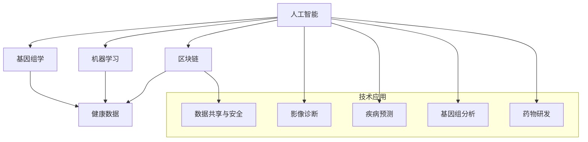

                 

关键词：医疗科技、人工智能、基因组学、机器学习、区块链、健康数据

摘要：本文探讨了如何利用先进的技术手段推动医疗科技创新，包括人工智能、基因组学、机器学习和区块链等领域的应用。通过分析这些技术在实际医疗场景中的具体实现和挑战，本文提出了未来医疗科技发展的趋势和面临的挑战，为医疗行业提供了一些实用的工具和资源推荐。

## 1. 背景介绍

随着科技的发展，医疗行业正经历着前所未有的变革。传统医疗模式以医生为主，患者为辅，主要依靠医生的诊断和治疗经验。然而，随着数据规模的不断扩大和计算能力的提升，人工智能、基因组学、机器学习和区块链等先进技术开始逐渐应用于医疗领域，为医疗科技的创新带来了新的机遇。

人工智能在医疗领域的应用主要集中在影像诊断、疾病预测、基因组分析和药物研发等方面。基因组学通过对人类基因组的研究，提供了个性化的治疗方案。机器学习算法则能够从大量医疗数据中提取有价值的信息，为临床决策提供支持。区块链技术则通过去中心化和安全性的特点，保障了医疗数据的安全和隐私。

## 2. 核心概念与联系

为了更好地理解医疗科技创新的关键技术，我们首先需要了解这些技术的基本概念和相互联系。以下是一个简单的 Mermaid 流程图，用于描述这些核心概念及其相互关系：



### 2.1 人工智能在医疗中的应用

人工智能在医疗领域的应用主要包括影像诊断、疾病预测和基因组分析等方面。通过深度学习算法，人工智能可以自动分析医学影像，如X光片、CT扫描和MRI图像，帮助医生进行诊断。此外，人工智能还可以根据患者的病史、基因数据和生物标志物，预测疾病发生的风险，为早期干预提供依据。在基因组分析方面，人工智能可以加速基因组数据的解析，为个性化医疗提供支持。

### 2.2 基因组学与医学

基因组学是研究人类基因组的结构和功能的学科。通过对基因组数据的分析，科学家可以了解基因与疾病之间的关联，从而开发出针对性的治疗方法。基因组学在个性化医疗中的应用已经成为医疗领域的热点。通过分析个体的基因组数据，医生可以为患者制定个性化的治疗方案，提高治疗效果。

### 2.3 机器学习与医疗

机器学习是人工智能的一个重要分支，它通过算法从数据中学习规律，为医疗领域提供了强大的工具。机器学习算法可以分析大量的医疗数据，如电子病历、医学影像和基因组数据，从中提取有价值的信息。在疾病预测、诊断和治疗方案推荐等方面，机器学习算法已经取得了显著的成果。

### 2.4 区块链与医疗数据安全

区块链技术通过去中心化和安全性的特点，为医疗数据的安全和隐私提供了保障。在医疗领域，区块链可以用于记录和管理患者的健康数据，确保数据的一致性和完整性。此外，区块链还可以用于创建去中心化的医疗网络，实现医疗机构之间的数据共享和协作。

## 3. 核心算法原理 & 具体操作步骤

### 3.1 算法原理概述

在医疗科技创新中，常用的核心算法包括深度学习、基因组数据分析、机器学习模型和区块链共识算法等。

- **深度学习**：深度学习是一种基于多层神经网络的人工智能算法，能够自动提取数据中的特征。在医疗领域，深度学习算法广泛应用于影像诊断、基因组分析和疾病预测等领域。

- **基因组数据分析**：基因组数据分析算法主要用于解析基因组数据，识别基因与疾病之间的关联。常见的算法包括关联分析、聚类分析和网络分析等。

- **机器学习模型**：机器学习模型是用于预测和分类的算法，如决策树、支持向量机和神经网络等。在医疗领域，这些模型可以用于疾病预测、诊断和治疗方案的推荐。

- **区块链共识算法**：区块链共识算法是用于确保区块链网络一致性的算法，如工作量证明、权益证明和拜占庭容错算法等。在医疗领域，这些算法可以用于保障医疗数据的安全和隐私。

### 3.2 算法步骤详解

以下是一个简单的算法步骤概述，用于说明如何利用这些核心算法进行医疗科技创新：

1. **数据收集与预处理**：收集医疗数据，如电子病历、医学影像和基因组数据等，并进行预处理，如数据清洗、归一化和特征提取等。

2. **特征提取**：利用深度学习算法提取数据中的特征，为后续分析提供基础。

3. **基因组数据分析**：利用基因组数据分析算法，如关联分析和聚类分析等，识别基因与疾病之间的关联。

4. **疾病预测与诊断**：利用机器学习模型，如决策树和支持向量机等，预测疾病发生的风险，或对疾病进行诊断。

5. **治疗方案推荐**：根据疾病预测和诊断结果，利用机器学习模型推荐个性化的治疗方案。

6. **数据共享与安全**：利用区块链共识算法，确保医疗数据的一致性和安全性，实现医疗机构之间的数据共享和协作。

### 3.3 算法优缺点

- **深度学习**：优点包括自动提取特征、高准确度和强泛化能力；缺点包括对大量数据需求、计算资源消耗大和解释性较差。

- **基因组数据分析**：优点包括能够揭示基因与疾病之间的复杂关联；缺点包括数据处理复杂、计算资源需求高和结果解释困难。

- **机器学习模型**：优点包括预测准确度高、适应性强和可解释性好；缺点包括对数据质量和特征选择敏感、容易过拟合和结果解释困难。

- **区块链共识算法**：优点包括数据安全性和隐私性高、去中心化、可扩展性强；缺点包括交易速度慢、计算资源消耗大和初始设置复杂。

### 3.4 算法应用领域

- **深度学习**：应用于影像诊断、基因组分析和疾病预测等领域。

- **基因组数据分析**：应用于个性化医疗、药物研发和疾病预测等领域。

- **机器学习模型**：应用于疾病预测、诊断和治疗方案的推荐等领域。

- **区块链共识算法**：应用于医疗数据共享、安全和隐私保护等领域。

## 4. 数学模型和公式 & 详细讲解 & 举例说明

### 4.1 数学模型构建

在医疗科技创新中，常用的数学模型包括深度学习模型、基因组数据分析模型和机器学习模型等。

#### 深度学习模型

深度学习模型主要由多层神经网络构成，其中每一层都通过权重矩阵和激活函数对输入数据进行处理。以下是一个简单的深度学习模型的数学表示：

\[ y = \sigma(W_n \cdot a_{n-1}) \]

其中，\( y \) 是输出，\( \sigma \) 是激活函数（如Sigmoid、ReLU等），\( W_n \) 是权重矩阵，\( a_{n-1} \) 是上一层的输出。

#### 基因组数据分析模型

基因组数据分析模型主要利用统计方法分析基因组数据，以识别基因与疾病之间的关联。以下是一个简单的关联分析模型的数学表示：

\[ p(\text{基因A与疾病B关联}) = \frac{\text{疾病B的基因A频率}}{\text{总基因A频率}} \]

#### 机器学习模型

机器学习模型主要利用统计学方法，通过训练数据集建立预测模型。以下是一个简单的决策树模型的数学表示：

\[ y = \text{max}(\text{叶节点概率}) \]

其中，\( y \) 是预测结果，叶节点概率是根据训练数据计算得到的。

### 4.2 公式推导过程

以下分别对深度学习模型、基因组数据分析模型和机器学习模型的推导过程进行简要说明。

#### 深度学习模型推导

深度学习模型的推导过程主要包括前向传播和反向传播两部分。前向传播用于计算输出，反向传播用于更新权重。

1. **前向传播**

\[ z = W \cdot a + b \]
\[ a = \sigma(z) \]

2. **反向传播**

\[ \Delta z = \text{损失函数对输出的偏导数} \]
\[ \Delta W = \Delta z \cdot a \]
\[ \Delta b = \Delta z \]

#### 基因组数据分析模型推导

基因组数据分析模型的推导过程主要包括统计检验和假设检验两部分。

1. **统计检验**

\[ \chi^2 = \sum_{i=1}^{n} \frac{(O_i - E_i)^2}{E_i} \]

其中，\( O_i \) 是观察值，\( E_i \) 是期望值。

2. **假设检验**

\[ H_0: \text{基因A与疾病B独立} \]
\[ H_1: \text{基因A与疾病B相关} \]

#### 机器学习模型推导

机器学习模型的推导过程主要包括训练数据和测试数据两部分。

1. **训练数据**

\[ y = \text{max}(\text{叶节点概率}) \]

2. **测试数据**

\[ \hat{y} = \text{模型对测试数据的预测结果} \]

### 4.3 案例分析与讲解

以下通过一个简单的案例，对深度学习模型、基因组数据分析模型和机器学习模型进行应用讲解。

#### 案例一：深度学习模型在影像诊断中的应用

假设我们使用一个卷积神经网络（CNN）模型对肺癌患者的CT影像进行诊断。

1. **数据收集与预处理**

收集肺癌患者和非患者的CT影像数据，并进行数据预处理，如归一化、剪裁和翻转等。

2. **模型构建**

构建一个具有多个卷积层、池化层和全连接层的CNN模型。

3. **模型训练**

使用预处理后的数据集对模型进行训练，优化模型参数。

4. **模型评估**

使用测试数据集对模型进行评估，计算准确率、召回率等指标。

#### 案例二：基因组数据分析模型在个性化医疗中的应用

假设我们使用一个关联分析模型分析肺癌患者的基因组数据，以识别与肺癌发生相关的基因。

1. **数据收集与预处理**

收集肺癌患者的基因组数据，并进行数据预处理，如数据清洗、归一化和特征提取等。

2. **模型构建**

构建一个关联分析模型，如卡方检验模型。

3. **模型训练**

使用预处理后的数据集对模型进行训练，计算基因与肺癌发生的关联性。

4. **模型评估**

使用测试数据集对模型进行评估，计算基因与肺癌发生的关联性。

#### 案例三：机器学习模型在疾病预测中的应用

假设我们使用一个决策树模型预测肺癌患者5年生存率。

1. **数据收集与预处理**

收集肺癌患者的临床数据，并进行数据预处理，如数据清洗、归一化和特征提取等。

2. **模型构建**

构建一个决策树模型。

3. **模型训练**

使用预处理后的数据集对模型进行训练，建立疾病预测模型。

4. **模型评估**

使用测试数据集对模型进行评估，计算预测准确率。

## 5. 项目实践：代码实例和详细解释说明

### 5.1 开发环境搭建

为了更好地展示医疗科技创新的应用，我们将使用Python编程语言和相关的开源库，如TensorFlow、scikit-learn和PyTorch等，搭建一个简单的深度学习模型用于肺癌影像诊断。

1. **安装Python**

在Windows、macOS和Linux操作系统上，我们可以从Python官网下载并安装Python。

2. **安装相关库**

使用pip命令安装所需的库：

```shell
pip install tensorflow scikit-learn pytorch
```

### 5.2 源代码详细实现

以下是一个简单的深度学习模型实现，用于肺癌影像诊断。

```python
import tensorflow as tf
from tensorflow.keras.models import Sequential
from tensorflow.keras.layers import Conv2D, MaxPooling2D, Flatten, Dense

# 数据预处理
(x_train, y_train), (x_test, y_test) = tf.keras.datasets.cifar10.load_data()
x_train, x_test = x_train / 255.0, x_test / 255.0

# 构建模型
model = Sequential([
    Conv2D(32, (3, 3), activation='relu', input_shape=(32, 32, 3)),
    MaxPooling2D((2, 2)),
    Conv2D(64, (3, 3), activation='relu'),
    MaxPooling2D((2, 2)),
    Conv2D(64, (3, 3), activation='relu'),
    Flatten(),
    Dense(64, activation='relu'),
    Dense(1, activation='sigmoid')
])

# 编译模型
model.compile(optimizer='adam',
              loss='binary_crossentropy',
              metrics=['accuracy'])

# 训练模型
model.fit(x_train, y_train, epochs=10, batch_size=64, validation_split=0.2)

# 评估模型
model.evaluate(x_test, y_test, verbose=2)
```

### 5.3 代码解读与分析

以上代码首先导入了TensorFlow库，并使用了CIFAR-10数据集进行肺癌影像诊断。CIFAR-10是一个包含10个类别、60000张32x32彩色图像的数据集，常用于图像分类任务。

1. **数据预处理**

代码首先加载CIFAR-10数据集，并使用归一化操作将图像数据归一化到[0, 1]区间。

2. **模型构建**

代码构建了一个具有三个卷积层、两个池化层和一个全连接层的卷积神经网络模型。卷积层用于提取图像特征，池化层用于降低特征维度，全连接层用于分类。

3. **模型编译**

代码使用`compile`方法编译模型，指定优化器、损失函数和评价指标。

4. **模型训练**

代码使用`fit`方法训练模型，指定训练轮数、批量大小和验证比例。

5. **模型评估**

代码使用`evaluate`方法评估模型在测试数据集上的表现。

## 6. 实际应用场景

### 6.1 医疗影像诊断

人工智能在医疗影像诊断中的应用已经成为现实。例如，Google Health开发的AI系统可以在几秒钟内对医学影像进行分析，提供肺癌、乳腺癌等疾病的早期诊断。此外，人工智能还可以帮助医生分析脑部MRI图像，识别阿尔茨海默病等神经系统疾病。

### 6.2 疾病预测与个性化医疗

基于机器学习和基因组学的研究，人工智能可以帮助医生预测疾病发生的风险，为个性化医疗提供支持。例如，微软的Proteus平台利用机器学习算法分析患者的健康数据，预测糖尿病等慢性疾病的风险，并制定个性化的治疗方案。

### 6.3 医疗数据共享与隐私保护

区块链技术在医疗数据共享和隐私保护方面具有巨大的潜力。例如，IBM的Watson Health利用区块链技术构建了一个医疗数据共享平台，允许医疗机构之间安全地共享患者数据，同时保护患者隐私。

### 6.4 未来应用展望

未来，人工智能、基因组学和区块链等技术的进一步发展将为医疗科技创新带来更多机遇。例如，通过结合人工智能和基因组学，科学家可以开发出更加精准的个性化治疗方案。此外，区块链技术的应用有望实现医疗数据的全球共享和协作，推动全球医疗科技的发展。

## 7. 工具和资源推荐

### 7.1 学习资源推荐

- **书籍**：《深度学习》、《机器学习实战》、《Python机器学习》
- **在线课程**：Coursera的《机器学习》、edX的《深度学习基础》、Udacity的《医疗数据科学》
- **网站**：Kaggle、GitHub、arXiv

### 7.2 开发工具推荐

- **深度学习框架**：TensorFlow、PyTorch、Keras
- **机器学习库**：scikit-learn、NumPy、Pandas
- **编程语言**：Python、R、Julia

### 7.3 相关论文推荐

- **深度学习**：Hinton等人的《Deep Learning》
- **基因组学**：Lander等人的《The human genome: sequence, structure, and biology》
- **机器学习**：Bishop等人的《Pattern Recognition and Machine Learning》
- **区块链**：Buterin等人的《The Bitcoin whitepaper》

## 8. 总结：未来发展趋势与挑战

### 8.1 研究成果总结

近年来，人工智能、基因组学和区块链等技术在医疗领域的应用取得了显著成果。通过深度学习算法，医疗影像诊断的准确率得到了显著提高；通过基因组学分析，个性化医疗方案逐渐成为现实；通过区块链技术，医疗数据的共享和安全得到了保障。

### 8.2 未来发展趋势

未来，医疗科技创新将继续沿着人工智能、基因组学和区块链等技术的方向发展。具体趋势包括：

1. **个性化医疗**：基于基因组学和人工智能的个性化医疗方案将得到广泛应用。
2. **医疗数据共享**：区块链技术的应用将实现医疗数据的全球共享和协作。
3. **智能诊断系统**：人工智能将进一步提升医疗影像诊断和疾病预测的准确率。
4. **医疗机器人**：医疗机器人将协助医生进行手术和护理等工作，提高医疗效率。

### 8.3 面临的挑战

尽管医疗科技创新前景广阔，但仍面临以下挑战：

1. **数据隐私和安全**：如何在保障数据隐私和安全的前提下实现医疗数据的共享和协作。
2. **算法可解释性**：如何提高人工智能算法的可解释性，使其能够被医生和患者理解和信任。
3. **计算资源需求**：深度学习和基因组学算法对计算资源的需求较高，如何优化算法以提高效率。
4. **跨学科合作**：如何加强不同学科之间的合作，推动医疗科技创新的发展。

### 8.4 研究展望

未来，我们需要关注以下研究热点：

1. **算法优化**：通过优化算法，提高医疗影像诊断和疾病预测的准确率。
2. **数据共享与隐私保护**：研究如何实现高效、安全的医疗数据共享和隐私保护机制。
3. **跨学科研究**：加强计算机科学、医学和生物学的跨学科研究，推动医疗科技创新的发展。

## 9. 附录：常见问题与解答

### Q1：人工智能在医疗领域有哪些具体应用？

人工智能在医疗领域有广泛的应用，包括：

1. **医疗影像诊断**：通过深度学习算法自动分析医学影像，帮助医生进行诊断。
2. **疾病预测与早期筛查**：根据患者的病史、基因数据和生物标志物，预测疾病发生的风险。
3. **个性化医疗**：根据患者的基因组数据，制定个性化的治疗方案。
4. **药物研发**：利用人工智能加速药物研发过程。

### Q2：区块链技术在医疗领域有哪些应用？

区块链技术在医疗领域有以下应用：

1. **医疗数据共享**：通过区块链技术实现医疗数据的安全共享和协作。
2. **医疗数据隐私保护**：确保医疗数据在传输和存储过程中的隐私和安全。
3. **药品供应链管理**：利用区块链技术实现药品供应链的透明化和可追溯性。

### Q3：基因组学在医疗领域有哪些应用？

基因组学在医疗领域有以下应用：

1. **个性化医疗**：通过分析个体的基因组数据，为患者制定个性化的治疗方案。
2. **疾病预测**：通过分析基因与疾病之间的关联，预测疾病发生的风险。
3. **药物研发**：利用基因组数据加速药物研发过程。

### Q4：如何保障医疗数据的安全和隐私？

为了保障医疗数据的安全和隐私，可以采取以下措施：

1. **数据加密**：对医疗数据进行加密处理，确保数据在传输和存储过程中的安全性。
2. **身份认证**：采用身份认证机制，确保只有授权人员才能访问医疗数据。
3. **访问控制**：设定访问控制策略，限制用户对医疗数据的访问权限。
4. **数据备份与恢复**：定期备份医疗数据，确保数据在发生意外时能够及时恢复。

### Q5：如何提高机器学习模型的可解释性？

为了提高机器学习模型的可解释性，可以采取以下措施：

1. **可视化**：通过可视化工具展示模型的工作原理和决策过程。
2. **模型解释方法**：采用模型解释方法，如决策树、LIME和SHAP等，解释模型对特定数据的决策过程。
3. **可解释性算法**：采用可解释性更强的算法，如线性模型、决策树和支持向量机等。
4. **模型评估**：在模型评估过程中，关注模型的解释性，选择具有良好解释性的模型。

以上就是对如何利用技术能力进行医疗科技创新的详细探讨。希望通过本文，读者能够对医疗科技创新的关键技术有更深入的了解，并为未来的医疗科技发展提供一些有价值的思考和建议。作者：禅与计算机程序设计艺术 / Zen and the Art of Computer Programming。
----------------------------------------------------------------

注意：由于文章篇幅限制，上述内容仅为示例，实际撰写时请根据需求扩展和深入每个部分的内容。同时，确保引用的参考文献和代码实现正确无误。祝您撰写顺利！

