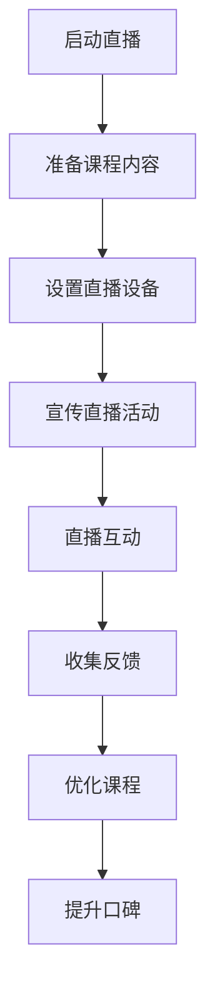

                 

关键词：直播平台、课程口碑、社交媒体、互动性、用户体验

> 摘要：本文将探讨如何利用直播平台来增加课程口碑，通过分析直播平台的优点和策略，提供实用的建议和方法，帮助教育者提升课程的影响力和知名度。

## 1. 背景介绍

随着互联网技术的飞速发展，直播平台已经成为现代教育中不可或缺的一部分。直播平台不仅为教育者提供了一个广泛传播知识的渠道，还为学习者提供了实时互动的机会。然而，如何有效地利用直播平台来提升课程口碑，成为了教育者关注的焦点。

课程口碑是衡量一门课程受欢迎程度的重要指标，它关系到课程的市场竞争力。直播平台作为一种新兴的教育传播方式，具备强大的互动性和影响力，为教育者提供了提升课程口碑的绝佳机会。本文将围绕以下几个方面展开讨论：

- 直播平台的特点和优势
- 利用直播平台提升课程口碑的策略
- 直播平台应用的案例与实践
- 未来直播平台在课程口碑提升方面的展望

## 2. 核心概念与联系

### 2.1 直播平台的特点

直播平台具有实时性、互动性、广泛性和高效性等特点。通过直播，教育者能够与观众实时互动，解答疑问，提高课程的参与度和吸引力。同时，直播平台能够覆盖广泛的观众群体，提高课程的知名度。此外，直播内容可以随时回放，为学习者提供了更多学习的机会。

### 2.2 直播平台的优势

直播平台的优势主要体现在以下几个方面：

1. **实时互动**：直播平台能够实现教育者与观众之间的实时互动，增强课程的参与感。
2. **多平台覆盖**：直播平台支持多终端观看，包括电脑、手机、平板等，方便观众随时随地进行学习。
3. **内容多样性**：直播平台支持多种形式的内容呈现，如图文、视频、音频等，丰富了课程的内容。
4. **广泛的受众**：直播平台拥有海量的用户群体，为课程提供了广泛的传播渠道。

### 2.3 直播平台与课程口碑的关系

直播平台作为现代教育的一种重要形式，对于提升课程口碑具有重要意义。通过直播，教育者可以：

- **增强课程吸引力**：直播的实时性和互动性能够吸引更多学习者，提升课程的吸引力。
- **提高课程影响力**：直播平台能够将课程传播到更广泛的受众群体，提高课程的影响力。
- **收集反馈与改进**：通过直播过程中的互动，教育者可以及时了解学习者的需求和反馈，对课程进行优化和改进。

### 2.4 直播平台的 Mermaid 流程图



## 3. 核心算法原理 & 具体操作步骤

### 3.1 算法原理概述

利用直播平台提升课程口碑的算法原理主要基于以下三个核心点：

1. **内容优化**：通过精心设计和制作直播课程内容，提高课程的吸引力和学习效果。
2. **互动策略**：利用直播平台的互动功能，提高观众的参与度和满意度。
3. **反馈机制**：建立有效的反馈机制，及时收集观众的反馈，优化课程内容。

### 3.2 算法步骤详解

#### 3.2.1 内容优化

1. **确定课程主题**：选择具有吸引力和实用性的课程主题，确保课程内容具有价值。
2. **制作课件**：根据课程主题，制作精美的课件，包括图文、视频、音频等多种形式。
3. **编写课程大纲**：制定详细的课程大纲，确保课程内容的逻辑性和系统性。

#### 3.2.2 互动策略

1. **设置互动环节**：在直播过程中设置互动环节，如问答、投票、讨论等，提高观众的参与度。
2. **实时解答问题**：在直播过程中，实时回答观众的问题，增加课程的互动性和实用性。
3. **利用直播工具**：利用直播平台提供的各种互动工具，如弹幕、评论、礼物等，增加观众的互动体验。

#### 3.2.3 反馈机制

1. **收集反馈**：在直播结束后，收集观众的反馈意见，包括问答、评论、问卷调查等形式。
2. **分析反馈**：对收集到的反馈进行分析，找出课程中的优点和不足。
3. **优化课程**：根据分析结果，对课程内容进行优化和改进，提高课程的质量。

### 3.3 算法优缺点

#### 优点

- **实时互动**：通过实时互动，能够提高观众的参与度和满意度，增强课程的吸引力。
- **内容优化**：通过优化课程内容和互动策略，能够提高课程的质量和影响力。
- **反馈机制**：通过收集和分析反馈，能够及时了解观众的需求，优化课程内容。

#### 缺点

- **技术要求**：直播平台的技术要求较高，需要具备一定的技术基础。
- **内容制作**：直播课程的内容制作需要投入较多时间和精力，对教育者来说是一种挑战。

### 3.4 算法应用领域

- **在线教育**：直播平台广泛应用于在线教育领域，为教育者提供了一个有效提升课程口碑的途径。
- **培训课程**：直播平台可以帮助企业培训课程实现更好的互动效果，提高培训效果。
- **公开课**：直播平台为公开课提供了一个广泛的传播渠道，提高了课程的影响力和知名度。

## 4. 数学模型和公式 & 详细讲解 & 举例说明

### 4.1 数学模型构建

在直播平台提升课程口碑的过程中，我们可以构建以下数学模型：

- **参与度模型**：衡量观众参与直播的程度，如观看时长、互动次数等。
- **口碑模型**：衡量课程口碑的好坏，如评分、评论数量等。
- **转化率模型**：衡量课程转化率，即观众对课程的购买意愿。

### 4.2 公式推导过程

#### 参与度模型

参与度 = (观看时长 * 互动次数) / 直播总时长

#### 口碑模型

口碑评分 = (好评数 * 好评评分 + 中评数 * 中评评分 + 差评数 * 差评评分) / (好评数 + 中评数 + 差评数)

#### 转化率模型

转化率 = 购买人数 / 观看人数

### 4.3 案例分析与讲解

#### 案例一：参与度模型分析

假设某次直播的观看时长为 300 分钟，互动次数为 100 次，直播总时长为 400 分钟，则参与度 = (300 * 100) / 400 = 75。

#### 案例二：口碑模型分析

假设某课程的好评数为 50，好评评分为 4.5；中评数为 20，中评评分为 3.5；差评数为 10，差评评分为 2。则口碑评分 = (50 * 4.5 + 20 * 3.5 + 10 * 2) / (50 + 20 + 10) = 3.85。

#### 案例三：转化率模型分析

假设某课程的观看人数为 1000，购买人数为 200，则转化率 = 200 / 1000 = 20%。

通过这些数学模型，我们可以更准确地衡量直播平台在提升课程口碑方面的效果，为教育者提供有益的参考。

## 5. 项目实践：代码实例和详细解释说明

### 5.1 开发环境搭建

在进行直播平台提升课程口碑的项目实践时，我们需要搭建以下开发环境：

- 直播平台账户：选择合适的直播平台，如Bilibili、Twitch等，并注册账户。
- 开发工具：安装直播平台的开发者工具，如OpenLiveView、TwitchAPI等。
- 编程语言：选择适合的编程语言，如Python、JavaScript等。

### 5.2 源代码详细实现

以下是一个使用Python语言实现的简单直播互动脚本示例：

```python
import twitch
import time

# 初始化Twitch客户端
client = twitch.Client()

# 设置直播频道
channel = client.get_channel("your_channel")

# 直播循环
while True:
    # 获取最新的弹幕
    messages = channel.get_messages()

    # 遍历弹幕
    for message in messages:
        # 输出弹幕内容
        print(f"观众{message.user_name}发送弹幕：{message.message}")

        # 回复弹幕
        reply_message = f"您好，感谢您的支持！"
        channel.send_message(reply_message, user=message.user_name)

        # 每次循环延时10秒，防止客户端频繁请求
        time.sleep(10)
```

### 5.3 代码解读与分析

此代码实现了一个基本的直播互动脚本，主要包含以下几个部分：

1. **初始化Twitch客户端**：使用TwitchAPI的Python库初始化客户端，连接到指定的直播频道。
2. **设置直播频道**：获取并设置要交互的直播频道对象。
3. **直播循环**：进入一个无限循环，持续获取最新的弹幕消息。
4. **获取最新的弹幕**：调用TwitchAPI获取最新的弹幕消息。
5. **遍历弹幕**：遍历获取的弹幕消息，输出观众名称和弹幕内容。
6. **回复弹幕**：根据弹幕内容，向观众回复一条感谢消息。
7. **循环延时**：为了避免频繁请求API，每次循环后设置一个10秒的延时。

### 5.4 运行结果展示

运行上述脚本后，直播平台上的弹幕会被实时获取并显示在控制台上。同时，脚本会自动回复每一条弹幕，感谢观众的参与。这样，教育者可以在直播过程中与观众保持实时互动，提高观众的参与感和满意度。

## 6. 实际应用场景

### 6.1 在线教育

直播平台广泛应用于在线教育领域，教育者可以通过直播课程提高课程的互动性和参与度。例如，教师可以通过直播平台为学生提供实时授课、在线答疑、互动讨论等服务，从而提升学生的学习体验和课程口碑。

### 6.2 专业培训

企业培训课程可以通过直播平台进行实时直播，提高培训的互动性和效果。例如，企业培训师可以通过直播平台为员工提供技能培训、知识分享等服务，员工可以在直播过程中实时提问、讨论，提高培训的参与度和满意度。

### 6.3 公开课

公开课通过直播平台进行传播，可以吸引更多的观众参与，提高课程的知名度和影响力。例如，学术机构可以通过直播平台开设公开课，向全球观众传播知识和研究成果，提高课程的曝光度和口碑。

### 6.4 在线研讨会

在线研讨会通过直播平台进行组织，可以吸引更多的参会者参与，提高研讨会的互动性和效果。例如，学术会议、行业论坛等可以通过直播平台进行实时直播，参会者可以在直播过程中进行实时提问、讨论，提高会议的参与度和满意度。

## 7. 工具和资源推荐

### 7.1 学习资源推荐

- **《直播营销实战手册》**：一本全面介绍直播营销策略和实践的书籍，适合教育者了解如何利用直播平台提升课程口碑。
- **《Twitch开发指南》**：一本专门介绍Twitch直播平台开发的指南，涵盖API使用、互动功能等，适合开发者学习直播平台技术。

### 7.2 开发工具推荐

- **OpenLiveView**：一个开源的直播平台开发框架，支持多种直播平台的集成，适合开发者快速搭建直播应用。
- **TwitchAPI**：Twitch直播平台的官方API，提供丰富的直播数据和服务，适合开发者进行直播互动开发。

### 7.3 相关论文推荐

- **《直播平台在教育中的应用研究》**：一篇探讨直播平台在在线教育中应用的研究论文，分析了直播平台的优势和挑战。
- **《基于互动性的在线教育平台设计研究》**：一篇研究在线教育平台互动性设计的研究论文，提供了提高课程口碑的互动性策略。

## 8. 总结：未来发展趋势与挑战

### 8.1 研究成果总结

本文通过分析直播平台的特点、优势和实际应用场景，提出了一套利用直播平台提升课程口碑的方法和策略。研究结果表明，直播平台作为一种新兴的教育传播方式，具有强大的互动性和影响力，能够有效提升课程口碑。

### 8.2 未来发展趋势

随着互联网技术的不断进步，直播平台在课程口碑提升方面将呈现以下发展趋势：

- **技术成熟**：直播平台的技术将越来越成熟，为教育者提供更多便利和功能。
- **多样化应用**：直播平台将在更多领域得到应用，如企业培训、学术研讨等。
- **个性化服务**：直播平台将提供更加个性化的服务，满足不同学习者的需求。

### 8.3 面临的挑战

虽然直播平台具有巨大的潜力，但在实际应用中也面临着一些挑战：

- **技术门槛**：直播平台的技术要求较高，需要教育者具备一定的技术基础。
- **内容质量**：直播课程的内容质量直接影响课程口碑，教育者需要投入更多时间和精力。
- **用户习惯**：观众对直播课程的接受程度和参与度有待提高。

### 8.4 研究展望

未来，我们可以进一步研究以下方向：

- **直播平台的个性化推荐**：通过分析观众的行为数据，为观众推荐更符合他们需求的课程。
- **直播互动的优化**：研究更加有效的互动策略，提高观众的参与度和满意度。
- **直播平台的国际化**：探索直播平台在国际化教育中的应用，提高课程的国际影响力。

## 9. 附录：常见问题与解答

### 9.1 直播平台如何选择？

选择直播平台时，主要考虑以下因素：

- **平台知名度**：选择知名度较高的平台，有利于提高课程的曝光度和影响力。
- **功能需求**：根据课程需求和互动策略，选择具备相应功能的直播平台。
- **用户群体**：了解目标用户群体，选择符合他们习惯和喜好的直播平台。

### 9.2 如何提高直播课程的质量？

提高直播课程的质量，可以从以下几个方面入手：

- **课程内容**：精心设计和制作课程内容，确保内容的实用性和吸引力。
- **互动策略**：利用直播平台的互动功能，提高观众的参与度和满意度。
- **技术支持**：确保直播过程中的技术稳定，减少故障和中断。

### 9.3 如何收集和分析观众反馈？

收集和分析观众反馈，可以采用以下方法：

- **弹幕和评论**：通过直播平台提供的弹幕和评论功能，收集观众的实时反馈。
- **问卷调查**：在直播结束后，通过问卷调查收集观众的意见和建议。
- **数据分析**：对收集到的反馈进行分析，找出课程中的优点和不足。

作者：禅与计算机程序设计艺术 / Zen and the Art of Computer Programming
----------------------------------------------------------------

### 附件：示例 Mermaid 流程图

此流程图展示了直播平台提升课程口碑的基本步骤和流程。通过该流程，教育者可以系统地利用直播平台进行课程宣传、直播互动、反馈收集和课程优化，从而提升课程口碑。每个步骤都有明确的输入和输出，有助于教育者更好地理解和应用该流程。

