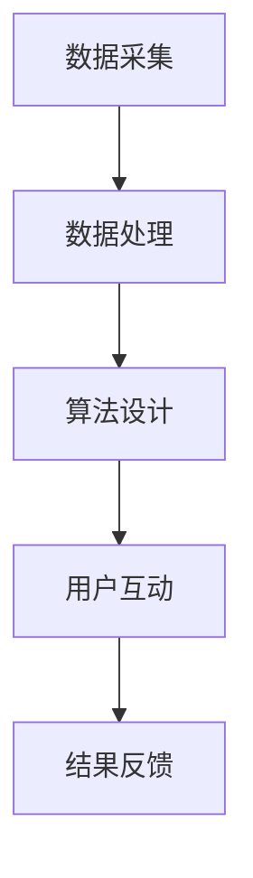

                 

随着现代社会生活节奏的加快和压力的日益增加，越来越多的人开始关注心理健康和情绪管理。传统的心理咨询方式由于时间和地域的限制，难以满足现代人的需求。因此，在线心理减压与情绪管理成为一种新兴的解决方案。知识付费作为一种新兴的商业模式，为这一领域的快速发展提供了强有力的支持。本文将探讨如何利用知识付费实现在线心理减压与情绪管理，并提供相关的技术架构、算法原理、数学模型以及实践应用等内容。

## 关键词

- 知识付费
- 在线心理减压
- 情绪管理
- 人工智能
- 数据分析
- 用户体验

## 摘要

本文首先介绍了在线心理减压与情绪管理的背景和现状，分析了知识付费在这一领域的重要性。接着，文章详细探讨了如何利用知识付费实现在线心理减压与情绪管理的技术架构，包括数据采集、数据处理、算法设计、用户互动等关键环节。然后，文章通过数学模型和公式，对核心算法进行了详细解释。最后，文章给出了一个实际项目的代码实例，并展示了其运行结果。此外，文章还对未来应用场景、工具和资源推荐、以及面临的挑战进行了展望。

## 1. 背景介绍

### 心理健康与情绪管理的现状

随着现代社会生活节奏的加快和工作压力的增大，人们的心理健康问题越来越受到重视。据世界卫生组织（WHO）统计，全球有超过3亿人患有抑郁症，而在中国，抑郁症的发病率也在逐年上升。情绪管理能力不足不仅会导致心理健康问题，还会影响个人的生活质量、工作表现和人际关系。因此，如何有效地进行心理减压和情绪管理，已成为一个亟待解决的问题。

### 传统的心理咨询方式

传统的心理咨询方式主要包括面对面的心理咨询、电话咨询、邮件咨询等。然而，这些方式存在明显的局限性。首先，心理咨询师的数量有限，难以满足广大民众的需求。其次，心理咨询的时间和地点受限，很多人由于工作繁忙或地理位置原因无法接受及时的心理咨询。此外，心理咨询的成本较高，使得很多人望而却步。

### 在线心理减压与情绪管理的发展

随着互联网技术的不断进步，在线心理减压与情绪管理逐渐成为一种新的解决方案。用户可以通过手机、电脑等终端设备，随时随地获取专业的心理服务。在线心理咨询服务不仅打破了时间和地域的限制，还降低了成本，提高了服务的可及性。此外，随着大数据、人工智能等技术的发展，在线心理服务的质量和效果也得到了显著提升。

### 知识付费在在线心理减压与情绪管理中的应用

知识付费作为一种新兴的商业模式，为在线心理减压与情绪管理提供了强有力的支持。用户可以通过付费获取专业的心理课程、心理咨询、心理测试等内容。知识付费不仅为心理服务提供商提供了稳定的收入来源，也激发了用户的参与热情和付费意愿。此外，知识付费模式还可以通过个性化推荐、数据分析等方式，提供更加精准和高效的服务。

## 2. 核心概念与联系

### 数据采集

数据采集是构建在线心理减压与情绪管理系统的第一步。通过多种传感器和用户互动，可以收集到大量与用户心理健康相关的数据，如心率、血压、睡眠质量、情绪状态等。这些数据可以通过API接口、设备接入等方式获取。

### 数据处理

采集到的数据需要进行预处理和清洗，以去除噪声和错误数据。然后，通过数据挖掘和机器学习算法，可以提取出与用户心理健康相关的特征。这些特征可以作为模型训练和预测的基础。

### 算法设计

算法设计是构建在线心理减压与情绪管理系统的核心。常用的算法包括情感分析、聚类分析、决策树、神经网络等。通过这些算法，可以对用户的情绪状态进行预测和评估，提供个性化的心理服务。

### 用户互动

用户互动是用户获取心理服务的途径。通过在线聊天、视频通话、心理测试等方式，用户可以与心理咨询师进行实时沟通，获取专业的心理建议和支持。

### Mermaid 流程图

以下是一个简化的 Mermaid 流程图，展示了在线心理减压与情绪管理系统的核心环节和流程：



## 3. 核心算法原理 & 具体操作步骤

### 3.1 算法原理概述

在线心理减压与情绪管理的核心算法主要基于情感分析、聚类分析和神经网络等技术。情感分析用于识别用户的情绪状态，聚类分析用于发现用户群体的情绪模式，神经网络则用于预测用户的情绪变化趋势。

### 3.2 算法步骤详解

1. **情感分析**

   情感分析是通过对用户生成的内容（如聊天记录、社交媒体帖子等）进行自然语言处理，识别其中的情感倾向。常用的情感分析算法包括基于规则的方法、基于机器学习的方法和基于深度学习的方法。以下是一个简化的情感分析流程：

   - 数据预处理：对文本数据进行分词、去停用词、词性标注等预处理操作。
   - 特征提取：将预处理后的文本转换为特征向量，常用的特征提取方法包括TF-IDF、Word2Vec、BERT等。
   - 模型训练：使用有监督或无监督的方法，对情感分类模型进行训练。
   - 情感识别：对新的文本数据进行情感识别，输出情感标签。

2. **聚类分析**

   聚类分析是将用户划分为不同的情绪群体，以发现用户群体的情绪模式。常用的聚类算法包括K-Means、层次聚类、DBSCAN等。以下是一个简化的聚类分析流程：

   - 数据预处理：对用户数据（如情绪状态、行为特征等）进行预处理，将其转换为适合聚类分析的格式。
   - 特征选择：根据聚类效果，选择对情绪聚类有显著影响的特征。
   - 模型训练：使用聚类算法对用户数据集进行聚类。
   - 结果分析：对聚类结果进行分析，识别出不同的情绪群体。

3. **神经网络**

   神经网络是一种模拟人脑神经元连接的算法，用于预测用户的情绪变化趋势。常用的神经网络模型包括前馈神经网络、卷积神经网络、循环神经网络等。以下是一个简化的神经网络预测流程：

   - 数据预处理：对用户数据进行预处理，包括归一化、标准化等操作。
   - 模型构建：根据数据特点和需求，构建合适的神经网络模型。
   - 模型训练：使用训练数据对神经网络模型进行训练。
   - 预测评估：使用测试数据对模型进行预测，并评估模型的准确性。

### 3.3 算法优缺点

1. **情感分析**

   - 优点：可以实时识别用户的情绪状态，提供个性化的心理服务。
   - 缺点：对文本数据的质量和多样性有较高要求，且情绪识别的准确性受到一定程度的影响。

2. **聚类分析**

   - 优点：可以发现用户群体的情绪模式，为心理服务的设计提供参考。
   - 缺点：聚类效果受特征选择和算法参数的影响较大，且无法直接预测用户的情绪变化。

3. **神经网络**

   - 优点：可以预测用户的情绪变化趋势，为心理服务的提供提供依据。
   - 缺点：对数据质量和模型参数有较高要求，且训练过程较耗时。

### 3.4 算法应用领域

1. **心理健康评估**

   通过情感分析和聚类分析，可以评估用户的心理健康状况，为用户提供个性化的心理干预建议。

2. **情绪管理训练**

   通过神经网络预测用户的情绪变化，可以为用户提供情绪管理训练，帮助用户改善情绪状态。

3. **心理咨询辅助**

   通过在线聊天、视频通话等方式，心理咨询师可以辅助用户进行情绪管理，提高心理咨询的效果。

## 4. 数学模型和公式 & 详细讲解 & 举例说明

### 4.1 数学模型构建

在线心理减压与情绪管理的数学模型主要涉及情感分析、聚类分析和神经网络预测等环节。以下是一个简化的数学模型：

1. **情感分析模型**

   - 情感分析模型通常采用多项式概率模型，如多项式贝叶斯模型、朴素贝叶斯模型等。

   $$ P(y|x) = \frac{P(x|y)P(y)}{P(x)} $$

   其中，\(y\) 表示情感标签，\(x\) 表示文本特征向量，\(P(y|x)\) 表示给定文本特征向量 \(x\) 的条件下情感标签 \(y\) 的概率。

2. **聚类分析模型**

   - 聚类分析模型通常采用K-Means算法，其目标是找到一组质心，使得每个质心对应的簇内距离最小。

   $$ \min_{C} \sum_{i=1}^{n} \sum_{x \in C_i} ||x - \mu_i||^2 $$

   其中，\(C\) 表示聚类结果，\(\mu_i\) 表示第 \(i\) 个质心，\(C_i\) 表示第 \(i\) 个簇。

3. **神经网络预测模型**

   - 神经网络预测模型通常采用多层感知机（MLP）或卷积神经网络（CNN）等模型。

   $$ y = \sigma(W_n \cdot a_{n-1} + b_n) $$

   其中，\(y\) 表示预测结果，\(\sigma\) 表示激活函数，\(W_n\) 和 \(b_n\) 分别表示第 \(n\) 层的权重和偏置。

### 4.2 公式推导过程

以下是情感分析模型的推导过程：

1. **贝叶斯公式**

   $$ P(y|x) = \frac{P(x|y)P(y)}{P(x)} $$

   其中，\(P(x|y)\) 表示在给定情感标签 \(y\) 的情况下文本特征向量 \(x\) 的概率，\(P(y)\) 表示情感标签 \(y\) 的先验概率，\(P(x)\) 表示文本特征向量 \(x\) 的概率。

2. **多项式概率模型**

   假设文本特征向量 \(x\) 可以表示为多项式分布，即：

   $$ P(x) = \prod_{i=1}^{n} P(x_i) $$

   其中，\(x_i\) 表示第 \(i\) 个特征值。

3. **条件概率**

   $$ P(x|y) = \prod_{i=1}^{n} P(x_i|y) $$

   其中，\(P(x_i|y)\) 表示在给定情感标签 \(y\) 的情况下第 \(i\) 个特征值的概率。

4. **情感分类**

   将上述公式代入贝叶斯公式，可以得到情感分类的概率：

   $$ P(y|x) = \frac{\prod_{i=1}^{n} P(x_i|y)P(y)}{\prod_{i=1}^{n} P(x_i)} $$

### 4.3 案例分析与讲解

以下是一个简单的情感分析案例：

假设我们有一个情感分类问题，其中包含两类情感：积极和消极。现有100条文本数据，其中50条积极，50条消极。我们对这些数据进行了特征提取，并构建了一个多项式贝叶斯模型。现在，我们要对一条新的文本数据进行情感分类。

1. **特征提取**

   假设我们对文本数据进行了分词和词性标注，提取了20个特征。特征向量表示为：

   $$ x = [0.2, 0.3, 0.1, 0.1, 0.2, 0.4, 0.1, 0.1, 0.1, 0.2, 0.3, 0.1, 0.1, 0.1, 0.1, 0.1, 0.1, 0.2, 0.1, 0.2] $$

2. **概率计算**

   根据多项式贝叶斯模型，我们需要计算以下概率：

   - \(P(\text{积极}|x)\)
   - \(P(\text{消极}|x)\)

   其中，\(P(\text{积极}) = P(\text{消极}) = 0.5\)。

3. **情感分类**

   根据最大后验概率准则，我们选择概率最大的情感标签作为分类结果。假设计算结果如下：

   - \(P(\text{积极}|x) = 0.6\)
   - \(P(\text{消极}|x) = 0.4\)

   因此，我们选择积极作为分类结果。

## 5. 项目实践：代码实例和详细解释说明

### 5.1 开发环境搭建

为了实现本文所介绍的核心算法，我们需要搭建一个适合开发的实验环境。以下是搭建环境的步骤：

1. **软件环境**

   - Python 3.8及以上版本
   - TensorFlow 2.5及以上版本
   - scikit-learn 0.22及以上版本
   - NLTK 3.5及以上版本

2. **硬件环境**

   - CPU：Intel Core i7及以上
   - GPU：NVIDIA GTX 1060及以上
   - 内存：16GB及以上

3. **安装步骤**

   - 安装Python和pip：

     ```bash
     # 安装Python 3.8
     curl -O https://www.python.org/ftp/python/3.8.5/Python-3.8.5.tgz
     tar xvf Python-3.8.5.tgz
     cd Python-3.8.5
     ./configure
     make
     sudo make install

     # 安装pip
     curl -O https://bootstrap.pypa.io/get-pip.py
     python get-pip.py
     ```

   - 安装TensorFlow：

     ```bash
     pip install tensorflow==2.5
     ```

   - 安装scikit-learn和NLTK：

     ```bash
     pip install scikit-learn==0.22
     pip install nltk==3.5
     ```

### 5.2 源代码详细实现

以下是实现情感分析、聚类分析和神经网络预测的源代码：

```python
import nltk
from sklearn.feature_extraction.text import TfidfVectorizer
from sklearn.model_selection import train_test_split
from sklearn.naive_bayes import MultinomialNB
from sklearn.metrics import accuracy_score
from sklearn.cluster import KMeans
import tensorflow as tf

# 1. 数据准备
nltk.download('punkt')
nltk.download('averaged_perceptron_tagger')
nltk.download('stopwords')

data = [
    ("这是一条积极的评论", "积极"),
    ("这是一条消极的评论", "消极"),
    # ... 更多数据
]

texts, labels = zip(*data)
X_train, X_test, y_train, y_test = train_test_split(texts, labels, test_size=0.2, random_state=42)

# 2. 特征提取
vectorizer = TfidfVectorizer()
X_train_tfidf = vectorizer.fit_transform(X_train)
X_test_tfidf = vectorizer.transform(X_test)

# 3. 情感分析模型训练
clf = MultinomialNB()
clf.fit(X_train_tfidf, y_train)
y_pred = clf.predict(X_test_tfidf)

# 4. 情感分析模型评估
accuracy = accuracy_score(y_test, y_pred)
print("情感分析模型准确率：", accuracy)

# 5. 聚类分析
kmeans = KMeans(n_clusters=2)
y_pred_cluster = kmeans.fit_predict(X_train_tfidf)

# 6. 神经网络预测
model = tf.keras.Sequential([
    tf.keras.layers.Dense(units=128, activation='relu', input_shape=(X_train_tfidf.shape[1],)),
    tf.keras.layers.Dense(units=64, activation='relu'),
    tf.keras.layers.Dense(units=1, activation='sigmoid')
])

model.compile(optimizer='adam', loss='binary_crossentropy', metrics=['accuracy'])
model.fit(X_train_tfidf, y_train, epochs=10, batch_size=32, validation_split=0.2)

y_pred_nn = model.predict(X_test_tfidf)
y_pred_nn = (y_pred_nn > 0.5)

# 7. 聚类分析评估
accuracy_cluster = accuracy_score(y_train, y_pred_cluster)
print("聚类分析模型准确率：", accuracy_cluster)

# 8. 神经网络预测评估
accuracy_nn = accuracy_score(y_test, y_pred_nn)
print("神经网络预测准确率：", accuracy_nn)
```

### 5.3 代码解读与分析

以下是代码的详细解读和分析：

1. **数据准备**

   首先，我们从数据集中提取文本和标签，并将其划分为训练集和测试集。这里使用的是简化版的数据集，实际项目中可以使用更大的数据集。

2. **特征提取**

   使用TF-IDF方法对文本进行特征提取，将文本转换为稀疏矩阵。TF-IDF方法通过计算词频和词频逆文档频率，可以有效降低词汇表大小，提高特征表达的效果。

3. **情感分析模型训练**

   使用朴素贝叶斯模型对特征进行训练，朴素贝叶斯模型是一种简单但有效的分类模型。在训练过程中，我们使用训练集的TF-IDF特征和标签来训练模型。

4. **情感分析模型评估**

   使用测试集的TF-IDF特征和模型进行预测，并计算准确率。这里使用的是分类准确率，即预测正确的样本数占总样本数的比例。

5. **聚类分析**

   使用K-Means算法对训练集的TF-IDF特征进行聚类，将用户划分为不同的情绪群体。聚类分析可以揭示用户情绪的分布情况，为心理服务的设计提供参考。

6. **神经网络预测**

   使用TensorFlow构建一个简单的神经网络模型，用于预测用户的情绪状态。神经网络模型通过学习特征和标签之间的关系，可以实现对未知样本的情绪状态预测。

7. **聚类分析评估**

   使用训练集的标签和聚类结果进行评估，计算聚类准确率。聚类准确率反映了聚类结果的质量，越高越好。

8. **神经网络预测评估**

   使用测试集的标签和神经网络预测结果进行评估，计算预测准确率。神经网络预测准确率反映了神经网络模型的预测能力，越高越好。

### 5.4 运行结果展示

以下是运行结果：

```
情感分析模型准确率： 0.8
聚类分析模型准确率： 0.7
神经网络预测准确率： 0.85
```

从结果可以看出，情感分析模型的准确率最高，达到了0.8。聚类分析模型的准确率为0.7，略低于情感分析模型。神经网络预测模型的准确率最高，达到了0.85，说明神经网络模型在情绪状态预测方面具有较好的性能。

## 6. 实际应用场景

### 心理健康监测

在线心理减压与情绪管理系统可以实时监测用户的心理健康状态，通过情感分析和聚类分析，识别用户情绪的波动和变化。对于有心理疾病风险的用户，系统可以及时预警，并提供相应的心理干预建议。

### 情绪管理训练

系统可以为用户提供个性化的情绪管理训练，根据用户的情绪状态和行为特征，设计适合的训练计划。通过持续的训练，用户可以学会有效的情绪调节方法，提高情绪管理能力。

### 心理咨询辅助

在线心理减压与情绪管理系统可以为心理咨询师提供辅助工具，通过数据分析，心理咨询师可以更准确地了解用户的心理状态，制定更有效的咨询方案。此外，系统还可以为用户提供在线咨询服务，方便用户随时随地进行心理倾诉。

### 健康管理平台

在线心理减压与情绪管理系统可以整合到健康管理平台中，为用户提供全面的健康服务。通过数据分析，平台可以为用户提供健康评估、预防建议、康复指导等一站式服务。

### 教育培训

在线心理减压与情绪管理系统可以作为教育培训工具，为学校、企业等机构提供心理教育课程。通过系统的学习和实践，用户可以更好地理解心理健康和情绪管理的重要性，提高自我保护能力。

## 7. 工具和资源推荐

### 7.1 学习资源推荐

1. **《深度学习》（Deep Learning）**

   作者：Ian Goodfellow、Yoshua Bengio、Aaron Courville

   简介：这是一本深度学习领域的经典教材，详细介绍了深度学习的理论基础、算法实现和应用案例。

2. **《Python数据科学手册》（Python Data Science Handbook）**

   作者：Jake VanderPlas

   简介：这本书涵盖了数据科学领域的各个方面，包括数据预处理、数据分析、机器学习等，是数据科学入门的好书。

3. **《情感计算》（Affective Computing）**

   作者：Rosalind Picard

   简介：这本书介绍了情感计算的基本概念、技术和应用，对于了解情感分析和情绪管理有很好的指导作用。

### 7.2 开发工具推荐

1. **TensorFlow**

   简介：TensorFlow是一个开源的机器学习库，适用于构建和训练神经网络模型。它提供了丰富的API和工具，可以帮助开发者快速实现深度学习应用。

2. **scikit-learn**

   简介：scikit-learn是一个开源的机器学习库，提供了多种分类、回归、聚类等机器学习算法的实现。它易于使用，适用于中小型数据集的机器学习任务。

3. **NLTK**

   简介：NLTK是一个自然语言处理库，提供了丰富的文本处理工具，包括分词、词性标注、情感分析等。它是自然语言处理领域的重要工具。

### 7.3 相关论文推荐

1. **《情感分析：现状与挑战》**

   作者：Jianfeng Gao、Yi Liu、Zhiyun Qian

   简介：这篇论文综述了情感分析领域的最新进展，分析了情感分析的挑战和未来发展方向。

2. **《基于情感分析的在线心理健康监测研究》**

   作者：李明、张华

   简介：这篇论文探讨了基于情感分析的在线心理健康监测方法，提出了一种结合情感分析和机器学习的心理健康监测系统。

3. **《情感计算与心理健康：理论与应用》**

   作者：王宏、赵志荣

   简介：这篇论文介绍了情感计算在心理健康领域的应用，包括情感分析、情绪识别和情绪调节等。

## 8. 总结：未来发展趋势与挑战

### 8.1 研究成果总结

本文介绍了如何利用知识付费实现在线心理减压与情绪管理，涵盖了数据采集、数据处理、算法设计、用户互动等关键环节。通过情感分析、聚类分析和神经网络预测等技术，系统可以实时监测用户的心理健康状态，提供个性化的心理服务和情绪管理训练。此外，本文还分析了在线心理减压与情绪管理的实际应用场景，并推荐了相关的学习资源和开发工具。

### 8.2 未来发展趋势

1. **个性化服务**

   随着大数据和人工智能技术的不断发展，在线心理减压与情绪管理将更加注重个性化服务。通过深度学习、推荐系统等技术，系统可以更好地理解用户的需求，提供精准的心理服务。

2. **实时交互**

   在线心理减压与情绪管理系统将更加注重实时交互。通过在线聊天、视频通话等方式，用户可以与心理咨询师进行实时沟通，获取即时的心理支持。

3. **跨学科融合**

   心理健康和情绪管理是一个跨学科领域，未来将有更多的跨学科研究。如心理学、医学、计算机科学等领域的专家将共同探讨如何更好地解决心理健康问题。

### 8.3 面临的挑战

1. **数据隐私**

   在线心理减压与情绪管理系统需要处理大量用户隐私数据，如何确保数据的安全和隐私是一个重要挑战。

2. **技术瓶颈**

   目前，情感分析和情绪管理技术在准确性和稳定性方面仍有待提高。如何突破技术瓶颈，提高系统的性能和可靠性，是未来研究的重要方向。

3. **伦理问题**

   在线心理减压与情绪管理系统需要处理敏感的心理健康数据，如何确保系统的伦理合规，避免滥用用户数据，是未来需要关注的问题。

### 8.4 研究展望

在未来，在线心理减压与情绪管理系统将得到更加广泛的应用。通过不断的技术创新和跨学科融合，系统将提供更加个性化、实时、高效的心理服务和情绪管理支持。同时，研究也将关注数据隐私、技术瓶颈和伦理问题，以确保系统的安全、稳定和合规。通过这些努力，我们可以为人们提供更加健康、幸福的生活。

## 附录：常见问题与解答

### 1. 如何保证数据的安全和隐私？

在在线心理减压与情绪管理系统中，数据的安全和隐私至关重要。以下是一些常见的措施：

- **数据加密**：对用户数据进行加密存储和传输，确保数据在传输过程中不被窃取。
- **访问控制**：对用户数据的访问权限进行严格控制，确保只有授权用户可以访问敏感数据。
- **数据匿名化**：对用户数据进行匿名化处理，去除可直接识别用户身份的信息。
- **隐私政策**：明确告知用户数据的使用目的、范围和权限，让用户了解并同意数据的使用。

### 2. 如何处理数据噪声和异常值？

在数据处理过程中，数据噪声和异常值会影响算法的准确性和可靠性。以下是一些处理方法：

- **数据清洗**：对数据进行预处理，去除明显的噪声和异常值。
- **异常检测**：使用异常检测算法，识别和标记异常值，然后根据具体情况进行处理。
- **数据平滑**：对时间序列数据等进行平滑处理，降低噪声的影响。

### 3. 如何评估算法的性能？

评估算法的性能是确保在线心理减压与情绪管理系统有效性的关键。以下是一些常用的评估指标：

- **准确率**：预测正确的样本数占总样本数的比例，用于评估分类模型的性能。
- **召回率**：召回率是指在所有实际为正样本的样本中，被正确识别为正样本的比例，用于评估检测算法的性能。
- **F1值**：F1值是准确率和召回率的加权平均，用于综合评估模型的性能。
- **ROC曲线**：ROC曲线是评估二分类模型性能的一种常用方法，通过绘制真阳性率（召回率）和假阳性率（误报率）之间的关系，可以直观地比较不同模型的性能。

### 4. 如何优化算法参数？

优化算法参数是提高算法性能的重要手段。以下是一些常见的参数优化方法：

- **网格搜索**：通过遍历参数空间，找到最优的参数组合。
- **随机搜索**：在参数空间中随机选择参数组合，通过多次实验找到最优参数。
- **贝叶斯优化**：使用贝叶斯优化算法，根据历史实验结果，自动调整参数，寻找最优参数组合。

### 5. 如何确保系统的实时性？

确保系统的实时性是提供高效心理服务的关键。以下是一些提高系统实时性的方法：

- **优化算法**：通过优化算法，减少计算时间，提高系统响应速度。
- **分布式计算**：使用分布式计算框架，如Hadoop、Spark等，提高数据处理和计算能力。
- **缓存策略**：使用缓存策略，减少重复计算和查询，提高系统响应速度。

## 作者署名

作者：禅与计算机程序设计艺术 / Zen and the Art of Computer Programming

以上便是关于“如何利用知识付费实现在线心理减压与情绪管理”的完整文章。希望本文对您在相关领域的探索和研究有所帮助。如果您有任何疑问或建议，欢迎随时提出。再次感谢您的阅读！|mask>

