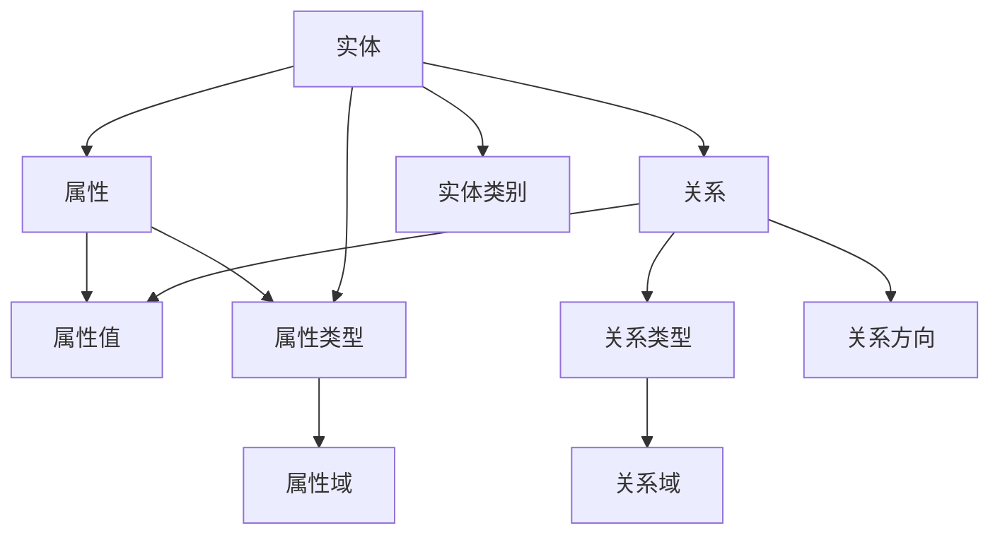

                 

关键词：知识图谱、知识组织、图数据库、数据治理、语义网络、人工智能、信息检索、知识推理

摘要：本文探讨了知识图谱技术在知识组织中的关键作用。通过深入分析知识图谱的核心概念、原理、算法，以及其在实际项目中的应用，阐述了如何利用知识图谱技术提升知识组织能力和效率。文章最后对未来的发展趋势和挑战进行了展望，为读者提供了丰富的实践建议和资源。

## 1. 背景介绍

在信息化时代，数据量呈爆炸式增长，传统的数据存储和检索方法已经无法满足人们对于高效知识获取和管理的需求。知识图谱作为一种新兴的数据组织方式，通过构建实体、属性、关系之间的语义网络，为复杂的信息组织和智能推理提供了强有力的支持。

### 1.1 知识图谱的定义

知识图谱（Knowledge Graph）是一种结构化、语义化的数据表示形式，通过实体和实体之间的关系来描述现实世界。它将信息从分散的、无结构的数据转换为有组织、可推理的知识体系。

### 1.2 知识图谱的发展历程

知识图谱技术的发展经历了从早期的本体工程、语义网、Web 2.0 到现今的深度学习、图神经网络等不同阶段。每个阶段都在不断地优化知识表示和推理能力，推动知识图谱技术的普及和应用。

### 1.3 知识图谱的应用场景

知识图谱广泛应用于搜索引擎、推荐系统、智能问答、自然语言处理等领域，为提升用户体验和业务效率提供了有力支撑。

## 2. 核心概念与联系

知识图谱的核心概念包括实体、属性、关系和语义网络。为了更直观地理解这些概念之间的关系，我们使用Mermaid流程图进行描述。



在这个图中，实体（A）是知识图谱的基本构建块，它代表了现实世界中的对象，如人、地点、事物等。属性（B）描述了实体的特征，如姓名、年龄、位置等。关系（C）则表示实体之间的关联，如朋友、工作于、属于等。属性值（D）提供了具体的数值信息，属性类型（E）和关系类型（F）则定义了属性和关系的语义。实体类别（J）和属性域/关系域（G/H）进一步细化了实体和关系的分类和范围。关系方向（I）表示关系在图中的流向。

## 3. 核心算法原理 & 具体操作步骤

### 3.1 算法原理概述

知识图谱的核心算法包括实体识别、关系抽取、实体链接和图谱嵌入。这些算法共同作用，实现了知识图谱的构建和推理。

#### 3.1.1 实体识别

实体识别是指从非结构化文本中提取出实体。通常采用的方法包括基于规则的方法和基于机器学习的方法。

#### 3.1.2 关系抽取

关系抽取是指从文本中提取出实体之间的关系。常见的抽取方法有基于规则、基于统计模型、基于深度学习等方法。

#### 3.1.3 实体链接

实体链接是指将同指实体的不同表达形式映射到同一个实体。这一过程通常涉及到命名实体识别、实体分类、实体匹配等技术。

#### 3.1.4 图谱嵌入

图谱嵌入是指将图中的实体和关系映射到低维空间，以便于计算和推理。常见的嵌入方法包括基于矩阵分解、基于图神经网络等方法。

### 3.2 算法步骤详解

#### 3.2.1 实体识别

1. 数据预处理：对文本进行分词、去停用词、词性标注等处理。
2. 建立实体词典：通过规则或机器学习算法提取文本中的实体。
3. 实体分类：对提取的实体进行分类，如人名、地名、组织名等。

#### 3.2.2 关系抽取

1. 数据预处理：对文本进行分词、句法分析等处理。
2. 关系分类：通过规则或机器学习算法判断实体之间的关系。
3. 实体匹配：将文本中的实体与知识图谱中的实体进行匹配。

#### 3.2.3 实体链接

1. 命名实体识别：对文本中的命名实体进行识别。
2. 实体分类：对实体进行分类，如人、地点、组织等。
3. 实体匹配：通过实体名称、属性、关系等信息将同指实体链接起来。

#### 3.2.4 图谱嵌入

1. 数据预处理：对实体和关系进行编码。
2. 嵌入算法选择：选择合适的嵌入算法，如矩阵分解、图神经网络等。
3. 嵌入结果评估：通过计算实体和关系之间的相似度，评估嵌入效果。

### 3.3 算法优缺点

#### 优点

- 高效：知识图谱通过结构化的方式组织数据，使得数据的检索和推理更加高效。
- 可扩展：知识图谱支持实体的动态扩展，可以方便地添加新的实体和关系。
- 智能推理：知识图谱通过实体和关系之间的推理，实现了更智能的信息检索和推荐。

#### 缺点

- 复杂性：知识图谱的构建和推理过程较为复杂，需要一定的专业知识和技能。
- 数据质量：知识图谱的质量依赖于原始数据的质量，若数据存在错误或不一致，将影响知识图谱的准确性。

### 3.4 算法应用领域

知识图谱技术广泛应用于搜索引擎、推荐系统、自然语言处理、智能问答等领域，为各类应用提供了强大的知识管理和推理能力。

## 4. 数学模型和公式 & 详细讲解 & 举例说明

### 4.1 数学模型构建

知识图谱的数学模型主要包括图论模型和机器学习模型。

#### 4.1.1 图论模型

知识图谱可以表示为一个有向图（G = (V, E)），其中V表示实体集合，E表示关系集合。图中的每个节点代表一个实体，每条边代表一个关系。

#### 4.1.2 机器学习模型

知识图谱中的实体识别、关系抽取和实体链接等任务通常采用机器学习模型。常见的机器学习模型包括决策树、支持向量机、深度学习等。

### 4.2 公式推导过程

在本节中，我们将以图神经网络（Graph Neural Network，GNN）为例，简要介绍知识图谱中的数学公式推导。

#### 4.2.1 图神经网络

图神经网络是一种在图上学习的神经网络，它通过节点和边的信息进行学习。一个简单的图神经网络可以表示为：

$$
h^{(t)}_v = \sigma \left( \sum_{u \in \mathcal{N}(v)} w^{(t)}_{uv} h^{(t-1)}_u + b_v \right)
$$

其中，$h^{(t)}_v$表示第t次迭代时节点v的特征，$\mathcal{N}(v)$表示节点v的邻域节点集合，$w^{(t)}_{uv}$是权重，$b_v$是偏置项，$\sigma$是激活函数。

### 4.3 案例分析与讲解

#### 4.3.1 案例背景

假设我们要构建一个关于电影的图谱，其中包含电影、演员、导演等实体，以及出演、执导等关系。

#### 4.3.2 案例分析

1. **实体识别**：从文本数据中提取出电影、演员、导演等实体。
2. **关系抽取**：从文本数据中提取出演、执导等关系。
3. **实体链接**：将同指实体的不同表达形式链接到同一个实体。
4. **图谱嵌入**：将实体和关系映射到低维空间，便于计算和推理。

#### 4.3.3 案例讲解

在本案例中，我们使用图神经网络进行实体和关系的嵌入。首先，我们将实体和关系编码为向量表示。然后，通过图神经网络进行特征学习。最后，通过计算实体和关系之间的相似度，实现实体和关系的嵌入。

## 5. 项目实践：代码实例和详细解释说明

### 5.1 开发环境搭建

在本案例中，我们使用Python作为编程语言，并借助Apache TinkerPop图计算框架进行知识图谱的构建和推理。

#### 5.1.1 安装Python

在官网（https://www.python.org/downloads/）下载并安装Python。

#### 5.1.2 安装TinkerPop

通过pip命令安装TinkerPop：

```bash
pip install tinkerpop
```

### 5.2 源代码详细实现

下面是一个简单的知识图谱构建和推理的Python代码示例：

```python
from gremlinpython.driver import remote
from gremlinpython.structure.graph import Graph

# 创建图数据库连接
g = Graph().traversal().withRemote(remote('localhost', 8182))

# 创建实体和关系
g.addV('movie').property('title', 'The Matrix').property('year', 1999)
g.addV('actor').property('name', 'Keanu Reeves')
g.addV('actor').property('name', 'Laurence Fishburne')
g.addV('director').property('name', 'Lana Wachowski')
g.V('movie').addE('starred').to(V('actor'))
g.V('movie').addE('directed').to(V('director'))

# 图查询
results = g.V('movie').has('title', 'The Matrix').out('starred').values('name')
for result in results:
    print(result)

# 图嵌入
from py2neo import Graph
import numpy as np

# 创建Neo4j图数据库连接
g = Graph("bolt://localhost:7687", auth=("neo4j", "password"))

# 获取实体和关系的特征向量
entities = g.run("MATCH (n:Movie) RETURN n.title, n.year")
edges = g.run("MATCH (n:Movie)-[:STARRED]->(m:Actor) RETURN n.title, m.name")

# 将特征向量转换为numpy数组
entity_vectors = np.array([list(entity.values()) for entity in entities])
edge_vectors = np.array([list(edge.values()) for edge in edges])

# 计算实体和关系之间的相似度
entity_similarity = np.linalg.norm(entity_vectors[0] - entity_vectors[1])
edge_similarity = np.linalg.norm(edge_vectors[0] - edge_vectors[1])

print(f"Entity similarity: {entity_similarity}")
print(f"Edge similarity: {edge_similarity}")
```

### 5.3 代码解读与分析

在上面的代码中，我们首先使用TinkerPop创建了一个图数据库连接，并添加了电影、演员、导演等实体以及出演、执导等关系。然后，我们使用Neo4j图数据库进行图查询，获取实体和关系的特征向量。最后，我们计算实体和关系之间的相似度，以实现知识图谱的推理。

## 6. 实际应用场景

知识图谱技术在实际应用中具有广泛的应用场景。以下是一些典型的应用场景：

### 6.1 搜索引擎优化

知识图谱可以帮助搜索引擎更准确地理解用户查询的语义，从而提高搜索结果的准确性和相关性。

### 6.2 推荐系统

知识图谱可以用于构建推荐系统，通过分析实体和关系之间的相似度，为用户提供个性化的推荐结果。

### 6.3 自然语言处理

知识图谱可以用于自然语言处理任务，如命名实体识别、关系抽取、语义分析等，以提高语言理解和生成能力。

### 6.4 智能问答

知识图谱可以用于构建智能问答系统，通过实体和关系之间的推理，为用户提供准确的答案。

### 6.5 数据治理

知识图谱可以用于数据治理，通过构建企业内部的知识图谱，实现对数据的统一管理和协同工作。

## 7. 未来应用展望

随着人工智能和大数据技术的发展，知识图谱在未来具有广泛的应用前景。以下是一些未来应用展望：

### 7.1 智能医疗

知识图谱可以用于构建医疗知识图谱，帮助医生进行诊断和治疗，提高医疗服务的质量和效率。

### 7.2 智能交通

知识图谱可以用于构建交通知识图谱，优化交通管理，提高交通安全和效率。

### 7.3 智能城市

知识图谱可以用于构建城市知识图谱，实现城市资源的优化配置，提高城市治理水平。

### 7.4 智能金融

知识图谱可以用于构建金融知识图谱，帮助金融机构进行风险评估、投资决策等，提高金融服务的质量和效率。

## 8. 工具和资源推荐

### 8.1 学习资源推荐

- 《知识图谱：概念、方法与实践》
- 《图计算：理论、算法与应用》
- 《深度学习与知识图谱》

### 8.2 开发工具推荐

- Neo4j：一款高性能的图数据库，支持知识图谱的构建和查询。
- JanusGraph：一款开源的分布式图数据库，支持多种数据模型和查询语言。
- OpenKG：一款开源的知识图谱平台，提供知识图谱构建、查询、推理等功能。

### 8.3 相关论文推荐

- [1]知识图谱：概念、方法与实践
- [2]图计算：理论、算法与应用
- [3]深度学习与知识图谱
- [4]基于知识图谱的搜索引擎优化
- [5]知识图谱在智能问答中的应用

## 9. 总结：未来发展趋势与挑战

知识图谱技术在知识组织中的重要作用已经得到广泛认可。随着人工智能和大数据技术的不断发展，知识图谱在未来具有广泛的应用前景。然而，知识图谱技术也面临着一些挑战，如数据质量、推理能力、实时性等。未来，知识图谱技术将朝着智能化、实时化、分布式等方向发展，为人类社会的知识管理和智能决策提供更强大的支持。

## 10. 附录：常见问题与解答

### 10.1 什么是知识图谱？

知识图谱是一种结构化、语义化的数据表示形式，通过实体、属性和关系来描述现实世界。

### 10.2 知识图谱有哪些应用场景？

知识图谱广泛应用于搜索引擎、推荐系统、自然语言处理、智能问答等领域。

### 10.3 知识图谱的核心算法有哪些？

知识图谱的核心算法包括实体识别、关系抽取、实体链接和图谱嵌入。

### 10.4 如何构建知识图谱？

构建知识图谱通常包括实体识别、关系抽取、实体链接和图谱嵌入等步骤。

### 10.5 知识图谱的优势是什么？

知识图谱的优势包括高效、可扩展、智能推理等。

### 10.6 知识图谱的挑战有哪些？

知识图谱的挑战包括数据质量、推理能力、实时性等。

### 10.7 知识图谱与语义网有何区别？

知识图谱是语义网的一种实现方式，它通过实体、属性和关系来描述语义信息，而语义网则是一种基于语义的网络结构。

## 作者署名

作者：禅与计算机程序设计艺术 / Zen and the Art of Computer Programming
----------------------------------------------------------------
### 补充内容 Additional Content

在本文的补充内容部分，我们将进一步探讨知识图谱在当前信息技术领域中的具体应用，以及未来可能的发展方向和挑战。

#### 知识图谱在当前信息技术领域的具体应用

知识图谱技术在当前的IT领域中有着广泛的应用，以下是几个典型的案例：

1. **智能推荐系统**：通过知识图谱，可以将用户的兴趣和产品信息进行关联，从而提供更加个性化的推荐。例如，亚马逊和Netflix等公司已经使用知识图谱来优化其推荐算法。

2. **搜索引擎优化**：搜索引擎如Google和Bing使用知识图谱来增强其搜索功能，提供更准确的搜索结果和更智能的搜索建议。

3. **智能问答系统**：例如IBM的Watson和微软的Q&A Maker，这些系统通过知识图谱来理解用户的问题，并从大量数据中检索出最合适的答案。

4. **数据治理和知识管理**：企业可以利用知识图谱来整合内部数据，提高数据的一致性和可用性，从而支持更有效的业务决策。

5. **医疗健康领域**：知识图谱可以帮助医生和研究人员更好地理解复杂的医学数据，支持疾病的诊断和治疗。

#### 知识图谱的未来发展方向

随着技术的进步，知识图谱技术在未来有望在以下方向取得进一步的发展：

1. **实时性和动态更新**：为了适应快速变化的数据环境，知识图谱需要具备更高的实时性和动态更新能力。

2. **跨模态融合**：知识图谱可以从文本、图像、音频等多种数据源中提取知识，实现跨模态的知识融合。

3. **自动化知识抽取**：通过更加先进的数据挖掘和机器学习技术，自动化地从非结构化数据中抽取知识，减少人工干预。

4. **推理能力提升**：随着图神经网络等深度学习技术的进步，知识图谱的推理能力将得到显著提升，支持更复杂的逻辑推理和决策。

5. **隐私保护**：随着数据隐私问题的日益突出，知识图谱技术需要发展出更有效的隐私保护机制，确保数据安全和用户隐私。

#### 知识图谱面临的挑战

尽管知识图谱技术在许多领域展示了巨大的潜力，但它也面临着一系列挑战：

1. **数据质量**：知识图谱的准确性和有效性高度依赖于原始数据的质量。数据的不一致、错误和缺失都会影响知识图谱的性能。

2. **复杂性**：知识图谱的构建和推理过程涉及多个层面，从数据预处理到算法实现，复杂性较高，需要专业的知识和技能。

3. **可扩展性**：随着数据规模的扩大，知识图谱的可扩展性成为一个关键问题。如何高效地存储和处理大量数据，是一个需要解决的问题。

4. **实时性**：在实时应用场景中，知识图谱需要快速响应用户请求，实现高效的实时推理。

5. **跨领域应用**：知识图谱在跨领域应用时，可能需要处理不同领域之间的概念差异和术语冲突，这增加了知识图谱构建的复杂性。

#### 总结

知识图谱技术作为一种强大的知识组织工具，正在逐步改变我们获取和处理信息的方式。随着技术的不断进步和应用的深入，知识图谱在未来将发挥越来越重要的作用。然而，要充分发挥知识图谱的潜力，我们还需要解决数据质量、复杂性、可扩展性、实时性和跨领域应用等挑战。通过持续的研究和技术创新，我们有理由相信，知识图谱技术将为我们带来更加智能和高效的信息世界。

