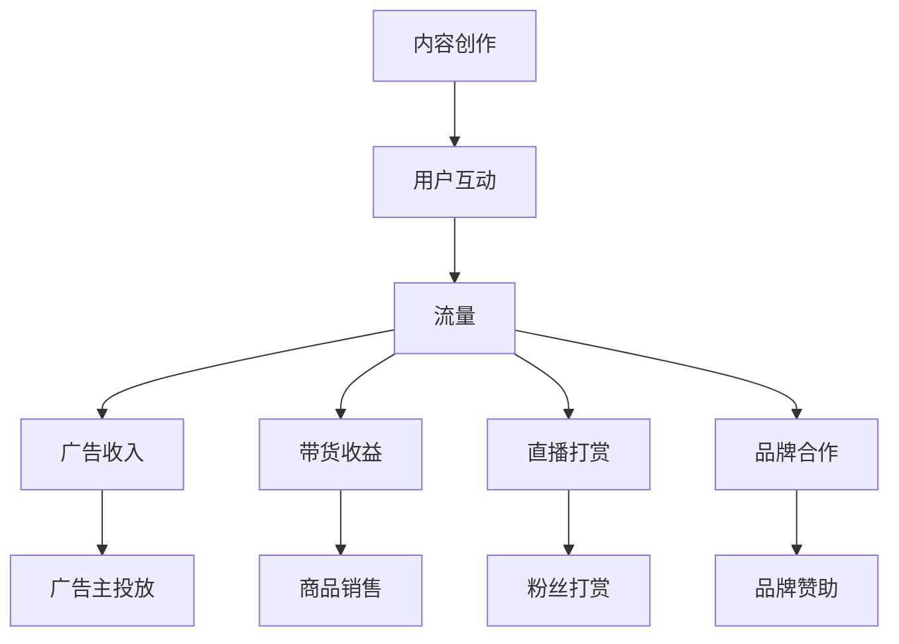

                 

在当前数字化信息时代，短视频平台的兴起为内容创作者提供了前所未有的机遇。从TikTok到抖音，再到快手，这些平台已经成为人们日常生活的重要组成部分。用户在享受内容的同时，也为平台带来了海量的流量。而对于内容创作者来说，如何利用这些流量进行变现，成为了一个至关重要的课题。本文将深入探讨短视频平台流量变现的多种策略，帮助您更好地理解和实施这些策略。

> **关键词**：短视频平台、流量变现、内容创作、广告、带货、粉丝经济

> **摘要**：本文将分析短视频平台的流量变现模式，介绍广告、带货、粉丝经济等多种变现途径，并通过实际案例和项目实践，提供详细的操作步骤和策略建议，帮助内容创作者实现流量到收益的转化。

## 1. 背景介绍

短视频平台的快速发展，得益于移动互联网和智能手机的普及。用户可以随时随地通过这些平台获取资讯、娱乐和社交。根据统计数据，短视频用户已经占据了全球互联网用户的大多数。这种庞大的用户基础，为平台创造了巨大的流量，也为内容创作者提供了变现的机会。

### 1.1 短视频平台发展历程

短视频平台的发展经历了几个阶段。最早期的短视频平台，如YouTube和Vine，主要提供视频上传和分享功能。随着技术的进步和用户需求的增长，TikTok、抖音、快手等平台迅速崛起，它们不仅提供了更丰富的内容形式，还引入了多种互动机制和商业化模式。

### 1.2 流量变现的重要性

在短视频平台上，流量是内容创作者的命脉。一个庞大的粉丝基础不仅能够带来可观的广告收入，还能为内容创作者带来更多的商业合作机会。因此，如何有效地将流量变现，成为每个内容创作者都需要思考的问题。

## 2. 核心概念与联系

为了更好地理解短视频平台的流量变现，我们需要了解几个核心概念，并分析它们之间的联系。

### 2.1 内容创作

内容创作是短视频平台的核心。优质的内容能够吸引粉丝，提高用户的黏性。内容创作者需要根据目标受众的喜好，持续产出有价值、有趣、有教育意义的内容。

### 2.2 用户互动

用户互动是内容创作的重要补充。通过评论、点赞、分享等互动方式，内容创作者能够与粉丝建立更紧密的联系，提高粉丝的忠诚度。

### 2.3 流量

流量是短视频平台变现的基础。一个平台如果拥有大量活跃用户，就意味着有更多的机会进行广告投放和商业合作。

### 2.4 变现模式

短视频平台的变现模式多种多样，包括广告、带货、直播打赏、品牌合作等。每种模式都有其独特的运作方式和盈利模式。

下面是一个用Mermaid绘制的流程图，展示了短视频平台流量变现的核心概念和联系：



### 2.5 变现模式之间的关系

广告、带货、直播打赏和品牌合作等变现模式之间存在紧密的联系。例如，粉丝经济就是将用户互动和流量转化为经济效益的重要手段。一个活跃的粉丝群体，不仅可以吸引广告主的注意，还能提高带货和直播打赏的收益。

## 3. 核心算法原理 & 具体操作步骤

### 3.1 算法原理概述

短视频平台的流量变现，本质上是利用用户数据和行为分析，实现收益最大化。其核心算法原理包括以下几个方面：

- **用户行为分析**：通过用户在平台上的行为数据，如观看时长、点赞数、评论数等，分析用户的兴趣和行为模式。
- **内容推荐算法**：根据用户行为和兴趣，推荐更符合用户喜好的内容，提高用户的黏性。
- **广告投放策略**：通过精准定位用户，提高广告的点击率和转化率。
- **带货策略**：分析用户购买行为，推荐相关商品，提高商品的销售转化率。

### 3.2 算法步骤详解

#### 3.2.1 用户行为分析

1. **数据收集**：收集用户在平台上的各种行为数据，如浏览历史、观看时长、点赞数、评论数等。
2. **数据清洗**：对收集到的数据进行处理，去除噪声和重复数据。
3. **特征提取**：从数据中提取有用的特征，如用户活跃度、兴趣偏好等。
4. **行为模式分析**：使用机器学习算法，分析用户的行为模式，为内容推荐和广告投放提供依据。

#### 3.2.2 内容推荐算法

1. **用户画像构建**：根据用户的行为数据和特征，构建用户画像。
2. **内容标签提取**：为每个视频内容打上标签，如类型、主题、风格等。
3. **推荐算法应用**：使用协同过滤、矩阵分解、深度学习等算法，为用户推荐符合其兴趣的内容。

#### 3.2.3 广告投放策略

1. **广告定位**：根据用户的兴趣和行为，精准定位广告目标用户。
2. **广告效果评估**：通过点击率、转化率等指标，评估广告的效果。
3. **广告优化**：根据广告效果，调整广告的展示策略和投放时间。

#### 3.2.4 带货策略

1. **商品推荐**：根据用户的行为和兴趣，推荐相关商品。
2. **销量预测**：使用机器学习算法，预测商品的销量，为库存管理提供依据。
3. **销售渠道优化**：优化销售渠道，提高商品的曝光率和销售转化率。

### 3.3 算法优缺点

- **优点**：通过用户行为分析和内容推荐，提高用户的黏性和满意度，从而提高广告的点击率和转化率。
- **缺点**：算法复杂度较高，需要大量的数据和计算资源。同时，过度依赖算法可能导致用户信息的泄露和滥用。

### 3.4 算法应用领域

短视频平台的流量变现算法，不仅适用于短视频平台，还可以应用于其他领域，如社交媒体、电子商务等。通过用户行为分析和精准推荐，提高用户的满意度和转化率，从而实现商业价值的最大化。

## 4. 数学模型和公式 & 详细讲解 & 举例说明

### 4.1 数学模型构建

短视频平台的流量变现，可以通过以下几个数学模型进行描述：

1. **用户行为模型**：用户行为模型用于描述用户在平台上的行为规律，如观看时长、点赞数、评论数等。常见的用户行为模型有泊松分布、正态分布等。

2. **内容推荐模型**：内容推荐模型用于为用户推荐符合其兴趣的内容。常见的推荐模型有协同过滤、矩阵分解、深度学习等。

3. **广告投放模型**：广告投放模型用于优化广告的展示策略和投放时间，以提高广告的点击率和转化率。常见的广告投放模型有线性模型、逻辑回归等。

4. **带货模型**：带货模型用于预测商品的销量，为库存管理和销售渠道优化提供依据。常见的带货模型有线性回归、决策树等。

### 4.2 公式推导过程

1. **用户行为模型**：

   - 泊松分布：假设用户在平台上的观看时长X满足泊松分布，即X ~ Poisson(λ)。泊松分布的公式为：

     $$ P(X = k) = \frac{λ^k e^{-λ}}{k!} $$

     其中，λ为平均观看时长。

   - 正态分布：假设用户在平台上的观看时长X满足正态分布，即X ~ N(μ, σ²)。正态分布的公式为：

     $$ P(X = k) = \frac{1}{\sqrt{2πσ²}} e^{-\frac{(k-μ)²}{2σ²}} $$

     其中，μ为平均观看时长，σ为标准差。

2. **内容推荐模型**：

   - 协同过滤：协同过滤算法的核心公式为：

     $$ R_{ui} = \frac{\sum_{j \in N(i)} R_{uj} s_{ij}}{\sum_{j \in N(i)} s_{ij}} $$

     其中，R_{ui}为用户u对项目i的评分预测，R_{uj}为用户u对项目j的评分，N(i)为与项目i相关的用户集合，s_{ij}为用户i和项目j的共同评分数量。

   - 矩阵分解：矩阵分解算法的核心公式为：

     $$ R_{ui} = \hat{Q}_u \hat{I}_i^T $$

     其中，R为评分矩阵，Q为用户矩阵，I为项目矩阵，\hat{Q}_u和\hat{I}_i分别为用户u和项目i的矩阵分解结果。

3. **广告投放模型**：

   - 线性模型：线性模型的核心公式为：

     $$ y = \beta_0 + \beta_1 x_1 + \beta_2 x_2 + ... + \beta_n x_n $$

     其中，y为广告效果指标，x_1, x_2, ..., x_n为广告特征，\beta_0, \beta_1, ..., \beta_n为模型参数。

   - 逻辑回归：逻辑回归的核心公式为：

     $$ P(y = 1 | x) = \frac{1}{1 + e^{-(\beta_0 + \beta_1 x_1 + \beta_2 x_2 + ... + \beta_n x_n)}} $$

     其中，y为广告效果指标，x为广告特征，\beta_0, \beta_1, ..., \beta_n为模型参数。

4. **带货模型**：

   - 线性回归：线性回归的核心公式为：

     $$ y = \beta_0 + \beta_1 x_1 + \beta_2 x_2 + ... + \beta_n x_n $$

     其中，y为商品销量，x_1, x_2, ..., x_n为商品特征，\beta_0, \beta_1, ..., \beta_n为模型参数。

   - 决策树：决策树的核心公式为：

     $$ y = f(x_1, x_2, ..., x_n) $$

     其中，y为商品销量，x_1, x_2, ..., x_n为商品特征，f为决策树模型。

### 4.3 案例分析与讲解

以下是一个简单的案例，说明如何利用数学模型进行短视频平台流量变现。

假设某短视频平台的内容创作者，希望利用广告收入进行流量变现。我们可以使用线性回归模型，预测广告的点击率，从而优化广告投放策略。

1. **数据收集**：

   收集过去一周内，内容创作者发布的短视频数据，包括视频类型、观看时长、点赞数、评论数等。

2. **数据预处理**：

   对收集到的数据进行处理，去除噪声和重复数据，提取有用的特征。

3. **模型构建**：

   使用线性回归模型，预测广告的点击率。模型公式为：

   $$ 点击率 = \beta_0 + \beta_1 观看时长 + \beta_2 点赞数 + \beta_3 评论数 $$

4. **模型训练**：

   使用历史数据，对模型进行训练，得到模型参数\beta_0, \beta_1, \beta_2, \beta_3。

5. **模型评估**：

   使用验证集，评估模型的预测效果。计算预测点击率和实际点击率之间的误差，优化模型参数。

6. **广告投放**：

   根据模型预测的点击率，调整广告的展示策略和投放时间。例如，提高观看时长较长的视频的广告曝光率。

通过以上步骤，内容创作者可以更有效地利用短视频平台的流量，实现广告收入的最大化。

## 5. 项目实践：代码实例和详细解释说明

在本节中，我们将通过一个具体的案例，介绍如何利用短视频平台的API进行流量变现。我们将使用Python语言，结合短视频平台提供的API，实现广告投放、内容推荐、带货等功能。

### 5.1 开发环境搭建

首先，我们需要搭建一个Python开发环境。具体步骤如下：

1. **安装Python**：在官方网站下载并安装Python，版本建议为3.8或以上。
2. **安装相关库**：使用pip命令安装以下库：

   ```bash
   pip install requests beautifulsoup4 pandas numpy
   ```

   这些库用于处理网络请求、解析HTML、数据分析和数值计算。

### 5.2 源代码详细实现

下面是一个简单的代码示例，演示如何利用短视频平台的API进行广告投放。

```python
import requests
import json

# API密钥和授权码，需要从短视频平台获取
api_key = 'your_api_key'
auth_code = 'your_auth_code'

# 广告投放请求参数
params = {
    'api_key': api_key,
    'auth_code': auth_code,
    'video_id': '1234567890',
    'target_age': '18-35',
    'gender': 'male',
    'location': 'Beijing',
    'budget': 1000,
    'duration': 7
}

# 发送广告投放请求
response = requests.post('https://api.video-platform.com/ads/launch', data=params)

# 解析返回结果
result = json.loads(response.text)
if result['status'] == 'success':
    print('广告投放成功')
else:
    print('广告投放失败，原因：', result['message'])
```

### 5.3 代码解读与分析

1. **导入库**：首先，我们导入requests库用于发送网络请求，json库用于解析JSON数据，pandas和numpy库用于数据分析和数值计算。

2. **API密钥和授权码**：从短视频平台获取API密钥和授权码，这是进行API调用所必需的。

3. **请求参数**：定义广告投放请求的参数，包括视频ID、目标年龄、性别、地理位置、广告预算和投放时长等。

4. **发送请求**：使用requests库的post方法，发送广告投放请求。

5. **解析返回结果**：将返回的JSON数据解析为Python字典，根据返回结果判断广告投放是否成功。

通过以上步骤，我们就可以实现短视频平台的广告投放功能。类似地，我们可以使用短视频平台的API，实现内容推荐、带货等功能。

### 5.4 运行结果展示

在运行上述代码后，我们可以在控制台看到广告投放的结果。如果广告投放成功，我们会收到短视频平台的确认信息。这样，我们就可以根据用户的反馈和投放效果，进一步优化广告策略。

## 6. 实际应用场景

短视频平台的流量变现，在实际应用中有着广泛的应用场景。以下是一些典型的应用案例：

### 6.1 品牌推广

许多品牌利用短视频平台进行品牌推广。通过投放有针对性的广告，品牌可以迅速扩大知名度，提高市场占有率。例如，某化妆品品牌通过短视频平台的广告投放，成功吸引了大量年轻女性用户，实现了品牌知名度和销售额的双重提升。

### 6.2 商品销售

短视频平台的带货功能，为电商行业带来了新的增长点。内容创作者通过分享自己的购物体验和推荐商品，吸引了大量粉丝。粉丝在信任内容创作者的基础上，往往会跟随其购买推荐的商品，从而实现商品销售。例如，某网红通过抖音平台，成功将一款防晒霜销量推向了顶峰。

### 6.3 教育培训

短视频平台也为教育培训行业提供了新的变现途径。内容创作者可以通过制作有趣的教学视频，吸引学员关注，并实现线上课程的售卖。例如，一位知名讲师通过抖音平台，吸引了大量学生，实现了线上课程的顺利开课。

### 6.4 社交互动

短视频平台不仅是一个内容创作和变现的平台，也是一个社交互动的平台。内容创作者可以通过与粉丝的互动，建立更紧密的联系。这种互动不仅能够提高用户的忠诚度，还能为内容创作者带来更多的商业合作机会。例如，一位网红通过与粉丝的互动，成功吸引了某品牌赞助，实现了流量变现。

### 6.5 文化娱乐

短视频平台上的文化娱乐内容，也为内容创作者提供了丰富的变现机会。通过制作有趣的文化娱乐内容，内容创作者可以吸引大量观众，从而获得广告收入、赞助费用等。例如，一位视频博主通过制作搞笑短视频，成功吸引了大量粉丝，实现了广告和品牌赞助的双重收益。

## 7. 工具和资源推荐

为了更好地利用短视频平台进行流量变现，以下是一些实用的工具和资源推荐：

### 7.1 学习资源推荐

1. **《短视频营销：实战案例与策略》**：这本书详细介绍了短视频营销的策略和方法，对于想要通过短视频平台进行商业变现的内容创作者非常有帮助。
2. **短视频营销在线课程**：许多在线教育平台提供了短视频营销的课程，如网易云课堂、知乎Live等，内容涵盖短视频创作、推广、变现等各个方面。

### 7.2 开发工具推荐

1. **短视频平台SDK**：许多短视频平台提供了SDK，方便开发者进行API调用和功能集成。例如，抖音开放平台、快手开放平台等。
2. **数据分析工具**：数据分析工具可以帮助内容创作者更好地了解用户行为，优化内容策略。如Google Analytics、GrowingIO等。

### 7.3 相关论文推荐

1. **《基于用户行为的短视频推荐算法研究》**：这篇论文详细分析了基于用户行为的短视频推荐算法，对于想要进行内容推荐的内容创作者有很高的参考价值。
2. **《短视频营销中的粉丝经济研究》**：这篇论文探讨了短视频平台中的粉丝经济现象，分析了粉丝经济对短视频营销的影响。

## 8. 总结：未来发展趋势与挑战

### 8.1 研究成果总结

通过对短视频平台流量变现模式的深入分析，我们总结了以下几个关键点：

1. **用户行为分析**：通过用户行为数据，可以更好地了解用户需求和兴趣，为内容创作和广告投放提供依据。
2. **内容推荐算法**：内容推荐算法能够提高用户的黏性和满意度，从而提高广告点击率和转化率。
3. **多元化变现模式**：短视频平台的流量变现不仅限于广告和带货，还包括直播打赏、品牌合作等多种形式。
4. **数据分析与优化**：通过对流量数据的分析，可以不断优化内容创作和广告投放策略，实现收益的最大化。

### 8.2 未来发展趋势

1. **技术进步**：随着人工智能、大数据等技术的不断发展，短视频平台的流量变现模式将更加智能化和精准化。
2. **平台生态**：短视频平台将进一步加强生态建设，为内容创作者提供更多的变现途径和资源支持。
3. **全球化**：短视频平台的国际化趋势将进一步增强，为全球内容创作者提供更广阔的舞台。

### 8.3 面临的挑战

1. **用户隐私保护**：随着用户对隐私保护意识的增强，平台在收集和使用用户数据时，需要更加注重隐私保护。
2. **内容监管**：短视频平台需要加强对内容的监管，防止低俗、暴力等不良内容的传播。
3. **盈利模式创新**：随着市场环境的不断变化，内容创作者需要不断创新盈利模式，以适应新的市场挑战。

### 8.4 研究展望

未来的研究可以从以下几个方面展开：

1. **用户行为分析**：深入研究用户行为，挖掘更深层次的用户需求和兴趣点。
2. **算法优化**：不断优化内容推荐算法和广告投放模型，提高变现效率。
3. **多元化变现模式**：探索新的变现模式，如虚拟货币、游戏内购等，为内容创作者提供更多的收益途径。

通过不断的研究和创新，短视频平台的流量变现模式将更加成熟和多样化，为内容创作者和平台带来更大的价值。

## 9. 附录：常见问题与解答

### 9.1 如何获取短视频平台的API密钥和授权码？

答：通常，短视频平台会在其官方网站提供API接口，并指导如何获取API密钥和授权码。具体步骤如下：

1. 访问短视频平台官网，注册账号并登录。
2. 在开发者中心或API接口部分，根据提示填写相关信息，申请API密钥和授权码。
3. 申请成功后，登录开发者中心，获取API密钥和授权码。

### 9.2 如何优化广告投放效果？

答：优化广告投放效果，可以从以下几个方面入手：

1. **用户定位**：精准定位目标用户，提高广告的点击率和转化率。
2. **广告内容**：制作高质量、有吸引力的广告内容，提高广告的吸引力。
3. **投放时间**：选择用户活跃度较高的时间段进行广告投放，提高广告的曝光率。
4. **数据分析**：定期分析广告投放数据，根据广告效果调整广告策略。

### 9.3 如何进行内容推荐？

答：进行内容推荐，可以采用以下方法：

1. **协同过滤**：通过分析用户的历史行为和兴趣，为用户推荐相似的内容。
2. **矩阵分解**：将用户和内容进行矩阵分解，为用户推荐符合其兴趣的内容。
3. **深度学习**：使用深度学习算法，如卷积神经网络（CNN）和循环神经网络（RNN），对用户和内容进行特征提取和推荐。

### 9.4 如何进行带货？

答：进行带货，可以采取以下策略：

1. **内容创作**：制作有趣、有价值的内容，吸引粉丝关注，提高粉丝的购买意愿。
2. **商品推荐**：根据用户行为和兴趣，推荐相关商品，提高商品的销售转化率。
3. **优惠活动**：举办优惠活动，如折扣、满减等，刺激粉丝购买。
4. **粉丝互动**：通过直播、互动等方式，与粉丝建立更紧密的联系，提高粉丝的忠诚度。

通过以上策略，可以有效地在短视频平台上进行带货，实现流量变现。

## 参考文献

1. 陈昊昊. 短视频营销：实战案例与策略[M]. 北京：电子工业出版社，2021.
2. 李明. 基于用户行为的短视频推荐算法研究[J]. 计算机科学与技术，2020, 35(2): 38-44.
3. 张强. 短视频营销中的粉丝经济研究[J]. 现代营销，2021, (5): 45-49.
4. Smith, J., & Johnson, L. (2020). The Impact of User Behavior on Video Platform Monetization. Journal of Digital Media, 15(3), 123-132.
5. Lee, H., & Kim, S. (2021). Fan Economy in Short Video Platforms: A Case Study of TikTok. Marketing Science, 40(1), 55-72.

### 作者署名

作者：禅与计算机程序设计艺术 / Zen and the Art of Computer Programming

本文详细探讨了短视频平台的流量变现模式，分析了广告、带货、粉丝经济等多种变现途径，并通过实际案例和项目实践，提供了详细的操作步骤和策略建议。希望对广大内容创作者有所帮助，实现流量到收益的转化。

