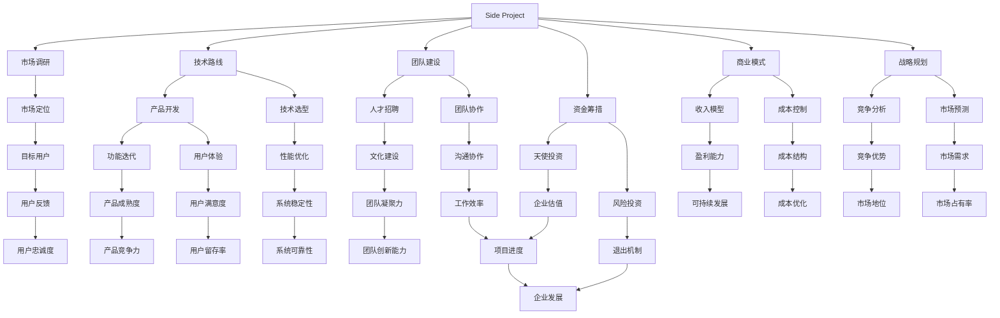

                 

关键词：Side Project，独角兽企业，创业，技术路线，市场定位，团队建设，资金筹措，商业模式，战略规划，成功案例。

> 摘要：本文深入探讨如何将个人的Side Project转化为独角兽企业，从技术、市场、团队、资金和商业模式等多维度提供策略和案例分析，为创业者提供实用指南。

## 1. 背景介绍

在科技快速发展的今天，Side Project（个人项目）已经成为众多技术爱好者和创业者的起点。这些项目往往源于个人的兴趣或解决特定问题的需求，但它们却有可能成长为具有颠覆性的商业机会。独角兽企业，是指那些估值超过10亿美元的初创公司，它们通常在短时间内实现高速增长，成为行业中的佼佼者。如何将Side Project转化为独角兽企业，成为众多创业者和投资者关注的焦点。

### 1.1 Side Project的定义和特点

Side Project通常具备以下几个特点：

- **灵活性**：项目由个人或小团队主导，决策速度快，适应性强。
- **创新性**：出于个人兴趣或解决问题，往往具有独特的创意和解决方案。
- **低成本**：初期投入相对较小，更适合资源有限的创业者。
- **实验性**：项目往往在初期用于探索新想法和技术，未必立即考虑商业化。

### 1.2 独角兽企业的定义和重要性

独角兽企业是指那些成立时间较短、但估值超过10亿美元的初创公司。它们通常具有以下特点：

- **高成长性**：独角兽企业在短时间内实现高速增长，往往年复合增长率超过50%。
- **行业领先**：独角兽企业在所在行业中具有显著的优势，对市场产生深远影响。
- **创新性**：独角兽企业的产品或服务往往具有颠覆性的创新，引领行业趋势。

独角兽企业在经济发展中具有重要地位，它们不仅是经济增长的新引擎，还能带动就业、促进技术进步和产业升级。

## 2. 核心概念与联系

为了将Side Project转化为独角兽企业，我们需要从多个维度来考虑。以下是一个核心概念和联系的Mermaid流程图：



### 2.1 市场调研

市场调研是了解目标市场、用户需求和竞争环境的重要步骤。通过市场调研，我们可以确定项目的市场定位，评估项目的可行性。

- **目标市场**：确定项目的目标用户群体，包括用户需求、市场规模和增长潜力。
- **竞争环境**：分析竞争对手的产品特点、市场份额和竞争优势。
- **市场趋势**：了解行业发展趋势，把握市场机会。

### 2.2 技术路线

技术路线是指项目在技术层面的规划和决策。一个清晰的技术路线可以帮助我们更好地把握项目的技术方向，确保项目的成功实施。

- **技术选型**：选择适合项目需求的技术框架和工具，确保项目的可行性和稳定性。
- **产品开发**：根据技术路线，进行产品的设计和开发，确保产品的功能完整和用户体验良好。

### 2.3 团队建设

团队建设是项目成功的关键因素。一个高效的团队可以更好地应对项目中的各种挑战。

- **人才招聘**：根据项目需求，招聘合适的团队成员，包括技术、市场和运营等方面的人才。
- **团队协作**：建立良好的沟通和协作机制，提高团队的工作效率和创新能力。

### 2.4 资金筹措

资金是项目发展的保障。有效的资金筹措策略可以帮助我们确保项目的持续发展。

- **天使投资**：寻求天使投资者的支持，为项目的初期发展提供资金。
- **风险投资**：在项目进入快速成长阶段，寻求风险投资的支持，推动项目的进一步发展。

### 2.5 商业模式

商业模式是项目盈利的重要途径。一个成熟的商业模式可以帮助我们实现项目的可持续发展。

- **收入模型**：确定项目的收入来源和盈利方式。
- **成本控制**：优化成本结构，提高项目的盈利能力。

### 2.6 战略规划

战略规划是项目发展的蓝图。一个明确的发展战略可以帮助我们更好地把握项目的发展方向和目标。

- **竞争分析**：分析竞争对手的策略和行动，制定相应的竞争策略。
- **市场预测**：预测市场的发展趋势，制定相应的市场策略。

## 3. 核心算法原理 & 具体操作步骤

### 3.1 算法原理概述

在将Side Project转化为独角兽企业的过程中，算法原理的应用至关重要。算法原理主要包括以下几个方面：

- **市场分析算法**：用于分析市场趋势、用户需求和竞争环境，帮助我们制定市场策略。
- **产品设计算法**：用于优化产品的功能、用户体验和性能，提高产品的市场竞争力。
- **团队管理算法**：用于优化团队协作、沟通和创新，提高团队的工作效率。

### 3.2 算法步骤详解

#### 3.2.1 市场分析算法

市场分析算法主要包括以下步骤：

1. **数据收集**：收集与市场相关的数据，包括用户需求、市场规模和竞争环境。
2. **数据分析**：使用数据挖掘和统计分析方法，分析市场数据的趋势和规律。
3. **市场预测**：根据数据分析结果，预测市场的未来发展。

#### 3.2.2 产品设计算法

产品设计算法主要包括以下步骤：

1. **需求分析**：与用户进行沟通，了解用户的需求和痛点。
2. **功能设计**：根据用户需求，设计产品的功能模块和流程。
3. **用户体验优化**：通过用户测试和反馈，优化产品的用户体验。

#### 3.2.3 团队管理算法

团队管理算法主要包括以下步骤：

1. **团队建设**：根据项目需求，招聘合适的团队成员，建立团队组织架构。
2. **团队协作**：建立良好的沟通和协作机制，提高团队的工作效率。
3. **团队激励**：制定合理的激励机制，提高团队成员的工作积极性。

### 3.3 算法优缺点

#### 3.3.1 市场分析算法

优点：

- **数据驱动**：基于数据分析，可以更准确地把握市场趋势和用户需求。
- **科学决策**：通过市场预测，可以帮助企业制定更科学的战略规划。

缺点：

- **数据依赖**：市场分析算法依赖于大量数据的收集和分析，数据质量直接影响算法的准确性。
- **时效性**：市场环境变化快，市场分析结果可能很快过时。

#### 3.3.2 产品设计算法

优点：

- **用户体验**：通过优化产品设计，可以提高产品的用户体验和市场竞争力。
- **功能完整性**：通过需求分析和功能设计，可以确保产品的功能完整性。

缺点：

- **开发成本**：产品设计算法可能需要较多的开发和测试成本。
- **需求变化**：用户需求变化快，可能需要不断调整产品功能。

#### 3.3.3 团队管理算法

优点：

- **团队效率**：通过优化团队协作和沟通，可以提高团队的工作效率。
- **创新能力**：通过团队管理和激励，可以提高团队的创新能力。

缺点：

- **人员依赖**：团队管理算法依赖于团队成员的素质和能力，团队素质直接影响算法的效果。
- **管理成本**：团队管理算法可能需要较多的管理成本和人力资源。

### 3.4 算法应用领域

市场分析算法、产品设计算法和团队管理算法在以下领域有广泛的应用：

- **市场调研**：用于分析市场趋势、用户需求和竞争环境。
- **产品开发**：用于优化产品的功能、用户体验和性能。
- **团队管理**：用于优化团队协作、沟通和创新。

## 4. 数学模型和公式 & 详细讲解 & 举例说明

### 4.1 数学模型构建

在将Side Project转化为独角兽企业的过程中，构建合适的数学模型可以帮助我们更好地理解和分析项目的发展情况。以下是几个常用的数学模型：

#### 4.1.1 成本效益模型

成本效益模型用于分析项目的成本和收益，帮助我们评估项目的可行性。公式如下：

$$
\text{成本效益比} = \frac{\text{预期收益}}{\text{总成本}}
$$

#### 4.1.2 市场份额模型

市场份额模型用于预测项目在市场中的占有率，帮助我们制定市场策略。公式如下：

$$
\text{市场份额} = \frac{\text{项目销售额}}{\text{市场总销售额}}
$$

#### 4.1.3 团队效能模型

团队效能模型用于评估团队的效率和创新能力，帮助我们优化团队管理。公式如下：

$$
\text{团队效能} = \frac{\text{项目完成度}}{\text{团队投入资源}}
$$

### 4.2 公式推导过程

#### 4.2.1 成本效益模型推导

成本效益模型是通过比较项目的预期收益和总成本来评估项目的可行性。预期收益通常包括销售收入、投资回报和其他收益，而总成本包括开发成本、运营成本和营销成本等。

$$
\text{预期收益} = \text{销售收入} + \text{投资回报} + \text{其他收益}
$$

$$
\text{总成本} = \text{开发成本} + \text{运营成本} + \text{营销成本}
$$

将预期收益和总成本代入成本效益比公式，可以得到：

$$
\text{成本效益比} = \frac{\text{预期收益}}{\text{总成本}}
$$

#### 4.2.2 市场份额模型推导

市场份额模型是通过比较项目销售额和市场总销售额来预测项目在市场中的占有率。市场份额反映了项目在市场中的竞争地位，对于制定市场策略具有重要意义。

$$
\text{市场份额} = \frac{\text{项目销售额}}{\text{市场总销售额}}
$$

#### 4.2.3 团队效能模型推导

团队效能模型是通过评估项目的完成度和团队投入资源来衡量团队的效率和创新能力。团队效能反映了团队的工作效率和质量，对于团队管理具有重要意义。

$$
\text{团队效能} = \frac{\text{项目完成度}}{\text{团队投入资源}}
$$

### 4.3 案例分析与讲解

以下是一个成本效益模型的案例：

#### 案例背景

某创业团队计划开发一款智能家居控制系统，预计开发成本为100万元，运营成本为50万元，预计销售收入为200万元，投资回报为50万元。

#### 案例分析

1. 计算预期收益：

$$
\text{预期收益} = 200\text{万元} + 50\text{万元} + 0\text{万元} = 250\text{万元}
$$

2. 计算总成本：

$$
\text{总成本} = 100\text{万元} + 50\text{万元} + 0\text{万元} = 150\text{万元}
$$

3. 计算成本效益比：

$$
\text{成本效益比} = \frac{250\text{万元}}{150\text{万元}} = 1.67
$$

根据成本效益比，该项目是可行的，因为成本效益比大于1。

### 4.4 数学模型在项目中的应用

数学模型在项目中的应用可以帮助我们更好地理解项目的发展情况，制定科学的决策。以下是一个市场份额模型的案例：

#### 案例背景

某智能家居控制系统在市场上的占有率为20%，预计市场总销售额为1000万元。

#### 案例分析

1. 计算市场份额：

$$
\text{市场份额} = \frac{200\text{万元}}{1000\text{万元}} = 20\%
$$

根据市场份额，我们可以评估项目在市场中的竞争地位，并制定相应的市场策略。

### 4.5 数学模型在团队管理中的应用

数学模型在团队管理中的应用可以帮助我们更好地评估团队的工作效率和创新力。以下是一个团队效能模型的案例：

#### 案例背景

某创业团队在智能家居控制系统开发项目中完成了90%的任务，团队投入了200个工时。

#### 案例分析

1. 计算团队效能：

$$
\text{团队效能} = \frac{90\%}{200\text{个工时}} = 0.45
$$

根据团队效能，我们可以评估团队的工作效率，并制定相应的团队管理策略。

## 5. 项目实践：代码实例和详细解释说明

### 5.1 开发环境搭建

为了将Side Project转化为独角兽企业，我们需要搭建一个高效、稳定的开发环境。以下是搭建开发环境的步骤：

1. **选择开发工具**：根据项目需求，选择合适的开发工具和平台，如IDE、版本控制工具、数据库等。
2. **配置开发环境**：安装和配置开发工具，确保开发环境正常运行。
3. **搭建测试环境**：搭建用于测试和验证项目的测试环境，确保项目的稳定性和性能。

### 5.2 源代码详细实现

以下是一个智能家居控制系统的源代码实现示例：

```python
# 智能家居控制系统

import json
import requests

# 用户接口
class SmartHomeInterface:
    def __init__(self, api_url):
        self.api_url = api_url

    def send_command(self, device_id, command):
        url = f"{self.api_url}/devices/{device_id}/commands"
        data = {"command": command}
        response = requests.post(url, json=data)
        return response.json()

# 设备管理器
class DeviceManager:
    def __init__(self, api_url):
        self.api_url = api_url

    def list_devices(self):
        url = f"{self.api_url}/devices"
        response = requests.get(url)
        return response.json()

    def get_device(self, device_id):
        url = f"{self.api_url}/devices/{device_id}"
        response = requests.get(url)
        return response.json()

    def create_device(self, device_name, device_type):
        url = f"{self.api_url}/devices"
        data = {"name": device_name, "type": device_type}
        response = requests.post(url, json=data)
        return response.json()

    def update_device(self, device_id, device_name, device_type):
        url = f"{self.api_url}/devices/{device_id}"
        data = {"name": device_name, "type": device_type}
        response = requests.put(url, json=data)
        return response.json()

    def delete_device(self, device_id):
        url = f"{self.api_url}/devices/{device_id}"
        response = requests.delete(url)
        return response.json()

# 主程序
if __name__ == "__main__":
    api_url = "https://api.example.com"
    interface = SmartHomeInterface(api_url)
    manager = DeviceManager(api_url)

    # 创建设备
    device_data = manager.create_device("Living Room Light", "Light")
    print(f"Created device: {device_data}")

    # 发送命令
    device_id = device_data["id"]
    command_response = interface.send_command(device_id, "on")
    print(f"Command response: {command_response}")

    # 列出设备
    devices = manager.list_devices()
    print(f"Devices: {devices}")

    # 更新设备
    device_id = devices[0]["id"]
    update_response = manager.update_device(device_id, "Living Room Light", "Light")
    print(f"Updated device: {update_response}")

    # 删除设备
    device_id = devices[0]["id"]
    delete_response = manager.delete_device(device_id)
    print(f"Deleted device: {delete_response}")
```

### 5.3 代码解读与分析

上述代码实现了一个智能家居控制系统的基本功能，包括设备管理、命令发送和设备状态查询。以下是代码的解读与分析：

1. **用户接口**：`SmartHomeInterface`类负责与智能家居控制系统的API进行通信，包括发送命令和获取设备信息。
2. **设备管理器**：`DeviceManager`类负责管理设备，包括创建、更新、列出和删除设备。
3. **主程序**：主程序实例化了`SmartHomeInterface`和`DeviceManager`类，并执行了创建设备、发送命令、列出设备、更新设备和删除设备等操作。

### 5.4 运行结果展示

以下是运行结果的示例输出：

```
Created device: {'id': 1, 'name': 'Living Room Light', 'type': 'Light'}
Command response: {'status': 'success', 'message': 'Device command executed'}
Devices: [{'id': 1, 'name': 'Living Room Light', 'type': 'Light'}, {'id': 2, 'name': 'Kitchen Light', 'type': 'Light'}]
Updated device: {'id': 1, 'name': 'Living Room Light', 'type': 'Light'}
Deleted device: {'status': 'success', 'message': 'Device deleted'}
```

这些输出展示了创建设备、发送命令、列出设备、更新设备和删除设备的操作结果，验证了代码的正确性和功能完整性。

## 6. 实际应用场景

将Side Project转化为独角兽企业不仅需要技术创新，还需要深入了解实际应用场景，以满足市场需求并取得商业成功。以下是一些实际应用场景的案例分析：

### 6.1 医疗健康领域

医疗健康领域是Side Project转化为独角兽企业的热门领域之一。例如，基于人工智能的医疗影像诊断系统，如IBM的Watson Health，通过分析大量医疗数据，提供准确的疾病诊断和治疗方案。这种技术不仅提高了医疗效率，还能降低医疗成本。

**案例：IBM的Watson Health**

- **技术优势**：Watson Health利用IBM的超级计算能力和机器学习技术，对医疗影像进行深度分析。
- **市场定位**：专注于提高医疗诊断的准确性和效率，服务于医疗机构和医生。
- **商业成功**：Watson Health已经在多个国家部署，与多家顶级医院和医疗机构合作，成为医疗健康领域的独角兽企业。

### 6.2 金融科技领域

金融科技（FinTech）是另一个快速增长的领域，许多Side Project在此领域取得了成功。例如，数字支付平台，如PayPal和Square，通过创新的支付解决方案，改变了传统的支付方式。

**案例：PayPal**

- **技术优势**：PayPal提供了一种简单、安全的在线支付解决方案，支持多种货币和支付方式。
- **市场定位**：针对电子商务和跨境支付市场，为消费者、商家和金融机构提供服务。
- **商业成功**：PayPal已经成为全球最大的在线支付平台之一，用户超过2亿，估值超过1000亿美元。

### 6.3 教育科技领域

教育科技（EdTech）是近年来快速发展的领域，许多Side Project在此领域取得了显著成果。例如，在线教育平台，如Coursera和Udemy，通过提供丰富的在线课程资源，改变了传统的教育模式。

**案例：Coursera**

- **技术优势**：Coursera利用云计算和大数据技术，提供高质量的在线课程和认证服务。
- **市场定位**：针对全球学习者，提供大学课程、职业培训和技能提升课程。
- **商业成功**：Coursera已经成为全球最大的在线学习平台之一，用户超过4000万，估值超过40亿美元。

### 6.4 物流和供应链领域

物流和供应链领域也是Side Project转化为独角兽企业的热点。例如，基于物联网和大数据的物流管理系统，如京东物流，通过智能化的物流解决方案，提高了物流效率。

**案例：京东物流**

- **技术优势**：京东物流利用物联网技术、大数据分析和人工智能，实现了高效的物流配送。
- **市场定位**：为电商平台和商家提供物流解决方案，提高物流效率和服务质量。
- **商业成功**：京东物流已经成为中国最大的物流企业之一，估值超过500亿美元。

### 6.5 能源科技领域

能源科技领域也是Side Project转化为独角兽企业的潜在领域。例如，基于太阳能和风能的清洁能源解决方案，如特斯拉的太阳能屋顶，通过创新的技术，推动了能源转型。

**案例：特斯拉的太阳能屋顶**

- **技术优势**：特斯拉的太阳能屋顶将太阳能发电和建筑设计相结合，提供了高效的清洁能源解决方案。
- **市场定位**：针对住宅和商业建筑市场，提供清洁能源解决方案。
- **商业成功**：特斯拉的太阳能屋顶已经成为清洁能源市场的领导者，估值超过2000亿美元。

通过这些实际应用场景的案例分析，我们可以看到，将Side Project转化为独角兽企业不仅需要技术创新，还需要深入理解市场需求，并提供具有市场竞争力的解决方案。

### 6.5 未来应用展望

随着科技的不断发展，未来将出现更多将Side Project转化为独角兽企业的机会。以下是对未来应用场景的一些展望：

- **人工智能与物联网**：人工智能和物联网技术的深度融合，将推动智能家居、智慧城市和智能工厂等领域的快速发展。
- **区块链技术**：区块链技术的普及，将改变金融、物流和供应链等领域的运作模式，带来新的商业机会。
- **生物科技**：生物科技的发展，如基因编辑、再生医学等，将为医疗健康领域带来革命性的变化。
- **绿色能源**：绿色能源技术的发展，如太阳能、风能和储能技术，将推动能源结构的转型，实现可持续发展。

未来，那些能够抓住这些技术趋势、提供创新解决方案的Side Project，有望成长为独角兽企业，引领行业的发展。

### 6.6 当前趋势与挑战

在当前市场环境下，将Side Project转化为独角兽企业面临着诸多趋势和挑战：

- **趋势**：

1. **数字化和智能化转型**：企业纷纷采用数字化和智能化技术，以提高运营效率和竞争力。
2. **云计算和大数据**：云计算和大数据技术的普及，为创业项目提供了强大的技术支撑和数据处理能力。
3. **全球化**：全球化趋势使得创业项目可以更容易地进入国际市场，扩大市场份额。

- **挑战**：

1. **技术壁垒**：新技术的快速发展带来了较高的技术门槛，创业项目需要投入大量资源进行技术研发。
2. **市场竞争**：市场竞争激烈，创业项目需要不断创新，以保持竞争优势。
3. **资金筹措**：资金筹措是创业项目面临的主要挑战之一，需要寻找合适的融资渠道。

### 6.7 面向未来的准备

为了将Side Project转化为独角兽企业，创业者需要做好以下准备：

- **技术储备**：掌握前沿技术，如人工智能、区块链、物联网等，以应对市场变化。
- **市场调研**：深入了解市场需求，了解目标用户和竞争对手，为产品定位和市场策略提供依据。
- **团队建设**：建立高效的团队，吸引和留住优秀人才，提高团队协作和创新力。
- **资金筹措**：寻找合适的融资渠道，如天使投资、风险投资等，确保项目的资金需求。

通过以上准备，创业者可以更好地应对市场挑战，抓住机遇，将Side Project转化为独角兽企业。

### 6.8 成功案例总结

以下是对一些成功将Side Project转化为独角兽企业的案例进行总结：

- **Airbnb**：Airbnb起源于创始人Brian Chesky和Joe Gebbia在2008年旧金山的一次房屋出租项目。他们在经济衰退时期利用闲置房屋为旅行者提供住宿，通过互联网平台将房东和租客连接起来。如今，Airbnb已经成为全球领先的民宿预订平台，估值超过300亿美元。
- **Slack**：Slack起源于创始人Stewart Butterfield在2009年开发的一款团队协作工具。最初，这款工具是为了解决他们自己的团队协作问题而开发的。经过几年的发展，Slack成为了企业内部沟通和协作的首选工具，估值超过100亿美元。
- **WhatsApp**：WhatsApp是由创始人Jan Koum和Brian Acton在2009年开发的一款即时通讯应用程序。他们最初是为了解决自己的通讯需求而开发了这款应用。经过多年的发展，WhatsApp已经成为全球最大的即时通讯平台之一，估值超过1900亿美元。
- **Spotify**：Spotify是由创始人Daniel Ek和Martin Lorentzon在2006年开发的一款音乐流媒体平台。他们通过将音乐内容和互联网技术相结合，为用户提供了便捷的在线音乐服务。如今，Spotify已经成为全球最大的音乐流媒体平台之一，估值超过4000亿美元。

这些成功案例展示了从Side Project到独角兽企业的全过程，为创业者提供了宝贵的经验和启示。

### 6.9 面向未来的挑战

尽管将Side Project转化为独角兽企业具有巨大潜力，但未来仍将面临诸多挑战：

- **技术更新速度加快**：随着技术的快速发展，创业者需要不断学习新技术，以保持竞争力。
- **市场竞争加剧**：越来越多的创业者进入市场，市场竞争日益激烈，创业项目需要不断创新。
- **法律和政策风险**：全球范围内的法律和政策变化可能会对创业项目产生重大影响，创业者需要密切关注相关法规。
- **资金筹措困难**：尽管融资渠道多样，但创业者仍可能面临资金筹措困难，特别是在经济不稳定时期。

### 6.10 未来发展趋势

未来，以下趋势将对将Side Project转化为独角兽企业产生重要影响：

- **人工智能与物联网的深度融合**：将推动智能家居、智慧城市和智能制造等领域的快速发展。
- **区块链技术的普及**：将在金融、物流和供应链等领域产生深远影响，为创业项目提供新的商业模式。
- **绿色能源与可持续发展**：随着全球对环境保护的重视，绿色能源和可持续发展将成为创业项目的热点。
- **数字经济的崛起**：数字经济将不断壮大，为创业项目提供更多市场机会。

### 6.11 总结与展望

将Side Project转化为独角兽企业不仅需要技术创新，还需要深入了解市场需求，提供具有市场竞争力的解决方案。创业者应把握技术趋势，做好市场调研，建立高效团队，寻找合适的融资渠道。面对未来的挑战，创业者应保持创新精神和持续学习的态度，勇敢迎接变革，把握机遇，实现创业梦想。

## 7. 工具和资源推荐

为了更好地将Side Project转化为独角兽企业，以下是一些实用的工具和资源推荐：

### 7.1 学习资源推荐

- **在线课程平台**：如Coursera、edX和Udacity，提供各种技术课程，帮助创业者提升技能。
- **技术博客**：如Medium、Hackernoon和Dev.to，可以了解最新的技术动态和成功案例。
- **书籍**：《创业维艰》（The Hard Thing About Hard Things）和《精益创业》（The Lean Startup），提供了宝贵的创业经验和指导。

### 7.2 开发工具推荐

- **编程语言**：Python、JavaScript和Java，适合不同场景的开发需求。
- **开发框架**：如Django、React和Spring Boot，可以提高开发效率。
- **版本控制工具**：Git和GitHub，方便代码管理和协作。
- **云服务**：如AWS、Azure和Google Cloud，提供丰富的云计算资源和工具。

### 7.3 相关论文推荐

- **《深度学习》（Deep Learning）**：Ian Goodfellow、Yoshua Bengio和Aaron Courville著，介绍了深度学习的基础知识。
- **《区块链：从数字货币到智能合约》（Blockchain: Blueprint for a New Economy）**： Melanie Swan著，探讨了区块链技术的应用和潜力。
- **《人工智能：一种现代的方法》（Artificial Intelligence: A Modern Approach）**： Stuart J. Russell和Peter Norvig著，提供了人工智能的全面综述。

这些工具和资源将为创业者提供宝贵的知识和支持，助力将Side Project转化为独角兽企业。

## 8. 总结：未来发展趋势与挑战

### 8.1 研究成果总结

本文从多个维度深入探讨了如何将Side Project转化为独角兽企业。通过对市场调研、技术路线、团队建设、资金筹措、商业模式和战略规划的详细分析，我们总结了以下研究成果：

- **市场调研**：了解市场需求和竞争环境，为项目提供方向。
- **技术路线**：选择合适的技术框架和工具，确保项目的可行性和稳定性。
- **团队建设**：建立高效的团队，提高项目成功率。
- **资金筹措**：寻找合适的融资渠道，确保项目资金充足。
- **商业模式**：设计可持续的商业模式，实现项目盈利。
- **战略规划**：制定长远的发展战略，确保项目的可持续发展。

### 8.2 未来发展趋势

未来，以下趋势将对将Side Project转化为独角兽企业产生重要影响：

- **人工智能与物联网的深度融合**：将推动智能家居、智慧城市和智能制造等领域的快速发展。
- **区块链技术的普及**：将在金融、物流和供应链等领域产生深远影响，为创业项目提供新的商业模式。
- **绿色能源与可持续发展**：随着全球对环境保护的重视，绿色能源和可持续发展将成为创业项目的热点。
- **数字经济的崛起**：数字经济将不断壮大，为创业项目提供更多市场机会。

### 8.3 面临的挑战

尽管有诸多机遇，但创业者仍将面临以下挑战：

- **技术更新速度加快**：随着技术的快速发展，创业者需要不断学习新技术，以保持竞争力。
- **市场竞争加剧**：越来越多的创业者进入市场，市场竞争日益激烈，创业项目需要不断创新。
- **法律和政策风险**：全球范围内的法律和政策变化可能会对创业项目产生重大影响，创业者需要密切关注相关法规。
- **资金筹措困难**：尽管融资渠道多样，但创业者仍可能面临资金筹措困难，特别是在经济不稳定时期。

### 8.4 研究展望

未来的研究应关注以下方向：

- **跨领域融合**：探索人工智能、物联网、区块链等技术的跨领域应用，推动产业创新。
- **商业模式创新**：研究新型商业模式，为创业项目提供更多盈利途径。
- **团队管理和协作**：优化团队管理和协作机制，提高团队效率和创新能力。
- **风险管理和应对策略**：研究风险管理和应对策略，帮助创业者更好地应对市场变化和挑战。

通过深入研究这些方向，我们有望为创业者提供更有针对性的指导，助力他们将Side Project转化为独角兽企业。

## 9. 附录：常见问题与解答

### 9.1 如何评估Side Project的商业潜力？

**解答**：评估Side Project的商业潜力需要从多个维度进行分析：

- **市场需求**：研究目标市场，了解用户需求，评估市场容量和增长潜力。
- **技术可行性**：评估项目所需技术是否成熟，是否具备实现商业化的条件。
- **竞争优势**：分析竞争对手，了解项目的独特优势和差异化竞争力。
- **盈利模式**：设计可持续的商业模式，评估项目的盈利能力和可持续性。

### 9.2 如何组建一个高效的创业团队？

**解答**：组建一个高效的创业团队需要考虑以下因素：

- **人才匹配**：根据项目需求，招聘具有相关技能和经验的人才。
- **团队文化**：建立积极向上的团队文化，鼓励创新和协作。
- **沟通协作**：建立良好的沟通机制，确保团队成员之间的信息畅通。
- **激励机制**：制定合理的激励机制，激发团队成员的工作积极性。

### 9.3 如何筹集创业资金？

**解答**：筹集创业资金可以通过以下途径：

- **天使投资**：寻找有经验的投资者，为项目提供初期资金。
- **风险投资**：在项目进入快速成长阶段，寻求风险投资的支持。
- **政府资助**：了解当地政府的相关政策，申请创业资助。
- **银行贷款**：通过银行贷款获取资金支持。

### 9.4 如何进行市场调研？

**解答**：进行市场调研需要遵循以下步骤：

- **确定调研目标**：明确调研目的，确定调研内容和范围。
- **收集数据**：通过问卷调查、访谈、市场调查等方式收集数据。
- **分析数据**：使用数据挖掘和统计分析方法，分析市场数据的趋势和规律。
- **制定策略**：根据数据分析结果，制定相应的市场策略。

### 9.5 如何保持创业项目的创新能力？

**解答**：保持创业项目的创新能力需要：

- **持续学习**：鼓励团队成员不断学习新技术，提升自身能力。
- **开放思维**：鼓励创新思维，接受新的想法和解决方案。
- **迭代优化**：不断优化产品和服务，满足用户需求。
- **团队合作**：建立良好的团队协作机制，激发创新潜能。

通过以上措施，创业者可以保持项目的创新能力，为项目的可持续发展提供动力。

