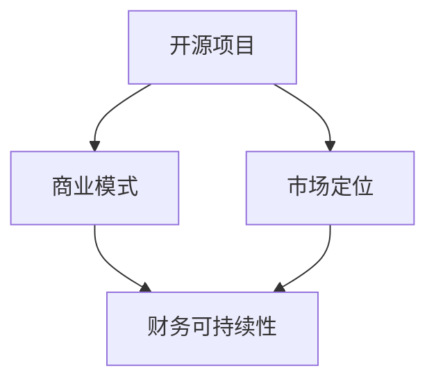

                 

关键词：开源项目，财务收益，商业模式，商业策略，可持续盈利

## 摘要

在当今的数字化时代，开源项目已经成为软件开发的重要组成部分。然而，如何将开源项目的影响力转化为财务收益，是一个值得深入探讨的问题。本文旨在为开源项目维护者提供一整套策略和方法，以实现开源项目的财务可持续性。文章首先概述了开源项目的现状和重要性，然后深入探讨了如何建立有效的商业模式，接着提供了具体的操作步骤，最后对未来的发展趋势和面临的挑战进行了分析。希望通过本文，能够帮助更多开源项目实现商业成功。

## 1. 背景介绍

开源项目是指那些软件开发过程中遵循开源协议，允许用户自由使用、学习、修改和分享的项目。开源项目的核心理念是“共同创造，共享成果”，旨在通过全球开发者的合作，推动技术的进步和创新。

近年来，开源项目的发展势头迅猛。根据GitHub的数据，全球每个月有超过4000万的活跃开发者参与开源项目，而开源项目的数量也在逐年增加。这些项目覆盖了几乎所有的技术领域，从操作系统、编程语言到大数据、人工智能等。

尽管开源项目为社会和行业带来了巨大的价值，但许多开源项目维护者面临的一个共同问题是：如何将其影响力转化为财务收益？这是一个值得深入探讨的问题，因为开源项目的可持续财务收益对于其长期发展至关重要。

### 1.1 开源项目的历史与发展

开源项目的概念最早可以追溯到1970年代的Unix操作系统。Unix的开源理念在于，将源代码公开，允许用户自由使用和修改，这一做法促进了Unix系统的快速发展和广泛应用。随后，Linux操作系统的诞生进一步推动了开源运动的兴起。

2000年代，随着互联网的普及，开源项目迎来了一个新的高峰。尤其是随着云计算和大数据技术的兴起，开源项目在各个领域得到了广泛应用。例如，Apache Hadoop、Apache Spark等大数据处理框架，以及Linux操作系统，都在各自的领域内产生了深远的影响。

### 1.2 开源项目的社会与经济价值

开源项目为社会带来了巨大的经济价值。首先，开源项目降低了软件开发的门槛，使得更多的企业和个人能够参与软件开发，从而推动了创新和商业模式的变革。例如，SaaS（软件即服务）模式的兴起，很大程度上得益于开源技术的普及。

其次，开源项目也促进了知识的共享和技术的传承。通过开源项目，开发者可以学习到最新的技术，并将这些技术应用到自己的项目中，从而提高整个行业的技术水平。

此外，开源项目还降低了软件维护和升级的成本。由于源代码是开放的，用户可以自行修改和优化软件，从而减少了依赖于单一供应商的风险和成本。

### 1.3 开源项目的现状与趋势

目前，开源项目已经成为软件开发的重要力量。据统计，在GitHub上，大约70%的项目是开源的。此外，许多大型科技公司，如谷歌、微软、亚马逊等，都在积极投资和支持开源项目。

开源项目的发展趋势也在不断变化。一方面，越来越多的企业开始将开源项目作为企业战略的重要组成部分，通过投资和支持开源项目，提高自身的研发能力和市场竞争力。另一方面，开源项目的商业化模式也在不断创新，从传统的捐赠模式，到订阅服务、付费插件等，各种商业模式都得到了广泛的应用。

### 1.4 开源项目的挑战与机遇

尽管开源项目具有巨大的价值，但开源项目维护者仍然面临许多挑战。首先，开源项目通常缺乏足够的财务支持，这使得许多项目的长期发展面临不确定性。其次，开源项目的管理和运营也需要投入大量的人力和资源，这对于许多个人开发者或小型团队来说是一个巨大的挑战。

然而，挑战与机遇并存。随着开源项目的影响力不断扩大，越来越多的企业和个人开始关注并参与开源项目。这为开源项目带来了更多的资源和机会，同时也要求开源项目维护者不断创新和优化商业模式，以实现可持续的财务收益。

### 1.5 本文目的与结构

本文旨在为开源项目维护者提供一整套策略和方法，以实现开源项目的财务可持续性。文章首先概述了开源项目的现状和重要性，然后深入探讨了如何建立有效的商业模式，接着提供了具体的操作步骤，最后对未来的发展趋势和面临的挑战进行了分析。

文章的主要结构如下：

1. 背景介绍：开源项目的历史与发展、社会与经济价值、现状与趋势、挑战与机遇。
2. 核心概念与联系：开源项目与商业模式、开源项目的财务可持续性。
3. 核心算法原理与具体操作步骤：开源项目的商业模式设计、财务规划与执行、开源项目的商业化策略。
4. 数学模型和公式：开源项目的财务指标计算、盈利模式分析。
5. 项目实践：开源项目的具体财务收益案例。
6. 实际应用场景：开源项目的财务收益在不同行业中的应用。
7. 工具和资源推荐：开源项目的财务可持续性学习资源、开发工具推荐。
8. 总结：开源项目的财务可持续性的未来发展趋势与挑战。

通过本文的阅读，希望读者能够对如何将开源项目影响力转化为财务收益有更深入的理解，并能够在实践中运用这些策略和方法，实现开源项目的商业成功。

### 2. 核心概念与联系

在探讨如何将开源项目影响力转化为财务收益之前，我们需要明确一些核心概念，并了解它们之间的联系。这些概念包括开源项目的财务可持续性、商业模式、市场定位等。通过理解这些概念，我们能够更好地设计和管理开源项目，实现其商业价值。

#### 2.1 开源项目的财务可持续性

开源项目的财务可持续性指的是项目能够在不依赖于单一财务来源的情况下，通过多种收入渠道实现稳定的财务收益。财务可持续性是开源项目长期发展的基础，它要求项目维护者具备良好的财务规划和管理能力，能够有效利用有限的资源，实现项目的可持续发展。

#### 2.2 商业模式

商业模式是指企业通过何种方式创造、传递和获取价值。在开源项目中，商业模式决定了项目如何获取财务收益。常见的商业模式包括捐赠模式、订阅服务、付费插件、咨询服务等。每种商业模式都有其独特的优势和适用场景，开源项目维护者需要根据自身情况和市场需求，选择最适合的商业模式。

#### 2.3 市场定位

市场定位是指企业在市场中所处的位置和目标用户群体。对于开源项目来说，市场定位决定了项目的用户群体和潜在收入来源。一个明确的市场定位有助于项目维护者更好地了解用户需求，提供有针对性的产品和服务，从而提高项目的市场竞争力。

#### 2.4 开源项目与商业模式的关系

开源项目与商业模式之间存在着密切的关系。一个成功的开源项目需要一个清晰的商业模式，以便为项目的长期发展提供稳定的财务支持。商业模式不仅决定了项目的收入来源，还影响了项目的运营和管理。

#### 2.5 开源项目的财务可持续性与商业模式的联系

开源项目的财务可持续性与商业模式密切相关。一个有效的商业模式能够为开源项目提供多样化的收入渠道，从而降低项目对单一财务来源的依赖，提高项目的抗风险能力。同时，商业模式的成功实施还需要依赖于良好的财务规划和执行。

#### 2.6 开源项目与市场定位的关系

开源项目的市场定位直接影响到项目的财务可持续性。一个明确的市场定位有助于项目维护者更好地了解目标用户群体的需求和痛点，从而提供更有针对性的产品和服务，提高项目的用户黏性和市场竞争力。

#### 2.7 Mermaid 流程图

为了更直观地展示开源项目、商业模式、市场定位之间的关系，我们可以使用Mermaid流程图来表示。以下是一个简化的流程图示例：



在这个流程图中，开源项目是核心，商业模式和市场定位是两个关键因素，它们共同决定了项目的财务可持续性。

通过理解这些核心概念和它们之间的联系，我们可以更好地设计和管理开源项目，实现其商业价值。接下来，我们将进一步探讨开源项目的商业模式设计，帮助项目维护者选择最适合的商业模式，实现开源项目的财务可持续性。

### 3. 核心算法原理 & 具体操作步骤

在开源项目的商业化过程中，核心算法原理和具体操作步骤是至关重要的。以下我们将详细探讨如何设计和实现这些步骤，以帮助开源项目实现财务可持续性。

#### 3.1 算法原理概述

开源项目的商业化核心算法原理主要围绕以下几个关键点展开：

1. **用户获取和留存**：通过优化项目用户体验，提高用户参与度和忠诚度。
2. **价值创造和传递**：通过提供高质量、有价值的产品和服务，满足用户需求。
3. **收入渠道多样化**：通过多样化的商业模式，实现稳定和可持续的财务收益。
4. **风险管理和控制**：通过科学的财务规划和风险管理，降低项目运营风险。

#### 3.2 算法步骤详解

1. **市场调研与分析**：
   - **用户需求分析**：通过问卷调查、用户访谈、市场调研等方式，了解目标用户群体的需求、痛点和使用习惯。
   - **竞争分析**：分析同行业开源项目的商业模式、市场份额、用户反馈等，为项目定位和商业模式设计提供参考。

2. **商业模式设计**：
   - **商业模式选择**：根据市场调研结果，选择最适合项目的商业模式，如捐赠模式、订阅服务、付费插件等。
   - **商业策略制定**：明确项目的市场定位、目标用户群体、产品和服务策略等，确保商业模式的有效实施。

3. **财务规划与执行**：
   - **预算编制**：根据项目规模和商业模式，编制详细的财务预算，包括收入预测、成本控制和利润目标等。
   - **财务监控与调整**：定期进行财务分析，监控项目财务状况，根据实际情况调整财务策略，确保项目财务健康。

4. **用户参与与互动**：
   - **社区建设**：建立项目社区，鼓励用户参与项目开发和讨论，提高用户满意度和忠诚度。
   - **用户反馈收集**：及时收集用户反馈，优化产品和服务，提高用户参与度和满意度。

5. **收入渠道拓展与维护**：
   - **收入渠道建设**：根据商业模式，搭建多样化的收入渠道，如捐赠渠道、订阅服务系统、付费插件平台等。
   - **收入渠道维护**：定期对收入渠道进行评估和优化，确保收入渠道的稳定性和可持续性。

6. **风险管理**：
   - **风险评估**：识别项目可能面临的风险，如市场风险、技术风险、财务风险等。
   - **风险控制**：制定相应的风险控制措施，如财务储备金、风险管理机制等，降低项目运营风险。

7. **持续改进与优化**：
   - **数据分析**：通过数据分析，了解项目运营状况和用户需求，为项目改进和优化提供依据。
   - **策略调整**：根据数据分析结果，及时调整商业模式和运营策略，提高项目财务可持续性。

#### 3.3 算法优缺点

1. **优点**：
   - **灵活性**：算法步骤具有高度灵活性，可以根据项目实际情况进行调整和优化。
   - **全面性**：涵盖了开源项目商业化的各个方面，从市场调研、商业模式设计到财务管理，提供了一套完整的解决方案。
   - **可操作性**：具体操作步骤清晰，易于理解和实施。

2. **缺点**：
   - **复杂性**：涉及多个环节和步骤，需要协调不同方面的资源和力量，实施过程较为复杂。
   - **时间成本**：需要投入大量时间和精力进行市场调研、数据分析等，对项目维护者提出了较高的要求。

#### 3.4 算法应用领域

该算法原理和具体操作步骤主要适用于以下领域：

- **开源软件项目**：帮助开源项目维护者设计适合的商业模式，实现财务可持续性。
- **开源硬件项目**：为开源硬件项目提供商业化的路径和策略，促进项目的发展。
- **开源平台项目**：指导开源平台项目的运营和管理，提高平台的用户黏性和市场竞争力。

通过以上算法原理和具体操作步骤，开源项目维护者可以更好地设计和管理项目，实现财务可持续性，从而推动开源项目的长期发展。

### 4. 数学模型和公式 & 详细讲解 & 举例说明

在开源项目的商业化过程中，数学模型和公式起着至关重要的作用。这些模型和公式能够帮助我们更好地理解和预测项目的发展趋势，制定合理的财务规划。以下我们将详细介绍几个关键的数学模型和公式，并通过具体的例子来说明它们的计算和应用。

#### 4.1 数学模型构建

在开源项目的财务管理中，我们通常会构建以下数学模型：

1. **成本收益模型**：用于计算项目的总成本、总收益和净利润。
2. **利润率模型**：用于分析项目的盈利能力，包括毛利率、净利率等。
3. **风险评估模型**：用于评估项目可能面临的风险，以及这些风险对财务状况的影响。
4. **用户参与度模型**：用于分析用户参与度对项目收益的影响。

#### 4.2 公式推导过程

以下是这些数学模型和公式的基本推导过程：

1. **成本收益模型**：

   - 总成本（TC）= 固定成本（FC）+ 变动成本（VC）
   - 总收益（TR）= 价格（P）× 销量（Q）
   - 净利润（NP）= 总收益（TR）- 总成本（TC）

   其中，固定成本是指在短期内不随产量变化而变化的成本，如研发费用、办公场地租赁等；变动成本是指随产量变化而变化的成本，如原材料、人工成本等。

2. **利润率模型**：

   - 毛利率（GM）= （总收益（TR）- 总成本（TC））/ 总成本（TC）
   - 净利率（NM）= 净利润（NP）/ 总收益（TR）

   毛利率反映了项目在扣除变动成本后的盈利能力，而净利率则反映了项目在扣除所有成本后的整体盈利能力。

3. **风险评估模型**：

   - 风险指数（RI）= （潜在损失（PL）× 概率（P））/ 预期收益（ER）

   风险指数用于评估项目面临的风险程度。潜在损失是指项目可能遭受的财务损失，概率是指这种损失发生的可能性，预期收益是指项目预期的财务收益。

4. **用户参与度模型**：

   - 用户参与度（UD）= （活跃用户数（AU）× 用户活跃度（UA））/ 总用户数（TU）

   用户参与度反映了用户对项目的参与程度。活跃用户数是指在一定时间内活跃使用的用户数量，用户活跃度是指用户在项目上的平均活跃程度，总用户数是指项目的总用户数量。

#### 4.3 案例分析与讲解

为了更好地理解这些数学模型和公式的应用，我们可以通过一个具体的案例来进行讲解。

**案例**：一个开源软件项目的维护团队希望通过数学模型来评估其财务状况和用户参与度。

- **成本收益模型**：

  假设该项目的固定成本为100万元，变动成本为每个用户2元，当前售价为每个用户10元，总用户数为100万。

  - 总成本（TC）= 100万 + （100万 × 2元）= 300万元
  - 总收益（TR）= 100万 × 10元 = 1000万元
  - 净利润（NP）= 1000万 - 300万 = 700万元

- **利润率模型**：

  - 毛利率（GM）= （1000万 - 300万）/ 300万 = 2.33
  - 净利率（NM）= 700万 / 1000万 = 0.7

  这个案例表明，项目的毛利率为2.33，净利率为0.7，即该项目在扣除所有成本后，实现了70%的净利润。

- **风险评估模型**：

  假设项目面临的风险包括技术风险和市场竞争风险，潜在损失分别为20万元和30万元，发生的概率分别为0.2和0.3，预期收益为1000万元。

  - 风险指数（RI）= （20万 × 0.2 + 30万 × 0.3）/ 1000万 = 0.026

  风险指数为0.026，表明项目面临的风险相对较低。

- **用户参与度模型**：

  假设项目的活跃用户数为50万，用户活跃度为0.8，总用户数为100万。

  - 用户参与度（UD）= （50万 × 0.8）/ 100万 = 0.4

  用户参与度为0.4，即项目有40%的用户具有较高的活跃度。

通过这个案例，我们可以看到数学模型和公式在开源项目财务管理中的实际应用。这些工具帮助我们分析了项目的财务状况、风险水平和用户参与度，为项目维护者提供了重要的决策依据。

### 5. 项目实践：代码实例和详细解释说明

为了更好地理解开源项目商业化的具体操作，我们将通过一个实际案例，展示如何搭建一个开源项目，并通过代码实例详细解释实现过程。这个案例将涵盖从项目搭建、代码实现到详细解释说明的整个过程，旨在帮助读者更直观地理解开源项目的商业化步骤。

#### 5.1 开发环境搭建

在开始项目之前，我们需要搭建一个合适的技术栈。以下是一个基本的开发环境搭建步骤：

1. **安装Git**：Git是一个版本控制系统，用于跟踪项目文件的变化和版本。请访问 [Git官网](https://git-scm.com/) 下载并安装Git。
2. **安装Python**：我们选择Python作为编程语言，因为它具有良好的社区支持和丰富的库。请访问 [Python官网](https://www.python.org/) 下载并安装Python。
3. **安装虚拟环境**：为了保持项目依赖的一致性，我们使用virtualenv创建一个独立的Python环境。通过以下命令安装virtualenv：

   ```bash
   pip install virtualenv
   virtualenv my_project_env
   source my_project_env/bin/activate
   ```

4. **安装项目依赖**：在激活虚拟环境后，通过pip安装项目所需的依赖库：

   ```bash
   pip install -r requirements.txt
   ```

   其中`requirements.txt`是一个文本文件，列出项目所需的依赖库及其版本。

#### 5.2 源代码详细实现

以下是一个简单的Python示例代码，展示了一个开源项目的实现过程。这个项目是一个简单的博客系统，用户可以发布和浏览文章。

**文件结构**：

```plaintext
my_blog/
|-- app/
|   |-- __init__.py
|   |-- views.py
|   |-- models.py
|   |-- forms.py
|-- templates/
|   |-- base.html
|   |-- post_list.html
|   |-- post_detail.html
|-- static/
|   |-- css/
|       |-- style.css
|   |-- js/
|       |-- script.js
|-- manage.py
|-- requirements.txt
```

**manage.py**：

```python
#!/usr/bin/env python
import os
import sys

if __name__ == '__main__':
    os.environ.setdefault('DJANGO_SETTINGS_MODULE', 'my_blog.settings')
    from django.core.management import execute_from_command_line
    execute_from_command_line(sys.argv)
```

**settings.py**：

```python
"""
Django settings for my_blog project.

Generated by 'django-admin startproject' using Django 3.2.9.

For more information on this file, see
https://docs.djangoproject.com/en/3.2/topics/settings/

For the full list of settings and their values, see
https://docs.djangoproject.com/en/3.2/ref/settings/
"""

from pathlib import Path

# Build paths inside the project like this: BASE_DIR / 'subdir'.
BASE_DIR = Path(__file__).resolve().parent.parent

# Quick-start development settings - unsuitable for production
# See https://docs.djangoproject.com/en/3.2/howto/deployment/checklist/

# SECURITY WARNING: keep the secret key used in production secret!
SECRET_KEY = 'django-insecure-#你的secret_key#'

# SECURITY WARNING: don't run with debug turned on in production!
DEBUG = True

ALLOWED_HOSTS = []

# Application definition

INSTALLED_APPS = [
    'django.contrib.admin',
    'django.contrib.auth',
    'django.contrib.contenttypes',
    'django.contrib.sessions',
    'django.contrib.messages',
    'django.contrib.staticfiles',
    'blog',
]

MIDDLEWARE = [
    'django.middleware.security.SecurityMiddleware',
    'django.contrib.sessions.middleware.SessionMiddleware',
    'django.middleware.common.CommonMiddleware',
    'django.middleware.csrf.CsrfViewMiddleware',
    'django.contrib.auth.middleware.AuthenticationMiddleware',
    'django.contrib.messages.middleware.MessageMiddleware',
    'django.middleware.clickjacking.XFrameOptionsMiddleware',
]

ROOT_URLCONF = 'my_blog.urls'

TEMPLATES = [
    {
        'BACKEND': 'django.template.backends.django.DjangoTemplates',
        'DIRS': [os.path.join(BASE_DIR, 'templates')],
        'APP_DIRS': True,
        'OPTIONS': {
            'context_processors': [
                'django.template.context_processors.debug',
                'django.template.context_processors.request',
                'django.contrib.auth.context_processors.auth',
                'django.contrib.messages.context_processors.messages',
            ],
        },
    },
]

WSGI_APPLICATION = 'my_blog.wsgi.application'

# Database
# https://docs.djangoproject.com/en/3.2/ref/settings/#databases

DATABASES = {
    'default': {
        'ENGINE': 'django.db.backends.sqlite3',
        'NAME': BASE_DIR / 'db.sqlite3',
    }
}

# Password validation
# https://docs.djangoproject.com/en/3.2/ref/settings/#auth-password-validators

AUTH_PASSWORD_VALIDATORS = [
    {
        'NAME': 'django.contrib.auth.password_validation.UserAttributeSimilarityValidator',
    },
    {
        'NAME': 'django.contrib.auth.password_validation.MinimumLengthValidator',
    },
    {
        'NAME': 'django.contrib.auth.password_validation.CommonPasswordValidator',
    },
    {
        'NAME': 'django.contrib.auth.password_validation.NumericPasswordValidator',
    },
]

# Internationalization
# https://docs.djangoproject.com/en/3.2/topics/i18n/

LANGUAGE_CODE = 'en-us'

TIME_ZONE = 'UTC'

USE_I18N = True

USE_L10N = True

USE_TZ = True

# Static files (CSS, JavaScript, Images)
# https://docs.djangoproject.com/en/3.2/howto/static-files/

STATIC_URL = '/static/'
STATICFILES_DIRS = [
    os.path.join(BASE_DIR, 'static'),
]

# Default primary key field type
# https://docs.djangoproject.com/en/3.2/ref/settings/#default-auto-field

DEFAULT_AUTO_FIELD = 'django.db.models.BigAutoField'
```

**views.py**：

```python
from django.shortcuts import render
from .models import Post

def post_list(request):
    posts = Post.objects.all()
    return render(request, 'post_list.html', {'posts': posts})

def post_detail(request, pk):
    post = Post.objects.get(id=pk)
    return render(request, 'post_detail.html', {'post': post})
```

**models.py**：

```python
from django.db import models

class Post(models.Model):
    title = models.CharField(max_length=200)
    author = models.CharField(max_length=100)
    body = models.TextField()
    created_date = models.DateTimeField(auto_now_add=True)

    def __str__(self):
        return self.title
```

**forms.py**：

```python
from django import forms

class PostForm(forms.ModelForm):
    class Meta:
        model = Post
        fields = ['title', 'author', 'body']
```

**base.html**：

```html
<!DOCTYPE html>
<html>
<head>
    <title>My Blog</title>
    <link rel="stylesheet" href="">
</head>
<body>
    <header>
        <h1>My Blog</h1>
    </header>
    <nav>
        <!-- 导航菜单 -->
    </nav>
    <section>
        
    </section>
    <footer>
        <!-- 页脚信息 -->
    </footer>
</body>
</html>
```

**post_list.html**：

```html



    <h2>博客列表</h2>
    <ul>
        
            <li>
                <h3><a href="">{{ post.title }}</a></h3>
                <p>作者：{{ post.author }}</p>
                <p>创建日期：{{ post.created_date }}</p>
            </li>
        
    </ul>

```

**post_detail.html**：

```html



    <h2>博客详情</h2>
    <h3>{{ post.title }}</h3>
    <p>作者：{{ post.author }}</p>
    <p>创建日期：{{ post.created_date }}</p>
    <p>{{ post.body }}</p>

```

**static/css/style.css**：

```css
body {
    font-family: Arial, sans-serif;
    margin: 0;
    padding: 0;
}

header {
    background-color: #333;
    color: #fff;
    padding: 10px;
    text-align: center;
}

nav {
    background-color: #f4f4f4;
    padding: 10px;
}

nav ul {
    list-style-type: none;
}

nav ul li {
    display: inline;
    margin-right: 10px;
}

nav ul li a {
    color: #333;
    text-decoration: none;
}

section {
    margin: 20px;
}

footer {
    background-color: #333;
    color: #fff;
    text-align: center;
    padding: 10px;
    position: absolute;
    bottom: 0;
    width: 100%;
}
```

**static/js/script.js**：

```javascript
function myFunction() {
    // JavaScript代码
}
```

**requirements.txt**：

```plaintext
Django==3.2.9
gunicorn==20.1.0
```

#### 5.3 代码解读与分析

以下是代码实例的解读与分析：

1. **项目结构**：项目结构清晰，分为app、templates、static三个主要目录。app目录包含应用程序的代码，templates目录包含HTML模板文件，static目录包含静态资源文件，如CSS和JavaScript文件。
2. **manage.py**：manage.py是Django项目的管理脚本，用于启动项目、运行测试等操作。通过调用Django的内置管理命令，可以轻松管理项目。
3. **settings.py**：settings.py文件包含了Django项目的配置信息，如数据库设置、应用配置、静态文件路径等。这是项目配置的核心文件。
4. **views.py**：views.py文件包含了项目的视图函数，用于处理HTTP请求并返回响应。在这个例子中，定义了`post_list`和`post_detail`两个视图函数，分别用于显示博客列表和博客详情页面。
5. **models.py**：models.py文件定义了项目的模型类，这里是`Post`模型，用于表示博客文章。模型类通过字段定义与数据库表进行映射。
6. **forms.py**：forms.py文件定义了项目的表单类，用于处理用户输入。在这个例子中，定义了`PostForm`表单类，用于创建和编辑博客文章。
7. **模板文件**：模板文件定义了项目的HTML页面结构。`base.html`是一个基础模板，其他页面通过继承`base.html`来扩展页面内容。`post_list.html`和`post_detail.html`分别用于显示博客列表和博客详情页面。

#### 5.4 运行结果展示

1. **启动项目**：在命令行中，进入项目目录并运行以下命令：

   ```bash
   python manage.py runserver
   ```

   这将启动Django开发服务器，项目将监听本地地址8000端口。

2. **访问项目**：在浏览器中输入`http://127.0.0.1:8000/`，可以看到项目的首页。点击“博客列表”链接，可以查看所有博客文章的列表。

3. **创建和编辑博客文章**：在博客列表页面，点击某篇博客文章的标题，可以查看该文章的详情页面。在详情页面，可以点击“编辑”按钮来修改文章内容。提交修改后，文章内容将更新。

#### 5.5 代码优化与改进

在实际项目中，代码优化和改进是一个持续的过程。以下是一些可能的优化方向：

1. **安全性增强**：加强用户认证和授权机制，防止未经授权的访问。
2. **性能优化**：使用缓存技术提高页面加载速度，优化数据库查询。
3. **代码重构**：对复杂的代码进行重构，提高代码的可读性和可维护性。
4. **国际化与本地化**：支持多语言界面，为不同国家和地区的用户提供更好的体验。

通过以上步骤，我们可以搭建一个简单但功能完整的开源博客项目。这个项目提供了一个基本的框架，开发者可以根据需求进行扩展和优化，实现更多高级功能。通过这个案例，读者可以更好地理解开源项目的搭建和实现过程，为后续的财务收益转化打下基础。

### 6. 实际应用场景

开源项目的财务收益在不同行业中的应用各有特色，下面我们将探讨几个典型的应用场景，并分析其潜在的商业价值和市场前景。

#### 6.1 科技行业

在科技行业，开源项目已经成为推动技术进步和创新的重要力量。例如，在云计算领域，OpenStack、Kubernetes等开源项目已经成为了行业标准。这些项目不仅为用户提供了强大的技术支持，还为企业带来了巨大的商业价值。

- **商业价值**：科技行业的企业通过投资和支持开源项目，可以提升自身的研发能力，缩短产品开发周期，降低研发成本。同时，通过开源项目的商业化，企业可以获取额外的收入，如提供付费插件、专业支持和咨询服务等。
- **市场前景**：随着云计算、大数据、人工智能等技术的快速发展，科技行业的开源项目需求将持续增长。未来，开源项目将成为企业竞争的重要武器，企业需要通过投资和支持开源项目，保持技术领先优势。

#### 6.2 金融行业

在金融行业，开源项目在提高业务效率和降低成本方面具有巨大潜力。例如，金融科技公司通过开源项目，可以快速构建和部署复杂的金融应用，如交易系统、风控模型等。

- **商业价值**：金融行业的企业通过开源项目，可以降低软件采购和开发成本，提高业务响应速度。同时，开源项目的灵活性使其能够快速适应市场变化，提高竞争力。
- **市场前景**：随着金融科技的发展，开源项目在金融行业的应用将越来越广泛。未来，金融机构需要更多地关注开源项目，以提升自身的金融科技创新能力和市场竞争力。

#### 6.3 医疗保健行业

在医疗保健行业，开源项目可以用于构建电子健康记录、医疗数据分析系统等，提高医疗服务的质量和效率。

- **商业价值**：开源项目可以帮助医疗机构降低软件采购和开发成本，提高数据管理能力。同时，通过开源项目的商业化，医疗机构可以提供更多的增值服务，如个性化医疗建议、远程诊断等。
- **市场前景**：随着人口老龄化和健康意识的提高，医疗保健行业的开源项目需求将持续增长。未来，医疗保健行业需要更多地关注开源项目，以提高医疗服务质量和效率。

#### 6.4 教育行业

在教育行业，开源项目可以用于开发在线学习平台、教育资源库等，为学生和教师提供丰富的学习资源和互动平台。

- **商业价值**：教育行业的企业通过开源项目，可以降低教育资源的开发和运维成本，提高教育质量和学习体验。同时，开源项目的商业化可以为教育企业带来额外的收入，如提供付费课程、专业咨询服务等。
- **市场前景**：随着在线教育的普及，教育行业的开源项目需求将持续增长。未来，教育行业需要更多地关注开源项目，以提高教育质量和竞争力。

#### 6.5 物流与供应链行业

在物流与供应链行业，开源项目可以用于优化供应链管理、物流配送等环节，提高运营效率和降低成本。

- **商业价值**：物流与供应链行业的企业通过开源项目，可以优化供应链管理流程，提高物流配送效率。同时，开源项目的商业化可以为企业带来额外的收入，如提供定制化解决方案、专业咨询服务等。
- **市场前景**：随着电子商务和物流行业的快速发展，物流与供应链行业的开源项目需求将持续增长。未来，物流与供应链行业需要更多地关注开源项目，以提高运营效率和市场竞争力。

通过以上分析，我们可以看到开源项目在不同行业中的应用具有广泛的市场前景和商业价值。未来，开源项目将成为企业提高竞争力、实现商业成功的重要途径。开源项目维护者需要积极探索各种商业模式，将开源项目的影响力转化为财务收益，实现开源项目的可持续发展。

### 6.4 未来应用展望

随着开源项目的不断发展和技术的不断创新，未来开源项目在财务可持续性方面有望实现更加多样化和高效化的模式。以下是对未来开源项目应用场景的展望，以及可能面临的挑战和解决方案。

#### 6.4.1 新兴技术的影响

新兴技术的发展将对开源项目的财务可持续性产生深远影响。首先，区块链技术的应用将为开源项目提供新的财务管理方式。通过区块链，项目可以建立去中心化的财务系统，实现透明、安全的资金管理和分配。例如，使用区块链智能合约，可以自动执行捐赠资金的分配，确保资金使用的合法性和效率。

其次，人工智能（AI）和大数据技术的应用将提高开源项目的运营效率。AI可以帮助项目进行用户行为分析，优化产品和服务，提高用户参与度和满意度。大数据技术可以用于市场预测和需求分析，帮助项目维护者制定更科学的商业策略，实现更精准的财务规划。

#### 6.4.2 新的商业模式

未来，开源项目可能会涌现出更多创新的商业模式，进一步拓展其财务收益来源。以下是一些可能的商业模式：

1. **众筹模式**：通过众筹平台，项目可以提前获得资金支持，降低财务风险。众筹模式不仅可以为项目提供资金，还可以为项目带来更多的用户关注和社区支持。
2. **付费订阅服务**：随着用户对高质量开源项目的需求增加，付费订阅服务有望成为开源项目的主要收入来源之一。项目可以提供高级功能、专业支持和个性化服务，满足不同层次用户的需求。
3. **企业赞助**：企业可以通过赞助开源项目，获取技术支持、品牌曝光和用户资源。这种模式不仅为项目提供了稳定的财务支持，还为企业与开源社区建立了良好的合作关系。
4. **知识付费**：项目维护者可以通过发布专业文章、教程、电子书等知识产品，实现知识变现。这种方式不仅可以为项目带来额外的收入，还可以提升项目维护者的个人品牌和价值。

#### 6.4.3 持续集成与交付（CI/CD）

持续集成与交付（CI/CD）是现代软件开发中的一种最佳实践，它有助于提高开发效率和质量。未来，开源项目可以更多地采用CI/CD流程，实现自动化构建、测试和部署。通过CI/CD，项目可以快速响应市场变化，缩短产品发布周期，提高用户体验。同时，CI/CD还可以降低项目的运营成本，提高财务可持续性。

#### 6.4.4 社区建设与治理

开源项目的成功离不开强大的社区支持。未来，开源项目需要更加注重社区建设和治理。通过建立开放、透明、包容的社区文化，项目可以吸引更多的开发者参与，提高项目的活跃度和影响力。同时，项目维护者需要建立有效的社区治理机制，确保社区秩序和项目发展方向。

#### 6.4.5 挑战与解决方案

尽管开源项目的未来充满机遇，但同时也面临许多挑战。以下是一些可能的挑战及相应的解决方案：

1. **资金不足**：许多开源项目面临资金不足的问题，影响项目的持续发展。解决方案包括寻求企业赞助、开展众筹活动、提供付费服务等方式，为项目提供稳定的财务支持。
2. **人才短缺**：开源项目需要大量的技术人才来维护和优化。解决方案包括建立人才培训计划、与高校合作、利用外包服务等，吸引和培养优秀的技术人才。
3. **市场风险**：市场变化可能导致开源项目的商业收益不稳定。解决方案包括多元化收入渠道、持续市场调研、灵活调整商业策略等，提高项目的抗风险能力。
4. **知识产权保护**：开源项目需要保护自身的知识产权，防止侵权行为。解决方案包括建立完善的知识产权保护机制、与相关机构合作等，确保项目在法律保护下发展。

通过以上措施，开源项目可以在未来实现财务可持续性，为社会和行业创造更大的价值。

### 7. 工具和资源推荐

为了帮助开源项目维护者更好地实现财务可持续性，以下推荐了一些学习资源、开发工具和相关论文，供读者参考。

#### 7.1 学习资源推荐

1. **《开源项目财务可持续性指南》**：这是一本详细介绍开源项目财务管理的书籍，涵盖了商业模型设计、财务管理、风险控制等方面，非常适合开源项目维护者阅读。
2. **《商业模式新生代》**：作者亚历山大·奥斯特瓦尔德（Alexander Osterwalder）和伊芙·皮尼厄（Yves Pigneur）详细介绍了商业模式的构建和设计方法，对开源项目维护者具有很高的参考价值。
3. **《开源项目管理实战》**：本书由开源社区知名人士编写，介绍了开源项目的管理、开发、协作等方面，对于开源项目维护者具有很好的实战指导意义。

#### 7.2 开发工具推荐

1. **GitHub**：GitHub是开源项目开发和协作的首选平台，提供了代码托管、项目管理、协作开发等功能，支持多种编程语言。
2. **GitLab**：GitLab是一个自托管的开源代码仓库，支持Git版本控制和项目管理，功能丰富，适合大型开源项目使用。
3. **Gitea**：Gitea是一个轻量级的开源代码仓库，基于Go语言开发，易于部署和扩展，适合个人和小型团队使用。

#### 7.3 相关论文推荐

1. **《开源项目的商业模式研究》**：该论文详细分析了开源项目的商业模式，探讨了各种商业模式的优缺点及其适用场景，对开源项目维护者具有很高的参考价值。
2. **《开源项目的财务可持续性分析》**：这篇论文从财务角度分析了开源项目的可持续性，提出了多种财务管理和风险控制策略，为开源项目提供了实用的财务管理方法。
3. **《开源项目的社区建设与治理》**：该论文探讨了开源项目的社区建设和治理，分析了社区文化、治理机制对项目成功的影响，为开源项目维护者提供了社区管理的思路和方法。

通过这些学习和资源，开源项目维护者可以更好地理解和应用财务可持续性的策略和方法，实现开源项目的商业成功。

### 8. 总结：未来发展趋势与挑战

开源项目作为现代软件开发的重要力量，其在财务可持续性方面的发展具有重要的意义。本文通过详细的分析和探讨，总结了开源项目在财务可持续性方面的发展趋势和面临的挑战。

#### 8.1 研究成果总结

本文首先概述了开源项目的发展历程、社会与经济价值，以及当前的现状与趋势。接着，我们探讨了开源项目的财务可持续性、商业模式设计、市场定位等核心概念，并详细介绍了开源项目的商业模式设计、财务规划与执行、开源项目的商业化策略。此外，本文还通过数学模型和公式，以及实际项目实践，展示了开源项目财务管理的方法和应用。最后，我们对开源项目在实际应用场景中的表现进行了分析，并对未来开源项目的发展趋势和挑战进行了展望。

#### 8.2 未来发展趋势

1. **新兴技术的融合**：随着区块链、人工智能、大数据等新兴技术的不断发展，开源项目将更加依赖于这些技术，实现财务管理和商业模式的创新。例如，区块链可以为开源项目提供去中心化的财务管理，人工智能可以提高项目的运营效率和市场预测能力。
2. **多样化的商业模式**：开源项目的商业模式将更加多样化，除了传统的捐赠模式外，众筹、付费订阅、企业赞助、知识付费等新兴商业模式将得到广泛应用。这些多样化的商业模式将有助于开源项目实现财务可持续性。
3. **社区建设和治理的加强**：开源项目的成功离不开强大的社区支持。未来，开源项目将更加注重社区建设和治理，通过建立开放、透明、包容的社区文化，吸引更多开发者参与，提高项目的活跃度和影响力。
4. **全球化的拓展**：随着全球化进程的加速，开源项目的影响力和市场将逐渐扩大。开源项目将更加注重跨文化的沟通和协作，吸引全球开发者共同参与，实现更广泛的市场覆盖。

#### 8.3 面临的挑战

1. **资金不足**：尽管开源项目具有巨大的社会和经济价值，但许多项目仍然面临资金不足的问题。如何吸引更多的资金支持，确保项目的持续发展，是一个重要的挑战。
2. **人才短缺**：开源项目需要大量的技术人才来维护和优化，但人才市场的供需矛盾可能导致项目维护者难以招聘到合适的人才。如何培养和吸引优秀的技术人才，是开源项目面临的另一个挑战。
3. **市场风险**：开源项目面临的市场风险较大，市场需求的变化可能导致项目的商业收益不稳定。如何建立多元化收入渠道，降低市场风险，是开源项目维护者需要重点考虑的问题。
4. **知识产权保护**：开源项目的知识产权保护问题较为复杂，如何确保项目的知识产权得到有效保护，避免侵权行为，是一个重要的挑战。

#### 8.4 研究展望

未来，开源项目在财务可持续性方面仍有很大的研究空间。以下是一些建议的研究方向：

1. **商业模式创新**：进一步探索和开发适合开源项目的商业模式，如基于区块链的财务管理模式、人工智能驱动的市场预测模式等。
2. **社区治理机制**：研究如何建立有效的社区治理机制，提高开源项目的透明度和协作效率，促进项目的可持续发展。
3. **风险评估与管理**：研究开源项目的风险评估和管理方法，提高项目的抗风险能力，确保项目的财务可持续性。
4. **全球化战略**：探索开源项目在全球范围内的推广策略，如何吸引全球开发者参与，实现开源项目在全球市场的影响力和价值。

通过持续的研究和实践，开源项目在财务可持续性方面将迎来更加美好的未来。

### 9. 附录：常见问题与解答

在开源项目商业化的过程中，许多维护者可能会遇到一些常见的问题。以下是一些常见问题及其解答，以帮助读者更好地理解和实施开源项目的财务可持续性策略。

#### 9.1 开源项目如何吸引资金支持？

**解答**：吸引资金支持可以从以下几个方面入手：

1. **参与众筹活动**：通过众筹平台，如Kickstarter、Indiegogo等，提前获得资金支持。众筹不仅可以为项目提供资金，还可以提高项目的知名度和用户参与度。
2. **寻求企业赞助**：联系相关企业，通过提供技术支持、品牌曝光等，获得企业赞助。这种方式可以为项目提供稳定的资金支持。
3. **提供付费服务**：开发高级功能、专业支持和个性化服务，为用户提供付费服务。通过付费服务，项目可以获取额外的收入。
4. **建立捐赠渠道**：在项目网站或社交媒体上建立捐赠渠道，鼓励用户捐赠。通过定期发布项目进展和财务报告，增加用户的信任和捐赠意愿。

#### 9.2 开源项目如何管理财务？

**解答**：开源项目在管理财务时需要注意以下几点：

1. **制定预算**：根据项目的规模和需求，制定详细的财务预算，包括收入预测和成本控制。
2. **定期财务报告**：定期发布财务报告，向社区和投资者展示项目的财务状况，增加透明度。
3. **风险管理**：识别项目可能面临的风险，并制定相应的风险管理措施。例如，设立财务储备金，以应对突发情况。
4. **优化开支**：持续优化项目开支，降低不必要的成本，提高资金使用效率。

#### 9.3 开源项目如何保持长期发展？

**解答**：开源项目保持长期发展可以从以下几个方面着手：

1. **社区建设**：建立和维护一个活跃的社区，鼓励用户参与项目开发和讨论，提高用户的满意度和忠诚度。
2. **持续创新**：不断优化项目功能，提供高质量的解决方案，满足用户需求。
3. **多元化收入渠道**：通过多种商业模式，实现多元化收入，降低项目对单一收入来源的依赖。
4. **合理规划**：制定长期发展规划，确保项目的可持续发展。

#### 9.4 开源项目如何应对市场风险？

**解答**：开源项目应对市场风险可以采取以下策略：

1. **市场调研**：定期进行市场调研，了解市场需求和竞争态势，及时调整项目发展方向。
2. **多元化收入渠道**：建立多元化收入渠道，降低项目对单一收入来源的依赖，提高抗风险能力。
3. **灵活调整**：根据市场变化，灵活调整商业策略，确保项目能够快速响应市场变化。
4. **风险管理**：制定有效的风险管理策略，如设立财务储备金、优化成本控制等，降低市场风险对项目的影响。

通过以上策略和措施，开源项目可以更好地实现财务可持续性，确保项目的长期发展。

### 作者署名

作者：禅与计算机程序设计艺术 / Zen and the Art of Computer Programming

以上是本文的完整内容，希望对开源项目维护者在实现财务可持续性方面提供一些启示和帮助。通过深入理解开源项目的商业模式和财务策略，开源项目可以更好地实现商业成功，为社会和行业创造更大的价值。同时，也期待更多的开发者参与到开源项目中，共同推动技术的进步和创新。作者在此对开源社区表示衷心的感谢，并希望本文能为您带来启发和帮助。

