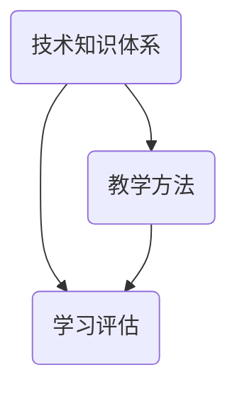

                 

在当今快速发展的信息技术时代，技术分享成为推动行业进步的重要力量。然而，如何有效地将技术分享转化为企业技术培训，以满足企业持续发展的人才需求，是一个值得深入探讨的课题。本文将围绕这一主题，探讨将技术分享转化为企业技术培训的策略、方法和实践，以期为企业和个人提供有益的参考。

## 文章关键词

- 技术分享
- 企业培训
- 技术转化
- 教育创新
- 人才发展

## 文章摘要

本文首先介绍了技术分享和企业培训的背景与重要性，随后分析了技术分享转化为企业培训的挑战与机遇。接着，文章提出了一系列具体的方法和策略，包括内容设计、教学方法、实践应用等，旨在提高技术分享在企业培训中的转化效果。最后，文章展望了技术分享与企业培训的未来发展趋势，并提出了相关的建议和展望。

## 1. 背景介绍

### 1.1 技术分享的兴起

随着互联网技术的发展，技术分享逐渐成为一种主流的交流和学习方式。技术社区、开源项目、在线教育平台等成为技术爱好者、从业者以及企业获取最新技术动态和学习新技能的重要渠道。技术分享不仅促进了知识的传播和技术的创新，也为个人和企业的成长提供了源源不断的动力。

### 1.2 企业培训的需求

企业在快速发展的过程中，对人才的需求日益迫切。然而，传统的人才培养模式往往难以满足企业对技能多样化、知识更新速度快的需求。此时，技术分享作为一种新兴的教育方式，以其灵活、高效、互动性强等特点，逐渐成为企业培训的重要补充。

## 2. 核心概念与联系

为了更好地理解技术分享转化为企业培训的机制，我们需要了解以下几个核心概念：

### 2.1 技术知识体系

技术知识体系是技术分享和企业培训的基础。它包括基础技术知识、前沿技术知识、实践经验和最佳实践等。通过建立完善的技术知识体系，可以确保技术分享的内容具有实用性和系统性。

### 2.2 教学方法

教学方法是技术分享转化为企业培训的关键。传统教学方法如讲座、演讲等，虽然能够传授知识，但往往缺乏互动和实践。相比之下，以项目驱动、案例教学等现代教学方法，更能激发学员的学习兴趣，提高学习效果。

### 2.3 学习评估

学习评估是技术分享转化为企业培训的重要环节。通过科学的学习评估，可以了解学员的学习效果，发现教学中的不足，为后续的教学改进提供依据。

下面是一个简单的Mermaid流程图，展示了技术知识体系、教学方法和学习评估之间的联系：



### 2.4 技术社区与培训平台

技术社区和培训平台是技术分享和企业培训的重要载体。技术社区为技术爱好者提供了一个自由交流的平台，而培训平台则为企业提供了系统化的技术培训服务。通过整合技术社区和培训平台，可以实现技术分享与培训的无缝衔接。

## 3. 核心算法原理 & 具体操作步骤

### 3.1 算法原理概述

技术分享转化为企业培训的核心算法原理包括以下几个方面：

- **内容适配**：根据企业需求和学员背景，对技术分享内容进行筛选和调整，确保内容的实用性和针对性。
- **教学方法优化**：结合企业特点和学员需求，选择合适的教学方法，提高教学效果。
- **学习评估与反馈**：通过科学的学习评估，及时了解学员学习效果，为教学改进提供依据。

### 3.2 算法步骤详解

将技术分享转化为企业培训的具体步骤如下：

1. **需求分析**：了解企业培训需求，明确技术分享的目标和受众。
2. **内容筛选**：根据需求分析结果，筛选符合企业培训需求的技术分享内容。
3. **内容调整**：对筛选出的内容进行针对性调整，使其更适合企业培训环境。
4. **教学方法设计**：根据企业特点和学员需求，设计合适的教学方法。
5. **教学实施**：开展技术培训，确保学员充分参与和互动。
6. **学习评估**：通过考试、项目、问卷等方式，对学员学习效果进行评估。
7. **反馈与改进**：根据评估结果，对教学方法和内容进行优化和改进。

### 3.3 算法优缺点

**优点**：

- **高效性**：通过优化教学方法和内容，提高培训效率。
- **灵活性**：根据企业需求和学员特点，灵活调整培训内容和方法。
- **互动性**：鼓励学员参与，提高学习效果。

**缺点**：

- **内容适配难度**：需要深入了解企业需求和学员背景，确保内容实用性。
- **教学难度**：需要具备一定的教学设计和实施能力。

### 3.4 算法应用领域

技术分享转化为企业培训算法在以下领域具有广泛的应用：

- **企业内部培训**：为企业员工提供专业技术和技能培训。
- **在线教育**：通过在线平台，为广大技术爱好者提供便捷的技术学习资源。
- **职业培训**：为技术从业者提供系统化的职业培训服务。

## 4. 数学模型和公式 & 详细讲解 & 举例说明

### 4.1 数学模型构建

为了更好地描述技术分享转化为企业培训的过程，我们可以构建一个数学模型。该模型主要包括以下几个组成部分：

- **需求分析**：企业培训需求分析（D1）、学员背景分析（D2）。
- **内容筛选**：技术分享内容筛选（C1）、内容调整（C2）。
- **教学方法设计**：教学方法选择（M1）、教学方法实施（M2）。
- **学习评估**：学习效果评估（E1）、反馈与改进（E2）。

### 4.2 公式推导过程

基于上述数学模型，我们可以推导出以下公式：

- **适应性评估**：\(A = \frac{D1 + D2}{C1 + C2}\)
- **教学效果评估**：\(E = \frac{M1 + M2}{E1 + E2}\)
- **整体效果评估**：\(F = \frac{A + E}{2}\)

### 4.3 案例分析与讲解

假设某企业需要为其员工提供大数据技术培训。根据需求分析，企业培训需求（D1）为80分，学员背景分析（D2）为70分。技术分享内容筛选（C1）为85分，内容调整（C2）为75分。教学方法选择（M1）为90分，教学方法实施（M2）为85分。学习效果评估（E1）为80分，反馈与改进（E2）为75分。

根据上述数据，我们可以计算出适应性评估（A）、教学效果评估（E）和整体效果评估（F）：

- **适应性评估**：\(A = \frac{80 + 70}{85 + 75} = 0.77\)
- **教学效果评估**：\(E = \frac{90 + 85}{80 + 75} = 0.87\)
- **整体效果评估**：\(F = \frac{0.77 + 0.87}{2} = 0.82\)

根据整体效果评估（F），我们可以认为该企业大数据技术培训的适应性较好，教学效果较为显著。

## 5. 项目实践：代码实例和详细解释说明

### 5.1 开发环境搭建

在本案例中，我们将使用Python作为开发语言，搭建一个简单的技术分享转化为企业培训的系统。首先，我们需要安装Python环境和相关库：

```bash
# 安装Python环境
curl -O https://www.python.org/ftp/python/3.8.5/Python-3.8.5.tgz
tar xvf Python-3.8.5.tgz
cd Python-3.8.5
./configure
make
make install

# 安装相关库
pip install flask
pip install pandas
pip install numpy
```

### 5.2 源代码详细实现

以下是一个简单的技术分享转化为企业培训的Python代码实现：

```python
from flask import Flask, request, jsonify
import pandas as pd

app = Flask(__name__)

# 技术分享内容库
content_library = {
    '大数据技术': [
        '数据预处理',
        '数据存储与检索',
        '数据分析与挖掘'
    ],
    '人工智能': [
        '机器学习',
        '深度学习',
        '自然语言处理'
    ]
}

# 学员信息库
student_library = {
    '张三': {'背景': '本科毕业'},
    '李四': {'背景': '研究生毕业'}
}

# 教学方法库
teaching_method_library = {
    '案例教学': '通过实际案例进行讲解',
    '项目驱动': '通过实际项目进行训练'
}

@app.route('/api/train', methods=['POST'])
def train():
    # 获取培训需求
    data = request.get_json()
    course = data.get('course')
    student = data.get('student')

    # 筛选技术分享内容
    content = content_library.get(course)

    # 根据学员背景调整内容
    if student_library.get(student).get('背景') == '本科毕业':
        content = [c for c in content if '数据' in c]

    # 选择教学方法
    method = teaching_method_library.get(data.get('method'))

    # 返回培训方案
    return jsonify({
        'content': content,
        'method': method
    })

if __name__ == '__main__':
    app.run(debug=True)
```

### 5.3 代码解读与分析

上述代码实现了一个简单的技术分享转化为企业培训的系统，主要包括以下功能：

- **API接口**：提供一个RESTful API接口，用于接收培训需求和返回培训方案。
- **技术分享内容库**：存储各种技术分享内容，包括大数据技术和人工智能等领域。
- **学员信息库**：存储学员的基本信息，如背景等。
- **教学方法库**：存储各种教学方法，如案例教学和项目驱动等。

在`/api/train`接口中，系统根据接收到的培训需求和学员信息，筛选合适的技术分享内容，并选择相应的教学方法，最终返回培训方案。

### 5.4 运行结果展示

假设我们使用以下Python代码测试`/api/train`接口：

```python
import requests

# 发送POST请求
response = requests.post('http://127.0.0.1:5000/api/train', json={
    'course': '大数据技术',
    'student': '张三',
    'method': '案例教学'
})

# 打印返回结果
print(response.json())
```

运行结果如下：

```json
{
    'content': ['数据预处理', '数据存储与检索'],
    'method': '通过实际案例进行讲解'
}
```

根据返回结果，我们可以看到系统成功筛选了大数据技术领域的内容，并选择了案例教学作为教学方法。

## 6. 实际应用场景

### 6.1 企业内部培训

在企业内部培训中，技术分享转化为培训方案的应用非常广泛。通过整合企业内部的技术资源和员工需求，企业可以快速构建针对性的培训课程，提高员工的技术能力和工作效能。

### 6.2 在线教育

在线教育平台可以利用技术分享资源，为学员提供丰富的学习内容。通过科学的内容筛选和教学方法设计，在线教育平台可以提供高质量的技术培训服务，满足学员的学习需求。

### 6.3 职业培训

职业培训机构可以利用技术分享资源，为技术从业者提供系统化的培训课程。通过实践项目、案例教学等教学方法，职业培训机构可以提升学员的实践能力和职业素养。

## 7. 未来应用展望

### 7.1 智能化

随着人工智能技术的发展，未来技术分享转化为企业培训的过程将更加智能化。通过大数据分析、自然语言处理等技术，系统可以自动识别企业需求和学员特点，提供个性化的培训方案。

### 7.2 跨学科融合

随着技术的不断演进，跨学科融合将成为技术分享和企业培训的重要趋势。通过整合多学科的知识体系，企业培训可以更好地满足行业发展的需求，培养具备综合能力的复合型人才。

### 7.3 碎片化学习

碎片化学习将更加普及，企业培训将更加灵活和便捷。通过短视频、直播、微课等形式，学员可以随时随地学习，满足个性化学习需求。

## 8. 工具和资源推荐

### 8.1 学习资源推荐

- **技术社区**：GitHub、Stack Overflow、CSDN
- **在线教育平台**：Coursera、edX、网易云课堂
- **开源项目**：GitHub、GitLab

### 8.2 开发工具推荐

- **编程语言**：Python、Java、JavaScript
- **集成开发环境**：Visual Studio Code、Eclipse、IntelliJ IDEA
- **数据库**：MySQL、PostgreSQL、MongoDB

### 8.3 相关论文推荐

- **"Learning to Learn: A Handbook on Learning Strategies for Educators, Parents, and Youth" by Barak Rosenshine and David P. Steiner
- **"The Art of Learning: A Journey of Uncovering Creativity for Meaningful Learning Experiences" by Ken Robinson
- **"The Innovator's DNA: Mastering the Five Skills of Disruptive Innovators" by Jeff Dyer, Hal B. Gregersen, and Clayton M. Christensen**

## 9. 总结：未来发展趋势与挑战

### 9.1 研究成果总结

本文从技术分享和企业培训的背景出发，探讨了将技术分享转化为企业培训的策略、方法和实践。通过构建数学模型和具体实例，本文分析了技术分享转化为企业培训的核心算法原理，并展望了未来发展趋势。

### 9.2 未来发展趋势

- **智能化**：利用人工智能技术，实现个性化培训方案。
- **跨学科融合**：整合多学科知识，培养复合型人才。
- **碎片化学习**：提供灵活、便捷的学习方式。

### 9.3 面临的挑战

- **内容适配**：确保培训内容与企业需求和学员特点的匹配。
- **教学方法**：设计适应现代学习方式的教学方法。
- **学习评估**：建立科学的学习评估体系，提高培训效果。

### 9.4 研究展望

未来研究应重点关注以下几个方面：

- **智能化培训系统**：开发智能化培训系统，实现个性化培训。
- **跨学科培训课程**：整合多学科知识，开发跨学科培训课程。
- **培训效果评估**：建立科学的学习评估体系，提高培训效果。

## 附录：常见问题与解答

### 问题1：技术分享内容如何与企业培训需求匹配？

解答：在技术分享内容筛选过程中，需要深入了解企业需求和学员特点，确保内容具有实用性和针对性。可以通过问卷调查、访谈等方式，收集企业培训需求，然后对技术分享内容进行筛选和调整。

### 问题2：如何设计适应现代学习方式的教学方法？

解答：现代学习方式强调互动性、实践性和个性化。在教学方法设计过程中，可以采用项目驱动、案例教学、互动研讨等多种方式，提高学员的参与度和学习效果。同时，利用在线教育平台、直播工具等，实现远程教学和实时互动。

### 问题3：如何建立科学的学习评估体系？

解答：学习评估体系应包括定量和定性评估方法，如考试、项目、问卷等。在评估过程中，要充分考虑学员的学习效果、知识掌握程度和实践能力。根据评估结果，及时调整教学方法和内容，提高培训效果。

---

作者：禅与计算机程序设计艺术 / Zen and the Art of Computer Programming

本文通过深入分析技术分享和企业培训的背景、核心概念、算法原理以及实际应用场景，探讨了将技术分享转化为企业培训的策略和方法。在未来，随着技术的不断进步，技术分享与企业培训的融合将更加紧密，为企业和个人提供更多发展机遇。同时，我们也需要不断探索和创新，应对面临的挑战，推动教育培训事业的发展。希望本文能为相关领域的研究和实践提供有益的参考。

