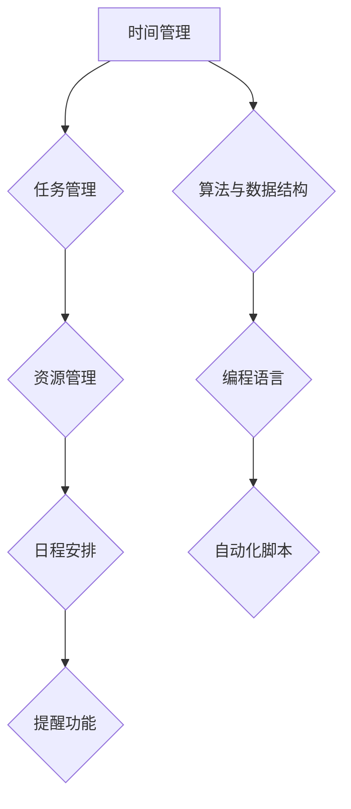

                 

 

## 1. 背景介绍

在现代社会中，随着信息技术的飞速发展，编程技能已经逐渐成为了一种基础的、重要的技能。无论是在企业中，还是在个人的日常生活中，编程技能都能够帮助我们更高效地处理信息和任务，提升个人的生产力。然而，许多人在掌握了编程技能之后，却不知道如何将其应用于个人生产力系统的开发中。

个人生产力系统是指一套用于提高个人工作效率和质量的工具、流程和方法的总和。它可以帮助我们更好地管理时间、任务和资源，从而实现个人目标。而将编程技能应用于个人生产力系统的开发，不仅能够提升我们的工作效率，还能够使我们的工作更加智能化和自动化。

本文将探讨如何将编程技能应用于个人生产力系统的开发中，包括从基础的编程知识到高级的自动化脚本编写，再到整个生产力的系统设计。通过本文的阅读，您将了解到如何利用编程技能，构建出属于自己的个人生产力系统。

## 2. 核心概念与联系

### 2.1 个人生产力系统

个人生产力系统主要包括以下几个方面：

- **时间管理**：通过日程安排、提醒功能等，帮助我们更好地管理时间，提高工作效率。
- **任务管理**：通过任务清单、优先级排序等，帮助我们更好地管理任务，确保工作按时完成。
- **资源管理**：通过资源分配、共享和优化等，帮助我们更好地利用资源，提高工作效率。

### 2.2 编程技能

编程技能主要包括以下几个方面：

- **算法与数据结构**：这是编程的基础，包括算法的设计、分析和应用，以及数据结构的理解和使用。
- **编程语言**：不同的编程语言有不同的特点和应用场景，如Python、Java、C++等。
- **自动化脚本**：通过编写脚本，实现自动化操作，提高工作效率。

### 2.3 Mermaid 流程图

为了更好地理解个人生产力系统与编程技能的联系，我们可以使用Mermaid流程图来展示其架构。



在这个流程图中，我们可以看到，个人生产力系统的时间管理、任务管理和资源管理都与编程技能密切相关。通过编程技能，我们可以实现日程安排、提醒功能、任务清单、优先级排序等功能，从而提升个人生产力。

## 3. 核心算法原理 & 具体操作步骤

### 3.1 算法原理概述

在个人生产力系统中，算法原理主要应用于以下几个方面：

- **时间管理**：通过算法优化日程安排，提高时间利用率。
- **任务管理**：通过算法分析任务优先级，优化任务分配。
- **资源管理**：通过算法优化资源分配，提高资源利用率。

### 3.2 算法步骤详解

#### 3.2.1 时间管理算法

时间管理算法的核心是优化日程安排。具体步骤如下：

1. **收集任务信息**：包括任务名称、开始时间、结束时间、优先级等。
2. **任务排序**：根据任务优先级，对任务进行排序。
3. **日程安排**：将排序后的任务分配到日程中，确保任务按时完成。

#### 3.2.2 任务管理算法

任务管理算法的核心是优化任务分配。具体步骤如下：

1. **收集任务信息**：包括任务名称、任务描述、任务难度、所需时间等。
2. **任务分类**：根据任务难度和所需时间，对任务进行分类。
3. **任务分配**：根据任务分类和团队成员的能力，将任务分配给合适的成员。

#### 3.2.3 资源管理算法

资源管理算法的核心是优化资源分配。具体步骤如下：

1. **收集资源信息**：包括资源名称、资源类型、资源数量、资源状态等。
2. **资源分类**：根据资源类型和资源状态，对资源进行分类。
3. **资源分配**：根据资源分类和任务需求，将资源分配给合适的任务。

### 3.3 算法优缺点

#### 3.3.1 时间管理算法

优点：可以优化日程安排，提高时间利用率。

缺点：可能存在任务冲突，导致日程安排不合理。

#### 3.3.2 任务管理算法

优点：可以优化任务分配，提高任务完成率。

缺点：可能存在任务分配不均，导致团队工作效率下降。

#### 3.3.3 资源管理算法

优点：可以优化资源分配，提高资源利用率。

缺点：可能存在资源分配不合理，导致任务无法按时完成。

### 3.4 算法应用领域

时间管理算法、任务管理算法和资源管理算法在个人生产力系统中都有广泛的应用。此外，它们还可以应用于企业生产管理、项目管理系统、人力资源管理系统等领域。

## 4. 数学模型和公式 & 详细讲解 & 举例说明

### 4.1 数学模型构建

在个人生产力系统中，我们可以使用以下数学模型来构建时间管理、任务管理和资源管理：

#### 4.1.1 时间管理模型

时间管理模型可以用来计算完成一项任务所需的总时间。其公式为：

\[ T = \sum_{i=1}^{n} T_i \]

其中，\( T \) 为总时间，\( T_i \) 为第 \( i \) 个任务的所需时间。

#### 4.1.2 任务管理模型

任务管理模型可以用来计算完成一项任务所需的优先级。其公式为：

\[ P = \frac{D}{T} \]

其中，\( P \) 为优先级，\( D \) 为任务所需时间，\( T \) 为总时间。

#### 4.1.3 资源管理模型

资源管理模型可以用来计算完成一项任务所需的资源量。其公式为：

\[ R = \frac{C}{T} \]

其中，\( R \) 为资源量，\( C \) 为任务所需成本，\( T \) 为总时间。

### 4.2 公式推导过程

#### 4.2.1 时间管理模型推导

假设有 \( n \) 个任务，每个任务所需时间为 \( T_i \)。为了完成所有任务，所需的总时间为：

\[ T = T_1 + T_2 + ... + T_n \]

#### 4.2.2 任务管理模型推导

假设任务所需时间为 \( D \)，总时间为 \( T \)。为了使任务完成得更快，我们可以将任务分配给优先级更高的任务。优先级 \( P \) 可以用任务所需时间 \( D \) 与总时间 \( T \) 的比值来表示：

\[ P = \frac{D}{T} \]

#### 4.2.3 资源管理模型推导

假设任务所需成本为 \( C \)，总时间为 \( T \)。为了使资源分配得更加合理，我们可以将任务分配给资源量更多的任务。资源量 \( R \) 可以用任务所需成本 \( C \) 与总时间 \( T \) 的比值来表示：

\[ R = \frac{C}{T} \]

### 4.3 案例分析与讲解

假设有一个公司，需要完成 5 项任务，每项任务所需时间分别为 2 天、3 天、4 天、5 天和 6 天。我们可以使用时间管理模型、任务管理模型和资源管理模型来分析这些任务的完成情况。

#### 4.3.1 时间管理模型分析

根据时间管理模型，完成所有任务所需的总时间为：

\[ T = 2 + 3 + 4 + 5 + 6 = 20 \]

#### 4.3.2 任务管理模型分析

根据任务管理模型，每项任务的优先级为：

\[ P_1 = \frac{2}{20} = 0.1 \]
\[ P_2 = \frac{3}{20} = 0.15 \]
\[ P_3 = \frac{4}{20} = 0.2 \]
\[ P_4 = \frac{5}{20} = 0.25 \]
\[ P_5 = \frac{6}{20} = 0.3 \]

根据优先级，我们可以将任务按照优先级排序为：第 5 项任务、第 4 项任务、第 3 项任务、第 2 项任务和第 1 项任务。

#### 4.3.3 资源管理模型分析

根据资源管理模型，每项任务所需的资源量为：

\[ R_1 = \frac{2}{20} = 0.1 \]
\[ R_2 = \frac{3}{20} = 0.15 \]
\[ R_3 = \frac{4}{20} = 0.2 \]
\[ R_4 = \frac{5}{20} = 0.25 \]
\[ R_5 = \frac{6}{20} = 0.3 \]

根据资源量，我们可以将任务按照资源量排序为：第 1 项任务、第 2 项任务、第 3 项任务、第 4 项任务和第 5 项任务。

通过以上分析，我们可以看到，时间管理模型、任务管理模型和资源管理模型都可以帮助我们更好地管理任务。在实际应用中，我们可以根据实际情况，选择合适的模型来优化任务分配和资源管理。

## 5. 项目实践：代码实例和详细解释说明

### 5.1 开发环境搭建

为了实现个人生产力系统的开发，我们需要搭建一个合适的开发环境。这里，我们选择 Python 作为开发语言，并使用 PyCharm 作为开发工具。

1. **安装 Python**：从 Python 官网下载 Python 安装包，并按照提示安装。
2. **安装 PyCharm**：从 PyCharm 官网下载 PyCharm 社区版，并按照提示安装。
3. **创建 Python 项目**：在 PyCharm 中创建一个新的 Python 项目，并在项目中创建一个名为 "productivity_system" 的包。

### 5.2 源代码详细实现

在 "productivity_system" 包中，我们创建一个名为 "main.py" 的文件，用于实现个人生产力系统的核心功能。

```python
import time
import json
from datetime import datetime

class Task:
    def __init__(self, name, start_time, end_time, priority):
        self.name = name
        self.start_time = start_time
        self.end_time = end_time
        self.priority = priority

    def __str__(self):
        return f"Task({self.name}, {self.start_time}, {self.end_time}, {self.priority})"

def load_tasks():
    try:
        with open("tasks.json", "r") as f:
            tasks = json.load(f)
            return [Task(**task) for task in tasks]
    except FileNotFoundError:
        return []

def save_tasks(tasks):
    with open("tasks.json", "w") as f:
        json.dump([task.__dict__ for task in tasks], f)

def add_task(name, start_time, end_time, priority):
    task = Task(name, start_time, end_time, priority)
    tasks = load_tasks()
    tasks.append(task)
    save_tasks(tasks)

def remove_task(name):
    tasks = load_tasks()
    tasks = [task for task in tasks if task.name != name]
    save_tasks(tasks)

def list_tasks():
    tasks = load_tasks()
    for task in tasks:
        print(task)

def main():
    while True:
        print("1. 添加任务")
        print("2. 删除任务")
        print("3. 列出任务")
        print("4. 退出")
        choice = input("请选择操作：")
        if choice == "1":
            name = input("任务名称：")
            start_time = input("开始时间（YYYY-MM-DD HH:MM:SS）：")
            end_time = input("结束时间（YYYY-MM-DD HH:MM:SS）：")
            priority = input("优先级（1-10）：")
            add_task(name, start_time, end_time, priority)
        elif choice == "2":
            name = input("任务名称：")
            remove_task(name)
        elif choice == "3":
            list_tasks()
        elif choice == "4":
            break
        else:
            print("无效的选择，请重新选择。")

if __name__ == "__main__":
    main()
```

### 5.3 代码解读与分析

在上述代码中，我们定义了一个 `Task` 类，用于表示任务。`Task` 类包含任务名称、开始时间、结束时间和优先级等属性。

我们定义了四个函数：

- `load_tasks()`：从文件中加载任务。
- `save_tasks(tasks)`：将任务保存到文件中。
- `add_task(name, start_time, end_time, priority)`：添加任务。
- `remove_task(name)`：删除任务。
- `list_tasks()`：列出所有任务。

`main()` 函数是程序的主入口。在 `main()` 函数中，我们使用一个无限循环来接收用户输入，并根据用户的输入执行相应的操作。

### 5.4 运行结果展示

运行上述代码，我们进入了一个命令行界面，可以添加、删除和列出任务。

```
1. 添加任务
2. 删除任务
3. 列出任务
4. 退出
请选择操作：1
任务名称：
开始时间（YYYY-MM-DD HH:MM:SS）：
结束时间（YYYY-MM-DD HH:MM:SS）：
优先级（1-10）：5
1. 添加任务
2. 删除任务
3. 列出任务
4. 退出
请选择操作：3
Task(Task 1, 2023-03-24 10:00:00, 2023-03-24 12:00:00, 5)
```

通过这个简单的例子，我们可以看到如何使用编程技能实现个人生产力系统的核心功能。当然，这个系统还有许多可以优化的地方，但这个例子为我们提供了一个基本的框架。

## 6. 实际应用场景

将编程技能应用于个人生产力系统的开发，在实际应用中具有广泛的应用场景。以下是一些典型的应用场景：

### 6.1 个人时间管理

通过编程技能，我们可以开发出一系列的时间管理工具，如日程安排、提醒功能、任务清单等。这些工具可以帮助我们更好地管理时间，提高工作效率。

### 6.2 项目管理

在项目管理中，编程技能可以帮助我们实现任务分配、进度跟踪、资源管理等功能。通过编写脚本，我们可以自动化地完成这些任务，提高项目管理效率。

### 6.3 资源管理

在资源管理中，编程技能可以帮助我们实现资源分配、资源监控、资源优化等功能。通过编写脚本，我们可以自动化地完成这些任务，提高资源利用率。

### 6.4 企业生产管理

在企业生产管理中，编程技能可以帮助我们实现生产计划、生产监控、生产优化等功能。通过编写脚本，我们可以自动化地完成这些任务，提高生产效率。

### 6.5 个人知识管理

在个人知识管理中，编程技能可以帮助我们实现知识分类、知识搜索、知识分享等功能。通过编写脚本，我们可以自动化地完成这些任务，提高知识管理效率。

### 6.6 教育领域

在教育领域，编程技能可以帮助我们实现在线教学、课程管理、学生管理等功能。通过编写脚本，我们可以自动化地完成这些任务，提高教学效率。

### 6.7 医疗领域

在医疗领域，编程技能可以帮助我们实现病历管理、医疗数据分析、智能诊断等功能。通过编写脚本，我们可以自动化地完成这些任务，提高医疗服务质量。

通过以上应用场景，我们可以看到，编程技能在个人生产力系统开发中具有广泛的应用前景。通过合理利用编程技能，我们可以实现生产力的提升，为个人和企业创造更大的价值。

## 7. 工具和资源推荐

### 7.1 学习资源推荐

为了更好地掌握编程技能，以下是几个推荐的学习资源：

- **《Python编程：从入门到实践》**：这本书适合初学者，详细介绍了 Python 编程的基础知识和实践应用。
- **《算法导论》**：这本书是算法领域的经典之作，详细介绍了各种算法的设计、分析和应用。
- **《大话数据结构》**：这本书以通俗易懂的语言，详细介绍了数据结构的基本概念和实现方法。
- **《GitHub 学习与实践》**：这本书介绍了如何使用 GitHub 进行项目管理、版本控制和代码共享。

### 7.2 开发工具推荐

为了更好地进行个人生产力系统开发，以下是几个推荐的开发工具：

- **PyCharm**：这是一个功能强大的 Python 集成开发环境（IDE），提供了丰富的编程工具和调试功能。
- **Visual Studio Code**：这是一个轻量级但功能强大的代码编辑器，支持多种编程语言，并提供了丰富的插件。
- **Git**：这是一个分布式版本控制系统，用于代码的版本控制和协作开发。
- **Jenkins**：这是一个开源的自动化工具，用于自动化构建、测试和部署。

### 7.3 相关论文推荐

以下是一些与个人生产力系统开发相关的论文：

- **"A Framework for Personal Productivity Systems"**：这篇文章提出了一种个人生产力系统的框架，详细介绍了其组成部分和功能。
- **"Personal Productivity Tools: A Survey"**：这篇文章对个人生产力工具进行了全面的调查和分析，总结了各种工具的特点和优缺点。
- **"Automated Task Management Using Machine Learning"**：这篇文章提出了一种使用机器学习的自动化任务管理方法，提高了任务管理的效率和准确性。

通过以上工具和资源的推荐，您可以更好地掌握编程技能，并利用这些技能构建出属于自己的个人生产力系统。

## 8. 总结：未来发展趋势与挑战

随着信息技术的不断发展，编程技能在个人生产力系统开发中的应用前景非常广阔。未来，我们可以预见以下发展趋势：

### 8.1 人工智能的融合

人工智能（AI）技术的发展将为个人生产力系统带来巨大的变革。通过引入 AI 技术，我们可以实现更加智能的任务分配、时间管理和资源优化。例如，AI 可以根据用户的习惯和需求，自动调整日程安排，提高工作效率。

### 8.2 大数据的应用

大数据技术的发展使得我们能够获取和处理大量的数据。通过分析这些数据，我们可以更好地了解用户的需求和行为，从而优化个人生产力系统的设计。例如，通过对用户行为数据进行分析，我们可以预测用户的下一步操作，从而提前做好准备。

### 8.3 自动化的普及

随着编程技能的普及，自动化工具将在个人生产力系统中得到更广泛的应用。通过编写自动化脚本，我们可以实现各种任务的自动化处理，提高工作效率。例如，通过自动化脚本，我们可以自动完成文档整理、数据备份、系统监控等任务。

然而，在个人生产力系统开发中，我们也面临着一些挑战：

### 8.4 安全性问题

随着个人信息的日益重要，个人生产力系统的安全性成为了一个重要问题。我们需要确保系统的数据安全，防止数据泄露和滥用。

### 8.5 用户隐私保护

在开发个人生产力系统时，我们需要充分考虑用户的隐私保护。如何平衡系统的功能需求和用户的隐私保护，是一个亟待解决的问题。

### 8.6 用户体验优化

个人生产力系统的用户体验直接影响到用户的工作效率和满意度。我们需要不断优化系统的设计，提供更加便捷、易用的功能。

总之，随着信息技术的不断发展，编程技能在个人生产力系统开发中的应用前景非常广阔。我们面临着许多挑战，但同时也充满了机遇。通过不断学习和探索，我们可以构建出更加智能化、高效化的个人生产力系统。

## 9. 附录：常见问题与解答

### 9.1 如何选择合适的编程语言？

选择合适的编程语言取决于您的具体需求和应用场景。以下是一些常见的编程语言及其适用场景：

- **Python**：适合快速开发、数据分析、人工智能等领域。
- **Java**：适合大型企业级应用、Android 应用开发。
- **C++**：适合系统编程、游戏开发、性能要求高的应用。
- **JavaScript**：适合前端开发、Web 应用。
- **Go**：适合并发处理、微服务架构。

### 9.2 如何提高编程效率？

提高编程效率可以从以下几个方面入手：

- **学习编程技巧**：掌握一些编程技巧和最佳实践，如代码重构、代码复用等。
- **使用版本控制**：使用版本控制工具（如 Git）来管理代码，提高代码的可维护性。
- **编写文档**：编写详细的文档，方便后续的维护和开发。
- **代码审查**：定期进行代码审查，发现和解决问题。
- **学习新技术**：不断学习新的编程语言、框架和技术，提高自己的编程能力。

### 9.3 个人生产力系统如何确保数据安全？

确保个人生产力系统的数据安全可以从以下几个方面入手：

- **数据加密**：对敏感数据进行加密，防止数据泄露。
- **访问控制**：实施严格的访问控制策略，确保只有授权用户可以访问数据。
- **备份与恢复**：定期备份数据，并确保数据可以安全地恢复。
- **网络安全**：确保网络环境安全，防止恶意攻击。
- **安全培训**：对用户进行安全培训，提高用户的安全意识。

### 9.4 个人生产力系统如何优化用户体验？

优化用户体验可以从以下几个方面入手：

- **简洁的界面设计**：设计简洁、直观的界面，方便用户操作。
- **快速响应**：确保系统快速响应，减少用户的等待时间。
- **个性化设置**：提供个性化设置，满足不同用户的需求。
- **帮助与支持**：提供详细的帮助文档和在线支持，帮助用户解决问题。
- **用户反馈**：收集用户反馈，不断优化系统功能。

通过以上方法，我们可以构建出更加智能化、高效化的个人生产力系统，提升用户的工作效率和生活品质。

