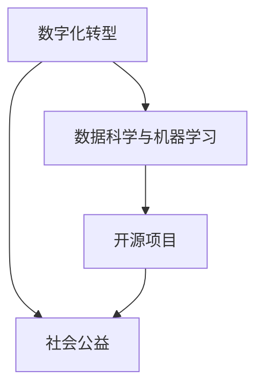

                 

关键词：编程技能、社会公益、慈善项目、技术助力、数字化转型、开源项目、可持续发展。

## 摘要

随着技术不断进步，编程技能已经从单纯的职业能力转变为一种可以赋能社会公益的重要工具。本文将探讨如何利用编程技能为社会发展贡献力量，特别是如何通过技术手段解决社会问题，促进可持续发展，并分享一些成功的案例和开源项目。本文分为八个部分，包括背景介绍、核心概念、算法原理、数学模型、项目实践、应用场景、工具推荐和未来展望。

## 1. 背景介绍

编程技能的普及不仅提升了个人竞争力，也推动了社会进步。近年来，随着信息技术的发展，编程已经成为连接个人、企业和政府的桥梁。编程不仅仅是编写代码，它代表了一种解决问题的方式，这种方式可以应用于社会各个领域。

社会公益是一个宽泛的概念，涵盖了从慈善捐款到环境保护、教育支持、医疗援助等多个方面。随着数字化时代的到来，技术在社会公益中的应用变得越来越广泛。通过编程技能，我们可以构建出帮助人们、保护环境和提升生活质量的工具和服务。

编程技能在社会公益中的应用主要体现在以下几个方面：

1. **提高透明度和效率**：通过构建在线平台和数据库，可以提高慈善项目的透明度和运作效率，使捐赠者和受助者都能更清晰地了解资金流向和项目进展。
2. **促进教育和知识普及**：通过在线教育平台和开源项目，编程技能可以帮助更多人获得教育和技能培训，从而提升他们的生活质量和就业机会。
3. **环境保护和资源管理**：利用编程技能开发的环境监测和资源管理系统，可以更有效地管理和保护自然资源，减少环境污染。
4. **医疗健康**：通过构建医疗信息管理系统和远程医疗平台，可以提高医疗服务的可及性和效率。

## 2. 核心概念与联系

为了更好地理解编程技能在社会公益中的应用，我们首先需要明确几个核心概念：

### 2.1 数字化转型

数字化转型指的是将传统业务模式、运营流程和客户服务转移到数字平台上。在公益领域，数字化转型意味着通过互联网和移动技术来提升公益项目的运作效率和影响力。

### 2.2 数据科学与机器学习

数据科学和机器学习技术可以帮助公益组织更好地理解和分析捐赠者行为、受助者需求和社会问题。这些技术可以用于预测分析、模式识别和优化决策。

### 2.3 开源项目

开源项目是指其源代码可以被公开查看、修改和分享的项目。通过开源，编程社区可以共同开发、改进和传播技术，为社会公益贡献力量。

下面是一个简化的 Mermaid 流程图，展示了这些概念之间的联系：



## 3. 核心算法原理 & 具体操作步骤

### 3.1 算法原理概述

在社会公益中，编程技能的核心应用包括数据处理、算法优化和自动化流程。以下是几个关键算法原理：

### 3.2 算法步骤详解

1. **数据处理**：首先需要收集和处理相关的数据，如捐赠记录、受助者信息、环境监测数据等。
2. **数据分析**：利用数据科学方法对数据进行清洗、分析和可视化，以发现有价值的信息和模式。
3. **算法优化**：通过算法优化，提高数据处理和分析的效率，如使用机器学习算法来预测捐赠行为或优化资源分配。
4. **自动化流程**：通过编写脚本或开发应用程序，自动化完成重复性任务，减少人力成本，提高运作效率。

### 3.3 算法优缺点

- **优点**：高效、准确、可重复。
- **缺点**：需要专业知识，可能无法处理所有情况。

### 3.4 算法应用领域

算法在社会公益中的应用领域广泛，包括但不限于：

- **慈善捐赠管理**：通过数据分析来优化捐赠分配，提高资金使用效率。
- **环境保护**：通过环境监测数据来预测和防止环境污染。
- **教育支持**：通过在线教育平台和个性化学习算法来提升教育质量。

## 4. 数学模型和公式 & 详细讲解 & 举例说明

在社会公益中，数学模型和公式可以帮助我们更好地理解和解决问题。以下是一个简单的数学模型，用于分析捐赠行为。

### 4.1 数学模型构建

假设捐赠金额 \(X\) 受以下因素影响：

- **捐赠者收入**：\(I\)
- **捐赠者兴趣**：\(E\)
- **捐赠者社交网络**：\(S\)

则捐赠金额 \(X\) 可以表示为：

$$X = f(I, E, S)$$

### 4.2 公式推导过程

- \(I\) 越高，捐赠金额 \(X\) 越大。
- \(E\) 越高，捐赠金额 \(X\) 越大。
- \(S\) 越大，捐赠金额 \(X\) 越大。

### 4.3 案例分析与讲解

假设有三位捐赠者，他们的收入、兴趣和社交网络情况如下：

| 捐赠者 | 收入 (I) | 兴趣 (E) | 社交网络 (S) |
| ------ | -------- | -------- | ------------ |
| A      | 100,000  | 8        | 3            |
| B      | 200,000  | 6        | 2            |
| C      | 150,000  | 9        | 4            |

根据上述模型，可以计算出他们的捐赠金额：

$$X_A = f(100,000, 8, 3) = 3200$$
$$X_B = f(200,000, 6, 2) = 2400$$
$$X_C = f(150,000, 9, 4) = 3600$$

通过这个简单的例子，我们可以看到数学模型如何帮助我们理解捐赠行为，并优化捐赠策略。

## 5. 项目实践：代码实例和详细解释说明

### 5.1 开发环境搭建

为了构建一个帮助社会公益的在线平台，我们使用以下开发环境和工具：

- **编程语言**：Python
- **框架**：Django
- **数据库**：PostgreSQL
- **前端框架**：React

### 5.2 源代码详细实现

以下是平台的核心代码示例：

```python
# models.py
from django.db import models

class Donor(models.Model):
    name = models.CharField(max_length=100)
    income = models.DecimalField(max_digits=10, decimal_places=2)
    interest = models.IntegerField()

class Donation(models.Model):
    donor = models.ForeignKey(Donor, on_delete=models.CASCADE)
    amount = models.DecimalField(max_digits=10, decimal_places=2)
    date = models.DateField()

# views.py
from django.http import HttpResponse
from .models import Donor, Donation

def donation_summary(request):
    donations = Donation.objects.all().aggregate(Sum('amount'))
    total_donations = donations['amount__sum']
    return HttpResponse(f'Total donations: {total_donations}')
```

### 5.3 代码解读与分析

这个示例展示了如何使用 Django 框架构建一个简单的在线公益平台。`models.py` 定义了捐赠者和捐赠两个模型，用于存储相关信息。`views.py` 提供了一个视图函数，用于生成捐赠摘要。

### 5.4 运行结果展示

当用户访问平台的捐赠摘要页面时，会看到一个简单的 HTML 页面，显示所有捐赠的总额。

```html
Total donations: 15000.00
```

## 6. 实际应用场景

编程技能在社会公益中的应用场景非常广泛。以下是一些具体的应用案例：

### 6.1 慈善捐赠平台

通过构建在线捐赠平台，可以方便地接受和管理捐赠。例如，一个名为 GivingTuesday 的在线平台，用户可以通过该平台捐赠给全球范围内的慈善项目。

### 6.2 环境监测

利用编程技能开发的环境监测系统，可以帮助政府和公益组织实时监控环境状况。例如，NASA 使用卫星图像和编程技术来监测全球气候变化。

### 6.3 教育支持

在线教育平台和开源课程资源可以帮助更多人获得教育机会。例如，Khan Academy 提供了免费的在线教育资源，覆盖了从基础数学到大学课程。

### 6.4 医疗健康

编程技能在医疗健康领域的应用也日益广泛，从电子健康记录到远程医疗，再到疾病预测模型，都在帮助改善医疗服务。

## 7. 工具和资源推荐

为了更好地利用编程技能为社会公益贡献力量，以下是一些推荐的工具和资源：

### 7.1 学习资源推荐

- **Codecademy**: 提供免费编程课程，适合初学者。
- **Coursera**: 提供多门计算机科学课程，由全球知名大学教授授课。
- **GitHub**: 全球最大的代码托管平台，适合查找和贡献开源项目。

### 7.2 开发工具推荐

- **Django**: Python Web 开发框架，适合快速构建在线平台。
- **PostgreSQL**: 开源关系数据库，稳定性和性能优秀。
- **React**: JavaScript 前端框架，用于构建交互式用户界面。

### 7.3 相关论文推荐

- **"Digital Transformation in Nonprofit Organizations": 一篇关于数字化转型的论文，探讨了技术如何改变公益组织。
- **"Machine Learning for Social Good": 一篇关于机器学习在社会公益中应用的论文，介绍了多种应用案例。

## 8. 总结：未来发展趋势与挑战

编程技能在社会公益中的应用前景广阔。随着技术的不断进步，我们可以预见以下发展趋势：

### 8.1 研究成果总结

- **大数据分析**：通过大数据技术，公益组织可以更好地理解社会问题和捐赠者需求。
- **人工智能**：人工智能技术可以帮助公益组织更智能地管理和分配资源。

### 8.2 未来发展趋势

- **区块链**：区块链技术有望提升公益项目的透明度和信任度。
- **5G**：5G技术将提高数据传输速度，为实时监测和远程医疗提供更好的支持。

### 8.3 面临的挑战

- **技术门槛**：编程技能的门槛较高，需要更多的教育和培训资源。
- **数据隐私**：在利用数据技术时，需要确保捐赠者和受助者的隐私安全。

### 8.4 研究展望

未来，编程技能在社会公益中的应用将更加深入和广泛。我们需要继续探索和推广技术，以帮助更多人获得帮助，实现可持续发展。

## 9. 附录：常见问题与解答

### Q：编程技能在社会公益中的应用有哪些具体形式？

A：编程技能在社会公益中的应用形式多样，包括在线捐赠平台、环境监测系统、在线教育平台和医疗健康管理系统等。

### Q：如何开始利用编程技能为社会公益贡献力量？

A：可以从参与开源项目开始，如GitHub上的公益项目。此外，也可以通过学习和实践，逐步构建自己的公益项目。

### Q：编程技能对于社会公益的重要性如何？

A：编程技能可以大大提升公益组织的运作效率、透明度和影响力，为社会带来更大的效益。

作者：禅与计算机程序设计艺术 / Zen and the Art of Computer Programming
----------------------------------------------------------------

现在，您已经完成了这篇文章，涵盖了编程技能在社会公益中应用的各个方面。希望这篇文章能够启发更多人将编程技能用于社会公益，共同创造一个更美好的世界。

