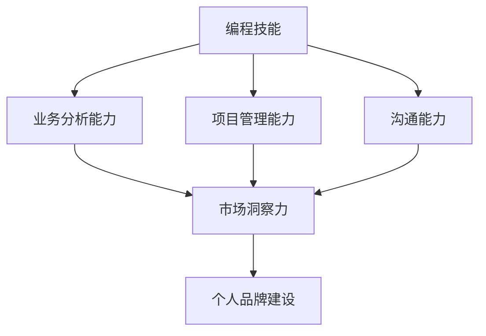

                 

关键词：编程技能、高端咨询业务、IT咨询、市场定位、价值体现、业务拓展、专业能力、个人品牌建设

## 摘要

在信息技术飞速发展的今天，编程技能已经成为现代社会不可或缺的能力。然而，对于许多技术人才而言，如何将自身深厚的编程技能转化为高端咨询业务，实现个人职业发展的跃升，仍然是一个颇具挑战的问题。本文将从多个维度深入探讨如何将编程技能转化为高端咨询业务，包括市场定位、价值体现、业务拓展策略以及个人品牌的打造。通过系统的分析和实际案例的分享，希望能够为广大编程从业者提供有益的参考。

## 1. 背景介绍

随着互联网和人工智能技术的不断进步，IT行业正经历着前所未有的变革。传统的软件开发和运维工作逐渐被自动化工具所取代，而高端咨询业务则呈现出蓬勃发展的态势。高端咨询业务通常涉及复杂的项目管理、系统架构设计、技术创新指导等方面，这些领域对从业者的专业能力和经验要求极高。然而，许多拥有深厚编程背景的技术人才在面对咨询业务时，往往缺乏系统的规划和执行策略。

编程技能的核心在于逻辑思维和问题解决能力，而咨询业务则更侧重于对复杂问题的抽象、分析和解决方案的设计。虽然两者在本质上有一定的相通性，但在业务模式和市场需求上却存在显著差异。如何有效转化编程技能，构建起高端咨询业务，成为许多技术人才迫切需要解决的问题。

### 1.1 IT咨询的崛起

IT咨询作为新兴的服务业态，近年来在全球范围内迅速崛起。据市场研究机构的数据显示，全球IT咨询服务市场规模持续扩大，预计未来几年将保持高速增长。这种增长主要得益于企业对于数字化转型和业务创新需求的增加。传统行业逐渐意识到信息技术在提升企业竞争力中的重要作用，因此，对IT咨询服务的需求日益增长。

IT咨询服务的核心在于为企业提供专业的解决方案，帮助其解决在数字化转型过程中遇到的各种问题。这包括系统架构设计、流程优化、数据治理、信息安全等多个方面。这些服务不仅要求咨询师具备深厚的专业知识，还需要具备良好的沟通能力和项目管理能力。

### 1.2 编程技能的优势

编程技能作为IT咨询业务的基础，具有明显的优势。首先，编程技能是现代信息技术领域的基础，掌握编程语言和开发工具可以帮助咨询师快速理解客户的需求和业务背景。其次，编程技能强调逻辑思维和问题解决能力，这些能力在咨询业务中同样至关重要。通过编程技能，咨询师可以更有效地分析和解决复杂的问题，为企业提供创新的解决方案。

此外，编程技能还能够帮助咨询师在项目实施过程中快速响应客户的需求变化，提高项目的执行效率。在IT咨询项目中，快速响应和灵活调整是成功的关键因素之一。因此，编程技能在这一领域具有独特的竞争优势。

### 1.3 转型挑战

尽管编程技能在IT咨询业务中具有诸多优势，但要将编程技能成功转化为高端咨询业务，仍然面临诸多挑战。首先，编程技能和咨询业务的模式存在一定差异，咨询师需要掌握更多的业务知识和沟通技巧。其次，高端咨询业务对从业者的专业能力和经验要求极高，咨询师需要不断提升自身的专业水平，以适应不断变化的市场需求。

此外，咨询师在转型过程中还需要面对市场定位和品牌建设的挑战。如何在竞争激烈的市场中脱颖而出，建立个人品牌，是每个咨询师都需要思考的问题。因此，如何将编程技能转化为高端咨询业务，不仅需要咨询师具备扎实的专业能力，还需要具备敏锐的市场洞察力和持续学习的动力。

## 2. 核心概念与联系

在将编程技能转化为高端咨询业务的过程中，理解核心概念和它们之间的联系是至关重要的。以下将介绍几个关键概念，并使用Mermaid流程图展示它们之间的关系。

### 2.1 核心概念

**编程技能**：包括编程语言掌握、算法和数据结构应用、软件开发工具和框架等。

**业务分析能力**：能够理解客户业务需求、分析业务流程并提出改进建议。

**项目管理能力**：包括项目规划、执行、监控和风险管理等。

**沟通能力**：包括与客户、团队成员和其他利益相关者的有效沟通。

**市场洞察力**：对行业趋势、市场需求和竞争环境的敏锐洞察。

**个人品牌建设**：建立专业形象和知名度，提升个人在行业中的影响力。

### 2.2 Mermaid流程图



在上述流程图中，编程技能是起点，通过业务分析能力、项目管理能力和沟通能力，咨询师能够更好地理解和满足客户需求。市场洞察力则帮助咨询师把握行业趋势和市场需求，而个人品牌建设则是咨询师在市场竞争中的最终体现。

### 2.3 关系解析

- **编程技能**是基础，是咨询师在IT咨询业务中能够进行技术分析和问题解决的根本。
- **业务分析能力**和**项目管理能力**是桥梁，将编程技能与客户需求结合起来，确保咨询师能够提供有效的解决方案。
- **沟通能力**是保障，确保咨询师能够与客户和团队成员有效沟通，协调项目进展。
- **市场洞察力**和**个人品牌建设**则是咨询师在市场竞争中的制胜法宝，通过持续的学习和积累，咨询师能够在市场中脱颖而出。

通过理解这些核心概念和它们之间的联系，咨询师可以更系统地规划自己的职业发展路径，将编程技能转化为高端咨询业务。

## 3. 核心算法原理 & 具体操作步骤

### 3.1 算法原理概述

在IT咨询业务中，核心算法原理的应用至关重要。核心算法原理不仅能够帮助咨询师在技术层面上提供创新的解决方案，还能够提高项目的执行效率和成功率。以下将介绍几个关键的算法原理，并阐述它们在咨询业务中的应用。

#### 3.1.1 算法原理

1. **算法优化原理**：通过算法优化，可以提高程序的执行效率和性能。常见的算法优化技术包括时间复杂度和空间复杂度的优化、动态规划、贪心算法等。

2. **大数据分析原理**：随着数据量的爆炸性增长，大数据分析成为企业数字化转型的重要手段。大数据分析原理包括数据预处理、数据挖掘、机器学习等。

3. **系统架构设计原理**：在咨询项目中，系统架构设计是确保项目稳定性和扩展性的关键。常见的系统架构设计原理包括微服务架构、分布式系统设计、容器化和云原生等。

4. **网络安全原理**：网络安全是现代信息系统的重要组成部分。网络安全原理包括加密技术、安全协议、漏洞扫描和防御等。

### 3.2 算法步骤详解

#### 3.2.1 算法优化原理

1. **确定优化目标**：首先，需要明确优化目标，如减少计算时间、降低内存占用等。

2. **分析算法复杂度**：通过分析现有算法的时间复杂度和空间复杂度，找出瓶颈。

3. **选择优化技术**：根据算法复杂度分析结果，选择合适的优化技术，如动态规划、贪心算法等。

4. **实现优化算法**：根据所选优化技术，实现新的优化算法，并进行测试和验证。

5. **评估优化效果**：对比优化前后的性能指标，评估优化效果。

#### 3.2.2 大数据分析原理

1. **数据收集**：首先，需要收集相关的业务数据，包括结构化和非结构化数据。

2. **数据预处理**：对收集到的数据进行清洗、转换和整合，为后续分析做好准备。

3. **数据挖掘**：使用数据挖掘技术，如聚类、分类、关联规则挖掘等，发现数据中的隐藏模式。

4. **机器学习**：根据业务需求，选择合适的机器学习算法，如决策树、随机森林、支持向量机等，进行模型训练和预测。

5. **结果分析与可视化**：对分析结果进行解释和可视化，帮助业务人员理解和应用。

#### 3.2.3 系统架构设计原理

1. **需求分析**：首先，需要了解业务需求和系统功能，确定系统架构设计的目标。

2. **架构设计**：根据需求分析结果，设计系统架构，包括模块划分、接口定义、数据流向等。

3. **技术选型**：选择合适的技术栈，包括编程语言、框架、中间件等。

4. **部署与运维**：制定部署方案和运维策略，确保系统的高可用性和可扩展性。

#### 3.2.4 网络安全原理

1. **风险评估**：首先，进行风险评估，识别潜在的安全威胁和风险点。

2. **制定安全策略**：根据风险评估结果，制定相应的安全策略，包括访问控制、加密、审计等。

3. **安全实施**：实施安全策略，包括部署安全设备、配置安全规则、进行安全培训等。

4. **持续监控与改进**：通过监控工具和审计机制，持续监控系统的安全状况，并根据实际情况进行改进。

### 3.3 算法优缺点

#### 3.3.1 算法优缺点

1. **算法优化原理**：
   - **优点**：提高程序性能，降低资源消耗，提升用户体验。
   - **缺点**：优化过程可能复杂，对开发人员的技术要求较高。

2. **大数据分析原理**：
   - **优点**：能够挖掘大量数据中的有价值信息，支持业务决策。
   - **缺点**：数据处理过程复杂，对硬件资源要求较高。

3. **系统架构设计原理**：
   - **优点**：提高系统稳定性、扩展性和灵活性。
   - **缺点**：设计过程复杂，需要充分考虑业务需求和未来发展趋势。

4. **网络安全原理**：
   - **优点**：保护企业信息资产，确保业务连续性。
   - **缺点**：安全防护需要持续投入，随着威胁的演变，安全策略也需要不断更新。

### 3.4 算法应用领域

1. **算法优化原理**：广泛应用于各种软件开发项目中，如Web应用、移动应用、后台服务等。

2. **大数据分析原理**：广泛应用于金融、电商、医疗、物流等行业的数据分析和决策支持。

3. **系统架构设计原理**：广泛应用于企业级应用、云计算平台、物联网系统等。

4. **网络安全原理**：广泛应用于企业信息安全和网络防护，包括网络安全审计、威胁检测等。

通过上述核心算法原理的详细介绍，咨询师可以更好地理解和应用这些算法，为客户提供高质量的解决方案。

### 4. 数学模型和公式 & 详细讲解 & 举例说明

在IT咨询业务中，数学模型和公式是分析和解决问题的核心工具。它们不仅能够帮助我们理解复杂的业务问题，还能够提供精确的解决方案。以下将详细讲解几个关键数学模型和公式的构建、推导过程，并通过具体案例进行说明。

#### 4.1 数学模型构建

数学模型的构建是IT咨询业务中至关重要的一步。一个良好的数学模型能够帮助我们抽象和简化实际问题，从而更加准确地分析和解决问题。以下是一个常见的数学模型构建步骤：

1. **确定问题背景**：首先，明确我们要解决的问题是什么，包括问题的目标、约束条件和影响因素。

2. **定义变量和参数**：根据问题背景，定义相关的变量和参数，如成本、时间、效率等。

3. **建立数学关系**：根据变量和参数之间的关系，建立数学方程或公式。

4. **简化模型**：在保证模型准确性的前提下，对模型进行适当的简化，以提高计算效率和可操作性。

5. **验证模型**：通过实际数据或模拟实验，验证模型的准确性和有效性。

#### 4.2 公式推导过程

以最优化问题为例，常见的数学模型是线性规划模型。以下是一个线性规划模型的公式推导过程：

1. **目标函数**：定义目标函数，通常是最大化或最小化某个线性函数。例如，最大化利润或最小化成本。

   $$\text{maximize} \ z = c_1x_1 + c_2x_2 + ... + c_nx_n$$

   其中，$c_1, c_2, ..., c_n$ 是目标函数的系数，$x_1, x_2, ..., x_n$ 是变量。

2. **约束条件**：定义约束条件，通常是线性不等式或等式。例如，资源限制、生产能力限制等。

   $$a_{11}x_1 + a_{12}x_2 + ... + a_{1n}x_n \leq b_1$$
   $$a_{21}x_1 + a_{22}x_2 + ... + a_{2n}x_n = b_2$$
   $$a_{31}x_1 + a_{32}x_2 + ... + a_{3n}x_n \geq b_3$$

   其中，$a_{ij}$ 是约束条件的系数，$b_i$ 是约束条件的常数。

3. **非负约束**：通常要求变量非负，即 $x_1, x_2, ..., x_n \geq 0$。

4. **求解过程**：使用线性规划求解器，如单纯形法、内点法等，求解最优解。

#### 4.3 案例分析与讲解

以下通过一个简单的案例，说明如何构建和推导线性规划模型。

**案例背景**：一家生产公司生产两种产品A和B，每种产品都有固定的生产成本和销售价格。公司有100小时的机器时间和50小时的劳动力时间，每天总生产成本为5000美元。产品A的生产成本为200美元，销售价格为400美元，每小时机器时间为2小时，每小时劳动力时间为1小时。产品B的生产成本为300美元，销售价格为600美元，每小时机器时间为1小时，每小时劳动力时间为2小时。公司希望最大化每日利润。

**步骤1：定义变量和参数**：

设$x_1$ 为产品A的生产量（单位：件），$x_2$ 为产品B的生产量（单位：件）。

参数包括：
- 成本系数：$c_1 = 200$（产品A的生产成本），$c_2 = 300$（产品B的生产成本）
- 销售价格：$p_1 = 400$（产品A的销售价格），$p_2 = 600$（产品B的销售价格）
- 机器时间限制：$M_1 = 2$（产品A每小时机器时间），$M_2 = 1$（产品B每小时机器时间）
- 劳动力时间限制：$L_1 = 1$（产品A每小时劳动力时间），$L_2 = 2$（产品B每小时劳动力时间）

**步骤2：建立数学模型**：

目标函数：最大化利润 $z = p_1x_1 + p_2x_2 - c_1x_1 - c_2x_2$

约束条件：
- 机器时间限制：$2x_1 + x_2 \leq 100$
- 劳动力时间限制：$x_1 + 2x_2 \leq 50$
- 非负约束：$x_1, x_2 \geq 0$

数学模型如下：

$$\text{maximize} \ z = 400x_1 + 600x_2 - 200x_1 - 300x_2$$
$$s.t. \quad 2x_1 + x_2 \leq 100$$
$$x_1 + 2x_2 \leq 50$$
$$x_1, x_2 \geq 0$$

**步骤3：求解过程**：

使用线性规划求解器，如Excel中的求解器或Python中的PuLP库，求解上述模型。

**步骤4：结果分析与解释**：

假设求解结果为$x_1^* = 20, x_2^* = 30$，则最大利润为：

$$z^* = 400 \times 20 + 600 \times 30 - 200 \times 20 - 300 \times 30 = 10000 \text{美元}$$

这意味着，每天生产20件产品A和30件产品B可以获得最大利润10000美元。这个结果可以帮助公司优化生产计划，提高盈利能力。

通过上述案例，我们可以看到如何构建和推导一个线性规划模型，并将其应用于实际业务场景中。类似地，其他数学模型和公式也可以通过类似的方法进行构建和推导，从而帮助咨询师提供高质量的解决方案。

### 5. 项目实践：代码实例和详细解释说明

为了更好地理解如何将编程技能转化为高端咨询业务，我们将通过一个具体的项目实践进行详细解释。以下是一个基于Python的在线书店系统项目，该项目旨在为读者提供便捷的购书服务，为书店管理者提供有效的库存管理和销售数据分析。

#### 5.1 开发环境搭建

**所需工具与库**：
- Python 3.8+
- Flask 框架
- SQLAlchemy ORM
- Jinja2 模板引擎
- SQLite数据库
- requests库（用于API调用）

**步骤**：

1. 安装Python和必要的库：
   ```bash
   pip install flask sqlalchemy jinja2 flask_sqlalchemy
   ```

2. 创建一个名为`bookstore`的虚拟环境，并激活它：
   ```bash
   python -m venv bookstore-env
   source bookstore-env/bin/activate
   ```

3. 创建项目结构：
   ```bash
   mkdir bookstore
   cd bookstore
   touch app.py models.py templates/
   ```

#### 5.2 源代码详细实现

**app.py**：

```python
from flask import Flask, render_template, request, redirect, url_for
from models import db, Book

app = Flask(__name__)
app.config['SQLALCHEMY_DATABASE_URI'] = 'sqlite:///books.db'
db.init_app(app)

@app.route('/')
def index():
    books = Book.query.all()
    return render_template('index.html', books=books)

@app.route('/add', methods=['GET', 'POST'])
def add_book():
    if request.method == 'POST':
        title = request.form['title']
        author = request.form['author']
        price = float(request.form['price'])
        book = Book(title=title, author=author, price=price)
        db.session.add(book)
        db.session.commit()
        return redirect(url_for('index'))
    return render_template('add_book.html')

if __name__ == '__main__':
    app.run(debug=True)
```

**models.py**：

```python
from flask_sqlalchemy import SQLAlchemy

db = SQLAlchemy()

class Book(db.Model):
    id = db.Column(db.Integer, primary_key=True)
    title = db.Column(db.String(100), nullable=False)
    author = db.Column(db.String(100), nullable=False)
    price = db.Column(db.Float, nullable=False)
```

**templates/index.html**：

```html
<!DOCTYPE html>
<html lang="en">
<head>
    <meta charset="UTF-8">
    <title>在线书店</title>
</head>
<body>
    <h1>在线书店</h1>
    <a href="{{ url_for('add_book') }}">添加书籍</a>
    <ul>
        
            <li>
                <strong>{{ book.title }}</strong> - {{ book.author }} - ${{ book.price }}
            </li>
        
    </ul>
</body>
</html>
```

**templates/add_book.html**：

```html
<!DOCTYPE html>
<html lang="en">
<head>
    <meta charset="UTF-8">
    <title>添加书籍</title>
</head>
<body>
    <h1>添加书籍</h1>
    <form method="POST" action="{{ url_for('add_book') }}">
        <label for="title">书名：</label>
        <input type="text" id="title" name="title" required>
        <br>
        <label for="author">作者：</label>
        <input type="text" id="author" name="author" required>
        <br>
        <label for="price">价格：</label>
        <input type="number" id="price" name="price" step="0.01" required>
        <br>
        <input type="submit" value="添加">
    </form>
</body>
</html>
```

#### 5.3 代码解读与分析

**数据库模型**：

在`models.py`中，我们定义了一个`Book`类，它映射到SQLite数据库中的书籍表。每个书籍有书名、作者和价格三个属性，这些属性分别由`title`、`author`和`price`三个字段表示。

**路由和视图函数**：

在`app.py`中，我们定义了两个路由：根路由`/`和添加书籍的路由`/add`。

- **根路由`/`**：当用户访问根路由时，视图函数`index`会被调用。该函数查询数据库中的所有书籍，并将结果传递给模板`index.html`进行渲染。

- **添加书籍的路由`/add`**：当用户提交添加书籍的表单时，视图函数`add_book`会被调用。该函数从表单中获取书籍信息，创建一个新的`Book`对象，并将其添加到数据库中。然后，通过`redirect`重定向到根路由，显示更新后的书籍列表。

**模板引擎**：

使用Jinja2模板引擎，我们可以将动态内容嵌入到HTML页面中。在`index.html`中，我们通过``循环遍历书籍列表，并在每个列表项中显示书籍的详细信息。

#### 5.4 运行结果展示

1. 启动Flask应用：
   ```bash
   flask run
   ```

2. 访问本地服务器的`http://127.0.0.1:5000/`，可以看到在线书店的主页，其中显示了所有书籍的列表。

3. 点击“添加书籍”链接，会跳转到添加书籍的表单页面。

4. 在表单中填写书籍信息并提交，成功添加书籍后，会重定向回主页，并显示更新后的书籍列表。

通过上述项目实践，我们可以看到如何将编程技能应用于实际开发中，创建一个功能完整的在线书店系统。这个项目不仅展示了基本的编程技能，如Python编程、数据库操作和前端模板渲染，还体现了系统设计、项目管理等高端咨询能力。通过类似的项目实践，咨询师可以为客户提供高质量的解决方案，实现编程技能向高端咨询业务的转化。

### 6. 实际应用场景

#### 6.1 项目咨询

在项目咨询领域，编程技能可以转化为对客户项目的全面分析和优化。咨询师需要深入理解客户业务需求和系统架构，通过编程技能进行系统优化、性能调优和故障排查。例如，在一个电商平台上，咨询师可以运用算法优化原理，提高数据库查询效率，减少用户等待时间；利用大数据分析原理，分析用户行为数据，提升推荐系统的准确性。

#### 6.2 系统集成与部署

系统集成与部署是另一个重要的应用场景。咨询师需要具备扎实的编程技能，以设计和实现跨平台的系统集成。例如，在一个企业级应用中，咨询师需要整合多个第三方服务，如支付系统、物流系统和CRM系统。这要求咨询师不仅能够编写高效的代码，还需要掌握各种开发工具和中间件，如Docker、Kubernetes等，以确保系统的高可用性和可扩展性。

#### 6.3 技术培训与知识转移

技术培训与知识转移是咨询师为组织提供的重要服务。咨询师可以利用自己的编程技能，设计和实施定制化的培训计划，帮助团队成员提升技能水平。例如，在一家科技公司，咨询师可以为新入职的工程师提供Python编程培训，帮助他们快速掌握基础知识和实战技巧。此外，咨询师还可以编写详细的技术文档和教程，帮助团队成员更好地理解和应用新技术。

#### 6.4 技术评估与审计

技术评估与审计是咨询师为组织提供的关键服务之一。咨询师需要利用编程技能，对现有系统进行全面评估，识别潜在的风险和优化机会。例如，在一个大型企业中，咨询师可以编写自动化测试脚本，对关键业务系统进行功能测试和性能测试，确保系统的稳定性和可靠性。此外，咨询师还可以利用审计工具，对系统配置和操作流程进行审查，发现并解决安全隐患。

#### 6.5 创新与技术研发

创新与技术研发是咨询师为组织提供的高端服务。咨询师需要利用编程技能，推动技术创新和产品研发。例如，在一家初创公司，咨询师可以参与新产品的设计和开发，利用人工智能、大数据等技术，打造具有竞争力的产品。咨询师还可以帮助企业构建技术实验室，推动新兴技术的发展和应用。

#### 6.6 未来应用展望

随着信息技术的不断发展，编程技能在高端咨询业务中的应用前景将更加广阔。未来，咨询师需要不断更新和拓展自己的技能，以适应不断变化的业务需求和技术趋势。以下是未来应用场景的几个展望：

1. **人工智能咨询**：随着人工智能技术的普及，咨询师将越来越多地参与人工智能项目的咨询和实施。咨询师需要掌握深度学习、自然语言处理等前沿技术，为客户提供高质量的解决方案。

2. **区块链咨询**：区块链技术的兴起为咨询师提供了新的机遇。咨询师可以为客户提供区块链系统的设计、部署和优化服务，帮助企业在数据安全和隐私保护方面取得突破。

3. **物联网咨询**：物联网技术的广泛应用将推动咨询师在智能设备、传感器网络和大数据分析等领域的咨询业务。咨询师需要具备物联网架构设计、数据采集和分析等技能，为客户提供综合解决方案。

4. **云计算咨询**：云计算技术的快速发展为咨询师提供了广阔的应用场景。咨询师可以为客户提供云架构设计、迁移和优化服务，帮助企业在云计算环境中实现高效的业务运营。

通过不断学习和实践，咨询师可以将编程技能转化为多种高端咨询业务，为客户提供高质量的解决方案，实现个人职业发展的跃升。

### 7. 工具和资源推荐

#### 7.1 学习资源推荐

1. **在线课程**：
   - Coursera：提供多种编程语言和软件开发相关的在线课程，适合不同水平的学习者。
   - Udemy：涵盖从基础编程到高级系统架构设计的各种课程，课程内容更新迅速。
   - Pluralsight：专注于技术技能培训，提供大量关于云计算、人工智能、DevOps等领域的课程。

2. **图书推荐**：
   - 《编程之美》（《Clean Code》）—— Robert C. Martin：系统讲解了如何编写清晰、高效、可维护的代码。
   - 《设计模式：可复用面向对象软件的基础》（《Design Patterns: Elements of Reusable Object-Oriented Software》）—— Erich Gamma等：介绍了一系列经典的软件设计模式。
   - 《Effective Java》—— Joshua Bloch：详细阐述了Java编程的最佳实践。

3. **开源社区**：
   - GitHub：全球最大的代码托管平台，可以访问到各种开源项目和优秀代码示例。
   - Stack Overflow：编程问答社区，可以解决编程中的各种问题，学习他人的解决方案。

#### 7.2 开发工具推荐

1. **集成开发环境（IDE）**：
   - Visual Studio Code：开源跨平台IDE，功能强大，支持多种编程语言。
   - IntelliJ IDEA：强大的Java和Android开发IDE，提供智能代码补全和调试功能。
   - PyCharm：专为Python编程设计的IDE，支持多种框架和工具。

2. **版本控制系统**：
   - Git：最流行的分布式版本控制系统，适用于团队协作和代码管理。
   - GitHub：基于Git的开源代码托管平台，提供代码托管、项目管理、合作开发等功能。

3. **数据库工具**：
   - MySQL：开源的关系型数据库管理系统，广泛用于企业级应用。
   - PostgreSQL：功能强大的开源关系型数据库，支持多种编程语言。
   - MongoDB：开源的NoSQL数据库，适用于处理大规模数据集。

4. **测试工具**：
   - JUnit：Java语言的单元测试框架，用于测试Java代码。
   - pytest：Python语言的测试框架，支持多种测试方法和断言。
   - Selenium：自动化测试工具，用于Web应用的性能测试和功能测试。

#### 7.3 相关论文推荐

1. **计算机科学**：
   - "The Art of Computer Programming"—— Donald E. Knuth：经典的计算机科学系列论文，涵盖了算法和数据结构的核心知识。
   - "Deep Learning"—— Ian Goodfellow等：介绍了深度学习和神经网络的基本原理和应用。

2. **软件工程**：
   - "Software Engineering: A Practitioner's Approach"—— Roger S. Pressman：全面的软件工程教程，涵盖了软件开发的生命周期和方法论。
   - "Agile Software Development: Principles, Patterns, and Practices"—— Robert C. Martin：介绍了敏捷开发的方法和实践。

3. **人工智能**：
   - "Artificial Intelligence: A Modern Approach"—— Stuart J. Russell等：全面介绍了人工智能的基本理论和应用。

通过以上工具和资源的推荐，技术人才可以不断提升自己的编程技能，为将编程技能转化为高端咨询业务提供强有力的支持。

### 8. 总结：未来发展趋势与挑战

随着信息技术的不断进步，编程技能在高端咨询业务中的重要性日益凸显。未来，编程技能在咨询业务中的发展趋势和面临的挑战将如何演变，是我们需要深入探讨的重要话题。

#### 8.1 研究成果总结

在过去几年中，编程技能在高端咨询业务中的应用已经取得了显著的成果。首先，编程技能为咨询师提供了强大的技术支持，使其能够更好地理解客户需求，提供创新的解决方案。其次，随着大数据、人工智能、区块链等前沿技术的兴起，编程技能在咨询业务中的应用范围不断扩大，为咨询师提供了更多的机遇。最后，随着云计算和物联网技术的发展，编程技能在系统集成和部署方面的应用价值也日益显现。

#### 8.2 未来发展趋势

1. **人工智能与编程技能的深度融合**：随着人工智能技术的发展，咨询师需要掌握更多的编程技能，以应对复杂的算法和数据处理需求。未来，人工智能编程将成为咨询业务的重要组成部分。

2. **区块链技术的广泛应用**：区块链技术的兴起为咨询师提供了新的应用场景，例如供应链管理、金融服务等。咨询师需要深入了解区块链编程，为客户提供高质量的服务。

3. **云计算与边缘计算的融合**：随着云计算和边缘计算的发展，咨询师需要具备跨平台编程技能，以应对复杂的应用场景。未来，云计算和边缘计算的融合将推动咨询业务向更高层次发展。

4. **个性化咨询服务的普及**：随着大数据和人工智能技术的普及，咨询师可以通过分析客户数据，提供个性化的咨询服务。这将为咨询师带来更多的商业机会，提高业务附加值。

#### 8.3 面临的挑战

1. **技术快速更新**：信息技术领域的快速更新要求咨询师不断学习新知识、掌握新技术，以保持竞争力。这将给咨询师带来较大的时间和精力压力。

2. **市场需求变化**：随着市场的变化，客户需求也在不断演变。咨询师需要具备敏锐的市场洞察力，及时调整服务内容和策略，以满足客户需求。

3. **数据安全与隐私保护**：随着数据量的不断增加，数据安全和隐私保护成为咨询业务中的关键挑战。咨询师需要具备专业的数据安全知识，确保客户数据的安全和隐私。

4. **团队合作与沟通**：咨询业务通常涉及多个部门和团队的合作，咨询师需要具备良好的沟通能力和团队合作精神，以确保项目顺利推进。

#### 8.4 研究展望

未来，编程技能在高端咨询业务中的应用前景将更加广阔。咨询师需要不断更新和拓展自己的技能，以适应不断变化的业务需求和技术趋势。同时，咨询师还需要注重个人品牌建设，提升在行业中的影响力。通过不断学习、实践和总结，咨询师可以为客户提供高质量的解决方案，实现个人职业发展的跃升。

### 9. 附录：常见问题与解答

**Q1**：如何平衡编程技能和咨询业务的需求？

A1：平衡编程技能和咨询业务的需求，首先要明确自己的职业规划和目标。咨询师需要持续提升编程技能，以保证自己在技术层面的竞争力。同时，也要注重业务知识和沟通技巧的培养，以更好地理解和满足客户需求。在实际工作中，可以通过参加培训课程、阅读专业书籍、参与项目实践等方式，全面提升自身能力。

**Q2**：如何构建个人品牌？

A2：构建个人品牌需要从多个方面入手。首先，要在专业领域内树立良好的形象，通过撰写专业文章、发表技术演讲、参与开源项目等方式，提升自己的专业影响力。其次，要注重个人形象的塑造，保持良好的职业素养和职业道德。此外，积极参与行业活动和社交网络，扩大自己的人脉圈，提高在行业中的知名度。

**Q3**：如何应对技术快速更新带来的挑战？

A3：应对技术快速更新带来的挑战，关键在于持续学习和适应。咨询师需要保持对新技术的好奇心，定期学习最新的技术趋势和知识。可以通过参加行业会议、在线课程、阅读最新技术书籍等方式，及时掌握新技术。同时，要培养自己的快速学习和适应能力，以应对技术变革带来的挑战。

**Q4**：如何处理客户需求变化带来的挑战？

A4：处理客户需求变化带来的挑战，需要咨询师具备良好的沟通能力和项目管理能力。首先要与客户建立良好的沟通渠道，了解客户的真实需求。其次，要具备灵活的项目管理能力，能够快速响应客户需求的变化。在实际操作中，可以通过迭代开发和持续集成等方式，确保项目能够及时调整和优化。

**Q5**：如何提升自己的业务分析能力？

A5：提升业务分析能力，需要咨询师具备扎实的业务知识和方法论。可以通过以下方式提升业务分析能力：一是深入理解客户业务，通过调研、访谈等方式，获取第一手业务资料；二是学习业务分析方法论，如SWOT分析、PEST分析等；三是通过实际项目经验，不断总结和反思，提升自身的业务分析水平。

### 结语

在信息技术飞速发展的今天，编程技能已经成为高端咨询业务不可或缺的一部分。通过本文的探讨，我们了解了如何将编程技能转化为高端咨询业务，包括市场定位、价值体现、业务拓展策略以及个人品牌的打造。在未来的发展中，咨询师需要不断学习、实践和总结，以适应不断变化的业务需求和技术趋势。希望本文能为广大编程从业者提供有益的参考和启示。作者：禅与计算机程序设计艺术 / Zen and the Art of Computer Programming

