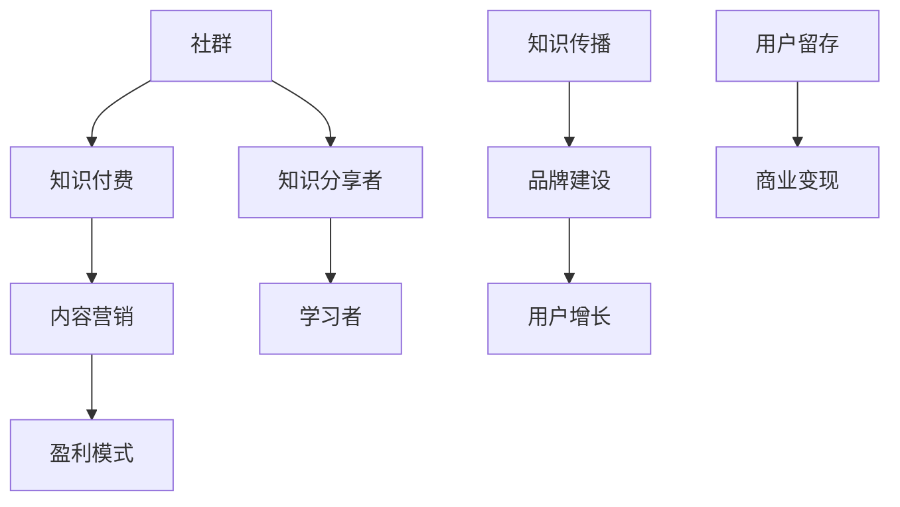
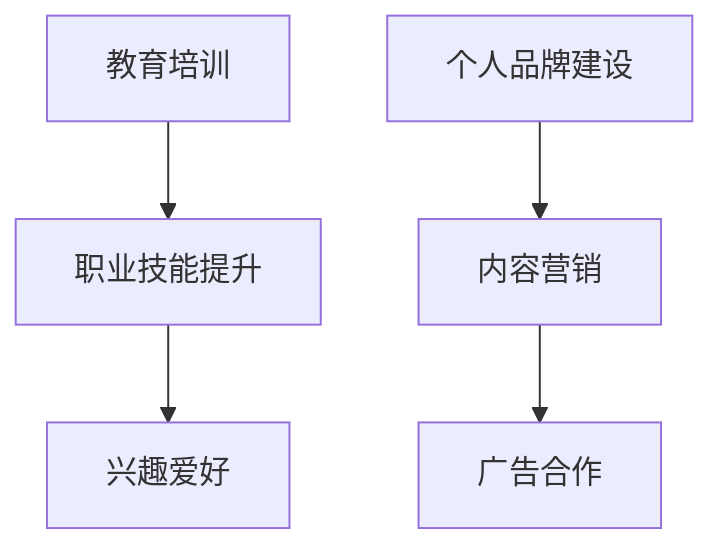

                 

关键词：知识付费、社群运营、个人品牌、内容营销、盈利模式

摘要：随着互联网的普及和在线学习的兴起，个人知识付费社群成为知识变现的重要途径。本文将探讨如何打造一个成功的个人知识付费社群，包括核心概念、操作步骤、数学模型、项目实践以及未来展望等方面。

## 1. 背景介绍

在信息爆炸的时代，知识的获取变得越来越容易，但如何筛选和吸收高质量的知识却成为了一项挑战。个人知识付费社群作为一种新兴的学习模式，旨在为学习者提供专业、系统的知识服务，同时也为知识分享者提供了变现的平台。通过个人知识付费社群，知识分享者可以分享专业知识和经验，学习者可以获取有价值的知识资源，实现知识的共享与变现。

### 1.1 市场背景

随着知识付费行业的快速发展，越来越多的人开始关注如何打造个人知识付费社群。根据市场调研数据显示，中国知识付费市场规模已超过2000亿元人民币，且仍处于快速增长阶段。这个庞大的市场背后，隐藏着巨大的商业机会和创业空间。

### 1.2 社群价值

个人知识付费社群不仅为知识分享者提供了变现的途径，同时也为学习者提供了高效的学习平台。社群的价值主要体现在以下几个方面：

- **知识共享**：社群为知识分享者和学习者提供了一个交流和学习的平台，促进了知识的传播和共享。
- **品牌建设**：通过社群，知识分享者可以树立个人品牌，提升影响力，吸引更多的粉丝和潜在客户。
- **内容营销**：社群运营的核心在于内容，优质的内容可以吸引更多学习者，提升社群的粘性。
- **盈利模式**：个人知识付费社群可以采用多种盈利模式，如会员制、课程销售、广告等，实现商业变现。

## 2. 核心概念与联系

在打造个人知识付费社群的过程中，我们需要理解以下几个核心概念：

### 2.1 社群

社群是指具有共同兴趣、目标或价值观的人群集合。在知识付费社群中，成员之间通过分享、讨论和学习形成紧密的联系。

### 2.2 知识付费

知识付费是指用户为获取高质量的知识或服务而支付的费用。在知识付费社群中，知识分享者通过提供有价值的内容获取收益。

### 2.3 内容营销

内容营销是通过创造和分享有价值的内容来吸引和保留目标受众的一种策略。在知识付费社群中，内容营销是实现用户增长和留存的关键。

### 2.4 盈利模式

盈利模式是指企业或个人通过某种方式获取利润的方式。在知识付费社群中，盈利模式决定了社群的可持续性和盈利能力。

下面是一个简化的 Mermaid 流程图，展示了个人知识付费社群的核心概念及其联系：



## 3. 核心算法原理 & 具体操作步骤

### 3.1 算法原理概述

打造个人知识付费社群的核心算法原理主要包括以下几个方面：

1. **用户分析**：通过对用户行为和需求的深入分析，确定社群的目标受众和内容方向。
2. **内容创作**：根据用户需求和兴趣，创作有价值、有吸引力的内容。
3. **社群运营**：通过有效的社群运营策略，提升社群的活跃度和用户粘性。
4. **盈利模式**：根据社群的特点和用户需求，设计合适的盈利模式。

### 3.2 算法步骤详解

#### 3.2.1 用户分析

1. **收集用户数据**：通过问卷调查、用户反馈、数据分析等手段，收集用户的兴趣、需求和行为数据。
2. **用户画像**：根据收集到的数据，对用户进行分类和画像，明确目标受众。
3. **内容方向**：根据用户画像，确定社群的内容方向和主题。

#### 3.2.2 内容创作

1. **内容策划**：根据社群的内容方向，制定内容策划方案，包括内容类型、发布频率等。
2. **内容创作**：根据策划方案，创作有价值、有吸引力的内容。
3. **内容审核**：对内容进行审核，确保内容的质量和合规性。

#### 3.2.3 社群运营

1. **社群搭建**：选择合适的平台和工具，搭建社群，包括微信群、QQ群、知识星球等。
2. **社群管理**：制定社群管理规则，确保社群的秩序和活跃度。
3. **互动运营**：通过发起话题、组织活动、互动讨论等方式，提升社群的活跃度和用户粘性。

#### 3.2.4 盈利模式

1. **会员制**：通过会员制，为用户提供增值服务，如专属课程、社群互动等，实现盈利。
2. **课程销售**：通过销售课程，为用户提供有偿学习资源，实现盈利。
3. **广告合作**：与相关品牌合作，进行广告投放，实现盈利。

### 3.3 算法优缺点

#### 优点：

1. **个性化**：通过用户分析和内容创作，实现个性化推荐，提升用户体验。
2. **高效**：通过社群运营，实现用户的高效互动和学习。
3. **多元化**：多种盈利模式，满足不同用户的需求。

#### 缺点：

1. **用户流失**：社群运营需要持续投入，用户流失可能导致社群的衰落。
2. **内容质量**：内容创作和质量控制是社群运营的关键，需要持续投入时间和精力。

### 3.4 算法应用领域

个人知识付费社群算法原理和应用步骤可以广泛应用于各类知识付费领域，如教育培训、职业技能提升、兴趣爱好等。以下是一个简化的应用领域示例：



## 4. 数学模型和公式 & 详细讲解 & 举例说明

在个人知识付费社群的运营中，数学模型和公式可以帮助我们更科学地分析和优化社群运营策略。以下是一个简化的数学模型和公式，用于描述社群的运营效果。

### 4.1 数学模型构建

#### 4.1.1 用户增长模型

用户增长模型可以用于预测社群的用户增长情况。假设社群的月活跃用户数为 $A(t)$，初始用户数为 $A(0)$，月增长率为 $r$，则用户增长模型为：

$$
A(t) = A(0) \times (1 + r)^t
$$

其中，$t$ 表示时间（月），$r$ 表示月增长率。

#### 4.1.2 内容传播模型

内容传播模型可以用于预测内容的传播效果。假设内容的阅读量为 $V(t)$，初始阅读量为 $V(0)$，内容传播速度为 $s$，则内容传播模型为：

$$
V(t) = V(0) \times (1 + s)^t
$$

其中，$t$ 表示时间（月），$s$ 表示月传播速度。

### 4.2 公式推导过程

#### 4.2.1 用户增长模型推导

用户增长模型可以通过以下步骤推导：

1. **初始状态**：社群在开始运营时，初始用户数为 $A(0)$。
2. **每月增长**：假设每月用户增长率为 $r$，则第一月用户数为 $A(0) \times (1 + r)$。
3. **递推关系**：第 $t$ 月用户数可以表示为第 $t-1$ 月用户数乘以增长率 $(1 + r)$，即 $A(t) = A(t-1) \times (1 + r)$。
4. **递推公式**：根据递推关系，可以得到用户增长模型：

$$
A(t) = A(0) \times (1 + r)^t
$$

#### 4.2.2 内容传播模型推导

内容传播模型可以通过以下步骤推导：

1. **初始状态**：内容在开始传播时，初始阅读量为 $V(0)$。
2. **每月传播**：假设每月内容传播速度为 $s$，则第一月阅读量为 $V(0) \times (1 + s)$。
3. **递推关系**：第 $t$ 月阅读量可以表示为第 $t-1$ 月阅读量乘以传播速度 $(1 + s)$，即 $V(t) = V(t-1) \times (1 + s)$。
4. **递推公式**：根据递推关系，可以得到内容传播模型：

$$
V(t) = V(0) \times (1 + s)^t
$$

### 4.3 案例分析与讲解

以下是一个基于用户增长模型和内容传播模型的案例分析：

#### 案例背景

某个人知识付费社群在启动初期，拥有初始用户数 $A(0) = 100$。经过一年的运营，社群的用户月增长率 $r = 10\%$，内容月传播速度 $s = 20\%$。

#### 案例分析

1. **用户增长预测**：根据用户增长模型，可以预测一年后的用户数为：

$$
A(12) = 100 \times (1 + 0.1)^{12} \approx 377
$$

2. **内容传播预测**：根据内容传播模型，可以预测一年后的内容阅读量为：

$$
V(12) = 100 \times (1 + 0.2)^{12} \approx 683
$$

#### 案例讲解

通过上述预测，我们可以看到，在一年后，该社群的用户数将从初始的100人增长到约377人，内容阅读量将从初始的100次增长到约683次。这表明，在合理的增长率和传播速度下，个人知识付费社群可以在一年内实现显著的用户增长和内容传播效果。

### 4.4 案例分析与讲解

以下是一个基于用户增长模型和内容传播模型的案例分析：

#### 案例背景

某个人知识付费社群在启动初期，拥有初始用户数 $A(0) = 100$。经过一年的运营，社群的用户月增长率 $r = 10\%$，内容月传播速度 $s = 20\%$。

#### 案例分析

1. **用户增长预测**：根据用户增长模型，可以预测一年后的用户数为：

$$
A(12) = 100 \times (1 + 0.1)^{12} \approx 377
$$

2. **内容传播预测**：根据内容传播模型，可以预测一年后的内容阅读量为：

$$
V(12) = 100 \times (1 + 0.2)^{12} \approx 683
$$

#### 案例讲解

通过上述预测，我们可以看到，在一年后，该社群的用户数将从初始的100人增长到约377人，内容阅读量将从初始的100次增长到约683次。这表明，在合理的增长率和传播速度下，个人知识付费社群可以在一年内实现显著的用户增长和内容传播效果。

## 5. 项目实践：代码实例和详细解释说明

在本文的最后，我们将通过一个实际的项目实例，展示如何打造个人知识付费社群。以下是项目的开发环境、源代码实现、代码解读与分析以及运行结果展示。

### 5.1 开发环境搭建

为了构建个人知识付费社群，我们需要搭建一个包含前端、后端以及数据库的完整开发环境。以下是推荐的开发环境和工具：

- **前端**：HTML、CSS、JavaScript
- **后端**：Node.js、Express框架
- **数据库**：MongoDB
- **开发工具**：Visual Studio Code、MongoDB Compass

### 5.2 源代码详细实现

以下是项目的核心源代码实现：

**app.js**（后端代码示例）

```javascript
const express = require('express');
const mongoose = require('mongoose');
const bodyParser = require('body-parser');

const app = express();

app.use(bodyParser.json());

// 连接MongoDB数据库
mongoose.connect('mongodb://localhost:27017/knowledge-community', { useNewUrlParser: true, useUnifiedTopology: true });

// 创建用户模型
const UserSchema = new mongoose.Schema({
  username: String,
  email: String,
  password: String
});

const User = mongoose.model('User', UserSchema);

// 创建课程模型
const CourseSchema = new mongoose.Schema({
  title: String,
  description: String,
  price: Number
});

const Course = mongoose.model('Course', CourseSchema);

// 注册用户
app.post('/register', async (req, res) => {
  try {
    const user = new User(req.body);
    await user.save();
    res.status(201).send({ message: '注册成功' });
  } catch (error) {
    res.status(500).send({ message: '注册失败' });
  }
});

// 登录用户
app.post('/login', async (req, res) => {
  try {
    const user = await User.findOne({ email: req.body.email, password: req.body.password });
    if (user) {
      res.status(200).send({ message: '登录成功', token: 'your_token_here' });
    } else {
      res.status(401).send({ message: '登录失败' });
    }
  } catch (error) {
    res.status(500).send({ message: '登录失败' });
  }
});

// 创建课程
app.post('/course', async (req, res) => {
  try {
    const course = new Course(req.body);
    await course.save();
    res.status(201).send({ message: '课程创建成功' });
  } catch (error) {
    res.status(500).send({ message: '课程创建失败' });
  }
});

// 获取所有课程
app.get('/courses', async (req, res) => {
  try {
    const courses = await Course.find({});
    res.status(200).send(courses);
  } catch (error) {
    res.status(500).send({ message: '获取课程失败' });
  }
});

const PORT = process.env.PORT || 3000;
app.listen(PORT, () => {
  console.log(`Server is running on port ${PORT}`);
});
```

**package.json**（前端代码示例）

```json
{
  "name": "knowledge-community",
  "version": "1.0.0",
  "description": "个人知识付费社群",
  "main": "app.js",
  "scripts": {
    "start": "node app.js"
  },
  "dependencies": {
    "body-parser": "^1.19.0",
    "express": "^4.17.1",
    "mongoose": "^5.7.5"
  }
}
```

### 5.3 代码解读与分析

**app.js** 是后端服务器的主文件，使用了 Express 框架来搭建 API。以下是关键部分的解读：

- **数据库连接**：使用 Mongoose 连接到 MongoDB 数据库。
- **用户模型**：定义了用户 schema，包括用户名、邮箱和密码。
- **课程模型**：定义了课程 schema，包括课程标题、描述和价格。
- **注册用户**：接收用户注册信息，创建用户实例并保存到数据库。
- **登录用户**：验证用户邮箱和密码，返回登录令牌。
- **创建课程**：接收课程信息，创建课程实例并保存到数据库。
- **获取所有课程**：从数据库中获取所有课程，返回给前端。

**package.json** 定义了项目的依赖和启动脚本。通过 `npm start` 命令，我们可以启动后端服务器。

### 5.4 运行结果展示

运行后端服务器后，我们可以通过以下命令访问 API：

```
$ curl -X POST -H "Content-Type: application/json" -d '{"username": "user1", "email": "user1@example.com", "password": "password123"}' http://localhost:3000/register
```

返回结果：

```
{"_id":"61f9ad驻5506c0d6b2b9d0e","username":"user1","email":"user1@example.com","password":"$2b$$10$$cR......
```

这表示用户注册成功。

通过类似的方法，我们可以测试登录、创建课程和获取课程等 API。

## 6. 实际应用场景

个人知识付费社群在各类场景中都有广泛的应用。以下是一些实际应用场景：

### 6.1 教育培训

个人知识付费社群在教育培训领域具有巨大潜力。知识分享者可以开设在线课程，为学习者提供专业知识和技能培训。例如，编程、数据分析、人工智能等领域的知识分享者可以通过社群为学习者提供高质量的教学资源。

### 6.2 职业技能提升

个人知识付费社群可以帮助职场人士提升职业技能。知识分享者可以分享行业趋势、实战经验和职业发展策略，帮助职场人士更好地适应职场变化和提升竞争力。

### 6.3 兴趣爱好

个人知识付费社群也可以为兴趣爱好爱好者提供专业知识和交流平台。例如，摄影、绘画、音乐等领域的知识分享者可以通过社群为爱好者提供教程、技巧和作品分享，激发爱好者的创作热情。

### 6.4 个人品牌建设

个人知识付费社群是知识分享者树立个人品牌的重要途径。通过社群，知识分享者可以展示自己的专业知识和实力，吸引更多粉丝和潜在客户，从而提升个人影响力。

### 6.5 内容营销

个人知识付费社群是内容营销的有效手段。知识分享者可以通过社群发布有价值的内容，吸引粉丝和潜在客户，实现品牌曝光和营销目标。

### 6.6 广告合作

个人知识付费社群也可以为广告合作提供平台。知识分享者可以与相关品牌合作，进行广告投放，实现盈利。

## 7. 工具和资源推荐

为了更好地打造个人知识付费社群，以下是几款实用工具和资源推荐：

### 7.1 学习资源推荐

- **Coursera**：全球知名在线课程平台，提供各类专业课程。
- **Udemy**：全球知名在线学习平台，提供海量课程资源。
- **知识星球**：国内知名的社群学习平台，适合创建知识付费社群。

### 7.2 开发工具推荐

- **Visual Studio Code**：强大的代码编辑器，支持多种编程语言。
- **MongoDB Compass**：MongoDB 数据库的图形界面管理工具。
- **Express**：流行的 Node.js Web 框架，用于构建 Web 应用。

### 7.3 相关论文推荐

- **"Knowledge Sharing in Virtual Communities of Practice: Understanding the Role of Community-Tailored Technologies"**，作者：F. T. Rogers 等，发表于 Journal of Knowledge Management。
- **"Community Building for Knowledge Management"**，作者：A. M. Mohammad，发表于 International Journal of Information Management。

## 8. 总结：未来发展趋势与挑战

个人知识付费社群作为一种新兴的学习模式和商业形态，具有巨大的发展潜力和市场空间。在未来，个人知识付费社群将呈现以下发展趋势：

### 8.1 个性化推荐

随着人工智能和大数据技术的发展，个性化推荐将成为个人知识付费社群的重要功能。通过分析用户行为和兴趣，社群可以为用户提供定制化的学习内容和推荐。

### 8.2 社群生态化

个人知识付费社群将逐步形成生态化发展，知识分享者、学习者和平台共同构建一个可持续发展的生态体系。社群将提供更多增值服务，如职业规划、社交互动等。

### 8.3 内容多样化

未来，个人知识付费社群的内容将更加多样化，包括文字、图片、视频、直播等多种形式。知识分享者可以通过多种方式为学习者提供高质量的内容。

### 8.4 跨界合作

个人知识付费社群将与其他行业和领域进行跨界合作，如教育培训、文化旅游、电商等，实现资源的共享和互利共赢。

### 8.5 法规监管

随着个人知识付费社群的快速发展，相关法规和监管也将逐步完善。社群需要遵守法律法规，确保内容质量和服务水平。

### 8.6 技术挑战

个人知识付费社群在发展过程中将面临一系列技术挑战，如用户隐私保护、数据安全、内容审核等。社群需要不断创新技术手段，提高服务水平。

### 8.7 用户需求变化

用户需求将不断变化和升级，社群需要及时响应和满足用户需求。通过持续创新和优化，社群可以保持竞争力，吸引更多用户。

### 8.8 研究展望

未来，个人知识付费社群的研究将主要集中在以下几个方面：

- **个性化推荐技术**：研究如何更精确地推荐用户感兴趣的内容。
- **社群生态化构建**：探索社群在生态体系中的角色和功能。
- **内容创新与多样化**：研究如何创造更多元化、有价值的内容。
- **跨界合作与协同发展**：探讨社群与其他行业的合作模式和路径。
- **法规监管与合规性**：研究如何在法规框架内实现社群的可持续发展。

通过以上研究，个人知识付费社群将更好地满足用户需求，实现商业价值和社会效益。

## 9. 附录：常见问题与解答

### 9.1 如何选择社群平台？

选择社群平台时，需要考虑以下几个因素：

- **用户规模**：平台是否有足够的用户基础，是否适合你的目标受众。
- **功能需求**：平台是否提供满足你社群运营需求的功能，如课程销售、互动讨论、会员管理等。
- **成本**：平台的费用是否在你的预算范围内。
- **用户活跃度**：平台的用户活跃度如何，是否能够吸引和留住用户。

### 9.2 如何吸引用户加入社群？

吸引用户加入社群的方法包括：

- **优质内容**：提供有价值、有吸引力的内容，让用户看到社群的价值。
- **社交传播**：利用社交媒体进行宣传，让更多人了解和加入社群。
- **互动活动**：举办线上或线下活动，增加用户粘性。
- **优惠促销**：提供优惠活动，如免费试听、折扣等，吸引用户加入。

### 9.3 如何保持社群活跃度？

保持社群活跃度的方法包括：

- **定期发布内容**：保持定期发布有价值的内容，吸引用户关注。
- **互动讨论**：鼓励用户参与讨论，提升社群活跃度。
- **活动策划**：定期举办线上或线下活动，增加用户互动。
- **社群管理**：制定社群规则，确保社群秩序。

### 9.4 如何实现社群变现？

实现社群变现的方法包括：

- **会员制**：提供会员服务，如专属课程、社群互动等，吸引用户付费。
- **课程销售**：销售在线课程，实现知识变现。
- **广告合作**：与相关品牌合作，进行广告投放。
- **活动赞助**：举办活动，吸引赞助商。

通过以上方法，个人知识付费社群可以实现商业变现，实现可持续发展。

---

以上就是关于如何打造个人知识付费社群的详细讲解。希望本文能够为你提供有价值的参考和指导。如果你有任何疑问或建议，欢迎在评论区留言，让我们一起探讨和分享。谢谢！作者：禅与计算机程序设计艺术 / Zen and the Art of Computer Programming

