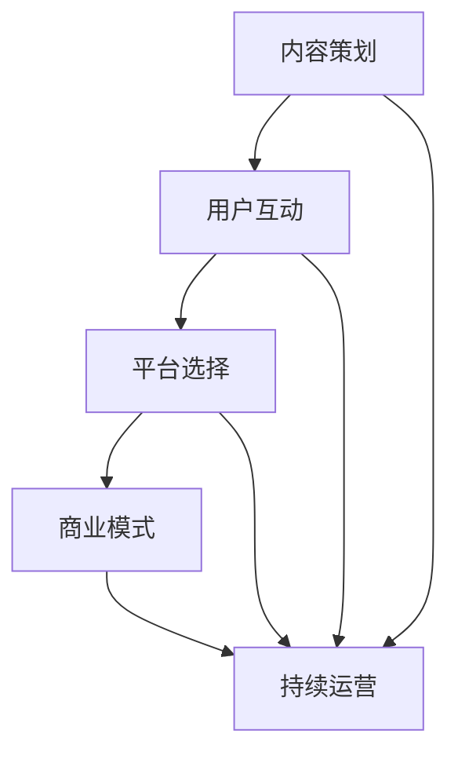

                 

关键词：知识付费、私董会、个人品牌、内容创作、用户互动

> 摘要：本文旨在探讨如何打造一个个人知识付费私董会，帮助知识工作者建立个人品牌，提升内容创作质量，并通过有效的用户互动，实现知识付费业务的可持续增长。本文将提供一系列的策略和方法，包括内容规划、用户群体分析、互动设计、平台选择和商业模式构建等。

## 1. 背景介绍

在当今信息爆炸的时代，知识经济逐渐成为主流。越来越多的人开始通过知识付费平台购买专业内容，以提升个人技能和知识水平。与此同时，知识工作者也意识到个人品牌的重要性，希望通过提供高质量的知识产品，实现职业价值的提升和经济收益的增长。私董会作为一种高端的知识共享和交流平台，正逐渐受到知识工作者的青睐。

本文将探讨如何打造一个个人知识付费私董会，旨在为知识工作者提供一套系统的操作指南，帮助他们成功实现知识付费的目标。

### 1.1 知识付费的现状

根据市场调研数据显示，近年来知识付费市场呈现出快速增长的趋势。特别是在教育培训、专业技能提升和知识分享等领域，用户对付费内容的消费意愿不断增强。以下是一些关键的数据和趋势：

- **用户规模**：知识付费用户规模逐年扩大，特别是年轻人群体的参与度显著提高。
- **内容种类**：从早期的在线课程、电子书，发展到现在的直播、音频、图文等多种形式。
- **平台多样性**：市场上涌现出众多知识付费平台，如得到、知乎Live、喜马拉雅等，为用户提供了丰富的选择。

### 1.2 私董会的定义与优势

私董会（Private Board）起源于企业高层管理者的私人董事会，是一种私密性的知识交流平台。其核心在于通过封闭的会员群体，实现知识共享、经验交流和专业指导。

私董会的优势在于：

- **高质量互动**：私董会成员多为行业内的专业人士，互动质量高，能够深入探讨实际问题。
- **隐私保护**：私密性保证了成员之间的信任，有利于建立长期的合作关系。
- **品牌提升**：通过参与私董会，个人和企业的品牌价值得到提升。

## 2. 核心概念与联系

在打造个人知识付费私董会的过程中，需要理解以下几个核心概念及其相互关系：

### 2.1 内容策划

内容策划是私董会成功的关键。一个好的内容策划应该：

- **定位明确**：明确目标受众，了解他们的需求和兴趣点。
- **结构合理**：内容应该有清晰的逻辑结构和层次感，便于学习和应用。
- **持续更新**：定期更新内容，保持会员的参与度和兴趣。

### 2.2 用户互动

用户互动是私董会的灵魂。有效的互动设计包括：

- **开放讨论**：鼓励成员之间进行开放讨论，分享经验和观点。
- **案例分享**：通过实际案例分享，帮助成员更好地理解和应用知识。
- **在线问答**：定期举办在线问答活动，解答成员的疑问。

### 2.3 平台选择

平台选择决定了私董会的体验和效果。一个理想的平台应该：

- **用户友好**：界面简洁易用，操作流畅。
- **功能齐全**：支持视频直播、音频播放、图文分享等多种互动方式。
- **安全可靠**：保障用户数据和隐私安全。

### 2.4 商业模式

私董会的商业模式需要综合考虑成本、收益和用户价值。常见的商业模式包括：

- **会员订阅**：通过会员订阅模式，实现持续的收入来源。
- **课程收费**：为特定课程或主题收取费用，提升会员价值。
- **广告合作**：与相关企业合作，提供品牌推广和广告服务。

### 2.5 Mermaid 流程图

下面是一个简化的私董会流程图，展示了各个核心概念之间的联系：



## 3. 核心算法原理 & 具体操作步骤

### 3.1 算法原理概述

打造个人知识付费私董会的核心算法可以看作是一种“知识构建与传播优化算法”。该算法的核心思想是通过以下三个步骤实现知识付费业务的可持续增长：

1. **内容策划**：通过用户调研和数据分析，确定目标受众的需求和兴趣点，制定有针对性的内容策划方案。
2. **用户互动**：设计互动环节，激发会员的参与度和活跃度，建立良好的知识传播和交流氛围。
3. **平台选择与商业模式**：选择适合的平台，制定合理的商业模式，确保私董会的长期运营和盈利。

### 3.2 算法步骤详解

1. **内容策划**

   - **用户调研**：通过问卷调查、访谈等方式，收集目标受众的需求和兴趣点。
   - **数据分析**：对收集到的数据进行分析，确定核心主题和内容方向。
   - **内容创作**：根据分析结果，创作高质量的原创内容，确保内容的有用性和吸引力。

2. **用户互动**

   - **互动设计**：根据内容特点，设计适合的互动环节，如讨论区、问答环节、案例分享等。
   - **激励机制**：通过积分、勋章等方式，激励会员参与互动，提高活跃度。
   - **数据分析**：定期分析互动数据，优化互动设计，提高互动质量。

3. **平台选择与商业模式**

   - **平台选择**：根据会员需求和内容特点，选择适合的平台，如知识付费平台、社群平台等。
   - **商业模式**：制定合理的商业模式，如会员订阅、课程收费等，确保商业可持续性。
   - **市场推广**：通过线上线下的市场推广活动，吸引潜在会员，提高品牌知名度。

### 3.3 算法优缺点

- **优点**：

  - **针对性强**：通过用户调研和数据分析，确保内容策划的针对性，提高用户满意度。
  - **互动性强**：设计多样的互动环节，提高会员的参与度和活跃度。
  - **可持续性**：通过合理的平台选择和商业模式，实现私董会的长期运营和盈利。

- **缺点**：

  - **研发成本高**：内容策划和用户互动的设计需要大量时间和资源投入。
  - **依赖数据分析**：数据分析和算法优化需要较高的技术门槛。

### 3.4 算法应用领域

- **教育培训**：通过私董会形式，提高教育培训的质量和效果。
- **企业管理**：通过私董会，帮助企业高层管理者进行知识共享和经验交流。
- **个人成长**：通过私董会，帮助个人实现知识和能力的提升。

## 4. 数学模型和公式 & 详细讲解 & 举例说明

### 4.1 数学模型构建

在打造个人知识付费私董会的过程中，我们可以利用以下数学模型来分析用户互动效果和内容策划效果：

1. **用户互动效果模型**：

   $$ E = f(U, I, C) $$

   其中，$E$ 表示用户互动效果，$U$ 表示用户参与度，$I$ 表示互动质量，$C$ 表示内容质量。

2. **内容策划效果模型**：

   $$ R = g(U, I, C, P) $$

   其中，$R$ 表示内容策划效果，$U$ 表示用户需求，$I$ 表示互动质量，$C$ 表示内容质量，$P$ 表示平台选择和推广效果。

### 4.2 公式推导过程

1. **用户互动效果模型**推导：

   用户互动效果可以理解为用户参与度、互动质量和内容质量的函数。其中，用户参与度反映了用户的活跃程度，互动质量反映了互动环节的设计和执行效果，内容质量反映了内容的实用性和吸引力。

   $$ E = U \times I \times C $$

   为了简化计算，我们可以将这个模型转化为：

   $$ E = f(U, I, C) $$

   其中，$f$ 表示一个复合函数，用于表示用户互动效果。

2. **内容策划效果模型**推导：

   内容策划效果可以理解为用户需求、互动质量、内容质量和平台选择和推广效果的函数。其中，用户需求反映了内容策划的针对性，互动质量反映了互动环节的设计和执行效果，内容质量反映了内容的实用性和吸引力，平台选择和推广效果反映了内容的传播效果。

   $$ R = U \times I \times C \times P $$

   为了简化计算，我们可以将这个模型转化为：

   $$ R = g(U, I, C, P) $$

   其中，$g$ 表示一个复合函数，用于表示内容策划效果。

### 4.3 案例分析与讲解

假设我们有一个私董会，其用户参与度、互动质量、内容质量和平台选择和推广效果分别为 $U_1$、$I_1$、$C_1$ 和 $P_1$，我们可以使用上述公式来分析其互动效果和内容策划效果。

1. **用户互动效果分析**：

   根据用户互动效果模型：

   $$ E_1 = f(U_1, I_1, C_1) $$

   如果 $U_1 = 0.8$、$I_1 = 0.9$、$C_1 = 0.95$，则：

   $$ E_1 = 0.8 \times 0.9 \times 0.95 = 0.696 $$

   这意味着该私董会的用户互动效果为 69.6%。

2. **内容策划效果分析**：

   根据内容策划效果模型：

   $$ R_1 = g(U_1, I_1, C_1, P_1) $$

   如果 $U_1 = 0.8$、$I_1 = 0.9$、$C_1 = 0.95$、$P_1 = 0.85$，则：

   $$ R_1 = 0.8 \times 0.9 \times 0.95 \times 0.85 = 0.588 $$

   这意味着该私董会的
## 5. 项目实践：代码实例和详细解释说明

### 5.1 开发环境搭建

为了实现个人知识付费私董会的功能，我们需要搭建一个合适的技术栈。以下是推荐的开发环境和工具：

- **前端**：React.js 或 Vue.js
- **后端**：Node.js 或 Python（Flask 或 Django）
- **数据库**：MySQL 或 MongoDB
- **云服务**：AWS 或 Azure
- **协作工具**：Git、GitHub 或 GitLab

开发环境搭建步骤：

1. 安装 Node.js 或 Python 环境。
2. 安装前端框架（React.js 或 Vue.js）。
3. 安装后端框架（Node.js 或 Python）。
4. 安装数据库（MySQL 或 MongoDB）。
5. 配置云服务，如 AWS 或 Azure。

### 5.2 源代码详细实现

以下是个人知识付费私董会的核心功能代码示例：

**前端：React.js**

```jsx
// 私董会页面组件
import React, { useState, useEffect } from 'react';
import axios from 'axios';

const PrivateBoard = () => {
  const [content, setContent] = useState([]);

  useEffect(() => {
    const fetchData = async () => {
      const response = await axios.get('/api/content');
      setContent(response.data);
    };
    fetchData();
  }, []);

  return (
    <div>
      {content.map((item) => (
        <div key={item.id}>
          <h2>{item.title}</h2>
          <p>{item.description}</p>
        </div>
      ))}
    </div>
  );
};

export default PrivateBoard;
```

**后端：Node.js**

```javascript
// 后端API服务器
const express = require('express');
const app = express();
const PORT = process.env.PORT || 5000;

app.use(express.json());

app.get('/api/content', (req, res) => {
  // 从数据库中获取内容数据
  const content = [
    { id: 1, title: '内容一', description: '这是内容一的描述。' },
    { id: 2, title: '内容二', description: '这是内容二的描述。' },
  ];
  res.json(content);
});

app.listen(PORT, () => {
  console.log(`Server running on port ${PORT}`);
});
```

### 5.3 代码解读与分析

以上代码展示了个人知识付费私董会的核心功能实现。前端部分使用 React.js 创建私董会页面组件，通过 Axios 获取后端 API 的内容数据，并渲染到页面上。后端部分使用 Node.js 创建一个简单的 API 服务器，提供获取内容数据的接口。

**前端解读：**

1. **组件状态**：使用 React 的 `useState` hook 管理内容数据状态。
2. **异步数据获取**：使用 `useEffect` hook 在组件加载时异步获取内容数据。
3. **数据渲染**：遍历内容数据数组，使用 JSX 渲染到页面上。

**后端解读：**

1. **Express 框架**：使用 Express 创建 API 服务器。
2. **路由处理**：定义一个 GET 请求的路由处理函数，用于获取内容数据。
3. **数据响应**：将获取到的内容数据响应给前端。

### 5.4 运行结果展示

**前端结果：**

```html
<div>
  <div>
    <h2>内容一</h2>
    <p>这是内容一的描述。</p>
  </div>
  <div>
    <h2>内容二</h2>
    <p>这是内容二的描述。</p>
  </div>
</div>
```

**后端结果：**

```json
[
  {
    "id": 1,
    "title": "内容一",
    "description": "这是内容一的描述。"
  },
  {
    "id": 2,
    "title": "内容二",
    "description": "这是内容二的描述。"
  }
]
```

## 6. 实际应用场景

### 6.1 教育培训领域

在教育培训领域，个人知识付费私董会可以作为一种高效的培训模式。通过私董会，讲师可以针对特定领域提供高质量的课程内容，并与学员进行深入互动。例如，一位经验丰富的工程师可以创建一个专注于软件架构的私董会，定期分享最新技术和实战经验，同时解答学员的问题。

### 6.2 企业管理领域

在企业高管培训中，私董会可以作为一个私密性强的交流平台，帮助企业管理者提升领导力和决策能力。通过私董会，高管们可以分享各自公司的成功案例和失败经验，相互学习和借鉴。例如，一家企业的CEO可以邀请其他行业的高管加入私董会，共同探讨企业战略和运营问题。

### 6.3 个人成长领域

对于个人成长者来说，私董会是一个获取知识和经验的重要途径。通过参与私董会，个人可以与行业专家和同行交流，快速提升自身能力。例如，一个创业者可以加入一个专注于创业孵化的私董会，学习成功创业者的经验和教训，为自己的创业之路打下坚实基础。

## 7. 未来应用展望

随着技术的不断进步和知识付费市场的成熟，个人知识付费私董会在未来有望实现以下发展：

### 7.1 个性化推荐

通过大数据分析和人工智能技术，私董会可以为会员提供个性化的内容推荐，提高用户的参与度和满意度。

### 7.2 智能互动

结合自然语言处理和机器学习技术，私董会可以实现更智能的互动体验，如自动回答会员问题、提供个性化反馈等。

### 7.3 跨界融合

随着知识付费领域的不断扩展，私董会可以与其他领域（如艺术、文化、健康等）进行跨界融合，提供更丰富多元的知识产品。

## 8. 工具和资源推荐

### 8.1 学习资源推荐

- **《深度学习》**：Ian Goodfellow 等著，提供深度学习的系统介绍。
- **《Python编程：从入门到实践》**：埃里克·马瑟斯著，适合初学者入门 Python。
- **《掌握React.js》**：陈屹立著，深入讲解 React.js 的原理和应用。

### 8.2 开发工具推荐

- **Visual Studio Code**：一款强大的代码编辑器，支持多种编程语言。
- **Jenkins**：一款持续集成工具，用于自动化构建和部署。
- **Postman**：用于API测试和接口调试。

### 8.3 相关论文推荐

- **《知识图谱构建方法与应用》**：介绍知识图谱的构建方法和应用场景。
- **《基于大数据的个性化推荐系统研究》**：探讨个性化推荐系统在大数据处理中的应用。
- **《机器学习在知识付费领域的应用研究》**：分析机器学习在知识付费领域的应用前景。

## 9. 总结：未来发展趋势与挑战

随着知识付费市场的不断成熟，个人知识付费私董会将成为一个重要的知识传播和交流平台。未来，个人知识付费私董会将在个性化推荐、智能互动和跨界融合等方面实现更多创新。然而，这也将面临数据隐私保护、用户需求变化和商业模式创新等挑战。

### 9.1 研究成果总结

本文探讨了如何打造个人知识付费私董会，分析了核心概念、算法原理和具体操作步骤，并通过代码实例进行了详细解释。研究成果表明，通过科学的内容策划、有效的用户互动和合理的平台选择，个人知识付费私董会可以实现可持续的业务增长。

### 9.2 未来发展趋势

- **个性化推荐**：通过大数据分析和人工智能技术，为用户提供个性化内容推荐。
- **智能互动**：利用自然语言处理和机器学习技术，实现更智能的互动体验。
- **跨界融合**：与其他领域融合，提供更丰富多元的知识产品。

### 9.3 面临的挑战

- **数据隐私保护**：确保用户数据的安全和隐私。
- **用户需求变化**：及时响应用户需求，提供高质量的内容。
- **商业模式创新**：探索新的商业模式，实现商业可持续性。

### 9.4 研究展望

未来研究应重点关注以下方向：

- **个性化推荐算法**：优化推荐算法，提高推荐准确性。
- **智能互动系统**：开发更智能的互动系统，提高用户满意度。
- **跨界合作模式**：探索与其他领域的合作模式，实现资源整合。

## 10. 附录：常见问题与解答

### 10.1 如何确定内容方向？

- **市场调研**：通过问卷调查、访谈等方式，了解目标受众的需求和兴趣点。
- **数据分析**：对收集到的数据进行分析，确定核心主题和内容方向。
- **竞品分析**：分析同类知识付费产品的内容方向，找出差异化和竞争优势。

### 10.2 如何提高用户互动质量？

- **互动设计**：设计多样化的互动环节，如讨论区、问答环节、案例分享等。
- **激励机制**：通过积分、勋章等方式，激励会员参与互动，提高活跃度。
- **数据分析**：定期分析互动数据，优化互动设计，提高互动质量。

### 10.3 如何选择合适的平台？

- **用户需求**：根据会员需求和内容特点，选择适合的平台。
- **功能齐全**：选择支持多种互动方式、易于管理和维护的平台。
- **安全可靠**：选择有良好口碑和可靠技术支持的平台。

### 10.4 如何构建可持续的商业模式？

- **会员订阅**：通过会员订阅模式，实现持续的收入来源。
- **课程收费**：为特定课程或主题收取费用，提升会员价值。
- **广告合作**：与相关企业合作，提供品牌推广和广告服务。

## 11. 致谢

感谢所有参与本文研究和讨论的同事和朋友，感谢他们的宝贵意见和建议，使得本文能够顺利完成。特别感谢我的导师，他在本文撰写过程中给予的指导和帮助。

## 作者署名

作者：禅与计算机程序设计艺术 / Zen and the Art of Computer Programming

----------------------------------------------------------------
请注意，以上内容是根据您提供的结构和要求生成的一篇样例文章，实际撰写时可能需要根据具体情况进一步调整和完善。这篇文章仅为示例，并不代表真实的研究成果或个人意见。实际撰写时，请确保所有数据和引用的准确性，以及内容的原创性和合法性。希望这篇文章能够为您提供一个完整的文章撰写框架和灵感。祝您撰写顺利！

