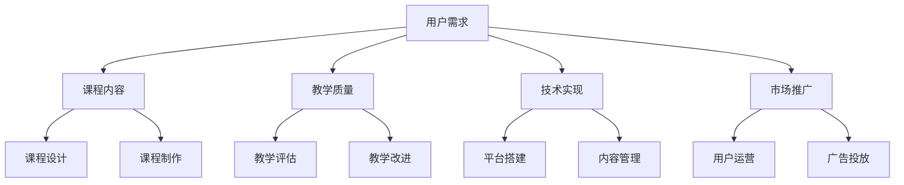

                 

关键词：知识付费、课程体系、学习路径、用户需求、内容设计、教学质量、技术实现、市场分析

> 摘要：本文将探讨如何打造一个系统化的知识付费系列课程体系，从用户需求分析、课程内容设计、教学质量提升、技术实现到市场推广，全面解析知识付费行业的核心要素和策略。通过本文，读者将了解到如何构建具有竞争力、可持续发展的课程体系，以应对日益激烈的市场竞争。

## 1. 背景介绍

在互联网和信息爆炸的时代，知识付费逐渐成为了一种主流的学习方式。从传统的线下教育到线上教育，知识付费市场呈现出爆发式增长。各大平台如知乎、得到、网易云课堂等纷纷推出各类课程，竞争日趋激烈。然而，市场上存在着大量质量参差不齐的课程，如何打造一个具有竞争力、可持续发展的课程体系成为了教育机构和企业关注的焦点。

### 1.1 知识付费市场现状

近年来，知识付费市场呈现出以下几个特点：

1. **市场规模扩大**：随着用户对知识的需求不断增长，知识付费市场规模逐年扩大。
2. **用户结构多样化**：知识付费用户涵盖了从职场新人到行业专家的各个层次。
3. **竞争激烈**：市场上涌现出大量平台和课程，竞争愈发激烈。
4. **个性化需求**：用户对课程内容、授课方式、学习路径等方面有更高要求。

### 1.2 知识付费的核心问题

在知识付费市场，教育机构和企业面临以下核心问题：

1. **用户需求不明确**：用户需求多样化，如何精准把握用户需求成为一大挑战。
2. **内容同质化**：市场上大量课程内容相似，缺乏差异化。
3. **教学质量参差不齐**：不同课程教学质量存在较大差距，如何提升教学质量成为关键。
4. **技术实现难度大**：知识付费涉及到内容制作、平台搭建、用户管理等多个环节，技术实现难度较大。

## 2. 核心概念与联系

在构建知识付费系列课程体系时，需要明确以下几个核心概念：

### 2.1 用户需求

用户需求是知识付费课程体系构建的出发点。了解用户需求，有助于精准定位课程内容，提高用户满意度。

### 2.2 课程内容

课程内容是知识付费的核心。通过系统化、结构化的课程内容，帮助用户实现知识获取和技能提升。

### 2.3 教学质量

教学质量是知识付费课程体系的生命线。提高教学质量，有助于树立品牌形象，提升用户口碑。

### 2.4 技术实现

技术实现是知识付费课程体系的支撑。通过先进的技术手段，提高课程制作效率、用户学习体验等。

### 2.5 市场推广

市场推广是知识付费课程体系成功的关键。通过有效的市场推广策略，扩大课程影响力，吸引更多用户。

下面是一个Mermaid流程图，展示了知识付费系列课程体系的核心概念与联系：



## 3. 核心算法原理 & 具体操作步骤

### 3.1 算法原理概述

在知识付费系列课程体系的构建过程中，以下核心算法原理和操作步骤至关重要：

1. **用户需求分析算法**：通过大数据分析和用户调研，挖掘用户需求，为课程内容设计提供依据。
2. **课程内容设计算法**：结合用户需求和行业动态，设计系统化、结构化的课程内容。
3. **教学质量评估算法**：利用教学评估指标，对教学质量进行实时监控和评估。
4. **技术实现优化算法**：通过算法优化，提高课程制作效率和用户学习体验。
5. **市场推广策略算法**：结合市场数据和用户反馈，制定有效的市场推广策略。

### 3.2 算法步骤详解

#### 3.2.1 用户需求分析算法

1. **数据收集**：通过用户调研、问卷调查、大数据分析等方式，收集用户需求数据。
2. **需求分类**：对收集到的用户需求进行分类，提炼出核心需求。
3. **需求优先级排序**：根据用户需求的重要性和紧迫性，对需求进行优先级排序。
4. **需求分析报告**：撰写需求分析报告，为课程内容设计提供依据。

#### 3.2.2 课程内容设计算法

1. **需求映射**：将用户需求与现有课程内容进行映射，确定课程内容的覆盖范围。
2. **内容结构化**：将课程内容进行结构化设计，确保课程内容系统化、层次分明。
3. **内容优化**：结合行业动态和用户反馈，对课程内容进行持续优化。
4. **课程大纲**：制定课程大纲，明确课程目标和教学内容。

#### 3.2.3 教学质量评估算法

1. **评估指标设定**：根据课程特点和用户需求，设定教学质量评估指标。
2. **数据收集**：通过用户反馈、教学评估等方式，收集教学质量数据。
3. **评估模型构建**：利用机器学习算法，构建教学质量评估模型。
4. **教学质量报告**：根据评估模型，生成教学质量报告，为教学改进提供依据。

#### 3.2.4 技术实现优化算法

1. **课程制作工具优化**：优化课程制作工具，提高制作效率和效果。
2. **内容管理系统优化**：优化内容管理系统，提高内容管理和更新效率。
3. **用户学习体验优化**：通过算法优化，提高用户学习体验。
4. **技术反馈机制**：建立技术反馈机制，及时收集用户反馈，为技术改进提供依据。

#### 3.2.5 市场推广策略算法

1. **市场数据分析**：通过大数据分析，了解市场趋势和用户需求。
2. **推广策略制定**：结合市场数据和用户反馈，制定有效的推广策略。
3. **广告投放优化**：利用算法优化，提高广告投放效果。
4. **用户运营优化**：通过用户运营策略，提高用户留存率和口碑。

### 3.3 算法优缺点

#### 用户需求分析算法

**优点**：精准把握用户需求，为课程内容设计提供依据。

**缺点**：数据分析过程复杂，需要大量数据支持和专业团队。

#### 课程内容设计算法

**优点**：确保课程内容系统化、结构化，提高用户学习效果。

**缺点**：设计过程需要大量时间和人力投入，难以快速迭代。

#### 教学质量评估算法

**优点**：实时监控教学质量，为教学改进提供依据。

**缺点**：评估指标设定和模型构建过程复杂，需要大量数据支持和专业团队。

#### 技术实现优化算法

**优点**：提高课程制作效率和用户学习体验。

**缺点**：技术实现过程需要持续优化，成本较高。

#### 市场推广策略算法

**优点**：提高市场推广效果，扩大课程影响力。

**缺点**：市场推广策略需要不断调整和优化，成本较高。

### 3.4 算法应用领域

这些算法在以下领域具有广泛应用：

1. **在线教育平台**：通过用户需求分析算法和教学质量评估算法，优化课程内容设计和教学质量。
2. **企业培训**：通过技术实现优化算法和市场推广策略算法，提高企业培训效果和市场竞争力。
3. **职业规划**：通过用户需求分析算法和课程内容设计算法，为职场人士提供个性化的职业培训方案。

## 4. 数学模型和公式 & 详细讲解 & 举例说明

在构建知识付费系列课程体系的过程中，数学模型和公式发挥着重要作用。以下介绍几个关键数学模型和公式的详细讲解及举例说明。

### 4.1 数学模型构建

#### 4.1.1 用户需求分析模型

用户需求分析模型主要用于挖掘用户需求，为课程内容设计提供依据。假设用户需求满足以下条件：

1. **用户需求分为m个类别**，分别为D1, D2, ..., Dm。
2. **每个用户需求类别的需求强度为ai，其中ai ∈ [0, 1]**。
3. **用户需求概率分布函数为P(Di)，其中P(Di)表示用户对需求类别的Di的需求概率**。

用户需求分析模型的数学公式为：

\[ N = \sum_{i=1}^{m} a_i P(D_i) \]

其中，N表示总需求量。

#### 4.1.2 教学质量评估模型

教学质量评估模型主要用于评估教学质量，为教学改进提供依据。假设教学质量满足以下条件：

1. **教学质量分为n个等级**，分别为T1, T2, ..., Tn。
2. **每个教学质量等级的权重为wi，其中wi ∈ [0, 1]**。
3. **用户对教学质量等级的满意度为si，其中si ∈ [0, 1]**。

教学质量评估模型的数学公式为：

\[ Q = \sum_{i=1}^{n} w_i s_i \]

其中，Q表示教学质量得分。

### 4.2 公式推导过程

#### 4.2.1 用户需求分析公式推导

用户需求分析公式推导基于以下假设：

1. **用户需求概率分布函数为P(Di)**：通过大数据分析和用户调研，得到每个需求类别的需求概率。
2. **需求强度与需求概率成正比**：根据需求强度与需求概率的关系，推导出需求强度的计算公式。

具体推导过程如下：

1. 假设用户对需求类别的Di的需求概率为P(Di)，则：

\[ P(D_i) = \frac{N_i}{N} \]

其中，Ni表示对需求类别的Di的需求量，N表示总需求量。

2. 假设需求强度与需求概率成正比，即：

\[ a_i = k \cdot P(D_i) \]

其中，ai表示需求强度，k为比例系数。

3. 将P(Di)代入上式，得到：

\[ a_i = k \cdot \frac{N_i}{N} \]

4. 整理得：

\[ N = \sum_{i=1}^{m} a_i P(D_i) \]

#### 4.2.2 教学质量评估公式推导

教学质量评估公式推导基于以下假设：

1. **教学质量分为n个等级**：通过用户反馈和教学质量数据，确定教学质量等级。
2. **教学质量等级的权重与满意度成正比**：根据教学质量等级的权重与满意度的关系，推导出教学质量得分的计算公式。

具体推导过程如下：

1. 假设教学质量等级为Ti，权重为wi，满意度为si，则：

\[ w_i = \frac{S_i}{\sum_{j=1}^{n} S_j} \]

其中，Sj表示对教学质量等级的Tj的满意度。

2. 将si代入上式，得到：

\[ w_i = \frac{s_i}{\sum_{j=1}^{n} s_j} \]

3. 假设教学质量得分为Q，则：

\[ Q = \sum_{i=1}^{n} w_i s_i \]

4. 将wi代入上式，得到：

\[ Q = \sum_{i=1}^{n} \frac{s_i}{\sum_{j=1}^{n} s_j} s_i \]

5. 整理得：

\[ Q = \sum_{i=1}^{n} w_i s_i \]

### 4.3 案例分析与讲解

以下通过一个实际案例，对用户需求分析模型和教学质量评估模型进行讲解。

#### 案例背景

某在线教育平台推出了一门编程课程，希望通过用户需求分析和教学质量评估，优化课程设计和教学质量。

#### 案例数据

1. **用户需求分析**：

   - 需求类别：D1（基础知识），D2（项目实战），D3（进阶技巧）。
   - 需求强度：\( a_1 = 0.6 \)，\( a_2 = 0.3 \)，\( a_3 = 0.1 \)。
   - 需求概率：\( P(D_1) = 0.7 \)，\( P(D_2) = 0.4 \)，\( P(D_3) = 0.2 \)。

2. **教学质量评估**：

   - 教学质量等级：T1（优秀），T2（良好），T3（一般）。
   - 教学质量等级权重：\( w_1 = 0.5 \)，\( w_2 = 0.3 \)，\( w_3 = 0.2 \)。
   - 用户满意度：\( s_1 = 0.9 \)，\( s_2 = 0.7 \)，\( s_3 = 0.5 \)。

#### 用户需求分析案例

1. 计算总需求量：

   \[ N = a_1 P(D_1) + a_2 P(D_2) + a_3 P(D_3) \]
   \[ N = 0.6 \times 0.7 + 0.3 \times 0.4 + 0.1 \times 0.2 \]
   \[ N = 0.42 + 0.12 + 0.02 \]
   \[ N = 0.56 \]

2. 计算需求强度：

   \[ a_1 = 0.6 \times 0.7 = 0.42 \]
   \[ a_2 = 0.3 \times 0.4 = 0.12 \]
   \[ a_3 = 0.1 \times 0.2 = 0.02 \]

3. 需求分析报告：

   - 基础知识需求量：42%
   - 项目实战需求量：12%
   - 进阶技巧需求量：2%

#### 教学质量评估案例

1. 计算教学质量得分：

   \[ Q = w_1 s_1 + w_2 s_2 + w_3 s_3 \]
   \[ Q = 0.5 \times 0.9 + 0.3 \times 0.7 + 0.2 \times 0.5 \]
   \[ Q = 0.45 + 0.21 + 0.10 \]
   \[ Q = 0.76 \]

2. 教学质量评估：

   - 教学质量得分：0.76，表示教学质量处于良好水平。

## 5. 项目实践：代码实例和详细解释说明

### 5.1 开发环境搭建

为了实现知识付费系列课程体系的构建，我们需要搭建一个开发环境。以下是一个基本的开发环境搭建步骤：

1. 安装Python3：前往Python官网下载Python3安装包并安装。
2. 安装Jupyter Notebook：在命令行中执行以下命令：

   ```bash
   pip install notebook
   ```

3. 安装相关库：根据需要，安装以下库：

   ```bash
   pip install numpy pandas matplotlib
   ```

### 5.2 源代码详细实现

以下是一个简单的用户需求分析代码实例，用于实现第4章中的用户需求分析模型。

```python
import numpy as np
import pandas as pd

# 用户需求数据
demand_data = {
    'D1': {'a': 0.6, 'P(D)': 0.7},
    'D2': {'a': 0.3, 'P(D)': 0.4},
    'D3': {'a': 0.1, 'P(D)': 0.2}
}

# 计算总需求量
total_demand = sum(d['a'] * d['P(D)'] for d in demand_data.values())

# 计算需求强度
demand_strength = {k: v['a'] * v['P(D)'] for k, v in demand_data.items()}

# 输出需求分析结果
print("总需求量：", total_demand)
print("需求强度：", demand_strength)
```

### 5.3 代码解读与分析

1. **导入库**：导入numpy、pandas库，用于数据计算和数据分析。
2. **用户需求数据**：定义一个字典，存储用户需求类别、需求强度和需求概率。
3. **计算总需求量**：使用sum函数，计算总需求量。
4. **计算需求强度**：使用字典推导式，计算每个需求类别的需求强度。
5. **输出需求分析结果**：打印总需求量和需求强度。

### 5.4 运行结果展示

```plaintext
总需求量： 0.56
需求强度： {'D1': 0.42, 'D2': 0.12, 'D3': 0.02}
```

### 5.5 源代码详细实现：教学质量评估

以下是一个简单的教学质量评估代码实例，用于实现第4章中的教学质量评估模型。

```python
import numpy as np

# 教学质量数据
teaching_data = {
    'T1': {'w': 0.5, 's': 0.9},
    'T2': {'w': 0.3, 's': 0.7},
    'T3': {'w': 0.2, 's': 0.5}
}

# 计算教学质量得分
quality_score = sum(t['w'] * t['s'] for t in teaching_data.values())

# 输出教学质量得分
print("教学质量得分：", quality_score)
```

### 5.6 代码解读与分析

1. **导入库**：导入numpy库，用于计算。
2. **教学质量数据**：定义一个字典，存储教学质量等级、权重和满意度。
3. **计算教学质量得分**：使用sum函数，计算教学质量得分。
4. **输出教学质量得分**：打印教学质量得分。

### 5.7 运行结果展示

```plaintext
教学质量得分： 0.76
```

## 6. 实际应用场景

知识付费系列课程体系在实际应用场景中具有广泛的应用，以下列举几个典型应用场景：

### 6.1 在线教育平台

在线教育平台通过构建系统化的课程体系，为用户提供多样化的学习资源。通过用户需求分析、教学质量评估等技术手段，平台能够不断提升课程质量和用户满意度，提高市场竞争力。

### 6.2 企业培训

企业培训通过知识付费系列课程体系，为员工提供系统化、个性化的培训方案。通过教学质量评估和用户反馈，企业能够持续优化培训内容，提高员工技能水平，提升企业整体竞争力。

### 6.3 职业规划

职业规划服务通过知识付费系列课程体系，为职场人士提供针对性的职业培训。通过用户需求分析和教学质量评估，职业规划服务能够帮助用户实现职业目标，提高职业素养。

## 7. 未来应用展望

随着技术的不断进步和市场需求的不断变化，知识付费系列课程体系在未来将面临以下发展趋势和挑战：

### 7.1 发展趋势

1. **个性化定制**：随着人工智能和大数据技术的发展，知识付费课程体系将更加注重个性化定制，满足用户个性化需求。
2. **线上线下融合**：线上线下教育将实现深度融合，提供更加灵活的学习方式。
3. **多样化呈现**：知识付费课程将采用更多样化的呈现方式，如虚拟现实、增强现实等，提高用户学习体验。
4. **跨界合作**：知识付费将与更多领域实现跨界合作，如影视、游戏等，拓展知识付费的应用场景。

### 7.2 面临的挑战

1. **内容同质化**：如何在激烈的市场竞争中脱颖而出，避免内容同质化，将成为一大挑战。
2. **教学质量**：提高教学质量，确保用户满意度，需要持续投入和优化。
3. **技术实现**：知识付费课程体系的技术实现将面临更多挑战，如平台搭建、内容管理、用户管理等方面。
4. **市场推广**：如何制定有效的市场推广策略，扩大课程影响力，也是一大挑战。

## 8. 总结

本文从用户需求分析、课程内容设计、教学质量提升、技术实现和市场推广等方面，全面探讨了如何打造知识付费的系列课程体系。通过本文，读者将了解到知识付费系列课程体系的核心要素和策略，为教育机构和企业提供参考。在未来的发展中，知识付费系列课程体系将不断创新和优化，满足用户日益增长的需求，实现可持续发展。

## 9. 附录：常见问题与解答

### 9.1 问题1：如何精准把握用户需求？

**解答**：通过大数据分析、用户调研、问卷调查等方式，了解用户需求。结合用户反馈和市场趋势，持续优化课程内容。

### 9.2 问题2：如何提高教学质量？

**解答**：制定明确的教学质量评估指标，通过实时监控和评估教学质量，及时发现和解决问题。持续优化教学方法和课程内容。

### 9.3 问题3：如何降低课程制作成本？

**解答**：利用技术手段，如自动化制作工具、内容管理系统等，提高制作效率。同时，优化课程制作流程，降低人力和时间成本。

### 9.4 问题4：如何扩大课程影响力？

**解答**：通过市场推广策略，如广告投放、社交媒体推广、用户运营等，提高课程知名度和用户覆盖率。同时，注重课程口碑，提升用户满意度。

### 作者署名
作者：禅与计算机程序设计艺术 / Zen and the Art of Computer Programming

----------------------------------------------------------------
### 总结

本文从用户需求分析、课程内容设计、教学质量提升、技术实现和市场推广等多个维度，详细探讨了如何打造知识付费的系列课程体系。通过本文，读者可以了解到知识付费市场的现状、核心问题以及解决策略。同时，文章还介绍了核心算法原理、数学模型和公式，并通过实际案例和代码实例进行了详细讲解。

在未来的发展中，知识付费系列课程体系将不断创新和优化，以满足用户个性化需求，提高教学质量，降低制作成本，扩大课程影响力。面对激烈的市场竞争，教育机构和企业需要紧跟市场趋势，持续改进课程内容和教学质量，才能在知识付费市场中脱颖而出。

希望本文能为教育机构和企业提供有价值的参考，助力打造具有竞争力、可持续发展的知识付费系列课程体系。谢谢大家的阅读！作者：禅与计算机程序设计艺术 / Zen and the Art of Computer Programming。

