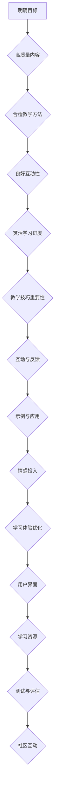

                 

关键词：在线课程、课程设计、程序员、教学技巧、学习体验

摘要：本文旨在探讨如何打造高价值的在线课程，尤其是针对程序员的课程。我们将从课程设计、教学技巧、学习体验等方面，提供一系列实用建议，帮助程序员们创建出既吸引人又富有教育意义的在线课程。

## 1. 背景介绍

在线教育已成为现代教育的重要组成部分。随着互联网的普及和技术的进步，越来越多的人选择通过在线课程来提升自己的技能和知识。对于程序员来说，在线课程不仅可以提供学习新技术的途径，还可以帮助他们巩固基础知识，提高职业竞争力。

然而，打造高价值的在线课程并非易事。课程内容需要与时俱进，教学方法需要不断创新，学习体验需要持续优化。本文将围绕这三个方面，为程序员提供一些建议和策略，帮助他们打造出高价值的在线课程。

### 1.1 课程设计的核心要素

一个成功的在线课程需要具备以下几个核心要素：

1. **明确的目标**：课程目标应该明确，便于学生了解他们将在课程中学到什么。
2. **高质量的内容**：内容要充实、有趣，且具有实际应用价值。
3. **合适的教学方法**：教学方法要多样，以适应不同的学习风格。
4. **良好的互动性**：课程应提供与学生和讲师之间的互动机会。
5. **灵活的学习进度**：学生应能够根据自己的进度学习。

### 1.2 教学技巧的重要性

教学技巧是决定课程质量的关键因素。一个优秀的讲师需要具备以下技能：

1. **清晰的讲解**：讲解要条理清晰，易于理解。
2. **互动与反馈**：鼓励学生提问，提供及时反馈。
3. **示例与应用**：通过实例和实际应用来巩固知识。
4. **情感投入**：与学生建立良好的关系，激发学习兴趣。

### 1.3 学习体验的优化

学习体验直接影响学生的学习效果和满意度。优化学习体验可以从以下几个方面入手：

1. **用户界面**：界面应简洁、美观，易于使用。
2. **学习资源**：提供丰富的学习资源，如视频、文档、代码示例等。
3. **测试与评估**：定期进行测试和评估，以帮助学生巩固所学知识。
4. **社区互动**：建立学习社区，促进学生之间的交流和合作。

## 2. 核心概念与联系

### 2.1 课程设计的Mermaid流程图



### 2.2 课程设计的核心要素与教学技巧、学习体验的关联

- **明确目标**：与教学技巧、学习体验紧密相关，有助于讲师和学生保持清晰的课程方向。
- **高质量内容**：是课程的核心，决定了学生的学习效果和满意度。
- **合适的教学方法**：直接影响学习体验，需要根据学生的特点和需求来定制。
- **良好互动性**：有助于提高学生的学习积极性和参与度。
- **灵活学习进度**：适应不同学习者的需求，提高学习体验。

## 3. 核心算法原理 & 具体操作步骤

### 3.1 算法原理概述

在线课程的设计是一个复杂的过程，涉及到教育理论、课程开发技术和教学实践等多个方面。核心算法原理主要包括以下几个方面：

1. **教育目标导向设计**：以学习者的需求为出发点，设定明确的学习目标和评估标准。
2. **内容结构化设计**：将课程内容按照逻辑关系和组织结构进行划分和整合。
3. **教学策略设计**：选择合适的教学方法和策略，以提高教学效果。
4. **学习体验设计**：注重学习者的情感体验和学习效果，优化学习过程。
5. **技术实现设计**：利用现代信息技术，提供丰富的学习资源和互动手段。

### 3.2 算法步骤详解

1. **需求分析**：与学习者进行沟通，了解他们的学习需求和目标。
2. **目标设定**：根据需求分析，设定具体的学习目标。
3. **内容规划**：根据目标，规划课程内容，确保其逻辑性和系统性。
4. **教学方法选择**：结合课程内容和学习者的特点，选择合适的教学方法。
5. **学习体验设计**：设计互动环节，提供反馈机制，优化学习体验。
6. **技术实现**：选择合适的技术平台和工具，实现课程设计和教学策略。

### 3.3 算法优缺点

**优点**：

- **灵活性**：在线课程可以根据学习者的需求和时间灵活调整。
- **多样性**：提供了多种教学方法和学习资源，适应不同的学习风格。
- **交互性**：学生可以与讲师和其他学习者互动，提高学习效果。

**缺点**：

- **技术门槛**：需要一定的技术支持，对于非专业人士来说可能有一定的难度。
- **学习效果难以评估**：在线课程的学习效果不如传统课堂易于评估。

### 3.4 算法应用领域

- **在线教育平台**：为各类课程提供技术支持和服务。
- **企业培训**：为员工提供技能提升和知识更新的培训。
- **个人学习**：为学习者提供自学和提升的机会。

## 4. 数学模型和公式 & 详细讲解 & 举例说明

### 4.1 数学模型构建

在线课程设计可以视为一个多目标优化问题，涉及以下几个核心参数：

- **学习者需求**（$D$）
- **课程内容质量**（$C$）
- **教学方法适应性**（$T$）
- **学习体验满意度**（$E$）

构建数学模型的目标是最小化成本（$C_{cost}$）和最大化收益（$R$）：

$$
\min C_{cost} = C_D + C_C + C_T + C_E
$$

$$
\max R = R_D + R_C + R_T + R_E
$$

### 4.2 公式推导过程

推导过程主要基于以下几个基本假设：

1. **线性关系**：各项成本和收益可以线性表示。
2. **权重分配**：各项成本和收益根据重要性分配权重。

假设权重分别为 $w_D, w_C, w_T, w_E$，则：

$$
C_D = w_D \cdot (D - D_{min})
$$

$$
C_C = w_C \cdot (C - C_{min})
$$

$$
C_T = w_T \cdot (T - T_{min})
$$

$$
C_E = w_E \cdot (E - E_{min})
$$

$$
R_D = w_D \cdot (D_{max} - D)
$$

$$
R_C = w_C \cdot (C_{max} - C)
$$

$$
R_T = w_T \cdot (T_{max} - T)
$$

$$
R_E = w_E \cdot (E_{max} - E)
$$

### 4.3 案例分析与讲解

以一门编程语言入门课程为例，构建数学模型并进行优化。

- **需求分析**（$D$）：学员希望掌握Python基础语法和常用库。
- **内容质量**（$C$）：课程包含基础语法、函数、循环、列表等。
- **教学方法适应性**（$T$）：采用视频讲解、代码示例、练习题等多种形式。
- **学习体验满意度**（$E$）：学员反馈课程结构清晰，易于理解。

根据以上数据，设置权重为 $w_D = 0.4, w_C = 0.3, w_T = 0.2, w_E = 0.1$，构建模型并优化。

$$
\min C_{cost} = 0.4 \cdot (D - D_{min}) + 0.3 \cdot (C - C_{min}) + 0.2 \cdot (T - T_{min}) + 0.1 \cdot (E - E_{min})
$$

$$
\max R = 0.4 \cdot (D_{max} - D) + 0.3 \cdot (C_{max} - C) + 0.2 \cdot (T_{max} - T) + 0.1 \cdot (E_{max} - E)
$$

通过模型优化，提高课程设计的整体质量和学习效果。

## 5. 项目实践：代码实例和详细解释说明

### 5.1 开发环境搭建

为了实践在线课程设计，我们需要搭建一个基本的开发环境。以下是所需步骤：

1. **安装Python**：从官方网站下载并安装Python。
2. **安装Jupyter Notebook**：在终端中执行 `pip install jupyter`。
3. **创建虚拟环境**：在终端中执行 `python -m venv myenv`。
4. **激活虚拟环境**：在Windows上执行 `myenv\Scripts\activate`，在Linux/Mac上执行 `source myenv/bin/activate`。

### 5.2 源代码详细实现

以下是一个简单的Python代码实例，用于演示如何在Jupyter Notebook中编写和运行代码：

```python
# 导入所需的库
import matplotlib.pyplot as plt

# 定义函数
def plot_graph(x, y):
    plt.plot(x, y)
    plt.xlabel('X-axis')
    plt.ylabel('Y-axis')
    plt.title('Graph Title')
    plt.show()

# 生成数据
x = [1, 2, 3, 4, 5]
y = [1, 4, 9, 16, 25]

# 绘制图形
plot_graph(x, y)
```

### 5.3 代码解读与分析

上述代码分为两部分：函数定义和图形绘制。

- **函数定义**：`plot_graph` 函数接受两个参数 `x` 和 `y`，用于定义图形的数据。
- **图形绘制**：使用 `matplotlib` 库中的 `plot` 函数绘制图形，并通过 `xlabel`、`ylabel` 和 `title` 函数添加标签和标题。

### 5.4 运行结果展示

运行上述代码后，将显示一个简单的折线图，其中 `x` 轴和 `y` 轴分别表示输入的数值。

## 6. 实际应用场景

在线课程的应用场景广泛，涵盖教育、培训、技能提升等多个领域。以下是一些实际应用场景：

- **高等教育**：大学和学院通过在线课程提供额外的课程和学分。
- **职业教育**：企业为员工提供专业培训，以提升员工技能和知识。
- **个人成长**：学习者通过在线课程学习新技能，提升自身竞争力。

### 6.4 未来应用展望

随着技术的不断发展，在线课程的应用前景将更加广阔。以下是未来应用展望：

- **个性化学习**：利用大数据和人工智能技术，提供更加个性化的学习体验。
- **混合式学习**：结合在线和线下学习，实现更好的学习效果。
- **开放教育资源（OER）**：通过开放教育资源，降低学习门槛，促进教育公平。

## 7. 工具和资源推荐

### 7.1 学习资源推荐

- **Coursera**：提供大量免费和付费的在线课程。
- **edX**：全球领先的在线学习平台，提供多个领域的课程。
- **Udemy**：提供丰富的专业课程，涵盖技术、商业等多个领域。

### 7.2 开发工具推荐

- **Jupyter Notebook**：用于编写和运行Python代码。
- **VS Code**：一款强大的代码编辑器，支持多种编程语言。
- **PyCharm**：一款功能丰富的Python集成开发环境。

### 7.3 相关论文推荐

- **"Online Learning Platforms: A Systematic Literature Review"**：综述在线教育平台的发展和应用。
- **"Blended Learning: Uncovering Its Benefits, Challenges, and Effective Practices"**：探讨混合式学习的优势和挑战。

## 8. 总结：未来发展趋势与挑战

### 8.1 研究成果总结

通过本文的探讨，我们总结了在线课程设计的关键要素、教学技巧、学习体验优化以及未来发展趋势。研究成果表明，在线课程的设计和开发是一个复杂而富有挑战的过程，需要综合考虑多个方面。

### 8.2 未来发展趋势

未来在线课程的发展趋势包括个性化学习、混合式学习和开放教育资源等。这些趋势将推动在线教育的发展，为学习者提供更好的学习体验。

### 8.3 面临的挑战

在线课程面临的挑战包括技术门槛、学习效果评估以及学习体验优化等。解决这些挑战需要持续的研究和创新。

### 8.4 研究展望

未来研究应关注在线课程设计的自动化工具和算法、学习效果的大数据分析以及个性化学习策略的优化。通过不断的研究和创新，我们有望推动在线教育的进一步发展。

## 9. 附录：常见问题与解答

### 9.1 如何选择在线课程平台？

- **需求分析**：了解自己的学习目标和需求，选择合适的平台。
- **课程质量**：查看课程的评分和评论，确保课程质量。
- **费用**：考虑预算，选择性价比高的平台。

### 9.2 在线课程如何确保学习效果？

- **定期测试**：通过测试和作业来巩固所学知识。
- **互动与反馈**：积极参与课程互动，与讲师和其他学习者交流。
- **自主学习**：制定学习计划，定期复习和总结。

### 9.3 在线课程开发过程中需要注意什么？

- **内容规划**：确保课程内容逻辑清晰，结构完整。
- **教学方法**：根据课程特点和学习者需求选择合适的教学方法。
- **技术实现**：确保课程技术实现稳定、高效。

通过以上问题和解答，希望对您在在线课程设计、开发和参与过程中有所帮助。

---

**作者：禅与计算机程序设计艺术 / Zen and the Art of Computer Programming**

