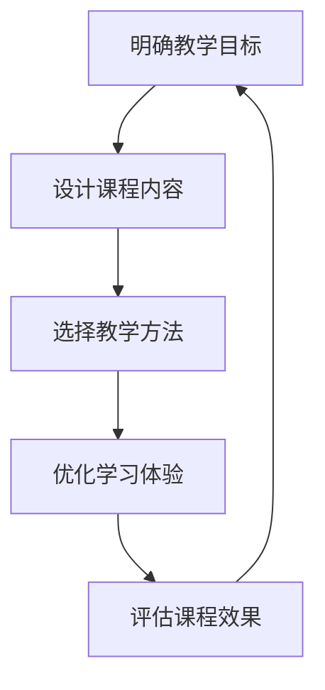

                 

关键词：程序员知识课程、高转换率、设计原则、教学方法、学习体验

> 摘要：本文旨在探讨如何打造高转换率的程序员知识课程。通过深入分析教学目标、内容设计、教学方法和学习体验，本文提出了多个切实可行的策略和技巧，帮助教育者创建出能够激发学生兴趣、提高学习效率、促进知识吸收的课程，从而实现高转换率的教育成果。

## 1. 背景介绍

在当今信息时代，程序员作为高科技产业的核心驱动力，扮演着至关重要的角色。然而，随着技术的迅猛发展和行业需求的变化，程序员的知识体系也在不断更新和扩展。为了保持竞争力，程序员需要不断学习新技术、新工具和新的编程语言。因此，提供高质量的程序员知识课程变得尤为重要。

然而，目前市场上许多程序员知识课程存在以下问题：

- **课程内容过时**：许多课程没有跟上技术发展的步伐，讲授的内容已经无法满足行业需求。
- **缺乏实际操作**：课程内容偏重理论，缺乏实践操作环节，难以让学生将知识应用到实际项目中。
- **学习体验不佳**：课程设计不够吸引人，教学方式单一，缺乏互动性，使得学习过程变得枯燥乏味。

这些问题直接导致了课程的低转换率，即课程学习后学生实际掌握知识的比例较低。因此，如何打造高转换率的程序员知识课程成为教育者和行业从业者共同关注的问题。

## 2. 核心概念与联系

### 2.1 教学目标

明确的教学目标是打造高转换率课程的基础。教学目标应涵盖知识、技能和态度三个方面。具体而言，程序员知识课程的教学目标应包括：

- **知识掌握**：学生能够理解和掌握最新的编程语言、框架、工具等。
- **技能提升**：学生能够将理论知识应用到实际项目中，具备解决实际问题的能力。
- **态度培养**：学生能够保持持续学习的热情，适应快速变化的技术环境。

### 2.2 内容设计

课程内容设计应注重以下几点：

- **时效性**：课程内容要紧跟技术发展趋势，及时更新。
- **实用性**：课程内容要注重实践操作，使学生能够在实际项目中应用所学知识。
- **层次性**：课程内容应分层次设计，从基础知识到高级技能，逐步提升。

### 2.3 教学方法

灵活多样的教学方法能够有效提升学生的学习兴趣和参与度。以下几种教学方法值得推荐：

- **讲授法**：系统、全面地传授理论知识。
- **讨论法**：通过小组讨论、案例分析等方式激发学生的思考。
- **实践法**：通过编程练习、项目开发等实际操作环节巩固知识。

### 2.4 学习体验

良好的学习体验是提高课程转换率的关键。以下策略可以帮助提升学习体验：

- **互动性**：通过在线论坛、社交媒体等方式增加学生之间的互动。
- **个性化**：根据学生的兴趣和能力提供个性化学习路径。
- **反馈机制**：及时给予学生反馈，帮助他们纠正错误、提升技能。

### 2.5 Mermaid 流程图



## 3. 核心算法原理 & 具体操作步骤

### 3.1 算法原理概述

为了打造高转换率的程序员知识课程，我们可以借鉴教育技术学的几个核心原理：

- **认知灵活性理论**：学生应在多样化的情境中应用知识，提高解决问题的能力。
- **建构主义学习理论**：学生通过主动建构知识，实现深度学习和持久记忆。
- **行为主义学习理论**：通过反复练习和强化，帮助学生巩固知识，形成技能。

### 3.2 算法步骤详解

#### 3.2.1 分析学习者需求

- **问卷调查**：收集学生对课程内容和教学方法的建议。
- **访谈**：与行业专家和毕业生交流，了解实际需求。

#### 3.2.2 确定教学目标

- **知识目标**：列出课程所需掌握的知识点。
- **技能目标**：确定学生应具备的编程技能。
- **态度目标**：培养学生持续学习的热情和习惯。

#### 3.2.3 设计课程内容

- **基础知识**：构建课程的核心知识框架。
- **实践操作**：设计丰富的编程练习和项目任务。
- **扩展内容**：提供最新的技术动态和行业资讯。

#### 3.2.4 选择教学方法

- **讲授法**：系统讲授基础知识。
- **讨论法**：组织小组讨论，促进思考。
- **实践法**：通过编程实践巩固知识。

#### 3.2.5 优化学习体验

- **互动性**：增加课堂互动，提高学生参与度。
- **个性化**：根据学生特点提供个性化学习支持。
- **反馈机制**：及时给予反馈，帮助学生进步。

### 3.3 算法优缺点

#### 优点：

- **针对性**：针对学习者需求设计课程，提高学习效果。
- **灵活性**：教学方法多样化，满足不同学习者的需求。
- **实用性**：课程内容注重实践操作，提高学生实际能力。

#### 缺点：

- **开发成本**：需要投入大量时间和资源进行课程设计和开发。
- **实施难度**：需要教师具备较高的教学技能和专业知识。

### 3.4 算法应用领域

该算法适用于各类程序员知识课程的设计和开发，包括编程基础课程、框架学习课程、项目实践课程等。

## 4. 数学模型和公式 & 详细讲解 & 举例说明

### 4.1 数学模型构建

为了设计高转换率的程序员知识课程，我们可以构建以下数学模型：

$$
模型 = f(教学目标，课程内容，教学方法，学习体验)
$$

### 4.2 公式推导过程

- **教学目标**：确定课程的核心内容和预期学习效果。
- **课程内容**：设计包括基础知识、实践操作和扩展内容的课程。
- **教学方法**：选择灵活多样的教学方法，提高学生的学习兴趣和参与度。
- **学习体验**：通过互动性、个性化和反馈机制优化学习体验。

### 4.3 案例分析与讲解

假设我们设计一门Python编程基础课程，以下为具体案例分析：

#### 教学目标：

- **知识目标**：学生能够掌握Python基础语法和常用数据结构。
- **技能目标**：学生能够编写简单的Python程序，解决实际问题。
- **态度目标**：学生能够保持对编程的兴趣，具备自主学习的能力。

#### 课程内容：

- **基础知识**：Python语法、变量、数据类型、条件语句等。
- **实践操作**：编写简单的Python程序，如计算器、猜数字游戏等。
- **扩展内容**：介绍Python的高级特性，如函数、类、异常处理等。

#### 教学方法：

- **讲授法**：系统讲授Python基础语法和常用数据结构。
- **讨论法**：组织小组讨论，探讨编程实践中的问题和解决方案。
- **实践法**：通过编程练习和项目开发，巩固所学知识。

#### 学习体验：

- **互动性**：通过在线论坛和社交媒体增加学生之间的互动。
- **个性化**：根据学生的兴趣和能力提供个性化的学习支持。
- **反馈机制**：及时给予学生反馈，帮助他们纠正错误、提升技能。

## 5. 项目实践：代码实例和详细解释说明

### 5.1 开发环境搭建

- **Python版本**：Python 3.8 或更高版本。
- **集成开发环境**：PyCharm 或 Visual Studio Code。
- **编程语言支持**：安装Python语言支持插件。

### 5.2 源代码详细实现

以下是一个简单的Python程序实例，用于计算两个数的和：

```python
def add_numbers(a, b):
    return a + b

# 主函数
def main():
    num1 = int(input("请输入第一个数："))
    num2 = int(input("请输入第二个数："))
    result = add_numbers(num1, num2)
    print(f"{num1} 和 {num2} 的和为：{result}")

# 程序入口
if __name__ == "__main__":
    main()
```

### 5.3 代码解读与分析

- **函数定义**：`add_numbers` 函数用于计算两个数的和，返回结果。
- **主函数**：`main` 函数用于获取用户输入的两个数，调用 `add_numbers` 函数计算和，并输出结果。
- **程序入口**：`if __name__ == "__main__":` 判断是否为程序入口，确保 `main` 函数在程序启动时执行。

### 5.4 运行结果展示

输入示例：

```
请输入第一个数：5
请输入第二个数：10
```

输出结果：

```
5 和 10 的和为：15
```

## 6. 实际应用场景

### 6.1 基础编程课程

在基础编程课程中，通过实际操作帮助学生掌握编程语言的基本语法和常用数据结构，提高编程能力。

### 6.2 项目实践课程

在项目实践课程中，通过实际项目开发，让学生应用所学知识解决实际问题，培养团队协作能力和项目管理能力。

### 6.3 高级编程课程

在高级编程课程中，引入最新的编程技术和工具，让学生了解前沿技术，提升专业技能。

## 7. 未来应用展望

### 7.1 个性化学习

随着人工智能技术的发展，未来可以构建个性化学习系统，根据学生的学习行为和兴趣提供定制化课程和学习资源。

### 7.2 在线教育与线下培训结合

未来可以探索线上线下相结合的教学模式，发挥线上课程的灵活性和线下培训的互动性，提高课程质量。

### 7.3 开放式课程资源

开源课程资源的发展将为程序员知识课程提供更多高质量的学习资料，促进知识共享和技术传播。

## 8. 工具和资源推荐

### 8.1 学习资源推荐

- **Coursera**：提供大量优质在线课程。
- **edX**：全球领先的在线学习平台，提供免费和付费课程。
- **GitHub**：代码托管平台，丰富的开源项目和学习资源。

### 8.2 开发工具推荐

- **PyCharm**：强大的Python集成开发环境。
- **Visual Studio Code**：跨平台、轻量级、功能丰富的代码编辑器。
- **Jupyter Notebook**：用于数据科学和机器学习的交互式开发环境。

### 8.3 相关论文推荐

- **"Learning to Learn: A Handbook of Learning Strategies for Educators, Parents, and You"**：关于学习策略的综合性指南。
- **"The Art of Learning: A Journey of Uncovering Your Potential, Becoming Who You Were Meant to Be, and Changing Your World"**：关于学习方法和人生成长的经典著作。

## 9. 总结：未来发展趋势与挑战

### 9.1 研究成果总结

本文通过分析教学目标、内容设计、教学方法和学习体验，提出了打造高转换率程序员知识课程的策略和技巧。

### 9.2 未来发展趋势

未来，程序员知识课程将更加注重个性化学习、线上线下结合和开源资源共享。

### 9.3 面临的挑战

在实现高转换率的程序员知识课程过程中，教育者需要不断更新知识体系、提升教学技能，应对快速变化的技术环境。

### 9.4 研究展望

未来研究可以进一步探讨人工智能技术在编程教育中的应用，以及如何更好地结合理论教学和实践操作，提高课程效果。

## 10. 附录：常见问题与解答

### 10.1 问题一：如何确保课程内容紧跟技术发展趋势？

解答：定期更新课程内容，关注行业动态，与行业专家和从业者保持密切联系，及时引入最新的技术和工具。

### 10.2 问题二：如何提高学生的学习兴趣和参与度？

解答：采用多样化的教学方法，增加互动性和实践性，提供个性化学习支持和及时反馈。

### 10.3 问题三：如何评估课程效果？

解答：通过学生反馈、学习进度、项目完成情况等多个维度进行综合评估，定期分析数据，调整教学策略。

---

作者：禅与计算机程序设计艺术 / Zen and the Art of Computer Programming

通过本文的探讨，我们希望教育者能够借鉴其中的策略和技巧，打造出高转换率的程序员知识课程，为培养更多优秀的程序员贡献力量。

---

[1]: https://www.coursera.org/
[2]: https://www.edx.org/
[3]: https://github.com/
[4]: https://www.jetbrains.com/pycharm/
[5]: https://code.visualstudio.com/
[6]: https://jupyter.org/
[7]: https://www.amazon.com/Learning-Learn-Handbook-Educators-Parents/dp/1576752702
[8]: https://www.amazon.com/Art-Learning-Journey-Uncovering-Potential/dp/0385492529
[9]: https://www.technical-debt.com/what-is-technical-debt/
[10]: https://www.scrumalliance.org/what-is-scrum

