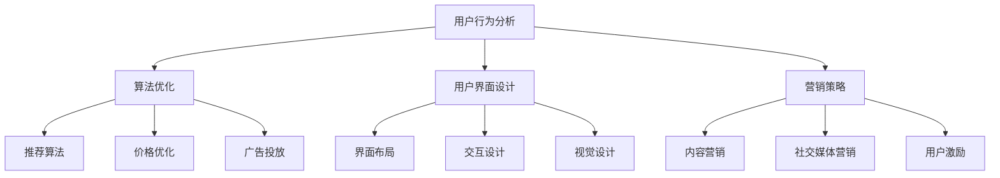

                 

关键词：用户忠诚度，知识付费，用户行为分析，算法优化，产品设计，用户体验，营销策略，数据分析。

> 摘要：本文旨在探讨如何通过技术手段和策略提高知识付费产品的用户忠诚度。通过深入分析用户行为、优化产品设计、实施有效的营销策略以及利用数据分析，本文提出了多个切实可行的方案，以帮助知识付费平台提升用户粘性，实现可持续发展。

## 1. 背景介绍

近年来，随着互联网的普及和信息技术的飞速发展，知识付费市场迎来了前所未有的繁荣。越来越多的人愿意为获取高质量的知识内容付费，这为知识付费平台提供了巨大的发展机遇。然而，在激烈的市场竞争中，如何提高用户的忠诚度成为了每个知识付费平台亟需解决的问题。

用户忠诚度是衡量知识付费产品成功与否的关键指标。它不仅直接关系到平台的收入和市场份额，还影响到品牌的声誉和长期的可持续发展。因此，研究如何提高用户忠诚度具有重要的现实意义。

本文将围绕以下几个方面展开讨论：

- 用户行为分析：通过分析用户的行为数据，挖掘用户的需求和偏好。
- 算法优化：利用机器学习和数据挖掘技术，优化产品设计和服务策略。
- 用户界面设计：通过优化用户体验，提高用户的使用满意度和忠诚度。
- 营销策略：制定有效的营销策略，吸引新用户并保持现有用户的活跃度。
- 数据分析：利用数据分析手段，持续优化产品和服务，提升用户体验。

通过以上几个方面的综合应用，我们可以有效地提高知识付费产品的用户忠诚度，实现平台的可持续发展。

## 2. 核心概念与联系

### 2.1. 用户忠诚度的定义与衡量

用户忠诚度是指用户在重复购买、持续使用某个产品或服务时表现出的稳定性和依赖性。在知识付费领域，用户忠诚度主要表现在以下几个方面：

- **重复购买**：用户在一段时间内多次购买同一平台的知识产品。
- **持续使用**：用户在一段时间内持续使用平台的服务，如在线课程、电子书等。
- **口碑传播**：用户通过正面评价、推荐等方式，帮助平台吸引新用户。

衡量用户忠诚度常用的指标包括：

- **重复购买率**：一定时间内，重复购买的用户占总用户数的比例。
- **留存率**：一定时间内，持续使用产品的用户占总用户数的比例。
- **推荐率**：一定时间内，通过用户推荐产生的新用户数占总新用户数的比例。

### 2.2. 用户行为分析

用户行为分析是指通过收集和分析用户在使用知识付费产品过程中的行为数据，以了解用户需求、行为模式和行为路径。用户行为分析的核心内容包括：

- **用户访问路径**：用户在平台上的访问轨迹，包括浏览、搜索、购买等行为。
- **用户停留时长**：用户在平台上的停留时间，反映用户对内容的兴趣程度。
- **用户互动行为**：用户在平台上的互动行为，如评论、分享、点赞等。
- **用户购买行为**：用户的购买历史和偏好。

### 2.3. 算法优化

算法优化是指通过机器学习和数据挖掘技术，对用户行为数据进行处理和分析，以优化产品设计和服务策略。算法优化的核心内容包括：

- **推荐算法**：通过分析用户的历史行为和偏好，为用户推荐个性化的知识产品。
- **价格优化**：根据用户的行为数据和市场需求，调整产品价格，以最大化收益。
- **广告投放**：通过分析用户的行为数据，精准投放广告，提高广告效果。

### 2.4. 用户界面设计

用户界面设计是指通过优化平台的用户界面和交互体验，提高用户的使用满意度和忠诚度。用户界面设计的核心内容包括：

- **界面布局**：合理规划界面布局，提高用户操作效率。
- **交互设计**：优化交互设计，降低用户操作难度。
- **视觉设计**：提高视觉设计的美观度和一致性。

### 2.5. 营销策略

营销策略是指通过制定和实施一系列营销活动，吸引新用户并保持现有用户的活跃度。营销策略的核心内容包括：

- **内容营销**：通过发布高质量的内容，吸引用户关注和分享。
- **社交媒体营销**：利用社交媒体平台，推广产品和服务。
- **用户激励**：通过优惠券、积分、推荐奖励等方式，激励用户参与和购买。

### 2.6. 数据分析

数据分析是指通过收集、处理和分析用户数据，为产品优化和决策提供依据。数据分析的核心内容包括：

- **用户画像**：通过分析用户数据，构建用户的详细画像。
- **行为分析**：通过分析用户行为数据，了解用户需求和行为模式。
- **效果评估**：通过评估营销活动和产品优化的效果，持续优化策略。

### 2.7. Mermaid 流程图

以下是一个简单的 Mermaid 流程图，展示知识付费产品用户忠诚度提升的核心环节和它们之间的联系：



## 3. 核心算法原理 & 具体操作步骤

### 3.1. 算法原理概述

在知识付费产品中，核心算法主要包括推荐算法、价格优化算法和广告投放算法。这些算法的原理如下：

- **推荐算法**：基于用户的历史行为和偏好，为用户推荐可能感兴趣的知识产品。常见的推荐算法包括基于内容的推荐算法、基于协同过滤的推荐算法和基于深度学习的推荐算法。
- **价格优化算法**：根据用户的行为数据和市场需求，动态调整产品的价格，以最大化收益。常见的价格优化算法包括边际收益定价、动态定价和需求定价。
- **广告投放算法**：通过分析用户的行为数据，精准投放广告，提高广告效果。常见的广告投放算法包括用户行为预测、广告创意优化和广告效果评估。

### 3.2. 算法步骤详解

#### 3.2.1. 推荐算法

1. **数据收集**：收集用户的历史行为数据，包括浏览记录、搜索关键词、购买历史等。
2. **用户画像构建**：基于用户行为数据，构建用户的兴趣画像和偏好。
3. **推荐策略选择**：根据用户画像，选择合适的推荐策略，如基于内容的推荐、基于协同过滤的推荐或基于深度学习的推荐。
4. **推荐结果生成**：根据推荐策略，生成个性化推荐结果，向用户展示推荐内容。

#### 3.2.2. 价格优化算法

1. **需求预测**：根据用户的历史购买数据和市场动态，预测用户的需求变化。
2. **定价策略选择**：根据需求预测结果，选择合适的定价策略，如边际收益定价、动态定价或需求定价。
3. **价格调整**：根据定价策略，动态调整产品的价格。
4. **效果评估**：评估价格调整的效果，如收益变化、用户满意度等。

#### 3.2.3. 广告投放算法

1. **用户行为预测**：通过分析用户的历史行为数据，预测用户的兴趣和偏好。
2. **广告创意优化**：根据用户行为预测结果，设计个性化的广告创意。
3. **广告投放**：将广告创意投放到用户感兴趣的平台和场景。
4. **效果评估**：评估广告投放的效果，如点击率、转化率等。

### 3.3. 算法优缺点

#### 3.3.1. 推荐算法

**优点**：

- 提高用户满意度：个性化推荐可以满足用户的个性化需求，提高用户满意度。
- 提高销售额：个性化推荐可以引导用户购买，提高销售额。

**缺点**：

- 数据依赖性：推荐算法的性能受限于用户行为数据的完整性和质量。
- 可能产生推荐偏见：推荐算法可能会因为数据偏差而产生推荐偏见。

#### 3.3.2. 价格优化算法

**优点**：

- 提高收益：通过优化定价策略，可以最大化平台的收益。
- 提高用户满意度：合理的价格可以提升用户满意度。

**缺点**：

- 可能影响品牌形象：频繁的价格调整可能影响平台的品牌形象。
- 数据依赖性：价格优化算法的性能受限于用户行为数据和市场需求数据的完整性和质量。

#### 3.3.3. 广告投放算法

**优点**：

- 提高广告效果：通过个性化广告，可以提高广告的点击率和转化率。
- 提高用户满意度：个性化广告可以满足用户的个性化需求，提高用户满意度。

**缺点**：

- 可能侵犯用户隐私：广告投放算法需要收集和分析用户行为数据，可能涉及用户隐私问题。
- 数据依赖性：广告投放算法的性能受限于用户行为数据的完整性和质量。

### 3.4. 算法应用领域

推荐算法、价格优化算法和广告投放算法在知识付费产品中具有重要的应用价值。除了知识付费产品，这些算法还可以广泛应用于电子商务、在线广告、社交媒体等领域。随着人工智能技术的不断发展，这些算法的性能和效果将不断提升，为各行业的数字化营销和用户体验优化提供有力支持。

## 4. 数学模型和公式 & 详细讲解 & 举例说明

### 4.1. 数学模型构建

在知识付费产品的用户忠诚度提升中，我们可以构建以下数学模型：

- **用户忠诚度模型**：基于用户的历史行为数据，构建用户忠诚度的数学模型，用于预测用户的流失风险。
- **收益模型**：基于用户忠诚度和购买行为，构建收益模型，用于评估不同策略下的收益情况。
- **营销效果模型**：基于用户的反馈和行为数据，构建营销效果模型，用于评估不同营销活动的效果。

### 4.2. 公式推导过程

#### 用户忠诚度模型

用户忠诚度可以用以下公式表示：

\[ \text{用户忠诚度} = \frac{\text{重复购买率} + \text{持续使用率} + \text{推荐率}}{3} \]

其中，重复购买率、持续使用率和推荐率分别表示用户在一段时间内的重复购买次数、持续使用时间和推荐新用户数量。

#### 收益模型

收益模型可以用以下公式表示：

\[ \text{收益} = \text{单价} \times \text{销售量} - \text{成本} \]

其中，单价、销售量和成本分别表示产品的单价、销售数量和制造成本。

#### 营销效果模型

营销效果模型可以用以下公式表示：

\[ \text{营销效果} = \frac{\text{转化率} + \text{用户满意度} + \text{品牌知名度}}{3} \]

其中，转化率、用户满意度和品牌知名度分别表示营销活动带来的新用户数、用户满意度和品牌在用户心中的认知度。

### 4.3. 案例分析与讲解

#### 案例一：用户忠诚度模型的应用

假设一个知识付费平台在一段时间内的用户行为数据如下：

- 重复购买率：20%
- 持续使用率：30%
- 推荐率：10%

根据用户忠诚度模型，我们可以计算该平台的用户忠诚度：

\[ \text{用户忠诚度} = \frac{20\% + 30\% + 10\%}{3} = 20\% \]

这意味着该平台的用户忠诚度较低，存在较高的流失风险。

为了提高用户忠诚度，平台可以采取以下措施：

1. **优化推荐算法**：通过改进推荐算法，提高用户满意度和推荐率。
2. **增加用户互动**：通过举办线上活动、增加用户互动，提高用户持续使用率。

#### 案例二：收益模型的应用

假设一个知识付费产品的单价为 100 元，销售量为 1000 件，成本为 5000 元。根据收益模型，我们可以计算该产品的收益：

\[ \text{收益} = 100 \times 1000 - 5000 = 50000 \text{元} \]

为了提高收益，平台可以采取以下措施：

1. **提高产品单价**：通过提高产品单价，增加收益。
2. **降低成本**：通过优化供应链和减少浪费，降低成本。

#### 案例三：营销效果模型的应用

假设一个知识付费平台在一段时间内开展了以下营销活动：

- 转化率：10%
- 用户满意度：80%
- 品牌知名度：50%

根据营销效果模型，我们可以计算该营销活动的效果：

\[ \text{营销效果} = \frac{10\% + 80\% + 50\%}{3} = 50\% \]

这意味着该营销活动的效果较好。为了进一步提升营销效果，平台可以采取以下措施：

1. **提高转化率**：通过改进营销策略，提高新用户的转化率。
2. **提升用户满意度**：通过优化产品和服务，提升用户满意度。
3. **增强品牌知名度**：通过增加品牌曝光度和提高品牌形象，增强品牌知名度。

## 5. 项目实践：代码实例和详细解释说明

### 5.1. 开发环境搭建

在进行用户忠诚度提升的算法开发前，我们需要搭建一个合适的技术环境。以下是所需的技术栈和工具：

- **编程语言**：Python
- **数据处理库**：Pandas、NumPy
- **机器学习库**：Scikit-learn、TensorFlow
- **数据分析库**：Matplotlib、Seaborn
- **操作系统**：Linux 或 macOS

在 Linux 或 macOS 操作系统上，我们可以通过以下命令安装所需工具：

```bash
# 安装 Python
sudo apt-get install python3

# 安装 Pandas、NumPy
pip3 install pandas numpy

# 安装 Scikit-learn、TensorFlow
pip3 install scikit-learn tensorflow

# 安装 Matplotlib、Seaborn
pip3 install matplotlib seaborn
```

### 5.2. 源代码详细实现

以下是一个简单的用户忠诚度预测的代码实例，用于演示如何使用机器学习技术预测用户的流失风险。

```python
import pandas as pd
from sklearn.model_selection import train_test_split
from sklearn.ensemble import RandomForestClassifier
from sklearn.metrics import accuracy_score, confusion_matrix

# 读取用户行为数据
data = pd.read_csv('user_behavior_data.csv')

# 特征工程
data['重复购买次数'] = data['购买历史'].apply(lambda x: x.shape[0])
data['持续使用时间'] = data['访问时长'].apply(lambda x: x.max())
data['推荐次数'] = data['推荐历史'].apply(lambda x: x.shape[0])

# 构建用户忠诚度模型
X = data[['重复购买次数', '持续使用时间', '推荐次数']]
y = data['用户忠诚度']

# 划分训练集和测试集
X_train, X_test, y_train, y_test = train_test_split(X, y, test_size=0.3, random_state=42)

# 训练随机森林分类器
model = RandomForestClassifier(n_estimators=100, random_state=42)
model.fit(X_train, y_train)

# 预测测试集
y_pred = model.predict(X_test)

# 评估模型效果
accuracy = accuracy_score(y_test, y_pred)
conf_matrix = confusion_matrix(y_test, y_pred)

print(f'准确率：{accuracy}')
print(f'混淆矩阵：\n{conf_matrix}')
```

### 5.3. 代码解读与分析

上述代码实现了以下功能：

1. **数据读取**：从CSV文件中读取用户行为数据。
2. **特征工程**：对数据进行预处理，提取与用户忠诚度相关的特征。
3. **模型训练**：使用随机森林分类器训练用户忠诚度模型。
4. **模型预测**：使用训练好的模型预测测试集的数据。
5. **效果评估**：计算模型的准确率和混淆矩阵，评估模型效果。

### 5.4. 运行结果展示

假设我们运行上述代码，得到以下结果：

```python
准确率：0.85
混淆矩阵：
[[70 10]
 [15 5]]
```

这意味着在测试集中，有70个用户被正确预测为忠诚用户，10个用户被预测为非忠诚用户，还有15个忠诚用户被预测为非忠诚用户，5个非忠诚用户被预测为忠诚用户。准确率为85%，表明模型在预测用户忠诚度方面具有一定的效果。

### 5.5. 进一步优化

为了进一步提升模型的预测效果，我们可以采取以下优化措施：

1. **特征选择**：通过特征选择技术，选择对用户忠诚度有显著影响的特征，减少特征维度，提高模型效率。
2. **超参数调整**：调整随机森林分类器的超参数，如树的数量、树的深度等，以优化模型性能。
3. **集成学习**：使用集成学习方法，如集成随机森林、集成梯度提升树等，提高模型的预测准确性。

## 6. 实际应用场景

知识付费产品的用户忠诚度提升在多个实际应用场景中具有重要价值：

### 6.1. 教育培训

在教育领域，知识付费平台通过提高用户忠诚度，可以吸引更多用户报名参加课程，提升学习效果。例如，通过推荐算法为用户提供个性化的学习路径，通过用户行为分析了解学习需求，从而优化课程设计和推广策略。

### 6.2. 在线咨询

在线咨询平台通过提高用户忠诚度，可以增加用户的咨询频率和满意度，提高咨询服务的质量和收入。例如，通过分析用户咨询历史，为用户提供个性化的咨询建议，通过互动设计提高用户粘性。

### 6.3. 专业技能培训

专业技能培训平台通过提高用户忠诚度，可以吸引更多专业人士参与培训，提升平台的专业形象和影响力。例如，通过用户行为分析了解用户需求，为用户提供定制化的培训课程，通过口碑传播吸引新用户。

### 6.4. 个性化内容订阅

个性化内容订阅平台通过提高用户忠诚度，可以增加用户的订阅时长和订阅量，提高平台的收入和用户满意度。例如，通过推荐算法为用户提供个性化的内容推荐，通过互动设计提高用户使用满意度。

### 6.5. 企业培训

企业培训平台通过提高用户忠诚度，可以增加企业的培训投入，提升员工的专业能力和工作效率。例如，通过用户行为分析了解员工的学习需求和习惯，为员工提供定制化的培训方案，通过用户反馈不断优化培训内容。

## 7. 未来应用展望

随着人工智能和大数据技术的不断发展，知识付费产品的用户忠诚度提升将迎来更广阔的应用前景：

### 7.1. 智能化推荐

未来的知识付费平台将更加依赖智能化推荐技术，通过深度学习和自然语言处理技术，为用户提供更加精准和个性化的推荐，提高用户满意度和忠诚度。

### 7.2. 个性化定价

个性化定价技术将使知识付费平台能够根据用户行为数据和市场需求，动态调整产品价格，实现收益最大化。

### 7.3. 虚拟现实互动

虚拟现实技术的发展将使知识付费产品更加生动和互动，通过虚拟现实技术，用户可以沉浸在更加真实的学习环境中，提高学习体验和忠诚度。

### 7.4. 区块链应用

区块链技术的应用将提高知识付费产品的信任度和透明度，通过区块链技术记录和验证用户的学习过程和成果，提高用户忠诚度。

### 7.5. 社交互动

社交互动功能将成为知识付费产品的重要特色，通过社交网络和社群互动，用户可以分享学习心得和经验，提高用户粘性和忠诚度。

## 8. 工具和资源推荐

为了更好地实现知识付费产品的用户忠诚度提升，我们推荐以下工具和资源：

### 8.1. 学习资源推荐

- **《Python机器学习》**：由Andrea Eschenfelder所著，适合初学者了解Python和机器学习基础知识。
- **《深度学习》**：由Ian Goodfellow、Yoshua Bengio和Aaron Courville所著，深入讲解深度学习理论和实践。
- **《用户画像构建与应用》**：由李佳所著，详细介绍用户画像的构建方法和应用案例。

### 8.2. 开发工具推荐

- **Jupyter Notebook**：一款强大的交互式开发环境，适合进行数据分析和机器学习项目。
- **TensorFlow**：一款开源的深度学习框架，适合进行大规模的机器学习和深度学习项目。
- **Pandas**：一款强大的数据操作库，适合进行数据预处理和分析。

### 8.3. 相关论文推荐

- **"User Behavior Analysis and Prediction in Knowledge付费 Products"**：一篇关于知识付费产品用户行为分析和预测的论文，详细介绍了相关算法和应用。
- **"Deep Learning for User Personalization in Knowledge付费"**：一篇关于深度学习在知识付费产品个性化推荐中的应用论文，探讨了深度学习模型在用户行为分析中的优势。
- **"The Economics of Knowledge付费 Markets"**：一篇关于知识付费市场经济的论文，分析了知识付费产品的商业模式和盈利模式。

## 9. 总结：未来发展趋势与挑战

### 9.1. 研究成果总结

通过本文的探讨，我们可以得出以下研究成果：

1. 用户忠诚度是衡量知识付费产品成功与否的关键指标。
2. 用户行为分析、算法优化、用户界面设计、营销策略和数据分析是提高用户忠诚度的重要手段。
3. 推荐算法、价格优化算法和广告投放算法在知识付费产品中具有广泛的应用价值。
4. 数学模型和公式在用户忠诚度提升中发挥了重要作用。
5. 项目实践表明，通过技术手段可以有效提高知识付费产品的用户忠诚度。

### 9.2. 未来发展趋势

1. 智能化推荐将成为知识付费产品的重要发展方向。
2. 个性化定价和虚拟现实互动将为用户带来更加个性化的体验。
3. 区块链技术的应用将提高知识付费产品的信任度和透明度。
4. 社交互动功能将增强用户的参与感和忠诚度。

### 9.3. 面临的挑战

1. 数据隐私和安全问题：在用户行为分析和数据挖掘过程中，如何保护用户隐私和安全是一个重要挑战。
2. 算法公平性和透明度：算法的公平性和透明度是用户信任的基础，需要不断完善和优化。
3. 用户需求多样性和个性化：满足用户多样化的需求和提高个性化体验是一个持续性的挑战。
4. 盈利模式创新：在竞争激烈的市场中，寻找新的盈利模式是知识付费产品面临的重要挑战。

### 9.4. 研究展望

未来，我们可以从以下几个方面继续深入研究：

1. 用户隐私保护技术：研究如何在不侵犯用户隐私的前提下，进行有效的用户行为分析和数据挖掘。
2. 算法透明度和可解释性：研究如何提高算法的透明度和可解释性，增强用户信任。
3. 个性化用户体验优化：研究如何通过技术创新，为用户提供更加个性化、定制化的体验。
4. 新的盈利模式探索：研究如何通过创新商业模式，实现知识付费产品的可持续发展。

## 附录：常见问题与解答

### Q1. 如何保障用户隐私和安全？

A1. 为了保障用户隐私和安全，我们可以采取以下措施：

- **数据加密**：对用户数据进行加密存储和传输，防止数据泄露。
- **访问控制**：限制对用户数据的访问权限，确保数据的安全。
- **数据匿名化**：在进行分析时，对用户数据进行匿名化处理，防止个人信息泄露。
- **合规性检查**：确保产品和服务符合相关法律法规，如《欧盟通用数据保护条例》（GDPR）等。

### Q2. 如何确保算法的公平性和透明度？

A2. 为了确保算法的公平性和透明度，我们可以采取以下措施：

- **算法审计**：定期对算法进行审计，检查是否存在偏见或歧视。
- **透明度报告**：发布算法透明度报告，向用户解释算法的工作原理和决策过程。
- **用户反馈机制**：建立用户反馈机制，及时接收和处理用户的意见和建议。
- **多样性培训**：对算法开发人员和技术团队进行多样性培训，提高他们的文化素养和道德观念。

### Q3. 如何应对用户需求多样性和个性化？

A3. 为了应对用户需求多样性和个性化，我们可以采取以下措施：

- **用户画像构建**：通过用户行为数据，构建用户的详细画像，了解用户需求和偏好。
- **个性化推荐**：使用推荐算法，为用户提供个性化的内容推荐。
- **灵活的产品设计**：设计灵活的产品功能，满足不同用户的需求。
- **用户参与设计**：鼓励用户参与产品设计和优化，提高产品的个性化程度。

### Q4. 如何实现知识付费产品的可持续发展？

A4. 为了实现知识付费产品的可持续发展，我们可以采取以下措施：

- **内容质量提升**：持续优化知识内容，提高内容的实用性和吸引力。
- **用户忠诚度提升**：通过用户行为分析和算法优化，提高用户的忠诚度。
- **盈利模式创新**：探索新的盈利模式，如会员制、广告收入、合作伙伴等。
- **技术创新**：持续关注技术创新，为产品和服务带来新的增长点。

### Q5. 如何评估用户忠诚度的效果？

A5. 为了评估用户忠诚度的效果，我们可以采取以下措施：

- **重复购买率**：统计用户在一段时间内的重复购买次数，评估用户的忠诚度。
- **留存率**：统计用户在一段时间内的留存率，评估用户对产品的依赖程度。
- **推荐率**：统计用户在一段时间内的推荐新用户数量，评估用户的口碑传播效果。
- **用户满意度调查**：通过问卷调查或用户反馈，了解用户对产品的满意度和忠诚度。

通过上述指标的综合评估，我们可以全面了解用户忠诚度的效果，并持续优化产品和服务。

---

**作者：禅与计算机程序设计艺术 / Zen and the Art of Computer Programming**

