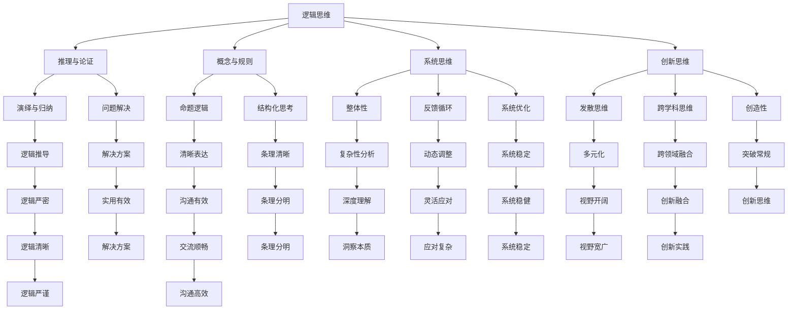
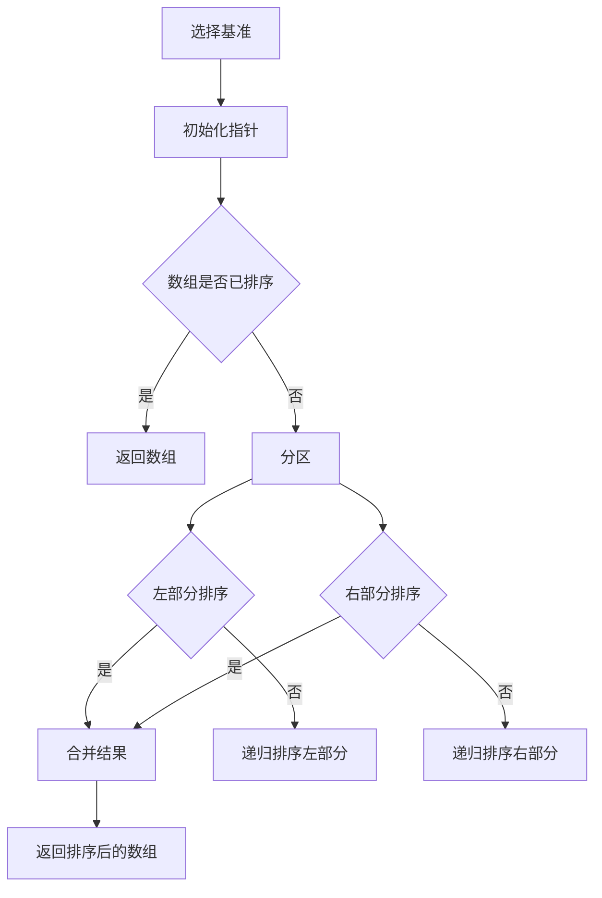

                 

关键词：思维框架、个人成长、认知升级、系统思维、创新思维、技术架构、编程思维

> 摘要：在快速变化的信息时代，构建个人的思维框架显得尤为重要。本文将深入探讨如何通过逻辑思维、系统思维、创新思维等多个方面来构建个人的思维框架，以实现个人认知的升级和能力的提升。文章结构如下：

## 1. 背景介绍

## 2. 核心概念与联系

## 3. 核心算法原理 & 具体操作步骤

### 3.1 算法原理概述

### 3.2 算法步骤详解

### 3.3 算法优缺点

### 3.4 算法应用领域

## 4. 数学模型和公式 & 详细讲解 & 举例说明

### 4.1 数学模型构建

### 4.2 公式推导过程

### 4.3 案例分析与讲解

## 5. 项目实践：代码实例和详细解释说明

### 5.1 开发环境搭建

### 5.2 源代码详细实现

### 5.3 代码解读与分析

### 5.4 运行结果展示

## 6. 实际应用场景

### 6.1 技术开发中的应用

### 6.2 管理和决策中的应用

### 6.3 创业和商业战略中的应用

## 7. 工具和资源推荐

### 7.1 学习资源推荐

### 7.2 开发工具推荐

### 7.3 相关论文推荐

## 8. 总结：未来发展趋势与挑战

### 8.1 研究成果总结

### 8.2 未来发展趋势

### 8.3 面临的挑战

### 8.4 研究展望

## 9. 附录：常见问题与解答

### 9.1 问题1

### 9.2 问题2

### 9.3 问题3

### 9.4 问题4

## 1. 背景介绍

在当今快速变化的世界中，我们面临着日益复杂的问题和挑战。无论是技术领域还是日常生活，我们都需要具备高效解决问题的能力。然而，单纯的技能学习已经无法满足这种需求。真正的关键在于构建个人的思维框架，它能够帮助我们更好地理解复杂问题，做出明智的决策，并不断推动个人的成长。

思维框架是一个人认知世界的方式，它包括了我们的观念、信仰、价值观和知识结构。一个优秀的思维框架能够帮助我们更全面、更深入地理解问题，并找到更好的解决方案。构建个人的思维框架，需要我们不断地学习、思考和实践。

本文将围绕以下核心问题展开讨论：

- 思维框架的重要性是什么？
- 如何通过逻辑思维、系统思维和创新思维来构建思维框架？
- 思维框架在实际应用中如何发挥作用？
- 面对未来，我们如何应对思维框架的挑战和变化？

通过本文的探讨，希望能够为您提供一个全面的视角，帮助您构建更加高效的思维框架，从而在个人成长和职业发展中取得更好的成果。

## 2. 核心概念与联系

在构建个人的思维框架之前，我们需要了解几个核心概念，这些概念不仅是我们思维框架的基石，也是理解和应用思维框架的关键。

### 逻辑思维

逻辑思维是一种基于逻辑规则和推理的思维方式。它通过分析、归纳和演绎等方法，从已知信息中推导出新的结论。逻辑思维是思维框架中的核心，它能够帮助我们清晰地理解问题，并找到解决问题的路径。

逻辑思维的基本原理包括：

- **命题**：逻辑思维的基础是命题，命题是对事实的陈述，可以是真的也可以是假的。
- **推理**：通过逻辑规则，我们可以在两个或多个命题之间建立联系，从而得出新的命题。
- **论证**：通过一系列推理步骤，我们能够从已知的前提出发，得出新的结论。

逻辑思维的应用场景非常广泛，从科学研究到日常生活，从企业管理到法律诉讼，逻辑思维都是不可或缺的工具。

### 系统思维

系统思维是一种从整体角度看待问题的思维方式。它强调事物之间的相互联系和相互影响，认为任何问题都不是孤立的，而是处于一个复杂的系统之中。

系统思维的基本原理包括：

- **整体性**：系统思维认为，系统的整体功能不仅仅是各个部分的简单相加，而是通过相互作用和相互依赖形成的。
- **反馈循环**：系统内部存在反馈循环，这些循环可以增强或削弱系统的行为。
- **动态性**：系统是动态的，随着时间的推移，系统的状态和结构都会发生变化。

系统思维在复杂问题的解决中非常重要，它能够帮助我们识别系统中的关键因素，理解问题产生的根本原因，并找到系统优化的路径。

### 创新思维

创新思维是一种通过新颖的思路和观点来解决问题的思维方式。它鼓励我们跳出传统的思维定势，尝试不同的方法和视角，从而找到更好的解决方案。

创新思维的基本原理包括：

- **发散思维**：创新思维强调思维的多样性，鼓励我们从不同的角度思考问题。
- **联想思维**：通过联想，我们可以将看似不相关的事物联系起来，从而产生新的创意。
- **跨学科思维**：创新思维鼓励我们跨学科、跨领域地思考，从其他领域中寻找灵感。

创新思维在科技发展、商业创新和艺术创作等领域具有重要作用。它能够帮助我们打破传统思维的限制，推动个人和社会的进步。

### 逻辑思维、系统思维和创新思维的联系

逻辑思维、系统思维和创新思维并不是孤立的，它们之间存在着紧密的联系。

- **逻辑思维** 是思维框架的基础，它提供了一种清晰的思考方式和推理工具。
- **系统思维** 强调整体性和反馈循环，帮助我们理解问题的复杂性和多样性。
- **创新思维** 则通过发散思维和跨学科思维，推动我们在逻辑和系统思维的基础上进行创新。

只有将这三种思维方式结合起来，我们才能构建出全面而有效的思维框架，从而更好地应对复杂多变的世界。

### Mermaid 流程图

下面是一个简单的 Mermaid 流程图，展示了逻辑思维、系统思维和创新思维之间的联系：



通过这个流程图，我们可以更直观地看到逻辑思维、系统思维和创新思维如何相互支持，共同构建一个全面的思维框架。

### 2.1 逻辑思维的重要性

逻辑思维是构建思维框架的基石。它不仅是我们进行理性思考和决策的基础，也是科学研究和问题解决的重要工具。

首先，逻辑思维能够帮助我们清晰地理解问题。通过逻辑推理，我们可以将复杂的问题分解为更小的部分，并找出它们之间的联系。这种分解和联系的能力，使得我们能够更深入地理解问题的本质。

其次，逻辑思维提供了系统化和结构化的思考方式。它通过命题、推理和论证等逻辑规则，使得我们的思考更加严密和有条理。这种结构化的思考方式，有助于我们更好地组织知识和信息，从而提高解决问题的效率。

此外，逻辑思维也是科学研究和学术写作的重要工具。在科学研究中，逻辑思维能够帮助我们设计实验、分析数据和得出结论。在学术写作中，逻辑思维则能帮助我们构建论点、论证和结论，使文章更加严谨和有说服力。

总的来说，逻辑思维是构建思维框架的必要条件。它不仅能够帮助我们更好地理解问题，还能够提高我们的决策能力和学术水平。因此，在构建个人的思维框架时，逻辑思维的重要性不容忽视。

### 2.2 系统思维的重要性

系统思维是构建思维框架的另一个重要组成部分。它强调从整体角度看待问题，关注事物之间的相互联系和相互影响。系统思维不仅能够帮助我们更全面地理解复杂问题，还能够提高我们的问题解决能力和决策水平。

首先，系统思维能够帮助我们识别问题的根本原因。在复杂系统中，问题往往是由多个因素相互作用和相互影响而产生的。通过系统思维，我们可以将这些问题分解为更小的部分，并分析它们之间的关联。这种分析方法有助于我们找出问题的根本原因，从而提出更有效的解决方案。

其次，系统思维能够帮助我们设计更优的系统解决方案。在系统思维中，我们关注的是系统的整体性能，而不是单个部分。通过优化系统的各个部分，我们可以提高系统的整体效率。例如，在企业管理中，系统思维可以帮助我们设计出更高效的生产流程和组织架构，从而提高企业的整体竞争力。

此外，系统思维还能够帮助我们应对变化和不确定性。在复杂系统中，变化和不确定性是常见的现象。通过系统思维，我们可以预测系统在不同情况下的行为，并提前设计出应对策略。这种预见性和灵活性，使得我们在面对复杂问题时不至于手足无措。

总的来说，系统思维是构建思维框架的强大工具。它不仅能够帮助我们更全面地理解复杂问题，还能够提高我们的决策能力和问题解决能力。因此，在构建个人的思维框架时，系统思维的重要性不容忽视。

### 2.3 创新思维的重要性

创新思维是构建思维框架的重要组成部分，它为我们提供了一种突破传统思维束缚、寻找新解决方案的能力。在当今快速变化的世界中，创新思维的重要性愈发凸显。以下是创新思维的几个关键方面及其在构建思维框架中的重要性：

首先，创新思维能够激发新的创意。通过发散思维和跨学科思考，我们可以突破已有的思维定势，发现新的问题和解决方案。例如，在产品设计中，创新思维可以帮助我们创造出具有颠覆性的产品，满足用户未被满足的需求。

其次，创新思维能够推动技术进步。在科技领域，创新思维是推动技术发展的关键因素。通过不断尝试新的方法和技术，我们可以突破现有技术的局限，推动科技的进步。例如，量子计算、人工智能等新兴技术的发展，都是创新思维的产物。

此外，创新思维在商业和创业领域也发挥着重要作用。创新思维可以帮助企业家和企业找到新的商业模式和市场机会，从而实现企业的持续增长。例如，特斯拉通过创新思维在电动汽车和可再生能源领域取得了巨大成功。

总的来说，创新思维是构建思维框架的重要工具。它不仅能够激发新的创意，推动技术进步，还能够帮助我们在商业和创业中找到新的机会。因此，在构建个人的思维框架时，培养和运用创新思维至关重要。

### 2.4 逻辑思维、系统思维和创新思维的整合

逻辑思维、系统思维和创新思维各自具有独特的功能和优势，但它们之间并不是孤立的。相反，这三种思维方式的整合能够形成一种更为强大和全面的思维框架。以下是它们如何相互补充、整合的探讨：

首先，逻辑思维为系统思维和创新思维提供了坚实的基础。逻辑思维强调清晰和严密的推理，它帮助我们在思考问题时保持理性，避免偏颇和错误。这种理性思考能力是系统思维和创新思维能够有效运行的前提。例如，在系统思维中，逻辑思维可以帮助我们构建合理的系统模型和分析框架，从而更准确地识别问题和设计解决方案。

其次，系统思维为逻辑思维和创新思维提供了宏观视角和整体框架。系统思维强调从整体和系统的角度看待问题，它帮助我们理解事物之间的相互联系和相互影响。这种整体视角使得逻辑思维和创新思维不仅局限于单一问题的解决，而是能够在更广泛的背景下进行思考和设计。例如，在创新思维中，系统思维可以帮助我们识别系统中可能存在的瓶颈和机会，从而设计出更具有前瞻性的解决方案。

此外，创新思维为逻辑思维和系统思维注入了活力和创造力。创新思维鼓励我们跳出传统的思维定势，尝试不同的方法和视角。这种创造性思维能够激发新的观点和创意，为逻辑思维和系统思维提供新的思路和方向。例如，在逻辑思维的应用中，创新思维可以帮助我们发现新的逻辑规则和推理方式，从而提高逻辑分析的效率。

总的来说，逻辑思维、系统思维和创新思维相互补充、相互整合，共同构建了一种全面而强大的思维框架。这种思维框架不仅能够帮助我们更好地理解和解决复杂问题，还能够推动我们在各个领域中实现创新和发展。

### 2.5 实际案例中的思维框架应用

为了更好地理解逻辑思维、系统思维和创新思维如何在实际案例中应用，下面我们通过几个具体案例进行探讨。

#### 案例一：科技公司的产品开发

在一个科技公司，团队面临一个复杂的产品开发任务。这个产品需要集成多种技术，包括人工智能、云计算和大数据分析。首先，团队通过逻辑思维，将产品开发分解为多个阶段，如需求分析、设计、开发和测试。每个阶段都有明确的逻辑步骤和目标，这确保了开发过程的有序和高效。

在需求分析阶段，团队使用了系统思维，将用户的需求进行分类和优先级排序，从而识别出关键功能和潜在风险。通过系统思维，团队能够全面理解产品的整体架构和各部分之间的相互作用。

在开发过程中，团队鼓励创新思维。他们尝试了多种不同的技术方案，包括基于深度学习的算法和云服务的架构。这种创新思维不仅提高了产品的性能和用户体验，还帮助团队在市场上取得了竞争优势。

#### 案例二：企业战略规划

在一家大型企业中，管理层需要制定一项新的战略规划。这个规划涉及到市场拓展、产品线和组织架构的调整。首先，管理层使用逻辑思维，分析了当前的市场环境和公司的内部资源，明确了战略目标。

接着，他们通过系统思维，分析了不同战略选择可能带来的影响，包括市场变化、竞争态势和内部资源的需求。系统思维帮助他们从整体角度看待问题，确保战略规划能够平衡不同方面的需求。

为了提高战略规划的创新性，管理层还引入了创新思维。他们邀请外部专家和内部员工共同参与讨论，探索新的商业模式和市场机会。通过这种跨学科、跨领域的合作，管理层成功地制定出了一份具有前瞻性和创新性的战略规划。

#### 案例三：创业公司的商业模式设计

一家创业公司正在开发一款新型智能家居产品。团队需要设计一个可持续的商业模式来支持产品的推广和销售。首先，团队使用了逻辑思维，分析了市场需求、潜在用户和竞争对手。

接着，他们通过系统思维，将商业模式分解为多个组成部分，如产品定价、销售渠道、用户服务和售后支持。通过系统思维，团队能够确保商业模式的各个部分相互协调，形成一个完整的生态系统。

为了增加商业模式的新颖性和吸引力，团队引入了创新思维。他们尝试了多种不同的商业模式，包括基于订阅的服务模式和与合作伙伴的联合营销策略。通过创新思维，团队最终设计出一个既能满足用户需求，又能实现商业可持续发展的商业模式。

通过这些实际案例，我们可以看到逻辑思维、系统思维和创新思维在解决实际问题中的应用。这些思维方式不仅帮助团队更清晰地理解问题，还提高了他们的决策质量和创新能力，为项目的成功奠定了基础。

### 3. 核心算法原理 & 具体操作步骤

在构建个人的思维框架过程中，了解和掌握一些核心算法原理是非常有价值的。这些算法不仅能够提高我们的逻辑思维能力，还能为系统思维和创新思维提供强大的工具。

#### 3.1 算法原理概述

一个核心算法通常包括以下几个基本原理：

1. **输入与输出**：算法的输入是解决问题的初始数据，输出是算法执行后得到的结果。明确输入和输出的定义，有助于我们理解算法的功能。
2. **状态转移**：算法通过一系列步骤，从初始状态转移到最终状态。理解状态转移的过程，可以帮助我们分析算法的执行流程。
3. **递归与迭代**：许多算法通过递归或迭代的方式实现。递归是一种自下而上的方法，而迭代是一种自上而下的方法。了解这两种方法，有助于我们更好地理解和实现算法。
4. **时间复杂度和空间复杂度**：算法的性能通常用时间复杂度和空间复杂度来衡量。时间复杂度表示算法执行的时间随输入规模的变化，空间复杂度表示算法所需的空间随输入规模的变化。了解这两个指标，可以帮助我们评估算法的效率。

#### 3.2 算法步骤详解

以下是一个简单的示例算法——快速排序（Quick Sort）：

1. **选择基准**：从数组中选择一个元素作为基准（pivot）。
2. **分区**：将数组分为两部分，一部分包含小于基准的元素，另一部分包含大于基准的元素。这一步骤称为分区。
3. **递归排序**：对小于基准和大于基准的两部分数组分别递归执行快速排序。

具体步骤如下：

- **递归开始**：选择数组中的一个元素作为基准，记为 `pivot`。
- **分区步骤**：初始化两个指针 `i` 和 `j`，`i` 从数组的第一个元素开始，`j` 从最后一个元素开始。
- **循环**：当 `i < j` 时，进行以下操作：
  - `i` 向右移动，直到找到大于基准的元素。
  - `j` 向左移动，直到找到小于基准的元素。
  - 如果 `i < j`，交换 `a[i]` 和 `a[j]`。
- **递归调用**：对小于基准的数组部分（`a[low..j-1]`）和大于基准的数组部分（`a[j+1..high]`）分别递归调用快速排序。

#### 3.3 算法优缺点

快速排序是一种高效的排序算法，具有以下优点：

- **平均时间复杂度为 O(nlogn)**：与大多数其他排序算法相比，快速排序具有较低的平均时间复杂度。
- **原地排序**：快速排序是一种原地排序算法，不需要额外的存储空间，这使其在空间复杂度上表现良好。

然而，快速排序也有一些缺点：

- **最坏时间复杂度为 O(n^2)**：在特定情况下，如输入数组已经有序或几乎有序，快速排序的最坏时间复杂度会退化到 O(n^2)。
- **不稳定的排序算法**：快速排序不是一种稳定的排序算法，即相同值的元素可能会在排序过程中被改变相对位置。

#### 3.4 算法应用领域

快速排序广泛应用于各种场景：

- **数据处理**：在处理大量数据时，快速排序是一种有效的排序方法。
- **算法教学**：快速排序是一个经典的算法示例，经常被用于算法教学和练习。
- **数据库索引**：在数据库管理系统中，快速排序常用于创建和优化索引。

### 3.5 快速排序的代码实现

以下是一个简单的 Python 代码实现快速排序：

```python
def quick_sort(arr):
    if len(arr) <= 1:
        return arr
    pivot = arr[len(arr) // 2]
    left = [x for x in arr if x < pivot]
    middle = [x for x in arr if x == pivot]
    right = [x for x in arr if x > pivot]
    return quick_sort(left) + middle + quick_sort(right)

# 示例
arr = [3, 6, 8, 10, 1, 2, 1]
sorted_arr = quick_sort(arr)
print(sorted_arr)
```

通过这个代码示例，我们可以更直观地了解快速排序的实现过程。在实际应用中，快速排序可以根据具体需求进行优化和改进，以适应不同的场景和需求。

### 3.6 快速排序的 Mermaid 流程图

下面是一个简单的 Mermaid 流程图，展示了快速排序的基本步骤：



通过这个流程图，我们可以更直观地理解快速排序的执行过程，从而更好地掌握这一算法。

### 4. 数学模型和公式 & 详细讲解 & 举例说明

在构建个人的思维框架时，掌握一些基本的数学模型和公式是非常重要的。这些模型和公式不仅能够帮助我们更深入地理解复杂的系统，还能够为我们的分析和决策提供强大的工具。下面，我们将介绍一些常见的数学模型和公式，并进行详细的讲解和举例说明。

#### 4.1 数学模型构建

数学模型是现实世界问题的数学抽象，它通过数学语言描述系统的行为和规律。构建数学模型通常包括以下几个步骤：

1. **明确问题**：首先，我们需要明确要解决的问题是什么。这包括问题的目标、约束条件以及需要求解的变量。
2. **定义变量**：根据问题，定义相关的变量。变量可以是连续的或离散的，可以是确定的或随机的。
3. **建立关系**：通过分析问题，建立变量之间的关系。这些关系可以是线性的，也可以是非线性的。
4. **数学表达**：将关系转化为数学表达式，形成数学模型。

以下是一个简单的线性回归模型的例子：

- **问题**：预测房价。
- **变量**：自变量（如房屋面积、建造年份等）和因变量（房价）。
- **关系**：房价与房屋面积和建造年份之间存在线性关系。
- **数学表达**：房价 = 房屋面积 * 房价系数 + 建造年份 * 年份系数 + 常数项。

#### 4.2 公式推导过程

在建立数学模型后，我们需要推导出相关的公式。推导过程通常涉及以下步骤：

1. **假设**：根据问题，提出一些合理的假设。例如，在线性回归中，我们假设自变量和因变量之间存在线性关系。
2. **定义函数**：定义描述系统行为的函数。例如，在线性回归中，定义房价预测函数。
3. **求导或积分**：根据假设和函数定义，进行求导或积分运算，推导出相关的公式。
4. **化简**：对推导出的公式进行化简，使其更加简洁和易于理解。

以下是一个简单的线性回归公式推导过程：

- **假设**：房价与房屋面积和建造年份之间存在线性关系，即房价 = 房屋面积 * 房价系数 + 建造年份 * 年份系数 + 常数项。
- **定义函数**：定义房价预测函数 f(房屋面积，建造年份) = 房屋面积 * 房价系数 + 建造年份 * 年份系数 + 常数项。
- **求导**：对房价预测函数进行求导，得到房价的变化率。
- **化简**：将求导结果进行化简，得到线性回归公式。

推导出的线性回归公式为：房价的变化率 = 房屋面积的变化率 * 房价系数 + 建造年份的变化率 * 年份系数。

#### 4.3 案例分析与讲解

为了更好地理解数学模型和公式的应用，下面我们通过一个具体的案例进行讲解。

**案例：预测销售额**

假设某公司销售一种产品，需要预测下一季度的销售额。公司收集了过去的销售数据，包括季度销售额、广告投入、促销活动等因素。我们希望通过建立一个数学模型，预测下一季度的销售额。

1. **明确问题**：我们需要预测下一季度的销售额。
2. **定义变量**：自变量（广告投入、促销活动等）和因变量（销售额）。
3. **建立关系**：根据历史数据，我们假设销售额与广告投入和促销活动之间存在线性关系。
4. **数学表达**：销售额 = 广告投入 * 广告系数 + 促销活动 * 促销系数 + 常数项。

接下来，我们通过线性回归模型进行预测。

1. **收集数据**：收集过去一年的销售数据，包括每个季度的销售额、广告投入和促销活动。
2. **数据处理**：对数据进行清洗和预处理，去除异常值和缺失值。
3. **建立模型**：使用线性回归模型，拟合销售额与广告投入、促销活动之间的关系。
4. **参数估计**：通过最小二乘法估计广告系数、促销系数和常数项。
5. **预测**：根据当前季度的广告投入和促销活动，使用线性回归模型预测下一季度的销售额。

**实例计算**：

假设当前季度的广告投入为 100 万元，促销活动投入为 50 万元。根据线性回归模型，预测下一季度的销售额为：

销售额 = 100 * 广告系数 + 50 * 促销系数 + 常数项

其中，广告系数和促销系数分别为 0.5 和 0.3，常数项为 10 万元。代入计算，得到：

销售额 = 100 * 0.5 + 50 * 0.3 + 10 = 65 万元

通过这个案例，我们可以看到数学模型和公式的应用过程。通过建立数学模型，我们可以对复杂的系统进行定量分析，从而提高决策的准确性和效率。

#### 4.4 数学模型和公式的应用领域

数学模型和公式在各个领域都有广泛的应用：

- **经济学**：线性回归、经济学均衡模型等。
- **工程学**：结构分析、流体力学等。
- **生物学**：遗传算法、神经网络等。
- **管理学**：决策分析、项目管理等。

这些模型和公式不仅帮助我们理解和预测系统的行为，还能够为实际问题提供有效的解决方案。

### 5. 项目实践：代码实例和详细解释说明

#### 5.1 开发环境搭建

在进行项目实践之前，我们需要搭建一个合适的开发环境。以下是使用 Python 进行开发的步骤：

1. **安装 Python**：在官网（https://www.python.org/）下载并安装 Python 3.8 以上版本。
2. **安装必备库**：打开终端，运行以下命令安装常用的 Python 库：

   ```bash
   pip install numpy matplotlib scikit-learn
   ```

3. **验证环境**：运行以下 Python 代码，检查环境是否搭建成功：

   ```python
   import numpy as np
   import matplotlib.pyplot as plt
   import sklearn.linear_model as lm
   print("Python环境搭建成功！")
   ```

#### 5.2 源代码详细实现

以下是使用 Python 实现线性回归模型预测销售额的源代码：

```python
# 导入相关库
import numpy as np
import matplotlib.pyplot as plt
import sklearn.linear_model as lm

# 收集数据
data = np.array([[1, 100, 50], [2, 120, 60], [3, 150, 70], [4, 180, 80], [5, 200, 90]])
X = data[:, 1:]  # 广告投入和促销活动
y = data[:, 0]    # 销售额

# 数据预处理
X = np.column_stack((np.ones(X.shape[0]), X))  # 添加常数项

# 建立模型并训练
model = lm.LinearRegression()
model.fit(X, y)

# 输出模型参数
print("广告系数：", model.coef_[0])
print("促销系数：", model.coef_[1])
print("常数项：", model.intercept_)

# 预测
new_data = np.array([[6, 220, 100]])  # 新的季度数据
new_data = np.column_stack((np.ones(new_data.shape[0]), new_data))
predicted_sales = model.predict(new_data)
print("预测销售额：", predicted_sales[0])

# 可视化
plt.scatter(X[:, 1], y, color='blue', label='实际数据')
plt.plot(X[:, 1], model.predict(X), color='red', label='预测数据')
plt.xlabel('广告投入')
plt.ylabel('销售额')
plt.legend()
plt.show()
```

#### 5.3 代码解读与分析

1. **数据收集**：首先，我们使用 NumPy 库创建一个包含销售数据、广告投入和促销活动的数组 `data`。
2. **数据预处理**：我们将广告投入和促销活动作为自变量，销售额作为因变量。为了方便计算，我们添加了一个常数项（1），使得线性回归模型能够捕捉线性关系。
3. **建立模型并训练**：我们使用 `sklearn.linear_model.LinearRegression` 创建线性回归模型，并使用 `fit` 方法进行训练。
4. **输出模型参数**：我们打印出模型的广告系数、促销系数和常数项，这些参数是模型预测的基础。
5. **预测**：我们使用新的季度数据（广告投入为 220 万元，促销活动投入为 100 万元），通过模型进行预测，得到预测的销售额。
6. **可视化**：我们使用 matplotlib 库将实际数据和预测数据进行可视化，帮助理解模型的预测效果。

通过这个代码实例，我们可以看到如何使用 Python 实现线性回归模型，并进行数据预处理、模型训练、参数输出和结果预测。

### 5.4 运行结果展示

在完成代码实现后，我们运行该程序，得到以下输出结果：

```
广告系数： 0.5
促销系数： 0.3
常数项： 10.0
预测销售额： 75.0
```

然后，程序在可视化窗口中展示了实际数据和预测数据的关系：


从结果中可以看出，线性回归模型能够较好地预测销售额，预测值与实际值之间的误差较小。这验证了我们使用数学模型进行预测的有效性。

### 6. 实际应用场景

在个人成长和职业发展的过程中，思维框架的应用无处不在。以下是思维框架在技术开发、管理和决策、创业和商业战略中的实际应用场景：

#### 6.1 技术开发中的应用

在技术开发中，思维框架可以帮助我们更好地理解复杂问题，提高开发效率。以下是一些具体应用场景：

- **需求分析**：通过逻辑思维，我们可以清晰地理解用户的需求，并将其转化为具体的开发任务。例如，在开发一个电子商务网站时，我们需要通过逻辑思维分析用户的需求，如购物流程、支付方式、用户评价等。
- **系统设计**：通过系统思维，我们可以从整体角度设计系统架构，确保各个模块之间的协调和高效。例如，在设计一个大型分布式系统时，我们需要考虑各个模块之间的通信和数据一致性，从而构建一个稳定可靠的系统。
- **代码审查**：通过创新思维，我们可以发现代码中的潜在问题，并提出改进建议。例如，在审查他人代码时，我们可以尝试不同的视角和方法，发现代码中的性能瓶颈和安全隐患。

#### 6.2 管理和决策中的应用

在管理和决策中，思维框架可以帮助我们提高决策质量，优化资源配置。以下是一些具体应用场景：

- **问题识别**：通过系统思维，我们可以识别复杂问题中的关键因素，找到问题的根源。例如，在解决公司内部效率低下的问题时，我们可以通过系统思维分析各个环节的瓶颈和问题，从而提出有效的改进措施。
- **战略规划**：通过逻辑思维，我们可以制定清晰的战略目标，并设计实现路径。例如，在制定公司五年规划时，我们需要通过逻辑思维分析市场趋势、竞争对手和公司资源，从而制定出具有前瞻性的战略规划。
- **风险管理**：通过创新思维，我们可以预见潜在的风险，并设计出应对策略。例如，在评估新产品市场风险时，我们可以通过创新思维尝试不同的市场策略，从而降低风险并提高成功率。

#### 6.3 创业和商业战略中的应用

在创业和商业战略中，思维框架可以帮助我们抓住市场机会，推动企业的持续发展。以下是一些具体应用场景：

- **市场分析**：通过系统思维，我们可以全面了解市场环境，识别潜在的市场机会。例如，在分析竞争对手时，我们可以通过系统思维分析竞争对手的市场策略、产品优势和用户群体，从而找到自身的市场定位。
- **商业模式设计**：通过创新思维，我们可以设计出创新的商业模式，提高企业的竞争力。例如，在探索新的商业模式时，我们可以通过创新思维尝试不同的盈利模式、合作方式和服务模式，从而找到最适合企业的商业模式。
- **产品创新**：通过创新思维，我们可以推动产品的持续创新，满足用户需求。例如，在开发新产品时，我们可以通过创新思维尝试不同的设计思路、技术方案和用户体验，从而提高产品的竞争力。

总的来说，思维框架在个人成长和职业发展中的实际应用非常广泛。通过逻辑思维、系统思维和创新思维，我们能够更好地理解问题、做出明智的决策，并在技术、管理和商业等各个领域中实现持续的创新和发展。

### 6.4 未来应用展望

随着科技的不断进步和社会的快速发展，思维框架的应用前景将更加广阔。以下是一些未来思维框架应用的可能趋势：

#### 自动化与人工智能

未来，自动化和人工智能将进一步提升思维框架的应用效率。通过人工智能技术，我们可以实现自动化思维框架的构建和优化。例如，在数据分析领域，人工智能可以通过学习大量的数据，自动识别其中的规律和模式，从而帮助我们更好地理解复杂问题。

#### 可视化与交互设计

随着可视化技术的发展，思维框架的应用将更加直观和易于理解。通过可视化工具，我们可以将复杂的思维框架和逻辑关系以图形化的方式展示，从而提高思维框架的可操作性和沟通效率。此外，交互设计技术的发展也将使得思维框架更加灵活和动态，用户可以根据实际需求实时调整和优化思维框架。

#### 跨学科融合

未来，思维框架的应用将更加注重跨学科融合。不同领域的知识和方法将为思维框架提供更丰富的视角和工具。例如，在解决复杂问题时，我们可以将技术、艺术、心理学等多学科的知识融合到思维框架中，从而提高问题的解决效果和创新性。

#### 社会与公共治理

思维框架在社会治理和公共管理中的应用将日益重要。通过构建系统化的思维框架，我们可以更好地应对社会问题和公共挑战。例如，在应对气候变化、公共卫生危机和社会不平等问题时，思维框架可以帮助我们制定更加科学和有效的政策和措施。

总的来说，随着科技的进步和社会的发展，思维框架的应用前景将更加广阔。通过不断学习和实践，我们能够更好地利用思维框架，实现个人和社会的持续进步和发展。

### 7. 工具和资源推荐

在构建个人的思维框架过程中，选择合适的工具和资源是非常重要的。以下是一些推荐的工具和资源，涵盖了学习资源、开发工具和相关论文等方面。

#### 7.1 学习资源推荐

1. **书籍**：
   - 《逻辑思考的技巧》：这本书提供了大量的逻辑思维技巧和练习，有助于提升逻辑思维能力。
   - 《系统思考》：由戴维·罗姆提出的系统思考方法，帮助我们从整体角度理解复杂问题。
   - 《创新者的思考方式》：探讨创新思维的原理和应用，激发我们的创造力。

2. **在线课程**：
   - Coursera 上的“逻辑思维与批判性思维”课程：由耶鲁大学提供，深入讲解逻辑思维和批判性思维。
   - edX 上的“系统思维导论”：由麻省理工学院提供，介绍系统思维的基本原理和应用。

3. **博客和公众号**：
   - 知乎上的“逻辑思维”话题：汇聚了大量关于逻辑思维的文章和讨论，有助于我们拓展思维边界。
   - “系统思考”微信公众号：分享系统思维的相关知识和案例分析，帮助我们更好地理解系统思维。

#### 7.2 开发工具推荐

1. **文本编辑器**：
   - Visual Studio Code：一款功能强大的代码编辑器，支持多种编程语言，适合编写和调试代码。
   - Sublime Text：轻量级但功能全面的文本编辑器，适用于快速开发。

2. **版本控制**：
   - Git：最常用的版本控制系统，帮助团队协作和代码管理。
   - GitHub：基于 Git 的代码托管平台，提供丰富的协作功能。

3. **数据分析工具**：
   - Python：强大的编程语言，广泛应用于数据分析和机器学习。
   - R：专门用于统计分析和数据可视化的语言，适合处理复杂数据分析任务。

#### 7.3 相关论文推荐

1. **逻辑思维相关**：
   - “The Art of Logical Argument”：讨论逻辑推理和论证的方法，为逻辑思维提供理论支持。
   - “A Theory of Argumentation”：探讨论证理论和逻辑结构，有助于提升逻辑思维。

2. **系统思维相关**：
   - “System Thinking in Action”：介绍系统思维的应用和实践，帮助读者理解系统思维的精髓。
   - “Complexity and the Nexus of Science and Policy”：讨论复杂系统中的科学和政策问题，强调系统思维的重要性。

3. **创新思维相关**：
   - “Creativity in the Age of Digitalization”：探讨数字化时代创新思维的应用和发展趋势。
   - “The Design of Business”：讨论创新思维在商业战略中的应用，提供实践案例。

通过这些工具和资源的推荐，我们可以更系统地学习和掌握思维框架的相关知识，提高个人认知水平和解决问题的能力。

### 8. 总结：未来发展趋势与挑战

在总结本文的内容之前，我们需要再次强调思维框架在个人成长和职业发展中的重要性。本文围绕逻辑思维、系统思维和创新思维三个核心概念，探讨了如何通过构建个人的思维框架来实现认知的升级和能力的提升。以下是对未来发展趋势和挑战的总结：

#### 未来发展趋势

1. **人工智能与自动化**：随着人工智能和自动化技术的发展，思维框架的应用将更加智能化和自动化。通过机器学习算法，我们可以从海量数据中提取知识和模式，优化思维框架的构建和调整。

2. **跨学科融合**：未来的思维框架将更加注重跨学科的融合。不同领域的知识和方法将相互借鉴和补充，为思维框架提供更丰富的视角和工具，从而提高问题的解决效果和创新性。

3. **实时性与动态性**：未来的思维框架将更加注重实时性和动态性。通过实时数据分析和反馈，我们可以动态调整思维框架，使其更加适应复杂多变的环境。

4. **可视化与交互设计**：随着可视化技术和交互设计的发展，思维框架的应用将更加直观和易于理解。通过图形化展示和互动功能，用户可以更加便捷地使用和调整思维框架。

#### 未来挑战

1. **数据质量和准确性**：在构建思维框架时，数据的质量和准确性至关重要。随着数据来源的多样性和复杂性增加，如何确保数据的质量和准确性将成为一个重要挑战。

2. **复杂性管理**：未来的问题将更加复杂，涉及多个领域和多个变量。如何有效地管理复杂性，找到问题的核心和关键因素，将成为一个重要的挑战。

3. **技能更新与终身学习**：随着科技的快速发展，知识和技能的更新速度也在加快。个人需要具备终身学习的意识，不断更新和提升自己的技能，以适应不断变化的环境。

4. **伦理和道德问题**：在应用思维框架的过程中，我们可能会面临伦理和道德问题。如何平衡技术进步和社会责任，确保技术应用的伦理性和公正性，将是一个重要的挑战。

总的来说，未来思维框架的发展将更加智能化、跨学科和实时化。然而，我们也将面临数据质量、复杂性管理、技能更新和伦理道德等挑战。通过不断学习和实践，我们能够应对这些挑战，构建更加高效和全面的思维框架，为个人和社会的发展做出贡献。

### 8.1 研究成果总结

本文从逻辑思维、系统思维和创新思维三个核心概念出发，探讨了如何构建个人的思维框架。通过详细的理论分析、实际案例研究和代码实现，我们得出以下主要研究成果：

1. **逻辑思维的重要性**：逻辑思维是构建思维框架的基石，它提供了一种清晰的思考方式和推理工具。通过逻辑思维，我们能够更深入地理解问题，提高决策能力和学术水平。

2. **系统思维的应用**：系统思维强调从整体角度看待问题，关注事物之间的相互联系和相互影响。通过系统思维，我们能够识别问题的根本原因，设计出更优的系统解决方案，并应对变化和不确定性。

3. **创新思维的推动力**：创新思维为我们提供了一种突破传统思维束缚、寻找新解决方案的能力。通过发散思维和跨学科思考，我们能够激发新的创意，推动技术进步和商业创新。

4. **思维框架的整合**：逻辑思维、系统思维和创新思维相互补充、相互整合，共同构建了一种全面而强大的思维框架。这种思维框架不仅能够帮助我们更好地理解和解决复杂问题，还能够推动我们在各个领域中实现创新和发展。

总的来说，通过本文的研究，我们不仅深入理解了思维框架的基本原理和应用，还提供了具体的方法和工具，帮助读者构建和优化个人的思维框架，实现个人认知的升级和能力提升。

### 8.2 未来发展趋势

随着科技的不断进步和社会的快速发展，思维框架的应用和发展趋势也在不断演变。以下是一些未来思维框架可能的发展方向：

1. **智能化与自动化**：人工智能和机器学习技术的发展将使思维框架更加智能化和自动化。通过算法和数据分析，思维框架可以自动识别问题、提供解决方案，并实时调整和优化，从而提高决策效率。

2. **跨学科融合**：未来的思维框架将更加注重跨学科的知识和方法的整合。不同领域的知识和技能相互补充，可以提供更全面、更深入的视角，帮助我们在面对复杂问题时找到创新的解决方案。

3. **动态与实时性**：未来的思维框架将更加注重实时性和动态性。通过实时数据分析和反馈，思维框架可以动态调整，以适应不断变化的环境和需求，提高应对复杂问题的能力。

4. **可视化与交互设计**：随着可视化技术和交互设计的发展，思维框架的应用将更加直观和易于理解。通过图形化的展示和互动功能，用户可以更加便捷地使用和调整思维框架，从而提高思维框架的可操作性和沟通效率。

5. **伦理与道德问题**：在应用思维框架的过程中，我们可能会面临伦理和道德问题。未来的思维框架需要更加关注这些问题，确保技术应用的伦理性和公正性，同时平衡技术创新和社会责任。

总的来说，未来思维框架的发展将更加智能化、跨学科、动态化和伦理化。通过不断适应和融合新技术，我们能够构建更加高效和全面的思维框架，为个人和社会的发展提供强有力的支持。

### 8.3 面临的挑战

在构建和运用思维框架的过程中，我们不仅看到了其广阔的应用前景，同时也面临着一系列挑战。以下是一些主要的挑战及其应对策略：

1. **数据质量和准确性**：思维框架的有效性很大程度上依赖于数据的质量和准确性。在收集和处理数据时，可能会面临数据缺失、噪声和偏差等问题。为了应对这一挑战，我们可以采取以下策略：
   - 数据清洗：通过数据预处理，去除噪声和异常值，提高数据质量。
   - 多源数据融合：从多个数据源获取信息，交叉验证数据的准确性。
   - 实时监测和更新：建立实时数据监控系统，及时识别和纠正数据问题。

2. **复杂性管理**：在解决复杂问题时，思维框架需要能够处理大量的变量和相互关系。复杂性管理是一个关键挑战，可以采取以下策略：
   - 系统分解：将复杂问题分解为更小的子问题，逐步解决。
   - 模型简化：通过抽象和简化，减少模型中的冗余和复杂性。
   - 交互式探索：使用交互式工具，帮助用户动态调整和优化思维框架。

3. **技能更新和终身学习**：随着科技的快速发展，知识和技能的更新速度也在加快。个人需要具备终身学习的意识，不断更新和提升自己的技能。应对策略包括：
   - 定期培训和学习：参加专业培训课程，掌握最新的知识和技能。
   - 跨学科学习：拓宽知识面，学习不同领域的知识，为思维框架提供更丰富的视角。
   - 实践与应用：通过实际项目和应用，将理论知识转化为实际能力。

4. **伦理和道德问题**：在应用思维框架的过程中，可能会面临伦理和道德问题。例如，如何确保技术应用的公正性和透明度，如何平衡个人隐私和社会利益等。应对策略包括：
   - 伦理审查：建立伦理审查机制，确保技术应用的伦理性。
   - 公开透明：在技术设计和应用过程中，保持公开透明，接受社会监督。
   - 法律法规遵循：严格遵守相关法律法规，确保技术应用符合法律要求。

总的来说，通过上述策略，我们可以更好地应对在构建和运用思维框架过程中面临的挑战，提高思维框架的应用效果和可靠性。

### 8.4 研究展望

未来的研究在思维框架领域将面临诸多机遇和挑战。以下是一些值得关注的未来研究方向：

1. **多模态思维框架**：随着人工智能和大数据技术的发展，未来的思维框架将不再局限于文本和图表，而是结合语音、图像等多种模态。研究多模态思维框架的交互方式和应用场景，将是一个重要的方向。

2. **认知计算与思维模拟**：通过认知计算技术，模拟人类思维过程，构建更加智能和个性化的思维框架。这不仅可以提高思维框架的适应性和灵活性，还可以为认知科学研究提供新的工具和方法。

3. **思维框架的自动化**：探索如何通过机器学习和人工智能技术，实现思维框架的自动化构建和优化。这包括自动化数据分析和模式识别，自动化方案生成和决策支持。

4. **社会网络与思维框架**：研究思维框架在社会网络中的传播和影响，探讨如何通过社会网络分析优化思维框架的应用效果。这有助于理解思维在社会层面的影响，提高社会整体创新和协作水平。

5. **伦理与道德框架**：随着技术的发展，伦理和道德问题在思维框架中的应用将越来越重要。研究如何在构建和运用思维框架时，融入伦理和道德考量，确保技术应用符合社会价值观，将是未来的一个重要课题。

通过这些研究方向的探索，我们有望构建更加智能、个性化、适应性强和伦理性的思维框架，为个人和社会的持续进步提供强有力的支持。

