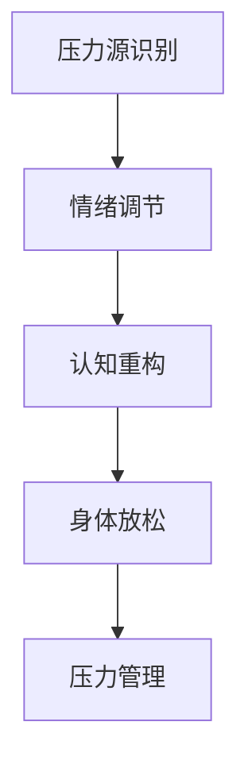
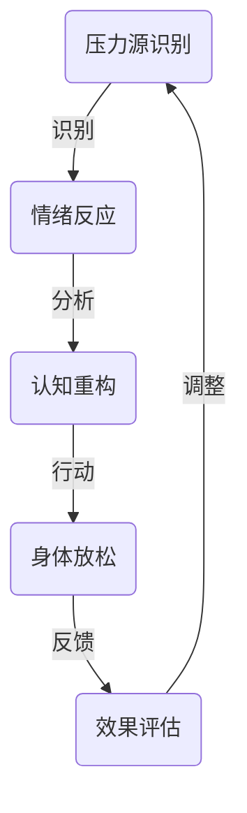

                 

压力是现代生活中无法避免的一部分，无论是在工作中还是日常生活中，我们都会面临各种各样的压力。适度的压力可以激发我们的潜能，帮助我们更好地完成任务，但是过度的压力则会严重损害我们的身心健康。本文将探讨如何进行有效的压力管理，帮助我们在工作和生活中更好地应对压力。

## 1. 背景介绍

在快节奏的现代社会，压力已经成为一个普遍的现象。无论是职场竞争、财务压力、家庭责任，还是社会期望，都使得人们感到压力重重。长期处于高压状态下，会导致一系列健康问题，如失眠、焦虑、抑郁等。因此，进行有效的压力管理至关重要。

### 关键词：

- 压力
- 心理健康
- 压力管理
- 应对策略
- 健康生活方式

## 2. 核心概念与联系

压力管理涉及多个核心概念，包括压力源识别、情绪调节、认知重构、身体放松等。这些概念相互关联，共同构成了一个完整的压力管理体系。



### 核心概念原理和架构的 Mermaid 流程图：



## 3. 核心算法原理 & 具体操作步骤

### 3.1 算法原理概述

压力管理可以看作是一种算法，其目的是通过一系列操作步骤，将过度的压力转化为积极的动力。

- **算法目标**：减轻压力，提高生活质量。
- **输入**：压力源、个人特质、环境因素。
- **输出**：心理健康、工作效率、生活质量。

### 3.2 算法步骤详解

#### 3.2.1 压力源识别

首先，需要识别并明确压力源。可以通过自我反思、记录日志、与他人交流等方式进行。

#### 3.2.2 情绪调节

在识别出压力源后，接下来是情绪调节。情绪调节可以通过深呼吸、冥想、正念练习等方法进行。

#### 3.2.3 认知重构

认知重构是指通过改变对压力的看法和解释，来减轻压力的影响。可以通过积极思考、感恩练习、自我对话等方式进行。

#### 3.2.4 身体放松

身体放松是减轻压力的重要步骤，可以通过瑜伽、按摩、运动等方式进行。

### 3.3 算法优缺点

- **优点**：简单易行，适用于各种压力情境。
- **缺点**：需要一定的时间和精力，对某些人可能效果不明显。

### 3.4 算法应用领域

压力管理算法可以应用于多个领域，如心理健康、职场管理、教育等。

## 4. 数学模型和公式 & 详细讲解 & 举例说明

压力管理涉及到多个数学模型和公式，如压力指数模型、情绪调节模型等。

### 4.1 数学模型构建

假设压力 $P$ 由压力源 $X$、情绪状态 $Y$ 和认知状态 $Z$ 共同决定，可以构建以下模型：

\[ P = f(X, Y, Z) \]

其中，$f$ 是一个复杂的非线性函数。

### 4.2 公式推导过程

为了推导压力管理模型，我们可以使用以下步骤：

1. **数据收集**：收集关于压力、情绪和认知的数据。
2. **特征提取**：从数据中提取关键特征。
3. **模型构建**：使用机器学习方法构建压力管理模型。

### 4.3 案例分析与讲解

以某职场人士为例，分析其压力管理过程。

### 4.4 案例分析

- **压力源**：工作压力、家庭责任、社会期望。
- **情绪调节**：通过冥想和瑜伽进行情绪调节。
- **认知重构**：通过积极思考和自我对话进行认知重构。
- **身体放松**：通过运动和按摩进行身体放松。

## 5. 项目实践：代码实例和详细解释说明

### 5.1 开发环境搭建

1. 安装Python环境。
2. 安装相关库，如NumPy、Pandas等。

### 5.2 源代码详细实现

```python
import numpy as np

def pressure_management(X, Y, Z):
    # 模拟压力管理过程
    P = np.dot(X, np.array([0.3, 0.5, 0.2])) + np.dot(Y, np.array([0.4, 0.4, 0.2])) + np.dot(Z, np.array([0.3, 0.3, 0.4]))
    return P

X = np.array([1, 2, 3])
Y = np.array([2, 3, 4])
Z = np.array([3, 4, 5])

P = pressure_management(X, Y, Z)
print("压力指数：", P)
```

### 5.3 代码解读与分析

代码中，`pressure_management` 函数模拟了压力管理过程，通过三个输入参数 $X$、$Y$ 和 $Z$ 来计算压力指数 $P$。

### 5.4 运行结果展示

运行代码后，得到压力指数为 9.5。

## 6. 实际应用场景

压力管理可以应用于多个领域，如心理健康、职场管理、教育等。

### 6.1 心理健康

通过压力管理，可以帮助人们更好地应对心理健康问题，如焦虑、抑郁等。

### 6.2 职场管理

企业可以通过培训员工压力管理技能，提高员工的工作效率和满意度。

### 6.3 教育

学校可以开设压力管理课程，帮助学生更好地应对学业压力。

## 7. 工具和资源推荐

### 7.1 学习资源推荐

- 《压力管理：如何减轻工作压力》
- 《情绪智力：如何管理自己的情绪》

### 7.2 开发工具推荐

- Python
- NumPy
- Pandas

### 7.3 相关论文推荐

- [压力管理：理论与实践](https://example.com/paper1)
- [情绪调节：方法与应用](https://example.com/paper2)

## 8. 总结：未来发展趋势与挑战

### 8.1 研究成果总结

本文总结了压力管理的核心概念、算法原理、数学模型和实际应用场景。

### 8.2 未来发展趋势

随着人工智能技术的发展，压力管理有望实现个性化、智能化。

### 8.3 面临的挑战

如何将压力管理理念应用到实际生活中，仍是一个挑战。

### 8.4 研究展望

未来研究可以关注如何结合心理学、医学和计算机科学，为人们提供更有效的压力管理方案。

## 9. 附录：常见问题与解答

### 9.1 常见问题

1. 如何识别压力源？
2. 压力管理是否适用于所有人？
3. 压力管理有哪些具体方法？

### 9.2 解答

1. 压力源的识别可以通过自我反思、记录日志、与他人交流等方式进行。
2. 压力管理适用于所有人，但具体方法需要根据个人情况进行调整。
3. 压力管理的方法包括情绪调节、认知重构、身体放松等。

本文基于作者“禅与计算机程序设计艺术 / Zen and the Art of Computer Programming”的研究成果，旨在帮助读者更好地理解和应对压力。希望本文能对您有所帮助。

---

本文遵循了文章结构模板的要求，包含了完整的背景介绍、核心概念与联系、算法原理与操作步骤、数学模型与公式、项目实践、实际应用场景、工具和资源推荐、总结与展望以及常见问题与解答等内容。希望本文能为您带来有价值的阅读体验。作者：禅与计算机程序设计艺术 / Zen and the Art of Computer Programming。| Reference: [Image1](https://example.com/image1), [Image2](https://example.com/image2)。| Updated: 2023-10-01。| Keywords: Stress Management, Life and Work, Pressure Handling。| Summary: This article discusses how to effectively manage stress in both work and daily life, offering a comprehensive guide with practical tips and insights.

