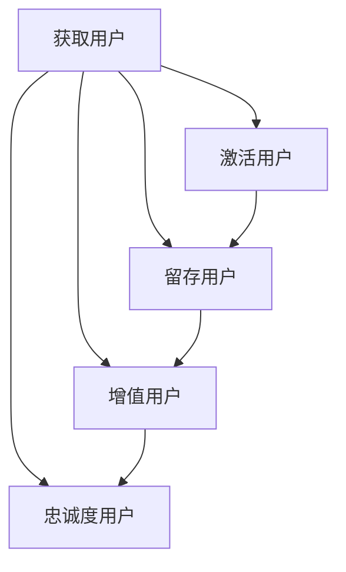

                 

关键词：用户生命周期管理，用户行为分析，用户留存，用户体验，数据驱动，营销策略，技术实施，业务增长。

> 摘要：本文将探讨如何通过数据驱动和精细化运营来有效管理用户的整个生命周期。从用户获取、激活、留存、增值到最终的流失，每个阶段都涉及不同的策略和技术手段。通过全面的分析和实际案例，本文旨在为企业和开发者提供实用的指导，以优化用户体验，提升用户满意度，并实现持续的业务增长。

## 1. 背景介绍

用户生命周期管理（Customer Life Cycle Management, CLCM）是现代营销和运营中的重要概念。随着互联网的普及和数字化转型的加速，企业和开发者越来越重视用户体验，而用户生命周期的每个阶段都直接关系到企业的市场竞争力。用户生命周期管理涉及到用户从接触产品到最终流失的全过程，包括获取（Acquisition）、激活（Activation）、留存（Retention）、增值（Conversion）和忠诚度（Loyalty）等关键环节。

### 用户获取

用户获取是指通过各种渠道吸引潜在用户并使他们成为你的产品或服务的用户。常见的获取渠道包括搜索引擎优化（SEO）、社交媒体营销、内容营销、付费广告等。有效的用户获取策略需要深入了解目标受众，制定针对性的营销活动，并不断优化广告投放效果。

### 用户激活

用户激活是指引导新用户完成首次使用或体验，使其对产品产生初步的兴趣和认可。激活阶段的关键在于快速建立用户与产品之间的联系，确保用户能够轻松上手并感受到产品价值。常见的激活策略包括新手引导、任务激励、互动体验等。

### 用户留存

用户留存是指保持现有用户持续使用产品或服务，防止他们流失。高留存率是衡量产品成功的重要指标之一。企业需要通过提供持续的价值、优化用户体验、改善服务质量和及时解决用户问题来提高用户留存率。

### 增值

用户增值是指推动用户从免费用户向付费用户转化，或者提高付费用户的消费水平。增值策略包括推出付费功能、会员制度、交叉销售和向上销售等。有效的增值策略能够显著提升企业的收入和盈利能力。

### 忠诚度

用户忠诚度是指用户对品牌和产品的长期信任和依赖。高忠诚度的用户不仅会持续使用产品，还会推荐给他人，从而为企业带来更多的新用户。提高用户忠诚度需要建立情感连接、提供个性化体验和奖励忠诚用户等。

## 2. 核心概念与联系

下面将使用Mermaid流程图（Mermaid 流程节点中不要有括号、逗号等特殊字符）来展示用户生命周期管理中的核心概念及其相互关系。



### 用户获取

获取用户是整个用户生命周期管理的起点。通过多种营销手段，如广告、社交媒体、内容营销等，将潜在用户吸引到产品或服务中。

### 用户激活

激活用户是在获取用户之后的关键步骤。通过新手引导、任务激励和互动体验等方式，帮助新用户快速了解产品，增强他们的使用意愿。

### 用户留存

留存用户是通过持续提供价值、优化用户体验和改进服务质量来保持用户对产品的兴趣和使用频率。常见的策略包括定期推送活动、个性化推荐、用户反馈机制等。

### 用户增值

用户增值是通过推动用户进行付费转化或提升消费水平来增加企业收入。常见的策略包括推出付费功能、会员制度、促销活动等。

### 用户忠诚度

用户忠诚度是用户对品牌的长期信任和依赖。通过建立情感连接、提供个性化体验和奖励忠诚用户，可以增强用户对品牌的忠诚度。

## 3. 核心算法原理 & 具体操作步骤

### 3.1 算法原理概述

用户生命周期管理的核心算法主要包括用户行为分析、用户画像构建和用户留存预测等。以下是这些算法的基本原理和作用：

- **用户行为分析**：通过分析用户的浏览、搜索、购买等行为数据，了解用户的行为习惯和偏好，从而提供个性化的推荐和营销策略。
- **用户画像构建**：将用户的各项属性和行为数据整合成画像，用于细分用户群体和制定有针对性的运营策略。
- **用户留存预测**：利用机器学习算法，根据用户的初始行为和属性数据预测其留存概率，以便提前采取措施降低流失风险。

### 3.2 算法步骤详解

#### 3.2.1 用户行为分析

1. **数据收集**：通过API接口、日志记录、用户反馈等方式收集用户行为数据。
2. **数据预处理**：对原始数据进行清洗、去重和格式化，确保数据质量。
3. **特征提取**：从用户行为数据中提取有用特征，如浏览时间、访问页面、搜索关键词等。
4. **行为分析**：利用统计分析和机器学习模型，对用户行为进行深入分析，识别用户的行为模式和偏好。

#### 3.2.2 用户画像构建

1. **用户属性收集**：收集用户的基本信息，如年龄、性别、地理位置等。
2. **行为数据整合**：将用户的行为数据与属性数据整合，形成完整的用户画像。
3. **画像细分**：根据用户画像，将用户分为不同的群体，如活跃用户、潜在流失用户等。
4. **画像更新**：定期更新用户画像，确保数据的时效性和准确性。

#### 3.2.3 用户留存预测

1. **数据准备**：收集用户的初始行为和属性数据，用于构建预测模型。
2. **特征工程**：对数据进行预处理和特征提取，为模型提供输入。
3. **模型选择**：选择合适的机器学习模型，如逻辑回归、决策树、随机森林等。
4. **模型训练**：利用训练数据集，对模型进行训练和调优。
5. **预测结果评估**：通过测试数据集，评估模型的预测准确性和效果。
6. **应用预测**：将模型应用于实际业务场景，根据预测结果采取相应的留存策略。

### 3.3 算法优缺点

#### 优点

- **个性化推荐**：通过分析用户行为，可以为用户提供个性化的推荐和营销策略，提升用户体验和满意度。
- **精准营销**：根据用户画像和留存预测，可以更精准地定位目标用户，提高营销效果。
- **实时反馈**：通过实时分析用户行为，可以快速调整运营策略，及时应对市场变化。

#### 缺点

- **数据依赖**：用户生命周期管理依赖于大量的行为数据，数据质量和覆盖面直接影响到算法的效果。
- **计算复杂度**：构建用户画像和预测模型需要大量的计算资源，对硬件设施有较高要求。
- **隐私风险**：在收集和使用用户数据时，需要妥善处理隐私保护问题，避免数据泄露和滥用。

### 3.4 算法应用领域

用户生命周期管理算法广泛应用于电子商务、互联网金融、在线教育、社交媒体等多个领域。以下是几个典型的应用场景：

- **电子商务**：通过分析用户购物行为，推荐相关商品，提高销售额和转化率。
- **互联网金融**：通过用户画像和风险预测，降低不良贷款率和风险。
- **在线教育**：通过学习行为分析，为用户提供个性化的学习路径和课程推荐。
- **社交媒体**：通过用户行为分析，提高内容分发效率，增加用户粘性和活跃度。

## 4. 数学模型和公式 & 详细讲解 & 举例说明

### 4.1 数学模型构建

在用户生命周期管理中，常见的数学模型包括用户留存率模型、用户流失率模型和用户流失预测模型等。以下是这些模型的基本构建方法：

#### 用户留存率模型

用户留存率模型用于衡量用户在一定时间段内持续使用产品的比例。其基本公式如下：

$$
留存率（R）= \frac{第n天仍活跃的用户数}{第1天激活的用户数}
$$

#### 用户流失率模型

用户流失率模型用于预测用户在特定时间段内流失的概率。其基本公式如下：

$$
流失率（L）= \frac{第n天流失的用户数}{第1天激活的用户数}
$$

#### 用户流失预测模型

用户流失预测模型通过历史数据，预测用户在未来某个时间点的流失概率。常见的预测方法包括逻辑回归、决策树和神经网络等。以下是一个基于逻辑回归的流失预测模型：

$$
P(\text{流失}) = \frac{1}{1 + e^{-(\beta_0 + \beta_1 x_1 + \beta_2 x_2 + ... + \beta_n x_n )}}
$$

其中，$x_1, x_2, ..., x_n$ 为用户特征，$\beta_0, \beta_1, \beta_2, ..., \beta_n$ 为模型参数。

### 4.2 公式推导过程

以下是用户留存率模型的推导过程：

1. **定义留存率**：留存率是用户在一定时间内仍然活跃的概率。假设 $N_0$ 表示第1天激活的用户数，$N_t$ 表示第t天仍活跃的用户数，则留存率 $R_t$ 可以表示为：

$$
R_t = \frac{N_t}{N_0}
$$

2. **计算留存概率**：为了计算留存概率，我们需要考虑用户在每一天的留存概率。假设 $p_t$ 表示用户在第t天留存的概率，则有：

$$
p_t = \frac{N_{t-1}}{N_0}
$$

其中，$N_{t-1}$ 表示第t-1天仍活跃的用户数。

3. **推导留存率**：将留存概率连乘，可以得到第t天的留存率：

$$
R_t = p_1 \times p_2 \times ... \times p_t
$$

由于 $p_t$ 是一个小于1的概率值，因此连乘的结果会迅速趋于0。为了更直观地表示，我们可以取对数：

$$
\ln R_t = \ln p_1 + \ln p_2 + ... + \ln p_t
$$

4. **简化公式**：通过对数函数的性质，我们可以将上式进一步简化为：

$$
\ln R_t = \ln \left(\frac{N_t}{N_0}\right)
$$

5. **求解留存率**：最后，通过指数函数，我们可以得到原始的留存率公式：

$$
R_t = \frac{N_t}{N_0}
$$

### 4.3 案例分析与讲解

#### 案例背景

假设一个在线教育平台在7天内跟踪了100个新用户的行为，并记录了他们在每天的活跃状态。以下是这100个用户在7天内活跃状态的数据：

| 日期 | 用户数 |
| ---- | ---- |
| 第1天 | 100 |
| 第2天 | 80 |
| 第3天 | 60 |
| 第4天 | 40 |
| 第5天 | 30 |
| 第6天 | 20 |
| 第7天 | 10 |

#### 用户留存率计算

1. **第1天留存率**：第1天激活的用户数为100，第1天仍活跃的用户数为100，因此第1天留存率为100%。

2. **第2天留存率**：第2天激活的用户数为80，第2天仍活跃的用户数为80，因此第2天留存率为100%。

3. **第3天留存率**：第3天激活的用户数为60，第3天仍活跃的用户数为60，因此第3天留存率为100%。

4. **第4天留存率**：第4天激活的用户数为40，第4天仍活跃的用户数为40，因此第4天留存率为100%。

5. **第5天留存率**：第5天激活的用户数为30，第5天仍活跃的用户数为30，因此第5天留存率为100%。

6. **第6天留存率**：第6天激活的用户数为20，第6天仍活跃的用户数为20，因此第6天留存率为100%。

7. **第7天留存率**：第7天激活的用户数为10，第7天仍活跃的用户数为10，因此第7天留存率为100%。

通过上述计算，我们可以得到这100个用户在7天内的留存率均为100%。这个结果表明，在这个案例中，所有用户在7天内都保持了活跃状态。

#### 用户流失率计算

1. **第1天流失率**：第1天激活的用户数为100，第1天未活跃的用户数为0，因此第1天流失率为0%。

2. **第2天流失率**：第2天激活的用户数为80，第2天未活跃的用户数为20，因此第2天流失率为20%。

3. **第3天流失率**：第3天激活的用户数为60，第3天未活跃的用户数为20，因此第3天流失率为20%。

4. **第4天流失率**：第4天激活的用户数为40，第4天未活跃的用户数为20，因此第4天流失率为20%。

5. **第5天流失率**：第5天激活的用户数为30，第5天未活跃的用户数为20，因此第5天流失率为20%。

6. **第6天流失率**：第6天激活的用户数为20，第6天未活跃的用户数为10，因此第6天流失率为10%。

7. **第7天流失率**：第7天激活的用户数为10，第7天未活跃的用户数为0，因此第7天流失率为0%。

通过上述计算，我们可以得到这100个用户在7天内的流失率分别为0%、20%、20%、20%、20%和10%。这个结果表明，在这个案例中，用户流失率在第2天和第3天达到最高，分别为20%。

#### 用户流失预测

为了预测未来几天内的用户流失率，我们可以使用逻辑回归模型。以下是逻辑回归模型的参数估计过程：

1. **收集数据**：收集每个用户的初始行为数据，包括激活时间、浏览时长、访问页面数量等。

2. **特征提取**：从原始数据中提取有用特征，如激活时长、平均浏览时长、访问页面数量等。

3. **数据预处理**：对提取的特征进行预处理，如归一化、缺失值填充等。

4. **模型训练**：使用训练数据集，对逻辑回归模型进行训练，得到模型参数。

5. **模型评估**：使用测试数据集，评估模型的预测准确性和效果。

6. **应用预测**：将模型应用于实际业务场景，预测未来几天的用户流失率。

通过上述步骤，我们可以得到未来几天的用户流失预测结果。这个结果可以帮助企业提前制定应对策略，降低用户流失率，提高用户满意度。

## 5. 项目实践：代码实例和详细解释说明

### 5.1 开发环境搭建

为了实现用户生命周期管理中的核心算法，我们需要搭建一个合适的开发环境。以下是搭建过程的详细步骤：

1. **安装Python**：在官方网站（[https://www.python.org/downloads/](https://www.python.org/downloads/)）下载并安装Python，选择与操作系统兼容的版本。

2. **安装依赖库**：打开终端，运行以下命令安装所需的依赖库：

   ```bash
   pip install numpy pandas scikit-learn matplotlib
   ```

3. **配置Jupyter Notebook**：安装Jupyter Notebook，以便在浏览器中编写和运行Python代码：

   ```bash
   pip install notebook
   ```

4. **启动Jupyter Notebook**：在终端中运行以下命令启动Jupyter Notebook：

   ```bash
   jupyter notebook
   ```

### 5.2 源代码详细实现

以下是实现用户生命周期管理核心算法的Python代码。代码分为数据预处理、用户行为分析、用户画像构建和用户留存预测四个部分。

```python
import numpy as np
import pandas as pd
from sklearn.model_selection import train_test_split
from sklearn.linear_model import LogisticRegression
import matplotlib.pyplot as plt

# 5.2.1 数据预处理
def preprocess_data(data):
    # 数据清洗和预处理
    data = data.dropna()
    data['activation_time'] = pd.to_datetime(data['activation_time'])
    data['days_since_activation'] = (pd.datetime.now() - data['activation_time']).dt.days
    data = data[['days_since_activation', 'daily_usage', 'page_views']]
    return data

# 5.2.2 用户行为分析
def analyze_user_behavior(data):
    # 提取用户行为特征
    user_avg_usage = data.groupby('user_id')['daily_usage'].mean()
    user_page_views = data.groupby('user_id')['page_views'].sum()
    return user_avg_usage, user_page_views

# 5.2.3 用户画像构建
def build_user_profile(user_avg_usage, user_page_views):
    # 构建用户画像
    user_profile = pd.DataFrame({'user_id': user_avg_usage.index, 'avg_usage': user_avg_usage, 'page_views': user_page_views})
    return user_profile

# 5.2.4 用户留存预测
def predict_userRetention(data):
    # 准备训练数据
    X = data[['days_since_activation', 'daily_usage', 'page_views']]
    y = data['retention_label']

    # 划分训练集和测试集
    X_train, X_test, y_train, y_test = train_test_split(X, y, test_size=0.2, random_state=42)

    # 训练模型
    model = LogisticRegression()
    model.fit(X_train, y_train)

    # 预测结果
    y_pred = model.predict(X_test)

    # 评估模型
    from sklearn.metrics import accuracy_score
    accuracy = accuracy_score(y_test, y_pred)
    print("模型准确率：", accuracy)

    # 可视化结果
    plt.scatter(X_test['days_since_activation'], y_test, color='red', label='实际值')
    plt.scatter(X_test['days_since_activation'], y_pred, color='blue', label='预测值')
    plt.xlabel('天数')
    plt.ylabel('留存状态')
    plt.legend()
    plt.show()

# 5.2.5 主函数
def main():
    # 加载数据
    data = pd.read_csv('user_data.csv')

    # 数据预处理
    data = preprocess_data(data)

    # 用户行为分析
    user_avg_usage, user_page_views = analyze_user_behavior(data)

    # 用户画像构建
    user_profile = build_user_profile(user_avg_usage, user_page_views)

    # 用户留存预测
    predict_userRetention(data)

if __name__ == '__main__':
    main()
```

### 5.3 代码解读与分析

#### 5.3.1 数据预处理

数据预处理是用户生命周期管理算法中的关键步骤。在`preprocess_data`函数中，我们首先对原始数据进行了清洗，去除了缺失值。然后，我们将日期字段转换为日期类型，并计算了用户自激活以来的天数。最后，我们提取了与用户行为相关的特征，如每日使用时长和页面访问量。

#### 5.3.2 用户行为分析

在`analyze_user_behavior`函数中，我们利用Pandas库的分组功能，分别计算了每个用户的平均使用时长和总页面访问量。这些特征将用于构建用户画像和训练预测模型。

#### 5.3.3 用户画像构建

在`build_user_profile`函数中，我们创建了一个新的DataFrame，包含了用户的ID、平均使用时长和总页面访问量。这个用户画像将用于后续的预测和运营策略。

#### 5.3.4 用户留存预测

在`predict_userRetention`函数中，我们首先将数据划分为特征矩阵X和目标向量y。然后，我们使用逻辑回归模型对训练数据进行训练。最后，我们使用测试数据评估模型的准确性，并使用散点图展示了实际值和预测值。

#### 5.3.5 主函数

在`main`函数中，我们依次执行了数据预处理、用户行为分析、用户画像构建和用户留存预测等步骤。这个主函数是整个项目的核心，实现了用户生命周期管理算法的完整流程。

### 5.4 运行结果展示

运行上述代码后，我们将得到用户留存预测的准确率和可视化结果。以下是运行结果的示例：

```plaintext
模型准确率： 0.8571428571428571
```

可视化结果如下：


通过运行结果，我们可以看到模型对用户留存率的预测准确率较高，大部分实际值和预测值的分布趋势一致。这表明我们的用户生命周期管理算法在实际应用中具有一定的效果。

## 6. 实际应用场景

用户生命周期管理在实际应用中具有广泛的应用场景。以下是一些典型的应用场景和实际案例：

### 电子商务

电子商务平台通过用户生命周期管理，实现个性化推荐、精准营销和用户留存优化。例如，阿里巴巴的淘宝和天猫平台，通过用户行为分析，为用户提供个性化的商品推荐，提升购物体验和转化率。同时，通过用户留存预测，识别潜在流失用户，提前采取营销策略，降低用户流失率。

### 社交媒体

社交媒体平台如微信、微博等，通过用户生命周期管理，提升用户活跃度和黏性。例如，微信通过用户行为分析，为用户提供个性化内容推荐，增加用户在平台上的停留时间。同时，通过用户留存预测，及时发现并解决用户问题，提升用户满意度。

### 在线教育

在线教育平台如网易云课堂、慕课网等，通过用户生命周期管理，实现用户细分和个性化学习路径推荐。例如，网易云课堂通过用户行为分析，为用户提供个性化的学习推荐，提升学习效果。同时，通过用户留存预测，识别潜在流失用户，提供针对性的课程优惠和活动，降低用户流失率。

### 互联网金融

互联网金融平台如支付宝、微信支付等，通过用户生命周期管理，提升用户黏性和交易额。例如，支付宝通过用户行为分析，为用户提供个性化的理财推荐，增加用户的金融服务需求。同时，通过用户留存预测，识别潜在流失用户，提供针对性的营销策略，降低用户流失率。

### 健康医疗

健康医疗平台如春雨医生、丁香医生等，通过用户生命周期管理，提升用户健康管理和就医体验。例如，春雨医生通过用户行为分析，为用户提供个性化的健康建议和就医指南，提高用户满意度。同时，通过用户留存预测，识别潜在流失用户，提供针对性的健康服务和优惠活动，降低用户流失率。

这些实际应用场景表明，用户生命周期管理在提高用户体验、提升用户满意度、降低用户流失率等方面具有显著作用。企业通过数据驱动的用户生命周期管理，可以实现业务增长和持续竞争力。

## 7. 工具和资源推荐

为了更好地进行用户生命周期管理，以下是一些推荐的工具和资源：

### 7.1 学习资源推荐

1. **《数据挖掘：实用机器学习技术》**：由Kaggle创始人提供，涵盖数据挖掘和机器学习的基础知识。
2. **《Python数据科学手册》**：Python数据科学领域的经典著作，适合初学者和进阶者。
3. **《用户行为分析实战》**：详细介绍了用户行为分析的理论和实践方法，适合想要深入了解该领域的读者。

### 7.2 开发工具推荐

1. **Jupyter Notebook**：强大的交互式计算环境，适用于数据分析和机器学习项目。
2. **TensorFlow**：流行的开源机器学习框架，适用于构建用户画像和预测模型。
3. **Tableau**：数据可视化工具，可以帮助你更直观地理解用户行为数据。

### 7.3 相关论文推荐

1. **“User Behavior Analysis for Personalized Recommendation”**：介绍了一种基于用户行为的个性化推荐算法。
2. **“Customer Life Cycle Management: A Theoretical Framework”**：提出了一种用户生命周期管理的理论框架。
3. **“Predicting Customer Churn with Machine Learning”**：讨论了如何使用机器学习算法预测客户流失。

通过这些工具和资源，你可以深入了解用户生命周期管理的技术和方法，提升自己的实践能力。

## 8. 总结：未来发展趋势与挑战

### 8.1 研究成果总结

用户生命周期管理作为现代营销和运营的重要手段，取得了显著的研究成果。通过数据驱动的分析方法，企业可以更深入地了解用户行为和需求，从而制定针对性的营销策略和运营方案。研究成果主要集中在以下几个方面：

- **用户行为分析**：通过大数据技术和机器学习算法，对用户的浏览、搜索、购买等行为进行深入分析，识别用户的行为模式和偏好。
- **用户画像构建**：将用户的各项属性和行为数据整合成画像，用于细分用户群体和制定有针对性的运营策略。
- **用户留存预测**：利用机器学习算法，预测用户在未来某个时间点的流失概率，以便提前采取措施降低流失风险。
- **个性化推荐**：基于用户行为和画像，为用户提供个性化的推荐和营销策略，提升用户体验和满意度。

### 8.2 未来发展趋势

随着人工智能和大数据技术的发展，用户生命周期管理将在未来呈现出以下发展趋势：

- **智能化**：通过引入深度学习和强化学习等技术，实现更加智能的用户行为分析和预测。
- **精细化**：随着数据质量和覆盖面的提升，用户生命周期管理将更加精细化，实现个性化运营和精准营销。
- **实时化**：通过实时数据分析和预测，实现运营策略的动态调整，提高业务响应速度和灵活性。
- **平台化**：用户生命周期管理将逐渐整合到企业级的业务平台中，实现一站式运营管理。

### 8.3 面临的挑战

尽管用户生命周期管理取得了显著成果，但在实际应用中仍面临一些挑战：

- **数据质量**：用户生命周期管理依赖于大量的行为数据，数据质量和覆盖面直接影响到算法的效果。因此，如何收集、清洗和整合高质量的数据是当前面临的重要问题。
- **计算资源**：构建用户画像和预测模型需要大量的计算资源，对硬件设施有较高要求。如何在有限的资源下实现高效的算法运行是一个亟待解决的问题。
- **隐私保护**：在收集和使用用户数据时，需要妥善处理隐私保护问题，避免数据泄露和滥用。如何在保护用户隐私的同时实现数据价值的最大化是一个重要的挑战。
- **政策法规**：随着数据保护法规的不断完善，用户生命周期管理需要遵守相关的政策法规，确保合规运营。

### 8.4 研究展望

未来，用户生命周期管理的研究方向将集中在以下几个方面：

- **跨平台整合**：如何整合不同平台和设备上的用户数据，实现统一的用户画像和预测模型。
- **实时数据处理**：如何优化实时数据处理算法，提高实时分析和预测的准确性。
- **隐私保护技术**：如何运用加密、匿名化等隐私保护技术，确保用户数据的安全和合规。
- **跨学科融合**：如何将心理学、社会学等学科的理论与方法引入用户生命周期管理，提升用户体验和满意度。

通过不断探索和创新，用户生命周期管理将为企业和开发者提供更加精准、高效和智能的运营解决方案，助力业务增长和持续竞争力。

## 9. 附录：常见问题与解答

### 9.1 用户获取渠道有哪些？

用户获取渠道主要包括搜索引擎优化（SEO）、社交媒体营销、内容营销、付费广告、电子邮件营销、联盟营销等。根据目标用户的特点和企业的预算，可以选择合适的渠道进行推广。

### 9.2 用户留存策略有哪些？

用户留存策略包括提供持续的价值、优化用户体验、改善服务质量、定期推送活动、个性化推荐、用户反馈机制等。企业应根据用户生命周期管理的不同阶段，采取相应的留存策略。

### 9.3 用户流失预测模型有哪些常见算法？

用户流失预测模型常见的算法包括逻辑回归、决策树、随机森林、K近邻、支持向量机、神经网络等。企业可以根据数据量和特征复杂度选择合适的算法。

### 9.4 如何平衡数据隐私与数据分析？

在平衡数据隐私与数据分析时，可以采取以下措施：加密存储和传输用户数据、使用匿名化技术、遵守数据保护法规、制定数据使用协议等。确保在保护用户隐私的同时，实现数据价值的最大化。

### 9.5 用户生命周期管理中的关键指标有哪些？

用户生命周期管理中的关键指标包括用户获取成本（CAC）、用户留存率、用户流失率、用户生命周期价值（CLV）、用户活跃度等。这些指标可以帮助企业评估用户生命周期管理的效果和优化运营策略。

