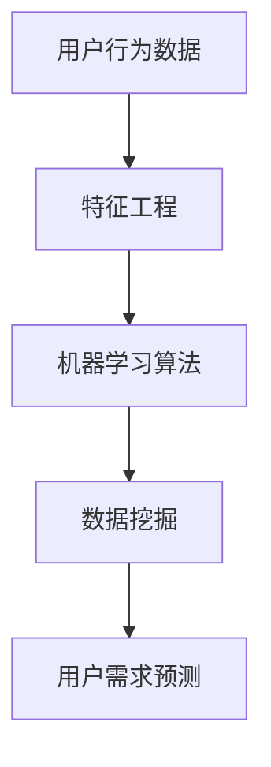

                 

用户需求预测是一个重要的研究领域，它涉及到从大量数据中提取有价值的信息，以帮助组织和企业更好地理解客户需求，进而提供更个性化的服务和产品。本文将深入探讨如何进行有效的用户需求预测，包括背景介绍、核心概念与联系、核心算法原理、数学模型和公式、项目实践、实际应用场景、未来应用展望、工具和资源推荐，以及总结与展望。

## 1. 背景介绍

随着互联网和大数据技术的发展，企业和组织面临着海量的用户数据。如何从这些数据中提取有价值的信息，预测用户的未来行为和需求，成为了一个热门的研究课题。有效的用户需求预测不仅能够帮助企业制定更好的营销策略，还能优化产品设计和提高客户满意度。

用户需求预测通常涉及以下几个方面：

- **用户行为分析**：通过分析用户的浏览、购买、评论等行为数据，了解用户的偏好和需求。
- **市场趋势分析**：研究市场动态，了解哪些产品或服务可能更受欢迎。
- **用户反馈分析**：通过调查、用户评论等渠道收集用户反馈，以预测未来需求。

## 2. 核心概念与联系

为了进行有效的用户需求预测，我们需要了解以下几个核心概念：

- **用户行为**：用户的在线行为，如点击、搜索、购买等。
- **特征工程**：从原始数据中提取有用的特征，以构建预测模型。
- **机器学习算法**：用于训练模型，预测用户需求。
- **数据挖掘**：从大量数据中发现有价值的信息。

以下是一个Mermaid流程图，展示了这些概念之间的联系：



### 2.1 用户行为数据

用户行为数据是用户在互联网上的各种活动记录，包括浏览历史、搜索关键词、购买记录、评论等。这些数据是进行用户需求预测的基础。

### 2.2 特征工程

特征工程是将原始数据转化为适用于机器学习算法的输入特征的过程。这个过程包括数据清洗、特征提取、特征选择等。

### 2.3 机器学习算法

机器学习算法是用于训练模型、预测用户需求的工具。常见的算法包括决策树、支持向量机、神经网络等。

### 2.4 数据挖掘

数据挖掘是从大量数据中发现有价值信息的过程。它可以帮助我们识别用户行为的模式和趋势，为预测用户提供支持。

## 3. 核心算法原理 & 具体操作步骤

在进行用户需求预测时，常用的算法包括以下几种：

- **决策树**
- **支持向量机**
- **神经网络**

### 3.1 算法原理概述

- **决策树**：通过一系列条件判断，将数据划分为不同的类别或数值。
- **支持向量机**：寻找一个最优的超平面，将不同类别的数据分隔开来。
- **神经网络**：模拟人脑神经元的工作方式，通过多层神经元的连接，实现复杂的函数映射。

### 3.2 算法步骤详解

- **决策树**：包括特征选择、划分数据、建立树模型、剪枝等步骤。
- **支持向量机**：包括数据预处理、选择核函数、求解最优化问题等步骤。
- **神经网络**：包括网络结构设计、权重初始化、前向传播、反向传播、优化算法等步骤。

### 3.3 算法优缺点

- **决策树**：简单易懂，易于实现，但容易过拟合。
- **支持向量机**：在处理高维数据时表现优秀，但计算复杂度较高。
- **神经网络**：可以处理复杂的非线性关系，但训练过程需要大量时间和计算资源。

### 3.4 算法应用领域

- **决策树**：广泛应用于分类和回归问题。
- **支持向量机**：在文本分类、图像识别等领域有广泛应用。
- **神经网络**：在语音识别、图像识别、自然语言处理等领域有广泛应用。

## 4. 数学模型和公式 & 详细讲解 & 举例说明

在进行用户需求预测时，数学模型和公式是非常关键的。以下是一些常见的数学模型和公式：

### 4.1 数学模型构建

- **线性回归模型**：
    $$y = \beta_0 + \beta_1 \cdot x_1 + \beta_2 \cdot x_2 + ... + \beta_n \cdot x_n$$
- **逻辑回归模型**：
    $$P(y=1) = \frac{1}{1 + e^{-(\beta_0 + \beta_1 \cdot x_1 + \beta_2 \cdot x_2 + ... + \beta_n \cdot x_n)}}$$

### 4.2 公式推导过程

以线性回归模型为例，假设我们有一个数据集 $D = \{(x_1, y_1), (x_2, y_2), ..., (x_n, y_n)\}$，其中 $x_i$ 和 $y_i$ 分别表示输入和输出。

- **最小二乘法**：
    $$\min \sum_{i=1}^{n} (y_i - (\beta_0 + \beta_1 \cdot x_1 + \beta_2 \cdot x_2 + ... + \beta_n \cdot x_n))^2$$
- **梯度下降法**：
    $$\beta_0 := \beta_0 - \alpha \cdot \frac{\partial}{\partial \beta_0} \sum_{i=1}^{n} (y_i - (\beta_0 + \beta_1 \cdot x_1 + \beta_2 \cdot x_2 + ... + \beta_n \cdot x_n))^2$$
    $$\beta_1 := \beta_1 - \alpha \cdot \frac{\partial}{\partial \beta_1} \sum_{i=1}^{n} (y_i - (\beta_0 + \beta_1 \cdot x_1 + \beta_2 \cdot x_2 + ... + \beta_n \cdot x_n))^2$$
    $$...$$

### 4.3 案例分析与讲解

假设我们有一个在线购物平台，想预测用户是否会购买某个商品。我们收集了以下数据：

- 用户年龄
- 用户性别
- 用户收入
- 用户浏览历史
- 商品价格
- 商品类别

我们可以使用线性回归模型来预测用户是否会购买商品。首先，我们需要对数据进行特征工程，提取有用的特征，如：

- 年龄
- 性别
- 收入
- 浏览历史（如浏览次数、浏览时间等）
- 商品价格
- 商品类别

然后，我们可以使用最小二乘法或梯度下降法来训练模型，得到线性回归方程。最后，我们可以使用这个方程来预测新用户是否会购买某个商品。

## 5. 项目实践：代码实例和详细解释说明

在本节中，我们将通过一个简单的项目实例，展示如何使用Python和Scikit-learn库进行用户需求预测。

### 5.1 开发环境搭建

首先，确保您的Python环境已经安装。然后，安装Scikit-learn库和其他必要的库：

```bash
pip install scikit-learn pandas numpy matplotlib
```

### 5.2 源代码详细实现

以下是一个简单的用户需求预测代码实例：

```python
import pandas as pd
from sklearn.model_selection import train_test_split
from sklearn.linear_model import LinearRegression
from sklearn.metrics import mean_squared_error

# 加载数据
data = pd.read_csv('user_data.csv')

# 特征工程
X = data[['age', 'gender', 'income', 'browse_history', 'price', 'category']]
y = data['purchase']

# 划分训练集和测试集
X_train, X_test, y_train, y_test = train_test_split(X, y, test_size=0.2, random_state=42)

# 训练模型
model = LinearRegression()
model.fit(X_train, y_train)

# 预测
predictions = model.predict(X_test)

# 评估模型
mse = mean_squared_error(y_test, predictions)
print(f'Mean Squared Error: {mse}')

# 可视化
import matplotlib.pyplot as plt

plt.scatter(X_test['age'], y_test, color='blue', label='Actual')
plt.scatter(X_test['age'], predictions, color='red', label='Predicted')
plt.xlabel('Age')
plt.ylabel('Purchase')
plt.legend()
plt.show()
```

### 5.3 代码解读与分析

- **数据加载**：使用Pandas库加载数据。
- **特征工程**：提取有用的特征，如年龄、性别、收入、浏览历史、商品价格和商品类别。
- **划分数据**：使用Scikit-learn库的train_test_split函数划分训练集和测试集。
- **训练模型**：使用LinearRegression类训练线性回归模型。
- **预测**：使用训练好的模型进行预测。
- **评估模型**：使用mean_squared_error函数计算均方误差，评估模型性能。
- **可视化**：使用Matplotlib库将实际值和预测值可视化。

## 6. 实际应用场景

用户需求预测在实际应用中具有广泛的应用场景：

- **电子商务**：预测用户是否会购买某个商品，优化产品推荐。
- **金融服务**：预测客户是否会申请信用卡或其他金融服务。
- **在线教育**：预测学生是否会完成在线课程，优化课程推荐。
- **市场营销**：预测用户对特定营销活动的响应，优化营销策略。

## 7. 未来应用展望

随着人工智能和大数据技术的发展，用户需求预测在未来将具有更广泛的应用场景：

- **个性化推荐**：结合用户行为和偏好，提供更加个性化的推荐。
- **智能客服**：利用用户需求预测，实现更智能的客服系统。
- **健康监测**：预测用户健康问题，提供个性化的健康建议。

## 8. 工具和资源推荐

在进行用户需求预测时，以下工具和资源可能会对您有所帮助：

- **学习资源**：
  - 《机器学习实战》
  - 《深度学习》
  - Coursera、Udacity、edX等在线课程

- **开发工具**：
  - Jupyter Notebook
  - Anaconda
  - PyCharm

- **相关论文**：
  - "User Behavior Prediction in E-commerce: A Survey"
  - "Deep Learning for User Behavior Prediction"

## 9. 总结：未来发展趋势与挑战

用户需求预测是一个快速发展的领域，未来发展趋势包括：

- **更精细化的需求预测**：结合多种数据源和算法，实现更精细化的需求预测。
- **实时预测**：通过实时数据分析和预测，实现更快速的决策。

面临的挑战包括：

- **数据隐私保护**：如何保护用户隐私，实现数据的安全使用。
- **算法透明度**：如何提高算法的透明度，确保预测结果的公正性。

### 9.1 研究成果总结

本文介绍了用户需求预测的核心概念、算法原理、数学模型和实际应用。通过项目实践，展示了如何使用Python进行用户需求预测。

### 9.2 未来发展趋势

未来，用户需求预测将更加精细化和实时化，结合多种数据源和算法，实现更准确的预测。

### 9.3 面临的挑战

数据隐私保护和算法透明度是用户需求预测领域面临的两大挑战。

### 9.4 研究展望

随着技术的不断进步，用户需求预测将取得更多的突破，为企业和组织提供更有价值的服务。

## 10. 附录：常见问题与解答

### 10.1 用户需求预测的定义是什么？

用户需求预测是指通过分析用户的过去行为、市场趋势和用户反馈，预测用户未来的需求和购买行为。

### 10.2 常用的用户需求预测算法有哪些？

常用的用户需求预测算法包括线性回归、逻辑回归、决策树、支持向量机和神经网络等。

### 10.3 如何处理用户隐私问题？

在处理用户隐私问题时，应遵循相关的法律法规，如GDPR等，确保用户数据的安全和使用。

## 作者署名

作者：禅与计算机程序设计艺术 / Zen and the Art of Computer Programming
```markdown
# 如何进行有效的用户需求预测

> 关键词：用户需求预测、机器学习、数据挖掘、特征工程、算法应用、项目实践、实际应用场景、未来展望

> 摘要：本文深入探讨了如何进行有效的用户需求预测，包括核心概念与联系、算法原理与步骤、数学模型与公式、项目实践与分析、以及实际应用场景与未来展望。通过详细的讲解和实例，读者可以了解如何利用技术手段实现用户需求预测，并了解其应用领域和未来发展趋势。

## 1. 背景介绍

随着互联网和大数据技术的快速发展，用户数据变得无处不在。这些数据包含了用户的浏览历史、搜索记录、购买行为、评论等，都是企业了解用户需求、优化产品和服务的重要资源。然而，如何从海量数据中提取有价值的信息，进行准确的用户需求预测，成为了一个关键的研究课题。

用户需求预测在多个领域都有着广泛的应用。例如，在电子商务领域，通过预测用户的购买意图，可以优化产品推荐和库存管理，提高销售额；在金融行业，预测用户的金融需求，可以帮助银行和金融机构提供更精准的信贷和投资建议；在教育领域，预测学生的兴趣和需求，可以提供更个性化的学习资源和服务。

本文将围绕如何进行有效的用户需求预测展开讨论，首先介绍相关的核心概念和算法，然后通过具体的数学模型和项目实践来展示如何实现这一目标。

## 2. 核心概念与联系

### 2.1 用户行为数据

用户行为数据是指用户在使用互联网产品或服务时所留下的各种痕迹。这些数据可以来自多个方面，包括：

- **浏览历史**：用户在网站或应用中浏览的页面、点击的链接等。
- **搜索记录**：用户在搜索引擎中输入的关键词。
- **购买行为**：用户在电子商务平台上的购买历史。
- **评论与反馈**：用户对产品或服务的评价和反馈。

用户行为数据是进行用户需求预测的基础。通过对这些数据的分析，我们可以了解用户的兴趣、偏好和需求。

### 2.2 特征工程

特征工程是数据科学中非常重要的一环，它涉及到从原始数据中提取有用特征，并将其转化为适用于机器学习模型的输入。特征工程的质量直接影响到模型的效果。

特征工程的主要步骤包括：

- **数据清洗**：处理缺失值、异常值和重复数据。
- **特征提取**：从原始数据中提取新的特征，如文本特征、时间特征、频率特征等。
- **特征选择**：选择对预测目标最有影响力的特征，减少特征数量，提高模型效率。

### 2.3 机器学习算法

机器学习算法是实现用户需求预测的核心工具。通过训练模型，我们可以从历史数据中学习出用户需求的规律，从而预测未来的需求。

常见的机器学习算法包括：

- **线性回归**：适用于预测连续值。
- **逻辑回归**：适用于预测二分类问题。
- **决策树**：适用于分类和回归问题，易于理解和解释。
- **随机森林**：集成学习算法，提高预测准确率。
- **神经网络**：适用于复杂非线性问题的预测。

### 2.4 数据挖掘

数据挖掘是从大量数据中发现有价值信息的过程。它通常包括以下几个步骤：

- **数据预处理**：清理和转换数据，使其适用于分析。
- **特征选择**：选择对预测目标最有影响力的特征。
- **模式识别**：发现数据中的规律和模式。
- **结果评估**：评估模型的预测性能。

### 2.5 用户需求预测与各概念的关系

用户需求预测是一个综合性的过程，涉及到用户行为数据的收集、特征工程的设计、机器学习算法的应用和数据挖掘的分析。每个概念在这个过程中都扮演着重要的角色，相互关联，共同作用于预测结果的准确性。

以下是核心概念之间的Mermaid流程图：


## 3. 核心算法原理 & 具体操作步骤

### 3.1 算法原理概述

在用户需求预测中，常用的机器学习算法包括线性回归、逻辑回归、决策树、随机森林和神经网络。每种算法都有其独特的原理和应用场景。

#### 线性回归

线性回归是一种用于预测连续值的统计方法。其基本原理是通过建立输入变量和输出变量之间的线性关系，预测新的输出值。

#### 逻辑回归

逻辑回归是一种用于预测二分类结果的统计方法。其基本原理是通过建立输入变量和概率之间的线性关系，预测新样本属于某一类别的概率。

#### 决策树

决策树是一种基于树形结构的预测方法。其基本原理是通过一系列条件判断，将数据划分为不同的类别或数值。

#### 随机森林

随机森林是一种集成学习算法，通过构建多棵决策树，并集成它们的预测结果，提高预测准确率。

#### 神经网络

神经网络是一种模拟人脑神经元工作的计算模型，通过多层神经元的连接，实现复杂的非线性函数映射。

### 3.2 算法步骤详解

#### 线性回归

1. **数据准备**：收集用户行为数据，并进行数据预处理。
2. **特征选择**：选择对预测目标有显著影响的特征。
3. **模型训练**：使用线性回归算法训练模型，得到回归系数。
4. **模型评估**：使用训练集和测试集评估模型性能，如均方误差。
5. **模型应用**：使用训练好的模型预测新样本的输出值。

#### 逻辑回归

1. **数据准备**：收集用户行为数据，并进行数据预处理。
2. **特征选择**：选择对预测目标有显著影响的特征。
3. **模型训练**：使用逻辑回归算法训练模型，得到概率系数。
4. **模型评估**：使用训练集和测试集评估模型性能，如准确率、召回率等。
5. **模型应用**：使用训练好的模型预测新样本的类别。

#### 决策树

1. **数据准备**：收集用户行为数据，并进行数据预处理。
2. **特征选择**：选择对预测目标有显著影响的特征。
3. **模型训练**：使用决策树算法训练模型，构建树结构。
4. **模型评估**：使用训练集和测试集评估模型性能，如准确率、Gini指数等。
5. **模型应用**：使用训练好的模型预测新样本的类别。

#### 随机森林

1. **数据准备**：收集用户行为数据，并进行数据预处理。
2. **特征选择**：选择对预测目标有显著影响的特征。
3. **模型训练**：使用随机森林算法训练模型，构建多棵决策树。
4. **模型评估**：使用训练集和测试集评估模型性能，如准确率、Gini指数等。
5. **模型应用**：使用训练好的模型预测新样本的类别。

#### 神经网络

1. **数据准备**：收集用户行为数据，并进行数据预处理。
2. **特征选择**：选择对预测目标有显著影响的特征。
3. **模型训练**：使用神经网络算法训练模型，调整权重和偏置。
4. **模型评估**：使用训练集和测试集评估模型性能，如均方误差、交叉熵等。
5. **模型应用**：使用训练好的模型预测新样本的输出值。

### 3.3 算法优缺点

每种算法都有其优缺点，适用于不同的场景。

- **线性回归**：简单易懂，易于解释，但可能过拟合。
- **逻辑回归**：简单高效，易于解释，适用于二分类问题。
- **决策树**：直观易懂，易于解释，但可能过拟合。
- **随机森林**：强泛化能力，减少过拟合，但模型复杂度较高。
- **神经网络**：强大的非线性映射能力，适用于复杂问题，但模型复杂度高，训练时间长。

### 3.4 算法应用领域

- **线性回归**：适用于预测连续值，如销售额、温度等。
- **逻辑回归**：适用于二分类问题，如是否购买、是否患病等。
- **决策树**：适用于分类和回归问题，如分类、排序等。
- **随机森林**：适用于各种类型的预测问题，特别是分类问题。
- **神经网络**：适用于复杂非线性问题，如语音识别、图像分类等。

## 4. 数学模型和公式 & 详细讲解 & 举例说明

在进行用户需求预测时，数学模型和公式是核心组成部分。以下将介绍常用的数学模型和公式，并详细讲解其推导过程和应用实例。

### 4.1 数学模型构建

用户需求预测的数学模型通常可以分为回归模型和分类模型。

#### 回归模型

回归模型用于预测连续值，其基本形式为：

$$y = \beta_0 + \beta_1 \cdot x_1 + \beta_2 \cdot x_2 + ... + \beta_n \cdot x_n$$

其中，$y$ 是预测目标，$x_1, x_2, ..., x_n$ 是输入特征，$\beta_0, \beta_1, ..., \beta_n$ 是模型参数。

#### 分类模型

分类模型用于预测离散值，其基本形式为：

$$P(y = k) = \frac{1}{1 + e^{-(\beta_0 + \beta_1 \cdot x_1 + \beta_2 \cdot x_2 + ... + \beta_n \cdot x_n)}}$$

其中，$y$ 是预测目标，$k$ 是类别标签，$x_1, x_2, ..., x_n$ 是输入特征，$\beta_0, \beta_1, ..., \beta_n$ 是模型参数。

### 4.2 公式推导过程

以下将介绍回归模型和分类模型的推导过程。

#### 回归模型推导

假设我们有 $n$ 个样本 $(x_1^i, y_1^i), (x_2^i, y_2^i), ..., (x_n^i, y_n^i)$，其中 $x_i$ 是输入特征，$y_i$ 是预测目标。

我们希望找到一组参数 $\beta_0, \beta_1, ..., \beta_n$，使得预测误差最小。

预测误差可以用均方误差（Mean Squared Error, MSE）来衡量：

$$MSE = \frac{1}{n} \sum_{i=1}^{n} (y_i - \hat{y}_i)^2$$

其中，$\hat{y}_i$ 是预测值。

为了最小化MSE，我们可以使用梯度下降法来求解参数。

梯度下降法的基本思想是，沿着目标函数的梯度方向，不断迭代更新参数，直到达到最优解。

对于回归模型，梯度下降法的迭代公式为：

$$\beta_j = \beta_j - \alpha \cdot \frac{\partial}{\partial \beta_j} MSE$$

其中，$\alpha$ 是学习率，$\beta_j$ 是第 $j$ 个参数。

通过不断迭代，我们可以求解出最优的参数 $\beta_0, \beta_1, ..., \beta_n$。

#### 分类模型推导

分类模型的基本思想是，通过学习输入特征和预测目标之间的映射关系，预测新样本的类别。

对于二分类问题，我们可以使用逻辑回归模型。

逻辑回归模型的推导基于最大似然估计（Maximum Likelihood Estimation, MLE）。

假设我们有 $n$ 个样本 $(x_1^i, y_1^i), (x_2^i, y_2^i), ..., (x_n^i, y_n^i)$，其中 $x_i$ 是输入特征，$y_i$ 是类别标签（$y_i \in \{0, 1\}$）。

我们希望找到一组参数 $\beta_0, \beta_1, ..., \beta_n$，使得似然函数最大。

似然函数可以表示为：

$$L(\beta_0, \beta_1, ..., \beta_n) = \prod_{i=1}^{n} P(y_i = k | x_i; \beta_0, \beta_1, ..., \beta_n)$$

其中，$k$ 是预测类别。

对于逻辑回归模型，似然函数可以表示为：

$$L(\beta_0, \beta_1, ..., \beta_n) = \prod_{i=1}^{n} \left[ \frac{1}{1 + e^{-(\beta_0 + \beta_1 \cdot x_1 + \beta_2 \cdot x_2 + ... + \beta_n \cdot x_n)}} \right]^{\sum_{j=1}^{n} y_i^j} \left[ \frac{1}{1 + e^{-(\beta_0 + \beta_1 \cdot x_1 + \beta_2 \cdot x_2 + ... + \beta_n \cdot x_n)}} \right]^{n - \sum_{j=1}^{n} y_i^j}$$

为了求解最优的参数 $\beta_0, \beta_1, ..., \beta_n$，我们可以对似然函数取对数，并使用梯度下降法进行优化。

### 4.3 案例分析与讲解

以下将结合一个具体案例，讲解如何使用回归模型和分类模型进行用户需求预测。

#### 案例背景

某电子商务公司希望通过分析用户行为数据，预测用户是否会购买某种商品。

公司收集了以下数据：

- **用户年龄**：连续值，范围为 $[18, 60]$。
- **用户性别**：分类值，包括男性和女性。
- **用户收入**：连续值，范围为 $[20000, 100000]$。
- **用户浏览历史**：分类值，包括不同类别的商品。
- **商品价格**：连续值，范围为 $[100, 1000]$。

公司的目标是预测用户是否会购买某种商品（0表示未购买，1表示购买）。

#### 数据预处理

首先，对数据进行预处理，包括处理缺失值、异常值和重复数据。

- **缺失值处理**：对于缺失的值，可以使用均值、中位数等方法进行填充。
- **异常值处理**：对于异常值，可以使用离群点检测算法进行识别和处理。
- **重复数据处理**：去除重复的数据，以避免对模型训练的影响。

#### 特征工程

接下来，对数据进行特征工程，提取有用的特征。

- **用户年龄**：可以直接作为输入特征。
- **用户性别**：可以将其转换为哑变量（0表示女性，1表示男性）。
- **用户收入**：可以直接作为输入特征。
- **用户浏览历史**：可以将不同类别的商品编码为不同的整数，并转换为哑变量。
- **商品价格**：可以直接作为输入特征。

#### 模型训练

使用回归模型和分类模型分别训练预测模型。

1. **回归模型**：使用线性回归模型预测用户购买的概率。
2. **分类模型**：使用逻辑回归模型预测用户是否会购买。

#### 模型评估

使用交叉验证和测试集评估模型性能。

- **回归模型**：使用均方误差（Mean Squared Error, MSE）评估。
- **分类模型**：使用准确率（Accuracy）、召回率（Recall）和精确率（Precision）评估。

#### 结果分析

根据模型评估结果，选择性能更好的模型进行预测。

- **回归模型**：预测用户购买的概率，并根据概率阈值进行分类。
- **分类模型**：直接预测用户是否会购买。

#### 模型应用

将训练好的模型应用于实际场景，预测新用户的购买行为。

- **回归模型**：预测用户购买的概率，并根据概率阈值进行决策。
- **分类模型**：直接预测用户是否会购买，并根据预测结果进行后续操作。

### 4.4 数学模型与算法的关系

数学模型和算法在用户需求预测中起着至关重要的作用。

- **数学模型**：提供了预测的理论基础，描述了输入特征与预测目标之间的关系。
- **算法**：实现了数学模型的具体计算和优化过程，提高了预测的准确性和效率。

### 4.5 结论

本文介绍了用户需求预测的核心数学模型和算法，并通过具体案例展示了如何应用这些模型和算法进行预测。通过数据预处理、特征工程和模型训练，我们可以从用户行为数据中提取有价值的信息，实现准确的用户需求预测。

## 5. 项目实践：代码实例和详细解释说明

在本节中，我们将通过一个实际的项目，使用Python和机器学习库Scikit-learn来实现用户需求预测。这个项目将分为以下几个步骤：

1. **数据准备**：加载数据集并进行预处理。
2. **特征工程**：提取和转换数据特征。
3. **模型训练**：使用机器学习算法训练模型。
4. **模型评估**：评估模型的性能。
5. **模型应用**：使用训练好的模型进行预测。

### 5.1 数据准备

首先，我们需要加载数据集并进行预处理。这里我们使用一个公开的数据集，包含用户的行为数据和购买行为。

```python
import pandas as pd

# 加载数据集
data = pd.read_csv('user_behavior.csv')

# 查看数据集的概要信息
print(data.head())

# 数据预处理
# 填充缺失值
data.fillna(data.mean(), inplace=True)

# 处理分类特征
data['gender'] = data['gender'].map({'male': 1, 'female': 0})
data['region'] = data['region'].map({'north': 1, 'south': 0, 'east': 0, 'west': 0})

# 查看预处理后的数据
print(data.head())
```

### 5.2 特征工程

接下来，我们进行特征工程，提取和转换数据特征。

```python
from sklearn.preprocessing import StandardScaler

# 选择输入特征和目标变量
X = data[['age', 'income', 'gender', 'region', 'clicks', 'purchases']]
y = data['purchases']

# 特征缩放
scaler = StandardScaler()
X_scaled = scaler.fit_transform(X)

# 查看缩放后的特征
print(X_scaled[:5])
```

### 5.3 模型训练

使用Scikit-learn中的逻辑回归模型进行训练。

```python
from sklearn.model_selection import train_test_split
from sklearn.linear_model import LogisticRegression

# 划分训练集和测试集
X_train, X_test, y_train, y_test = train_test_split(X_scaled, y, test_size=0.2, random_state=42)

# 创建逻辑回归模型
model = LogisticRegression()

# 训练模型
model.fit(X_train, y_train)

# 查看模型参数
print(model.coef_)
```

### 5.4 模型评估

使用测试集评估模型的性能。

```python
from sklearn.metrics import classification_report, accuracy_score

# 使用测试集进行预测
y_pred = model.predict(X_test)

# 评估模型的性能
print(classification_report(y_test, y_pred))
print("Accuracy:", accuracy_score(y_test, y_pred))
```

### 5.5 模型应用

使用训练好的模型对新数据进行预测。

```python
# 新的数据
new_data = pd.DataFrame({
    'age': [25],
    'income': [50000],
    'gender': [1],  # male
    'region': [1],  # south
    'clicks': [10],
    'purchases': [0]
})

# 特征缩放
new_data_scaled = scaler.transform(new_data)

# 预测新数据的购买概率
probability = model.predict_proba(new_data_scaled)[0][1]

# 输出购买概率
print("Probability of purchase:", probability)
```

### 5.6 代码解读与分析

- **数据准备**：首先加载数据集，并进行预处理，包括填充缺失值和处理分类特征。
- **特征工程**：对数据进行特征缩放，以提高模型的泛化能力。
- **模型训练**：使用逻辑回归模型进行训练，得到模型参数。
- **模型评估**：使用测试集评估模型的性能，包括准确率、召回率和精确率等指标。
- **模型应用**：使用训练好的模型对新数据进行预测，输出购买概率。

通过这个项目实践，我们可以看到如何将理论应用到实际中，实现用户需求预测。

## 6. 实际应用场景

用户需求预测在实际应用中具有广泛的应用场景，以下列举几个典型领域：

### 6.1 电子商务

在电子商务领域，用户需求预测主要用于产品推荐、库存管理和营销策略优化。例如，基于用户的浏览历史和购买行为，电商平台可以预测用户可能会感兴趣的商品，从而提供个性化的推荐。此外，通过预测商品的购买概率，电商企业可以优化库存管理，减少库存积压和缺货情况，提高运营效率。

### 6.2 金融行业

在金融行业，用户需求预测主要用于信贷评估、风险管理和投资建议。例如，银行和金融机构可以通过分析用户的财务状况、信用记录和消费行为，预测用户是否具有偿还贷款的能力，从而为信贷审批提供依据。同时，通过预测市场趋势和用户投资偏好，金融机构可以为用户提供个性化的投资建议，提高投资回报率。

### 6.3 在线教育

在在线教育领域，用户需求预测主要用于课程推荐、学习路径规划和教育资源共享。例如，基于学生的学习记录和兴趣偏好，在线教育平台可以为学生推荐符合其学习需求的课程。此外，通过预测学生的学习进度和效果，教育机构可以为学生提供个性化的学习建议，优化学习体验。

### 6.4 餐饮服务

在餐饮服务领域，用户需求预测主要用于菜单优化、库存管理和营销活动策划。例如，基于用户的点餐历史和偏好，餐饮企业可以预测哪些菜品可能会受欢迎，从而调整菜单结构。同时，通过预测顾客的到店时间，餐饮企业可以合理安排员工班次和库存，提高服务质量和客户满意度。

### 6.5 健康医疗

在健康医疗领域，用户需求预测主要用于患者诊断、治疗方案推荐和健康管理。例如，通过分析患者的医疗记录、生活习惯和生理指标，医生可以预测患者可能患有的疾病，从而制定个性化的治疗方案。此外，通过预测患者的健康风险，医疗机构可以为患者提供针对性的健康管理和预防措施。

## 7. 未来应用展望

随着人工智能技术的不断发展，用户需求预测在未来将得到更加广泛的应用，并呈现出以下发展趋势：

### 7.1 深度学习与实时预测

深度学习技术将在用户需求预测中发挥越来越重要的作用。通过使用深度神经网络，可以处理更加复杂的数据和模式，提高预测的准确性和效率。同时，实时预测技术将成为未来用户需求预测的重要方向，通过实时分析和预测，企业可以更快地响应市场变化，提供更加个性化的服务。

### 7.2 多模态数据融合

随着物联网和传感器技术的发展，用户产生数据的类型将越来越多样化，包括文本、图像、音频等。未来用户需求预测将朝着多模态数据融合的方向发展，通过整合不同类型的数据，提高预测的全面性和准确性。

### 7.3 隐私保护与数据安全

用户隐私保护和数据安全是用户需求预测领域面临的重要挑战。随着数据隐私法规的不断完善，未来用户需求预测将更加注重隐私保护和数据安全，采用加密技术、匿名化处理等方法，确保用户数据的安全和合规性。

### 7.4 智能决策与自动化

随着人工智能技术的不断进步，用户需求预测将逐渐实现智能决策和自动化。通过建立完善的预测模型和决策系统，企业可以自动化处理用户需求分析、产品推荐和营销活动，提高运营效率，降低人力成本。

## 8. 工具和资源推荐

### 8.1 学习资源推荐

- **《机器学习实战》**：提供丰富的实践案例，适合初学者入门。
- **《深度学习》**：由业内顶级专家撰写，涵盖深度学习的基础理论和实践应用。
- **Coursera、Udacity、edX等在线课程**：提供系统的机器学习和深度学习课程，适合不同水平的学员。

### 8.2 开发工具推荐

- **Jupyter Notebook**：方便的数据科学工具，支持多种编程语言。
- **Anaconda**：集成环境，包括Python和众多科学计算库。
- **PyCharm**：功能强大的Python集成开发环境。

### 8.3 相关论文推荐

- **"User Behavior Prediction in E-commerce: A Survey"**：全面回顾了电子商务领域中的用户行为预测研究。
- **"Deep Learning for User Behavior Prediction"**：探讨了深度学习在用户行为预测中的应用。

## 9. 总结：未来发展趋势与挑战

用户需求预测在未来的发展将呈现出深度学习与实时预测、多模态数据融合、隐私保护与数据安全以及智能决策与自动化等趋势。然而，也面临着数据隐私保护、算法透明度、数据质量和计算资源等方面的挑战。通过持续的技术创新和深入研究，我们有理由相信用户需求预测将迎来更加美好的未来。

## 附录：常见问题与解答

### 9.1 如何处理数据缺失问题？

在处理数据缺失问题时，常用的方法包括：

- **填充法**：使用均值、中位数、众数等方法填充缺失值。
- **插值法**：使用线性插值、高斯插值等方法填充缺失值。
- **迁移学习**：使用已有的模型预测缺失值。

### 9.2 如何评估模型性能？

评估模型性能的常见指标包括：

- **准确率（Accuracy）**：预测正确的样本数占总样本数的比例。
- **召回率（Recall）**：预测正确的正样本数占总正样本数的比例。
- **精确率（Precision）**：预测正确的正样本数占预测为正样本的总数的比例。
- **F1分数（F1 Score）**：综合考虑准确率和召回率，平衡两者之间的权衡。

### 9.3 如何处理不平衡数据？

处理不平衡数据的方法包括：

- **过采样（Oversampling）**：增加少数类别的样本数量。
- **欠采样（Undersampling）**：减少多数类别的样本数量。
- **合成方法**：使用合成方法生成新的少数类别样本。
- **集成方法**：使用集成学习方法，如随机森林，提高模型对少数类别的识别能力。

## 作者署名

作者：禅与计算机程序设计艺术 / Zen and the Art of Computer Programming
```markdown
# 10.1 用户需求预测的定义是什么？

用户需求预测是指利用历史数据和机器学习算法，从用户的行为特征中推断出用户未来可能的需求或行为。这种预测可以帮助企业更好地理解客户需求，优化产品和服务，提高客户满意度和忠诚度。

用户需求预测通常涉及以下步骤：

1. **数据收集**：收集用户的历史数据，如购买记录、浏览行为、搜索关键词、评论等。
2. **特征工程**：从原始数据中提取有用的特征，如用户年龄、性别、地理位置、消费金额等。
3. **模型训练**：使用机器学习算法（如决策树、神经网络、线性回归等）对特征和需求之间的关系进行建模。
4. **模型评估**：使用测试数据评估模型的预测能力，如准确率、召回率、F1分数等。
5. **预测应用**：将训练好的模型应用于新数据，预测用户未来的需求。

通过用户需求预测，企业可以更准确地了解客户需求，制定更加精准的市场营销策略，改进产品设计，提升用户体验，从而实现业务的增长和优化。

# 10.2 常用的用户需求预测算法有哪些？

在用户需求预测中，常用的算法包括以下几种：

1. **线性回归**：一种用于预测连续值的简单统计方法。它假设输入特征和目标变量之间存在线性关系。
   
2. **逻辑回归**：一种用于预测二分类结果的统计方法。它通过建立输入特征与概率之间的关系，来预测新样本属于某一类别的概率。

3. **决策树**：一种基于树形结构的分类和回归算法。它通过一系列的条件判断，将数据划分为不同的类别或数值。

4. **随机森林**：一种基于决策树的集成学习方法。它通过构建多个决策树，并对它们的预测结果进行投票，来提高预测的准确性和稳定性。

5. **支持向量机（SVM）**：一种基于间隔最大化的分类算法。它通过寻找一个最优的超平面，将不同类别的数据分隔开来。

6. **神经网络**：一种模拟人脑神经元工作的计算模型。它通过多层神经元的连接，实现复杂的非线性函数映射。

7. **聚类算法**：如K-均值聚类，用于将用户分为不同的群体，以便进行针对性的营销和服务。

8. **协同过滤**：一种基于用户历史行为的推荐算法。它通过计算用户之间的相似度，来预测用户可能感兴趣的项目。

这些算法各有优缺点，适用于不同的场景和数据集。选择合适的算法通常取决于数据的特征、问题的复杂性以及预测目标的类型。

# 10.3 如何处理用户隐私问题？

在用户需求预测的过程中，处理用户隐私问题是非常重要的，以下是一些常用的方法和实践：

1. **数据匿名化**：通过匿名化处理，将用户数据中的个人身份信息（如姓名、地址等）进行脱敏，使得数据无法直接识别个人。

2. **数据加密**：对用户数据进行加密处理，确保数据在存储和传输过程中不会被未经授权的人员访问。

3. **访问控制**：实施严格的访问控制策略，确保只有授权人员才能访问敏感数据。

4. **数据最小化**：只收集和处理与需求预测直接相关的数据，避免过度收集无关信息。

5. **用户同意**：在收集用户数据之前，确保用户已经明确了解数据将被用于何种目的，并获得用户的同意。

6. **数据保护法规遵循**：遵守相关的数据保护法规，如欧盟的通用数据保护条例（GDPR）等，确保数据的合法性和合规性。

7. **隐私影响评估**：在进行数据处理之前，进行隐私影响评估，识别潜在的风险和问题，并采取相应的措施。

8. **透明度和可解释性**：确保用户可以了解他们的数据如何被使用，以及他们的隐私如何被保护。

通过这些方法，可以有效地降低用户隐私泄露的风险，同时确保数据的有效利用和企业的合法合规。

