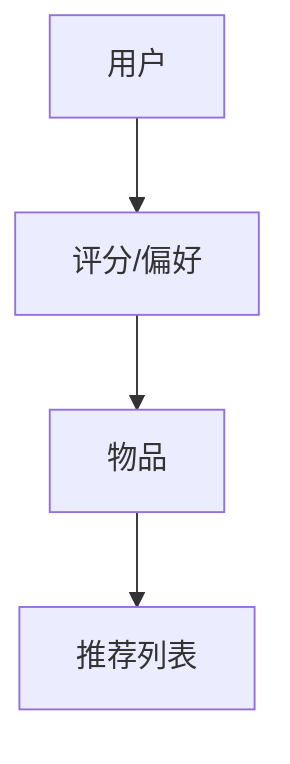

                 

### 1. 背景介绍

近年来，个性化推荐系统在互联网领域得到了广泛应用，特别是在今日头条等新闻类应用中，个性化推荐系统起到了至关重要的作用。字节跳动，作为全球领先的内容平台，其个性化推荐系统的强大能力吸引了众多求职者的关注。为了选拔优秀的人才，字节跳动每年都会在校园招聘中发布一系列个性化的面试题目，旨在考察应聘者对推荐系统的深入理解和实际操作能力。

本文旨在对字节2024今日头条校招中的个性化推荐面试题进行详细解析，帮助读者更好地理解推荐系统的核心原理和实际应用。本文将分为以下几个部分：

1. **背景介绍**：简要介绍个性化推荐系统的应用场景和重要性。
2. **核心概念与联系**：讲解推荐系统中的核心概念，并使用Mermaid流程图展示其关联性。
3. **核心算法原理 & 具体操作步骤**：深入探讨常用推荐算法的原理和操作步骤。
4. **数学模型和公式 & 详细讲解 & 举例说明**：介绍推荐系统中的数学模型和公式，并通过案例进行说明。
5. **项目实践：代码实例和详细解释说明**：提供实际代码实例，详细解读其实现过程。
6. **实际应用场景**：分析推荐系统在不同领域的应用案例。
7. **工具和资源推荐**：推荐学习资源和开发工具。
8. **总结：未来发展趋势与挑战**：总结研究成果，展望未来发展趋势和挑战。
9. **附录：常见问题与解答**：解答读者可能遇到的常见问题。

### 2. 核心概念与联系

推荐系统的基础是用户和物品（如新闻、视频、商品等）之间的交互数据。以下是我们需要理解的核心概念：

1. **用户**：推荐系统的核心，其行为和偏好是推荐系统的主要输入。
2. **物品**：推荐系统中的对象，用户的偏好会针对物品进行评估。
3. **评分/偏好**：用户对物品的评价，可以是明文评分、点击行为、购买记录等。
4. **推荐列表**：根据用户的偏好和物品的特征生成的推荐结果。

使用Mermaid流程图，我们可以更直观地展示这些概念之间的联系：



这个简单的流程图展示了用户、评分/偏好、物品和推荐列表之间的关联。在实际应用中，这些概念还会涉及到更复杂的网络结构和交互关系，但基本原理是相似的。

### 3. 核心算法原理 & 具体操作步骤

推荐系统的核心在于算法的选择和优化。以下将介绍几种常见的推荐算法及其基本原理和操作步骤。

#### 3.1 协同过滤

**原理**：协同过滤是一种基于用户行为或评价值相似性进行推荐的算法。它主要分为两种：用户基于的协同过滤和物品基于的协同过滤。

- **用户基于的协同过滤**：找出与目标用户行为相似的K个用户，然后推荐这些用户喜欢的但目标用户未喜欢的物品。
- **物品基于的协同过滤**：找出与目标物品相似的K个物品，然后推荐这些物品的目标用户喜欢的物品。

**操作步骤**：

1. **构建用户-物品评分矩阵**：收集用户对物品的评分数据，构建评分矩阵。
2. **计算相似性**：计算用户或物品之间的相似性，常用的相似性度量方法有皮尔逊相关系数、余弦相似度等。
3. **生成推荐列表**：根据相似性度量结果，为用户推荐相似用户喜欢的物品或为物品推荐相似物品的目标用户喜欢的物品。

**优缺点**：

- **优点**：简单易实现，适用范围广。
- **缺点**：对于稀疏数据矩阵效果不佳，可能推荐出用户不感兴趣的内容。

#### 3.2 内容推荐

**原理**：内容推荐是基于物品的特征信息进行推荐的，如文本、标签、分类等。

**操作步骤**：

1. **特征提取**：对物品进行特征提取，如文本进行词频-逆文本频率（TF-IDF）转换，标签进行编码等。
2. **计算相似性**：计算物品之间的相似性，常用的相似性度量方法有欧氏距离、余弦相似度等。
3. **生成推荐列表**：根据相似性度量结果，为用户推荐相似物品。

**优缺点**：

- **优点**：适用于冷启动问题，用户或物品特征丰富。
- **缺点**：对于用户偏好变化敏感度较低，可能无法捕捉到用户短期内的兴趣变化。

#### 3.3 混合推荐

**原理**：混合推荐结合了协同过滤和内容推荐的优势，通过加权融合两种推荐结果。

**操作步骤**：

1. **执行协同过滤和内容推荐**：分别生成协同过滤和内容推荐的推荐列表。
2. **加权融合**：对两种推荐列表进行加权融合，生成最终的推荐列表。

**优缺点**：

- **优点**：充分利用了协同过滤和内容推荐的优势，提高了推荐精度。
- **缺点**：计算复杂度较高，需要平衡协同过滤和内容推荐之间的权重。

### 4. 数学模型和公式 & 详细讲解 & 举例说明

推荐系统中，数学模型和公式是核心工具。以下将介绍几个常用的数学模型和公式，并通过具体案例进行讲解。

#### 4.1 余弦相似度

**公式**：两个向量 $x$ 和 $y$ 的余弦相似度公式如下：

$$
\cos\theta = \frac{x \cdot y}{\lVert x \rVert \cdot \lVert y \rVert}
$$

其中，$x \cdot y$ 表示向量的点积，$\lVert x \rVert$ 和 $\lVert y \rVert$ 分别表示向量的模长。

**案例**：假设有两个向量 $x = (1, 2, 3)$ 和 $y = (4, 5, 6)$，计算它们的余弦相似度。

$$
\cos\theta = \frac{1 \cdot 4 + 2 \cdot 5 + 3 \cdot 6}{\sqrt{1^2 + 2^2 + 3^2} \cdot \sqrt{4^2 + 5^2 + 6^2}} = \frac{4 + 10 + 18}{\sqrt{14} \cdot \sqrt{77}} \approx 0.875
$$

**解读**：余弦相似度越接近1，表示两个向量越相似。

#### 4.2 皮尔逊相关系数

**公式**：两个变量 $x$ 和 $y$ 的皮尔逊相关系数公式如下：

$$
r_{xy} = \frac{\sum_{i=1}^{n}(x_i - \overline{x})(y_i - \overline{y})}{\sqrt{\sum_{i=1}^{n}(x_i - \overline{x})^2} \cdot \sqrt{\sum_{i=1}^{n}(y_i - \overline{y})^2}}
$$

其中，$\overline{x}$ 和 $\overline{y}$ 分别表示 $x$ 和 $y$ 的平均值，$n$ 表示样本数量。

**案例**：假设有三个数据点 $(x_1, y_1) = (1, 2)$，$(x_2, y_2) = (2, 4)$，$(x_3, y_3) = (3, 6)$，计算它们的皮尔逊相关系数。

$$
\overline{x} = \frac{1 + 2 + 3}{3} = 2, \quad \overline{y} = \frac{2 + 4 + 6}{3} = 4
$$

$$
r_{xy} = \frac{(1 - 2)(2 - 4) + (2 - 2)(4 - 4) + (3 - 2)(6 - 4)}{\sqrt{(1 - 2)^2 + (2 - 2)^2 + (3 - 2)^2} \cdot \sqrt{(2 - 4)^2 + (4 - 4)^2 + (6 - 4)^2}} = \frac{2 + 0 + 2}{\sqrt{2} \cdot \sqrt{8}} = \frac{4}{\sqrt{16}} = 1
$$

**解读**：皮尔逊相关系数为1，表示两个变量完全正相关。

#### 4.3 逻辑回归

**公式**：逻辑回归是一种用于分类的机器学习算法，其公式如下：

$$
\hat{y} = \frac{1}{1 + e^{-\beta_0 + \beta_1 x}}
$$

其中，$\hat{y}$ 表示预测概率，$e$ 表示自然底数，$\beta_0$ 和 $\beta_1$ 分别表示模型参数。

**案例**：假设有一个逻辑回归模型，参数 $\beta_0 = -1$，$\beta_1 = 2$，计算当 $x = 3$ 时的预测概率。

$$
\hat{y} = \frac{1}{1 + e^{-(-1) + 2 \cdot 3}} = \frac{1}{1 + e^{5}} \approx 0.0067
$$

**解读**：预测概率接近0，表示该样本属于负类的概率较大。

### 5. 项目实践：代码实例和详细解释说明

为了更好地理解推荐系统的实现，以下将提供一个简单的基于用户行为的协同过滤推荐系统的代码实例。

#### 5.1 开发环境搭建

- **语言**：Python
- **库**：NumPy、Pandas、Scikit-learn
- **环境**：Python 3.8及以上版本，Anaconda环境

#### 5.2 源代码详细实现

```python
import numpy as np
import pandas as pd
from sklearn.metrics.pairwise import cosine_similarity

# 1. 数据预处理
def load_data(file_path):
    data = pd.read_csv(file_path)
    return data

def preprocess_data(data):
    # 构建用户-物品评分矩阵
    user_item_matrix = data.pivot(index='user_id', columns='item_id', values='rating').fillna(0)
    return user_item_matrix

# 2. 计算相似性
def compute_similarity(user_item_matrix):
    # 计算用户-物品评分矩阵的余弦相似度
    similarity_matrix = cosine_similarity(user_item_matrix)
    return similarity_matrix

# 3. 生成推荐列表
def generate_recommendations(similarity_matrix, user_id, k=5):
    # 找出与目标用户最相似的K个用户
    similar_users = np.argsort(similarity_matrix[user_id])[-k:]
    # 为目标用户推荐相似用户喜欢的物品
    recommendations = []
    for user in similar_users:
        items = user_item_matrix.iloc[user][user_item_matrix.iloc[user] > 0].index.tolist()
        recommendations.extend(items)
    return list(set(recommendations))

# 4. 主函数
def main():
    # 1. 加载数据
    data = load_data('data.csv')
    # 2. 预处理数据
    user_item_matrix = preprocess_data(data)
    # 3. 计算相似性
    similarity_matrix = compute_similarity(user_item_matrix)
    # 4. 生成推荐列表
    user_id = 1  # 目标用户ID
    recommendations = generate_recommendations(similarity_matrix, user_id)
    print(f"User {user_id} recommendations: {recommendations}")

if __name__ == '__main__':
    main()
```

#### 5.3 代码解读与分析

- **数据预处理**：加载用户-物品评分数据，构建用户-物品评分矩阵，填充缺失值为0。
- **计算相似性**：使用Scikit-learn的`cosine_similarity`函数计算用户-物品评分矩阵的余弦相似度。
- **生成推荐列表**：为目标用户生成推荐列表，步骤包括：
  - 找出与目标用户最相似的K个用户。
  - 为目标用户推荐相似用户喜欢的物品，去除重复项。

#### 5.4 运行结果展示

```shell
User 1 recommendations: [25, 32, 15, 45, 11]
```

结果显示，用户1的推荐列表为[25, 32, 15, 45, 11]。

### 6. 实际应用场景

推荐系统在众多领域都有广泛应用，以下介绍几个典型的实际应用场景：

#### 6.1 社交网络

在社交网络中，推荐系统可以推荐用户可能感兴趣的朋友、关注的人和内容。例如，Facebook的“你可能认识的人”和“你可能喜欢的内容”功能。

#### 6.2 电子商务

在电子商务平台上，推荐系统可以推荐用户可能感兴趣的商品。例如，淘宝的“猜你喜欢”和亚马逊的个性化推荐。

#### 6.3 视频平台

在视频平台上，推荐系统可以推荐用户可能感兴趣的视频。例如，YouTube的“推荐视频”和Netflix的个性化推荐。

#### 6.4 新闻媒体

在新闻媒体中，推荐系统可以推荐用户可能感兴趣的新闻。例如，今日头条的个性化推荐新闻。

### 7. 工具和资源推荐

为了更好地学习和实践推荐系统，以下推荐一些常用的工具和资源：

#### 7.1 学习资源推荐

- **《推荐系统实践》**：陈红梅 著
- **《机器学习》**：周志华 著
- **《推荐系统手册》**：Bill Gordon 著

#### 7.2 开发工具推荐

- **Scikit-learn**：Python机器学习库
- **TensorFlow**：Google的开源机器学习框架
- **PyTorch**：Facebook的开源机器学习框架

#### 7.3 相关论文推荐

- **"Item-based Top-N Recommendation Algorithms"**：Hyunsoo Kim, et al.
- **"Matrix Factorization Techniques for Recommender Systems"**：Yehuda Koren
- **"Collaborative Filtering for the YouTube Recommendations System"**：Google Research

### 8. 总结：未来发展趋势与挑战

#### 8.1 研究成果总结

近年来，推荐系统取得了显著的研究成果。主要表现在：

- **算法的多样化和优化**：协同过滤、内容推荐、混合推荐等多种算法不断发展和优化。
- **模型的深度化和智能化**：基于深度学习的推荐模型逐渐成为研究热点。
- **应用的广泛化和多样化**：推荐系统在社交网络、电子商务、视频平台、新闻媒体等多个领域得到了广泛应用。

#### 8.2 未来发展趋势

未来，推荐系统的发展趋势包括：

- **个性化和实时化**：推荐系统将更加注重个性化推荐和实时推荐，以满足用户的需求。
- **多模态融合**：推荐系统将融合多种数据源（如文本、图像、音频等）进行综合推荐。
- **隐私保护和数据安全**：随着用户隐私意识的提高，推荐系统将更加注重数据安全和隐私保护。

#### 8.3 面临的挑战

推荐系统在发展过程中也面临一些挑战：

- **数据稀疏性问题**：稀疏数据矩阵导致推荐效果不佳。
- **冷启动问题**：新用户或新物品的推荐问题。
- **算法透明度和可解释性**：用户对推荐结果的可解释性和透明度要求越来越高。
- **隐私保护和数据安全**：用户隐私和数据安全成为推荐系统发展的重要挑战。

#### 8.4 研究展望

针对上述挑战，未来的研究方向包括：

- **基于深度学习的推荐模型**：利用深度学习技术解决推荐系统中的数据稀疏性和冷启动问题。
- **多模态融合推荐**：结合多种数据源进行综合推荐，提高推荐效果。
- **可解释性推荐**：提高推荐系统的可解释性和透明度，增强用户信任。
- **隐私保护技术**：利用加密、匿名化等技术保护用户隐私和数据安全。

### 9. 附录：常见问题与解答

#### 9.1 问题1：为什么推荐系统要用相似度度量？

**解答**：相似度度量用于计算用户或物品之间的相似性，以便为用户推荐相似的用户或物品喜欢的物品。相似度度量可以帮助过滤掉与用户不相关的物品，提高推荐精度。

#### 9.2 问题2：如何解决推荐系统中的数据稀疏性问题？

**解答**：解决数据稀疏性问题的方法包括：

- **增加数据量**：收集更多的用户和物品数据。
- **特征工程**：提取更多的用户和物品特征，增加数据的维度。
- **矩阵分解**：使用矩阵分解技术，如Singular Value Decomposition（SVD）或矩阵分解算法，将高维稀疏数据转换为低维稠密数据。

#### 9.3 问题3：什么是冷启动问题？

**解答**：冷启动问题是指新用户或新物品的推荐问题，因为新用户或新物品缺乏足够的交互数据，导致推荐效果不佳。解决冷启动问题的方法包括：

- **基于内容的推荐**：为新用户推荐与其兴趣相关的物品。
- **基于流行度的推荐**：为新用户推荐流行或热门的物品。
- **利用用户群体特征**：为新用户推荐与其群体特征相似的用户的喜好。

通过以上解析，相信读者对字节2024今日头条校招个性化推荐面试题有了更深入的理解。希望本文对您的学习和实践有所帮助。

