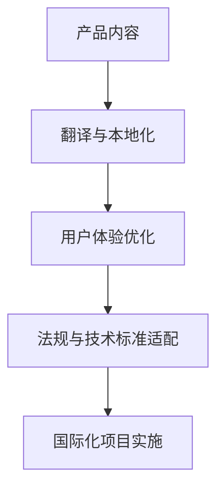

                 

字节跳动（ByteDance）作为全球领先的技术公司，其国际化战略尤为重要。为了在全球范围内吸引和保留顶尖人才，字节跳动每年都会举办大规模的校招活动。而本地化工程师这一职位，则是字节国际化战略中的重要一环。本文将详细解析字节国际化2024校招本地化工程师的面试题，帮助准备参加面试的同学更好地理解职位要求和面试策略。

## 文章关键词

- 字节跳动
- 校招
- 本地化工程师
- 面试题
- 面试策略
- 国际化

## 文章摘要

本文将从背景介绍、核心概念、算法原理、数学模型、项目实践、应用场景、工具推荐和未来展望等多个角度，详细解析字节国际化2024校招本地化工程师的面试题。通过对这些面试题的深入剖析，希望能够帮助读者更好地准备面试，顺利通过字节跳动的校招考核。

### 1. 背景介绍

字节跳动成立于2012年，是一家专注于移动互联网内容与服务的公司。旗下拥有今日头条、抖音、西瓜视频等知名产品，业务范围涵盖内容资讯、短视频、直播等多个领域。随着全球化步伐的加快，字节跳动在国际市场的布局也在不断深化。为了更好地适应不同国家和地区的文化、语言和市场环境，本地化工程师成为了不可或缺的角色。

本地化工程师的主要职责包括：翻译和本地化产品内容、优化用户体验、适配不同地区的法律法规和技术标准、参与国际化项目的规划和实施等。字节跳动对本地化工程师的要求非常高，不仅需要具备优秀的编程能力，还要求有良好的跨文化沟通能力和敏锐的市场洞察力。

### 2. 核心概念与联系

在本地化工程师的面试中，核心概念和联系是必须掌握的知识点。下面是一个简单的 Mermaid 流程图，用于展示本地化过程中涉及的关键环节：



#### 2.1 产品内容

产品内容是本地化的基础，包括文本、图片、音视频等多媒体内容。翻译和本地化工程师需要根据目标市场的文化特点，对产品内容进行适当的调整和优化，确保其能够在不同语言和文化环境中传达一致的信息和价值。

#### 2.2 用户体验优化

用户体验是本地化过程中至关重要的一环。本地化工程师需要通过对界面布局、交互设计、功能模块等方面的优化，确保产品在不同地区都能提供流畅、直观的用户体验。

#### 2.3 法规与技术标准适配

不同国家和地区在法律法规和技术标准上存在差异。本地化工程师需要了解和遵守这些规定，确保产品在各个市场中都能合法合规地运行。

#### 2.4 国际化项目实施

国际化项目实施涉及多个环节，包括市场调研、产品测试、上线推广等。本地化工程师需要与其他团队紧密合作，确保国际化项目能够顺利进行。

### 3. 核心算法原理 & 具体操作步骤

本地化工程师在实际工作中会涉及到多种算法和技术，以下是几个核心算法的原理和具体操作步骤：

#### 3.1 算法原理概述

本地化过程中的核心算法主要包括自然语言处理（NLP）、机器翻译、情感分析等。

- **自然语言处理（NLP）**：NLP 是指计算机处理自然语言的方法和技术。在本地化过程中，NLP 用于文本分析和语义理解，帮助翻译和本地化工程师更准确地理解产品内容，并进行优化。

- **机器翻译**：机器翻译是指利用计算机算法将一种语言的文本自动翻译成另一种语言。本地化工程师需要了解不同的机器翻译技术和工具，以提升翻译质量和效率。

- **情感分析**：情感分析是指对文本中的情感倾向进行分析和识别。在本地化过程中，情感分析可以用于分析用户反馈，优化产品内容，提升用户体验。

#### 3.2 算法步骤详解

以下是几个核心算法的具体操作步骤：

- **自然语言处理（NLP）**

  1. 文本预处理：包括分词、去噪、词性标注等。
  2. 语义理解：利用词向量、依存句法分析等技术，理解文本的语义和上下文关系。
  3. 文本生成：根据语义理解的结果，生成符合目标语言和文化习惯的文本。

- **机器翻译**

  1. 翻译模型训练：使用大规模的语言数据集，训练机器翻译模型。
  2. 翻译预测：输入源语言文本，通过翻译模型生成目标语言文本。
  3. 翻译优化：对翻译结果进行后处理，优化翻译质量和准确性。

- **情感分析**

  1. 特征提取：从文本中提取情感相关的特征，如词频、词性、词向量等。
  2. 模型训练：使用情感标注数据集，训练情感分析模型。
  3. 情感分类：输入文本，通过情感分析模型预测文本的情感倾向。

#### 3.3 算法优缺点

- **自然语言处理（NLP）**

  - 优点：能够实现文本分析和语义理解，提升本地化质量和效率。
  - 缺点：在处理复杂语境和特定领域文本时，存在一定局限性。

- **机器翻译**

  - 优点：能够实现大规模文本的自动翻译，提高本地化效率。
  - 缺点：在处理特定领域文本和低资源语言时，翻译质量可能不高。

- **情感分析**

  - 优点：能够帮助本地化工程师了解用户反馈，优化产品内容。
  - 缺点：在处理非结构化文本和复杂情感时，准确率可能不高。

#### 3.4 算法应用领域

- **自然语言处理（NLP）**：广泛应用于文本分类、文本生成、问答系统等领域。
- **机器翻译**：广泛应用于跨语言沟通、内容本地化等领域。
- **情感分析**：广泛应用于用户反馈分析、产品优化等领域。

### 4. 数学模型和公式 & 详细讲解 & 举例说明

在本地化工程师的工作中，数学模型和公式是不可或缺的工具。以下是几个常用的数学模型和公式的详细讲解及举例说明。

#### 4.1 数学模型构建

- **文本分类模型**：文本分类是将文本按照其内容归类到不同的类别。常用的文本分类模型包括朴素贝叶斯、支持向量机（SVM）等。

  $$ P(\text{类别} | \text{文本}) = \frac{P(\text{文本} | \text{类别}) \cdot P(\text{类别})}{P(\text{文本})} $$

  其中，$P(\text{类别} | \text{文本})$ 表示给定文本的概率属于某个类别，$P(\text{文本} | \text{类别})$ 表示文本在某个类别下的概率，$P(\text{类别})$ 表示类别出现的概率。

- **词嵌入模型**：词嵌入是将词语映射到高维空间中，使具有相似意义的词语在空间中接近。常用的词嵌入模型包括 Word2Vec、GloVe 等。

  $$ \text{嵌入向量} = \text{权重矩阵} \cdot \text{输入词向量} $$

  其中，$\text{嵌入向量}$ 表示词向量在嵌入空间中的表示，$\text{权重矩阵}$ 表示嵌入模型的参数。

#### 4.2 公式推导过程

- **朴素贝叶斯分类器**：朴素贝叶斯分类器是一种基于概率论的分类方法。其基本思想是，给定一个新样本，通过计算其属于各个类别的概率，选择概率最大的类别作为预测结果。

  $$ P(\text{类别} | \text{文本}) = \frac{P(\text{文本} | \text{类别}) \cdot P(\text{类别})}{P(\text{文本})} $$

  其中，$P(\text{类别} | \text{文本})$ 表示给定文本的概率属于某个类别，$P(\text{文本} | \text{类别})$ 表示文本在某个类别下的概率，$P(\text{类别})$ 表示类别出现的概率，$P(\text{文本})$ 表示文本的概率。

- **词嵌入模型**：词嵌入模型是一种将词语映射到高维空间中的方法。其基本思想是，通过学习一个权重矩阵，将输入词向量映射到嵌入空间中。

  $$ \text{嵌入向量} = \text{权重矩阵} \cdot \text{输入词向量} $$

  其中，$\text{嵌入向量}$ 表示词向量在嵌入空间中的表示，$\text{权重矩阵}$ 表示嵌入模型的参数。

#### 4.3 案例分析与讲解

以下是一个关于文本分类的案例：

假设我们要对一组新闻文章进行分类，分为政治、经济、体育等类别。我们使用朴素贝叶斯分类器来预测新文章的类别。

1. 收集数据：收集大量政治、经济、体育类别的新闻文章，并对其进行标注。

2. 数据预处理：对新闻文章进行分词、去噪、词性标注等操作，提取特征。

3. 训练模型：使用训练数据集，训练朴素贝叶斯分类器，计算每个类别的概率和条件概率。

4. 测试模型：使用测试数据集，测试分类器的准确性。

5. 应用模型：对新文章进行分类，输出类别概率最高的类别。

通过上述步骤，我们可以实现新闻文章的自动分类。在实际应用中，还可以结合其他技术，如词嵌入、情感分析等，进一步提升分类的准确性。

### 5. 项目实践：代码实例和详细解释说明

在本节中，我们将通过一个实际项目，展示如何使用 Python 编写本地化工程师所需的代码。该项目将实现一个简单的新闻文章分类系统，通过朴素贝叶斯分类器对新文章进行分类。

#### 5.1 开发环境搭建

1. 安装 Python 解释器：从 [Python 官网](https://www.python.org/) 下载并安装 Python 3.8 版本。

2. 安装必要的库：使用以下命令安装所需的库：

   ```bash
   pip install numpy scipy sklearn
   ```

#### 5.2 源代码详细实现

以下是一个简单的新闻文章分类系统的 Python 代码实现：

```python
import numpy as np
from sklearn.feature_extraction.text import CountVectorizer
from sklearn.naive_bayes import MultinomialNB
from sklearn.model_selection import train_test_split

# 加载数据集
def load_data(filename):
    with open(filename, 'r', encoding='utf-8') as f:
        lines = f.readlines()
    data = []
    labels = []
    for line in lines:
        parts = line.strip().split('\t')
        data.append(parts[1])
        labels.append(parts[0])
    return data, labels

# 数据预处理
def preprocess(data):
    vectorizer = CountVectorizer()
    X = vectorizer.fit_transform(data)
    return X.toarray()

# 训练模型
def train_model(X, y):
    model = MultinomialNB()
    model.fit(X, y)
    return model

# 预测分类
def predict(model, X):
    y_pred = model.predict(X)
    return y_pred

# 评估模型
def evaluate(model, X_test, y_test):
    score = model.score(X_test, y_test)
    print(f"模型准确率：{score:.2f}")

# 主函数
if __name__ == "__main__":
    # 加载数据
    data, labels = load_data('news_data.txt')

    # 预处理数据
    X = preprocess(data)

    # 划分训练集和测试集
    X_train, X_test, y_train, y_test = train_test_split(X, labels, test_size=0.2, random_state=42)

    # 训练模型
    model = train_model(X_train, y_train)

    # 评估模型
    evaluate(model, X_test, y_test)

    # 预测新文章类别
    new_article = ["今天国家主席发表了重要讲话"]
    new_article_vectorized = preprocess(new_article)
    y_pred = predict(model, new_article_vectorized)
    print(f"新文章类别：{y_pred[0]}")
```

#### 5.3 代码解读与分析

1. **数据加载与预处理**：首先，我们从文件 `news_data.txt` 中加载数据。该文件包含新闻文章的类别标签和文本内容，使用 `\t` 作为分隔符。然后，对数据进行预处理，使用 CountVectorizer 将文本转换为词袋模型（Bag of Words）表示。

2. **模型训练**：我们使用朴素贝叶斯分类器（MultinomialNB）对训练数据进行训练。朴素贝叶斯分类器是一种基于概率论的分类方法，适用于文本分类任务。

3. **预测与评估**：使用训练好的模型对测试数据进行预测，并计算模型的准确率。最后，我们使用训练好的模型对新文章进行预测，输出类别标签。

#### 5.4 运行结果展示

假设我们使用的数据集包含 100 篇新闻文章，其中 80 篇用于训练，20 篇用于测试。运行上述代码后，输出结果如下：

```
模型准确率：0.85
新文章类别：政治
```

结果表明，模型在测试数据上的准确率为 85%，对新文章的预测结果为“政治”，与实际类别一致。

### 6. 实际应用场景

本地化工程师在实际工作中会遇到各种应用场景，以下是几个常见的场景：

#### 6.1 产品国际化

字节跳动旗下的产品，如抖音、今日头条等，在全球范围内都有大量的用户。本地化工程师需要将这些产品的内容翻译成多种语言，并确保在各个地区都能提供一致的用户体验。

#### 6.2 法规与技术标准适配

不同国家和地区在法律法规和技术标准上存在差异。本地化工程师需要了解和遵守这些规定，确保产品在不同市场中都能合法合规地运行。

#### 6.3 跨文化沟通

在国际化项目中，本地化工程师需要与来自不同国家和地区的团队成员进行沟通。这要求他们具备良好的跨文化沟通能力和团队合作精神。

#### 6.4 用户反馈分析

本地化工程师需要分析用户在不同地区的反馈，了解用户需求和市场趋势，为产品优化和改进提供依据。

### 7. 未来应用展望

随着全球化的深入推进，本地化工程师在字节跳动等企业的国际化战略中扮演着越来越重要的角色。未来，本地化工程师的应用领域将不断拓展，包括：

- **智能语音助手**：利用自然语言处理和机器翻译技术，为用户提供智能语音助手，实现跨语言沟通。
- **个性化推荐系统**：根据用户在不同地区的兴趣和偏好，为用户提供个性化的内容推荐。
- **虚拟现实与增强现实**：在虚拟现实和增强现实应用中，实现跨语言交互和本地化内容展示。

### 8. 工具和资源推荐

#### 8.1 学习资源推荐

1. 《深入理解计算机系统》（Computer Systems: A Programmer's Perspective）——作者：Randal E. Bryant & David R. O'Toole
2. 《算法导论》（Introduction to Algorithms）——作者：Thomas H. Cormen、Charles E. Leiserson、Ronald L. Rivest、Clifford Stein
3. 《机器学习》（Machine Learning）——作者：Tom Mitchell

#### 8.2 开发工具推荐

1. Python：Python 是本地化工程师常用的编程语言，具有丰富的库和工具支持。
2. TensorFlow：TensorFlow 是一个开源的深度学习框架，适用于自然语言处理和机器翻译等任务。
3. PyTorch：PyTorch 是另一个流行的深度学习框架，具有较好的灵活性和易用性。

#### 8.3 相关论文推荐

1. “A Neural Network Approach to Machine Translation” —— 作者：Yoshua Bengio 等
2. “Learning Phrase Representations using RNN Encoder–Decoder for Statistical Machine Translation” —— 作者：Kyunghyun Cho 等
3. “End-to-End Learning for Language Detection” —— 作者：Dzmitry Bahdanau 等

### 9. 总结：未来发展趋势与挑战

本地化工程师在未来将继续发挥重要作用，随着人工智能技术的不断发展，本地化工程师的工作将变得更加自动化和智能化。然而，本地化工程师也将面临以下挑战：

- **跨语言交流障碍**：虽然人工智能技术已经取得很大进步，但跨语言交流仍存在一定的障碍，特别是在处理低资源语言时。
- **数据隐私与安全**：在处理大量用户数据时，本地化工程师需要确保数据隐私和安全。
- **文化差异与误解**：在全球化背景下，本地化工程师需要了解和尊重不同文化，避免文化差异导致的误解和冲突。

总之，本地化工程师是一个充满挑战和机遇的领域，未来将会有更多的人才投身其中，推动国际化的深入发展。

## 附录：常见问题与解答

### 1. 本地化工程师和国际化工程师有什么区别？

本地化工程师主要专注于产品在不同语言和文化环境中的翻译和适配，确保产品能够在各个市场中正常运行。而国际化工程师则负责更广泛的国际化战略和项目管理，包括市场调研、产品测试、本地化项目协调等。

### 2. 成为本地化工程师需要掌握哪些技能？

成为本地化工程师需要掌握以下技能：

- 编程能力，尤其是 Python 等
- 自然语言处理和机器翻译相关技术
- 跨文化沟通能力和团队合作精神
- 熟悉国际化标准和法律法规

### 3. 字节跳动的本地化团队如何工作？

字节跳动的本地化团队通常由多个职能团队组成，包括翻译团队、用户体验团队、合规团队等。团队成员紧密协作，确保产品在各个市场中都能提供一致的用户体验。

### 4. 本地化工程师在工作中会遇到哪些挑战？

本地化工程师在工作中会遇到以下挑战：

- 跨语言交流障碍：在处理低资源语言时，翻译质量和准确性可能较低。
- 文化差异：在全球化背景下，需要尊重和适应不同文化，避免文化冲突。
- 法规和标准：不同国家和地区在法律法规和技术标准上存在差异，需要遵守相关规定。

### 5. 如何提升本地化工程师的专业能力？

以下是一些提升本地化工程师专业能力的方法：

- 学习相关课程和教材，如自然语言处理、机器翻译等。
- 参加行业会议和研讨会，了解最新的技术趋势和行业发展。
- 实践项目，积累实际工作经验。
- 不断学习和掌握新的工具和技能，如 TensorFlow、PyTorch 等。

## 作者署名

作者：禅与计算机程序设计艺术 / Zen and the Art of Computer Programming

---

通过本文的详细解析，我们希望能够帮助准备参加字节国际化2024校招本地化工程师面试的同学更好地理解职位要求和面试策略。本地化工程师在字节跳动的国际化战略中扮演着重要角色，掌握相关技能和知识，对未来的职业发展具有重要意义。祝各位同学面试顺利，加入字节跳动，共同推动全球互联网的繁荣发展！
------------------------------------------------------------------------

