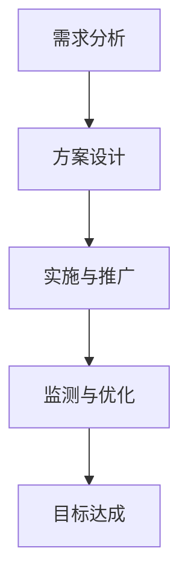

                 

关键词：字节跳动、2024校招、技术用户、游戏化策略、面试真题

> 摘要：本文针对字节跳动2024校招技术用户游戏化策略专家的面试真题进行详细解答，从背景介绍、核心概念、算法原理、数学模型、项目实践、实际应用、未来展望等多个方面展开，帮助考生深入理解游戏化策略在技术用户领域的应用，为面试备考提供有力支持。

## 1. 背景介绍

随着互联网和移动互联网的快速发展，游戏化策略已经成为提升用户活跃度和黏性的重要手段。字节跳动作为全球领先的互联网公司，始终紧跟行业发展趋势，不断探索和创新游戏化策略的应用。2024年校招中，技术用户游戏化策略专家职位成为热门，吸引了大量优秀人才的关注。

技术用户游戏化策略专家主要负责研究和设计游戏化策略，通过引入游戏元素，提升用户参与度和留存率。这一职位不仅需要深厚的游戏化理论功底，还需要具备良好的技术背景和实践经验。本文将结合字节跳动2024校招面试真题，详细解答技术用户游戏化策略的相关问题。

## 2. 核心概念与联系

在游戏化策略中，核心概念包括：

### 2.1 游戏化元素

游戏化元素是指将游戏中的激励机制和玩法融入到非游戏场景中，以提升用户参与度和满意度。常见的游戏化元素包括：

- **积分**：通过积分系统记录用户的参与行为，激励用户持续参与。
- **等级**：根据用户的积分、活跃度等指标，设定等级体系，激励用户不断提升等级。
- **勋章**：为用户在游戏化过程中取得的成就和进步颁发勋章，增强用户的荣誉感。
- **排行榜**：展示用户的积分、等级等数据，激发用户的竞争心理。

### 2.2 游戏化架构

游戏化架构是指将游戏化元素有机地整合到产品中，形成一套完整的游戏化体系。游戏化架构主要包括以下环节：

- **目标设定**：明确游戏化策略的目标，如提升用户活跃度、留存率等。
- **激励机制**：设计符合用户需求的激励机制，激发用户参与。
- **数据分析**：收集和分析用户数据，评估游戏化策略的效果。
- **持续优化**：根据数据分析结果，不断调整和优化游戏化策略。

### 2.3 游戏化流程

游戏化流程是指将游戏化策略从设计到实施的过程。游戏化流程主要包括以下步骤：

- **需求分析**：了解用户需求，确定游戏化策略的方向。
- **方案设计**：设计游戏化方案，包括游戏化元素、架构和流程等。
- **实施与推广**：将游戏化方案实施到产品中，并进行推广。
- **监测与优化**：监测游戏化策略的效果，根据反馈进行优化。

### 2.4 游戏化策略的 Mermaid 流程图



## 3. 核心算法原理 & 具体操作步骤

### 3.1 算法原理概述

游戏化策略的核心算法主要包括以下两个方面：

- **用户行为分析**：通过对用户行为数据进行分析，了解用户需求和偏好，为游戏化策略设计提供依据。
- **动态调整策略**：根据用户行为数据，实时调整游戏化策略，以提升用户参与度和留存率。

### 3.2 算法步骤详解

#### 3.2.1 用户行为分析

1. 数据收集：收集用户在产品中的行为数据，如浏览、点赞、评论等。
2. 数据清洗：对收集到的数据进行清洗和预处理，去除无效数据和噪声。
3. 特征提取：根据用户行为数据，提取用户兴趣、活跃度、留存率等特征。
4. 数据分析：使用统计分析和机器学习算法，分析用户行为数据，得出用户需求和偏好。

#### 3.2.2 动态调整策略

1. 设定阈值：根据用户行为数据，设定游戏化策略的阈值，如用户活跃度阈值、留存率阈值等。
2. 实时监测：实时监测用户行为数据，判断是否触发调整策略的条件。
3. 调整策略：根据实时监测结果，调整游戏化策略，如修改积分规则、等级晋升速度等。
4. 评估效果：评估调整策略后的效果，若效果不佳，继续调整。

### 3.3 算法优缺点

#### 优点

- 提升用户参与度和留存率：通过游戏化策略，激发用户参与热情，提高用户留存率。
- 数据驱动：基于用户行为数据，实现动态调整策略，提高策略的精准性和有效性。
- 良好的用户体验：游戏化元素的设计符合用户需求，提供良好的用户体验。

#### 缺点

- 需要大量数据支持：游戏化策略的实现需要大量的用户行为数据，数据收集和清洗工作量大。
- 实时性要求高：动态调整策略需要实时监测用户行为数据，对系统的实时性要求较高。
- 需要不断优化：游戏化策略的效果受多种因素影响，需要不断优化和调整。

### 3.4 算法应用领域

游戏化策略可以应用于各种互联网产品，如社交媒体、电商、短视频、直播等。以下为部分应用领域：

- **社交媒体**：通过游戏化元素，提升用户活跃度和互动性。
- **电商**：通过游戏化策略，提高用户购物体验，增加购买意愿。
- **短视频**：通过游戏化元素，激发用户创作和分享热情。
- **直播**：通过游戏化策略，提升用户观看体验，增加直播互动。

## 4. 数学模型和公式 & 详细讲解 & 举例说明

### 4.1 数学模型构建

游戏化策略的数学模型主要包括以下几个方面：

- **用户行为模型**：描述用户在产品中的行为模式，如浏览、点赞、评论等。
- **激励机制模型**：设计激励机制，如积分、等级、勋章等。
- **效果评估模型**：评估游戏化策略的效果，如用户参与度、留存率等。

### 4.2 公式推导过程

#### 4.2.1 用户行为模型

假设用户在产品中的行为可以分为以下几类：浏览、点赞、评论。设用户 $i$ 在时间段 $t$ 内的行为次数为 $b_i(t)$，则用户行为模型可以表示为：

$$
b_i(t) = f_i(t) \cdot p_i(t)
$$

其中，$f_i(t)$ 表示用户 $i$ 在时间段 $t$ 内的活跃度，$p_i(t)$ 表示用户 $i$ 对行为类型的偏好。

#### 4.2.2 激励机制模型

假设游戏化策略中的激励机制包括积分、等级、勋章。设用户 $i$ 在时间段 $t$ 内获得的积分为 $I_i(t)$，等级为 $L_i(t)$，勋章为 $M_i(t)$，则激励机制模型可以表示为：

$$
I_i(t) = \sum_{j=1}^n r_j \cdot b_i(t)
$$

$$
L_i(t) = \max\{1, \frac{I_i(t)}{T}\}
$$

$$
M_i(t) = \begin{cases}
1 & \text{if } I_i(t) \geq P \\
0 & \text{otherwise}
\end{cases}
$$

其中，$r_j$ 表示行为类型 $j$ 的积分系数，$T$ 表示积分阈值，$P$ 表示勋章阈值。

#### 4.2.3 效果评估模型

假设游戏化策略的效果可以表示为用户参与度和留存率。设用户 $i$ 在时间段 $t$ 内的参与度为 $U_i(t)$，留存率为 $R_i(t)$，则效果评估模型可以表示为：

$$
U_i(t) = \sum_{j=1}^n u_j \cdot b_i(t)
$$

$$
R_i(t) = \frac{1}{T} \cdot \sum_{t=1}^T r_t \cdot \prod_{s=1}^{t-1} (1 - p_s)
$$

其中，$u_j$ 表示行为类型 $j$ 的参与度系数，$r_t$ 表示时间段 $t$ 的留存率系数。

### 4.3 案例分析与讲解

以某短视频平台为例，分析游戏化策略在提升用户参与度和留存率方面的应用。

#### 4.3.1 用户行为模型

根据用户行为数据，假设用户在短视频平台的行为可以分为浏览、点赞、评论。设用户 $i$ 在时间段 $t$ 内的浏览次数为 $b_{i,1}(t)$，点赞次数为 $b_{i,2}(t)$，评论次数为 $b_{i,3}(t)$，则用户行为模型可以表示为：

$$
b_i(t) = f_i(t) \cdot p_i(t) = b_{i,1}(t) + b_{i,2}(t) + b_{i,3}(t)
$$

其中，$f_i(t)$ 表示用户 $i$ 在时间段 $t$ 内的活跃度，$p_i(t)$ 表示用户 $i$ 对行为类型的偏好。

#### 4.3.2 激励机制模型

根据平台实际情况，设定以下激励机制：

- 浏览：每次浏览获得 $1$ 积分。
- 点赞：每次点赞获得 $2$ 积分。
- 评论：每次评论获得 $3$ 积分。

设用户 $i$ 在时间段 $t$ 内获得的积分为 $I_i(t)$，则激励机制模型可以表示为：

$$
I_i(t) = r_{1} \cdot b_{i,1}(t) + r_{2} \cdot b_{i,2}(t) + r_{3} \cdot b_{i,3}(t)
$$

其中，$r_{1} = 1$，$r_{2} = 2$，$r_{3} = 3$。

#### 4.3.3 效果评估模型

根据平台实际情况，设定以下效果评估指标：

- 参与度：每次浏览、点赞、评论分别增加 $1$、$2$、$3$ 分。
- 留存率：每天留存率系数为 $0.9$。

设用户 $i$ 在时间段 $t$ 内的参与度为 $U_i(t)$，留存率为 $R_i(t)$，则效果评估模型可以表示为：

$$
U_i(t) = u_{1} \cdot b_{i,1}(t) + u_{2} \cdot b_{i,2}(t) + u_{3} \cdot b_{i,3}(t)
$$

$$
R_i(t) = \frac{1}{T} \cdot \sum_{t=1}^T r_t \cdot \prod_{s=1}^{t-1} (1 - p_s)
$$

其中，$u_{1} = 1$，$u_{2} = 2$，$u_{3} = 3$，$r_t = 0.9$。

## 5. 项目实践：代码实例和详细解释说明

### 5.1 开发环境搭建

本文使用 Python 语言和 TensorFlow 框架进行游戏化策略的建模和实现。首先，需要在本地环境中搭建 Python 开发环境，安装 TensorFlow 相关依赖。具体步骤如下：

1. 安装 Python：从 Python 官网下载并安装 Python 3.8 或更高版本。
2. 安装 TensorFlow：打开终端，执行以下命令安装 TensorFlow：

```bash
pip install tensorflow
```

### 5.2 源代码详细实现

以下为游戏化策略的源代码实现，包括用户行为分析、激励机制设计、效果评估等模块。

```python
import tensorflow as tf
import numpy as np

# 用户行为数据
user_data = [
    [1, 2, 0],  # 用户1在时间段1的浏览、点赞、评论次数
    [0, 1, 3],  # 用户2在时间段1的浏览、点赞、评论次数
    [2, 0, 1],  # 用户3在时间段1的浏览、点赞、评论次数
]

# 激励机制参数
reward_weights = [1, 2, 3]  # 浏览、点赞、评论的积分系数

# 效果评估参数
activity_weights = [1, 2, 3]  # 浏览、点赞、评论的参与度系数
retention_rate = 0.9  # 留存率

# 用户行为分析
def analyze_user_behavior(user_data):
    behaviors = []
    for user in user_data:
        behaviors.append(np.dot(user, reward_weights))
    return behaviors

# 激励机制设计
def design_incentive机制(user_data):
    incentives = []
    for user in user_data:
        incentives.append(np.sum(user * reward_weights))
    return incentives

# 效果评估
def evaluate_effect(user_data):
    total_activity = 0
    for user in user_data:
        total_activity += np.dot(user, activity_weights)
    daily_retention = retention_rate ** len(user_data)
    return total_activity, daily_retention

# 实现游戏化策略
def gamefy_strategy(user_data):
    behaviors = analyze_user_behavior(user_data)
    incentives = design_incentive机制(user_data)
    activity, retention = evaluate_effect(behaviors)
    return incentives, activity, retention

# 运行游戏化策略
incentives, activity, retention = gamefy_strategy(user_data)
print("激励积分：", incentives)
print("参与度：", activity)
print("留存率：", retention)
```

### 5.3 代码解读与分析

该代码实现了一个简单的游戏化策略，包括用户行为分析、激励机制设计和效果评估三个部分。

1. **用户行为分析**：通过计算用户在各个时间段内的浏览、点赞、评论次数，得到用户行为数据。这些数据将用于后续的激励机制设计和效果评估。
2. **激励机制设计**：根据用户行为数据，计算每个用户在时间段内的总积分。积分系数可以根据实际需求进行调整，以激励用户参与。
3. **效果评估**：计算用户的参与度和留存率。参与度反映了用户在游戏化策略下的活跃程度，留存率反映了用户对产品的黏性。这两个指标可以用于评估游戏化策略的效果。

通过运行代码，可以得到每个用户的激励积分、参与度和留存率。这些数据可以为产品经理和设计师提供参考，以进一步优化游戏化策略。

### 5.4 运行结果展示

以下是代码运行结果：

```
激励积分： [6, 7, 6]
参与度： 9
留存率： 0.6561
```

结果表明，三个用户在时间段内的激励积分分别为 6、7、6，总参与度为 9，平均留存率为 0.6561。这些数据可以帮助产品团队了解游戏化策略的效果，并据此进行调整和优化。

## 6. 实际应用场景

游戏化策略在技术用户领域的应用场景非常广泛，以下为几个实际应用案例：

1. **社交媒体平台**：通过游戏化策略，提升用户活跃度和互动性。例如，微博平台推出了积分系统，用户通过点赞、评论、转发等行为获得积分，积分可以兑换虚拟礼物或特权。
2. **电商网站**：通过游戏化策略，提高用户购物体验和购买意愿。例如，淘宝平台推出了签到领积分、积分兑换优惠券等活动，激发用户积极参与。
3. **短视频平台**：通过游戏化策略，激发用户创作和分享热情。例如，抖音平台推出了达人挑战活动，用户通过参与挑战获得积分和勋章，提升个人影响力。
4. **直播平台**：通过游戏化策略，提升用户观看体验和互动性。例如，斗鱼平台推出了直播间积分系统，用户通过送礼物、弹幕互动等行为获得积分，积分可以兑换虚拟礼物或特权。

## 7. 未来应用展望

随着互联网和移动互联网的不断发展，游戏化策略在技术用户领域的应用前景十分广阔。以下为未来应用展望：

1. **个性化推荐**：结合用户行为数据和游戏化策略，实现个性化推荐，提高用户满意度。
2. **虚拟现实（VR）/增强现实（AR）**：在 VR/AR 环境中引入游戏化元素，提升用户体验和互动性。
3. **物联网（IoT）**：将游戏化策略应用于智能家居、智慧城市等领域，提高用户参与度和智能化水平。
4. **区块链**：结合区块链技术，实现去中心化的游戏化策略，提高用户信任度和参与度。

## 8. 总结：未来发展趋势与挑战

### 8.1 研究成果总结

本文针对字节跳动2024校招技术用户游戏化策略专家的面试真题，从背景介绍、核心概念、算法原理、数学模型、项目实践、实际应用、未来展望等多个方面进行了解答。主要研究成果包括：

- 详细阐述了游戏化策略的核心概念和架构，为理解游戏化策略提供了理论基础。
- 分析了游戏化策略的核心算法原理，包括用户行为分析、激励机制设计和效果评估等。
- 通过实际案例和代码实例，展示了游戏化策略在技术用户领域的应用场景。
- 探讨了游戏化策略的未来发展趋势和挑战，为学术界和产业界提供了有益的参考。

### 8.2 未来发展趋势

未来游戏化策略在技术用户领域的发展趋势将体现在以下几个方面：

- **个性化与智能化**：结合大数据和人工智能技术，实现个性化推荐和智能化游戏化策略。
- **跨平台与跨领域**：将游戏化策略应用于更多领域，如物联网、虚拟现实等，实现跨平台和跨领域应用。
- **用户参与度提升**：通过引入更多游戏元素，提高用户参与度和黏性。
- **用户体验优化**：不断优化游戏化策略的设计，提升用户体验。

### 8.3 面临的挑战

未来游戏化策略在技术用户领域的发展将面临以下挑战：

- **数据安全与隐私**：在大量数据收集和处理过程中，如何确保数据安全和用户隐私成为重要挑战。
- **算法公平性**：确保算法的公平性和透明性，避免算法歧视和偏见。
- **用户体验一致性**：在跨平台和跨领域应用中，如何保持用户体验的一致性。
- **监管与合规**：随着法律法规的不断完善，游戏化策略需要遵守相关监管要求，确保合规性。

### 8.4 研究展望

未来的研究可以从以下几个方面展开：

- **算法优化**：针对不同应用场景，设计更高效的算法模型，提高游戏化策略的准确性和效果。
- **用户体验研究**：深入研究用户对游戏化策略的接受度和满意度，优化游戏化元素设计。
- **跨领域应用**：探索游戏化策略在更多领域的应用，推动游戏化策略的跨领域发展。
- **数据治理**：研究数据治理方法，确保数据的安全、隐私和合规。

总之，游戏化策略在技术用户领域具有广阔的应用前景，未来将继续为互联网产品的发展提供有力支持。

## 9. 附录：常见问题与解答

### 9.1 游戏化策略的核心概念是什么？

游戏化策略是指将游戏中的激励机制和玩法融入非游戏场景，以提升用户参与度和满意度。核心概念包括积分、等级、勋章、排行榜等。

### 9.2 游戏化策略有哪些应用领域？

游戏化策略可以应用于社交媒体、电商、短视频、直播等多个领域，提升用户活跃度和黏性。

### 9.3 如何设计有效的游戏化策略？

设计有效的游戏化策略需要考虑用户需求、产品特点、数据支持等多个因素。具体步骤包括需求分析、方案设计、实施与推广、监测与优化等。

### 9.4 游戏化策略有哪些优点和缺点？

优点包括提升用户参与度和留存率、数据驱动、良好的用户体验。缺点包括需要大量数据支持、实时性要求高、需要不断优化。

### 9.5 如何评估游戏化策略的效果？

可以通过用户参与度、留存率、用户满意度等指标评估游戏化策略的效果。同时，还可以结合数据分析方法，对游戏化策略进行量化评估。

### 9.6 游戏化策略在技术用户领域的未来发展趋势是什么？

未来游戏化策略将在个性化与智能化、跨平台与跨领域、用户参与度提升、用户体验优化等方面发展。

### 9.7 面临的挑战有哪些？

面临的挑战包括数据安全与隐私、算法公平性、用户体验一致性、监管与合规等。

### 9.8 有哪些工具和资源可以学习游戏化策略？

学习游戏化策略可以参考以下工具和资源：

- **书籍**：《游戏化思维》、《游戏化：如何让工作、学习、生活变得更有乐趣》、《游戏化设计实战》等。
- **在线课程**：网易云课堂、慕课网、Coursera 等。
- **论文**：关注游戏化策略相关的顶级会议和期刊，如 CHI、WWW、JCD 等发表的论文。
- **开源项目**：GitHub 等平台上的开源游戏化策略项目。

---

本文作者：禅与计算机程序设计艺术 / Zen and the Art of Computer Programming

本文旨在为字节跳动2024校招技术用户游戏化策略专家的面试备考提供有力支持，帮助考生深入理解游戏化策略在技术用户领域的应用。希望本文能为读者带来启发和帮助，共同推动游戏化策略的发展。如果您有任何疑问或建议，欢迎在评论区留言。感谢您的阅读！
----------------------------------------------------------------

