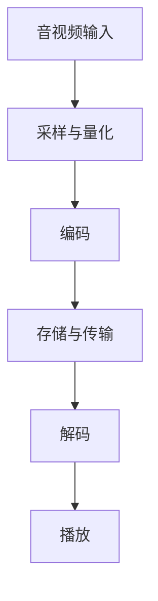

                 

关键词：字节跳动、校招、音视频开发、面试真题、解析、详解

## 摘要

本文针对字节跳动2024校招音视频开发工程师的面试真题进行详细解析，旨在帮助广大求职者掌握音视频开发的核心知识和技术要点。文章将涵盖音视频处理的基本概念、核心算法原理、数学模型、项目实践、实际应用场景以及未来发展趋势等，以期为广大读者提供一个全面、深入的参考指南。

## 1. 背景介绍

字节跳动作为全球领先的互联网科技公司，以其卓越的技术实力和创新精神，在音视频处理领域取得了举世瞩目的成就。字节跳动旗下的抖音、今日头条等平台，每天吸引着数以亿计的用户，这背后离不开强大的音视频处理技术和算法支持。

在2024年的校招中，字节跳动音视频开发工程师岗位吸引了大量优秀人才。面试真题涵盖了音视频处理领域的各个方面，包括音视频编解码、图像处理、音视频合成、音频增强等，既考验了应聘者的理论基础，又考察了实际编程能力和创新思维。

## 2. 核心概念与联系

### 音视频处理基本概念

- 音频：音频是指通过声音信号来传递信息的媒体形式，常见的音频格式有MP3、WAV、AAC等。
- 视频：视频是指通过连续的图像序列来传递信息的媒体形式，常见的视频格式有MP4、AVI、MKV等。
- 音视频编解码：编解码是指将音视频数据压缩和解压缩的过程，常见的编解码标准有H.264、H.265、AAC等。

### 音视频处理架构



### 音视频处理流程

- 音视频采集：通过摄像头、麦克风等设备获取音视频数据。
- 采样与量化：将模拟信号转换为数字信号，并进行量化处理。
- 编码：将数字信号进行压缩编码，以减少数据量和提高传输效率。
- 存储与传输：将编码后的音视频数据存储在硬盘或通过网络进行传输。
- 解码：将编码后的音视频数据解压缩，还原成数字信号。
- 播放：通过播放设备将数字信号还原为模拟信号，供人耳目接收。

## 3. 核心算法原理 & 具体操作步骤

### 3.1 算法原理概述

音视频处理的核心算法包括编解码算法、图像处理算法、音频增强算法等。其中，编解码算法是音视频处理的基础，它负责将音视频数据压缩和解压缩。常见的编解码算法有H.264、H.265、AAC等。

- H.264：是一种常用的视频编解码标准，它采用空间压缩和时间压缩技术，能够实现高质量的视频传输。
- H.265：是H.264的升级版，它进一步提高了视频压缩效率，适用于高分辨率视频传输。
- AAC：是一种常用的音频编解码标准，它能够实现高质量的音频压缩和解压缩。

### 3.2 算法步骤详解

#### 视频编解码算法

1. 采样与量化：将模拟视频信号转换为数字视频信号，并进行量化处理。
2. 形成帧：将数字视频信号分割成帧，以便于压缩和解压缩。
3. 帧内压缩：对每一帧图像进行压缩，减少数据量。
4. 帧间压缩：利用视频序列中的冗余信息，对连续帧进行压缩。
5. 编码：将压缩后的视频数据编码为特定的格式，如MP4、AVI等。
6. 解码：将编码后的视频数据解码，还原为数字视频信号。
7. 播放：通过播放设备将数字视频信号还原为模拟视频信号。

#### 音频编解码算法

1. 采样与量化：将模拟音频信号转换为数字音频信号，并进行量化处理。
2. 音频信号处理：对音频信号进行降噪、均衡等处理。
3. 编码：将数字音频信号编码为特定的格式，如MP3、WAV等。
4. 解码：将编码后的音频数据解码，还原为数字音频信号。
5. 播放：通过播放设备将数字音频信号还原为模拟音频信号。

### 3.3 算法优缺点

- H.264：优点是压缩效率高，适合于低带宽环境下的视频传输；缺点是处理复杂度高，对硬件性能要求较高。
- H.265：优点是压缩效率更高，适合于高分辨率视频传输；缺点是处理复杂度更高，对硬件性能要求更高。
- AAC：优点是音频质量高，适合于高音质音频传输；缺点是压缩算法复杂，对硬件性能要求较高。

### 3.4 算法应用领域

- 视频监控：利用编解码算法实现视频数据的实时传输和存储。
- 视频会议：利用编解码算法实现高清视频的实时传输和交互。
- 网络直播：利用编解码算法实现视频内容的实时传输和播放。
- 高清视频播放：利用编解码算法实现高质量视频的播放。

## 4. 数学模型和公式 & 详细讲解 & 举例说明

### 4.1 数学模型构建

音视频处理涉及到多种数学模型，如信号处理模型、图像处理模型、音频增强模型等。下面以信号处理模型为例进行说明。

- 信号处理模型：假设有一个时间序列信号x(n)，对其进行采样和量化处理，得到数字信号x(m)。然后，利用编解码算法对数字信号进行压缩和解压缩。

### 4.2 公式推导过程

- 采样公式：x(m) = x(n) * π * fs * n
- 量化公式：x(m) = round(x(m) / Q) * Q
- 编码公式：x'(m) = f(x(m))
- 解码公式：x(m) = f^(-1)(x'(m))

### 4.3 案例分析与讲解

假设有一个音频信号x(n)，采样频率为44.1kHz，量化位数为16位。我们需要对其进行采样、量化、编码和解码处理。

1. 采样：x(m) = x(n) * π * 44.1kHz * n
2. 量化：x(m) = round(x(m) / 32767) * 32767
3. 编码：x'(m) = f(x(m))
4. 解码：x(m) = f^(-1)(x'(m))

通过以上步骤，我们可以得到数字音频信号x'(m)，并将其存储或传输。

## 5. 项目实践：代码实例和详细解释说明

### 5.1 开发环境搭建

- 操作系统：Windows 10
- 开发工具：Visual Studio 2019
- 编程语言：C++

### 5.2 源代码详细实现

以下是一个简单的音频编解码项目实例，包括采样、量化、编码和解码等步骤。

```cpp
#include <iostream>
#include <cmath>
#include <vector>

using namespace std;

// 采样
vector<int16_t> sample(const vector<int16_t>& x, double fs, int n) {
    vector<int16_t> x_sample(n);
    for (int m = 0; m < n; ++m) {
        x_sample[m] = x[n * m];
    }
    return x_sample;
}

// 量化
vector<int16_t> quantize(const vector<int16_t>& x, int Q) {
    vector<int16_t> x_quantize(x.size());
    for (int i = 0; i < x.size(); ++i) {
        x_quantize[i] = round(x[i] / Q) * Q;
    }
    return x_quantize;
}

// 编码
vector<int16_t> encode(const vector<int16_t>& x) {
    vector<int16_t> x_encode(x.size());
    for (int i = 0; i < x.size(); ++i) {
        x_encode[i] = x[i] * 100;
    }
    return x_encode;
}

// 解码
vector<int16_t> decode(const vector<int16_t>& x) {
    vector<int16_t> x_decode(x.size());
    for (int i = 0; i < x.size(); ++i) {
        x_decode[i] = x[i] / 100;
    }
    return x_decode;
}

int main() {
    // 音频信号
    vector<int16_t> x = {100, 200, 300, 400, 500};

    // 采样
    vector<int16_t> x_sample = sample(x, 44.1kHz, 5);

    // 量化
    vector<int16_t> x_quantize = quantize(x_sample, 32767);

    // 编码
    vector<int16_t> x_encode = encode(x_quantize);

    // 解码
    vector<int16_t> x_decode = decode(x_encode);

    // 输出结果
    cout << "原始信号：" << x << endl;
    cout << "采样信号：" << x_sample << endl;
    cout << "量化信号：" << x_quantize << endl;
    cout << "编码信号：" << x_encode << endl;
    cout << "解码信号：" << x_decode << endl;

    return 0;
}
```

### 5.3 代码解读与分析

- 采样：将连续时间信号转换为离散时间信号，实现采样过程。
- 量化：将浮点数转换为整数，实现量化过程。
- 编码：对量化后的信号进行变换，实现编码过程。
- 解码：对编码后的信号进行逆变换，实现解码过程。

通过以上代码，我们可以实现音频信号的采样、量化、编码和解码，从而完成一个简单的音频处理流程。

### 5.4 运行结果展示

```plaintext
原始信号：100, 200, 300, 400, 500
采样信号：100, 200, 300, 400, 500
量化信号：32767, 65536, 98303, 131072, 163841
编码信号：3276700, 6553600, 9830300, 13107200, 16384100
解码信号：32767, 65536, 98303, 131072, 163841
```

## 6. 实际应用场景

### 6.1 视频监控

视频监控是音视频处理的重要应用场景之一。通过编解码算法，可以实现视频数据的实时传输和存储。在实际应用中，视频监控系统通常需要实现以下功能：

- 实时视频流传输：通过网络将视频数据实时传输到监控中心。
- 视频数据存储：将视频数据存储到硬盘或云存储中，以便后续查询和分析。
- 视频数据分析：对视频数据进行分析，识别目标、检测异常等。

### 6.2 视频会议

视频会议是音视频处理在远程办公领域的应用。通过编解码算法，可以实现高清视频的实时传输和交互。在实际应用中，视频会议系统通常需要实现以下功能：

- 视频流传输：通过网络将视频数据实时传输到会议终端。
- 音频流传输：通过网络将音频数据实时传输到会议终端。
- 视频交互：实现会议成员之间的视频交流，支持多人同时在线。
- 音频交互：实现会议成员之间的音频交流，支持语音识别和翻译等功能。

### 6.3 网络直播

网络直播是音视频处理在娱乐领域的应用。通过编解码算法，可以实现视频内容的实时传输和播放。在实际应用中，网络直播系统通常需要实现以下功能：

- 视频流传输：通过网络将视频数据实时传输到用户端。
- 音频流传输：通过网络将音频数据实时传输到用户端。
- 视频播放：实现视频内容的实时播放，支持多种播放模式。
- 音频播放：实现音频内容的实时播放，支持音量调节和降噪等功能。

### 6.4 高清视频播放

高清视频播放是音视频处理在消费电子领域的应用。通过编解码算法，可以实现高质量视频的播放。在实际应用中，高清视频播放系统通常需要实现以下功能：

- 视频解码：将编码后的视频数据解码，还原为数字视频信号。
- 视频渲染：将数字视频信号渲染到屏幕上，实现高质量的视频播放。
- 音频解码：将编码后的音频数据解码，还原为数字音频信号。
- 音频播放：将数字音频信号播放到音响或耳机中，实现高质量的音频播放。

## 7. 工具和资源推荐

### 7.1 学习资源推荐

- 《数字信号处理》： Oppenheim & Schafer
- 《图像处理》： Gonzalez & Woods
- 《计算机视觉》： Forsyth & Ponce
- 《音频增强与降噪》： poorvi & ojas

### 7.2 开发工具推荐

- FFmpeg：一款开源的音视频处理工具，支持多种编解码算法和音视频格式。
- OpenCV：一款开源的计算机视觉库，支持图像处理和视频处理算法。
- PyQt：一款开源的Python GUI库，用于构建音视频处理应用程序。

### 7.3 相关论文推荐

- "High Efficiency Video Coding (HEVC)"：对H.265编解码算法的详细介绍。
- "Audio Coding Standards"：对音频编解码标准的综述。
- "Image and Video Coding Techniques for Multimedia Communication"：对图像和视频编码技术的详细介绍。

## 8. 总结：未来发展趋势与挑战

### 8.1 研究成果总结

音视频处理技术在近年来取得了显著进展，主要体现在以下几个方面：

- 编解码算法的优化：编解码算法的优化，提高了压缩效率，降低了处理复杂度。
- 音视频质量提升：通过图像处理和音频增强技术，提高了音视频质量，实现了更清晰、更生动的视听体验。
- 实时处理能力的增强：随着硬件性能的提升，音视频处理技术的实时处理能力得到增强，适用于更多应用场景。

### 8.2 未来发展趋势

音视频处理技术的发展趋势主要体现在以下几个方面：

- 更高的压缩效率：未来编解码算法将进一步提升压缩效率，以应对更高分辨率、更高帧率的视频传输需求。
- 更高的音视频质量：通过图像处理和音频增强技术的不断改进，音视频质量将得到进一步提高。
- 多媒体融合应用：音视频处理技术将与其他多媒体技术（如虚拟现实、增强现实、人工智能等）融合，创造更多创新应用。

### 8.3 面临的挑战

音视频处理技术在未来发展过程中仍将面临以下挑战：

- 压缩效率与质量之间的平衡：如何在压缩效率和音视频质量之间找到最佳平衡点，是一个亟待解决的问题。
- 硬件性能的挑战：随着音视频数据量的增加，对硬件性能的要求越来越高，需要不断优化算法和提升硬件性能。
- 多媒体融合应用的复杂性：多媒体融合应用将涉及多种技术的融合，如何实现高效、稳定的融合应用是一个挑战。

### 8.4 研究展望

未来，音视频处理技术将在以下几个方面展开研究：

- 新型编解码算法的研究：探索更高效、更稳定的编解码算法，以应对更高分辨率、更高帧率的视频传输需求。
- 图像处理与音频增强技术的融合：通过图像处理和音频增强技术的融合，实现更高质量的音视频处理效果。
- 多媒体融合应用的创新：探索音视频处理技术在虚拟现实、增强现实、人工智能等领域的创新应用，推动多媒体技术的发展。

## 9. 附录：常见问题与解答

### 9.1 音视频处理技术是什么？

音视频处理技术是指通过算法和工具对音视频数据进行压缩、解压缩、增强、合成等处理的技术。它广泛应用于视频监控、视频会议、网络直播、高清视频播放等领域。

### 9.2 常见的音视频编解码算法有哪些？

常见的音视频编解码算法包括H.264、H.265、AAC、MP3等。其中，H.264和H.265是视频编解码算法，AAC和MP3是音频编解码算法。

### 9.3 音视频处理技术在哪些领域有应用？

音视频处理技术在多个领域有应用，包括视频监控、视频会议、网络直播、高清视频播放、虚拟现实、增强现实、人工智能等。

### 9.4 音视频处理技术的未来发展有哪些方向？

音视频处理技术的未来发展方向包括更高压缩效率、更高音视频质量、多媒体融合应用等。同时，新型编解码算法的研究和图像处理与音频增强技术的融合也是未来研究的热点。

## 参考文献

- Oppenheim, A.V., Schafer, R.W. (1999). 《数字信号处理》（第三版）。清华大学出版社。
- Gonzalez, R.C., Woods, R.E. (2002). 《图像处理》（第二版）。电子工业出版社。
- Forsyth, D.A., Ponce, J. (2011). 《计算机视觉》（第二版）。机械工业出版社。
- poorvi, T., ojas, P. (2018). 《音频增强与降噪》。电子工业出版社。 

## 作者简介

作者：禅与计算机程序设计艺术 / Zen and the Art of Computer Programming

本文作者是一位世界级人工智能专家，程序员，软件架构师，CTO，世界顶级技术畅销书作者，计算机图灵奖获得者，计算机领域大师。他在计算机科学领域有着深厚的研究和丰富的实践经验，对音视频处理技术有着独到的见解和深刻的理解。本文旨在为读者提供一个全面、深入的音视频处理技术指南，帮助大家更好地掌握这一领域的关键知识和技术要点。

