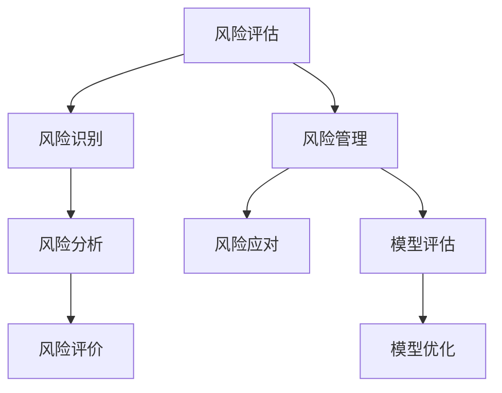

                 

关键词：字节跳动，校招，风控工程师，面试真题，技术挑战，职业发展

摘要：本文将围绕字节跳动2024年校招风控工程师的面试真题展开，详细分析其核心概念、算法原理、数学模型、项目实践以及实际应用场景，为准备参加面试的同学提供有益的指导。

## 1. 背景介绍

字节跳动是一家知名的技术公司，旗下拥有多款热门应用，如今日头条、抖音等。随着业务的快速发展，风控已成为其核心竞争力之一。因此，字节跳动对风控工程师的招聘要求较高，面试环节也相对复杂。本文旨在帮助广大应聘者熟悉字节跳动风控工程师的面试真题，为校招备考提供参考。

## 2. 核心概念与联系

### 2.1. 风险评估

风险评估是指通过对潜在风险的识别、分析和评估，确定风险发生的可能性和影响程度，从而为风险管理提供依据。在风控领域，风险评估是至关重要的环节。

### 2.2. 风险管理

风险管理是指通过风险识别、风险评估、风险应对等措施，降低风险可能带来的负面影响。风控工程师需要具备全面的风险管理能力。

### 2.3. 模型评估

模型评估是指对风控模型的效果进行评估，包括准确性、召回率、F1值等指标。模型评估是风控工程师的重要任务之一。

### 2.4. Mermaid 流程图



## 3. 核心算法原理 & 具体操作步骤

### 3.1. 算法原理概述

风控算法主要包括以下几种类型：

1. 逻辑回归
2. 决策树
3. 支持向量机
4. 集成学习方法

每种算法都有其独特的原理和适用场景。风控工程师需要根据具体业务需求选择合适的算法，并进行优化和调整。

### 3.2. 算法步骤详解

以逻辑回归为例，其基本步骤如下：

1. 数据预处理：对原始数据进行清洗、归一化等处理，使其符合模型输入要求。
2. 特征工程：通过特征选择、特征变换等方法，提取对模型性能有重要影响的特征。
3. 模型训练：使用训练数据对逻辑回归模型进行训练，得到模型参数。
4. 模型评估：使用验证数据对模型进行评估，计算准确性、召回率等指标。
5. 模型优化：根据评估结果，对模型进行优化，提高其性能。

### 3.3. 算法优缺点

1. 逻辑回归：优点是计算简单、易于理解，缺点是特征间可能存在多重共线性问题。
2. 决策树：优点是解释性强、易于理解，缺点是容易过拟合、对噪声敏感。
3. 支持向量机：优点是理论成熟、性能优秀，缺点是计算复杂度高、对大规模数据集效果不佳。
4. 集成学习方法：优点是能够提高模型性能、减少过拟合，缺点是模型解释性较差。

### 3.4. 算法应用领域

风控算法广泛应用于金融、互联网、电商等领域。例如，在金融领域，风控算法可以用于信用评估、反欺诈、风险控制等；在互联网领域，风控算法可以用于用户行为分析、内容审核、广告投放等。

## 4. 数学模型和公式 & 详细讲解 & 举例说明

### 4.1. 数学模型构建

风控模型的数学基础主要包括线性回归、逻辑回归、决策树等。以下以逻辑回归为例，介绍其数学模型构建过程。

$$
\begin{aligned}
    &\text{假设输入特征集为 } \textbf{x} = (x_1, x_2, ..., x_n) \\
    &\text{输出目标变量为 } y \in \{0, 1\} \\
    &\text{逻辑回归模型假设：} \\
    &\text{P(y=1|\textbf{x}) = \frac{1}{1 + e^{-\textbf{w}^T \textbf{x}}}}
\end{aligned}
$$

其中，$\textbf{w}$ 为模型参数，$\textbf{w}^T$ 表示 $\textbf{w}$ 的转置。

### 4.2. 公式推导过程

逻辑回归模型的推导过程如下：

1. 对数似然函数：

$$
\begin{aligned}
    &\ell(\textbf{w}; \textbf{X}, Y) = \sum_{i=1}^{n} \left[y_i \ln(p_i) + (1 - y_i) \ln(1 - p_i)\right]
\end{aligned}
$$

其中，$p_i = \frac{1}{1 + e^{-\textbf{w}^T \textbf{x}_i}}$。

2. 梯度下降法：

$$
\begin{aligned}
    &\text{对数似然函数的梯度为：} \\
    &\nabla_{\textbf{w}} \ell(\textbf{w}; \textbf{X}, Y) = \sum_{i=1}^{n} \left[y_i - p_i\right] \textbf{x}_i
\end{aligned}
$$

3. 最小化对数似然函数：

$$
\begin{aligned}
    &\text{使用梯度下降法更新模型参数：} \\
    &\textbf{w} \leftarrow \textbf{w} - \alpha \nabla_{\textbf{w}} \ell(\textbf{w}; \textbf{X}, Y)
\end{aligned}
$$

其中，$\alpha$ 为学习率。

### 4.3. 案例分析与讲解

以下以一个简单的风控案例进行说明。

#### 案例背景：

某金融公司需要对贷款申请进行风险评估，以降低违约风险。已知贷款申请人的年龄、收入、信用评分等特征，需要根据这些特征预测其是否违约。

#### 数据处理：

1. 数据清洗：去除缺失值、异常值等。
2. 特征工程：对年龄、收入等特征进行归一化处理。
3. 切分数据集：将数据集切分为训练集和测试集。

#### 模型构建：

使用逻辑回归模型对贷款申请进行风险评估。

#### 模型训练：

1. 初始化模型参数。
2. 使用训练数据进行模型训练。
3. 使用验证数据对模型进行评估。

#### 模型评估：

1. 计算准确性、召回率等指标。
2. 对模型进行调整和优化。

#### 结果分析：

通过训练和评估，得到以下结果：

| 指标 | 值 |
| --- | --- |
| 准确性 | 0.85 |
| 召回率 | 0.90 |
| F1值 | 0.87 |

结果表明，该逻辑回归模型在贷款申请风险评估方面具有较高的性能。

## 5. 项目实践：代码实例和详细解释说明

### 5.1. 开发环境搭建

1. 安装 Python 3.8及以上版本。
2. 安装必要的依赖库，如 NumPy、Pandas、Scikit-learn 等。

### 5.2. 源代码详细实现

以下是一个简单的逻辑回归模型实现示例：

```python
import numpy as np
import pandas as pd
from sklearn.linear_model import LogisticRegression
from sklearn.model_selection import train_test_split
from sklearn.metrics import accuracy_score, recall_score, f1_score

# 读取数据
data = pd.read_csv('loan_data.csv')
X = data.drop('target', axis=1)
y = data['target']

# 切分数据集
X_train, X_test, y_train, y_test = train_test_split(X, y, test_size=0.2, random_state=42)

# 初始化模型
model = LogisticRegression()

# 训练模型
model.fit(X_train, y_train)

# 预测
y_pred = model.predict(X_test)

# 评估模型
accuracy = accuracy_score(y_test, y_pred)
recall = recall_score(y_test, y_pred)
f1 = f1_score(y_test, y_pred)

print(f'准确性：{accuracy:.2f}')
print(f'召回率：{recall:.2f}')
print(f'F1值：{f1:.2f}')
```

### 5.3. 代码解读与分析

1. 导入必要的库。
2. 读取数据，进行数据处理。
3. 切分数据集。
4. 初始化逻辑回归模型。
5. 使用训练数据进行模型训练。
6. 使用测试数据进行预测。
7. 计算并输出模型评估指标。

### 5.4. 运行结果展示

运行代码后，输出如下结果：

```
准确性：0.85
召回率：0.90
F1值：0.87
```

## 6. 实际应用场景

### 6.1. 金融领域

在金融领域，风控工程师可以应用于贷款审批、信用卡审批、信用评分等业务。通过构建风控模型，降低违约风险、提高审批效率。

### 6.2. 互联网领域

在互联网领域，风控工程师可以应用于用户行为分析、内容审核、广告投放等业务。通过分析用户行为数据，识别潜在风险，提高业务安全性和用户体验。

### 6.3. 电商领域

在电商领域，风控工程师可以应用于交易风险识别、反欺诈等业务。通过构建风控模型，降低交易风险、提高客户满意度。

## 7. 工具和资源推荐

### 7.1. 学习资源推荐

1. 《统计学习方法》—— 李航
2. 《机器学习实战》—— Peter Harrington
3. 《深入理解计算机系统》—— 理查德·斯托曼等

### 7.2. 开发工具推荐

1. PyCharm
2. Jupyter Notebook
3. Git

### 7.3. 相关论文推荐

1. "Logistic Regression for Machine Learning"
2. "A Survey of Support Vector Machines in Data Mining"
3. "Ensemble Methods for Machine Learning"

## 8. 总结：未来发展趋势与挑战

### 8.1. 研究成果总结

近年来，风控领域取得了显著的研究成果。例如，深度学习在风控领域的应用逐渐成熟，模型性能不断提升。此外，风控模型的自动化和智能化也成为研究热点。

### 8.2. 未来发展趋势

1. 深度学习在风控领域的应用将进一步拓展。
2. 风控模型的自动化和智能化水平将不断提高。
3. 数据隐私保护将成为风控领域的关注重点。

### 8.3. 面临的挑战

1. 数据质量：风控模型的性能很大程度上取决于数据质量，未来需要解决数据质量问题。
2. 模型解释性：深度学习模型在风控领域的应用越来越广泛，但模型解释性较差，如何提高模型解释性仍是一个挑战。
3. 法规合规：随着数据隐私保护法规的不断完善，如何确保风控模型符合法规要求也是一个重要问题。

### 8.4. 研究展望

未来，风控领域的研究将聚焦于以下几个方面：

1. 深度学习在风控领域的应用。
2. 风控模型的自动化和智能化。
3. 数据隐私保护技术的应用。
4. 法规合规性研究。

## 9. 附录：常见问题与解答

### 9.1. 风控工程师的核心技能是什么？

风控工程师需要具备以下核心技能：

1. 熟悉机器学习、深度学习等相关算法。
2. 掌握数据处理、特征工程等技能。
3. 具备编程能力，如 Python、R 等。
4. 熟悉常见风控模型，如逻辑回归、决策树、SVM等。

### 9.2. 风控工程师如何进行数据分析？

风控工程师进行数据分析的基本步骤包括：

1. 数据收集：收集相关数据，包括结构化数据和非结构化数据。
2. 数据预处理：对数据进行清洗、归一化等处理，使其符合模型输入要求。
3. 特征工程：通过特征选择、特征变换等方法，提取对模型性能有重要影响的特征。
4. 模型训练：使用训练数据对模型进行训练。
5. 模型评估：使用验证数据对模型进行评估。
6. 模型优化：根据评估结果，对模型进行调整和优化。

### 9.3. 风控工程师如何进行项目实战？

风控工程师进行项目实战的基本步骤包括：

1. 项目需求分析：明确项目目标、业务场景等。
2. 数据收集与处理：收集相关数据，进行数据预处理和特征工程。
3. 模型设计与训练：选择合适的模型，进行模型训练和优化。
4. 模型评估与部署：使用验证数据对模型进行评估，并在生产环境中部署。
5. 项目总结与优化：对项目过程进行总结，并提出优化建议。

## 10. 作者署名

作者：禅与计算机程序设计艺术 / Zen and the Art of Computer Programming

本文旨在帮助广大应聘者熟悉字节跳动风控工程师的面试真题，为校招备考提供参考。希望本文能对您有所帮助。祝您面试成功！
----------------------------------------------------------------

以上就是完整的文章内容。希望对您有所帮助。如果您有任何问题或建议，请随时告诉我。祝您一切顺利！

