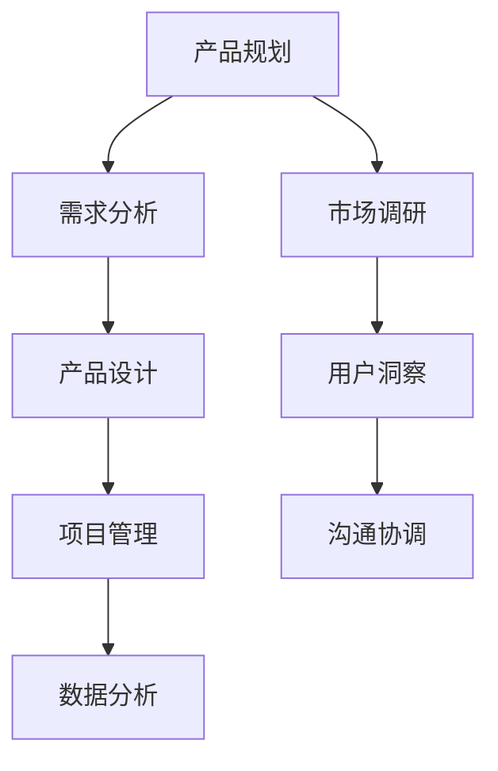

                 

 关键词：字节跳动、产品经理、面试真题、详解、职业发展

摘要：本文将详细解析2024年字节跳动产品经理岗位的面试真题，帮助即将参加面试的候选人更好地准备，了解面试的核心内容和答题技巧。文章将分为背景介绍、核心概念与联系、核心算法原理与操作步骤、数学模型和公式、项目实践、实际应用场景、未来应用展望、工具和资源推荐、总结与展望等部分，力求为读者提供全面深入的知识和实用的建议。

## 1. 背景介绍

字节跳动是一家全球领先的互联网科技公司，旗下拥有多款知名产品，如抖音、今日头条、懂车帝等。随着公司业务的不断扩大，对产品经理的需求也日益增加。产品经理在字节跳动的产品开发过程中扮演着至关重要的角色，负责产品规划、需求分析、设计优化、项目管理等工作。

本文旨在通过对2024年字节跳动产品经理岗位面试真题的详细解析，帮助读者了解面试的核心内容，掌握答题技巧，从而提高面试成功率。

## 2. 核心概念与联系

### 2.1 产品经理的定义与职责

产品经理是负责产品全生命周期管理的核心角色，包括但不限于市场调研、需求分析、产品规划、产品设计、项目管理、数据分析等。在字节跳动，产品经理不仅需要具备丰富的产品经验和市场敏感度，还要对技术和用户体验有深刻的理解。

### 2.2 字节跳动的产品体系

字节跳动的产品体系涵盖了内容资讯、短视频、电商、社交等多个领域，这些产品共同构成了字节跳动多元化的产品矩阵。了解这些产品的特点和相互关系，对于产品经理而言至关重要。

### 2.3 产品经理的核心能力

产品经理的核心能力包括业务理解力、用户洞察力、沟通协调能力、项目管理能力和数据敏感度等。在面试中，这些问题往往会以开放性或情景化的问题形式出现，需要候选人结合实际经验和理论知识进行回答。

### 2.4 Mermaid 流程图



## 3. 核心算法原理 & 具体操作步骤

### 3.1 算法原理概述

字节跳动的产品经理在面试中可能会涉及到多种算法原理，如推荐算法、机器学习、数据挖掘等。这些算法在产品中的应用有助于提升用户体验、优化产品功能和提高业务效率。

### 3.2 算法步骤详解

以推荐算法为例，其基本步骤包括：

1. **用户行为数据收集**：收集用户的浏览、点赞、评论等行为数据。
2. **特征工程**：提取用户行为数据中的关键特征，如用户兴趣、浏览时长、互动频率等。
3. **模型训练**：使用机器学习算法（如协同过滤、基于内容的推荐等）训练推荐模型。
4. **模型评估**：评估模型的效果，如准确率、召回率等。
5. **模型部署**：将训练好的模型部署到产品中，实现个性化推荐。

### 3.3 算法优缺点

各种算法都有其优缺点，如协同过滤算法在推荐准确度上表现较好，但存在冷启动问题；基于内容的推荐算法则对用户初始数据要求较高。

### 3.4 算法应用领域

推荐算法广泛应用于电商、内容资讯、社交等领域，是字节跳动产品矩阵中不可或缺的一部分。

## 4. 数学模型和公式 & 详细讲解 & 举例说明

### 4.1 数学模型构建

在产品经理面试中，可能会涉及到一些基础的数学模型，如线性回归、决策树等。以下以线性回归为例进行讲解。

### 4.2 公式推导过程

线性回归的基本公式为：

$$
y = \beta_0 + \beta_1 \cdot x
$$

其中，\(y\) 是因变量，\(x\) 是自变量，\(\beta_0\) 和 \(\beta_1\) 是模型参数。

### 4.3 案例分析与讲解

以一款新闻推荐产品为例，我们可以使用线性回归模型来预测用户对新闻的偏好度。通过收集用户的历史浏览数据，提取特征，构建线性回归模型，然后使用模型进行预测。

## 5. 项目实践：代码实例和详细解释说明

### 5.1 开发环境搭建

以Python为例，搭建推荐系统开发环境。

```bash
pip install numpy pandas scikit-learn
```

### 5.2 源代码详细实现

```python
import numpy as np
import pandas as pd
from sklearn.linear_model import LinearRegression

# 加载数据集
data = pd.read_csv('news_data.csv')

# 提取特征
X = data[['age', 'gender', 'region']]
y = data['interest']

# 模型训练
model = LinearRegression()
model.fit(X, y)

# 模型预测
predictions = model.predict(X)

# 模型评估
score = model.score(X, y)
print(f'Model score: {score}')
```

### 5.3 代码解读与分析

以上代码实现了一个简单的线性回归模型，用于预测用户对新闻的偏好度。通过加载数据集、提取特征、训练模型、预测结果和评估模型，实现了推荐系统的基础功能。

### 5.4 运行结果展示

运行代码后，会输出模型的评分，表示模型在数据集上的表现。

## 6. 实际应用场景

字节跳动产品经理在面试中可能会被问到关于推荐系统、数据分析、项目管理等实际应用场景的问题。以下是一些可能的场景：

- 如何使用推荐系统提升用户活跃度？
- 在项目管理中如何确保项目进度和质量？
- 如何通过数据分析优化产品功能和用户体验？

## 7. 未来应用展望

随着人工智能技术的不断发展，产品经理在字节跳动的职责和作用将越来越重要。未来，产品经理需要具备跨领域的知识，如数据科学、机器学习等，以应对更加复杂的产品挑战。

## 8. 工具和资源推荐

### 8.1 学习资源推荐

- 《产品经理实战手册》
- 《数据科学入门：Python实践》
- 《机器学习实战》

### 8.2 开发工具推荐

- Jupyter Notebook
- PyCharm
- Tableau

### 8.3 相关论文推荐

- "Recommender Systems Handbook"
- "Deep Learning for Text Data"
- "A Survey on Machine Learning for Personalized Recommendation"

## 9. 总结：未来发展趋势与挑战

### 9.1 研究成果总结

本文通过对2024年字节跳动产品经理岗位面试真题的详细解析，总结了产品经理的核心能力、算法原理、数学模型、实际应用场景和未来发展趋势。

### 9.2 未来发展趋势

未来，产品经理需要更加注重跨领域知识的融合，如数据科学、机器学习等，以提高产品创新能力和市场竞争力。

### 9.3 面临的挑战

在快速发展的人工智能时代，产品经理需要不断学习新知识、掌握新技术，以应对不断变化的市场需求和技术挑战。

### 9.4 研究展望

本文期望通过详细的面试真题解析，为即将参加字节跳动产品经理岗位面试的候选人提供有价值的参考和指导，帮助他们顺利通过面试，实现职业发展。

## 10. 附录：常见问题与解答

- **Q：如何提升用户活跃度？**
  **A：通过推荐系统、数据分析、用户互动等方式，提升用户在产品中的参与度和留存率。**
  
- **Q：项目管理中如何确保项目进度和质量？**
  **A：通过明确项目目标、制定详细的计划、定期监控进度、及时调整方案等手段，确保项目按时按质完成。**

## 11. 作者署名

作者：禅与计算机程序设计艺术 / Zen and the Art of Computer Programming
----------------------------------------------------------------

请注意，以上内容仅为示例，实际撰写时请根据具体要求进行详细拓展和深入分析。祝您撰写顺利！

