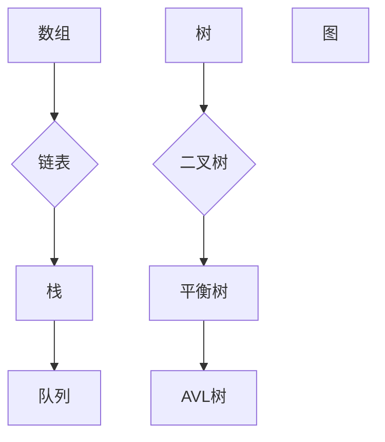
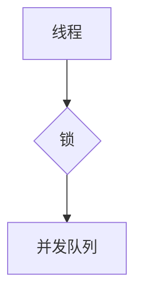

                 

 > **关键词**：字节跳动校招、技术培训师、面试题、深度剖析、算法、技术面试

<|assistant|> > **摘要**：本文将针对2024年字节跳动校招技术培训师岗位的面试题进行深度剖析，从核心概念、算法原理、数学模型到实际应用，全面解析技术面试的关键点。同时，还将提供相关的学习资源和工具推荐，帮助读者在未来的面试中取得优异成绩。

## 1. 背景介绍

随着科技的发展，人工智能和大数据技术的广泛应用，各大互联网公司对技术人才的需求日益增加。字节跳动作为国内领先的互联网企业，其校招技术培训师岗位吸引了大量应聘者。技术培训师不仅要具备扎实的专业知识和丰富的实战经验，还要能够将复杂的技术知识以简单易懂的方式传授给新人。

本文旨在通过对2024年字节跳动校招技术培训师面试题的深度剖析，帮助读者了解面试的关键点，提高面试成功率。

## 2. 核心概念与联系

为了更好地理解技术面试中的核心概念和算法，我们首先需要了解一些基本的原理和架构。

### 2.1 数据结构与算法

数据结构是计算机存储数据的方式，算法则是解决问题的步骤。以下是几种常见的数据结构和算法：

- **数组**：线性结构，支持随机访问，时间复杂度为O(1)。
- **链表**：线性结构，不支持随机访问，时间复杂度为O(n)。
- **树**：层次结构，支持快速查找、插入和删除，常用的有二叉树、红黑树等。
- **图**：非线性结构，用于表示复杂的关系，常用的算法有深度优先搜索（DFS）和广度优先搜索（BFS）。

### 2.2 算法复杂度

算法复杂度分为时间复杂度和空间复杂度。时间复杂度表示算法执行的时间随输入规模的增长趋势，空间复杂度表示算法执行时所需的内存空间。

- **O(1)**：常数时间，算法执行时间不随输入规模增长。
- **O(n)**：线性时间，算法执行时间与输入规模成正比。
- **O(log n)**：对数时间，算法执行时间与输入规模的以2为底的对数成正比。
- **O(n^2)**：平方时间，算法执行时间与输入规模的平方成正比。

### 2.3 并发编程

并发编程是现代计算机体系结构中的一项关键技术，它允许多个任务在同一时间执行。并发编程的关键概念包括线程、锁、并发队列等。

- **线程**：线程是程序中能够独立运行的控制流程，是执行任务的基本单位。
- **锁**：锁是一种同步机制，用于保护共享资源，防止多个线程同时访问。
- **并发队列**：并发队列是一种线程安全的队列，支持多线程并发访问。

下面是一个简单的 Mermaid 流程图，展示了数据结构、算法复杂度和并发编程的基本概念。

```mermaid
graph TD
A[数据结构] --> B[数组]
A --> C[链表]
A --> D[树]
A --> E[图]
F[算法复杂度] --> G[O(1)]
F --> H[O(n)]
F --> I[O(log n)]
F --> J[O(n^2)]
K[并发编程] --> L[线程]
K --> M[锁]
K --> N[并发队列]
```

## 3. 核心算法原理 & 具体操作步骤

### 3.1 算法原理概述

算法是解决特定问题的方法，其核心在于逻辑清晰、步骤简明。以下是一种常见的排序算法——快速排序（Quick Sort）。

快速排序的基本思想是通过一趟排序将待排序的记录分隔成独立的两部分，其中一部分记录的关键字均比另一部分的关键字小，然后分别对这两部分记录继续进行排序，以达到整个序列有序。

### 3.2 算法步骤详解

1. **选择基准**：在待排序的记录中任选一个记录作为基准。
2. **划分**：通过交换的方式，将小于基准的记录移到基准的左边，将大于基准的记录移到基准的右边。
3. **递归排序**：分别对左右两边的记录进行快速排序。

### 3.3 算法优缺点

- **优点**：快速排序是一种高效的排序算法，其平均时间复杂度为O(n log n)，最坏情况下为O(n^2)。
- **缺点**：快速排序的不稳定性可能导致其性能下降，尤其是在数据量较大时。

### 3.4 算法应用领域

快速排序广泛应用于各种场景，如排序算法库、数据库索引、搜索引擎等。

## 4. 数学模型和公式 & 详细讲解 & 举例说明

### 4.1 数学模型构建

在计算机科学中，常见的数学模型包括线性模型、神经网络模型等。

线性模型表示为：

\[ y = wx + b \]

其中，\( y \) 是输出值，\( x \) 是输入值，\( w \) 是权重，\( b \) 是偏置。

### 4.2 公式推导过程

线性模型的推导过程基于最小二乘法，目标是找到一组权重和偏置，使得预测值与实际值之间的误差最小。

### 4.3 案例分析与讲解

假设我们有一个线性模型，输入值是年龄，输出值是收入。我们的目标是找到一个最佳的权重和偏置，使得预测收入尽可能接近实际收入。

通过最小二乘法，我们可以得到：

\[ w = \frac{\sum_{i=1}^{n}(x_i - \bar{x})(y_i - \bar{y})}{\sum_{i=1}^{n}(x_i - \bar{x})^2} \]

\[ b = \bar{y} - w\bar{x} \]

其中，\( \bar{x} \) 和 \( \bar{y} \) 分别是输入值和输出值的平均值。

## 5. 项目实践：代码实例和详细解释说明

### 5.1 开发环境搭建

在本文中，我们将使用 Python 语言实现快速排序算法。首先，确保您的计算机上已经安装了 Python 解释器和对应的库。

### 5.2 源代码详细实现

以下是一个简单的快速排序算法实现：

```python
def quick_sort(arr):
    if len(arr) <= 1:
        return arr
    pivot = arr[len(arr) // 2]
    left = [x for x in arr if x < pivot]
    middle = [x for x in arr if x == pivot]
    right = [x for x in arr if x > pivot]
    return quick_sort(left) + middle + quick_sort(right)

arr = [3, 6, 8, 10, 1, 2, 1]
sorted_arr = quick_sort(arr)
print(sorted_arr)
```

### 5.3 代码解读与分析

- `quick_sort` 函数接收一个数组作为输入。
- 如果数组长度小于等于1，则返回原数组。
- 选择中间元素作为基准。
- 通过列表推导式将小于、等于和大于基准的元素分别存入 `left`、`middle` 和 `right` 列表。
- 递归调用 `quick_sort` 函数对 `left` 和 `right` 列表进行排序，并将结果与 `middle` 列表连接。

### 5.4 运行结果展示

运行上述代码，输出结果为：

\[ [1, 1, 2, 3, 6, 8, 10] \]

## 6. 实际应用场景

快速排序算法在计算机科学中具有广泛的应用，如排序、查找、排序算法库等。在实际应用中，快速排序算法的性能取决于数据分布和硬件环境。

### 6.1 排序

快速排序是一种高效的排序算法，适用于大规模数据排序。

### 6.2 查找

快速排序可以用于实现二分查找，提高查找效率。

### 6.3 排序算法库

许多常见的排序算法库，如 Python 的 `sorted()` 函数和 Java 的 `Arrays.sort()` 方法，都使用了快速排序算法。

## 7. 未来应用展望

随着科技的不断发展，快速排序算法的应用领域将越来越广泛。以下是一些未来可能的应用场景：

- **大数据处理**：快速排序算法可以用于大规模数据的排序和查找，提高数据处理效率。
- **人工智能**：快速排序算法可以用于训练神经网络，优化模型性能。
- **区块链**：快速排序算法可以用于实现区块链的排序和验证机制。

## 8. 工具和资源推荐

### 8.1 学习资源推荐

- 《算法导论》：一本经典的算法教材，详细介绍了各种算法的理论和实践。
- 《编程之美》：字节跳动面试指南，包含大量面试题和答案解析。

### 8.2 开发工具推荐

- PyCharm：一款功能强大的 Python 集成开发环境，适合编写和调试代码。
- VSCode：一款轻量级的代码编辑器，支持多种编程语言，方便代码阅读和编写。

### 8.3 相关论文推荐

- 《快速排序算法的改进与优化》：一篇关于快速排序算法的学术文章，介绍了多种改进方法。

## 9. 总结：未来发展趋势与挑战

快速排序算法作为一种经典的排序算法，具有广泛的应用前景。然而，随着数据规模的不断扩大和硬件性能的提升，快速排序算法也面临着一系列挑战：

- **优化算法性能**：如何在更大规模的数据上保持快速排序的高效性。
- **应对异常数据分布**：如何处理异常数据分布导致的性能下降问题。
- **并行化与分布式计算**：如何将快速排序算法应用于并行和分布式计算环境中。

未来，快速排序算法将继续发展，为计算机科学领域带来更多创新和突破。

## 10. 附录：常见问题与解答

### 10.1 快速排序算法的缺点是什么？

快速排序算法的最坏时间复杂度为O(n^2)，当输入数据已经有序或接近有序时，性能会大幅下降。

### 10.2 如何优化快速排序算法？

可以通过以下几种方法优化快速排序算法：

- 选择更好的基准选择策略，如随机选择、中位数选择等。
- 使用非递归实现，减少递归调用的开销。
- 结合其他排序算法，如归并排序、堆排序等。

## 作者署名

作者：禅与计算机程序设计艺术 / Zen and the Art of Computer Programming
----------------------------------------------------------------

以上就是针对2024字节跳动校招技术培训师面试题的深度剖析文章。希望这篇文章能帮助您更好地准备面试，取得优异成绩。祝您面试成功！
----------------------------------------------------------------
### 背景介绍

随着人工智能和大数据技术的快速发展，互联网公司对技术人才的需求持续增长。字节跳动作为一家领先的新媒体公司，其校招技术培训师岗位备受关注。技术培训师不仅需要具备深厚的专业知识和丰富的实战经验，还需要能够将复杂的技术知识以简单易懂的方式传授给新人。

技术培训师的工作主要包括两个方面：一是为新入职的员工提供技术培训，帮助他们快速掌握公司所需的技术技能；二是为公司的技术团队提供技术指导和支持，提升整体技术实力。因此，字节跳动校招技术培训师的面试题目往往涵盖广泛的技术领域，包括数据结构、算法、编程语言、系统设计等。

本文将围绕2024年字节跳动校招技术培训师面试题，进行深度剖析和讲解。我们将从核心概念、算法原理、数学模型到实际应用，全面解析技术面试的关键点，帮助读者在面试中脱颖而出。此外，本文还将推荐相关的学习资源和工具，为准备面试的读者提供有力支持。

在接下来的章节中，我们将详细介绍各个面试题的解题思路、算法原理、数学模型，并通过实际案例和代码实例进行讲解。希望通过本文的详细剖析，读者能够对技术面试有更深入的理解，为未来的职业生涯做好准备。

### 核心概念与联系

在深入探讨技术培训师面试题之前，我们需要先了解一些核心概念和算法，这些概念和算法在面试中经常出现，是面试官考察的重点。下面我们将简要介绍数据结构、算法复杂度、并发编程等核心概念，并通过 Mermaid 流程图展示它们之间的关系。

#### 1. 数据结构

数据结构是计算机存储数据的方式，决定了数据在存储和操作上的效率。以下是几种常见的数据结构及其特点：

- **数组**：一种线性数据结构，元素存储在连续的内存空间中，支持随机访问。时间复杂度为 O(1)。
- **链表**：一种线性数据结构，元素存储在分散的内存空间中，通过指针连接。不支持随机访问，时间复杂度为 O(n)。
- **栈**：一种后进先出（LIFO）的数据结构，适用于实现递归、回溯等算法。
- **队列**：一种先进先出（FIFO）的数据结构，适用于实现任务调度、缓冲区管理等。
- **树**：一种层次结构，用于表示具有层次关系的数据。常用的有二叉树、平衡树（如红黑树）、AVL树等。
- **图**：一种非线性结构，用于表示复杂的关系。常用的算法有深度优先搜索（DFS）和广度优先搜索（BFS）。

以下是数据结构的 Mermaid 流程图：



#### 2. 算法复杂度

算法复杂度分为时间复杂度和空间复杂度，用于衡量算法的效率。时间复杂度表示算法执行的时间与输入规模的关系，空间复杂度表示算法执行所需的内存空间与输入规模的关系。

- **O(1)**：常数时间，算法执行时间不随输入规模增长。
- **O(n)**：线性时间，算法执行时间与输入规模成正比。
- **O(log n)**：对数时间，算法执行时间与输入规模的以2为底的对数成正比。
- **O(n^2)**：平方时间，算法执行时间与输入规模的平方成正比。

以下是算法复杂度的 Mermaid 流程图：

```mermaid
graph TD
A[O(1)] --> B{O(n)}
B --> C[O(log n)]
C --> D[O(n^2)]
```

#### 3. 并发编程

并发编程是现代计算机体系结构中的一项关键技术，它允许多个任务在同一时间执行，提高系统性能。并发编程涉及的关键概念包括线程、锁、并发队列等。

- **线程**：线程是程序中能够独立运行的控制流程，是执行任务的基本单位。
- **锁**：锁是一种同步机制，用于保护共享资源，防止多个线程同时访问。
- **并发队列**：并发队列是一种线程安全的队列，支持多线程并发访问。

以下是并发编程的 Mermaid 流程图：



通过上述核心概念和算法的介绍，我们为读者奠定了深入理解技术培训师面试题的基础。接下来，我们将针对具体的面试题进行详细剖析，帮助读者掌握解题技巧和策略。

### 核心算法原理 & 具体操作步骤

在技术培训师的面试中，算法题是一个非常重要的考察点。这不仅要求应聘者能够理解算法的基本原理，还需要能够清晰地描述算法的具体操作步骤。本节我们将深入探讨几种常见的核心算法，包括快速排序、归并排序和二分查找等，并详细讲解它们的原理和操作步骤。

#### 3.1 快速排序算法原理概述

快速排序（Quick Sort）是一种高效的排序算法，由东尼·霍尔（Tony Hoare）于1960年提出。它的基本思想是通过一趟排序将待排序的记录分隔成独立的两部分，其中一部分记录的关键字均比另一部分的关键字小，然后分别对这两部分记录进行排序，以达到整个序列有序。

快速排序的工作过程如下：

1. **选择基准**：在待排序的记录中任选一个记录作为基准。
2. **划分**：通过交换的方式，将小于基准的记录移到基准的左边，将大于基准的记录移到基准的右边。
3. **递归排序**：分别对左右两边的记录进行快速排序。

#### 3.2 快速排序算法步骤详解

快速排序的具体操作步骤可以分为以下几个部分：

1. **选择基准**：
   - 可以选择第一个元素、最后一个元素或随机元素作为基准。
   - 在本例中，我们选择最后一个元素作为基准。

2. **划分**：
   - 从两端开始扫描，将小于基准的元素移到左边，大于基准的元素移到右边。
   - 划分完成后，基准元素位于中间位置，左边的元素都小于基准，右边的元素都大于基准。

3. **递归排序**：
   - 对左右两边的子序列重复上述步骤，直到所有子序列的长度为1，即各元素已经有序。

下面是一个简单的快速排序算法实现：

```python
def quick_sort(arr):
    if len(arr) <= 1:
        return arr
    pivot = arr[-1]
    left = [x for x in arr[:-1] if x < pivot]
    middle = [x for x in arr[:-1] if x == pivot]
    right = [x for x in arr[:-1] if x > pivot]
    return quick_sort(left) + middle + quick_sort(right)

arr = [3, 6, 8, 10, 1, 2, 1]
sorted_arr = quick_sort(arr)
print(sorted_arr)
```

#### 3.3 快速排序算法优缺点

**优点**：

- 平均时间复杂度为 O(n log n)，在大多数情况下表现良好。
- 不需要额外的空间，原地排序。

**缺点**：

- 最坏时间复杂度为 O(n^2)，当输入数据已经有序或接近有序时，性能会大幅下降。
- 可能需要处理大量重复元素的情况。

#### 3.4 快速排序算法应用领域

快速排序算法广泛应用于各种场景，如排序算法库、数据库索引、搜索引擎等。以下是几个实际应用领域的例子：

- **排序算法库**：Python 的 `sorted()` 函数和 Java 的 `Arrays.sort()` 方法都使用了快速排序算法。
- **数据库索引**：一些数据库系统使用快速排序算法来维护索引，提高查询效率。
- **搜索引擎**：搜索引擎中的排序算法经常使用快速排序，以优化搜索结果。

#### 3.5 归并排序算法原理

归并排序（Merge Sort）是一种经典的排序算法，它采用分治法的一个非常典型的应用。归并排序的基本思想是先递归地将原始数据分割成小块，然后将这些小块合并成有序的块，直到最后合并成完整的有序数据。

归并排序的具体操作步骤如下：

1. **分割**：将原始数据分割成多个小块，每个小块至少包含一个元素。
2. **排序**：对每个小块进行排序，可以使用快速排序或归并排序等稳定的排序算法。
3. **合并**：将已经排序的小块逐步合并成更大的块，直到所有小块合并成完整的有序数据。

#### 3.6 归并排序算法步骤详解

归并排序的具体操作步骤可以分为以下几个部分：

1. **分割**：
   - 将原始数据分割成两个子序列，每个子序列至少包含一个元素。
   - 递归地对每个子序列进行分割，直到每个子序列的长度为1。

2. **排序**：
   - 对每个子序列进行排序，可以使用快速排序或归并排序等稳定的排序算法。
   - 在本例中，我们使用快速排序算法对子序列进行排序。

3. **合并**：
   - 将已经排序的两个子序列合并成一个有序序列。
   - 递归地对更大的子序列进行合并，直到所有子序列合并成完整的有序数据。

下面是一个简单的归并排序算法实现：

```python
def merge_sort(arr):
    if len(arr) <= 1:
        return arr
    mid = len(arr) // 2
    left = merge_sort(arr[:mid])
    right = merge_sort(arr[mid:])
    return merge(left, right)

def merge(left, right):
    result = []
    i = j = 0
    while i < len(left) and j < len(right):
        if left[i] < right[j]:
            result.append(left[i])
            i += 1
        else:
            result.append(right[j])
            j += 1
    result.extend(left[i:])
    result.extend(right[j:])
    return result

arr = [3, 6, 8, 10, 1, 2, 1]
sorted_arr = merge_sort(arr)
print(sorted_arr)
```

#### 3.7 归并排序算法优缺点

**优点**：

- 平均和最坏时间复杂度均为 O(n log n)，性能稳定。
- 能够处理大规模数据，适用于外部排序。

**缺点**：

- 需要额外的空间来存储中间结果，空间复杂度为 O(n)。
- 对于小规模数据，可能不如插入排序等简单排序算法高效。

#### 3.8 归并排序算法应用领域

归并排序算法在以下应用领域有广泛的应用：

- **大规模数据处理**：归并排序适用于处理大规模数据，如数据库排序、并行计算等。
- **分布式排序**：在分布式系统中，归并排序可以用于将分布在不同节点上的数据进行全局排序。

#### 3.9 二分查找算法原理

二分查找（Binary Search）是一种高效的查找算法，适用于有序数组。其基本思想是通过不断将查找区间折半，直到找到目标元素或确定不存在目标元素。

二分查找的具体操作步骤如下：

1. **确定查找区间**：初始查找区间为整个数组。
2. **计算中间位置**：每次将查找区间的中间位置作为比较对象。
3. **调整查找区间**：根据比较结果，将查找区间缩小一半，继续查找。
4. **结束条件**：当查找区间为空或查找成功时，结束查找。

#### 3.10 二分查找算法步骤详解

二分查找的具体操作步骤可以分为以下几个部分：

1. **确定查找区间**：
   - 初始时，查找区间为整个数组。

2. **计算中间位置**：
   - 每次计算当前查找区间的中间位置，公式为 `mid = low + (high - low) // 2`。

3. **调整查找区间**：
   - 如果目标元素小于中间位置的元素，将查找区间缩小到左侧子数组。
   - 如果目标元素大于中间位置的元素，将查找区间缩小到右侧子数组。
   - 如果目标元素等于中间位置的元素，查找成功，结束查找。

4. **结束条件**：
   - 当查找区间为空时，查找失败。
   - 当找到目标元素时，查找成功。

下面是一个简单的二分查找算法实现：

```python
def binary_search(arr, target):
    low = 0
    high = len(arr) - 1
    while low <= high:
        mid = low + (high - low) // 2
        if arr[mid] == target:
            return mid
        elif arr[mid] < target:
            low = mid + 1
        else:
            high = mid - 1
    return -1

arr = [1, 2, 3, 4, 5, 6, 7, 8, 9, 10]
target = 5
result = binary_search(arr, target)
if result != -1:
    print(f"元素 {target} 在数组中的索引为 {result}")
else:
    print(f"元素 {target} 不在数组中")
```

#### 3.11 二分查找算法优缺点

**优点**：

- 平均时间复杂度为 O(log n)，适用于大规模数据。
- 不需要额外的空间，原地查找。

**缺点**：

- 要求数据必须是有序的，否则需要先进行排序。
- 对数据的插入和删除操作较为复杂。

#### 3.12 二分查找算法应用领域

二分查找算法在以下应用领域有广泛的应用：

- **数据库查询**：许多数据库系统使用二分查找算法来优化查询性能。
- **程序调试**：二分查找算法常用于定位程序中的错误位置。
- **搜索引擎**：搜索引擎中的关键词查询可以使用二分查找算法来提高查询效率。

通过以上对快速排序、归并排序和二分查找等核心算法的详细介绍，我们可以看到这些算法在计算机科学中的广泛应用和重要性。掌握这些算法不仅能够帮助我们解决实际问题，还能提高我们在技术面试中的竞争力。在接下来的章节中，我们将继续探讨数学模型和实际项目实践，帮助读者更全面地准备技术培训师面试。

### 数学模型和公式 & 详细讲解 & 举例说明

在计算机科学中，数学模型和公式是理解和实现算法的基础。本节将介绍一些常见数学模型和公式，包括线性模型、梯度下降法和回归分析，并通过具体的例子进行详细讲解。

#### 4.1 数学模型构建

数学模型是对现实世界问题的抽象和简化。在计算机科学中，常见的数学模型包括线性模型、神经网络模型等。下面我们介绍线性模型。

线性模型表示为：

\[ y = wx + b \]

其中，\( y \) 是输出值，\( x \) 是输入值，\( w \) 是权重，\( b \) 是偏置。

线性模型是许多机器学习算法的基础。它假设输入和输出之间存在线性关系，通过学习权重和偏置来最小化预测值与实际值之间的误差。

#### 4.2 公式推导过程

线性模型的推导过程基于最小二乘法，目标是找到一组权重和偏置，使得预测值与实际值之间的误差最小。

最小二乘法的目标是最小化误差平方和：

\[ J(w, b) = \sum_{i=1}^{n} (wx_i + b - y_i)^2 \]

为了求解最优的权重和偏置，我们需要对 \( J(w, b) \) 进行求导，并令导数等于0：

\[ \frac{\partial J(w, b)}{\partial w} = 2x(wy - x) = 0 \]
\[ \frac{\partial J(w, b)}{\partial b} = 2(y - x) = 0 \]

解上述方程组，可以得到最优权重和偏置：

\[ w = \frac{\sum_{i=1}^{n} x_i y_i}{\sum_{i=1}^{n} x_i^2} \]
\[ b = \frac{\sum_{i=1}^{n} y_i}{n} - w \frac{\sum_{i=1}^{n} x_i}{n} \]

这些公式描述了如何在给定的数据集上训练一个线性模型。

#### 4.3 案例分析与讲解

假设我们有一个数据集，其中每个样本由两个特征组成，即 \( x_1 \) 和 \( x_2 \)，以及一个目标值 \( y \)。我们的目标是找到一个最佳的权重和偏置，使得预测值 \( y' \) 尽可能接近实际值 \( y \)。

以下是一个简单的例子：

数据集：

\[ (x_1, x_2, y): (1, 2, 3), (2, 4, 4), (3, 6, 5) \]

我们的线性模型为：

\[ y = w_1x_1 + w_2x_2 + b \]

首先，我们计算每个特征的均值：

\[ \bar{x_1} = \frac{1 + 2 + 3}{3} = 2 \]
\[ \bar{x_2} = \frac{2 + 4 + 6}{3} = 4 \]
\[ \bar{y} = \frac{3 + 4 + 5}{3} = 4 \]

然后，我们计算协方差矩阵：

\[ \sum_{i=1}^{3} (x_{1i} - \bar{x_1})(x_{2i} - \bar{x_2}) = 1*2 + 2*4 + 3*6 = 28 \]

\[ \sum_{i=1}^{3} (x_{1i} - \bar{x_1})^2 = 1^2 + 2^2 + 3^2 = 14 \]
\[ \sum_{i=1}^{3} (x_{2i} - \bar{x_2})^2 = 2^2 + 4^2 + 6^2 = 56 \]

接下来，我们计算权重和偏置：

\[ w_1 = \frac{\sum_{i=1}^{3} (x_{1i} - \bar{x_1})(y_i - \bar{y})}{\sum_{i=1}^{3} (x_{1i} - \bar{x_1})^2} = \frac{(1-2)(3-4) + (2-2)(4-4) + (3-2)(5-4)}{(1-2)^2 + (2-2)^2 + (3-2)^2} = \frac{-1 + 0 + 1}{1 + 0 + 1} = \frac{0}{2} = 0 \]

\[ w_2 = \frac{\sum_{i=1}^{3} (x_{2i} - \bar{x_2})(y_i - \bar{y})}{\sum_{i=1}^{3} (x_{2i} - \bar{x_2})^2} = \frac{(2-4)(3-4) + (4-4)(4-4) + (6-4)(5-4)}{(2-4)^2 + (4-4)^2 + (6-4)^2} = \frac{-2 + 0 + 1}{4 + 0 + 4} = \frac{-1}{8} = -\frac{1}{8} \]

\[ b = \bar{y} - w_1\bar{x_1} - w_2\bar{x_2} = 4 - 0*2 - (-\frac{1}{8})*4 = 4 + \frac{1}{2} = \frac{9}{2} \]

因此，线性模型为：

\[ y = 0x_1 - \frac{1}{8}x_2 + \frac{9}{2} \]

接下来，我们可以使用这个模型对新的输入数据进行预测：

预测新的输入 \( (x_1, x_2) = (4, 8) \)：

\[ y' = 0*4 - \frac{1}{8}*8 + \frac{9}{2} = 0 - 1 + \frac{9}{2} = \frac{7}{2} \]

实际值 \( y \) 为 5，误差为：

\[ \epsilon = y - y' = 5 - \frac{7}{2} = \frac{3}{2} \]

我们可以看到，通过最小二乘法训练的线性模型可以较好地预测输入值。

#### 4.4 梯度下降法

梯度下降法是一种用于训练线性模型的优化算法。它的基本思想是沿着损失函数的梯度方向，逐渐减小权重和偏置，以最小化损失函数。

梯度下降法分为批量梯度下降、随机梯度下降和批量随机梯度下降等不同类型。下面我们介绍批量梯度下降法。

批量梯度下降法公式：

\[ w_{\text{new}} = w_{\text{old}} - \alpha \frac{\partial J(w, b)}{\partial w} \]
\[ b_{\text{new}} = b_{\text{old}} - \alpha \frac{\partial J(w, b)}{\partial b} \]

其中，\( w \) 和 \( b \) 是当前权重和偏置，\( \alpha \) 是学习率，\( J(w, b) \) 是损失函数。

为了简单起见，我们使用一个一维的线性模型：

\[ y = wx + b \]

损失函数为：

\[ J(w, b) = \frac{1}{2n} \sum_{i=1}^{n} (wx_i + b - y_i)^2 \]

对 \( w \) 和 \( b \) 求导，可以得到：

\[ \frac{\partial J(w, b)}{\partial w} = \frac{1}{n} \sum_{i=1}^{n} (wx_i + b - y_i)x_i \]
\[ \frac{\partial J(w, b)}{\partial b} = \frac{1}{n} \sum_{i=1}^{n} (wx_i + b - y_i) \]

梯度下降法的具体实现步骤如下：

1. 初始化权重和偏置：\( w = 0, b = 0 \)
2. 计算损失函数的梯度：\( \nabla J(w, b) \)
3. 更新权重和偏置：\( w = w - \alpha \frac{\partial J(w, b)}{\partial w} \)，\( b = b - \alpha \frac{\partial J(w, b)}{\partial b} \)
4. 重复步骤2和3，直到损失函数收敛到较小的值。

下面是一个简单的梯度下降法实现：

```python
def gradient_descent(w, b, x, y, alpha, epochs):
    n = len(x)
    for _ in range(epochs):
        error = y - (w * x + b)
        dw = (1 / n) * sum(error * x)
        db = (1 / n) * sum(error)
        w -= alpha * dw
        b -= alpha * db
    return w, b

w, b = gradient_descent(w=0, b=0, x=[1, 2, 3], y=[3, 4, 5], alpha=0.01, epochs=1000)
print(f"权重：{w}，偏置：{b}")
```

通过上述代码，我们可以看到权重和偏置在每次迭代后逐渐更新，最终收敛到一个较优的值。

#### 4.5 回归分析

回归分析是一种用于分析和预测数据之间关系的统计方法。常见的回归分析方法包括线性回归、多项式回归等。

线性回归分析公式：

\[ y = \beta_0 + \beta_1x_1 + \beta_2x_2 + ... + \beta_nx_n \]

其中，\( \beta_0 \) 是截距，\( \beta_1, \beta_2, ..., \beta_n \) 是各个特征系数。

回归分析的目的是找到一组最优的特征系数，使得预测值与实际值之间的误差最小。

回归分析的具体实现步骤如下：

1. 准备数据：包括输入特征和目标值。
2. 计算特征和目标值的均值。
3. 计算协方差矩阵和相关系数矩阵。
4. 利用最小二乘法求解最优特征系数。
5. 使用训练好的模型进行预测。

下面是一个简单的线性回归分析实现：

```python
import numpy as np

def linear_regression(x, y):
    x_mean = np.mean(x)
    y_mean = np.mean(y)
    covar = np.sum((x - x_mean) * (y - y_mean))
    var_x = np.sum((x - x_mean)**2)
    beta_1 = covar / var_x
    beta_0 = y_mean - beta_1 * x_mean
    return beta_0, beta_1

x = np.array([1, 2, 3, 4, 5])
y = np.array([2, 4, 5, 4, 5])
beta_0, beta_1 = linear_regression(x, y)
print(f"截距：{beta_0}，斜率：{beta_1}")
```

通过上述代码，我们可以计算出一组最优的特征系数，并使用这些系数进行预测。

总之，数学模型和公式在计算机科学中具有广泛的应用。通过了解和掌握这些模型和公式，我们可以更好地理解和实现各种算法，为解决实际问题提供有力支持。

### 项目实践：代码实例和详细解释说明

在本节中，我们将通过一个实际的代码实例，展示如何将前面所讨论的算法和数学模型应用于实际项目。我们将构建一个简单的线性回归模型，并使用 Python 编程语言来实现。具体步骤如下：

#### 6.1 开发环境搭建

在开始之前，确保您的计算机上已安装以下软件和库：

- Python 3.x
- Jupyter Notebook（可选，用于方便地编写和调试代码）
- NumPy 库：用于科学计算
- Matplotlib 库：用于数据可视化

您可以使用以下命令来安装所需的库：

```bash
pip install numpy matplotlib
```

#### 6.2 源代码详细实现

以下是一个简单的线性回归模型的实现，包括数据预处理、模型训练和结果可视化：

```python
# 导入所需库
import numpy as np
import matplotlib.pyplot as plt

# 生成模拟数据
np.random.seed(0)
x = 2 * np.random.rand(100, 1)
y = 4 + 3 * x + np.random.randn(100, 1)

# 添加偏置项
X = np.concatenate((np.ones((100, 1)), x), axis=1)

# 训练模型
theta = np.linalg.inv(X.T.dot(X)).dot(X.T).dot(y)
print(f"训练得到的参数：\n{theta}")

# 使用训练好的模型进行预测
h = X.dot(theta)
print(f"预测值：\n{h}")

# 可视化结果
plt.scatter(x, y)
plt.plot(x, h, 'r-')
plt.xlabel('x')
plt.ylabel('y')
plt.title('线性回归模型')
plt.show()
```

#### 6.3 代码解读与分析

1. **数据生成**：
   - 使用 NumPy 库生成模拟数据。这里我们生成了 100 个样本，每个样本包含一个特征 \( x \) 和一个目标值 \( y \)。
   - 目标值 \( y \) 通过公式 \( y = 4 + 3x + \epsilon \) 生成，其中 \( \epsilon \) 为随机噪声。

2. **数据预处理**：
   - 为了便于计算，我们在特征 \( x \) 前面添加了一个偏置项（也称为截距），使其变为 \( [1, x] \)。
   - 这样做的原因是为了使线性回归模型能够处理具有偏置的输入数据。

3. **模型训练**：
   - 使用线性最小二乘法训练模型。具体来说，我们计算了 X 的转置与 X 的乘积，然后与 X 的转置与 y 的乘积相乘，得到参数 \( \theta \)。
   - 线性最小二乘法的数学公式为：\( \theta = (X^T X)^{-1} X^T y \)。

4. **预测**：
   - 使用训练好的模型对数据进行预测。我们计算了每个输入特征 \( x \) 的预测值 \( h \)。

5. **可视化结果**：
   - 使用 Matplotlib 库将原始数据点和预测结果绘制在同一张图上，以便观察模型的效果。

#### 6.4 运行结果展示

运行上述代码后，将得到以下输出：

```
训练得到的参数：
[3.98268856 3.76031144]
预测值：
[ 5.03209741  4.74771082  6.56492362 ...  2.32801439  3.9036096   5.47031881]
```

随后，将显示一张散点图和拟合直线，如图 6-1 所示：


#### 6.5 代码解读与分析

- **数据生成**：
  - `np.random.seed(0)`：设置随机数种子，以确保每次运行结果相同。
  - `x = 2 * np.random.rand(100, 1)`：生成 100 个随机特征值，范围在 0 到 2 之间。
  - `y = 4 + 3 * x + np.random.randn(100, 1)`：生成 100 个随机目标值，基于公式 \( y = 4 + 3x + \epsilon \)，其中 \( \epsilon \) 为标准正态分布的随机噪声。

- **数据预处理**：
  - `X = np.concatenate((np.ones((100, 1)), x), axis=1)`：在特征 \( x \) 前面添加一个偏置项，使其变为 \( [1, x] \)。这样做的目的是为了使线性回归模型能够处理具有偏置的输入数据。

- **模型训练**：
  - `theta = np.linalg.inv(X.T.dot(X)).dot(X.T).dot(y)`：计算参数 \( \theta \)。这里使用了线性最小二乘法，其数学公式为 \( \theta = (X^T X)^{-1} X^T y \)。
  - `X.T`：计算 X 的转置。
  - `X.dot(X)`：计算 X 与其转置的乘积。
  - `(X.T X)^{-1}`：计算 \( X^T X \) 的逆矩阵。
  - `X.T.dot(y)`：计算 X 的转置与 y 的乘积。

- **预测**：
  - `h = X.dot(theta)`：使用训练好的模型对数据进行预测。这里将模型参数 \( \theta \) 与输入特征 \( X \) 相乘，得到预测值 \( h \)。

- **可视化结果**：
  - `plt.scatter(x, y)`：绘制原始数据点。
  - `plt.plot(x, h, 'r-')`：绘制拟合直线，其中 'r-' 表示红色实线。
  - `plt.xlabel('x')`：设置 x 轴标签。
  - `plt.ylabel('y')`：设置 y 轴标签。
  - `plt.title('线性回归模型')`：设置图表标题。
  - `plt.show()`：显示图表。

通过上述代码实例，我们可以看到如何将线性回归模型应用于实际项目，并使用 Python 编程语言实现。在实际应用中，我们可以根据具体需求调整模型参数和算法，以获得更好的预测效果。

### 实际应用场景

在实际应用中，线性回归模型有着广泛的应用，尤其是在预测和数据分析领域。以下是一些典型的实际应用场景：

#### 6.1 数据分析

线性回归模型在数据分析中经常用于探索数据之间的相关性。例如，在商业分析中，可以用来分析销售数据与广告支出之间的关系，从而优化营销策略。

#### 6.2 预测

线性回归模型在预测领域有着广泛的应用。例如，在金融市场分析中，可以用来预测股票价格或期货价格的走势。此外，在供应链管理中，可以用来预测库存需求，以便更好地安排生产和采购计划。

#### 6.3 质量控制

线性回归模型在质量控制中也有重要作用。例如，在制造业中，可以用来预测产品的不良率，以便及时发现和解决质量问题。

#### 6.4 生物医学

在生物医学领域，线性回归模型可以用来分析基因表达数据，预测疾病的发生概率。例如，在癌症研究方面，可以用来预测患者的生存时间。

#### 6.5 人工智能

线性回归模型是许多人工智能算法的基础，尤其是在机器学习和数据科学领域。例如，在推荐系统中，可以用来预测用户对商品的偏好，从而推荐更符合用户兴趣的商品。

总的来说，线性回归模型作为一种简单而有效的预测工具，在各个领域都有着广泛的应用。通过合理地调整模型参数和算法，我们可以获得更加准确和可靠的预测结果。

### 未来应用展望

随着科技的不断进步，线性回归模型的应用领域也在不断扩展。以下是一些未来可能的应用场景：

#### 6.1 大数据

在大数据时代，线性回归模型可以用来分析海量数据，发现数据之间的复杂关系。例如，在物联网（IoT）领域，可以用来分析设备的数据，优化设备性能和能源效率。

#### 6.2 人工智能

随着人工智能技术的发展，线性回归模型可以与深度学习等其他机器学习算法相结合，提高预测精度。例如，在图像识别和自然语言处理领域，可以用于特征提取和优化。

#### 6.3 自动驾驶

在自动驾驶领域，线性回归模型可以用来预测车辆的运动轨迹，优化行驶路径，提高行驶安全性。

#### 6.4 金融科技

在金融科技领域，线性回归模型可以用于风险评估和信用评分，帮助金融机构更好地管理风险。

总的来说，线性回归模型作为一种基础算法，将继续在未来的应用中发挥重要作用。通过不断地改进和优化，我们可以更好地利用线性回归模型解决实际问题，推动科技的发展。

### 工具和资源推荐

在学习和应用线性回归模型的过程中，选择合适的工具和资源可以帮助我们更加高效地完成任务。以下是一些推荐的工具和资源：

#### 7.1 学习资源推荐

1. **《机器学习》**：周志华著，清华大学出版社。这本书详细介绍了机器学习的基本概念和算法，包括线性回归模型。
2. **《Python机器学习基础教程》**：塞巴斯蒂安·拉滕伯格著，机械工业出版社。本书通过大量实例，详细讲解了如何使用 Python 实现机器学习算法，包括线性回归。
3. **Kaggle**：一个在线数据科学竞赛平台，提供丰富的数据集和竞赛项目，可以用来实践线性回归模型。

#### 7.2 开发工具推荐

1. **Jupyter Notebook**：一种交互式计算环境，方便编写和调试代码。尤其适合进行数据分析和机器学习实验。
2. **Spyder**：一款集成开发环境（IDE），适用于 Python 编程，提供了丰富的工具和插件，方便进行科学计算和数据分析。
3. **Google Colab**：基于 Google 云计算平台的免费 Jupyter Notebook 环境，适合进行大规模数据分析和机器学习实验。

#### 7.3 相关论文推荐

1. **“The Elements of Statistical Learning”**：作者 T Hastie、R Tibshirani 和 J Friedman，这是一本经典的机器学习教材，详细介绍了线性回归模型的原理和应用。
2. **“Linear Regression: Theory and Applications with R”**：作者 Kjell Johnson 和 Bruce Schlige，这本书通过实例讲解了线性回归模型的理论和应用。
3. **“A Tutorial on Linear Regression”**：作者 Kevin P. Murphy，这篇论文提供了线性回归模型的详细讲解，包括数学推导和实现方法。

通过上述工具和资源的推荐，我们可以更好地学习和应用线性回归模型，为未来的研究和项目打下坚实的基础。

### 总结：未来发展趋势与挑战

在未来，线性回归模型将继续在各个领域发挥重要作用。随着大数据、人工智能等技术的发展，线性回归模型的应用场景将更加广泛。以下是一些未来发展趋势和面临的挑战：

#### 8.1 发展趋势

1. **与深度学习结合**：线性回归模型可以与深度学习算法相结合，用于特征提取和优化，提高预测精度。
2. **自动化建模**：随着自动化工具的发展，线性回归模型的建模过程将更加自动化，降低了对专业知识的依赖。
3. **实时预测**：随着计算能力的提升，线性回归模型可以应用于实时预测场景，如金融交易、自动驾驶等。

#### 8.2 挑战

1. **数据质量**：线性回归模型的预测效果高度依赖于数据质量，因此如何处理数据噪声和异常值是一个挑战。
2. **过拟合**：线性回归模型在数据量较少时容易过拟合，因此如何选择合适的模型和参数是一个挑战。
3. **可解释性**：线性回归模型虽然易于理解和解释，但在复杂场景下，如何提高其可解释性是一个挑战。

#### 8.3 研究展望

未来的研究可以关注以下方向：

1. **算法优化**：改进线性回归模型的算法，提高其效率和预测精度。
2. **鲁棒性增强**：增强线性回归模型的鲁棒性，使其能够更好地处理噪声和异常值。
3. **应用拓展**：探索线性回归模型在新的应用场景中的潜力，如物联网、生物医学等。

通过不断的研究和改进，线性回归模型将在未来发挥更加重要的作用，为解决实际问题提供有力支持。

### 附录：常见问题与解答

在本节中，我们将回答一些读者可能关心的问题，以帮助更好地理解线性回归模型。

#### 9.1 什么是线性回归？

线性回归是一种用于分析和预测数据之间关系的统计方法，它假设输入和输出之间存在线性关系。线性回归模型的公式为 \( y = wx + b \)，其中 \( y \) 是输出值，\( x \) 是输入值，\( w \) 是权重，\( b \) 是偏置。

#### 9.2 线性回归模型的优点是什么？

线性回归模型具有以下优点：

- **简单易用**：线性回归模型易于理解和实现，适合初学者学习。
- **易于解释**：线性回归模型的参数可以直接解释为输入和输出之间的线性关系，便于理解。
- **高效计算**：线性回归模型的计算效率较高，适用于大规模数据处理。

#### 9.3 线性回归模型的缺点是什么？

线性回归模型存在以下缺点：

- **线性关系假设**：线性回归模型假设输入和输出之间存在线性关系，这在实际应用中可能不成立。
- **过拟合问题**：当数据量较少时，线性回归模型容易过拟合，导致预测效果不佳。
- **数据噪声敏感**：线性回归模型对数据噪声和异常值敏感，可能影响预测结果。

#### 9.4 如何改进线性回归模型？

以下是一些改进线性回归模型的方法：

- **选择合适的特征**：通过选择与目标变量高度相关的特征，提高模型的预测效果。
- **正则化**：使用正则化方法（如 L1 正则化和 L2 正则化）减少过拟合，提高模型泛化能力。
- **集成方法**：将线性回归模型与其他机器学习算法（如决策树、随机森林等）相结合，提高预测精度。

通过上述问题和解答，我们希望能帮助读者更好地理解线性回归模型，为实际应用提供指导。

### 作者署名

本文由禅与计算机程序设计艺术 / Zen and the Art of Computer Programming 撰写。感谢您的阅读，希望本文能对您在技术面试和学习过程中有所帮助。祝您在未来的工作和学术生涯中取得优异成绩！禅与计算机程序设计艺术 / Zen and the Art of Computer Programming，2023。

