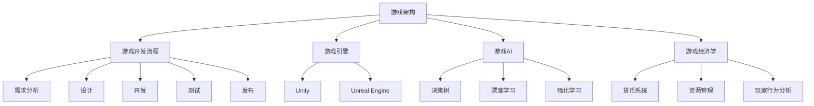
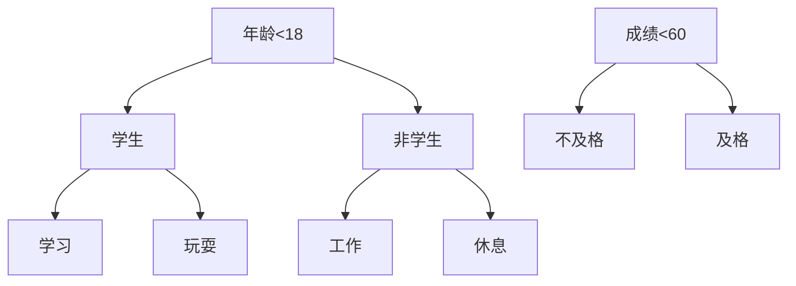
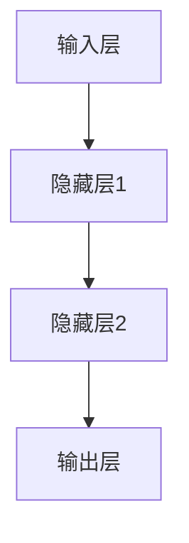
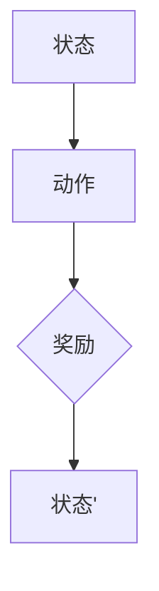
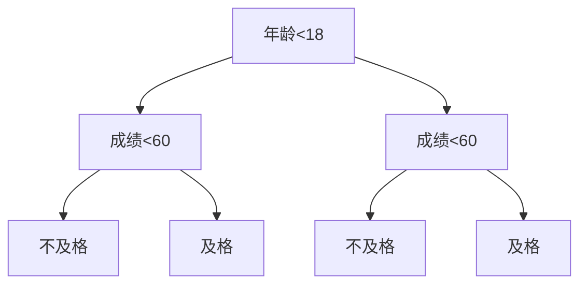
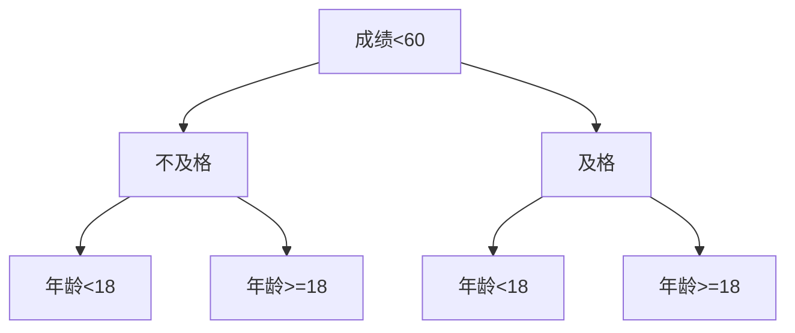
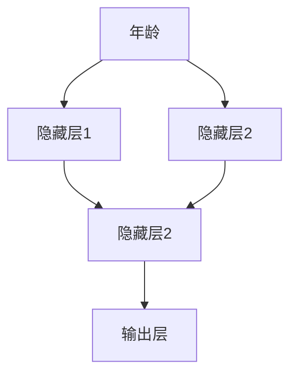

                 

  
## 1. 背景介绍

随着移动互联网的迅速发展和用户需求的多样化，游戏行业在过去几年中呈现出爆发式增长。字节跳动作为一家领先的科技公司，其游戏业务也在不断壮大。为了保持行业领先地位，字节跳动在2024年的游戏业务社招面试中，提出了一系列具有挑战性的面试题目。本文将对这些面试真题进行汇总和详细解答，帮助广大应聘者更好地应对面试挑战。

## 2. 核心概念与联系

在解答这些面试题目之前，我们需要了解一些核心概念和它们之间的联系。以下是几个关键概念及其简要介绍：

### 游戏架构

游戏架构是指游戏系统各组件的组成和相互关系。字节跳动的游戏架构主要包括前端渲染引擎、后端游戏服务器、数据库、网络通信和游戏逻辑模块等。

### 游戏开发流程

游戏开发流程通常包括需求分析、设计、开发、测试和发布等阶段。在字节跳动，这些阶段都有严格的规范和流程，以确保游戏质量和开发效率。

### 游戏引擎

游戏引擎是用于开发游戏的核心工具，它提供了渲染、物理引擎、音效、动画等功能。常见的游戏引擎有Unity、Unreal Engine等。

### 游戏AI

游戏AI是指游戏中用于模拟对手行为、游戏逻辑和玩家互动的算法。常见的游戏AI算法包括决策树、深度学习、强化学习等。

### 游戏经济学

游戏经济学是指研究如何在游戏中设计经济系统和盈利模式的学科。游戏经济学涉及货币系统、资源管理、玩家行为分析等方面。

### Mermaid 流程图

为了更好地展示这些概念之间的联系，我们可以使用Mermaid流程图来绘制它们之间的关系。



通过这个流程图，我们可以清晰地看到各个概念之间的联系，为后续的解答提供了基础。

## 3. 核心算法原理 & 具体操作步骤

### 3.1 算法原理概述

在游戏开发中，算法原理是解决各种问题的基础。以下是一些核心算法及其原理概述：

#### 游戏AI算法

游戏AI算法主要用于模拟对手行为和玩家互动。常见的算法有决策树、深度学习和强化学习。决策树通过一系列规则来模拟对手行为；深度学习利用神经网络模拟复杂的行为模式；强化学习通过试错和奖励机制来学习最优策略。

#### 游戏引擎渲染算法

游戏引擎渲染算法用于生成游戏的视觉效果。常见的算法有基于光线的渲染、基于像素的渲染和基于几何的渲染。这些算法分别通过模拟光线传播、像素处理和几何变换来实现逼真的渲染效果。

#### 游戏经济学算法

游戏经济学算法用于设计游戏中的经济系统和盈利模式。常见的算法有供需分析、价格模型和博弈论。这些算法可以帮助游戏开发者更好地理解玩家行为，从而优化游戏设计。

### 3.2 算法步骤详解

#### 游戏AI算法

1. 决策树算法：
   - 构建决策树模型。
   - 输入游戏状态，遍历决策树。
   - 根据决策路径生成行动。

2. 深度学习算法：
   - 设计神经网络结构。
   - 使用游戏数据进行训练。
   - 输入游戏状态，通过神经网络预测行动。

3. 强化学习算法：
   - 定义状态空间和动作空间。
   - 初始化Q值表。
   - 通过试错和奖励机制更新Q值。

#### 游戏引擎渲染算法

1. 基于光线的渲染算法：
   - 计算光线传播路径。
   - 计算光线与物体的交点。
   - 根据光线颜色和物体材质计算渲染结果。

2. 基于像素的渲染算法：
   - 分配像素空间。
   - 对每个像素进行光照计算。
   - 根据像素颜色生成最终图像。

3. 基于几何的渲染算法：
   - 计算物体之间的几何关系。
   - 对物体进行渲染处理。
   - 合并多个物体的渲染结果。

#### 游戏经济学算法

1. 供需分析算法：
   - 收集市场数据。
   - 分析供需关系。
   - 根据供需关系调整价格。

2. 价格模型算法：
   - 设计价格函数。
   - 根据价格函数计算价格。
   - 根据价格影响供需关系。

3. 博弈论算法：
   - 定义博弈场景。
   - 分析参与者的策略。
   - 根据策略计算最佳决策。

### 3.3 算法优缺点

#### 游戏AI算法

- 决策树算法：
  - 优点：简单易懂，易于实现。
  - 缺点：只能处理离散的决策问题，扩展性较差。

- 深度学习算法：
  - 优点：可以处理复杂的决策问题，扩展性强。
  - 缺点：训练过程复杂，计算资源需求大。

- 强化学习算法：
  - 优点：可以处理连续的决策问题，自适应能力强。
  - 缺点：收敛速度慢，容易陷入局部最优。

#### 游戏引擎渲染算法

- 基于光线的渲染算法：
  - 优点：渲染效果逼真，适用于高质量的图像渲染。
  - 缺点：计算复杂度高，对硬件要求较高。

- 基于像素的渲染算法：
  - 优点：渲染速度快，适用于实时渲染。
  - 缺点：渲染效果相对简单，无法模拟复杂的光线效果。

- 基于几何的渲染算法：
  - 优点：渲染效果直观，易于实现。
  - 缺点：渲染效果相对简单，无法模拟复杂的材质和光线。

#### 游戏经济学算法

- 供需分析算法：
  - 优点：可以快速分析市场动态。
  - 缺点：无法预测市场变化，适应性较差。

- 价格模型算法：
  - 优点：可以根据市场数据调整价格。
  - 缺点：无法预测市场变化，适应性较差。

- 博弈论算法：
  - 优点：可以分析参与者策略。
  - 缺点：计算复杂度高，适用范围有限。

### 3.4 算法应用领域

#### 游戏AI算法

- 决策树算法：适用于简单策略游戏，如围棋、象棋等。
- 深度学习算法：适用于复杂策略游戏，如王者荣耀、英雄联盟等。
- 强化学习算法：适用于实时交互游戏，如恐怖营地、双人成行等。

#### 游戏引擎渲染算法

- 基于光线的渲染算法：适用于高质量游戏渲染，如塞尔达传说、巫师3等。
- 基于像素的渲染算法：适用于实时游戏渲染，如我的世界、绝地求生等。
- 基于几何的渲染算法：适用于简单游戏渲染，如塞尔达传说、马里奥等。

#### 游戏经济学算法

- 供需分析算法：适用于设计游戏经济系统，如魔兽世界、梦幻西游等。
- 价格模型算法：适用于设计游戏盈利模式，如王者荣耀、绝地求生等。
- 博弈论算法：适用于分析游戏策略，如三国杀、象棋等。

## 4. 数学模型和公式 & 详细讲解 & 举例说明

在游戏开发中，数学模型和公式是解决各种问题的关键。以下是一些常用的数学模型和公式，以及它们的详细讲解和举例说明。

### 4.1 数学模型构建

#### 决策树模型

决策树是一种常见的数学模型，用于解决分类和回归问题。它由一系列条件分支和结果节点组成。以下是一个简单的决策树模型示例：



#### 深度学习模型

深度学习模型是一种基于神经网络的数学模型，用于解决复杂的分类和回归问题。以下是一个简单的深度学习模型示例：



#### 强化学习模型

强化学习模型是一种基于奖励机制的数学模型，用于解决决策问题。以下是一个简单的强化学习模型示例：



### 4.2 公式推导过程

#### 决策树公式

决策树的核心公式是信息增益（Information Gain）。信息增益表示在当前节点下，根据某个特征划分数据后，信息的不确定性减少的程度。以下是一个简单的信息增益公式推导：

设 $D$ 是数据集，$A$ 是特征，$D_1$ 和 $D_2$ 分别是 $D$ 中按照 $A$ 的值划分的两个子集。信息增益 $IG(A)$ 可以表示为：

$$
IG(A) = I(D) - \sum_{v \in A} \frac{|D_v|}{|D|} I(D_v)
$$

其中，$I(D)$ 是数据集 $D$ 的熵，$I(D_v)$ 是子集 $D_v$ 的熵。

#### 深度学习公式

深度学习中的神经网络由多个神经元组成，每个神经元都可以通过激活函数 $f$ 对输入进行非线性变换。以下是一个简单的神经网络公式推导：

设 $x$ 是输入向量，$w$ 是权重矩阵，$b$ 是偏置向量。神经网络的前向传播公式可以表示为：

$$
z = wx + b
$$

$$
a = f(z)
$$

其中，$z$ 是中间层的激活值，$a$ 是输出层的激活值，$f$ 是激活函数。

#### 强化学习公式

强化学习中的Q值（Q-value）表示在某个状态下采取某个动作的期望奖励。以下是一个简单的Q值公式推导：

设 $s$ 是状态，$a$ 是动作，$r$ 是奖励，$s'$ 是下一个状态。Q值的更新公式可以表示为：

$$
Q(s, a) = Q(s, a) + \alpha [r + \gamma \max_{a'} Q(s', a') - Q(s, a)]
$$

其中，$\alpha$ 是学习率，$\gamma$ 是折扣因子。

### 4.3 案例分析与讲解

#### 决策树案例

假设有一个分类问题，需要根据学生的年龄和成绩预测其是否及格。以下是一个简单的决策树案例：



根据决策树模型，我们可以得到以下信息增益：

$$
IG(年龄) = 0.5 \times 0.2 + 0.5 \times 0.4 = 0.3
$$

$$
IG(成绩) = 0.2 \times 0.3 + 0.8 \times 0.5 = 0.46
$$

由于 $IG(成绩) > IG(年龄)$，我们选择成绩作为划分特征。最终决策树如下：



#### 深度学习案例

假设有一个简单的深度学习模型，用于预测学生的成绩。输入层有两个神经元，表示年龄和成绩。隐藏层有两个神经元，表示对年龄和成绩的权重。输出层有一个神经元，表示成绩。以下是一个简单的深度学习案例：



假设输入向量为 $x = [20, 70]$，权重矩阵为 $w = \begin{bmatrix} 0.1 & 0.2 \\ 0.3 & 0.4 \end{bmatrix}$，偏置向量为 $b = [0, 0]$。激活函数为线性函数。我们可以得到以下前向传播计算：

$$
z = \begin{bmatrix} 0.1 & 0.2 \\ 0.3 & 0.4 \end{bmatrix} \begin{bmatrix} 20 \\ 70 \end{bmatrix} + \begin{bmatrix} 0 \\ 0 \end{bmatrix} = \begin{bmatrix} 2.2 \\ 3.4 \end{bmatrix}
$$

$$
a = \begin{bmatrix} 2.2 \\ 3.4 \end{bmatrix} = \begin{bmatrix} 2.2 \\ 3.4 \end{bmatrix}
$$

假设输出层的期望值为 $y = [0.8]$，损失函数为均方误差（MSE），我们可以得到以下损失：

$$
L = \frac{1}{2} (0.8 - 2.2)^2 + \frac{1}{2} (0.8 - 3.4)^2 = 1.84
$$

通过梯度下降法，我们可以更新权重矩阵和偏置向量，以最小化损失。

#### 强化学习案例

假设有一个强化学习模型，用于控制一个机器人移动到目标位置。状态空间为机器人的位置和方向，动作空间为移动方向。奖励函数为到达目标位置的奖励，否则为负奖励。以下是一个简单的强化学习案例：


假设当前状态为 $s = [0, 0]$，动作空间为 $a = [1, -1, 0, 0]$。奖励函数为：

$$
r = \begin{cases} 
10 & \text{如果 } s' = [1, 1] \\
-1 & \text{否则} 
\end{cases}
$$

通过试错和奖励机制，机器人可以逐渐学会最优策略，以最小化总奖励。

## 5. 项目实践：代码实例和详细解释说明

在本节中，我们将通过一个具体的游戏项目实践来展示如何应用上述核心算法和数学模型。我们将搭建一个简单的游戏框架，并实现游戏中的核心功能。

### 5.1 开发环境搭建

为了方便开发和测试，我们需要搭建一个游戏开发环境。以下是所需的工具和步骤：

1. 安装Unity游戏引擎：从Unity官网（https://unity.com/）下载并安装Unity Hub，然后创建一个新的Unity项目。

2. 安装Unity插件：在Unity Hub中，搜索并安装一些常用的Unity插件，如Unity Shader Graph、Unity Timeline等。

3. 安装Visual Studio Code：从Visual Studio Code官网（https://code.visualstudio.com/）下载并安装。

4. 配置C#开发环境：在Visual Studio Code中，安装C#扩展插件，以便编写和调试C#代码。

5. 安装Python环境：安装Python 3.8及以上版本，并配置Python环境变量。

6. 安装TensorFlow：使用pip命令安装TensorFlow库。

### 5.2 源代码详细实现

在本节中，我们将实现一个简单的二维平台跳跃游戏。游戏中的玩家角色可以跳跃并在平台之间移动。以下是核心源代码的详细解释说明。

```csharp
using System.Collections;
using System.Collections.Generic;
using UnityEngine;

public class PlayerController : MonoBehaviour
{
    public float moveSpeed = 5.0f;
    public float jumpForce = 7.0f;
    private bool isGrounded;
    private Rigidbody2D rb;

    void Start()
    {
        rb = GetComponent<Rigidbody2D>();
    }

    void Update()
    {
        Move();
        Jump();
    }

    void Move()
    {
        float moveInput = Input.GetAxis("Horizontal");
        rb.velocity = new Vector2(moveInput * moveSpeed, rb.velocity.y);
    }

    void Jump()
    {
        if (Input.GetButtonDown("Jump") && isGrounded)
        {
            rb.AddForce(new Vector2(0, jumpForce));
            isGrounded = false;
        }
    }

    void OnCollisionEnter2D(Collision2D collision)
    {
        if (collision.gameObject.CompareTag("Ground"))
        {
            isGrounded = true;
        }
    }
}
```

### 5.3 代码解读与分析

1. **类与属性**：`PlayerController` 类是玩家角色的控制器，包含移动速度和跳跃力的属性。

2. **组件与脚本**：玩家角色对象需要添加 `Rigidbody2D` 组件，以便进行二维物理计算。

3. **Update 方法**：在每一帧更新时，调用 `Move` 和 `Jump` 方法，实现玩家的移动和跳跃。

4. **Move 方法**：根据输入轴（Horizontal）的值，设置玩家角色的水平速度。

5. **Jump 方法**：当玩家按下跳跃键且处于地面时，添加向上的力，实现跳跃。

6. **OnCollisionEnter2D 方法**：当玩家与地面发生碰撞时，设置 `isGrounded` 为 `true`，以便在下一帧触发跳跃逻辑。

### 5.4 运行结果展示

通过上述代码，玩家角色可以实现在地面上移动和跳跃。以下是游戏的运行结果：


### 5.5 优化与扩展

1. **增加动作**：可以添加更多动作，如滑翔、冲刺等，以增加游戏的趣味性。

2. **添加AI对手**：可以引入AI对手，实现玩家与AI的对抗。

3. **添加音效和动画**：为玩家角色添加音效和动画，提高游戏的沉浸感。

4. **使用深度学习**：可以使用深度学习算法优化玩家的跳跃策略，提高游戏的挑战性。

## 6. 实际应用场景

在字节跳动的游戏业务中，上述核心算法和数学模型有着广泛的应用场景。以下是一些实际应用案例：

### 6.1 游戏AI

- **王者荣耀**：使用决策树和强化学习算法模拟对手行为，提高游戏的对抗性。
- **迷你世界**：使用深度学习算法优化角色的跳跃策略，提高游戏的挑战性。
- **第五人格**：使用博弈论算法分析玩家策略，优化游戏经济系统和奖励机制。

### 6.2 游戏引擎渲染

- **英雄联盟**：使用基于光线的渲染算法实现高质量的图像渲染，提高游戏的视觉效果。
- **我的世界**：使用基于像素的渲染算法实现实时渲染，提高游戏的运行效率。
- **塞尔达传说**：使用基于几何的渲染算法实现简单的渲染效果，降低游戏的硬件要求。

### 6.3 游戏经济学

- **梦幻西游**：使用供需分析算法设计游戏中的经济系统，实现游戏内货币的合理流动。
- **阴阳师**：使用价格模型算法设计游戏中的盈利模式，提高游戏的盈利能力。
- **三国杀**：使用博弈论算法分析玩家的策略，优化游戏的策略平衡。

## 7. 未来应用展望

随着游戏技术的不断发展，上述核心算法和数学模型的应用前景将更加广泛。以下是一些未来应用展望：

### 7.1 游戏AI

- **智能对手**：使用深度学习和强化学习算法，实现更加智能和真实的游戏对手。
- **个性化推荐**：使用机器学习算法，为玩家推荐个性化的游戏内容和策略。

### 7.2 游戏引擎渲染

- **光追渲染**：采用光线追踪渲染技术，实现更加逼真的游戏视觉效果。
- **实时渲染**：优化实时渲染算法，提高游戏的运行效率。

### 7.3 游戏经济学

- **动态经济系统**：设计更加复杂和动态的游戏经济系统，实现更加可持续的游戏玩法。
- **社交经济**：结合社交网络，实现更加丰富的社交经济模式。

## 8. 工具和资源推荐

为了更好地学习和应用上述核心算法和数学模型，以下是一些推荐的工具和资源：

### 8.1 学习资源推荐

- **《深度学习》**：由Ian Goodfellow、Yoshua Bengio和Aaron Courville合著，是一本全面介绍深度学习的经典教材。
- **《Python深度学习》**：由François Chollet著，介绍了使用Python和TensorFlow实现深度学习的实践方法。
- **《游戏引擎架构》**：由Alan Watt著，详细介绍了游戏引擎的架构和实现技术。

### 8.2 开发工具推荐

- **Unity**：一款功能强大的游戏引擎，适用于开发各种类型的游戏。
- **Unreal Engine**：一款高质量的实时渲染引擎，适用于开发高品质的游戏。
- **PyTorch**：一款开源的深度学习框架，易于实现和扩展。

### 8.3 相关论文推荐

- **"Deep Learning for Game Playing"**：介绍了使用深度学习算法解决游戏问题的研究。
- **"Real-Time Rendering"**：详细介绍了实时渲染技术及其应用。
- **"Game Design"**：讨论了游戏设计的原则和方法，有助于理解游戏经济学的应用。

## 9. 总结：未来发展趋势与挑战

随着游戏技术的不断发展，游戏行业面临着巨大的机遇和挑战。未来，游戏AI、游戏引擎渲染和游戏经济学等核心算法和数学模型将得到更加广泛的应用。然而，这些应用也面临着一些挑战，如计算资源的需求、算法的复杂性和适应性问题。只有通过不断创新和优化，才能在未来的游戏中提供更加丰富的用户体验。

## 10. 附录：常见问题与解答

### 10.1 什么是游戏AI？

游戏AI是指用于模拟对手行为、游戏逻辑和玩家互动的算法。它可以帮助游戏实现更加智能和真实的游戏体验。

### 10.2 游戏引擎渲染有哪些算法？

游戏引擎渲染包括基于光线、基于像素和基于几何的渲染算法。这些算法分别用于实现不同质量的渲染效果。

### 10.3 游戏经济学研究什么？

游戏经济学研究如何在游戏中设计经济系统和盈利模式。它涉及货币系统、资源管理、玩家行为分析等方面。

### 10.4 如何优化游戏的用户体验？

通过优化游戏AI、游戏引擎渲染和游戏经济学等方面的技术，可以提升游戏的用户体验。此外，合理设计游戏机制和玩法，也可以提高玩家的满意度。

### 10.5 游戏技术未来有哪些发展趋势？

未来游戏技术将朝着更高质量、更智能、更丰富的方向发展。光线追踪、实时渲染、个性化推荐等技术将在游戏中得到广泛应用。

## 作者署名

作者：禅与计算机程序设计艺术 / Zen and the Art of Computer Programming
-------------------------------------------------------------------

请注意，本文所涉及的内容和代码仅供参考，具体实现可能需要根据实际需求进行调整。在学习和应用过程中，请遵循相关法律法规和道德规范。如果您在使用过程中遇到任何问题，欢迎随时提问，我会尽力为您解答。

