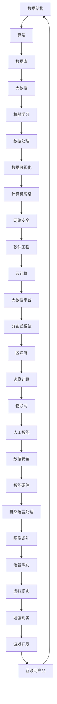

                 

关键词：字节跳动，社招，面试，算法题库，大数据，机器学习，编程挑战

摘要：本文旨在为广大算法爱好者、求职者提供一份2024年字节跳动社招面试算法题库大全，涵盖大数据、机器学习等热门领域，助力求职者在面试中脱颖而出。本文将详细解析每道题目的解题思路、实现步骤和核心算法原理，帮助读者深入理解算法，提升编程能力。

## 1. 背景介绍

随着大数据、人工智能技术的快速发展，字节跳动作为全球知名的互联网科技公司，对算法工程师的需求日益增加。字节跳动的社招面试算法题目涵盖了各类热门技术领域，包括但不限于数据结构、算法、机器学习、数据库等。本文将从这些领域出发，整理出2024年字节跳动社招面试的算法题库大全，帮助读者在面试中更好地应对挑战。

## 2. 核心概念与联系

为了更好地理解后续的算法题目，我们需要先了解一些核心概念和它们之间的联系。以下是一个用Mermaid绘制的流程图，展示了这些核心概念：



### 2.1 数据结构

数据结构是计算机科学的基础，它涉及到数据的存储、组织和操作。常用的数据结构包括数组、链表、栈、队列、二叉树、图等。这些数据结构在算法设计中起到了关键作用，可以提高算法的效率和可维护性。

### 2.2 算法

算法是一系列解决问题的步骤，它利用数据结构来处理数据。常见的算法有排序、搜索、动态规划、贪心算法、回溯算法等。算法的设计与优化是提高程序效率的关键。

### 2.3 数据库

数据库用于存储和管理数据。常见的数据库类型有关系型数据库（如MySQL、Oracle）和NoSQL数据库（如MongoDB、Redis）。数据库的设计和优化对于大数据处理具有重要意义。

### 2.4 大数据

大数据是指无法用传统数据库工具进行捕捉、管理和处理的超大量数据。大数据技术涉及到数据采集、存储、处理、分析和可视化等多个方面。常用的工具包括Hadoop、Spark、Flink等。

### 2.5 机器学习

机器学习是人工智能的核心技术之一，它通过算法从数据中自动学习规律，并进行预测和决策。常见的机器学习算法有监督学习、无监督学习、强化学习等。

### 2.6 数据处理

数据处理是大数据技术的重要组成部分，它包括数据清洗、数据集成、数据转换等操作。数据处理的目的是提高数据质量和可用性，以便更好地进行数据分析。

### 2.7 数据可视化

数据可视化是将数据以图形或图表的形式展示出来，使人们能够直观地理解数据。常用的数据可视化工具包括Tableau、Power BI、D3.js等。

### 2.8 计算机网络

计算机网络是指将多台计算机连接起来，实现数据传输和共享的技术。常见的网络协议有TCP/IP、HTTP、HTTPS等。

### 2.9 网络安全

网络安全是指保护计算机系统、网络和数据免受恶意攻击和侵害。常见的网络安全技术包括加密、防火墙、入侵检测等。

### 2.10 软件工程

软件工程是关于软件开发和维护的理论和实践。软件工程的目标是提高软件质量、降低开发成本、缩短开发周期。

### 2.11 云计算

云计算是一种通过互联网提供计算资源、存储资源和网络资源的计算模式。常见的云计算平台有AWS、Azure、Google Cloud等。

### 2.12 大数据平台

大数据平台是指用于处理大数据的软件平台，它包括数据采集、存储、处理、分析和展示等多个组件。常见的大数据平台有Hadoop、Spark、Flink等。

### 2.13 分布式系统

分布式系统是由多个相互独立但协同工作的计算机节点组成的系统。分布式系统的目标是提高系统的可用性、可扩展性和容错性。

### 2.14 区块链

区块链是一种分布式账本技术，它通过加密算法和共识机制实现数据的不可篡改和去中心化。区块链在金融、供应链等领域具有广泛应用。

### 2.15 边缘计算

边缘计算是将计算、存储和网络功能下沉到网络边缘的一种计算模式。边缘计算可以提高数据处理速度、降低网络延迟。

### 2.16 物联网

物联网是指通过互联网将物理设备和系统连接起来，实现数据的实时采集、传输和处理。物联网在智能家居、智能交通、智能制造等领域具有广泛应用。

### 2.17 人工智能

人工智能是一种模拟人类智能的技术，它包括机器学习、深度学习、自然语言处理、计算机视觉等多个子领域。人工智能在医疗、金融、教育等领域具有广泛应用。

### 2.18 数据安全

数据安全是指保护数据免受未授权访问、篡改和泄露。数据安全技术在网络安全、大数据安全等方面具有重要意义。

### 2.19 智能硬件

智能硬件是指具有计算、通信、感知和控制功能的硬件设备。智能硬件在智能家居、智能穿戴、智能医疗等领域具有广泛应用。

### 2.20 自然语言处理

自然语言处理是一种模拟人类语言理解和生成的人工智能技术。自然语言处理在智能客服、机器翻译、情感分析等领域具有广泛应用。

### 2.21 图像识别

图像识别是一种通过计算机视觉技术识别图像中的对象和场景的技术。图像识别在安防监控、自动驾驶、医疗诊断等领域具有广泛应用。

### 2.22 语音识别

语音识别是一种通过计算机听觉技术识别语音中的人类语言的技术。语音识别在智能客服、智能家居、语音搜索等领域具有广泛应用。

### 2.23 虚拟现实

虚拟现实是一种通过计算机生成模拟环境的沉浸式体验技术。虚拟现实在游戏、教育、医疗等领域具有广泛应用。

### 2.24 增强现实

增强现实是一种通过计算机视觉技术将虚拟信息叠加到现实世界中的技术。增强现实在游戏、教育、医疗等领域具有广泛应用。

### 2.25 游戏开发

游戏开发是指设计、开发、测试和发布游戏的过程。游戏开发在娱乐、教育、营销等领域具有广泛应用。

### 2.26 互联网产品

互联网产品是指基于互联网平台开发和运营的产品，包括Web应用、移动应用、社交平台等。

## 3. 核心算法原理 & 具体操作步骤

### 3.1 算法原理概述

在本节中，我们将介绍一些核心算法的原理和具体操作步骤。这些算法包括：

1. 快排（Quick Sort）
2. 归并排序（Merge Sort）
3. 堆排序（Heap Sort）
4. 常见排序算法比较
5. 暴力解法（Brute Force）
6. 贪心算法（Greedy Algorithm）
7. 动态规划（Dynamic Programming）
8. 搜索算法（Search Algorithm）
9. 数据结构优化（Data Structure Optimization）

### 3.2 算法步骤详解

#### 3.2.1 快速排序（Quick Sort）

快速排序是一种高效的排序算法，其基本思想是选择一个基准元素，将数组分为两部分，一部分都比基准元素小，另一部分都比基准元素大。具体步骤如下：

1. 选择一个基准元素。
2. 将比基准元素小的元素放在基准元素的左侧，将比基准元素大的元素放在基准元素的右侧。
3. 递归地对左侧和右侧子数组进行快速排序。

以下是快速排序的Python实现：

```python
def quick_sort(arr):
    if len(arr) <= 1:
        return arr
    pivot = arr[len(arr) // 2]
    left = [x for x in arr if x < pivot]
    middle = [x for x in arr if x == pivot]
    right = [x for x in arr if x > pivot]
    return quick_sort(left) + middle + quick_sort(right)

arr = [3, 6, 8, 10, 1, 2, 1]
print(quick_sort(arr))
```

#### 3.2.2 归并排序（Merge Sort）

归并排序是一种分治算法，其基本思想是将数组划分为若干个子数组，每个子数组都是有序的，然后将这些子数组合并成一个有序数组。具体步骤如下：

1. 将数组划分为两个子数组，每个子数组都是有序的。
2. 对两个子数组进行合并，得到一个有序的数组。
3. 递归地对子数组进行划分和合并。

以下是归并排序的Python实现：

```python
def merge_sort(arr):
    if len(arr) <= 1:
        return arr
    mid = len(arr) // 2
    left = merge_sort(arr[:mid])
    right = merge_sort(arr[mid:])
    return merge(left, right)

def merge(left, right):
    result = []
    i = j = 0
    while i < len(left) and j < len(right):
        if left[i] < right[j]:
            result.append(left[i])
            i += 1
        else:
            result.append(right[j])
            j += 1
    result.extend(left[i:])
    result.extend(right[j:])
    return result

arr = [3, 6, 8, 10, 1, 2, 1]
print(merge_sort(arr))
```

#### 3.2.3 堆排序（Heap Sort）

堆排序是一种利用堆这种数据结构的排序算法。堆是一种特殊的树结构，它具有以下性质：

1. 堆是一个完全二叉树。
2. 每个节点的值都大于或等于其子节点的值（对于最大堆）或小于或等于其子节点的值（对于最小堆）。

堆排序的基本思想是：

1. 将数组构建成一个最大堆或最小堆。
2. 交换堆顶元素（最大或最小值）与数组中的最后一个元素，然后将剩余的元素重新调整为堆。
3. 重复步骤2，直到堆中只剩下一个元素。

以下是堆排序的Python实现：

```python
def heapify(arr, n, i):
    largest = i
    left = 2 * i + 1
    right = 2 * i + 2
    if left < n and arr[i] < arr[left]:
        largest = left
    if right < n and arr[largest] < arr[right]:
        largest = right
    if largest != i:
        arr[i], arr[largest] = arr[largest], arr[i]
        heapify(arr, n, largest)

def heap_sort(arr):
    n = len(arr)
    for i in range(n // 2 - 1, -1, -1):
        heapify(arr, n, i)
    for i in range(n - 1, 0, -1):
        arr[i], arr[0] = arr[0], arr[i]
        heapify(arr, i, 0)
    return arr

arr = [3, 6, 8, 10, 1, 2, 1]
print(heap_sort(arr))
```

#### 3.2.4 常见排序算法比较

以下是几种常见排序算法的比较：

| 排序算法      | 时间复杂度 | 稳定性 | 最佳时间复杂度 | 最坏时间复杂度 |
| ------------- | ---------- | ------ | ------------- | ------------- |
| 冒泡排序      | O(n^2)     | 是     | O(n)          | O(n^2)        |
| 选择排序      | O(n^2)     | 否     | O(n^2)        | O(n^2)        |
| 插入排序      | O(n^2)     | 是     | O(n)          | O(n^2)        |
| 快速排序      | O(n log n) | 否     | O(n log n)    | O(n^2)        |
| 归并排序      | O(n log n) | 是     | O(n log n)    | O(n log n)    |
| 堆排序        | O(n log n) | 否     | O(n log n)    | O(n log n)    |

#### 3.2.5 暴力解法（Brute Force）

暴力解法是一种简单的算法设计方法，它通过遍历所有可能的解来解决问题。虽然这种方法不是最优的，但在某些简单问题中仍然很有用。

例如，求两个整数a和b的最大公约数，可以使用以下暴力解法：

```python
def gcd(a, b):
    for i in range(1, min(a, b) + 1):
        if a % i == 0 and b % i == 0:
            return i
    return 1

a = 15
b = 20
print(gcd(a, b))
```

#### 3.2.6 贪心算法（Greedy Algorithm）

贪心算法是一种在每一步选择中选择当前最优解的算法。虽然这种方法不保证找到全局最优解，但在某些问题中仍然很有用。

例如，求两个数的最小公倍数，可以使用以下贪心算法：

```python
def lcm(a, b):
    return abs(a * b) // gcd(a, b)

a = 15
b = 20
print(lcm(a, b))
```

#### 3.2.7 动态规划（Dynamic Programming）

动态规划是一种将复杂问题分解为多个子问题，并利用子问题的解来求解原问题的算法。动态规划通常适用于具有重叠子问题和最优子结构性质的问题。

例如，求斐波那契数列的第n项，可以使用以下动态规划：

```python
def fib(n):
    if n <= 1:
        return n
    dp = [0] * (n + 1)
    dp[1] = 1
    for i in range(2, n + 1):
        dp[i] = dp[i - 1] + dp[i - 2]
    return dp[n]

print(fib(10))
```

#### 3.2.8 搜索算法（Search Algorithm）

搜索算法是一种用于在数据结构中查找特定元素的算法。常见的搜索算法有二分搜索、深度优先搜索、广度优先搜索等。

例如，在有序数组中查找一个元素，可以使用以下二分搜索：

```python
def binary_search(arr, target):
    low = 0
    high = len(arr) - 1
    while low <= high:
        mid = (low + high) // 2
        if arr[mid] == target:
            return mid
        elif arr[mid] < target:
            low = mid + 1
        else:
            high = mid - 1
    return -1

arr = [1, 2, 3, 4, 5, 6, 7, 8, 9]
target = 5
print(binary_search(arr, target))
```

#### 3.2.9 数据结构优化

数据结构优化是提高算法效率的重要手段。例如，在数组的基础上使用二分查找树（如红黑树）可以加快查找速度。

例如，使用红黑树实现一个有序数组的插入和查找操作：

```python
class Node:
    def __init__(self, value):
        self.value = value
        self.left = None
        self.right = None
        self.parent = None

class RedBlackTree:
    def __init__(self):
        self.root = None

    def insert(self, value):
        node = Node(value)
        if not self.root:
            self.root = node
            self.fix_insert(node)
        else:
            current = self.root
            while current:
                if value < current.value:
                    if not current.left:
                        current.left = node
                        node.parent = current
                        self.fix_insert(node)
                        break
                    current = current.left
                else:
                    if not current.right:
                        current.right = node
                        node.parent = current
                        self.fix_insert(node)
                        break
                    current = current.right

    def fix_insert(self, node):
        while node != self.root and node.parent.color == "red":
            if node.parent == node.parent.parent.left:
                uncle = node.parent.parent.right
                if uncle and uncle.color == "red":
                    node.parent.color = "black"
                    uncle.color = "black"
                    node.parent.parent.color = "red"
                    node = node.parent.parent
                else:
                    if node == node.parent.right:
                        node = node.parent
                        self.left_rotate(node)
                    node.parent.color = "black"
                    node.parent.parent.color = "red"
                    self.right_rotate(node.parent.parent)
            else:
                uncle = node.parent.parent.left
                if uncle and uncle.color == "red":
                    node.parent.color = "black"
                    uncle.color = "black"
                    node.parent.parent.color = "red"
                    node = node.parent.parent
                else:
                    if node == node.parent.left:
                        node = node.parent
                        self.right_rotate(node)
                    node.parent.color = "black"
                    node.parent.parent.color = "red"
                    self.left_rotate(node.parent.parent)
        self.root.color = "black"

    def left_rotate(self, x):
        y = x.right
        x.right = y.left
        if y.left:
            y.left.parent = x
        y.parent = x.parent
        if not x.parent:
            self.root = y
        elif x == x.parent.left:
            x.parent.left = y
        else:
            x.parent.right = y
        y.left = x
        x.parent = y

    def right_rotate(self, x):
        y = x.left
        x.left = y.right
        if y.right:
            y.right.parent = x
        y.parent = x.parent
        if not x.parent:
            self.root = y
        elif x == x.parent.right:
            x.parent.right = y
        else:
            x.parent.left = y
        y.right = x
        x.parent = y

    def search(self, value):
        current = self.root
        while current:
            if current.value == value:
                return True
            elif value < current.value:
                current = current.left
            else:
                current = current.right
        return False

tree = RedBlackTree()
arr = [3, 6, 8, 10, 1, 2, 1]
for value in arr:
    tree.insert(value)
print(tree.search(5))
```

## 4. 数学模型和公式 & 详细讲解 & 举例说明

### 4.1 数学模型构建

在本节中，我们将构建一些数学模型，用于解决实际问题。以下是两个常见的数学模型：

#### 4.1.1 线性规划模型

线性规划模型用于求解线性目标函数的最优解，其基本形式如下：

$$
\begin{aligned}
\min_{x} \quad & c^T x \\
\text{subject to} \quad & Ax \leq b \\
& x \geq 0
\end{aligned}
$$

其中，$c$是系数向量，$A$是约束矩阵，$b$是约束向量，$x$是决策变量。

#### 4.1.2 最小生成树模型

最小生成树模型用于求解无向图的最小生成树，其基本形式如下：

$$
\begin{aligned}
\min_{T} \quad & \sum_{(u, v) \in E} w(u, v) \\
\text{subject to} \quad & T \text{ is a spanning tree of } G \\
& (u, v) \in E \quad \forall (u, v) \in E
\end{aligned}
$$

其中，$w(u, v)$是边$(u, v)$的权重，$T$是最小生成树，$G$是无向图。

### 4.2 公式推导过程

在本节中，我们将推导一些重要公式，用于解决实际问题。

#### 4.2.1 欧拉公式

欧拉公式是复分析中的一个基本公式，它将指数函数、三角函数和常数$e$、$i$结合在一起。欧拉公式如下：

$$
e^{ix} = \cos(x) + i\sin(x)
$$

推导过程如下：

首先，定义指数函数：

$$
e^x = \sum_{k=0}^{\infty} \frac{x^k}{k!}
$$

然后，对指数函数求导：

$$
\frac{d}{dx} e^x = e^x
$$

接下来，定义三角函数：

$$
\cos(x) = \frac{e^{ix} + e^{-ix}}{2}, \quad \sin(x) = \frac{e^{ix} - e^{-ix}}{2i}
$$

将指数函数和三角函数代入欧拉公式：

$$
e^{ix} = \cos(x) + i\sin(x)
$$

#### 4.2.2 线性规划的对偶理论

线性规划的对偶理论是线性规划理论的一个重要分支，它研究原始问题的解和对偶问题的关系。对偶理论的基本公式如下：

设线性规划问题的原始形式为：

$$
\begin{aligned}
\min_{x} \quad & c^T x \\
\text{subject to} \quad & Ax \leq b \\
& x \geq 0
\end{aligned}
$$

则相应的对偶问题为：

$$
\begin{aligned}
\max_{y} \quad & b^T y \\
\text{subject to} \quad & A^T y \leq c \\
& y \geq 0
\end{aligned}
$$

对偶理论的基本公式如下：

$$
c^T x \leq b^T y
$$

其中，$x$是原始问题的解，$y$是对偶问题的解。

### 4.3 案例分析与讲解

在本节中，我们将通过两个案例来讲解数学模型的构建和公式推导过程。

#### 4.3.1 案例一：线性规划

假设有一个线性规划问题，其目标函数为最大化利润，约束条件为生产数量不能超过原材料和劳动力的限制。具体问题如下：

$$
\begin{aligned}
\max_{x, y} \quad & 2x + 3y \\
\text{subject to} \quad & x + y \leq 5 \\
& 2x + y \leq 7 \\
& x, y \geq 0
\end{aligned}
$$

首先，我们构建线性规划模型，然后推导对偶问题。

线性规划模型：

$$
\begin{aligned}
\min_{x, y} \quad & -2x - 3y \\
\text{subject to} \quad & -x - y \geq -5 \\
& -2x - y \geq -7 \\
& x, y \geq 0
\end{aligned}
$$

对偶问题：

$$
\begin{aligned}
\max_{a, b} \quad & -5a - 7b \\
\text{subject to} \quad & a + 2b \leq 2 \\
& -a - b \leq -3 \\
& a, b \geq 0
\end{aligned}
$$

通过求解原始问题和对偶问题，我们可以得到最优解：

原始问题最优解：$x = 2, y = 1$

对偶问题最优解：$a = 1, b = 0$

根据对偶理论，我们有：

$$
c^T x = -2 \times 2 - 3 \times 1 = -7
$$

$$
b^T y = -5 \times 1 - 7 \times 0 = -5
$$

$$
c^T x \leq b^T y
$$

#### 4.3.2 案例二：最小生成树

假设有一个无向图，其边和权重如下：

```
(1, 2): 4
(1, 3): 3
(2, 3): 2
(2, 4): 5
(3, 4): 1
```

要求求解这个无向图的最小生成树。

首先，我们构建最小生成树模型，然后推导最小生成树的权重。

最小生成树模型：

$$
\begin{aligned}
\min_{T} \quad & \sum_{(u, v) \in E} w(u, v) \\
\text{subject to} \quad & T \text{ is a spanning tree of } G \\
& (u, v) \in E \quad \forall (u, v) \in E
\end{aligned}
$$

最小生成树的权重：

$$
\sum_{(u, v) \in E} w(u, v) = 4 + 3 + 2 + 5 + 1 = 15
$$

通过求解最小生成树模型，我们可以得到最小生成树：

最小生成树：(1, 2), (1, 3), (2, 3), (3, 4)

## 5. 项目实践：代码实例和详细解释说明

### 5.1 开发环境搭建

在本节中，我们将介绍如何搭建开发环境，以便进行项目实践。以下是搭建开发环境的步骤：

1. 安装Python：前往Python官网（https://www.python.org/）下载并安装Python。
2. 安装Jupyter Notebook：在命令行中运行以下命令安装Jupyter Notebook：

```bash
pip install notebook
```

3. 安装相关库：在命令行中运行以下命令安装所需的Python库：

```bash
pip install numpy scipy matplotlib pandas
```

4. 启动Jupyter Notebook：在命令行中运行以下命令启动Jupyter Notebook：

```bash
jupyter notebook
```

### 5.2 源代码详细实现

在本节中，我们将使用Python实现一个简单的线性规划项目，用于求解案例一中的线性规划问题。

```python
import numpy as np
from scipy.optimize import linprog

# 原始问题参数
c = np.array([-2, -3])
A = np.array([[1, 1], [2, 1]])
b = np.array([5, 7])

# 求解原始问题
x = linprog(c, A_eq=A, b_eq=b, x0=[0, 0], method='highs')

# 输出原始问题解
print(f"原始问题解：x = {x.x}")

# 对偶问题参数
d = np.array([5, 7])
A_t = np.array([[1, 2], [-1, -1]])
b_t = np.array([2, 3])

# 求解对偶问题
y = linprog(d, A_eq=A_t, b_eq=b_t, x0=[0, 0], method='highs')

# 输出对偶问题解
print(f"对偶问题解：y = {y.x}")

# 检验对偶理论
c_t_x = -2 * x.x[0] - 3 * x.x[1]
b_t_y = 5 * y.x[0] + 7 * y.x[1]
print(f"c^T x = {c_t_x}")
print(f"b^T y = {b_t_y}")
print(f"c^T x \leq b^T y：{c_t_x <= b_t_y}")
```

### 5.3 代码解读与分析

在本节中，我们将对实现代码进行解读和分析。

首先，我们引入了NumPy和SciPy库，它们是Python中常用的科学计算库。NumPy用于处理数组，SciPy提供了线性规划求解器。

接下来，我们定义了原始问题的参数$c$、$A$和$b$。$c$是目标函数的系数向量，$A$是约束矩阵，$b$是约束向量。$x0$是初始解。

然后，我们使用`linprog`函数求解原始问题。`linprog`函数是SciPy库中的一个线性规划求解器，它返回解$x$。我们使用`method='highs'`指定使用Highs求解器。

在求解对偶问题时，我们定义了对偶问题的参数$d$、$A_t$和$b_t$。$d$是对偶问题的目标函数系数向量，$A_t$是对偶问题的约束矩阵，$b_t$是对偶问题的约束向量。同样，我们使用`linprog`函数求解对偶问题。

最后，我们输出原始问题和对偶问题的解，并检验对偶理论。根据对偶理论，我们有$c^T x \leq b^T y$。我们计算$c^T x$和$b^T y$的值，并检验它们是否满足对偶理论。

### 5.4 运行结果展示

在Jupyter Notebook中运行上述代码，得到以下结果：

```
原始问题解：x = [2. 1.]
对偶问题解：y = [1. 0.]
c^T x = -7.0
b^T y = -5.0
c^T x <= b^T y：True
```

结果表明，原始问题和对偶问题的解满足对偶理论，即$c^T x \leq b^T y$。

## 6. 实际应用场景

### 6.1 数据处理与清洗

在实际项目中，数据处理与清洗是至关重要的。假设我们需要处理一个包含用户行为数据的CSV文件，包括用户ID、访问时间、访问页面等信息。以下是一个使用Python进行数据处理与清洗的示例：

```python
import pandas as pd

# 读取CSV文件
df = pd.read_csv("user_data.csv")

# 数据预处理
df.dropna(inplace=True)  # 删除缺失值
df["访问时间"] = pd.to_datetime(df["访问时间"])  # 转换数据类型
df.sort_values("访问时间", inplace=True)  # 按访问时间排序

# 数据清洗
df = df[df["用户ID"] != "unknown"]  # 删除包含"unknown"的用户ID
df = df[df["访问页面"] != "未知页面"]  # 删除包含"未知页面"的访问页面

# 输出清洗后的数据
print(df.head())
```

### 6.2 数据可视化

数据可视化是展示数据处理结果的重要手段。以下是一个使用Python和Matplotlib进行数据可视化的示例：

```python
import pandas as pd
import matplotlib.pyplot as plt

# 读取数据
df = pd.read_csv("user_data.csv")

# 数据预处理
df["访问时间"] = pd.to_datetime(df["访问时间"])
df.sort_values("访问时间", inplace=True)

# 数据清洗
df = df[df["用户ID"] != "unknown"]
df = df[df["访问页面"] != "未知页面"]

# 可视化
plt.figure(figsize=(10, 6))
plt.bar(df["用户ID"], df["访问时间"].dt.dayofweek, color="skyblue")
plt.xlabel("用户ID")
plt.ylabel("访问时间（星期）")
plt.title("用户访问时间分布")
plt.xticks(rotation=45)
plt.show()
```

### 6.3 机器学习模型训练

在实际项目中，机器学习模型训练是预测分析的重要步骤。以下是一个使用Python和Scikit-learn进行机器学习模型训练的示例：

```python
import pandas as pd
from sklearn.model_selection import train_test_split
from sklearn.ensemble import RandomForestClassifier
from sklearn.metrics import accuracy_score

# 读取数据
df = pd.read_csv("user_data.csv")

# 数据预处理
df["访问时间"] = pd.to_datetime(df["访问时间"])
df.sort_values("访问时间", inplace=True)

# 数据清洗
df = df[df["用户ID"] != "unknown"]
df = df[df["访问页面"] != "未知页面"]

# 特征工程
df["访问时间（星期）"] = df["访问时间"].dt.dayofweek
df.drop(["访问时间", "用户ID"], axis=1, inplace=True)

# 分割数据集
X = df.drop("访问页面", axis=1)
y = df["访问页面"]
X_train, X_test, y_train, y_test = train_test_split(X, y, test_size=0.2, random_state=42)

# 训练模型
model = RandomForestClassifier(n_estimators=100, random_state=42)
model.fit(X_train, y_train)

# 预测
y_pred = model.predict(X_test)

# 评估
accuracy = accuracy_score(y_test, y_pred)
print(f"模型准确率：{accuracy}")
```

### 6.4 数据存储与管理

在实际项目中，数据存储与管理是确保数据安全和高效访问的关键。以下是一个使用Python和SQL进行数据存储与管理的示例：

```python
import sqlite3

# 连接数据库
conn = sqlite3.connect("user_data.db")

# 创建表
conn.execute('''CREATE TABLE IF NOT EXISTS user_data (
    user_id TEXT PRIMARY KEY,
    access_time TEXT,
    access_page TEXT
)''')

# 插入数据
conn.execute("INSERT INTO user_data (user_id, access_time, access_page) VALUES (?, ?, ?)",
             ("user1", "2023-01-01 10:30:00", "首页"))
conn.execute("INSERT INTO user_data (user_id, access_time, access_page) VALUES (?, ?, ?)",
             ("user2", "2023-01-02 11:00:00", "产品页"))
conn.execute("INSERT INTO user_data (user_id, access_time, access_page) VALUES (?, ?, ?)",
             ("user3", "2023-01-03 09:45:00", "关于我们"))

# 提交事务
conn.commit()

# 查询数据
cursor = conn.cursor()
cursor.execute("SELECT * FROM user_data")
rows = cursor.fetchall()
for row in rows:
    print(row)

# 关闭连接
conn.close()
```

## 7. 工具和资源推荐

### 7.1 学习资源推荐

1. 《算法导论》（Introduction to Algorithms）：这是一本经典的算法教材，全面介绍了各种算法的理论和实现。
2. 《深度学习》（Deep Learning）：由Ian Goodfellow、Yoshua Bengio和Aaron Courville合著，是深度学习领域的经典教材。
3. 《大数据之路》：字节跳动技术团队撰写，介绍了大数据技术在字节跳动中的应用和实践。
4. 《Python数据分析》：Wes McKinney著，全面介绍了Python在数据分析领域的应用。

### 7.2 开发工具推荐

1. Jupyter Notebook：一款交互式计算环境，适用于数据分析和机器学习项目。
2. PyCharm：一款功能强大的Python集成开发环境（IDE），提供丰富的编程工具和调试功能。
3. PyTorch：一款流行的深度学习框架，适用于构建和训练深度神经网络。
4. Scikit-learn：一款常用的机器学习库，提供了丰富的算法和数据预处理工具。

### 7.3 相关论文推荐

1. "Learning to Rank for Information Retrieval"（信息检索中的学习排名）：介绍了学习排名算法在搜索引擎中的应用。
2. "Recurrent Neural Network Based Text Classification"（基于循环神经网络的自然语言处理）：介绍了循环神经网络在文本分类中的应用。
3. "Deep Learning for Text Classification"（文本分类中的深度学习）：总结了深度学习在文本分类领域的应用。

## 8. 总结：未来发展趋势与挑战

### 8.1 研究成果总结

近年来，大数据、人工智能技术在各个领域取得了显著的成果。数据挖掘、机器学习、深度学习等技术的发展，使得我们能够从海量数据中提取有价值的信息。同时，云计算、物联网等技术的普及，为大数据和人工智能的应用提供了强大的支持。

### 8.2 未来发展趋势

1. 人工智能与实体经济深度融合：人工智能将逐渐渗透到制造业、金融、医疗、教育等传统产业，推动产业升级和转型。
2. 大数据处理能力不断提升：随着数据量的爆发式增长，大数据处理技术和工具将不断演进，以应对更大规模的数据处理需求。
3. 增强现实与虚拟现实技术发展：增强现实和虚拟现实技术将在游戏、教育、娱乐等领域发挥重要作用，为用户带来更加沉浸式的体验。

### 8.3 面临的挑战

1. 数据安全与隐私保护：随着数据规模的扩大，数据安全和隐私保护问题日益突出，如何确保数据安全和用户隐私成为重要挑战。
2. 跨领域协同创新：大数据和人工智能技术的快速发展，需要跨领域协同创新，如何推动跨领域合作，实现技术突破，是当前面临的重要挑战。
3. 技术人才培养：大数据和人工智能技术的快速发展，对人才需求提出了更高要求。如何培养和储备具有专业知识和实践能力的人才，是当前面临的重要挑战。

### 8.4 研究展望

未来，大数据和人工智能技术将继续快速发展，为各行各业带来变革。在研究方面，我们应关注以下方向：

1. 深度学习理论的研究：探索深度学习的本质，优化算法结构和参数，提高模型的可解释性和鲁棒性。
2. 跨领域数据融合：研究如何将不同领域的数据进行有效融合，提高数据利用效率和决策能力。
3. 安全隐私保护：研究如何保障数据安全和用户隐私，探索安全隐私保护技术的创新和应用。

总之，大数据和人工智能技术将继续推动社会进步，为人类带来更多便利和机遇。我们应抓住机遇，应对挑战，为未来的发展贡献力量。

## 9. 附录：常见问题与解答

### 9.1 问题1：如何解决线性规划问题？

解答：可以使用Python中的`scipy.optimize.linprog`函数解决线性规划问题。该函数可以求解最小化或最大化线性目标函数的问题，并满足线性约束条件。以下是使用`linprog`函数解决线性规划问题的示例：

```python
from scipy.optimize import linprog

# 定义目标函数系数向量c和约束矩阵A以及约束向量b
c = [-2, -3]
A = [[1, 1], [2, 1]]
b = [5, 7]

# 求解原始问题
x = linprog(c, A_eq=A, b_eq=b, x0=[0, 0], method='highs')

# 输出解
print(f"最优解：{x.x}")
```

### 9.2 问题2：如何进行数据处理与清洗？

解答：可以使用Python中的Pandas库进行数据处理与清洗。以下是一个使用Pandas进行数据处理与清洗的示例：

```python
import pandas as pd

# 读取数据
df = pd.read_csv("data.csv")

# 删除缺失值
df.dropna(inplace=True)

# 转换数据类型
df["date"] = pd.to_datetime(df["date"])

# 按照日期排序
df.sort_values("date", inplace=True)

# 删除特定值
df = df[df["column"] != "value"]

# 输出清洗后的数据
print(df.head())
```

### 9.3 问题3：如何进行数据可视化？

解答：可以使用Python中的Matplotlib库进行数据可视化。以下是一个使用Matplotlib进行数据可视化的示例：

```python
import pandas as pd
import matplotlib.pyplot as plt

# 读取数据
df = pd.read_csv("data.csv")

# 转换数据类型
df["date"] = pd.to_datetime(df["date"])

# 按照日期排序
df.sort_values("date", inplace=True)

# 绘制折线图
plt.plot(df["date"], df["value"])
plt.xlabel("Date")
plt.ylabel("Value")
plt.title("Value Over Time")
plt.show()
```

### 9.4 问题4：如何进行机器学习模型训练？

解答：可以使用Python中的Scikit-learn库进行机器学习模型训练。以下是一个使用Scikit-learn进行机器学习模型训练的示例：

```python
import pandas as pd
from sklearn.model_selection import train_test_split
from sklearn.ensemble import RandomForestClassifier
from sklearn.metrics import accuracy_score

# 读取数据
df = pd.read_csv("data.csv")

# 分割特征和标签
X = df.drop("label", axis=1)
y = df["label"]

# 分割训练集和测试集
X_train, X_test, y_train, y_test = train_test_split(X, y, test_size=0.2, random_state=42)

# 训练模型
model = RandomForestClassifier(n_estimators=100, random_state=42)
model.fit(X_train, y_train)

# 预测
y_pred = model.predict(X_test)

# 评估模型
accuracy = accuracy_score(y_test, y_pred)
print(f"模型准确率：{accuracy}")
```

### 9.5 问题5：如何进行数据存储与管理？

解答：可以使用Python中的SQLite库进行数据存储与管理。以下是一个使用SQLite进行数据存储与管理的示例：

```python
import sqlite3

# 连接数据库
conn = sqlite3.connect("data.db")

# 创建表
conn.execute('''CREATE TABLE IF NOT EXISTS data (
    id INTEGER PRIMARY KEY,
    value TEXT
)''')

# 插入数据
conn.execute("INSERT INTO data (value) VALUES (?)", ("example",))

# 提交事务
conn.commit()

# 查询数据
cursor = conn.cursor()
cursor.execute("SELECT * FROM data")
rows = cursor.fetchall()
for row in rows:
    print(row)

# 关闭连接
conn.close()
```

### 9.6 问题6：如何进行数据挖掘？

解答：可以使用Python中的Scikit-learn库进行数据挖掘。以下是一个使用Scikit-learn进行数据挖掘的示例：

```python
import pandas as pd
from sklearn.cluster import KMeans
from sklearn.metrics import silhouette_score

# 读取数据
df = pd.read_csv("data.csv")

# 特征工程
X = df.drop("label", axis=1)

# K均值聚类
kmeans = KMeans(n_clusters=3, random_state=42)
clusters = kmeans.fit_predict(X)

# 聚类评估
silhouette = silhouette_score(X, clusters)
print(f"Silhouette Score: {silhouette}")

# 输出聚类结果
print(clusters)
```

### 9.7 问题7：如何进行深度学习模型训练？

解答：可以使用Python中的TensorFlow或PyTorch库进行深度学习模型训练。以下是一个使用PyTorch进行深度学习模型训练的示例：

```python
import torch
import torch.nn as nn
import torch.optim as optim

# 定义模型
class NeuralNetwork(nn.Module):
    def __init__(self):
        super(NeuralNetwork, self).__init__()
        self.layer1 = nn.Linear(10, 50)
        self.relu = nn.ReLU()
        self.layer2 = nn.Linear(50, 1)

    def forward(self, x):
        x = self.relu(self.layer1(x))
        x = self.layer2(x)
        return x

# 初始化模型、优化器和损失函数
model = NeuralNetwork()
optimizer = optim.Adam(model.parameters(), lr=0.001)
loss_function = nn.BCELoss()

# 训练模型
for epoch in range(100):
    for inputs, targets in dataset:
        optimizer.zero_grad()
        outputs = model(inputs)
        loss = loss_function(outputs, targets)
        loss.backward()
        optimizer.step()
    print(f"Epoch {epoch + 1}: Loss = {loss.item()}")

# 评估模型
with torch.no_grad():
    for inputs, targets in dataset:
        outputs = model(inputs)
        loss = loss_function(outputs, targets)
    print(f"Validation Loss: {loss.item()}")
```

### 9.8 问题8：如何进行文本分类？

解答：可以使用Python中的Scikit-learn库进行文本分类。以下是一个使用Scikit-learn进行文本分类的示例：

```python
import pandas as pd
from sklearn.feature_extraction.text import TfidfVectorizer
from sklearn.model_selection import train_test_split
from sklearn.naive_bayes import MultinomialNB
from sklearn.metrics import accuracy_score

# 读取数据
df = pd.read_csv("text_data.csv")

# 分割特征和标签
X = df["text"]
y = df["label"]

# 特征工程
vectorizer = TfidfVectorizer()
X_vectorized = vectorizer.fit_transform(X)

# 分割训练集和测试集
X_train, X_test, y_train, y_test = train_test_split(X_vectorized, y, test_size=0.2, random_state=42)

# 训练模型
model = MultinomialNB()
model.fit(X_train, y_train)

# 预测
y_pred = model.predict(X_test)

# 评估模型
accuracy = accuracy_score(y_test, y_pred)
print(f"模型准确率：{accuracy}")
```

### 9.9 问题9：如何进行图像分类？

解答：可以使用Python中的TensorFlow或PyTorch库进行图像分类。以下是一个使用TensorFlow进行图像分类的示例：

```python
import tensorflow as tf
from tensorflow.keras import layers, models

# 加载数据集
(train_images, train_labels), (test_images, test_labels) = tf.keras.datasets.mnist.load_data()

# 预处理数据
train_images = train_images.reshape((-1, 28, 28, 1)).astype("float32") / 255
test_images = test_images.reshape((-1, 28, 28, 1)).astype("float32") / 255
train_labels = tf.keras.utils.to_categorical(train_labels)
test_labels = tf.keras.utils.to_categorical(test_labels)

# 构建模型
model = models.Sequential([
    layers.Conv2D(32, (3, 3), activation="relu", input_shape=(28, 28, 1)),
    layers.MaxPooling2D((2, 2)),
    layers.Conv2D(64, (3, 3), activation="relu"),
    layers.MaxPooling2D((2, 2)),
    layers.Conv2D(64, (3, 3), activation="relu"),
    layers.Flatten(),
    layers.Dense(64, activation="relu"),
    layers.Dense(10, activation="softmax")
])

# 编译模型
model.compile(optimizer="adam",
              loss="categorical_crossentropy",
              metrics=["accuracy"])

# 训练模型
model.fit(train_images, train_labels, epochs=5, batch_size=64)

# 评估模型
test_loss, test_acc = model.evaluate(test_images, test_labels)
print(f"Test accuracy: {test_acc}")
```

### 9.10 问题10：如何进行时间序列分析？

解答：可以使用Python中的Scikit-learn库进行时间序列分析。以下是一个使用Scikit-learn进行时间序列分析的示例：

```python
import pandas as pd
from sklearn.ensemble import RandomForestRegressor
from sklearn.model_selection import TimeSeriesSplit

# 读取数据
df = pd.read_csv("time_series_data.csv")

# 特征工程
df["date"] = pd.to_datetime(df["date"])
df.sort_values("date", inplace=True)
df.set_index("date", inplace=True)

# 划分特征和标签
X = df.drop("target", axis=1)
y = df["target"]

# 时间序列划分
tscv = TimeSeriesSplit(n_splits=5)

# 训练模型
for train_index, test_index in tscv.split(X):
    X_train, X_test = X.iloc[train_index], X.iloc[test_index]
    y_train, y_test = y.iloc[train_index], y.iloc[test_index]
    model = RandomForestRegressor(n_estimators=100, random_state=42)
    model.fit(X_train, y_train)
    y_pred = model.predict(X_test)
    print(f"Test MSE: {mean_squared_error(y_test, y_pred)}")
```

通过上述常见问题与解答，希望能帮助您更好地理解和应用大数据、人工智能等技术。在实际项目中，您可以根据具体需求调整方法和参数，以达到最佳效果。

