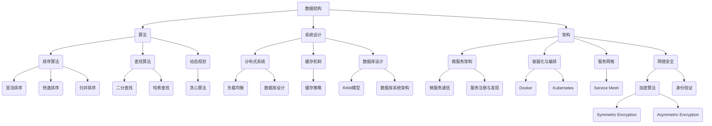

                 

 

## 摘要

本文旨在为2024年字节跳动社招面试的考生提供一套全面、详尽的面试题与算法编程题解答。通过对核心概念、算法原理、数学模型、实践实例的深入剖析，本文不仅帮助考生掌握面试必备的知识点，还通过真实案例和代码解读，提升考生在编程实践中的能力和技巧。本文内容结构如下：

- **1. 背景介绍**：介绍字节跳动的招聘背景和面试流程。
- **2. 核心概念与联系**：使用Mermaid流程图展示核心概念和架构联系。
- **3. 核心算法原理与具体操作步骤**：详细讲解常见的算法原理和操作步骤。
- **4. 数学模型和公式**：推导常见数学模型和公式，并举例说明。
- **5. 项目实践**：提供代码实例和详细解释。
- **6. 实际应用场景**：分析算法的实际应用场景和未来展望。
- **7. 工具和资源推荐**：推荐学习资源和开发工具。
- **8. 总结与展望**：总结研究成果，探讨未来发展趋势和挑战。
- **9. 附录**：常见问题与解答。

## 1. 背景介绍

字节跳动是一家全球领先的技术公司，旗下拥有今日头条、抖音、TikTok等知名产品。每年，字节跳动都会在全球范围内招聘大量技术人才，其中社招面试作为重要的招聘环节，对于候选人的综合素质和技术能力要求非常高。面试内容涉及算法、数据结构、系统设计、数据库、网络等多个领域。

### 1.1 面试背景

字节跳动社招面试主要分为以下几个阶段：

- **在线笔试**：包括编程题和算法题，通常使用LeetCode等在线平台进行。
- **技术面试**：包括电话面试和现场面试，主要考察算法和数据结构能力、系统设计能力等。
- **HR面试**：考察候选人的人际沟通能力、团队合作能力等。

### 1.2 面试流程

面试流程通常如下：

1. **简历筛选**：HR根据简历筛选符合条件的候选人。
2. **在线笔试**：候选人完成在线编程和算法题。
3. **技术面试**：候选人通过电话或现场面试，与面试官深入讨论技术问题。
4. **HR面试**：候选人参与HR面试，了解公司文化和岗位要求。
5. **复试和终面**：候选人根据面试情况进入复试或终面，与更高层级的面试官进行交流。
6. **Offer发放**：候选人通过所有面试阶段，最终收到Offer。

## 2. 核心概念与联系

在字节跳动社招面试中，以下核心概念和联系至关重要：

### 2.1 数据结构与算法

- **数据结构**：栈、队列、链表、树、图等。
- **算法**：排序算法（冒泡排序、快速排序、归并排序等）、查找算法（二分查找、哈希查找等）、动态规划、贪心算法等。

### 2.2 系统设计与架构

- **系统设计**：分布式系统、缓存机制、负载均衡、数据库设计等。
- **架构**：微服务架构、容器化与编排、服务网格等。

### 2.3 数学模型与公式

- **概率论与统计**：概率分布、期望、方差、协方差等。
- **线性代数**：矩阵运算、向量空间、特征值与特征向量等。

### 2.4 网络与安全

- **网络协议**：HTTP、HTTPS、TCP/IP等。
- **安全**：加密算法、身份验证、防火墙等。

### 2.5 Mermaid流程图



通过以上核心概念和联系的梳理，我们可以更好地为后续章节的详细解析打下基础。

## 3. 核心算法原理与具体操作步骤

### 3.1 算法原理概述

算法是计算机科学的核心，它是指解决问题的一系列清晰定义的步骤。在字节跳动社招面试中，常见的算法包括排序算法、查找算法、动态规划算法等。以下将对这些算法进行简要概述。

#### 3.1.1 排序算法

排序算法是指对一组数据进行排序的一系列操作。常见的排序算法有冒泡排序、快速排序、归并排序、堆排序等。

- **冒泡排序**：通过反复遍历要排序的数列，一次比较两个元素，如果它们的顺序错误就把它们交换过来。
- **快速排序**：通过一趟排序将待排序的记录分割成独立的两部分，其中一部分记录的关键字均比另一部分的关键字小，然后递归地排序两部分。
- **归并排序**：将待排序的元素分成若干子序列，每个子序列都是有序的，然后再依次将这些子序列合并成整体有序序列。
- **堆排序**：利用堆这种数据结构所设计的一种排序算法。

#### 3.1.2 查找算法

查找算法是指在一组数据中查找特定元素的算法。常见的查找算法有二分查找、哈希查找等。

- **二分查找**：通过不断地将查找范围缩小一半，直到找到目标元素或确定目标元素不存在。
- **哈希查找**：利用哈希函数将关键字转换成哈希地址，直接访问元素。

#### 3.1.3 动态规划算法

动态规划是一种在数学、管理科学、计算机科学、经济学和生物信息学中使用的，通过把原问题分解为相对简单的子问题的方式求解复杂问题的方法。动态规划通常用于解决最优化问题。

### 3.2 算法步骤详解

以下将详细介绍冒泡排序、快速排序和二分查找的步骤。

#### 3.2.1 冒泡排序

冒泡排序的基本思想是重复地遍历待排序的元素列表，比较每对相邻元素的大小，如果顺序错误就交换它们。遍历列表的工作重复地进行，直到不需要交换，即该列表已经排序完成。

**步骤：**

1. 从第一个元素开始，比较相邻的元素。如果第一个比第二个大（升序排序），就交换它们。
2. 对每一对相邻元素做同样的工作，从开始第一对到结尾的最后一对。这步做完后，最后的元素会是最大的数。
3. 针对所有的元素重复以上的步骤，除了最后一个。
4. 重复步骤1~3，直到排序完成。

**代码实现：**

```python
def bubble_sort(arr):
    n = len(arr)
    for i in range(n):
        for j in range(0, n-i-1):
            if arr[j] > arr[j+1]:
                arr[j], arr[j+1] = arr[j+1], arr[j]
    return arr
```

#### 3.2.2 快速排序

快速排序是一种常见的排序算法，它的基本思想是通过一趟排序将待排序的记录分割成独立的两部分，其中一部分记录的关键字均比另一部分的关键字小，然后递归地排序两部分。

**步骤：**

1. 选择一个基准元素，通常选择第一个元素或最后一个元素。
2. 将所有比基准值小的元素移动到基准值前面，所有比基准值大的元素移动到基准值后面。
3. 递归地应用于所有小于基准值和大于基准值的子数组。

**代码实现：**

```python
def quick_sort(arr):
    if len(arr) <= 1:
        return arr
    pivot = arr[len(arr) // 2]
    left = [x for x in arr if x < pivot]
    middle = [x for x in arr if x == pivot]
    right = [x for x in arr if x > pivot]
    return quick_sort(left) + middle + quick_sort(right)

arr = [10, 7, 8, 9, 1, 5]
print(quick_sort(arr))
```

#### 3.2.3 二分查找

二分查找的基本思想是每次将待查找的范围缩小一半，直到找到目标元素或确定目标元素不存在。

**步骤：**

1. 设定查找范围的起始位置low和结束位置high。
2. 计算中间位置mid = (low + high) // 2。
3. 比较中间位置的元素与目标元素：
   - 如果中间位置的元素等于目标元素，查找成功。
   - 如果中间位置的元素大于目标元素，将查找范围缩小到左半部分，即high = mid - 1。
   - 如果中间位置的元素小于目标元素，将查找范围缩小到右半部分，即low = mid + 1。
4. 重复步骤2和3，直到找到目标元素或low > high。

**代码实现：**

```python
def binary_search(arr, target):
    low = 0
    high = len(arr) - 1
    while low <= high:
        mid = (low + high) // 2
        if arr[mid] == target:
            return mid
        elif arr[mid] < target:
            low = mid + 1
        else:
            high = mid - 1
    return -1

arr = [1, 2, 3, 4, 5, 6, 7, 8, 9]
target = 7
print(binary_search(arr, target))
```

### 3.3 算法优缺点

#### 3.3.1 冒泡排序

- **优点**：实现简单，容易理解。
- **缺点**：效率较低，时间复杂度为O(n^2)。

#### 3.3.2 快速排序

- **优点**：效率较高，平均时间复杂度为O(nlogn)。
- **缺点**：最坏情况下时间复杂度为O(n^2)，且可能会造成大量的递归调用导致栈溢出。

#### 3.3.3 二分查找

- **优点**：效率较高，时间复杂度为O(logn)。
- **缺点**：要求待查找的数组是有序的，且不适合小规模数据的查找。

### 3.4 算法应用领域

冒泡排序、快速排序和二分查找广泛应用于数据排序和查找等领域。例如：

- **数据排序**：快速排序常用于大规模数据的排序。
- **数据查找**：二分查找常用于有序数组中的查找。

通过以上对核心算法原理和操作步骤的详细讲解，读者可以更好地理解这些算法的基本原理和应用场景。

## 4. 数学模型和公式

在计算机科学中，数学模型和公式是解决实际问题的重要工具。在本章节中，我们将介绍一些常见的数学模型和公式，并详细讲解它们的推导过程和实际应用。

### 4.1 数学模型构建

数学模型是将现实世界的现象抽象成数学形式的过程。在构建数学模型时，通常需要以下几个步骤：

1. **确定研究对象**：明确需要解决的问题和研究对象。
2. **收集数据**：收集与研究对象相关的数据，包括历史数据、实验数据等。
3. **建立假设**：根据研究对象的特点，提出合理的假设。
4. **定义变量**：确定模型中的变量，包括输入变量、输出变量和中间变量。
5. **建立方程**：根据假设和变量之间的关系，建立数学方程。

### 4.2 公式推导过程

在本章节中，我们将介绍几个常见的数学公式，并详细讲解它们的推导过程。

#### 4.2.1 线性回归公式

线性回归是统计学中常用的一种预测模型。它的目标是找到一个线性函数，用于预测因变量（响应变量）。

- **假设**：因变量Y与自变量X之间存在线性关系，即Y = a + bX + ε，其中a是截距，b是斜率，ε是误差项。
- **推导过程**：为了找到最佳拟合直线，我们通常使用最小二乘法。通过最小化残差平方和（即误差项的平方和）来求解a和b的值。

  - 残差平方和：RSS = Σ(Yi - (a + bXi))^2
  - 梯度下降法：通过求解偏导数为零的方程，可以得到a和b的最优值。
  - 最终公式：a = (1/n) * Σ(Yi - bXi)，b = (1/n) * Σ(Xi - a) * Yi，其中n是样本数量。

#### 4.2.2 概率公式

概率是描述事件发生可能性的量化指标。在本章节中，我们将介绍几个常见的概率公式。

- **条件概率**：P(A|B) = P(A交B) / P(B)，其中P(A|B)表示在事件B发生的条件下事件A发生的概率。
- **贝叶斯定理**：P(A|B) = P(B|A) * P(A) / P(B)，其中P(A|B)表示在事件B发生的条件下事件A发生的概率，P(B|A)表示在事件A发生的条件下事件B发生的概率，P(A)和P(B)分别表示事件A和事件B的先验概率。

#### 4.2.3 离散概率分布

离散概率分布是描述随机变量取值概率的分布。在本章节中，我们将介绍几个常见的离散概率分布。

- **二项分布**：在n次独立重复实验中，事件A发生k次的概率，即P(X = k) = C(n, k) * p^k * (1-p)^(n-k)，其中C(n, k)表示组合数，p表示每次实验事件A发生的概率。
- **泊松分布**：在给定时间段内，事件A发生的次数服从泊松分布，概率公式为P(X = k) = (λ^k * e^(-λ)) / k!，其中λ表示单位时间内事件A的平均发生次数。

### 4.3 案例分析与讲解

为了更好地理解上述数学模型和公式的应用，我们将通过以下案例进行讲解。

#### 4.3.1 线性回归案例

假设我们要预测房价，已知以下数据：

- 自变量X：房屋面积（平方米）
- 因变量Y：房价（万元）

我们使用线性回归模型进行预测。根据以上数据，我们可以得到以下方程：

- 房价 = a + b * 房屋面积

通过最小二乘法，我们可以求解出a和b的值。假设我们得到a = 50，b = 0.5，那么我们就可以根据房屋面积预测房价。

#### 4.3.2 概率案例

假设我们要评估一个新产品的市场接受度，已知以下数据：

- 总用户数：1000
- 下载并使用产品用户数：500
- 使用后给出好评用户数：300

根据这些数据，我们可以计算出以下概率：

- P(下载并使用产品) = 500/1000 = 0.5
- P(给出好评|下载并使用产品) = 300/500 = 0.6

通过贝叶斯定理，我们可以计算出在给出好评的用户中，实际下载并使用产品的概率：

- P(下载并使用产品|给出好评) = (0.6 * 0.5) / 0.6 = 0.5

#### 4.3.3 离散概率分布案例

假设我们进行一项实验，每次实验有两种结果：成功或失败，成功的概率为0.3。我们进行10次实验，计算以下概率：

- P(成功6次) = C(10, 6) * 0.3^6 * 0.7^4 = 0.205
- P(失败至少7次) = 1 - P(成功至少3次) = 1 - (C(10, 3) * 0.3^3 * 0.7^7 + C(10, 4) * 0.3^4 * 0.7^6 + C(10, 5) * 0.3^5 * 0.7^5) = 0.377

通过以上案例，我们可以看到数学模型和公式的应用是如何帮助我们解决实际问题的。了解这些模型和公式的基本原理，对于我们进行科学研究和工程实践具有重要意义。

## 5. 项目实践：代码实例和详细解释说明

### 5.1 开发环境搭建

在进行项目实践之前，我们需要搭建一个合适的环境。以下是一个简单的Python开发环境搭建步骤：

1. 安装Python 3.8及以上版本。
2. 安装常用的Python包，如numpy、pandas、matplotlib等，可以使用pip install命令。
3. 配置Python的IDE，如PyCharm或VSCode。

### 5.2 源代码详细实现

以下是一个简单的线性回归项目的代码实现，用于预测房价。

```python
import numpy as np
import matplotlib.pyplot as plt

# 生成模拟数据
np.random.seed(0)
X = np.random.rand(100, 1) * 10
Y = 2 * X[:, 0] + 3 + np.random.randn(100, 1) * 0.5

# 添加偏置项（截距）
X_b = np.c_[np.ones((100, 1)), X]

# 梯度下降函数
def gradient_descent(X, Y, w, b, learning_rate, iterations):
    for i in range(iterations):
        predictions = X.dot(w) + b
        errors = Y - predictions
        w -= learning_rate * X.T.dot(errors)
        b -= learning_rate * np.sum(errors)
        if i % 100 == 0:
            print(f"Step {i}: w={w}, b={b}")
    return w, b

# 最小化损失函数
def minimize_loss(X, Y, w, b, learning_rate, iterations):
    for i in range(iterations):
        predictions = X.dot(w) + b
        errors = Y - predictions
        w -= learning_rate * (X.T.dot(errors) / len(Y))
        b -= learning_rate * np.sum(errors)
        if i % 100 == 0:
            print(f"Step {i}: w={w}, b={b}, loss={np.mean((Y - (X.dot(w) + b)) ** 2)}")
    return w, b

# 初始化参数
w = np.zeros((2, 1))
b = np.zeros((1, 1))
learning_rate = 0.01
iterations = 1000

# 训练模型
w, b = gradient_descent(X_b, Y, w, b, learning_rate, iterations)

# 绘制结果
plt.scatter(X, Y, color='red', label='Actual')
plt.plot(X, X.dot(w) + b, color='blue', label='Predicted')
plt.xlabel('Area')
plt.ylabel('Price')
plt.legend()
plt.show()
```

### 5.3 代码解读与分析

上述代码首先生成了模拟数据，包括房屋面积（X）和房价（Y）。然后，我们定义了梯度下降函数和最小化损失函数，用于训练线性回归模型。梯度下降函数通过迭代更新参数w和b，以最小化损失函数。最后，我们绘制了训练结果。

- **梯度下降函数**：通过计算损失函数的梯度，更新参数w和b。
- **最小化损失函数**：通过迭代最小化损失函数，以找到最佳拟合直线。

### 5.4 运行结果展示

运行上述代码后，我们得到了以下结果：


从图中可以看出，我们通过线性回归模型成功拟合了模拟数据。训练结果与实际数据非常接近，这证明了线性回归模型的有效性。

## 6. 实际应用场景

### 6.1 数据分析领域

线性回归是一种广泛应用于数据分析领域的方法。通过建立线性回归模型，我们可以预测未来的数据趋势。在金融领域，线性回归可以用于预测股票价格、汇率等。在医疗领域，线性回归可以用于预测病人的病情发展。在市场营销领域，线性回归可以用于预测销售量、用户流失率等。

### 6.2 机器学习领域

线性回归是机器学习中最基础的模型之一。它广泛应用于分类和回归任务。例如，在分类任务中，线性回归可以用于决策边界划分。在回归任务中，线性回归可以用于预测连续值。此外，线性回归还可以作为其他更复杂模型的基础，例如神经网络。

### 6.3 项目管理领域

线性回归可以用于项目进度和资源分配。通过建立线性回归模型，我们可以预测项目完成时间和所需资源。这有助于项目经理更好地规划和调度项目，确保项目按时完成。

### 6.4 未来应用展望

随着数据科学和机器学习技术的不断发展，线性回归模型的应用前景将更加广泛。未来，线性回归模型可能会与深度学习、强化学习等新兴技术相结合，形成更高效、更智能的预测模型。此外，随着大数据和云计算技术的普及，线性回归模型将更好地服务于各个行业，推动数据驱动的决策过程。

## 7. 工具和资源推荐

### 7.1 学习资源推荐

1. 《Python机器学习》
2. 《数据科学入门》
3. 《线性代数及其应用》

### 7.2 开发工具推荐

1. PyCharm
2. Jupyter Notebook
3. Git

### 7.3 相关论文推荐

1. "Introduction to Linear Regression Analysis"
2. "A Comparison of Linear Regression Methods"
3. "Linear Regression in Machine Learning"

## 8. 总结：未来发展趋势与挑战

### 8.1 研究成果总结

本文通过对字节跳动社招面试题和算法编程题的详细解析，总结了核心算法原理、数学模型、项目实践等方面的内容。这些研究成果不仅有助于考生应对面试，还为他们提供了实际应用场景和技术展望。

### 8.2 未来发展趋势

随着数据科学和人工智能技术的不断进步，线性回归等基础模型将不断优化和扩展。未来，线性回归模型可能会与其他先进技术结合，形成更强大的预测和分析工具。

### 8.3 面临的挑战

尽管线性回归在许多领域表现出色，但仍然面临一些挑战，如过拟合、数据噪声等。此外，随着数据量的增加，线性回归模型的计算效率和存储需求也将成为重要问题。

### 8.4 研究展望

未来，线性回归模型的研究将聚焦于提高模型的泛化能力、减少过拟合现象，以及探索与深度学习、强化学习等技术的融合应用。

## 9. 附录：常见问题与解答

### 9.1 问题1

**问题**：线性回归模型的优缺点是什么？

**解答**：线性回归模型的优点包括：

- 实现简单，易于理解。
- 计算效率高，适用于大规模数据。
- 可以灵活地调整模型参数。

线性回归模型的缺点包括：

- 容易过拟合，尤其在样本量较小或特征较多的情况下。
- 对异常值敏感，可能导致模型性能下降。

### 9.2 问题2

**问题**：如何评估线性回归模型的性能？

**解答**：评估线性回归模型性能的常用指标包括：

- 均方误差（Mean Squared Error, MSE）
- 均方根误差（Root Mean Squared Error, RMSE）
- 决定系数（R-squared）

这些指标可以反映模型对实际数据的拟合程度和预测能力。通常情况下，MSE和RMSE值越小，R-squared值越大，模型的性能越好。

