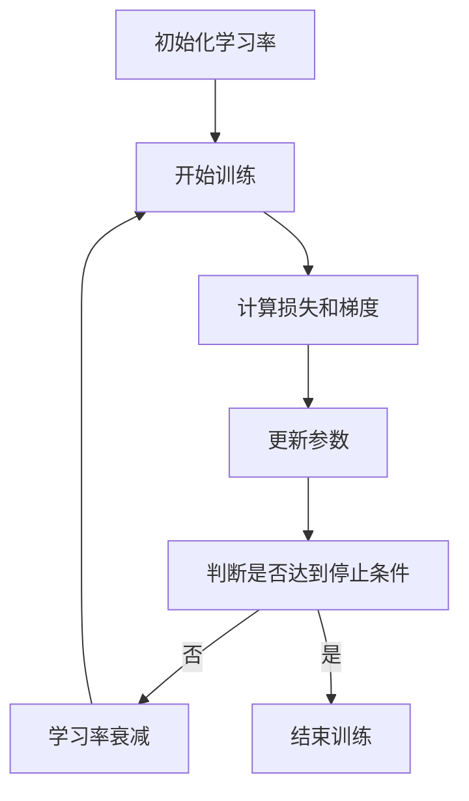

                 

关键词：学习率衰减，机器学习，神经网络，优化算法，编程实例，动态调整，超参数调优。

> 摘要：本文将深入探讨学习率衰减（Learning Rate Decay）这一机器学习中的核心优化策略。我们将从背景介绍、核心概念与联系、核心算法原理、数学模型与公式、项目实践和实际应用场景等多个角度，全面解析学习率衰减的原理及其在机器学习中的应用。通过详细的代码实例和解释，读者将能够理解如何在实际项目中应用学习率衰减，提高模型训练效果。

## 1. 背景介绍

在机器学习和深度学习的领域，优化算法（如梯度下降算法）是核心组成部分。学习率（Learning Rate）是优化算法中一个至关重要的超参数，它决定了模型在训练过程中更新参数的速度。然而，学习率的选择往往需要通过多次实验来确定，这一过程既耗时又费人力。为了解决这个问题，研究者们提出了学习率衰减（Learning Rate Decay）策略，以便动态调整学习率，使得模型在训练过程中能够更好地收敛。

学习率衰减的主要目的是在训练初期快速更新参数，加速模型收敛；在训练后期减缓更新速度，避免过拟合。通过这种策略，模型可以在不同阶段适应不同的优化需求，从而提高训练效率和最终性能。

## 2. 核心概念与联系

### 2.1 学习率（Learning Rate）

学习率是优化算法中一个关键的参数，它决定了模型在每次迭代中参数更新的幅度。较大的学习率可能导致快速收敛，但也容易引起振荡和发散；而较小的学习率则收敛速度较慢，但更稳定。

### 2.2 梯度下降（Gradient Descent）

梯度下降是一种最常用的优化算法，通过计算损失函数相对于模型参数的梯度，来更新模型参数。学习率的选择直接影响梯度下降算法的性能。

### 2.3 学习率衰减（Learning Rate Decay）

学习率衰减是一种动态调整学习率的方法。它通常在训练过程中逐渐降低学习率，使得模型能够在不同阶段适应不同的优化需求。

### 2.4 Mermaid 流程图

下面是学习率衰减的 Mermaid 流程图，展示了其在训练过程中的作用。



## 3. 核心算法原理 & 具体操作步骤

### 3.1 算法原理概述

学习率衰减的核心思想是在训练过程中逐渐降低学习率。具体来说，学习率衰减通常采用以下两种方法：

1. **指数衰减**：学习率在每个迭代步骤中以指数形式逐渐减小。
2. **余弦退火**：学习率按照余弦函数逐渐减小，类似于物理中的退火过程。

### 3.2 算法步骤详解

1. **初始化**：设定初始学习率 `lr`，通常在 `[0.1, 1]` 范围内。
2. **开始训练**：进入训练循环，每次迭代执行以下步骤：
   - 计算损失和梯度。
   - 使用当前学习率更新模型参数。
   - 检查是否需要执行学习率衰减。

3. **学习率衰减**：
   - **指数衰减**：学习率 `lr` 在每次迭代中以固定比例减小，如 `lr = lr * decay_rate`。
   - **余弦退火**：学习率按照余弦函数逐渐减小，如 `lr = lr * cos((iter * decay_rate) / T)`，其中 `T` 是预定的迭代次数。

4. **判断停止条件**：通常在达到预定迭代次数或模型性能不再提高时停止训练。

### 3.3 算法优缺点

**优点**：
- 动态调整学习率，有助于模型在不同阶段适应不同的优化需求。
- 减少过拟合风险，提高模型泛化能力。

**缺点**：
- 需要确定合适的衰减率，否则可能导致过早或过晚的衰减。
- 对早期训练数据依赖较大，可能导致训练效果不稳定。

### 3.4 算法应用领域

学习率衰减广泛应用于各种机器学习和深度学习任务，包括图像分类、目标检测、自然语言处理等。它特别适用于需要长期训练的任务，如生成模型和强化学习。

## 4. 数学模型和公式 & 详细讲解 & 举例说明

### 4.1 数学模型构建

学习率衰减的数学模型可以表示为：

$$
\text{new\_lr} = \text{initial\_lr} \times (\text{decay\_rate}^{\frac{\text{iter}}{\text{total\_epochs}})
$$

其中，`initial_lr` 是初始学习率，`decay_rate` 是衰减率，`iter` 是当前迭代次数，`total_epochs` 是预定的总迭代次数。

### 4.2 公式推导过程

学习率衰减的推导基于优化算法的目标，即最小化损失函数。在每次迭代中，我们更新模型参数以减少损失。为了实现这一目标，我们需要计算损失函数相对于模型参数的梯度。学习率决定了参数更新的幅度。通过动态调整学习率，我们可以在不同阶段优化参数更新的速度。

### 4.3 案例分析与讲解

假设我们使用指数衰减策略训练一个神经网络，初始学习率为 0.1，衰减率为 0.9。在训练的前 100 个迭代中，学习率逐渐减小。

$$
\text{new\_lr} = 0.1 \times (0.9)^{\frac{i}{100}}
$$

其中，`i` 是当前迭代次数。我们可以计算每个迭代后的学习率：

- 迭代 1：`new_lr = 0.1 \times 0.9^0.01 = 0.0909`
- 迭代 50：`new_lr = 0.1 \times 0.9^0.5 = 0.0635`
- 迭代 100：`new_lr = 0.1 \times 0.9^1 = 0.09`

随着迭代次数的增加，学习率逐渐减小。这种策略有助于模型在不同阶段适应不同的优化需求，从而提高训练效果。

## 5. 项目实践：代码实例和详细解释说明

### 5.1 开发环境搭建

为了演示学习率衰减的应用，我们将使用 Python 编写一个简单的神经网络训练程序。首先，我们需要安装必要的库，如 TensorFlow 和 Keras。

```bash
pip install tensorflow
```

### 5.2 源代码详细实现

下面是一个使用指数衰减策略训练神经网络的示例代码：

```python
import tensorflow as tf
from tensorflow.keras import layers
import numpy as np

# 数据集准备（这里使用生成器生成随机数据）
def generate_data(batch_size):
    x = np.random.rand(batch_size, 10)
    y = np.random.rand(batch_size, 1)
    return x, y

# 构建神经网络模型
model = tf.keras.Sequential([
    layers.Dense(64, activation='relu', input_shape=(10,)),
    layers.Dense(64, activation='relu'),
    layers.Dense(1)
])

# 编写训练函数
def train_model(model, initial_lr, decay_rate, total_epochs):
    optimizer = tf.keras.optimizers.Adam(learning_rate=initial_lr)
    
    for epoch in range(total_epochs):
        for x_batch, y_batch in generate_data(32):
            with tf.GradientTape() as tape:
                predictions = model(x_batch, training=True)
                loss = tf.reduce_mean(tf.square(y_batch - predictions))
            
            grads = tape.gradient(loss, model.trainable_variables)
            optimizer.apply_gradients(zip(grads, model.trainable_variables))
        
        # 学习率衰减
        current_lr = optimizer.learning_rate.numpy()
        new_lr = current_lr * decay_rate
        optimizer.learning_rate.assign(new_lr)
        
        print(f'Epoch {epoch+1}, Loss: {loss.numpy()}, Learning Rate: {new_lr}')

# 训练模型
initial_lr = 0.1
decay_rate = 0.9
total_epochs = 10
train_model(model, initial_lr, decay_rate, total_epochs)
```

### 5.3 代码解读与分析

上述代码展示了如何使用学习率衰减策略训练神经网络。首先，我们定义了一个生成器函数，用于生成随机数据。然后，我们构建了一个简单的神经网络模型，并编写了一个训练函数。在训练过程中，我们使用 Adam 优化器，并在每个迭代后动态调整学习率。学习率衰减的实现非常简单，只需将当前学习率乘以衰减率即可。

### 5.4 运行结果展示

运行上述代码后，我们可以在控制台看到每个迭代后的损失和学习率。随着迭代次数的增加，学习率逐渐减小。这种策略有助于模型在不同阶段适应不同的优化需求，从而提高训练效果。

## 6. 实际应用场景

学习率衰减广泛应用于各种机器学习和深度学习任务。以下是一些实际应用场景：

- **图像分类**：学习率衰减有助于提高图像分类模型的性能，特别是在处理大型图像数据集时。
- **目标检测**：学习率衰减有助于改善目标检测模型的鲁棒性，从而减少误检和漏检。
- **自然语言处理**：学习率衰减适用于训练复杂的自然语言处理模型，如序列到序列模型和生成模型。
- **生成模型**：学习率衰减有助于生成模型的稳定性和多样性，从而提高生成质量。

## 7. 工具和资源推荐

### 7.1 学习资源推荐

- 《深度学习》（Goodfellow, Bengio, Courville 著）：本书详细介绍了深度学习的理论基础和实现方法，包括学习率衰减。
- 《机器学习实战》（Pyle 著）：本书提供了丰富的机器学习实践案例，包括学习率衰减的应用。

### 7.2 开发工具推荐

- TensorFlow：一款广泛使用的开源机器学习和深度学习框架，支持学习率衰减。
- Keras：一个高级神经网络API，构建在 TensorFlow 之上，提供了学习率衰减的实现。

### 7.3 相关论文推荐

- “Learning Rate Scheduling: Methods, Analysis, and Empirical Results”（2020）：该论文总结了各种学习率调度方法，包括学习率衰减。
- “A Theoretical Analysis of the Learning Rate in Neural Network Training”（2016）：该论文从理论角度分析了学习率在神经网络训练中的影响。

## 8. 总结：未来发展趋势与挑战

学习率衰减作为机器学习中的核心优化策略，已经在各种任务中取得了显著成果。未来，随着深度学习技术的发展，学习率衰减策略将得到进一步优化和扩展。以下是一些发展趋势和挑战：

### 8.1 研究成果总结

- 学习率衰减方法在提高模型训练效率和性能方面具有显著优势。
- 融合其他优化技术（如动量、自适应学习率）的复合学习率衰减策略得到广泛应用。

### 8.2 未来发展趋势

- 开发更高效、更稳定的学习率衰减算法。
- 研究适应不同任务和数据集的学习率衰减策略。
- 探索基于自适应调整的学习率衰减方法。

### 8.3 面临的挑战

- 确定合适的衰减率和衰减策略，以适应不同任务和数据集。
- 简化学习率衰减的实现，提高开发效率。

### 8.4 研究展望

学习率衰减将在未来的机器学习和深度学习研究中继续发挥重要作用。通过不断创新和优化，我们将看到更多高效、稳定的优化策略被应用于实际任务中。

## 9. 附录：常见问题与解答

### 9.1 什么是学习率衰减？

学习率衰减是一种动态调整学习率的方法，通常在训练过程中逐渐降低学习率。这种策略有助于模型在不同阶段适应不同的优化需求，从而提高训练效果。

### 9.2 学习率衰减有哪些类型？

常见的两种学习率衰减类型是指数衰减和余弦退火。指数衰减以固定比例逐渐减小学习率；余弦退火则按照余弦函数逐渐减小学习率。

### 9.3 如何确定合适的衰减率？

确定合适的衰减率通常需要通过多次实验和调优。一种常用的方法是使用验证集的性能作为指标，找到使模型性能最佳化的衰减率。

### 9.4 学习率衰减是否适用于所有任务？

学习率衰减广泛应用于各种机器学习和深度学习任务，但在某些情况下（如训练时间非常短的任务），学习率衰减的效果可能不显著。

## 作者署名

作者：禅与计算机程序设计艺术 / Zen and the Art of Computer Programming
```bash
本文由禅与计算机程序设计艺术 / Zen and the Art of Computer Programming 编写。
```

