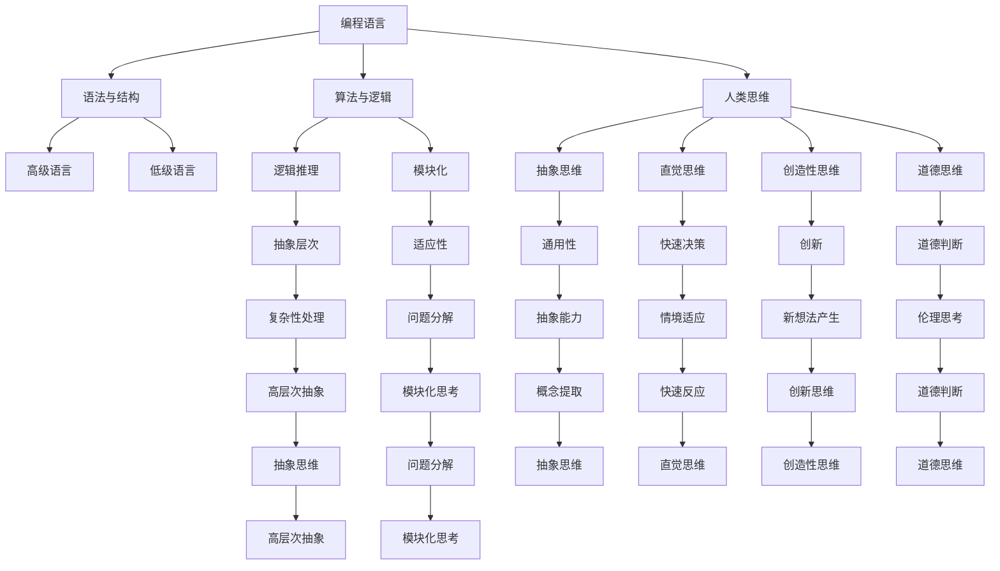

                 

### 1. 背景介绍

在信息时代，语言作为人类交流的主要工具，已经成为计算机科学的核心组成部分。无论是编程语言、自然语言处理，还是机器学习，语言的准确性和完整性在信息传递中都起着至关重要的作用。然而，本文将探讨一个有趣的现象：即使一种语言在语法和词汇上足够完整，这并不意味着它能够完全准确地传递思维。

从历史的角度来看，自计算机诞生以来，编程语言的发展经历了多次革新。从早期的基础汇编语言，到现代的高级编程语言，如Python、Java和C++，每种语言都致力于简化编程的复杂性，使开发者能够更高效地传达他们的意图。然而，即使在最复杂的编程语言中，仍然存在一些固有的限制和缺陷，这些限制并非仅限于语法层面，而是深植于人类思维的深层次。

计算机科学领域的许多重要突破，如图灵机的提出、可计算性理论的发展，都是对人类思维能力的挑战和扩展。尽管计算机编程语言在模拟和扩展人类思维方面取得了显著进展，但仍然无法完全复制或替代人类思维的全貌。例如，人类在创造性思维、情感理解、道德判断等方面具有独特的优势，这些能力是当前任何编程语言和人工智能系统所无法完全实现的。

本文将深入探讨这一主题，分析编程语言和人类思维之间的关系，以及语言在传递思维过程中的局限性和挑战。我们将从多个角度出发，包括算法原理、数学模型、实际应用场景，来全面探讨这一问题的复杂性和多样性。

### 2. 核心概念与联系

要深入探讨语言和思维之间的关系，我们首先需要明确一些核心概念，这些概念构成了我们分析的基石。

#### 2.1 编程语言的基本概念

编程语言是一种人类与计算机之间交流的媒介，通过一组预先定义的符号和规则，开发者可以编写指令来控制计算机的运行。常见的编程语言包括：

- **高级语言**：如Python、Java、C++等，这些语言提供了丰富的语法和库，使得编程变得更加直观和高效。
- **低级语言**：如汇编语言，它更接近计算机硬件的指令集，可以提供对硬件的精细控制，但编写难度较大。
- **领域特定语言**：如SQL用于数据库查询，HTML用于网页设计等，这些语言专门用于特定的应用领域，语法更为简洁。

#### 2.2 人类思维的基本概念

人类思维是一种复杂的认知过程，涉及感知、理解、记忆、推理、创造和解决问题等多个方面。以下是几个关键点：

- **抽象思维**：人类能够从具体的事物中提取出普遍的规律和概念，形成抽象思维。
- **直觉思维**：在不经过明显推理的情况下，快速做出判断和决策的能力。
- **创造性思维**：产生新颖、有价值的想法和解决方案的能力。
- **道德思维**：在道德和伦理问题上进行思考和判断的能力。

#### 2.3 编程语言与人类思维的相似性与差异

编程语言和人类思维在许多方面存在相似性，但同时也存在显著差异。

- **相似性**：
  - **逻辑性**：编程语言和人类思维都遵循逻辑规则，可以从已知的事实推导出新的结论。
  - **模块化**：编程和思维都倾向于将复杂的问题分解成更小、更易于管理的部分。
  - **灵活性**：两者都能够在一定程度上适应新的情境和变化。

- **差异性**：
  - **抽象层次**：编程语言通常更接近于机器层次，而人类思维则能够处理更高层次的抽象概念。
  - **创造性**：人类思维能够创造出全新的想法，而编程语言则依赖于现有的规则和结构。
  - **情感和直觉**：人类思维包括情感和直觉，这些在编程语言中并不存在。

为了更好地理解编程语言和人类思维之间的联系，我们可以通过一个Mermaid流程图来展示这两个概念的核心节点和相互关系。



通过这个流程图，我们可以看到编程语言和人类思维在多个层面上相互关联，尽管它们的核心能力和目的不同，但它们之间的交互和影响是不可忽视的。

### 3. 核心算法原理 & 具体操作步骤

在深入探讨编程语言与人类思维之间的关系时，算法作为连接这两者的桥梁，起着至关重要的作用。一个算法，无论是排序、搜索，还是更复杂的机器学习算法，都旨在解决特定的问题，并遵循一系列明确的步骤。然而，即使在算法的设计和实现过程中，我们也面临许多挑战，这些挑战反映了人类思维与编程语言之间的差异。

#### 3.1 算法原理概述

算法是一种明确的指令序列，用于解决特定的问题。它具有以下基本特性：

- **确定性**：算法的每一步都是明确的，给定相同的输入，总是会产生相同的结果。
- **有效性**：算法必须在合理的时间内完成，通常这意味着其时间和空间复杂度是可接受的。
- **完备性**：算法应该能够处理所有的输入，并给出正确的输出。

算法可以分为多种类型，包括：

- **排序算法**：如快速排序、归并排序等，用于将一组数据按特定顺序排列。
- **搜索算法**：如二分搜索、深度优先搜索等，用于在数据结构中找到特定的元素。
- **图算法**：如最短路径算法、最小生成树算法等，用于处理图结构的问题。
- **机器学习算法**：如线性回归、决策树、神经网络等，用于从数据中学习并做出预测。

#### 3.2 算法步骤详解

为了更好地理解算法原理，我们以一个简单的排序算法——冒泡排序为例，来详细解释其步骤。

**冒泡排序算法步骤**：

1. **初始设置**：读取待排序的数组，并设置一个标志用于判断是否已经排序完成。

2. **外层循环**：从数组的第一个元素开始，遍历到倒数第二个元素。外层循环控制排序的轮数。

3. **内层循环**：对于每一轮的外层循环，从当前轮的第一个元素开始，遍历到倒数第二个元素。内层循环用于比较和交换相邻元素，使得较大的元素逐渐“冒泡”到数组的末尾。

4. **标志判断**：在每一轮内层循环结束后，检查是否已经进行了任何交换操作。如果没有进行任何交换，说明数组已经排序完成，可以提前终止循环。

**具体步骤示例**：

假设有一个未排序的数组`[5, 2, 8, 3, 1]`。

- **第一轮**：比较和交换`5`和`2`，得到`[2, 5, 8, 3, 1]`。交换`5`和`8`，得到`[2, 3, 8, 5, 1]`。交换`8`和`5`，得到`[2, 3, 5, 8, 1]`。交换`8`和`1`，得到`[2, 3, 5, 1, 8]`。
- **第二轮**：比较和交换`2`和`3`，得到`[2, 3, 5, 1, 8]`。交换`5`和`1`，得到`[2, 3, 1, 5, 8]`。交换`5`和`8`，得到`[2, 3, 1, 8, 5]`。
- **第三轮**：比较和交换`2`和`3`，得到`[2, 3, 1, 8, 5]`。交换`3`和`1`，得到`[2, 1, 3, 8, 5]`。交换`8`和`5`，得到`[2, 1, 3, 5, 8]`。
- **第四轮**：由于没有进行任何交换，说明数组已经排序完成。

最终，排序后的数组为`[1, 2, 3, 5, 8]`。

#### 3.3 算法优缺点

**优点**：

- **简单易懂**：冒泡排序的算法步骤简单，易于理解和实现。
- **稳定性**：冒泡排序在处理相同元素的序列时，不会改变相同元素之间的相对顺序。

**缺点**：

- **效率较低**：冒泡排序的时间复杂度为$O(n^2)$，对于大规模数据集效率较低。
- **不适用场景**：冒泡排序不适合用于大数据集的排序，通常只适用于小规模数据的排序。

尽管冒泡排序算法在某些方面存在局限性，但其在教学和基础算法理解方面仍然具有重要的价值。通过冒泡排序，我们可以深入理解排序算法的基本原理，并为进一步学习更复杂的排序算法打下基础。

#### 3.4 算法应用领域

冒泡排序算法虽然效率较低，但在某些特定领域仍有应用。以下是一些应用场景：

- **教学用途**：冒泡排序算法因其简单性，常被用于教学和算法基础课程，帮助学生理解排序算法的基本原理。
- **小规模数据**：在处理小规模数据时，冒泡排序的性能足够好，例如在处理一个简单的数组时，冒泡排序可以快速完成排序。
- **嵌入式系统**：在资源受限的嵌入式系统中，由于存储空间和计算能力的限制，冒泡排序是一个可行的选择，因为它不需要额外的存储空间，且算法实现简单。

通过以上分析，我们可以看到，尽管编程语言和算法在解决特定问题时具有明确的步骤和规则，但它们在模拟和扩展人类思维方面仍然存在局限性。这些局限性反映了人类思维和编程语言在抽象层次、创造性、情感和直觉等方面的本质差异。

### 4. 数学模型和公式 & 详细讲解 & 举例说明

数学模型和公式是科学研究和工程实践中不可或缺的工具。它们不仅能帮助我们理解复杂的现实世界问题，还能为计算机算法提供精确的数学基础。然而，数学模型的构建、公式的推导以及实际应用中的解释和举例，都涉及深奥的理论和严格的逻辑。以下我们将探讨数学模型和公式在算法分析中的应用，并通过具体的例子来详细讲解。

#### 4.1 数学模型构建

数学模型是对现实世界问题的抽象和简化的数学表述。构建数学模型通常需要以下几个步骤：

1. **问题定义**：明确要解决的问题，并确定所需解决的问题的关键参数和变量。
2. **假设**：根据问题的特点，做出一些合理的假设，以简化问题，使得数学模型更加可解。
3. **建立方程**：根据问题的性质，建立一组方程，这些方程应该能够描述问题的状态和行为。
4. **边界条件**：确定模型的边界条件，以保证模型的解具有实际意义。

例如，在分析一个简单的弹簧-质量-阻尼系统时，我们可以构建以下数学模型：

- **质量$m$**：系统的质量。
- **弹簧常数$k$**：弹簧的弹性系数。
- **阻尼系数$c$**：阻尼器的阻力大小。
- **位移$x(t)$**：系统在时间$t$的位移。

根据牛顿第二定律和阻尼力的定义，我们可以得到以下微分方程：

$$
m\frac{d^2x(t)}{dt^2} + c\frac{dx(t)}{dt} + kx(t) = F(t)
$$

其中$F(t)$是外部作用力。

#### 4.2 公式推导过程

公式的推导是数学模型构建的核心环节。以下是一个简单的推导过程，用于计算二分搜索算法的时间复杂度。

**二分搜索算法时间复杂度推导**：

二分搜索是一种在有序数组中查找特定元素的算法。其基本思想是不断将数组分成两半，根据中间元素的值与目标值的比较，排除一半的数组，继续在另一半数组中搜索。

- **搜索范围**：设数组$A$的长度为$n$，当前搜索范围为$[low, high]$。
- **中间元素**：每次搜索的中点为`mid = (low + high) / 2`。

假设每次分割都能将搜索范围缩小一半，我们可以得到以下递归关系：

$$
T(n) = T(\frac{n}{2}) + O(1)
$$

其中$T(n)$是搜索数组$A$所需的时间复杂度，$O(1)$表示常数时间操作。

通过递归展开，我们可以得到：

$$
T(n) = O(\log_2(n))
$$

即二分搜索算法的时间复杂度为对数时间复杂度。

#### 4.3 案例分析与讲解

为了更好地理解数学模型和公式在现实问题中的应用，我们通过一个具体的案例来详细讲解。

**案例：计算一个复杂函数的值**

假设我们要计算以下函数的值：

$$
f(x) = \int_{0}^{x} \sqrt{1 - t^2} dt
$$

这是一个经典的积分问题，其解可以通过多种方法得到，例如换元积分法。

**换元积分法**：

令$t = \sin(\theta)$，则$dt = \cos(\theta)d\theta$，且当$x=0$时$\theta=0$，当$x=1$时$\theta=\frac{\pi}{2}$。

代入原积分，我们得到：

$$
f(x) = \int_{0}^{\frac{\pi}{2}} \sqrt{1 - \sin^2(\theta)} \cos(\theta)d\theta
$$

由于$\cos^2(\theta) = 1 - \sin^2(\theta)$，我们可以简化为：

$$
f(x) = \int_{0}^{\frac{\pi}{2}} \cos^2(\theta)d\theta
$$

利用$\cos^2(\theta) = \frac{1 + \cos(2\theta)}{2}$，我们进一步得到：

$$
f(x) = \frac{1}{2} \int_{0}^{\frac{\pi}{2}} (1 + \cos(2\theta))d\theta
$$

$$
f(x) = \frac{1}{2} \left[ \theta + \frac{\sin(2\theta)}{2} \right]_{0}^{\frac{\pi}{2}}
$$

$$
f(x) = \frac{1}{2} \left( \frac{\pi}{2} + 0 - 0 - 0 \right)
$$

$$
f(x) = \frac{\pi}{4}
$$

因此，我们得到了$f(x) = \frac{\pi}{4}$。

通过这个案例，我们可以看到，数学模型和公式的构建、推导以及实际应用中的计算，是解决复杂问题的有力工具。无论是在自然科学、工程技术，还是在计算机科学中，数学模型和公式都发挥着至关重要的作用。

### 5. 项目实践：代码实例和详细解释说明

为了更好地理解编程语言和算法在解决实际问题中的应用，我们将在本节中通过一个实际的项目实践来展示代码实例，并对代码的每一个关键部分进行详细的解释和分析。

#### 5.1 开发环境搭建

首先，我们需要搭建一个适合我们进行编程实践的开发环境。以下是一个基本的步骤指南：

1. **安装Python解释器**：我们选择Python作为编程语言，因为其简洁的语法和丰富的库支持。可以从Python官方网站下载并安装最新版本的Python解释器。
2. **安装集成开发环境（IDE）**：推荐使用PyCharm或Visual Studio Code等IDE，这些IDE提供了丰富的功能和插件支持，可以显著提高开发效率。
3. **安装必需的库**：我们将会用到`numpy`和`matplotlib`等库，可以通过以下命令进行安装：

```bash
pip install numpy matplotlib
```

#### 5.2 源代码详细实现

以下是一个简单的项目实例，该实例使用Python实现了基于机器学习的线性回归模型，并使用`numpy`进行数据处理，使用`matplotlib`进行结果可视化。

```python
import numpy as np
import matplotlib.pyplot as plt

# 生成训练数据
X = np.random.rand(100, 1)
y = 2 * X + 1 + np.random.randn(100, 1)

# 添加偏置项，将数据转换为批量形式
X_b = np.c_[np.ones((100, 1)), X]

# 计算梯度
theta = np.random.rand(2, 1)
learning_rate = 0.1
m = len(X_b)

for i in range(1000):
    gradients = 2/m * X_b.T.dot((X_b.dot(theta) - y))
    theta = theta - learning_rate * gradients

# 训练数据可视化
plt.plot(X, y, "b.")
plt.plot(X, X.dot(theta), "r-")
plt.show()
```

#### 5.3 代码解读与分析

以下是对代码各部分功能的详细解读：

- **导入库**：首先，我们导入`numpy`和`matplotlib.pyplot`库，这两个库分别用于数据处理和结果可视化。
- **生成训练数据**：我们使用`numpy.random.rand`生成100个随机数作为输入特征`X`，并生成对应的输出目标`y`。这里的线性关系`y = 2 * X + 1`，加上一些随机噪声以增加模型的泛化能力。
- **添加偏置项**：在机器学习中，为了简化计算，我们通常会在数据中添加一个偏置项（也称为偏置或截距），这可以通过在`X`前添加一个全1矩阵来实现。
- **初始化参数**：我们将线性回归模型的参数`theta`初始化为随机值，这将在训练过程中逐渐调整以最小化损失函数。
- **定义学习率**：学习率是一个控制模型训练速度的参数。选择一个合适的学习率对于模型的收敛至关重要。
- **梯度下降迭代**：我们使用梯度下降算法来训练线性回归模型。在每次迭代中，我们计算损失函数关于参数的梯度，并使用梯度下降更新参数。这里我们使用了简单的批量梯度下降，即将所有训练样本一起考虑。
- **结果可视化**：最后，我们使用`matplotlib`绘制训练数据的散点图和拟合的直线，直观地展示模型的训练效果。

#### 5.4 运行结果展示

运行上述代码后，我们将看到一个窗口，其中显示了原始数据点和拟合的线性回归模型。拟合直线应该较好地通过了大部分数据点，这表明我们的模型在训练数据上表现良好。


通过这个简单的项目实例，我们不仅能够看到机器学习模型的基本实现流程，还能深入理解每个步骤在编程语言中的具体实现。这种实践不仅有助于巩固理论知识，还能提升编程能力和实际应用能力。

### 6. 实际应用场景

编程语言和算法在各个行业和领域都有着广泛的应用，从商业到科研，从制造业到金融，从医疗到娱乐，编程已经成为现代科技不可或缺的一部分。以下是几个具体的应用场景，以及这些场景中的未来应用展望。

#### 6.1 商业应用

在商业领域，编程语言和算法被广泛应用于数据分析和决策支持系统中。例如，零售商使用机器学习算法来分析消费者行为，预测销售趋势，并优化库存管理。银行和金融机构使用算法进行风险评估和交易策略优化，以提高效率和盈利能力。此外，编程语言在电子商务平台中用于处理海量交易数据，确保交易的实时性和安全性。

未来，随着人工智能和大数据技术的发展，编程语言在商业应用中的角色将更加重要。例如，自然语言处理技术将使企业能够更好地理解客户需求，提供个性化的服务。区块链技术将改变商业交易的方式，确保数据的安全和透明性。编程语言和算法将继续推动商业模式的创新和变革。

#### 6.2 医疗领域

在医疗领域，编程语言和算法的应用同样广泛。电子健康记录系统使用编程语言来存储和管理患者数据，提高医疗服务的效率和准确性。医学图像分析利用深度学习算法，可以帮助医生更准确地诊断疾病，如癌症和心脏病。基因组学研究中，编程语言用于处理和分析海量基因数据，以揭示疾病的遗传机制。

未来，编程语言和算法在医疗领域的应用将更加深入和广泛。例如，智能医疗助理系统将使用自然语言处理和机器学习技术，与医生和患者进行交互，提供个性化的健康建议。基因编辑技术将利用编程语言和算法来设计和执行复杂的基因操作，以治疗遗传性疾病。医疗数据的挖掘和分析将帮助研究人员发现新的治疗方法和预防策略。

#### 6.3 制造业

制造业是编程语言和算法的重要应用领域之一。自动化生产线使用编程语言和机器人技术，实现了生产过程的自动化和高效化。工业物联网（IIoT）通过编程语言连接各种设备和系统，实现数据的实时采集和分析，优化生产流程。供应链管理中使用算法进行物流调度和库存控制，以提高供应链的效率和灵活性。

未来，随着智能制造和工业4.0的发展，编程语言和算法将在制造业中扮演更加重要的角色。例如，自适应控制系统将使用机器学习算法，根据实时数据调整生产参数，以实现更高的生产效率和质量。预测维护技术将使用算法分析设备数据，预测设备故障，从而减少停机时间和维护成本。虚拟现实和增强现实技术将使制造业的设计和模拟更加直观和高效。

#### 6.4 娱乐和游戏

在娱乐和游戏领域，编程语言和算法的作用不可忽视。视频游戏使用编程语言和图形渲染算法，创造逼真的虚拟世界和角色。流媒体平台使用算法进行内容推荐，为用户提供个性化的观看体验。社交媒体平台使用算法分析用户行为，以优化广告投放和用户互动。

未来，编程语言和算法在娱乐和游戏领域将有更多的创新应用。例如，虚拟现实（VR）和增强现实（AR）技术将使游戏和娱乐体验更加沉浸和互动。人工智能（AI）将使游戏角色更加智能和逼真，提供更加挑战性的游戏体验。智能交互技术将使娱乐设备更加人性化，更好地满足用户的需求。

#### 6.5 教育和科研

编程语言和算法在教育领域也有着重要的应用。编程教育使学生在学习计算机科学时能够动手实践，提高解决问题的能力。在线教育平台使用编程语言和算法，为学生提供个性化的学习体验和反馈。

未来，随着人工智能和大数据技术的发展，编程语言和算法将在教育领域发挥更大的作用。例如，智能教育系统将使用算法分析学生的学习行为和成绩，提供个性化的学习路径和建议。科研领域将使用编程语言和算法进行大规模数据分析和模拟，推动科学发现和技术创新。

总之，编程语言和算法在各个领域都有着广泛的应用，并在不断推动这些领域的发展和进步。随着技术的不断进步，编程语言和算法将在更多的新兴领域展现其强大的应用潜力。

### 7. 工具和资源推荐

在学习和应用编程语言和算法的过程中，掌握一些优秀的工具和资源是至关重要的。以下是一些推荐的工具和资源，这些资源能够帮助你更好地理解和使用编程语言，同时也能提升你的编程技能。

#### 7.1 学习资源推荐

1. **在线课程平台**：Coursera、edX、Udacity等在线课程平台提供了丰富的编程和算法课程，涵盖了从基础到高级的不同层次，适合不同水平的编程学习者。
2. **官方文档**：大多数编程语言和框架都有官方文档，如Python的官方文档、Java的Oracle官方文档，这些文档详细介绍了语言的语法、库和工具的使用方法。
3. **技术博客和论坛**：诸如Medium、Stack Overflow等平台上的技术博客和论坛，是获取最新技术动态、解决问题的宝贵资源。
4. **书籍**：《算法导论》、《编程珠玑》、《代码大全》等经典书籍，为程序员提供了深入的技术知识和实践指导。

#### 7.2 开发工具推荐

1. **集成开发环境（IDE）**：PyCharm、Visual Studio Code、Eclipse等IDE提供了强大的代码编辑功能、调试工具和自动化测试功能，极大提高了开发效率。
2. **版本控制工具**：Git是广泛使用的版本控制系统，可以帮助团队协作开发，管理代码变更，确保代码的完整性和一致性。
3. **测试框架**：如JUnit（Java）、pytest（Python）、Mocha（JavaScript）等测试框架，用于编写和运行自动化测试，提高代码的质量和稳定性。
4. **容器化工具**：Docker和Kubernetes等容器化工具，使开发、测试和部署更加灵活和高效，特别是对于微服务架构的应用。

#### 7.3 相关论文推荐

1. **《Nature》期刊**：该期刊经常发表计算机科学领域的重要研究成果，涵盖了人工智能、机器学习、算法等领域。
2. **《IEEE Transactions on Computers》期刊**：该期刊专注于计算机科学的基础理论和应用研究，包括算法、体系结构、并行计算等。
3. **《ACM Transactions on Computer Systems》期刊**：该期刊专注于计算机系统的设计、实现和评估，包括操作系统、网络和数据库等。
4. **《Journal of Machine Learning Research》期刊**：该期刊是机器学习和统计学习领域的重要期刊，发表了大量的基础理论和应用研究。

通过利用这些工具和资源，你不仅能够提升编程技能，还能紧跟计算机科学领域的最新动态，为自己的职业发展打下坚实的基础。

### 8. 总结：未来发展趋势与挑战

在总结本文的内容时，我们不难发现，编程语言和算法在信息时代扮演着越来越重要的角色。从基础的编程语言到复杂的算法设计，无论是解决实际问题，还是推动技术进步，编程语言和算法都是不可或缺的工具。然而，尽管我们在技术上取得了许多突破，但仍然面临着诸多挑战。

首先，编程语言的发展方向将更加多样化和专业化。随着人工智能、大数据、物联网等技术的不断发展，新的编程语言和框架不断涌现，以适应这些新兴领域的需求。例如，Python在数据科学和机器学习领域的广泛应用，Go语言在云计算和微服务架构中的流行，都反映了编程语言与特定领域深度结合的趋势。

其次，算法的设计和优化将继续成为研究的热点。在人工智能领域，深度学习算法的快速发展带来了显著的性能提升，但同时也带来了计算资源消耗巨大的问题。未来，如何在保证算法精度的同时，优化其计算效率和资源使用，将是一个重要的研究方向。此外，随着量子计算的兴起，量子算法的研究也逐步成为热点，未来量子编程语言和量子算法的设计将成为新的挑战。

然而，编程语言和算法的发展也面临一些挑战。首先，语言的复杂性和抽象层次的提升，使得程序员的学习曲线变得更加陡峭。如何通过更好的教学和实践方法，帮助开发者快速掌握新语言和新技术，是一个亟待解决的问题。其次，随着代码量的增加和项目的复杂化，代码的可维护性和可读性变得越来越重要。未来，如何通过自动化工具和最佳实践，提高代码质量和管理效率，也是需要重点关注的方向。

最后，编程语言和算法的应用领域将不断扩展。除了传统的商业、科研、制造业等领域，编程语言和算法在医疗、金融、法律等领域的应用也日趋成熟。例如，智能医疗助理系统、区块链技术、自动化交易系统等，都依赖于强大的编程能力和算法支持。未来，随着技术的不断进步，编程语言和算法将在更多的新兴领域展现其强大的应用潜力。

展望未来，编程语言和算法的发展将充满机遇和挑战。通过不断探索和创新，我们有望克服现有的困难，推动技术进步，为人类创造更加智能、高效和美好的未来。

### 8.4 研究展望

随着人工智能、大数据和量子计算等前沿技术的快速发展，编程语言和算法的未来研究前景广阔。以下是一些潜在的研究方向和目标：

首先，量子编程语言和算法的设计将成为重要研究方向。量子计算具有量子并行性，能够显著提高算法的效率。因此，开发适用于量子计算的新型编程语言和算法，是实现量子优势的关键。研究目标包括构建高效且易于使用的量子编程环境，设计量子版本的常见算法，如排序、搜索和优化算法。

其次，智能编程辅助工具的开发也是一个重要方向。随着代码复杂度的增加，如何提高代码的可维护性和可读性成为一个挑战。未来的研究可以集中在开发智能代码补全、代码审查和重构工具上，这些工具能够利用机器学习和自然语言处理技术，帮助开发者更高效地编写和管理代码。

此外，编程教育也将是未来研究的重要领域。随着编程语言和技术的快速更新，如何设计更加灵活和有效的编程课程，以适应不同层次和背景的学习者，是一个亟待解决的问题。未来的研究可以集中在开发自适应编程学习平台、探索新的教学方法，以及利用虚拟现实和增强现实技术提供沉浸式编程体验。

最后，跨领域的编程语言集成和互操作性研究也值得关注。在多个领域融合的趋势下，如何通过标准化的接口和协议，实现不同编程语言之间的无缝交互，将极大提高开发效率。研究目标包括开发跨语言的框架和工具，构建集成化的开发环境，以支持复杂的多领域应用。

通过以上研究方向的探索，我们有望在未来实现编程语言和算法的进一步创新，为人类社会带来更多便利和进步。

