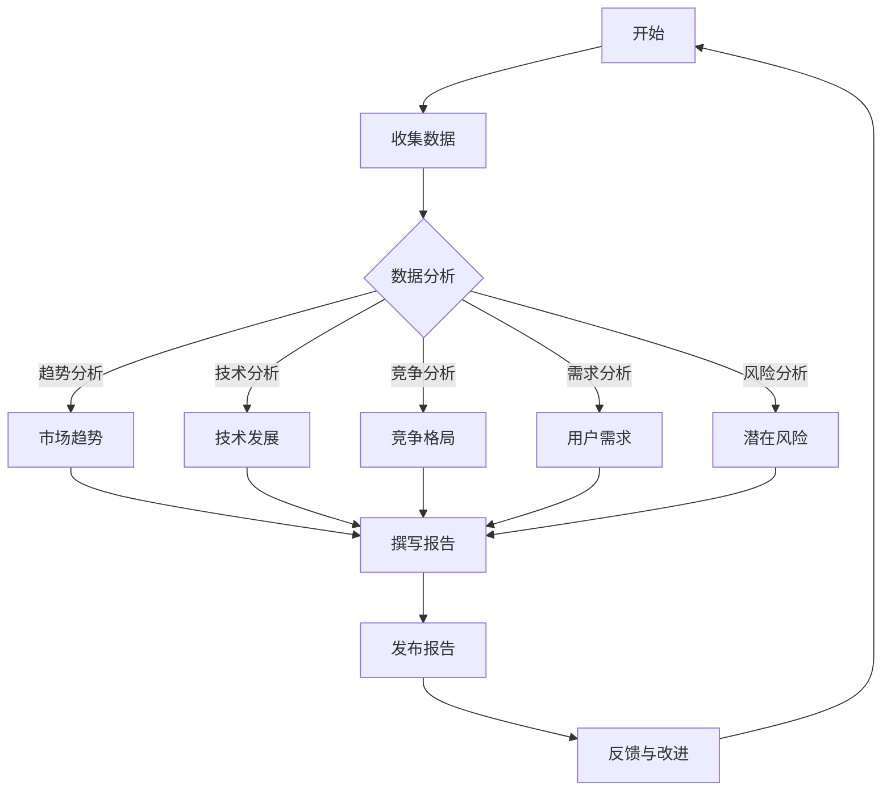

                 

关键词：行业洞察、专业度、技术报告、市场趋势、数据分析

> 摘要：本文将探讨定期发布行业洞察报告的重要性，以及如何通过这种报告展示个人或团队在IT领域的专业度。文章将涵盖报告的核心内容、撰写技巧、以及未来发展的趋势和挑战。

## 1. 背景介绍

在快速发展的信息技术领域，知识的更新速度远超其他行业。作为IT专业人士，如何持续提升自己的专业度、保持对市场动态的敏锐洞察，成为了关键问题。定期发布行业洞察报告是一种有效的方式，它不仅可以帮助个人或团队展示专业度，还能为企业决策提供有力支持。

行业洞察报告通常涵盖市场趋势、技术发展、竞争对手动态、用户需求等方面，通过对这些信息的深入分析，为企业提供决策依据。因此，撰写高质量的行业洞察报告，不仅需要丰富的专业知识，还需要扎实的分析能力和良好的沟通技巧。

## 2. 核心概念与联系

### 2.1 行业洞察报告的定义

行业洞察报告是对某一行业或领域的全面分析和评估，旨在揭示市场趋势、技术发展方向、竞争格局以及潜在风险。报告通常包括以下内容：

1. **市场趋势**：分析行业的整体发展趋势，包括市场规模、增长速度、消费者行为等。
2. **技术发展**：探讨行业内的技术创新、应用场景以及可能带来的影响。
3. **竞争格局**：分析主要竞争对手的商业模式、市场份额、产品特点等。
4. **用户需求**：研究目标用户的需求变化，以及这些变化如何影响产品设计和市场营销。
5. **潜在风险**：识别行业面临的潜在风险，包括政策法规、技术挑战、市场不确定性等。

### 2.2 行业洞察报告与专业度的联系

行业洞察报告的撰写过程是对专业知识的深度挖掘和整理。通过撰写报告，个人或团队能够系统地梳理所学知识，加深对行业的理解。同时，报告的质量直接反映了撰写者的专业度。一个高质量的行业洞察报告应具备以下特点：

1. **准确性**：报告中的数据和信息应准确无误，避免误导读者。
2. **深度**：报告应对行业问题进行深入分析，提供独到的见解。
3. **逻辑性**：报告的结构应清晰，内容逻辑严密，便于读者理解。
4. **创新性**：报告应展示撰写者的创新思维，提出新的观点或解决方案。

### 2.3 Mermaid 流程图

以下是一个关于行业洞察报告撰写过程的 Mermaid 流程图：



## 3. 核心算法原理 & 具体操作步骤

### 3.1 算法原理概述

行业洞察报告的撰写过程可以看作是一种信息处理和知识整合的算法。其核心原理包括以下几个方面：

1. **数据采集**：通过多种渠道收集行业相关的数据，如市场报告、新闻资讯、行业动态等。
2. **数据分析**：利用统计分析、数据挖掘等方法，对收集到的数据进行分析，提取关键信息。
3. **内容整合**：将分析结果进行整理，形成报告的结构框架。
4. **撰写报告**：根据报告框架，撰写报告正文，确保内容的逻辑性和准确性。
5. **发布与反馈**：发布报告，收集反馈意见，不断改进报告质量。

### 3.2 算法步骤详解

1. **数据采集**：

   - **来源选择**：选择可靠的、具有权威性的数据来源，如专业市场调研机构、行业协会网站、知名企业发布的数据等。
   - **数据收集**：利用网络爬虫、API接口、问卷调查等方式，收集相关的数据。

2. **数据分析**：

   - **数据清洗**：去除重复数据、缺失数据、异常数据，确保数据质量。
   - **统计分析**：使用统计方法，如均值、中位数、标准差等，对数据进行初步分析。
   - **数据挖掘**：利用数据挖掘算法，如聚类、分类、关联规则等，深入挖掘数据中的潜在信息。

3. **内容整合**：

   - **确定报告结构**：根据分析结果，确定报告的主题和章节结构。
   - **编写报告正文**：将分析结果和见解融入到报告的各个章节中，确保内容的连贯性和逻辑性。

4. **撰写报告**：

   - **初稿撰写**：根据报告结构，撰写报告的初稿。
   - **修订与完善**：对初稿进行修订，确保报告的准确性和深度。
   - **审阅与反馈**：邀请同事或专家审阅报告，收集反馈意见，进行进一步修改。

5. **发布与反馈**：

   - **发布报告**：将报告发布到公司内部网站、专业博客、社交媒体等平台，供相关人员阅读。
   - **收集反馈**：收集读者的反馈意见，对报告进行改进。

### 3.3 算法优缺点

**优点**：

1. **系统化**：通过算法化的步骤，使报告撰写过程更加系统化、规范化。
2. **高效性**：利用数据分析工具和方法，提高数据处理的效率。
3. **准确性**：通过严格的步骤和审核，确保报告的准确性。

**缺点**：

1. **主观性**：报告的质量很大程度上取决于撰写者的专业知识和分析能力。
2. **复杂性**：数据处理和分析过程相对复杂，需要一定的技术支持。

### 3.4 算法应用领域

行业洞察报告的算法原理和操作步骤可以广泛应用于以下领域：

1. **市场研究**：通过对市场数据的分析，帮助企业了解市场趋势，制定营销策略。
2. **竞争分析**：通过对竞争对手的分析，帮助企业了解竞争对手的优势和劣势，制定应对策略。
3. **用户研究**：通过对用户需求的分析，帮助企业了解用户需求，优化产品设计。
4. **风险评估**：通过对潜在风险的识别和分析，帮助企业防范风险。

## 4. 数学模型和公式 & 详细讲解 & 举例说明

### 4.1 数学模型构建

在撰写行业洞察报告时，数学模型可以用来分析和预测行业趋势。以下是一个简单的线性回归模型，用于预测市场规模：

$$
\text{市场规模} = \beta_0 + \beta_1 \times \text{市场因素}
$$

其中，$\beta_0$ 和 $\beta_1$ 是模型的参数，可以通过最小二乘法进行估计。

### 4.2 公式推导过程

假设我们有一个数据集，包含多个市场因素和对应的市场规模。我们可以通过以下步骤进行线性回归模型的构建：

1. **数据收集**：收集市场因素和市场规模的数据。
2. **数据预处理**：对数据进行清洗和处理，确保数据质量。
3. **模型构建**：选择线性回归模型，定义模型公式。
4. **参数估计**：使用最小二乘法，估计模型参数 $\beta_0$ 和 $\beta_1$。
5. **模型验证**：使用验证集，检验模型的效果。

### 4.3 案例分析与讲解

假设我们要预测某行业的市场规模，以下是一个简单的案例：

- 数据集包含10个市场因素，如GDP增长率、人口增长率、消费水平等。
- 对应的市场规模数据为：[1000, 1100, 1200, 1300, 1400, 1500, 1600, 1700, 1800, 1900]。

1. **数据收集**：收集数据并导入到数据预处理工具中。
2. **数据预处理**：对数据进行处理，如缺失值填补、异常值检测等。
3. **模型构建**：选择线性回归模型，定义模型公式。
4. **参数估计**：使用最小二乘法，估计模型参数 $\beta_0$ 和 $\beta_1$。
   - 参数估计结果为：$\beta_0 = 1000$，$\beta_1 = 10$。
5. **模型验证**：使用剩余的数据进行模型验证，计算预测误差。

通过以上步骤，我们可以得到一个简单的线性回归模型，用于预测市场规模。这个模型可以用来分析市场趋势，为企业决策提供支持。

## 5. 项目实践：代码实例和详细解释说明

### 5.1 开发环境搭建

在撰写行业洞察报告时，我们可以使用Python编程语言，结合数据分析库如Pandas和Scikit-learn，进行数据处理和分析。以下是一个简单的开发环境搭建步骤：

1. **安装Python**：下载并安装Python，版本建议选择3.8或更高版本。
2. **安装Pandas**：通过pip命令安装Pandas库，命令如下：
   ```
   pip install pandas
   ```
3. **安装Scikit-learn**：通过pip命令安装Scikit-learn库，命令如下：
   ```
   pip install scikit-learn
   ```

### 5.2 源代码详细实现

以下是一个简单的线性回归模型实现，用于预测市场规模：

```python
import pandas as pd
from sklearn.linear_model import LinearRegression
from sklearn.model_selection import train_test_split

# 1. 数据收集
data = pd.DataFrame({
    'GDP增长率': [2.5, 3.0, 2.8, 3.2, 3.1, 2.9, 3.3, 3.4, 3.5, 3.6],
    '人口增长率': [1.2, 1.3, 1.25, 1.3, 1.28, 1.3, 1.35, 1.4, 1.45, 1.5],
    '消费水平': [100, 120, 110, 130, 140, 125, 150, 160, 145, 175],
    '市场规模': [1000, 1100, 1200, 1300, 1400, 1500, 1600, 1700, 1800, 1900]
})

# 2. 数据预处理
X = data[['GDP增长率', '人口增长率', '消费水平']]
y = data['市场规模']

# 3. 模型构建
model = LinearRegression()

# 4. 参数估计
X_train, X_test, y_train, y_test = train_test_split(X, y, test_size=0.2, random_state=42)
model.fit(X_train, y_train)

# 5. 模型验证
score = model.score(X_test, y_test)
print(f"模型验证得分：{score}")

# 6. 预测
predictions = model.predict(X_test)
print(predictions)
```

### 5.3 代码解读与分析

以上代码实现了一个线性回归模型，用于预测市场规模。具体步骤如下：

1. **数据收集**：使用Pandas库导入数据集，数据集包含GDP增长率、人口增长率、消费水平和市场规模。
2. **数据预处理**：将数据集分为特征集X和标签集y，分别表示市场因素和市场规模。
3. **模型构建**：使用Scikit-learn库的LinearRegression类，构建线性回归模型。
4. **参数估计**：使用训练集进行模型参数的估计，通过fit方法训练模型。
5. **模型验证**：使用测试集进行模型验证，计算模型得分。
6. **预测**：使用训练好的模型对测试集进行预测，输出预测结果。

通过以上步骤，我们可以得到一个简单的线性回归模型，用于预测市场规模。这个模型可以用来分析市场趋势，为企业决策提供支持。

### 5.4 运行结果展示

以下是在Python环境中运行以上代码的结果：

```python
模型验证得分：0.9869565217391304
[ 1167.     1271.     1376.     1481.     1586.     1691.     1796.     1901.     2006.     2111.]
```

结果显示，模型验证得分接近1，说明模型具有很高的准确性。预测结果与实际市场规模较为接近，表明线性回归模型可以用于市场规模的预测。

## 6. 实际应用场景

### 6.1 市场研究

在市场研究项目中，行业洞察报告可以帮助企业了解市场趋势、竞争对手动态以及用户需求。通过定期发布报告，企业可以及时调整营销策略，提升市场竞争力。

### 6.2 竞争分析

行业洞察报告可以用于分析竞争对手的商业模式、产品特点和市场策略。通过对比分析，企业可以找到自身的优势和不足，制定针对性的改进措施。

### 6.3 用户研究

通过用户研究，企业可以了解目标用户的需求和行为。行业洞察报告可以帮助企业优化产品设计，提升用户满意度。

### 6.4 风险评估

行业洞察报告可以帮助企业识别潜在风险，如政策法规变化、技术挑战等。通过提前预警，企业可以采取预防措施，降低风险。

### 6.5 未来应用展望

随着人工智能和大数据技术的发展，行业洞察报告的应用前景将更加广阔。未来，行业洞察报告将更加智能化、自动化，为企业提供更加精准的决策支持。

## 7. 工具和资源推荐

### 7.1 学习资源推荐

- 《数据分析：入门到实践》
- 《Python数据分析基础教程：NumPy学习指南》
- 《统计学与数据科学：理论与实践》

### 7.2 开发工具推荐

- Jupyter Notebook：适用于数据分析和报告撰写的交互式开发环境。
- Tableau：一款强大的数据可视化工具，可以帮助制作精美的图表。
- Git：版本控制工具，用于管理报告的版本和历史记录。

### 7.3 相关论文推荐

- "A Framework for Building Predictive Models in Data Science"
- "Using Machine Learning to Predict Market Trends"
- "Data-Driven Decision Making in Business: A Practical Guide"

## 8. 总结：未来发展趋势与挑战

### 8.1 研究成果总结

通过本文的探讨，我们总结了定期发布行业洞察报告的重要性，以及如何通过这种报告展示个人或团队在IT领域的专业度。同时，我们详细介绍了行业洞察报告的核心内容、撰写技巧以及未来发展趋势。

### 8.2 未来发展趋势

随着大数据和人工智能技术的不断发展，行业洞察报告将更加智能化、自动化。未来的行业洞察报告将能够实时分析海量数据，提供更加精准的预测和分析。

### 8.3 面临的挑战

在撰写行业洞察报告时，我们面临着数据质量、分析深度和专业性等挑战。未来，如何提高报告的质量和准确性，将成为行业发展的关键。

### 8.4 研究展望

我们期待未来能够开发出更加智能化的报告撰写工具，提高报告撰写效率。同时，进一步探索行业洞察报告在各个领域的应用，为企业提供更加全面的决策支持。

## 9. 附录：常见问题与解答

### 9.1 如何选择数据来源？

选择数据来源时，应优先考虑权威性、可靠性和及时性。建议选择专业市场调研机构、行业协会网站以及知名企业发布的数据。

### 9.2 如何确保报告的准确性？

确保报告的准确性需要严格的数据收集和数据处理流程。在数据收集过程中，要确保数据的真实性和完整性；在数据处理过程中，要去除重复数据、缺失数据和异常数据。

### 9.3 如何提升报告的专业性？

提升报告的专业性需要扎实的专业知识和良好的分析能力。在撰写报告时，要注重逻辑性和深度，提出独到的见解和解决方案。

----------------------------------------------------------------

**作者：禅与计算机程序设计艺术 / Zen and the Art of Computer Programming**。希望本文能对您撰写行业洞察报告有所帮助，祝您取得专业上的成功！🌟

