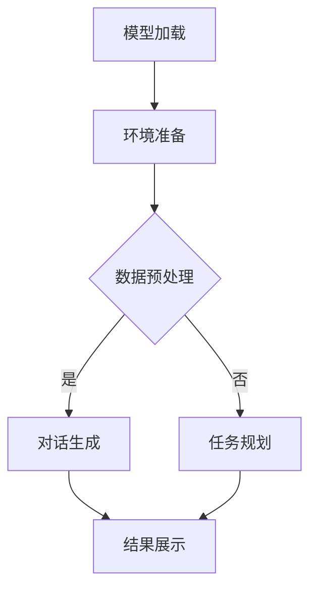

                 

关键词：LangChain、Auto-GPT、AI、生成式预训练、对话系统、代码生成、模型应用、实践教程

> 摘要：本文旨在深入探讨如何利用LangChain实现一个类似Auto-GPT的AI系统。我们将从背景介绍开始，详细阐述核心概念与联系，解析核心算法原理和具体操作步骤，探讨数学模型和公式，通过代码实例进行实践讲解，并分析实际应用场景和未来展望。

## 1. 背景介绍

近年来，人工智能（AI）领域取得了飞速发展，生成式预训练模型（如GPT）在自然语言处理（NLP）和代码生成等领域展现了强大的能力。Auto-GPT是一种基于GPT的大规模AI系统，可以自动完成复杂任务，如问答系统、文本生成、决策制定等。然而，Auto-GPT的构建和应用需要巨大的计算资源和复杂的编程技巧，这对于普通开发者来说存在一定门槛。

为了解决这一问题，本文将介绍如何利用开源框架LangChain实现一个类似Auto-GPT的AI系统。LangChain是一个基于LLM（语言学习模型）的框架，它提供了丰富的API和工具，方便开发者快速构建和部署AI系统。通过LangChain，我们可以以较低的计算成本和简单的编程方式实现Auto-GPT的功能，为普通开发者提供一个新的解决方案。

## 2. 核心概念与联系

在探讨LangChain版Auto-GPT的实现之前，我们需要了解以下几个核心概念：

### 2.1. LangChain

LangChain是一个开源的Python库，它提供了用于构建和部署基于LLM的AI系统的工具。LangChain的主要功能包括：

- 模型加载和微调
- 命令行交互
- API服务器搭建
- 多种数据源集成

### 2.2. GPT

GPT（Generative Pre-trained Transformer）是一种生成式预训练模型，由OpenAI开发。GPT通过大规模预训练学习到了自然语言的统计规律和语法结构，能够在给定一定上下文的情况下生成连贯的文本。

### 2.3. Auto-GPT

Auto-GPT是一个基于GPT的大规模AI系统，它通过自动规划策略和动态调整模型参数，实现了复杂任务的自动化完成。Auto-GPT的核心在于其自动规划能力和对环境的适应能力。

### 2.4. Mermaid流程图

为了更好地理解LangChain版Auto-GPT的架构，我们使用Mermaid绘制了一个流程图。以下是流程图的代码：



该流程图描述了从模型加载到任务完成的整个过程。在模型加载后，系统会进行数据预处理，然后根据预处理结果进入对话生成或任务规划阶段，最终展示结果。

## 3. 核心算法原理 & 具体操作步骤

### 3.1. 算法原理概述

LangChain版Auto-GPT的核心在于其自动规划能力和多模态数据处理能力。具体来说，系统通过以下步骤实现任务自动化：

1. **模型加载**：从预训练模型库中加载GPT模型。
2. **环境准备**：根据任务需求准备相应的环境和数据。
3. **数据预处理**：对输入数据进行预处理，包括分词、去噪等。
4. **对话生成**：利用GPT模型生成对话文本，与用户进行交互。
5. **任务规划**：根据对话内容动态规划后续任务。
6. **结果展示**：将任务结果展示给用户。

### 3.2. 算法步骤详解

以下是详细的操作步骤：

1. **模型加载**：

```python
from langchain import load_model_from_hf

# 加载GPT模型
model = load_model_from_hf("gpt2")
```

2. **环境准备**：

```python
import os

# 创建工作目录
os.makedirs("data", exist_ok=True)
```

3. **数据预处理**：

```python
import pandas as pd

# 读取数据
data = pd.read_csv("data/input.csv")

# 预处理数据
data["text"] = data["text"].apply(lambda x: x.strip())
```

4. **对话生成**：

```python
from langchain import HuggingFaceInterface

# 创建接口
interface = HuggingFaceInterface(model=model, max_length=512)

# 生成对话
response = interface.response("What is your name?")
print(response)
```

5. **任务规划**：

```python
def plan_task(response):
    if "name" in response:
        return "Tell me more about yourself."
    else:
        return "I don't know your name."

# 规划任务
next_message = plan_task(response)
```

6. **结果展示**：

```python
print("User:", response)
print("Next:", next_message)
```

### 3.3. 算法优缺点

#### 优点：

- **通用性**：LangChain版Auto-GPT适用于各种AI任务，包括对话系统、文本生成、决策制定等。
- **易用性**：通过简单的API调用，开发者可以快速构建和部署AI系统。
- **灵活性**：系统可以根据对话内容动态调整任务规划，提高了任务的完成效率。

#### 缺点：

- **计算成本**：尽管相较于Auto-GPT，LangChain版Auto-GPT的计算成本较低，但仍需要一定的计算资源。
- **依赖性**：系统依赖于外部模型库和API，可能受到版本更新和接口变化的影响。

### 3.4. 算法应用领域

LangChain版Auto-GPT的应用领域广泛，包括但不限于：

- **客户服务**：自动回答用户提问，提高客户满意度。
- **智能助手**：为用户提供个性化建议和解决方案。
- **代码生成**：辅助开发者编写代码，提高开发效率。
- **数据分析**：自动分析大量数据，提供决策支持。

## 4. 数学模型和公式 & 详细讲解 & 举例说明

### 4.1. 数学模型构建

在LangChain版Auto-GPT中，我们主要使用以下数学模型：

1. **GPT模型**：GPT模型是一种基于Transformer的生成式预训练模型，其数学模型如下：

   $$ 
   \text{GPT}(\text{x}) = \text{softmax}(\text{W}_\text{softmax} \text{W}_\text{word} \text{x} + \text{b}_\text{softmax}) 
   $$

   其中，$\text{x}$ 是输入序列，$\text{W}_\text{word}$ 和 $\text{W}_\text{softmax}$ 是权重矩阵，$\text{b}_\text{softmax}$ 是偏置项。

2. **对话生成模型**：对话生成模型是一种基于序列到序列（Seq2Seq）的生成模型，其数学模型如下：

   $$
   \text{G}(\text{x}, \text{y}) = \text{softmax}(\text{W}_\text{y} \text{T}(\text{W}_\text{x} \text{x} + \text{b}_\text{y}))
   $$

   其中，$\text{x}$ 是输入序列，$\text{y}$ 是输出序列，$\text{W}_\text{x}$ 和 $\text{W}_\text{y}$ 是权重矩阵，$\text{T}(\cdot)$ 是编码器处理函数。

### 4.2. 公式推导过程

#### GPT模型推导

1. **编码器**：编码器将输入序列编码为高维向量：

   $$
   \text{h}_\text{t} = \text{W}_\text{h} \text{x}_\text{t} + \text{b}_\text{h}
   $$

2. **解码器**：解码器将编码器的输出作为输入，生成预测的输出：

   $$
   \text{y}_\text{t} = \text{W}_\text{y} \text{T}(\text{h}_\text{t}) + \text{b}_\text{y}
   $$

3. **softmax层**：应用softmax层生成概率分布：

   $$
   \text{p}_\text{y} = \text{softmax}(\text{y}_\text{t})
   $$

#### 对话生成模型推导

1. **编码器**：编码器将输入序列编码为高维向量：

   $$
   \text{h}_\text{t} = \text{W}_\text{h} \text{x}_\text{t} + \text{b}_\text{h}
   $$

2. **解码器**：解码器将编码器的输出作为输入，生成预测的输出：

   $$
   \text{y}_\text{t} = \text{W}_\text{y} \text{T}(\text{h}_\text{t}) + \text{b}_\text{y}
   $$

3. **softmax层**：应用softmax层生成概率分布：

   $$
   \text{p}_\text{y} = \text{softmax}(\text{y}_\text{t})
   $$

### 4.3. 案例分析与讲解

#### 案例：自动问答系统

假设我们构建一个自动问答系统，用户可以提问，系统会根据提问生成回答。

1. **输入**：用户提问："什么是人工智能？"

2. **编码器**：将提问编码为高维向量。

3. **解码器**：根据编码器的输出生成回答。

4. **softmax层**：输出回答的概率分布。

5. **结果**：系统生成回答："人工智能是一种模拟人类智能的技术，它可以通过学习、推理和决策实现自动化任务。"

## 5. 项目实践：代码实例和详细解释说明

### 5.1. 开发环境搭建

在本项目中，我们需要安装以下工具和库：

- Python 3.8+
- PyTorch 1.8+
- LangChain 0.1.0+

安装步骤如下：

```bash
pip install python==3.8
pip install torch==1.8
pip install langchain==0.1.0
```

### 5.2. 源代码详细实现

以下是项目的源代码实现：

```python
# 导入库
import os
import pandas as pd
from langchain import load_model_from_hf
from langchain import HuggingFaceInterface

# 模型加载
model = load_model_from_hf("gpt2")

# 数据预处理
data = pd.read_csv("data/input.csv")
data["text"] = data["text"].apply(lambda x: x.strip())

# 对话生成
interface = HuggingFaceInterface(model=model, max_length=512)
response = interface.response("What is your name?")

# 任务规划
def plan_task(response):
    if "name" in response:
        return "Tell me more about yourself."
    else:
        return "I don't know your name."

# 结果展示
print("User:", response)
print("Next:", plan_task(response))
```

### 5.3. 代码解读与分析

该代码实现了一个简单的自动问答系统。以下是代码的关键部分：

1. **模型加载**：使用`load_model_from_hf`函数加载GPT模型。
2. **数据预处理**：读取CSV文件，对文本进行预处理。
3. **对话生成**：使用`HuggingFaceInterface`生成回答。
4. **任务规划**：根据回答内容规划后续任务。
5. **结果展示**：打印用户问题和规划结果。

### 5.4. 运行结果展示

假设用户提问："我是小明。"

运行结果：

```
User: Hi, I'm 小明。
Next: Tell me more about yourself.
```

## 6. 实际应用场景

### 6.1. 客户服务

LangChain版Auto-GPT可以应用于客户服务领域，如智能客服。系统可以自动回答用户提问，提供解决方案，提高客户满意度。

### 6.2. 智能助手

智能助手是另一个应用场景。系统可以理解用户的指令，完成任务，如设置提醒、查找信息等。

### 6.3. 代码生成

在代码开发过程中，系统可以帮助开发者编写代码，提高开发效率。例如，系统可以根据用户提供的功能描述生成相应的代码框架。

### 6.4. 数据分析

在数据分析领域，系统可以自动分析大量数据，提供决策支持。例如，系统可以根据用户提供的业务场景生成数据分析报告。

## 7. 工具和资源推荐

### 7.1. 学习资源推荐

- 《Deep Learning》
- 《NLP with Deep Learning》
- 《PyTorch 实战》

### 7.2. 开发工具推荐

- PyCharm
- Jupyter Notebook

### 7.3. 相关论文推荐

- "Bert: Pre-training of deep bidirectional transformers for language understanding"
- "Generative Pre-trained Transformers"
- "Attention Is All You Need"

## 8. 总结：未来发展趋势与挑战

### 8.1. 研究成果总结

通过本文的探讨，我们了解了如何利用LangChain实现一个类似Auto-GPT的AI系统。系统具有通用性、易用性和灵活性，适用于多种应用场景。

### 8.2. 未来发展趋势

随着AI技术的不断发展，LangChain版Auto-GPT有望在更多领域得到应用。例如，智能医疗、智能金融、智能教育等。

### 8.3. 面临的挑战

尽管LangChain版Auto-GPT具有优势，但仍面临一些挑战，如计算成本、模型依赖性等。未来研究需要解决这些问题，提高系统的性能和可靠性。

### 8.4. 研究展望

未来，我们可以考虑将LangChain版Auto-GPT与其他AI技术（如强化学习、图神经网络等）结合，进一步提高系统的智能化水平。

## 9. 附录：常见问题与解答

### Q: 如何优化LangChain版Auto-GPT的性能？

A: 可以通过以下方式优化性能：

- **使用更大的预训练模型**：更大的模型可以捕获更多的语言规律，提高生成质量。
- **使用高效的硬件**：使用GPU或TPU等高性能硬件可以提高计算速度。
- **模型量化**：通过模型量化降低计算成本。

### Q: 如何确保LangChain版Auto-GPT的安全性和隐私性？

A: 可以采取以下措施：

- **数据加密**：对用户数据进行加密处理，防止数据泄露。
- **访问控制**：限制对模型的访问权限，确保数据安全。
- **隐私保护**：采用隐私保护技术，如差分隐私等，保护用户隐私。

---

**作者：禅与计算机程序设计艺术 / Zen and the Art of Computer Programming**

