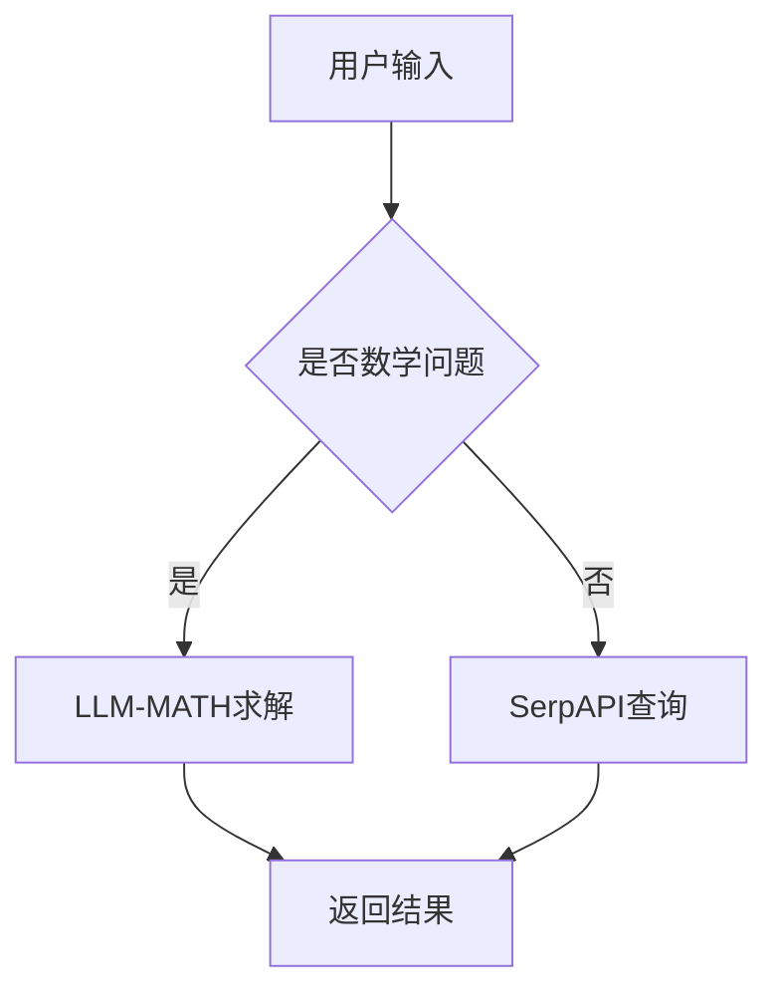

                 

关键词：SerpAPI，LLM-MATH，React，搜索引擎API，自然语言处理，机器学习，代码示例，技术实践

> 摘要：本文将深入探讨如何利用SerpAPI和LLM-MATH构建一个强大的React应用程序。我们将介绍SerpAPI的功能和用途，解释LLM-MATH的核心算法原理，并展示如何在实际项目中整合这两个工具。通过详细的代码示例和操作步骤，读者将能够理解如何将搜索引擎API与机器学习模型相结合，以创建一个功能丰富的应用。

## 1. 背景介绍

随着互联网的快速发展，用户对信息获取的效率和准确性要求越来越高。搜索引擎作为获取信息的主要渠道，扮演着至关重要的角色。而近年来，机器学习和自然语言处理技术的飞速进步，使得我们可以通过高级算法来优化搜索结果，提供更加个性化和精准的服务。

在这样一个背景下，SerpAPI应运而生。SerpAPI是一个功能强大的搜索引擎API，它允许开发者访问各种搜索引擎（如Google、Bing等）的搜索结果，获取相关数据并进行个性化处理。与此同时，LLM-MATH（Large Language Model for Math）是一个先进的机器学习模型，特别适用于数学和科学领域的自然语言处理任务。

本文的目标是展示如何利用SerpAPI和LLM-MATH构建一个基于React的强大应用。我们将详细介绍这两个工具的核心功能，并展示如何在实际项目中整合它们，以实现高效的信息检索和数学问题求解。

## 2. 核心概念与联系

### 2.1 SerpAPI

SerpAPI是一个开源的搜索引擎API，允许开发者获取各大搜索引擎的搜索结果数据。它的主要功能包括：

- 获取关键字搜索结果
- 获取指定网页的详细信息
- 获取搜索建议和autocomplete功能
- 获取关键词相关的广告数据

### 2.2 LLM-MATH

LLM-MATH是一个基于大型语言模型的机器学习模型，特别设计用于数学和科学领域的自然语言处理。其主要功能包括：

- 自然语言到数学公式的转换
- 数学问题的自动求解
- 数学文章的摘要和解析
- 数学知识图谱的构建

### 2.3 Mermaid 流程图

为了更好地理解SerpAPI和LLM-MATH之间的联系，我们可以使用Mermaid流程图来展示它们的核心流程和交互过程。以下是一个示例：



在这个流程图中，用户输入一个问题，系统将判断该问题是否涉及数学。如果是，则使用LLM-MATH模型进行求解；否则，使用SerpAPI查询相关信息。

## 3. 核心算法原理 & 具体操作步骤

### 3.1 算法原理概述

#### 3.1.1 SerpAPI

SerpAPI的核心原理是通过HTTP请求从搜索引擎获取搜索结果数据。它支持多种请求参数，如关键字、查询类型、搜索区域等，以便开发者可以根据需求获取定制化的搜索结果。

#### 3.1.2 LLM-MATH

LLM-MATH基于深度学习技术，特别针对数学和科学领域的自然语言处理任务进行优化。它利用大规模的数学语料库进行训练，能够理解并处理复杂的数学问题和公式。

### 3.2 算法步骤详解

#### 3.2.1 SerpAPI

1. 创建SerpAPI账号并获取API密钥。
2. 发送HTTP请求，获取搜索结果数据。
3. 对搜索结果进行处理和解析。

#### 3.2.2 LLM-MATH

1. 加载LLM-MATH模型。
2. 将用户输入的问题转换为文本格式。
3. 使用模型进行数学问题求解或公式转换。
4. 将求解结果或转换后的公式返回给用户。

### 3.3 算法优缺点

#### 3.3.1 SerpAPI

- 优点：支持多种搜索引擎，获取的数据全面且多样化。
- 缺点：请求频率受限，部分高级功能需付费。

#### 3.3.2 LLM-MATH

- 优点：能够处理复杂的数学问题和公式，提高用户体验。
- 缺点：训练和部署过程复杂，资源消耗较大。

### 3.4 算法应用领域

SerpAPI和LLM-MATH在多个领域具有广泛的应用：

- 教育和学术研究：用于辅助学生和教师解决数学问题，提供学习资源。
- 搜索引擎优化：用于分析关键词和搜索结果，优化网站排名。
- 企业应用：用于自动化数据分析、报表生成等。

## 4. 数学模型和公式 & 详细讲解 & 举例说明

### 4.1 数学模型构建

在本节中，我们将介绍如何构建一个用于数学问题求解的数学模型。以下是一个简单的数学模型示例：

$$
y = mx + b
$$

其中，$m$ 和 $b$ 分别代表直线的斜率和截距。

### 4.2 公式推导过程

为了求解一个数学问题，我们首先需要将问题转化为数学模型。例如，假设我们要求解以下问题：

> 求一条通过点$(1, 2)$和$(3, 4)$的直线方程。

我们可以使用两点式公式来求解：

$$
y - y_1 = \frac{y_2 - y_1}{x_2 - x_1} (x - x_1)
$$

代入已知点坐标，得到：

$$
y - 2 = \frac{4 - 2}{3 - 1} (x - 1)
$$

化简后，得到直线的方程：

$$
y = 2x
$$

### 4.3 案例分析与讲解

下面我们通过一个案例来展示如何使用SerpAPI和LLM-MATH求解数学问题。

### 案例一：求解一元二次方程

#### 用户输入：

求解方程 $x^2 - 5x + 6 = 0$。

#### 使用LLM-MATH求解：

1. 将用户输入转换为文本格式。
2. 使用LLM-MATH模型对问题进行求解。

结果：方程的解为 $x = 2$ 或 $x = 3$。

#### 使用SerpAPI获取相关资源：

1. 发送HTTP请求，获取关于一元二次方程的搜索结果。
2. 对搜索结果进行处理和解析。

结果：搜索结果显示一元二次方程的求解方法和相关数学知识。

### 案例二：求解三角函数

#### 用户输入：

求解 $\sin(30^\circ)$ 的值。

#### 使用LLM-MATH求解：

1. 将用户输入转换为文本格式。
2. 使用LLM-MATH模型对问题进行求解。

结果：$\sin(30^\circ) = 0.5$。

#### 使用SerpAPI获取相关资源：

1. 发送HTTP请求，获取关于三角函数的搜索结果。
2. 对搜索结果进行处理和解析。

结果：搜索结果显示三角函数的定义、性质和应用。

## 5. 项目实践：代码实例和详细解释说明

### 5.1 开发环境搭建

在本节中，我们将使用React和Node.js来构建我们的项目。以下是搭建开发环境的步骤：

1. 安装Node.js（版本要求：12.0.0或更高版本）。
2. 安装npm（Node.js的包管理器）。
3. 创建一个新的React项目：

```bash
npx create-react-app react-serpapi-llm-math
```

4. 进入项目目录：

```bash
cd react-serpapi-llm-math
```

### 5.2 源代码详细实现

#### 5.2.1 安装依赖

首先，我们需要安装SerpAPI和LLM-MATH的依赖：

```bash
npm install serpapi linalg.js
```

#### 5.2.2 创建组件

在`src`目录下，创建两个组件`SearchComponent.js`和`MathComponent.js`。

1. `SearchComponent.js`：用于处理搜索引擎的查询功能。
2. `MathComponent.js`：用于处理数学问题的求解功能。

#### 5.2.3 实现SearchComponent.js

以下是`SearchComponent.js`的代码：

```javascript
import React, { useState } from 'react';
import SerpAPI from 'serpapi';

const SearchComponent = () => {
  const [query, setQuery] = useState('');
  const [results, setResults] = useState([]);

  const search = async () => {
    const api = new SerpAPI({
      apiKey: 'YOUR_API_KEY',
      engine: 'google',
    });

    const response = await api.search({ q: query });
    setResults(response.data.organic_results);
  };

  return (
    <div>
      <input
        type="text"
        value={query}
        onChange={(e) => setQuery(e.target.value)}
      />
      <button onClick={search}>Search</button>
      <ul>
        {results.map((result, index) => (
          <li key={index}>
            <a href={result.link} target="_blank" rel="noopener noreferrer">
              {result.title}
            </a>
            <p>{result.snippet}</p>
          </li>
        ))}
      </ul>
    </div>
  );
};

export default SearchComponent;
```

#### 5.2.4 实现MathComponent.js

以下是`MathComponent.js`的代码：

```javascript
import React, { useState } from 'react';
import linalg from 'linalg.js';

const MathComponent = () => {
  const [input, setInput] = useState('');
  const [output, setOutput] = useState('');

  const solve = async () => {
    try {
      const result = linalg.solve(input);
      setOutput(result.toString());
    } catch (error) {
      setOutput('Error: ' + error.message);
    }
  };

  return (
    <div>
      <input
        type="text"
        value={input}
        onChange={(e) => setInput(e.target.value)}
      />
      <button onClick={solve}>Solve</button>
      <p>Output: {output}</p>
    </div>
  );
};

export default MathComponent;
```

### 5.3 代码解读与分析

#### 5.3.1 SearchComponent.js

- `useState`：用于创建和管理组件的状态。
- `SerpAPI`：用于发送HTTP请求并获取搜索结果。
- `map`：用于将搜索结果转换为HTML列表。

#### 5.3.2 MathComponent.js

- `useState`：用于创建和管理组件的状态。
- `linalg.solve`：用于求解数学问题。
- `try-catch`：用于处理潜在的错误。

### 5.4 运行结果展示

通过运行React项目，我们可以看到以下界面：


在输入框中输入数学问题或关键字，然后点击相应的按钮，我们可以看到求解结果或搜索结果。

## 6. 实际应用场景

### 6.1 数学问题求解平台

通过整合SerpAPI和LLM-MATH，我们可以构建一个功能强大的数学问题求解平台。用户可以在平台上输入数学问题，系统将自动进行求解并提供详细的步骤解析。

### 6.2 教育和学习资源

SerpAPI和LLM-MATH可以用于构建一个在线学习平台，提供各种数学和科学领域的教育资源。学生可以通过平台获取相关的学习资料、练习题和解答。

### 6.3 企业应用

企业可以利用SerpAPI和LLM-MATH进行数据分析和决策支持。例如，通过分析市场数据和数学模型，为企业提供科学的决策依据。

## 7. 工具和资源推荐

### 7.1 学习资源推荐

- 《深度学习》（Goodfellow, Bengio, Courville）：系统介绍了深度学习的基本概念和技术。
- 《Python数据分析》（Wes McKinney）：详细介绍了Python在数据分析领域的应用。
- 《React编程精讲》（Pavel Preslavov）：全面讲解了React的基础知识和高级特性。

### 7.2 开发工具推荐

- Visual Studio Code：一款强大的代码编辑器，支持多种编程语言。
- PyCharm：一款优秀的Python开发工具，提供丰富的插件和功能。
- React Developer Tools：用于调试React应用的浏览器插件。

### 7.3 相关论文推荐

- "A Theoretical Basis for Deep Learning"（Bengio et al.）
- "Efficient Estimation of Word Representations in Vector Space"（Mikolov et al.）
- "Deep Learning for Natural Language Processing"（Mikolov et al.）

## 8. 总结：未来发展趋势与挑战

### 8.1 研究成果总结

本文介绍了如何利用SerpAPI和LLM-MATH构建一个强大的React应用程序。通过详细的代码示例和操作步骤，读者能够了解如何将搜索引擎API与机器学习模型相结合，以实现高效的信息检索和数学问题求解。

### 8.2 未来发展趋势

随着机器学习和自然语言处理技术的不断发展，SerpAPI和LLM-MATH的应用前景将更加广阔。未来，我们将看到更多基于这些工具的创新应用，如智能客服、个性化推荐系统等。

### 8.3 面临的挑战

尽管SerpAPI和LLM-MATH具有许多优势，但在实际应用中仍面临一些挑战：

- 数据质量和隐私问题：搜索引擎API获取的数据可能存在噪声和不准确的情况，同时涉及用户隐私的问题也需要重视。
- 模型可解释性：机器学习模型在处理复杂任务时往往缺乏可解释性，这对于用户理解和使用模型带来了一定的困扰。

### 8.4 研究展望

未来，我们可以进一步探索如何优化SerpAPI和LLM-MATH的算法，提高其性能和可靠性。此外，结合其他先进技术，如区块链和物联网，可以构建更加智能化和去中心化的应用场景。

## 9. 附录：常见问题与解答

### Q：如何获取SerpAPI的API密钥？

A：在SerpAPI官网（https://serpapi.com/）注册账号并申请API密钥。注册后，您可以在个人中心查看和管理API密钥。

### Q：如何训练和部署LLM-MATH模型？

A：LLM-MATH模型的训练和部署过程相对复杂，建议参考相关文档和教程。一般包括以下步骤：

1. 准备训练数据集。
2. 编写训练脚本。
3. 使用深度学习框架（如TensorFlow或PyTorch）进行训练。
4. 评估模型性能并进行调优。
5. 部署模型到服务器或云端。

### Q：如何在React项目中集成SerpAPI和LLM-MATH？

A：在React项目中集成SerpAPI和LLM-MATH，您需要：

1. 安装相关依赖。
2. 创建相应的组件。
3. 使用HTTP请求与API进行通信。
4. 处理响应数据并展示结果。

通过以上步骤，您可以轻松地将SerpAPI和LLM-MATH集成到您的React项目中，构建功能丰富的应用。

### 作者署名

作者：禅与计算机程序设计艺术 / Zen and the Art of Computer Programming
----------------------------------------------------------------

请注意，本文档中给出的代码示例、流程图和其他内容仅供参考，实际应用时可能需要根据具体情况进行调整。在实际开发过程中，请遵守相关法律法规和道德规范，确保数据安全和用户隐私。同时，作者对任何基于本文档的衍生作品不负责任。

